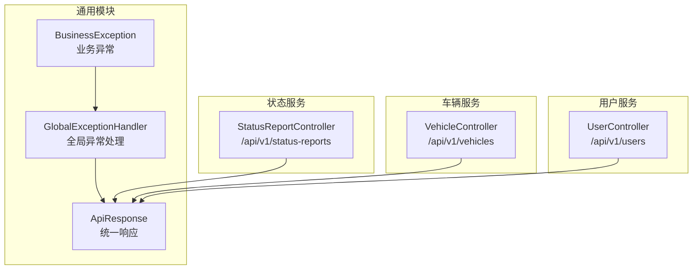
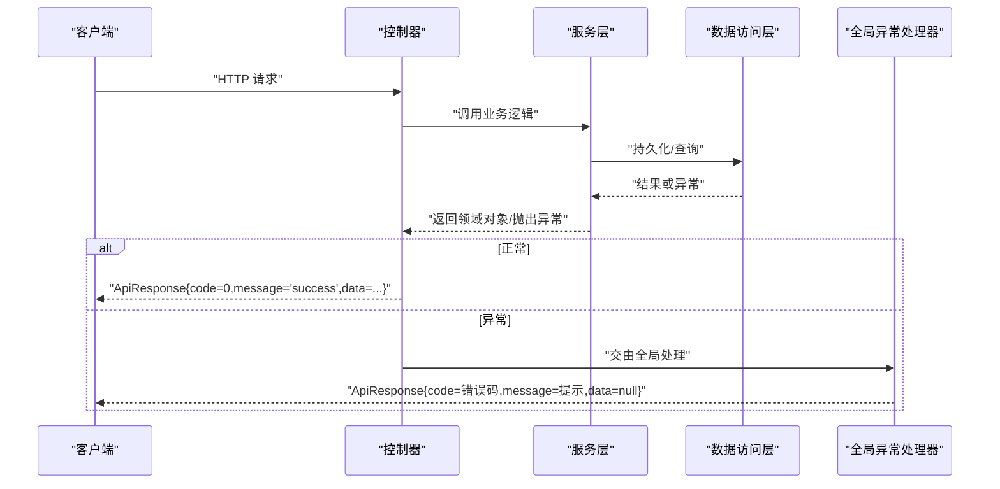
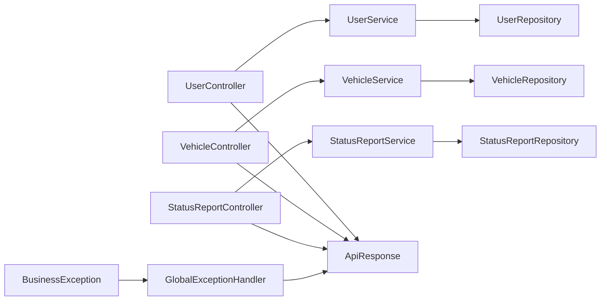

# API接口文档

<cite>
**本文引用的文件**
- [ApiResponse.java](file://vehicle-common/src/main/java/com/wenjie/cloud/common/dto/ApiResponse.java)
- [GlobalExceptionHandler.java](file://vehicle-common/src/main/java/com/wenjie/cloud/common/exception/GlobalExceptionHandler.java)
- [BusinessException.java](file://vehicle-common/src/main/java/com/wenjie/cloud/common/exception/BusinessException.java)
- [UserController.java](file://user-service/src/main/java/com/wenjie/cloud/user/controller/UserController.java)
- [UserDTO.java](file://user-service/src/main/java/com/wenjie/cloud/user/dto/UserDTO.java)
- [application.yml（用户服务）](file://user-service/src/main/resources/application.yml)
- [VehicleController.java](file://vehicle-service/src/main/java/com/wenjie/cloud/vehicle/controller/VehicleController.java)
- [VehicleDTO.java](file://vehicle-service/src/main/java/com/wenjie/cloud/vehicle/dto/VehicleDTO.java)
- [application.yml（车辆服务）](file://vehicle-service/src/main/resources/application.yml)
- [StatusReportController.java](file://vehicle-status-service/src/main/java/com/wenjie/cloud/vehiclestatus/controller/StatusReportController.java)
- [StatusReportDTO.java](file://vehicle-status-service/src/main/java/com/wenjie/cloud/vehiclestatus/dto/StatusReportDTO.java)
- [StatusReportVO.java](file://vehicle-status-service/src/main/java/com/wenjie/cloud/vehiclestatus/dto/StatusReportVO.java)
- [application.yml（状态服务）](file://vehicle-status-service/src/main/resources/application.yml)
- [userApi.js](file://vehicle-ui/src/api/userApi.js)
- [vehicleApi.js](file://vehicle-ui/src/api/vehicleApi.js)
</cite>

## 目录
1. [简介](#简介)
2. [项目结构](#项目结构)
3. [核心组件](#核心组件)
4. [架构总览](#架构总览)
5. [详细组件分析](#详细组件分析)
6. [依赖分析](#依赖分析)
7. [性能考虑](#性能考虑)
8. [故障排查指南](#故障排查指南)
9. [结论](#结论)
10. [附录](#附录)

## 简介
本文件为车联网云平台的完整API接口文档，覆盖用户管理、车辆管理和状态监控三大服务。文档遵循RESTful风格，统一返回格式为 ApiResponse，包含统一的错误码与提示语义；同时提供请求与响应示例、错误码说明、认证与安全建议、最佳实践与性能优化建议，以及版本管理与兼容性策略。

## 项目结构
- 用户服务：提供用户增删改查接口，端口8082，默认内存数据库。
- 车辆服务：提供车辆增删改查接口，端口8080，默认内存数据库。
- 状态服务：提供状态上报、历史查询与最新状态查询接口，端口8083，默认内存数据库。
- 通用模块：统一响应体、全局异常处理与业务异常定义。

**图表来源**
- [UserController.java:21-60](file://user-service/src/main/java/com/wenjie/cloud/user/controller/UserController.java#L21-L60)
- [VehicleController.java:21-61](file://vehicle-service/src/main/java/com/wenjie/cloud/vehicle/controller/VehicleController.java#L21-L61)
- [StatusReportController.java:26-71](file://vehicle-status-service/src/main/java/com/wenjie/cloud/vehiclestatus/controller/StatusReportController.java#L26-L71)
- [ApiResponse.java:12-52](file://vehicle-common/src/main/java/com/wenjie/cloud/common/dto/ApiResponse.java#L12-L52)
- [GlobalExceptionHandler.java:19-56](file://vehicle-common/src/main/java/com/wenjie/cloud/common/exception/GlobalExceptionHandler.java#L19-L56)
- [BusinessException.java:11-27](file://vehicle-common/src/main/java/com/wenjie/cloud/common/exception/BusinessException.java#L11-L27)

**章节来源**
- [application.yml（用户服务）:1-40](file://user-service/src/main/resources/application.yml#L1-L40)
- [application.yml（车辆服务）:1-40](file://vehicle-service/src/main/resources/application.yml#L1-L40)
- [application.yml（状态服务）:1-30](file://vehicle-status-service/src/main/resources/application.yml#L1-L30)

## 核心组件
- 统一响应体 ApiResponse<T>
  - 字段：code（业务状态码，0表示成功）、message（提示信息）、data（响应数据）、timestamp（响应时间戳）。
  - 成功/失败静态工厂方法用于快速构造标准响应。
- 全局异常处理 GlobalExceptionHandler
  - 捕获业务异常、参数校验异常与未知异常，统一转为 ApiResponse 格式返回。
- 业务异常 BusinessException
  - 业务侧自定义错误码与消息，便于前端与客户端一致化处理。

**章节来源**
- [ApiResponse.java:12-52](file://vehicle-common/src/main/java/com/wenjie/cloud/common/dto/ApiResponse.java#L12-L52)
- [GlobalExceptionHandler.java:19-56](file://vehicle-common/src/main/java/com/wenjie/cloud/common/exception/GlobalExceptionHandler.java#L19-L56)
- [BusinessException.java:11-27](file://vehicle-common/src/main/java/com/wenjie/cloud/common/exception/BusinessException.java#L11-L27)

## 架构总览
各服务控制器通过Spring MVC暴露REST接口，统一返回 ApiResponse；异常在全局处理器中拦截并标准化输出。

**图表来源**
- [UserController.java:21-60](file://user-service/src/main/java/com/wenjie/cloud/user/controller/UserController.java#L21-L60)
- [VehicleController.java:21-61](file://vehicle-service/src/main/java/com/wenjie/cloud/vehicle/controller/VehicleController.java#L21-L61)
- [StatusReportController.java:26-71](file://vehicle-status-service/src/main/java/com/wenjie/cloud/vehiclestatus/controller/StatusReportController.java#L26-L71)
- [GlobalExceptionHandler.java:19-56](file://vehicle-common/src/main/java/com/wenjie/cloud/common/exception/GlobalExceptionHandler.java#L19-L56)

## 详细组件分析

### 用户管理 API
- 基础路径：/api/v1/users
- 控制器：UserController

接口一览
- POST /api/v1/users
  - 功能：创建用户
  - 请求体：UserDTO（name、phone）
  - 响应：ApiResponse<UserDTO>
  - 示例请求（JSON）：见“附录/请求示例”
  - 示例响应（成功）：见“附录/响应示例”
  - 示例响应（失败）：见“附录/错误响应示例”

- GET /api/v1/users/{id}
  - 功能：按ID查询用户
  - 路径参数：id（Long）
  - 响应：ApiResponse<UserDTO>

- GET /api/v1/users
  - 功能：查询用户列表
  - 响应：ApiResponse<List<UserDTO>>

- DELETE /api/v1/users/{id}
  - 功能：删除用户
  - 路径参数：id（Long）
  - 响应：ApiResponse<Void>

请求参数与约束
- UserDTO
  - name：非空
  - phone：非空，11位数字格式

统一响应与错误码
- 成功：code=0，message="success"
- 参数校验失败：code=400，message=字段错误拼接
- 业务异常：code=业务自定义错误码，message=异常描述
- 未知异常：code=500，message="系统内部错误"

前端调用参考
- 参考文件：vehicle-ui/src/api/userApi.js

**章节来源**
- [UserController.java:21-60](file://user-service/src/main/java/com/wenjie/cloud/user/controller/UserController.java#L21-L60)
- [UserDTO.java:11-25](file://user-service/src/main/java/com/wenjie/cloud/user/dto/UserDTO.java#L11-L25)
- [userApi.js:1-20](file://vehicle-ui/src/api/userApi.js#L1-L20)
- [application.yml（用户服务）:1-40](file://user-service/src/main/resources/application.yml#L1-L40)

### 车辆管理 API
- 基础路径：/api/v1/vehicles
- 控制器：VehicleController

接口一览
- POST /api/v1/vehicles
  - 功能：创建车辆
  - 请求体：VehicleDTO（vin、model、ownerUserId）
  - 响应：ApiResponse<VehicleDTO>

- GET /api/v1/vehicles/{id}
  - 功能：按ID查询车辆
  - 路径参数：id（Long）
  - 响应：ApiResponse<VehicleDTO>

- GET /api/v1/vehicles
  - 功能：查询车辆列表
  - 响应：ApiResponse<List<VehicleDTO>>

- DELETE /api/v1/vehicles/{id}
  - 功能：删除车辆
  - 路径参数：id（Long）
  - 响应：ApiResponse<Void>

请求参数与约束
- VehicleDTO
  - vin：非空，必须为17位
  - model：非空
  - ownerUserId：可选（关联车主）

统一响应与错误码
- 成功：code=0，message="success"
- 参数校验失败：code=400，message=字段错误拼接
- 业务异常：code=业务自定义错误码
- 未知异常：code=500

前端调用参考
- 参考文件：vehicle-ui/src/api/vehicleApi.js

**章节来源**
- [VehicleController.java:21-61](file://vehicle-service/src/main/java/com/wenjie/cloud/vehicle/controller/VehicleController.java#L21-L61)
- [VehicleDTO.java:11-28](file://vehicle-service/src/main/java/com/wenjie/cloud/vehicle/dto/VehicleDTO.java#L11-L28)
- [vehicleApi.js:1-20](file://vehicle-ui/src/api/vehicleApi.js#L1-L20)
- [application.yml（车辆服务）:1-40](file://vehicle-service/src/main/resources/application.yml#L1-L40)

### 状态监控 API
- 基础路径：/api/v1/status-reports
- 控制器：StatusReportController

接口一览
- POST /api/v1/status-reports
  - 功能：上报车辆状态
  - 请求体：StatusReportDTO（vin、batteryLevel、latitude、longitude、mileage、speed、temperature、reportTime）
  - 响应：ApiResponse<StatusReportVO>

- GET /api/v1/status-reports?vin={}&startTime={}&endTime={}&page={}&size={}
  - 功能：按VIN与时间范围分页查询历史
  - 查询参数：vin（String）、startTime（Instant）、endTime（Instant）、page（int，默认0）、size（int，默认20）
  - 响应：ApiResponse<Page<StatusReportVO>>

- GET /api/v1/status-reports/latest/{vin}
  - 功能：查询某辆车最新状态
  - 路径参数：vin（String）
  - 响应：ApiResponse<StatusReportVO>

- GET /api/v1/status-reports/latest
  - 功能：查询所有车辆各自最新状态
  - 响应：ApiResponse<List<StatusReportVO>>

请求参数与约束
- StatusReportDTO
  - vin：非空，必须为17位
  - batteryLevel：非空，0~100
  - latitude：非空，-90~90
  - longitude：非空，-180~180
  - mileage/speed/temperature：非空，里程与车速需≥0
  - reportTime：非空（时间戳）

统一响应与错误码
- 成功：code=0，message="success"
- 参数校验失败：code=400
- 业务异常：code=业务自定义错误码
- 未知异常：code=500

**章节来源**
- [StatusReportController.java:26-71](file://vehicle-status-service/src/main/java/com/wenjie/cloud/vehiclestatus/controller/StatusReportController.java#L26-L71)
- [StatusReportDTO.java:17-61](file://vehicle-status-service/src/main/java/com/wenjie/cloud/vehiclestatus/dto/StatusReportDTO.java#L17-L61)
- [StatusReportVO.java:11-42](file://vehicle-status-service/src/main/java/com/wenjie/cloud/vehiclestatus/dto/StatusReportVO.java#L11-L42)
- [application.yml（状态服务）:1-30](file://vehicle-status-service/src/main/resources/application.yml#L1-L30)

## 依赖分析
- 控制器依赖服务层，服务层依赖数据访问层，异常处理横切于所有控制器之上。
- 统一响应体与异常处理在通用模块中集中实现，避免重复代码。

**图表来源**
- [UserController.java:21-60](file://user-service/src/main/java/com/wenjie/cloud/user/controller/UserController.java#L21-L60)
- [VehicleController.java:21-61](file://vehicle-service/src/main/java/com/wenjie/cloud/vehicle/controller/VehicleController.java#L21-L61)
- [StatusReportController.java:26-71](file://vehicle-status-service/src/main/java/com/wenjie/cloud/vehiclestatus/controller/StatusReportController.java#L26-L71)
- [ApiResponse.java:12-52](file://vehicle-common/src/main/java/com/wenjie/cloud/common/dto/ApiResponse.java#L12-L52)
- [GlobalExceptionHandler.java:19-56](file://vehicle-common/src/main/java/com/wenjie/cloud/common/exception/GlobalExceptionHandler.java#L19-L56)
- [BusinessException.java:11-27](file://vehicle-common/src/main/java/com/wenjie/cloud/common/exception/BusinessException.java#L11-L27)

## 性能考虑
- 分页查询：状态历史查询支持分页与排序，建议合理设置page与size，避免一次性拉取过多数据。
- 时间范围：状态历史查询需提供明确的开始与结束时间，减少全量扫描。
- 数据校验前置：DTO参数校验在进入业务逻辑前完成，降低无效请求对后端的压力。
- 缓存策略：对于“最新状态”等热点读取，可在服务层引入缓存以降低数据库压力（建议在生产环境评估）。
- 并发与事务：批量上报场景建议采用异步或批处理方式，避免阻塞主线程。

## 故障排查指南
- 参数校验失败
  - 现象：返回code=400，message为字段错误拼接。
  - 排查：检查请求体字段是否满足DTO约束（如长度、范围、格式）。
- 业务异常
  - 现象：返回code为业务自定义错误码，message为异常描述。
  - 排查：查看服务日志定位具体业务规则触发点。
- 未知异常
  - 现象：返回code=500，message="系统内部错误"。
  - 排查：查看服务端日志，确认是否存在未捕获异常或数据库连接问题。
- 前端调用
  - 参考：vehicle-ui/src/api/userApi.js、vehicle-ui/src/api/vehicleApi.js

**章节来源**
- [GlobalExceptionHandler.java:19-56](file://vehicle-common/src/main/java/com/wenjie/cloud/common/exception/GlobalExceptionHandler.java#L19-L56)
- [BusinessException.java:11-27](file://vehicle-common/src/main/java/com/wenjie/cloud/common/exception/BusinessException.java#L11-L27)
- [userApi.js:1-20](file://vehicle-ui/src/api/userApi.js#L1-L20)
- [vehicleApi.js:1-20](file://vehicle-ui/src/api/vehicleApi.js#L1-L20)

## 结论
本API体系以统一响应体与全局异常处理为核心，确保前后端交互的一致性与可观测性；用户、车辆与状态三类资源的REST接口清晰覆盖了增删改查与查询场景。建议在生产环境中补充鉴权、限流、熔断与缓存等治理能力，并持续演进版本与兼容策略。

## 附录

### 统一响应格式与使用规范
- 字段说明
  - code：业务状态码，0表示成功；非0表示失败，需结合message理解错误原因。
  - message：人类可读的提示信息。
  - data：实际响应数据，可能为单对象、数组或null。
  - timestamp：响应时间戳（UTC秒）。
- 使用规范
  - 成功响应：code=0，message="success"，data为具体对象或数组。
  - 失败响应：根据异常类型返回相应code与message，data=null。

**章节来源**
- [ApiResponse.java:12-52](file://vehicle-common/src/main/java/com/wenjie/cloud/common/dto/ApiResponse.java#L12-L52)

### 错误码说明
- 400：参数校验失败（字段缺失、格式错误、越界等）
- 业务自定义错误码：由业务异常抛出，message为具体业务错误描述
- 500：系统内部错误

**章节来源**
- [GlobalExceptionHandler.java:26-54](file://vehicle-common/src/main/java/com/wenjie/cloud/common/exception/GlobalExceptionHandler.java#L26-L54)
- [BusinessException.java:11-27](file://vehicle-common/src/main/java/com/wenjie/cloud/common/exception/BusinessException.java#L11-L27)

### 认证机制、权限控制与安全考虑
- 当前仓库未包含认证与授权相关实现，建议在网关或服务入口增加如下能力：
  - 认证：基于JWT或API Key进行身份鉴别。
  - 权限：基于角色/资源的RBAC模型，限制对敏感资源的操作。
  - 安全：HTTPS传输、参数过滤与转义、SQL注入与XSS防护、CORS配置、速率限制与熔断。

### API版本管理与向后兼容
- 版本策略
  - 路径版本：/api/v1/...，便于URL层面区分版本。
  - 语义化版本：v1.x.y，主版本号变更时才引入破坏性改动。
- 兼容性建议
  - 新增字段时保持可选，避免破坏旧客户端。
  - 删除字段时先标记废弃，保留至少一个版本再移除。
  - 修改字段语义时提供迁移指南与过渡期。

### 请求与响应示例
- 用户管理
  - 创建用户
    - 请求：POST /api/v1/users
    - 请求体（JSON）：包含name、phone
    - 成功响应：ApiResponse{code=0,message="success",data=UserDTO}
    - 失败响应：ApiResponse{code=400或业务错误码,message=描述}
- 车辆管理
  - 创建车辆
    - 请求：POST /api/v1/vehicles
    - 请求体（JSON）：包含vin、model、ownerUserId（可选）
    - 成功响应：ApiResponse{code=0,message="success",data=VehicleDTO}
- 状态监控
  - 上报状态
    - 请求：POST /api/v1/status-reports
    - 请求体（JSON）：包含vin、batteryLevel、latitude、longitude、mileage、speed、temperature、reportTime
    - 成功响应：ApiResponse{code=0,message="success",data=StatusReportVO}
  - 历史查询
    - 请求：GET /api/v1/status-reports?vin={}&startTime={}&endTime={}&page={}&size={}
    - 成功响应：ApiResponse{code=0,message="success",data=Page<StatusReportVO>}
  - 最新状态
    - 请求：GET /api/v1/status-reports/latest/{vin}
    - 成功响应：ApiResponse{code=0,message="success",data=StatusReportVO}
    - 请求：GET /api/v1/status-reports/latest
    - 成功响应：ApiResponse{code=0,message="success",data=[...]}
- 统一错误响应
  - 参数校验失败：ApiResponse{code=400,message="字段: 错误描述; ..."}
  - 业务异常：ApiResponse{code=业务错误码,message="业务描述"}
  - 未知异常：ApiResponse{code=500,message="系统内部错误"}

**章节来源**
- [UserController.java:21-60](file://user-service/src/main/java/com/wenjie/cloud/user/controller/UserController.java#L21-L60)
- [VehicleController.java:21-61](file://vehicle-service/src/main/java/com/wenjie/cloud/vehicle/controller/VehicleController.java#L21-L61)
- [StatusReportController.java:26-71](file://vehicle-status-service/src/main/java/com/wenjie/cloud/vehiclestatus/controller/StatusReportController.java#L26-L71)
- [UserDTO.java:11-25](file://user-service/src/main/java/com/wenjie/cloud/user/dto/UserDTO.java#L11-L25)
- [VehicleDTO.java:11-28](file://vehicle-service/src/main/java/com/wenjie/cloud/vehicle/dto/VehicleDTO.java#L11-L28)
- [StatusReportDTO.java:17-61](file://vehicle-status-service/src/main/java/com/wenjie/cloud/vehiclestatus/dto/StatusReportDTO.java#L17-L61)
- [StatusReportVO.java:11-42](file://vehicle-status-service/src/main/java/com/wenjie/cloud/vehiclestatus/dto/StatusReportVO.java#L11-L42)
- [GlobalExceptionHandler.java:26-54](file://vehicle-common/src/main/java/com/wenjie/cloud/common/exception/GlobalExceptionHandler.java#L26-L54)

### 最佳实践与性能优化建议
- 前端调用
  - 使用封装好的API模块（如userApi.js、vehicleApi.js）统一处理基础路径与错误处理。
- 后端优化
  - 对高频查询（如最新状态）引入缓存。
  - 对批量上报采用异步或批处理，降低延迟。
  - 合理设置分页大小，避免超大数据集返回。
- 安全加固
  - 在网关层统一鉴权与限流。
  - 对输入参数严格校验，避免注入风险。
  - 开启HTTPS与必要的WAF防护。