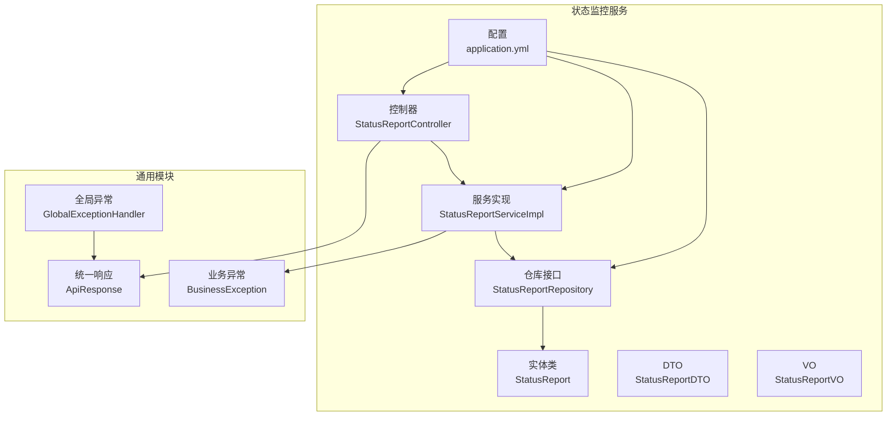
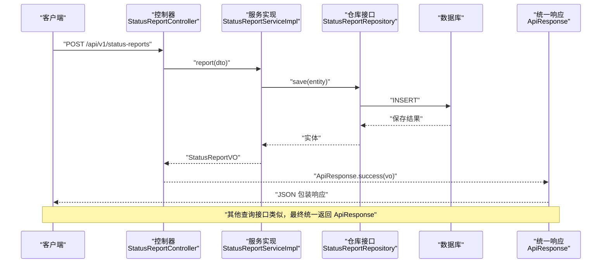
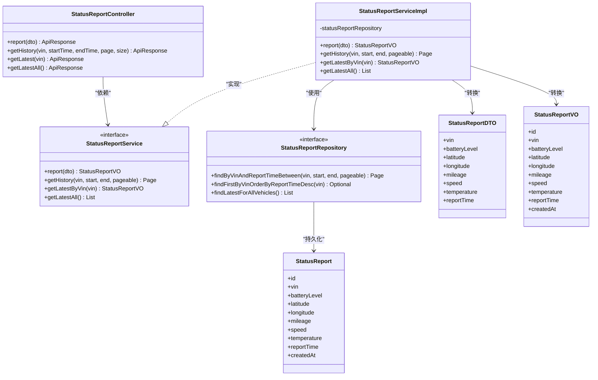
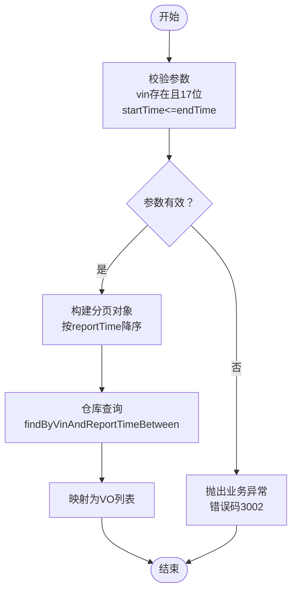
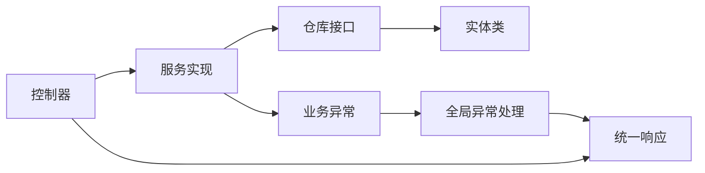

# 状态监控API

<cite>
**本文引用的文件**
- [StatusReportController.java](file://vehicle-status-service/src/main/java/com/wenjie/cloud/vehiclestatus/controller/StatusReportController.java)
- [StatusReportService.java](file://vehicle-status-service/src/main/java/com/wenjie/cloud/vehiclestatus/service/StatusReportService.java)
- [StatusReportServiceImpl.java](file://vehicle-status-service/src/main/java/com/wenjie/cloud/vehiclestatus/service/impl/StatusReportServiceImpl.java)
- [StatusReportRepository.java](file://vehicle-status-service/src/main/java/com/wenjie/cloud/vehiclestatus/repository/StatusReportRepository.java)
- [StatusReportDTO.java](file://vehicle-status-service/src/main/java/com/wenjie/cloud/vehiclestatus/dto/StatusReportDTO.java)
- [StatusReportVO.java](file://vehicle-status-service/src/main/java/com/wenjie/cloud/vehiclestatus/dto/StatusReportVO.java)
- [StatusReport.java](file://vehicle-status-service/src/main/java/com/wenjie/cloud/vehiclestatus/entity/StatusReport.java)
- [application.yml](file://vehicle-status-service/src/main/resources/application.yml)
- [ApiResponse.java](file://vehicle-common/src/main/java/com/wenjie/cloud/common/dto/ApiResponse.java)
- [BusinessException.java](file://vehicle-common/src/main/java/com/wenjie/cloud/common/exception/BusinessException.java)
- [GlobalExceptionHandler.java](file://vehicle-common/src/main/java/com/wenjie/cloud/common/exception/GlobalExceptionHandler.java)
- [StatusReportControllerTest.java](file://vehicle-status-service/src/test/java/com/wenjie/cloud/vehiclestatus/controller/StatusReportControllerTest.java)
- [StatusReportServiceImplTest.java](file://vehicle-status-service/src/test/java/com/wenjie/cloud/vehiclestatus/service/impl/StatusReportServiceImplTest.java)
- [VehicleStatus.jsx](file://vehicle-ui/src/pages/VehicleStatus.jsx)
- [statusApi.js](file://vehicle-ui/src/api/statusApi.js)
</cite>

## 目录
1. [简介](#简介)
2. [项目结构](#项目结构)
3. [核心组件](#核心组件)
4. [架构总览](#架构总览)
5. [详细组件分析](#详细组件分析)
6. [依赖关系分析](#依赖关系分析)
7. [性能与扩展性](#性能与扩展性)
8. [故障排查指南](#故障排查指南)
9. [结论](#结论)
10. [附录](#附录)

## 简介
本文件为“状态监控服务”的完整API文档，覆盖车辆状态上报与查询的全部REST接口，包括：
- 状态上报接口
- 按VIN与时间范围的历史分页查询
- 获取单辆车最新状态
- 获取所有车辆各自的最新状态

文档同时详解状态数据结构（StatusReportDTO、StatusReportVO）、统一响应格式（ApiResponse）在状态监控中的使用方式，并提供请求/响应示例、业务逻辑说明、分页查询优化建议以及实时推送的实现思路。

## 项目结构
状态监控服务位于 vehicle-status-service 模块，采用Spring Boot + Spring Data JPA的标准分层架构：
- 控制器层：对外暴露REST接口
- 服务层：封装业务逻辑与事务控制
- 数据访问层：基于JPA Repository进行数据库操作
- DTO/VO/Entity：数据传输对象、视图对象与持久化实体
- 配置：application.yml中配置数据源、JPA与H2控制台

图表来源
- [StatusReportController.java:1-71](file://vehicle-status-service/src/main/java/com/wenjie/cloud/vehiclestatus/controller/StatusReportController.java#L1-71)
- [StatusReportServiceImpl.java:1-104](file://vehicle-status-service/src/main/java/com/wenjie/cloud/vehiclestatus/service/impl/StatusReportServiceImpl.java#L1-104)
- [StatusReportRepository.java:1-39](file://vehicle-status-service/src/main/java/com/wenjie/cloud/vehiclestatus/repository/StatusReportRepository.java#L1-39)
- [StatusReport.java:1-71](file://vehicle-status-service/src/main/java/com/wenjie/cloud/vehiclestatus/entity/StatusReport.java#L1-71)
- [StatusReportDTO.java:1-61](file://vehicle-status-service/src/main/java/com/wenjie/cloud/vehiclestatus/dto/StatusReportDTO.java#L1-61)
- [StatusReportVO.java:1-42](file://vehicle-status-service/src/main/java/com/wenjie/cloud/vehiclestatus/dto/StatusReportVO.java#L1-42)
- [application.yml:1-30](file://vehicle-status-service/src/main/resources/application.yml#L1-30)
- [ApiResponse.java:1-52](file://vehicle-common/src/main/java/com/wenjie/cloud/common/dto/ApiResponse.java#L1-52)
- [BusinessException.java:1-27](file://vehicle-common/src/main/java/com/wenjie/cloud/common/exception/BusinessException.java#L1-27)
- [GlobalExceptionHandler.java:1-56](file://vehicle-common/src/main/java/com/wenjie/cloud/common/exception/GlobalExceptionHandler.java#L1-56)

章节来源
- [application.yml:1-30](file://vehicle-status-service/src/main/resources/application.yml#L1-30)

## 核心组件
- 控制器：提供四个REST端点，分别用于状态上报、历史分页查询、单车最新状态与全量最新状态。
- 服务层：负责参数校验、业务规则判断、调用仓库并进行实体与VO的转换。
- 仓库层：基于JPA的分页查询、按VIN与时间范围查询、查询各VIN最新记录。
- DTO/VO/Entity：定义状态上报的输入输出结构与数据库映射字段。
- 统一响应：所有接口返回统一的ApiResponse包装，便于前端处理与错误标准化。

章节来源
- [StatusReportController.java:23-70](file://vehicle-status-service/src/main/java/com/wenjie/cloud/vehiclestatus/controller/StatusReportController.java#L23-70)
- [StatusReportService.java:11-35](file://vehicle-status-service/src/main/java/com/wenjie/cloud/vehiclestatus/service/StatusReportService.java#L11-35)
- [StatusReportServiceImpl.java:23-104](file://vehicle-status-service/src/main/java/com/wenjie/cloud/vehiclestatus/service/impl/StatusReportServiceImpl.java#L23-104)
- [StatusReportRepository.java:13-38](file://vehicle-status-service/src/main/java/com/wenjie/cloud/vehiclestatus/repository/StatusReportRepository.java#L13-38)
- [StatusReportDTO.java:14-60](file://vehicle-status-service/src/main/java/com/wenjie/cloud/vehiclestatus/dto/StatusReportDTO.java#L14-60)
- [StatusReportVO.java:7-41](file://vehicle-status-service/src/main/java/com/wenjie/cloud/vehiclestatus/dto/StatusReportVO.java#L7-41)
- [StatusReport.java:15-70](file://vehicle-status-service/src/main/java/com/wenjie/cloud/vehiclestatus/entity/StatusReport.java#L15-70)
- [ApiResponse.java:7-51](file://vehicle-common/src/main/java/com/wenjie/cloud/common/dto/ApiResponse.java#L7-51)

## 架构总览
下图展示了从客户端到数据库的典型调用链路，以及统一响应与异常处理的流程。

图表来源
- [StatusReportController.java:36-39](file://vehicle-status-service/src/main/java/com/wenjie/cloud/vehiclestatus/controller/StatusReportController.java#L36-39)
- [StatusReportServiceImpl.java:30-41](file://vehicle-status-service/src/main/java/com/wenjie/cloud/vehiclestatus/service/impl/StatusReportServiceImpl.java#L30-41)
- [StatusReportRepository.java:16-21](file://vehicle-status-service/src/main/java/com/wenjie/cloud/vehiclestatus/repository/StatusReportRepository.java#L16-21)
- [ApiResponse.java:41-43](file://vehicle-common/src/main/java/com/wenjie/cloud/common/dto/ApiResponse.java#L41-43)

## 详细组件分析

### API规范与示例

- 基础路径
  - 基础URL：/api/v1/status-reports

- 统一响应格式
  - 字段
    - code：整型，业务状态码；0表示成功
    - message：字符串，提示信息
    - data：任意类型，实际响应数据
    - timestamp：时间戳，响应时间
  - 成功响应：通过 ApiResponse.success(data) 返回
  - 失败响应：通过 ApiResponse.error(code, message) 返回

章节来源
- [ApiResponse.java:12-51](file://vehicle-common/src/main/java/com/wenjie/cloud/common/dto/ApiResponse.java#L12-51)

- 接口一：状态上报
  - 方法与路径
    - POST /api/v1/status-reports
  - 请求体（Content-Type: application/json）
    - 字段
      - vin：字符串，必填，必须为17位
      - batteryLevel：整数，必填，0~100
      - latitude：小数，必填，-90~90
      - longitude：小数，必填，-180~180
      - mileage：小数，必填，>=0
      - speed：小数，必填，>=0
      - temperature：小数，必填
      - reportTime：时间戳，必填，不可晚于当前时间
    - 示例请求
      - {
          "vin": "LWVBD1A56NR100001",
          "batteryLevel": 85,
          "latitude": 30.5728,
          "longitude": 104.0668,
          "mileage": 10000.0,
          "speed": 60.0,
          "temperature": 25.5,
          "reportTime": "2025-06-15T08:00:00Z"
        }
  - 响应
    - 成功：code=0，message="success"，data为StatusReportVO
    - 示例响应
      - {
          "code": 0,
          "message": "success",
          "data": {
            "id": 1,
            "vin": "LWVBD1A56NR100001",
            "batteryLevel": 85,
            "latitude": 30.5728,
            "longitude": 104.0668,
            "mileage": 10000.0,
            "speed": 60.0,
            "temperature": 25.5,
            "reportTime": "2025-06-15T08:00:00Z",
            "createdAt": "2025-06-15T08:00:01Z"
          },
          "timestamp": "2025-06-15T08:00:01Z"
        }
  - 错误场景
    - VIN长度不为17或为空
    - 电量不在0~100范围内
    - 纬度/经度越界
    - 里程/车速为负数
    - 上报时间晚于当前时间
    - 参数校验失败时返回code=400
    - 业务异常（如VIN格式错误、无数据等）返回对应错误码

章节来源
- [StatusReportController.java:33-39](file://vehicle-status-service/src/main/java/com/wenjie/cloud/vehiclestatus/controller/StatusReportController.java#L33-39)
- [StatusReportDTO.java:18-59](file://vehicle-status-service/src/main/java/com/wenjie/cloud/vehiclestatus/dto/StatusReportDTO.java#L18-59)
- [StatusReportServiceImpl.java:30-41](file://vehicle-status-service/src/main/java/com/wenjie/cloud/vehiclestatus/service/impl/StatusReportServiceImpl.java#L30-41)
- [GlobalExceptionHandler.java:26-44](file://vehicle-common/src/main/java/com/wenjie/cloud/common/exception/GlobalExceptionHandler.java#L26-44)

- 接口二：历史分页查询（按VIN与时间范围）
  - 方法与路径
    - GET /api/v1/status-reports
  - 查询参数
    - vin：字符串，必填
    - startTime：时间戳，必填，起始时间
    - endTime：时间戳，必填，结束时间
    - page：整数，可选，默认0
    - size：整数，可选，默认20
  - 响应
    - 成功：code=0，data为分页对象，包含content（列表，每项为StatusReportVO）、totalElements、totalPages等
  - 示例请求
    - GET /api/v1/status-reports?vin=LWVBD1A56NR100001&startTime=2025-06-01T00:00:00Z&endTime=2025-06-30T23:59:59Z&page=0&size=20
  - 示例响应
    - {
        "code": 0,
        "message": "success",
        "data": {
          "content": [ { ...StatusReportVO... } ],
          "totalElements": 1,
          "totalPages": 1,
          "number": 0,
          "size": 20
        },
        "timestamp": "2025-06-15T08:00:01Z"
      }

章节来源
- [StatusReportController.java:41-53](file://vehicle-status-service/src/main/java/com/wenjie/cloud/vehiclestatus/controller/StatusReportController.java#L41-53)
- [StatusReportServiceImpl.java:43-52](file://vehicle-status-service/src/main/java/com/wenjie/cloud/vehiclestatus/service/impl/StatusReportServiceImpl.java#L43-52)
- [StatusReportRepository.java:18-21](file://vehicle-status-service/src/main/java/com/wenjie/cloud/vehiclestatus/repository/StatusReportRepository.java#L18-21)

- 接口三：查询某辆车最新状态
  - 方法与路径
    - GET /api/v1/status-reports/latest/{vin}
  - 路径参数
    - vin：字符串，必填，必须为17位
  - 响应
    - 成功：code=0，data为单条StatusReportVO
    - 无数据：返回错误码3003
  - 示例请求
    - GET /api/v1/status-reports/latest/LWVBD1A56NR100001
  - 示例响应
    - {
        "code": 0,
        "message": "success",
        "data": { ...StatusReportVO... },
        "timestamp": "2025-06-15T08:00:01Z"
      }

章节来源
- [StatusReportController.java:55-61](file://vehicle-status-service/src/main/java/com/wenjie/cloud/vehiclestatus/controller/StatusReportController.java#L55-61)
- [StatusReportServiceImpl.java:54-64](file://vehicle-status-service/src/main/java/com/wenjie/cloud/vehiclestatus/service/impl/StatusReportServiceImpl.java#L54-64)
- [StatusReportRepository.java:23-26](file://vehicle-status-service/src/main/java/com/wenjie/cloud/vehiclestatus/repository/StatusReportRepository.java#L23-26)

- 接口四：查询所有车辆各自最新状态
  - 方法与路径
    - GET /api/v1/status-reports/latest
  - 响应
    - 成功：code=0，data为列表，每项为StatusReportVO
  - 示例请求
    - GET /api/v1/status-reports/latest
  - 示例响应
    - {
        "code": 0,
        "message": "success",
        "data": [ { ... }, { ... } ],
        "timestamp": "2025-06-15T08:00:01Z"
      }

章节来源
- [StatusReportController.java:63-69](file://vehicle-status-service/src/main/java/com/wenjie/cloud/vehiclestatus/controller/StatusReportController.java#L63-69)
- [StatusReportServiceImpl.java:66-72](file://vehicle-status-service/src/main/java/com/wenjie/cloud/vehiclestatus/service/impl/StatusReportServiceImpl.java#L66-72)
- [StatusReportRepository.java:28-37](file://vehicle-status-service/src/main/java/com/wenjie/cloud/vehiclestatus/repository/StatusReportRepository.java#L28-37)

### 数据模型与字段说明

- StatusReportDTO（上报入参）
  - 字段定义与约束
    - vin：必填，长度17
    - batteryLevel：必填，0~100
    - latitude：必填，-90~90
    - longitude：必填，-180~180
    - mileage：必填，>=0
    - speed：必填，>=0
    - temperature：必填
    - reportTime：必填，不可晚于当前时间
  - 业务含义
    - 用于接收来自设备或模拟器的状态上报数据，包含车辆位置、电量、速度、里程、温度等关键指标。

- StatusReportVO（查询出参）
  - 字段定义
    - id：主键
    - vin：VIN码
    - batteryLevel：电池电量
    - latitude/longitude：经纬度
    - mileage：总里程
    - speed：车速
    - temperature：温度
    - reportTime：上报时间
    - createdAt：创建时间
  - 业务含义
    - 作为对外查询的视图对象，屏蔽底层存储细节，提供稳定的数据契约。

- StatusReport（数据库实体）
  - 字段定义与索引
    - id、vin、batteryLevel、latitude、longitude、mileage、speed、temperature、reportTime、createdAt
    - 索引：vin+report_time（联合索引），用于高效的历史查询与最新记录查询
  - 生命周期
    - PrePersist设置createdAt为当前时间

章节来源
- [StatusReportDTO.java:18-59](file://vehicle-status-service/src/main/java/com/wenjie/cloud/vehiclestatus/dto/StatusReportDTO.java#L18-59)
- [StatusReportVO.java:11-41](file://vehicle-status-service/src/main/java/com/wenjie/cloud/vehiclestatus/dto/StatusReportVO.java#L11-41)
- [StatusReport.java:20-69](file://vehicle-status-service/src/main/java/com/wenjie/cloud/vehiclestatus/entity/StatusReport.java#L20-69)

### 统一响应与异常处理

- 统一响应
  - 成功：ApiResponse.success(data)
  - 失败：ApiResponse.error(code, message)
- 异常处理
  - 业务异常：BusinessException，由GlobalExceptionHandler捕获并返回对应错误码与消息
  - 参数校验异常：MethodArgumentNotValidException，统一拼接字段错误后返回
  - 未捕获异常：返回500与系统内部错误提示

章节来源
- [ApiResponse.java:41-50](file://vehicle-common/src/main/java/com/wenjie/cloud/common/dto/ApiResponse.java#L41-50)
- [BusinessException.java:12-26](file://vehicle-common/src/main/java/com/wenjie/cloud/common/exception/BusinessException.java#L12-26)
- [GlobalExceptionHandler.java:26-54](file://vehicle-common/src/main/java/com/wenjie/cloud/common/exception/GlobalExceptionHandler.java#L26-54)

### 类关系图

图表来源
- [StatusReportController.java:26-70](file://vehicle-status-service/src/main/java/com/wenjie/cloud/vehiclestatus/controller/StatusReportController.java#L26-70)
- [StatusReportService.java:14-35](file://vehicle-status-service/src/main/java/com/wenjie/cloud/vehiclestatus/service/StatusReportService.java#L14-35)
- [StatusReportServiceImpl.java:23-104](file://vehicle-status-service/src/main/java/com/wenjie/cloud/vehiclestatus/service/impl/StatusReportServiceImpl.java#L23-104)
- [StatusReportRepository.java:16-38](file://vehicle-status-service/src/main/java/com/wenjie/cloud/vehiclestatus/repository/StatusReportRepository.java#L16-38)
- [StatusReport.java:18-70](file://vehicle-status-service/src/main/java/com/wenjie/cloud/vehiclestatus/entity/StatusReport.java#L18-70)
- [StatusReportDTO.java:17-60](file://vehicle-status-service/src/main/java/com/wenjie/cloud/vehiclestatus/dto/StatusReportDTO.java#L17-60)
- [StatusReportVO.java:10-42](file://vehicle-status-service/src/main/java/com/wenjie/cloud/vehiclestatus/dto/StatusReportVO.java#L10-42)

### 流程图：历史分页查询

图表来源
- [StatusReportServiceImpl.java:43-52](file://vehicle-status-service/src/main/java/com/wenjie/cloud/vehiclestatus/service/impl/StatusReportServiceImpl.java#L43-52)
- [StatusReportRepository.java:18-21](file://vehicle-status-service/src/main/java/com/wenjie/cloud/vehiclestatus/repository/StatusReportRepository.java#L18-21)

### 前端集成参考
- 页面：VehicleStatus.jsx
  - 使用 getLatestAll() 获取所有车辆最新状态并渲染表格
  - 支持搜索VIN、手动刷新
  - 提供“模拟上报”弹窗，随机生成状态并调用reportStatus()
- API封装：statusApi.js
  - getLatestAll()/getLatestByVin()/getStatusHistory()/reportStatus()

章节来源
- [VehicleStatus.jsx:17-23](file://vehicle-ui/src/pages/VehicleStatus.jsx#L17-23)
- [VehicleStatus.jsx:35-61](file://vehicle-ui/src/pages/VehicleStatus.jsx#L35-61)
- [statusApi.js:5-19](file://vehicle-ui/src/api/statusApi.js#L5-19)

## 依赖关系分析

图表来源
- [StatusReportController.java:26-70](file://vehicle-status-service/src/main/java/com/wenjie/cloud/vehiclestatus/controller/StatusReportController.java#L26-70)
- [StatusReportServiceImpl.java:23-104](file://vehicle-status-service/src/main/java/com/wenjie/cloud/vehiclestatus/service/impl/StatusReportServiceImpl.java#L23-104)
- [StatusReportRepository.java:16-38](file://vehicle-status-service/src/main/java/com/wenjie/cloud/vehiclestatus/repository/StatusReportRepository.java#L16-38)
- [StatusReport.java:18-70](file://vehicle-status-service/src/main/java/com/wenjie/cloud/vehiclestatus/entity/StatusReport.java#L18-70)
- [ApiResponse.java:12-51](file://vehicle-common/src/main/java/com/wenjie/cloud/common/dto/ApiResponse.java#L12-51)
- [BusinessException.java:12-26](file://vehicle-common/src/main/java/com/wenjie/cloud/common/exception/BusinessException.java#L12-26)
- [GlobalExceptionHandler.java:26-54](file://vehicle-common/src/main/java/com/wenjie/cloud/common/exception/GlobalExceptionHandler.java#L26-54)

## 性能与扩展性
- 分页查询优化
  - 使用PageRequest按reportTime降序，避免全表扫描
  - 数据库索引：vin+report_time（联合索引），提升历史查询与最新记录查询效率
- 实时监控与推送
  - 建议引入WebSocket或Server-Sent Events（SSE），在上报成功后向订阅者推送最新状态
  - 可结合消息队列（如RabbitMQ/Kafka）异步通知，降低请求延迟
- 统计分析
  - 可基于reportTime区间聚合电量、速度、温度等指标，支持折线图/热力图展示
  - 对高频上报场景，建议增加批量上报接口与去重策略

章节来源
- [StatusReport.java:20-22](file://vehicle-status-service/src/main/java/com/wenjie/cloud/vehiclestatus/entity/StatusReport.java#L20-22)
- [StatusReportRepository.java:18-37](file://vehicle-status-service/src/main/java/com/wenjie/cloud/vehiclestatus/repository/StatusReportRepository.java#L18-37)

## 故障排查指南
- 常见错误码
  - 3001：上报时间不能晚于当前时间
  - 3002：查询起始时间不能晚于结束时间
  - 3003：该车辆无状态数据
  - 3004：VIN格式不正确
- 参数校验失败
  - 返回code=400，message为字段级错误拼接
- 业务异常
  - 返回对应错误码与提示信息
- 单元测试参考
  - 控制器测试：验证上报、历史查询、最新状态接口的行为
  - 服务层测试：验证业务规则与异常分支

章节来源
- [StatusReportServiceImpl.java:33-35](file://vehicle-status-service/src/main/java/com/wenjie/cloud/vehiclestatus/service/impl/StatusReportServiceImpl.java#L33-35)
- [StatusReportServiceImpl.java:46-48](file://vehicle-status-service/src/main/java/com/wenjie/cloud/vehiclestatus/service/impl/StatusReportServiceImpl.java#L46-48)
- [StatusReportServiceImpl.java:57-59](file://vehicle-status-service/src/main/java/com/wenjie/cloud/vehiclestatus/service/impl/StatusReportServiceImpl.java#L57-59)
- [StatusReportServiceImpl.java](file://vehicle-status-service/src/main/java/com/wenjie/cloud/vehiclestatus/service/impl/StatusReportServiceImpl.java#L63)
- [GlobalExceptionHandler.java:36-44](file://vehicle-common/src/main/java/com/wenjie/cloud/common/exception/GlobalExceptionHandler.java#L36-44)
- [StatusReportControllerTest.java:46-110](file://vehicle-status-service/src/test/java/com/wenjie/cloud/vehiclestatus/controller/StatusReportControllerTest.java#L46-110)
- [StatusReportServiceImplTest.java:64-71](file://vehicle-status-service/src/test/java/com/wenjie/cloud/vehiclestatus/service/impl/StatusReportServiceImplTest.java#L64-71)
- [StatusReportServiceImplTest.java:94-104](file://vehicle-status-service/src/test/java/com/wenjie/cloud/vehiclestatus/service/impl/StatusReportServiceImplTest.java#L94-104)
- [StatusReportServiceImplTest.java:123-132](file://vehicle-status-service/src/test/java/com/wenjie/cloud/vehiclestatus/service/impl/StatusReportServiceImplTest.java#L123-132)

## 结论
本API文档系统性地描述了状态监控服务的REST接口、数据模型与统一响应机制。通过合理的参数校验、业务规则与异常处理，确保了接口的健壮性与一致性。配合分页查询优化与索引设计，可在大规模数据场景下保持良好性能。建议后续引入实时推送与统计分析能力，进一步完善监控体系。

## 附录

### API一览表
- POST /api/v1/status-reports
  - 请求体：StatusReportDTO
  - 响应：ApiResponse<StatusReportVO>
- GET /api/v1/status-reports
  - 查询参数：vin, startTime, endTime, page, size
  - 响应：ApiResponse<Page<StatusReportVO>>
- GET /api/v1/status-reports/latest/{vin}
  - 路径参数：vin
  - 响应：ApiResponse<StatusReportVO>
- GET /api/v1/status-reports/latest
  - 响应：ApiResponse<List<StatusReportVO>>

章节来源
- [StatusReportController.java:36-69](file://vehicle-status-service/src/main/java/com/wenjie/cloud/vehiclestatus/controller/StatusReportController.java#L36-69)