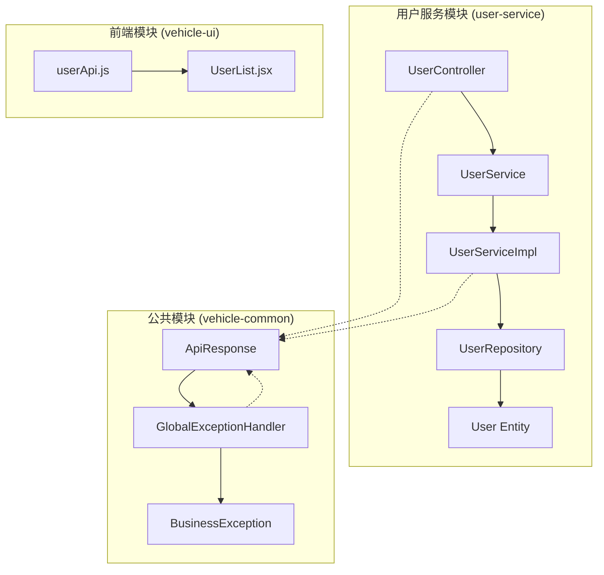
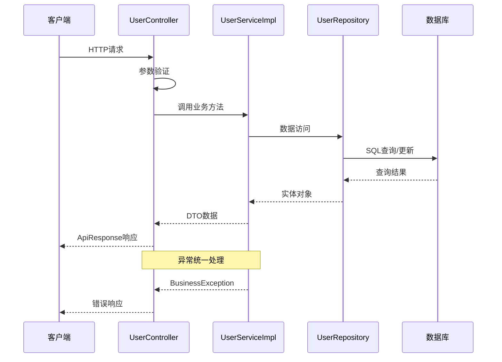
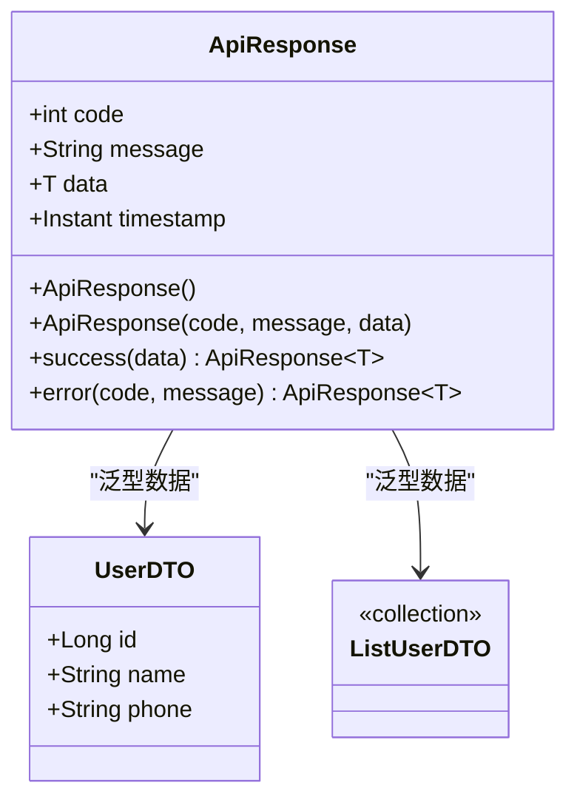
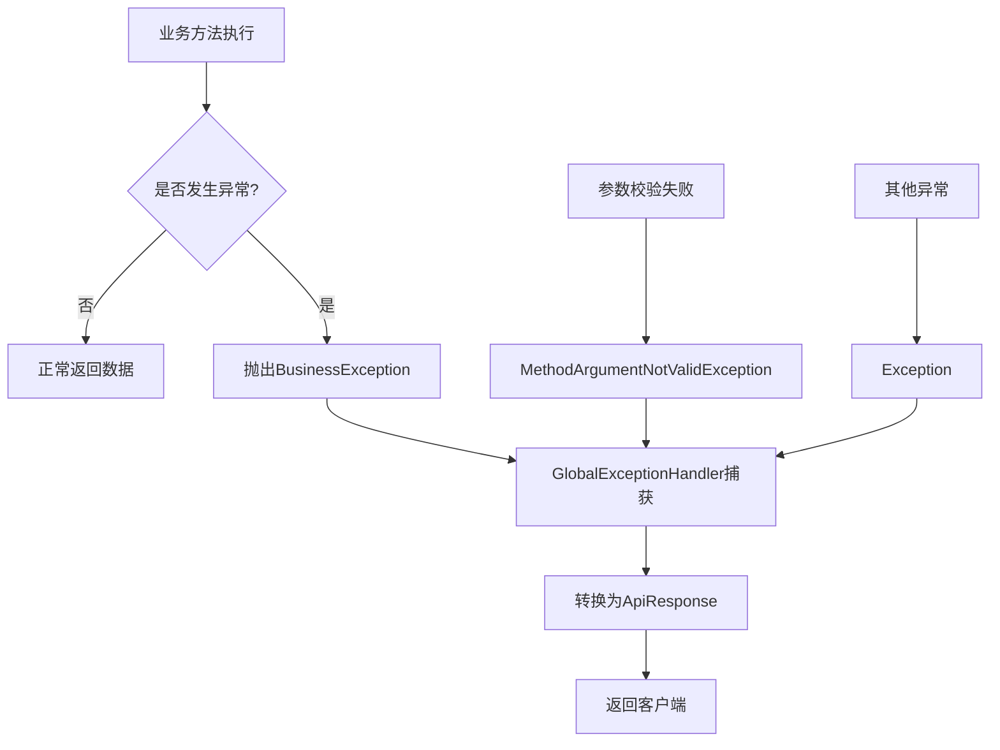

# 用户管理API

<cite>
**本文档引用的文件**
- [UserController.java](file://user-service/src/main/java/com/wenjie/cloud/user/controller/UserController.java)
- [UserDTO.java](file://user-service/src/main/java/com/wenjie/cloud/user/dto/UserDTO.java)
- [User.java](file://user-service/src/main/java/com/wenjie/cloud/user/entity/User.java)
- [UserService.java](file://user-service/src/main/java/com/wenjie/cloud/user/service/UserService.java)
- [UserServiceImpl.java](file://user-service/src/main/java/com/wenjie/cloud/user/service/impl/UserServiceImpl.java)
- [UserRepository.java](file://user-service/src/main/java/com/wenjie/cloud/user/repository/UserRepository.java)
- [ApiResponse.java](file://vehicle-common/src/main/java/com/wenjie/cloud/common/dto/ApiResponse.java)
- [GlobalExceptionHandler.java](file://vehicle-common/src/main/java/com/wenjie/cloud/common/exception/GlobalExceptionHandler.java)
- [BusinessException.java](file://vehicle-common/src/main/java/com/wenjie/cloud/common/exception/BusinessException.java)
- [application.yml](file://user-service/src/main/resources/application.yml)
- [userApi.js](file://vehicle-ui/src/api/userApi.js)
- [UserList.jsx](file://vehicle-ui/src/pages/UserList.jsx)
</cite>

## 目录
1. [简介](#简介)
2. [项目结构](#项目结构)
3. [核心组件](#核心组件)
4. [架构概览](#架构概览)
5. [详细API规范](#详细api规范)
6. [数据模型](#数据模型)
7. [统一响应格式](#统一响应格式)
8. [错误处理机制](#错误处理机制)
9. [最佳实践](#最佳实践)
10. [故障排除指南](#故障排除指南)
11. [结论](#结论)

## 简介

用户管理API是基于Spring Boot微服务架构构建的RESTful API，提供完整的用户CRUD操作功能。该服务采用分层架构设计，包括控制器层、服务层、数据访问层和实体层，确保了良好的代码组织和可维护性。

本API支持以下核心功能：
- 创建用户（POST）
- 查询用户详情（GET）
- 获取用户列表（GET）
- 删除用户（DELETE）

所有API响应都遵循统一的ApiResponse格式，提供一致的错误处理和状态管理。

## 项目结构

用户管理服务采用标准的Spring Boot项目结构，主要包含以下模块：



**图表来源**
- [UserController.java:1-60](file://user-service/src/main/java/com/wenjie/cloud/user/controller/UserController.java#L1-L60)
- [UserServiceImpl.java:1-80](file://user-service/src/main/java/com/wenjie/cloud/user/service/impl/UserServiceImpl.java#L1-L80)
- [ApiResponse.java:1-52](file://vehicle-common/src/main/java/com/wenjie/cloud/common/dto/ApiResponse.java#L1-L52)

**章节来源**
- [UserController.java:18-24](file://user-service/src/main/java/com/wenjie/cloud/user/controller/UserController.java#L18-L24)
- [UserServiceApplication.java:1-16](file://user-service/src/main/java/com/wenjie/cloud/user/UserServiceApplication.java#L1-L16)

## 核心组件

### 控制器层 (UserController)
负责处理HTTP请求和响应，提供RESTful API端点。控制器使用@RequestMapping注解定义基础路径"/api/v1/users"，并为每个CRUD操作提供对应的HTTP方法映射。

### 服务层 (UserService & UserServiceImpl)
实现业务逻辑，包括用户数据验证、业务规则检查和事务管理。服务层提供四个核心方法：
- createUser(): 创建新用户
- getUserById(): 根据ID查询用户
- listUsers(): 获取用户列表
- deleteUser(): 删除用户

### 数据访问层 (UserRepository)
继承JpaRepository接口，提供用户数据的持久化操作。自定义查询方法包括按手机号查找用户和检查手机号是否存在。

### 实体层 (User)
定义用户数据模型，包含数据库表结构映射和字段约束。使用JPA注解配置主键生成策略、字段长度和唯一性约束。

**章节来源**
- [UserController.java:21-24](file://user-service/src/main/java/com/wenjie/cloud/user/controller/UserController.java#L21-L24)
- [UserService.java:10-31](file://user-service/src/main/java/com/wenjie/cloud/user/service/UserService.java#L10-L31)
- [UserRepository.java:11-22](file://user-service/src/main/java/com/wenjie/cloud/user/repository/UserRepository.java#L11-L22)
- [User.java:16-37](file://user-service/src/main/java/com/wenjie/cloud/user/entity/User.java#L16-L37)

## 架构概览

用户管理服务采用经典的三层架构模式，通过依赖注入实现松耦合设计：



**图表来源**
- [UserController.java:31-59](file://user-service/src/main/java/com/wenjie/cloud/user/controller/UserController.java#L31-L59)
- [UserServiceImpl.java:28-68](file://user-service/src/main/java/com/wenjie/cloud/user/service/impl/UserServiceImpl.java#L28-L68)
- [GlobalExceptionHandler.java:26-31](file://vehicle-common/src/main/java/com/wenjie/cloud/common/exception/GlobalExceptionHandler.java#L26-L31)

## 详细API规范

### 基础信息

- **基础URL**: `/api/v1/users`
- **版本**: v1
- **内容类型**: `application/json`
- **字符编码**: UTF-8

### 1. 创建用户

#### 请求信息
- **方法**: POST
- **路径**: `/api/v1/users`
- **认证**: 需要
- **内容类型**: application/json

#### 请求参数
| 字段 | 类型 | 必填 | 描述 | 示例 |
|------|------|------|------|------|
| name | string | 是 | 用户姓名 | "张三" |
| phone | string | 是 | 手机号码（11位） | "13800001111" |

#### 请求示例
```json
{
  "name": "李四",
  "phone": "13900002222"
}
```

#### 响应格式
成功时返回：`ApiResponse<UserDTO>`
失败时返回：`ApiResponse<Void>`

#### 成功响应示例
```json
{
  "code": 0,
  "message": "success",
  "data": {
    "id": 1,
    "name": "李四",
    "phone": "13900002222"
  },
  "timestamp": "2024-01-01T10:00:00Z"
}
```

#### 失败响应示例
```json
{
  "code": 2001,
  "message": "手机号已存在: 13900002222",
  "data": null,
  "timestamp": "2024-01-01T10:00:00Z"
}
```

**章节来源**
- [UserController.java:28-34](file://user-service/src/main/java/com/wenjie/cloud/user/controller/UserController.java#L28-L34)
- [UserServiceImpl.java:28-42](file://user-service/src/main/java/com/wenjie/cloud/user/service/impl/UserServiceImpl.java#L28-L42)

### 2. 查询用户详情

#### 请求信息
- **方法**: GET
- **路径**: `/api/v1/users/{id}`
- **认证**: 需要
- **路径参数**: `id` (用户ID)

#### 请求参数
| 字段 | 类型 | 必填 | 描述 | 示例 |
|------|------|------|------|------|
| id | integer | 是 | 用户ID | 1 |

#### 请求示例
```
GET /api/v1/users/1
```

#### 响应格式
成功时返回：`ApiResponse<UserDTO>`
失败时返回：`ApiResponse<Void>`

#### 成功响应示例
```json
{
  "code": 0,
  "message": "success",
  "data": {
    "id": 1,
    "name": "李四",
    "phone": "13900002222"
  },
  "timestamp": "2024-01-01T10:00:00Z"
}
```

#### 失败响应示例
```json
{
  "code": 2002,
  "message": "用户不存在, id=1",
  "data": null,
  "timestamp": "2024-01-01T10:00:00Z"
}
```

**章节来源**
- [UserController.java:36-42](file://user-service/src/main/java/com/wenjie/cloud/user/controller/UserController.java#L36-L42)
- [UserServiceImpl.java:44-50](file://user-service/src/main/java/com/wenjie/cloud/user/service/impl/UserServiceImpl.java#L44-L50)

### 3. 获取用户列表

#### 请求信息
- **方法**: GET
- **路径**: `/api/v1/users`
- **认证**: 需要

#### 请求参数
无

#### 请求示例
```
GET /api/v1/users
```

#### 响应格式
成功时返回：`ApiResponse<List<UserDTO>>`
失败时返回：`ApiResponse<Void>`

#### 成功响应示例
```json
{
  "code": 0,
  "message": "success",
  "data": [
    {
      "id": 1,
      "name": "李四",
      "phone": "13900002222"
    },
    {
      "id": 2,
      "name": "王五",
      "phone": "13700003333"
    }
  ],
  "timestamp": "2024-01-01T10:00:00Z"
}
```

#### 失败响应示例
```json
{
  "code": 0,
  "message": "success",
  "data": [],
  "timestamp": "2024-01-01T10:00:00Z"
}
```

**章节来源**
- [UserController.java:44-50](file://user-service/src/main/java/com/wenjie/cloud/user/controller/UserController.java#L44-L50)
- [UserServiceImpl.java:52-58](file://user-service/src/main/java/com/wenjie/cloud/user/service/impl/UserServiceImpl.java#L52-L58)

### 4. 删除用户

#### 请求信息
- **方法**: DELETE
- **路径**: `/api/v1/users/{id}`
- **认证**: 需要
- **路径参数**: `id` (用户ID)

#### 请求参数
| 字段 | 类型 | 必填 | 描述 | 示例 |
|------|------|------|------|------|
| id | integer | 是 | 用户ID | 1 |

#### 请求示例
```
DELETE /api/v1/users/1
```

#### 响应格式
成功时返回：`ApiResponse<Void>`
失败时返回：`ApiResponse<Void>`

#### 成功响应示例
```json
{
  "code": 0,
  "message": "success",
  "data": null,
  "timestamp": "2024-01-01T10:00:00Z"
}
```

#### 失败响应示例
```json
{
  "code": 2002,
  "message": "用户不存在, id=1",
  "data": null,
  "timestamp": "2024-01-01T10:00:00Z"
}
```

**章节来源**
- [UserController.java:52-59](file://user-service/src/main/java/com/wenjie/cloud/user/controller/UserController.java#L52-L59)
- [UserServiceImpl.java:60-68](file://user-service/src/main/java/com/wenjie/cloud/user/service/impl/UserServiceImpl.java#L60-L68)

## 数据模型

### UserDTO (用户数据传输对象)

UserDTO是用于API交互的数据传输对象，包含以下字段：

| 字段名 | 类型 | 必填 | 描述 | 验证规则 |
|--------|------|------|------|----------|
| id | integer | 否 | 用户ID | 自动分配 |
| name | string | 是 | 用户姓名 | 非空，最大长度64字符 |
| phone | string | 是 | 手机号码 | 非空，11位数字，必须以1开头 |

#### 字段验证规则

1. **name字段**
   - 必填验证：使用`@NotBlank`注解
   - 长度限制：最大64字符
   - 用途：存储用户真实姓名

2. **phone字段**
   - 必填验证：使用`@NotBlank`注解
   - 格式验证：使用正则表达式`^1\d{10}$`
   - 业务约束：中国手机号码格式
   - 唯一性：数据库层面保证唯一性

### User实体 (数据库映射)

User实体类映射到数据库表`app_user`，包含以下字段：

| 字段名 | 类型 | 约束 | 描述 |
|--------|------|------|------|
| id | bigint | 主键，自增 | 用户唯一标识符 |
| name | varchar(64) | 非空 | 用户姓名 |
| phone | varchar(11) | 非空，唯一 | 手机号码 |
| created_at | timestamp | 非空，不可更新 | 创建时间 |

#### 业务约束

1. **唯一性约束**
   - phone字段在数据库层面设置唯一索引
   - 防止重复手机号注册

2. **完整性约束**
   - 所有字段均为非空
   - created_at字段不可更新

3. **格式约束**
   - phone字段必须符合11位手机号格式

**章节来源**
- [UserDTO.java:12-24](file://user-service/src/main/java/com/wenjie/cloud/user/dto/UserDTO.java#L12-L24)
- [User.java:19-37](file://user-service/src/main/java/com/wenjie/cloud/user/entity/User.java#L19-L37)
- [UserRepository.java:16-21](file://user-service/src/main/java/com/wenjie/cloud/user/repository/UserRepository.java#L16-L21)

## 统一响应格式

### ApiResponse结构

所有API响应都遵循统一的ApiResponse格式，确保客户端能够一致地处理各种响应情况：



**图表来源**
- [ApiResponse.java:13-51](file://vehicle-common/src/main/java/com/wenjie/cloud/common/dto/ApiResponse.java#L13-L51)
- [UserDTO.java:12-24](file://user-service/src/main/java/com/wenjie/cloud/user/dto/UserDTO.java#L12-L24)

### 响应字段说明

| 字段名 | 类型 | 必填 | 描述 | 默认值 |
|--------|------|------|------|--------|
| code | integer | 是 | 业务状态码 | - |
| message | string | 是 | 提示信息 | - |
| data | T | 否 | 响应数据 | null |
| timestamp | timestamp | 是 | 响应时间戳 | 当前时间 |

### 状态码约定

| 状态码 | 含义 | 使用场景 |
|--------|------|----------|
| 0 | 成功 | 所有成功请求 |
| 2001 | 手机号已存在 | 创建用户时手机号重复 |
| 2002 | 用户不存在 | 查询或删除不存在的用户 |
| 400 | 参数校验失败 | 请求参数格式错误 |
| 500 | 系统内部错误 | 服务器异常 |

**章节来源**
- [ApiResponse.java:15-25](file://vehicle-common/src/main/java/com/wenjie/cloud/common/dto/ApiResponse.java#L15-L25)
- [UserServiceImpl.java:31](file://user-service/src/main/java/com/wenjie/cloud/user/service/impl/UserServiceImpl.java#L31)
- [UserServiceImpl.java:48](file://user-service/src/main/java/com/wenjie/cloud/user/service/impl/UserServiceImpl.java#L48)
- [UserServiceImpl.java:64](file://user-service/src/main/java/com/wenjie/cloud/user/service/impl/UserServiceImpl.java#L64)

## 错误处理机制

### 异常处理流程

系统采用全局异常处理器统一处理各种异常情况：



**图表来源**
- [GlobalExceptionHandler.java:26-54](file://vehicle-common/src/main/java/com/wenjie/cloud/common/exception/GlobalExceptionHandler.java#L26-L54)
- [BusinessException.java:12-26](file://vehicle-common/src/main/java/com/wenjie/cloud/common/exception/BusinessException.java#L12-L26)

### 异常类型及处理

1. **BusinessException (业务异常)**
   - **触发条件**: 业务逻辑验证失败
   - **HTTP状态码**: 400 BAD_REQUEST
   - **响应格式**: ApiResponse.error(code, message)

2. **MethodArgumentNotValidException (参数校验异常)**
   - **触发条件**: @Valid参数验证失败
   - **HTTP状态码**: 400 BAD_REQUEST
   - **响应格式**: ApiResponse.error(400, 错误信息)

3. **Exception (系统异常)**
   - **触发条件**: 未预期的系统错误
   - **HTTP状态码**: 500 INTERNAL_SERVER_ERROR
   - **响应格式**: ApiResponse.error(500, "系统内部错误")

**章节来源**
- [GlobalExceptionHandler.java:23-54](file://vehicle-common/src/main/java/com/wenjie/cloud/common/exception/GlobalExceptionHandler.java#L23-L54)
- [BusinessException.java:11-26](file://vehicle-common/src/main/java/com/wenjie/cloud/common/exception/BusinessException.java#L11-L26)

## 最佳实践

### API调用建议

1. **请求参数验证**
   - 在客户端进行基础格式验证
   - 服务器端仍需进行二次验证
   - 特别注意手机号格式和长度

2. **错误处理策略**
   - 捕获所有API调用异常
   - 区分业务异常和系统异常
   - 提供友好的错误提示信息

3. **性能优化建议**
   - 合理使用分页查询大量用户数据
   - 缓存常用查询结果
   - 避免不必要的重复查询

4. **安全考虑**
   - 所有API调用都需要适当的认证
   - 防止SQL注入攻击
   - 保护敏感数据传输

### 前端集成示例

前端用户API封装提供了标准的HTTP请求方法：

```javascript
// 用户API封装
const BASE = '/api/v1/users';

export function listUsers() {
  return request.get(BASE);
}

export function getUser(id) {
  return request.get(`${BASE}/${id}`);
}

export function createUser(data) {
  return request.post(BASE, data);
}

export function deleteUser(id) {
  return request.delete(`${BASE}/${id}`);
}
```

**章节来源**
- [userApi.js:1-20](file://vehicle-ui/src/api/userApi.js#L1-L20)
- [UserList.jsx:15-32](file://vehicle-ui/src/pages/UserList.jsx#L15-L32)

## 故障排除指南

### 常见问题及解决方案

#### 1. 手机号格式错误
**问题描述**: 创建用户时返回手机号格式错误
**可能原因**: 
- 手机号不是11位数字
- 手机号不以1开头
- 包含特殊字符或空格

**解决方案**:
- 确保手机号只包含11位纯数字
- 移除所有空格、横线等特殊字符
- 验证手机号格式后再提交

#### 2. 手机号重复
**问题描述**: 创建用户时报手机号已存在
**可能原因**: 
- 该手机号已被其他用户使用
- 数据库中存在重复记录

**解决方案**:
- 检查数据库中是否已有该手机号
- 修改为其他手机号码
- 联系管理员处理重复数据

#### 3. 用户不存在
**问题描述**: 查询或删除用户时返回用户不存在
**可能原因**: 
- 用户ID不存在
- 用户已被删除
- ID传入错误

**解决方案**:
- 验证用户ID的有效性
- 确认用户是否仍然存在
- 重新获取最新的用户ID

#### 4. 参数校验失败
**问题描述**: 返回参数校验失败错误
**可能原因**: 
- 必填字段缺失
- 字段格式不符合要求
- 字段长度超出限制

**解决方案**:
- 检查所有必填字段是否填写
- 验证字段格式和长度
- 参考API规范修正请求格式

### 调试技巧

1. **启用详细日志**
   - 在application.yml中设置日志级别为DEBUG
   - 查看服务端日志输出
   - 分析请求处理流程

2. **数据库检查**
   - 使用/H2-Console访问数据库
   - 查询app_user表验证数据
   - 检查唯一性约束是否生效

3. **网络调试**
   - 使用curl或Postman测试API
   - 检查HTTP状态码和响应头
   - 分析响应内容格式

**章节来源**
- [application.yml:37-40](file://user-service/src/main/resources/application.yml#L37-L40)
- [GlobalExceptionHandler.java:38-44](file://vehicle-common/src/main/java/com/wenjie/cloud/common/exception/GlobalExceptionHandler.java#L38-L44)

## 结论

用户管理API提供了完整、规范的用户CRUD操作接口，具有以下特点：

1. **标准化设计**: 采用统一的API设计规范和响应格式
2. **健壮性**: 完善的异常处理和错误码体系
3. **可扩展性**: 清晰的分层架构便于功能扩展
4. **易用性**: 简洁明了的API接口和详细的文档说明

通过遵循本文档提供的规范和最佳实践，开发者可以高效地集成和使用用户管理API，构建稳定可靠的用户管理系统。