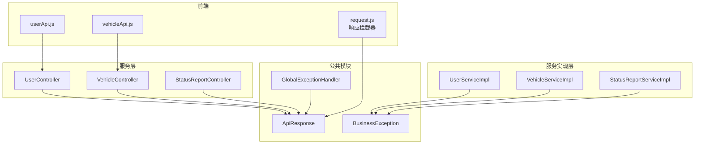
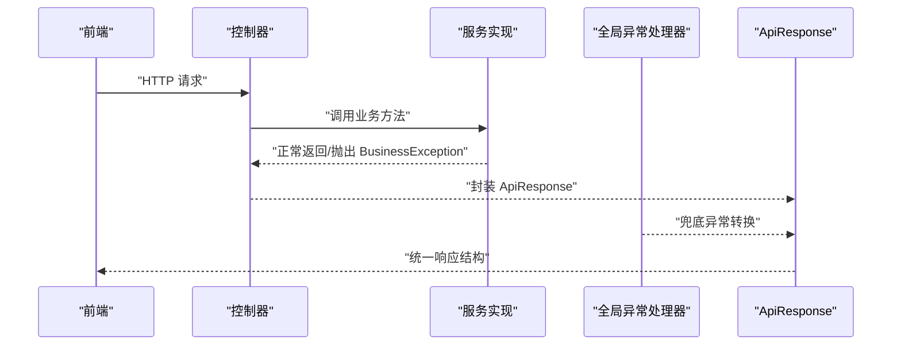
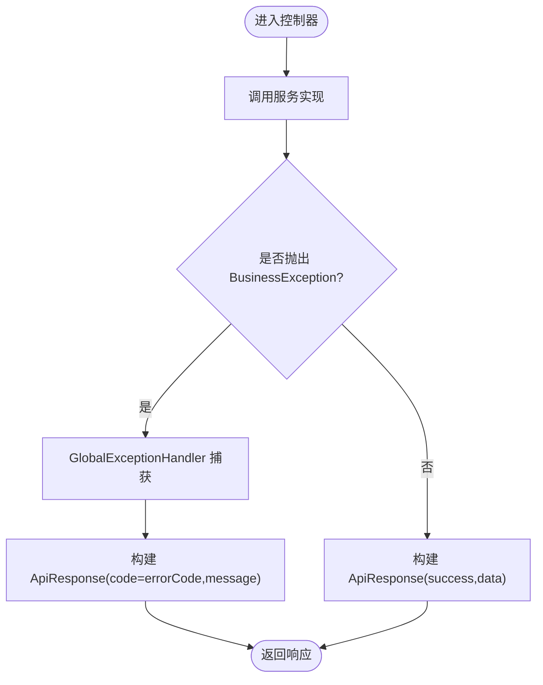
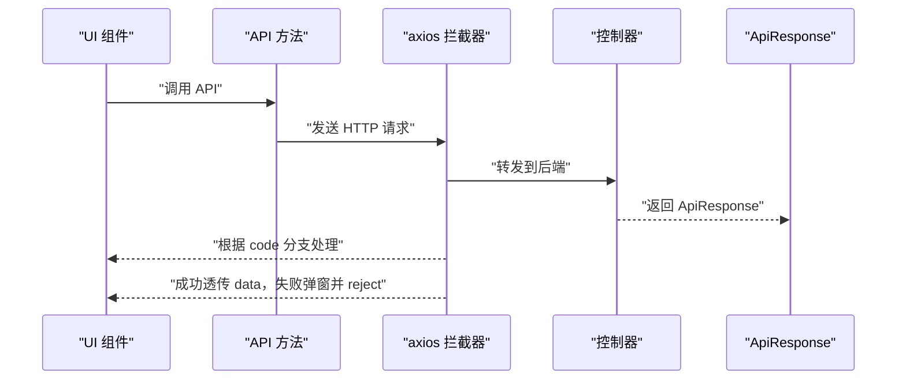
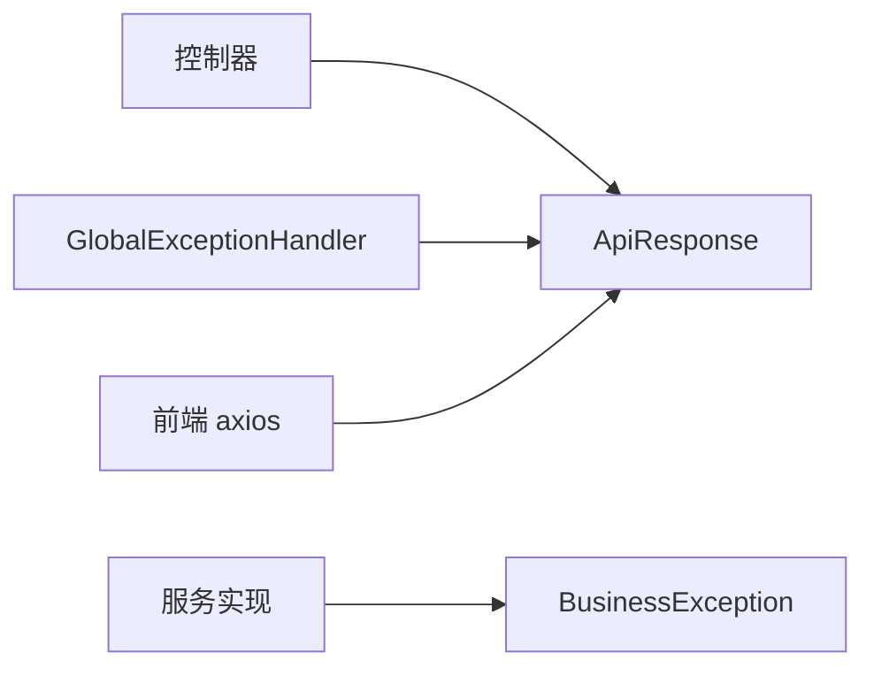

# 统一响应格式

<cite>
**本文引用的文件**
- [ApiResponse.java](file://vehicle-common/src/main/java/com/wenjie/cloud/common/dto/ApiResponse.java)
- [BusinessException.java](file://vehicle-common/src/main/java/com/wenjie/cloud/common/exception/BusinessException.java)
- [GlobalExceptionHandler.java](file://vehicle-common/src/main/java/com/wenjie/cloud/common/exception/GlobalExceptionHandler.java)
- [UserController.java](file://user-service/src/main/java/com/wenjie/cloud/user/controller/UserController.java)
- [VehicleController.java](file://vehicle-service/src/main/java/com/wenjie/cloud/vehicle/controller/VehicleController.java)
- [StatusReportController.java](file://vehicle-status-service/src/main/java/com/wenjie/cloud/vehiclestatus/controller/StatusReportController.java)
- [UserServiceImpl.java](file://user-service/src/main/java/com/wenjie/cloud/user/service/impl/UserServiceImpl.java)
- [VehicleServiceImpl.java](file://vehicle-service/src/main/java/com/wenjie/cloud/vehicle/service/impl/VehicleServiceImpl.java)
- [StatusReportServiceImpl.java](file://vehicle-status-service/src/main/java/com/wenjie/cloud/vehiclestatus/service/impl/StatusReportServiceImpl.java)
- [request.js](file://vehicle-ui/src/api/request.js)
- [userApi.js](file://vehicle-ui/src/api/userApi.js)
- [vehicleApi.js](file://vehicle-ui/src/api/vehicleApi.js)
- [application.yml（用户服务）](file://user-service/src/main/resources/application.yml)
- [application.yml（车辆服务）](file://vehicle-service/src/main/resources/application.yml)
- [application.yml（状态服务）](file://vehicle-status-service/src/main/resources/application.yml)
</cite>

## 目录
1. [引言](#引言)
2. [项目结构](#项目结构)
3. [核心组件](#核心组件)
4. [架构总览](#架构总览)
5. [详细组件分析](#详细组件分析)
6. [依赖分析](#依赖分析)
7. [性能与可维护性](#性能与可维护性)
8. [故障排查指南](#故障排查指南)
9. [结论](#结论)
10. [附录](#附录)

## 引言
本文件系统化阐述统一响应格式的设计理念、结构定义与使用规范，覆盖以下关键点：
- ApiResponse<T> 的字段语义、取值范围与使用场景
- 在各服务中的实现与调用方式
- 错误处理机制、BusinessException 的使用场景与 GlobalExceptionHandler 的全局策略
- 成功/业务异常/系统异常三类响应示例与最佳实践
- 版本管理、向后兼容与扩展建议
- API 调用最佳实践、错误码规范与调试指南

## 项目结构
本仓库采用多模块微服务架构，公共响应与异常处理位于 vehicle-common 模块；各业务服务（user-service、vehicle-service、vehicle-status-service）通过控制器返回统一 ApiResponse；前端通过 axios 封装统一解析响应。

图表来源
- [ApiResponse.java:12-51](file://vehicle-common/src/main/java/com/wenjie/cloud/common/dto/ApiResponse.java#L12-L51)
- [BusinessException.java:11-26](file://vehicle-common/src/main/java/com/wenjie/cloud/common/exception/BusinessException.java#L11-L26)
- [GlobalExceptionHandler.java:19-55](file://vehicle-common/src/main/java/com/wenjie/cloud/common/exception/GlobalExceptionHandler.java#L19-L55)
- [UserController.java:21-60](file://user-service/src/main/java/com/wenjie/cloud/user/controller/UserController.java#L21-L60)
- [VehicleController.java:21-61](file://vehicle-service/src/main/java/com/wenjie/cloud/vehicle/controller/VehicleController.java#L21-L61)
- [StatusReportController.java:26-71](file://vehicle-status-service/src/main/java/com/wenjie/cloud/vehiclestatus/controller/StatusReportController.java#L26-L71)
- [UserServiceImpl.java:23-80](file://user-service/src/main/java/com/wenjie/cloud/user/service/impl/UserServiceImpl.java#L23-L80)
- [VehicleServiceImpl.java:23-82](file://vehicle-service/src/main/java/com/wenjie/cloud/vehicle/service/impl/VehicleServiceImpl.java#L23-L82)
- [StatusReportServiceImpl.java:26-104](file://vehicle-status-service/src/main/java/com/wenjie/cloud/vehiclestatus/service/impl/StatusReportServiceImpl.java#L26-L104)
- [request.js:8-23](file://vehicle-ui/src/api/request.js#L8-L23)

章节来源
- [application.yml（用户服务）:1-40](file://user-service/src/main/resources/application.yml#L1-L40)
- [application.yml（车辆服务）:1-40](file://vehicle-service/src/main/resources/application.yml#L1-L40)
- [application.yml（状态服务）:1-30](file://vehicle-status-service/src/main/resources/application.yml#L1-L30)

## 核心组件
- ApiResponse<T>
  - 字段与语义
    - code：业务状态码，约定 0 表示成功；非 0 表示失败
    - message：提示信息，用于描述错误或成功信息
    - data：泛型响应数据体，成功时承载业务数据，失败时通常为 null
    - timestamp：响应时间戳，默认构造与带参构造均会设置为当前时间
  - 静态工厂方法
    - success(data)：快速构建成功响应
    - error(code, message)：快速构建失败响应
  - 使用建议
    - 控制器直接返回 ApiResponse<T>，保持对外一致的契约
    - data 可为任意 DTO/VO 或集合，便于前端统一处理
- BusinessException
  - 用途：封装可预期的业务错误，包含业务错误码与消息
  - 与 GlobalExceptionHandler 协作：由处理器统一捕获并转换为 ApiResponse
- GlobalExceptionHandler
  - 拦截器：@RestControllerAdvice，对 Controller 抛出的异常进行统一处理
  - 处理策略
    - BusinessException：记录告警日志，返回 code=errorCode、message=异常消息
    - 参数校验异常 MethodArgumentNotValidException：拼接字段级错误，返回 code=400
    - 未知异常 Exception：记录错误日志，返回 code=500、message=“系统内部错误”

章节来源
- [ApiResponse.java:12-51](file://vehicle-common/src/main/java/com/wenjie/cloud/common/dto/ApiResponse.java#L12-L51)
- [BusinessException.java:11-26](file://vehicle-common/src/main/java/com/wenjie/cloud/common/exception/BusinessException.java#L11-L26)
- [GlobalExceptionHandler.java:19-55](file://vehicle-common/src/main/java/com/wenjie/cloud/common/exception/GlobalExceptionHandler.java#L19-L55)

## 架构总览
统一响应贯穿“前端 → 控制器 → 服务层 → 数据层”，异常在控制器层被 GlobalExceptionHandler 统一捕获并转为 ApiResponse。

图表来源
- [UserController.java:21-60](file://user-service/src/main/java/com/wenjie/cloud/user/controller/UserController.java#L21-L60)
- [VehicleController.java:21-61](file://vehicle-service/src/main/java/com/wenjie/cloud/vehicle/controller/VehicleController.java#L21-L61)
- [StatusReportController.java:26-71](file://vehicle-status-service/src/main/java/com/wenjie/cloud/vehiclestatus/controller/StatusReportController.java#L26-L71)
- [UserServiceImpl.java:23-80](file://user-service/src/main/java/com/wenjie/cloud/user/service/impl/UserServiceImpl.java#L23-L80)
- [VehicleServiceImpl.java:23-82](file://vehicle-service/src/main/java/com/wenjie/cloud/vehicle/service/impl/VehicleServiceImpl.java#L23-L82)
- [StatusReportServiceImpl.java:26-104](file://vehicle-status-service/src/main/java/com/wenjie/cloud/vehiclestatus/service/impl/StatusReportServiceImpl.java#L26-L104)
- [GlobalExceptionHandler.java:19-55](file://vehicle-common/src/main/java/com/wenjie/cloud/common/exception/GlobalExceptionHandler.java#L19-L55)
- [ApiResponse.java:12-51](file://vehicle-common/src/main/java/com/wenjie/cloud/common/dto/ApiResponse.java#L12-L51)

## 详细组件分析

### ApiResponse<T> 类设计与使用
- 设计要点
  - 泛型 data 支持任意业务对象，便于前后端契约稳定
  - 默认 timestamp 由构造函数注入，确保每条响应具备时间戳
  - 静态工厂方法简化成功/失败响应构建
- 使用规范
  - 控制器方法返回 ApiResponse<T>，避免直接返回原始对象
  - 成功场景使用 success(data)，失败场景使用 error(code, message)
  - data 为空时，显式传入 null，保持结构一致性

章节来源
- [ApiResponse.java:12-51](file://vehicle-common/src/main/java/com/wenjie/cloud/common/dto/ApiResponse.java#L12-L51)

### BusinessException 与 GlobalExceptionHandler
- BusinessException
  - 用于封装业务错误码与消息，便于统一处理
  - 服务实现中遇到可预期异常（如数据不存在、参数非法）时抛出
- GlobalExceptionHandler
  - 捕获 BusinessException 并映射为 ApiResponse，code=errorCode，message=异常消息
  - 捕获参数校验异常，拼接字段错误并返回 code=400
  - 捕获其他未预期异常，返回 code=500、message=“系统内部错误”

图表来源
- [BusinessException.java:11-26](file://vehicle-common/src/main/java/com/wenjie/cloud/common/exception/BusinessException.java#L11-L26)
- [GlobalExceptionHandler.java:19-55](file://vehicle-common/src/main/java/com/wenjie/cloud/common/exception/GlobalExceptionHandler.java#L19-L55)
- [ApiResponse.java:12-51](file://vehicle-common/src/main/java/com/wenjie/cloud/common/dto/ApiResponse.java#L12-L51)

章节来源
- [UserServiceImpl.java:23-80](file://user-service/src/main/java/com/wenjie/cloud/user/service/impl/UserServiceImpl.java#L23-L80)
- [VehicleServiceImpl.java:23-82](file://vehicle-service/src/main/java/com/wenjie/cloud/vehicle/service/impl/VehicleServiceImpl.java#L23-L82)
- [StatusReportServiceImpl.java:26-104](file://vehicle-status-service/src/main/java/com/wenjie/cloud/vehiclestatus/service/impl/StatusReportServiceImpl.java#L26-L104)

### 各服务中的统一响应实现
- 用户服务
  - 控制器：返回 ApiResponse<UserDTO>、ApiResponse<List<UserDTO>>、ApiResponse<Void>
  - 业务异常：手机号重复、用户不存在等场景抛出 BusinessException
- 车辆服务
  - 控制器：返回 ApiResponse<VehicleDTO>、ApiResponse<List<VehicleDTO>>、ApiResponse<Void>
  - 业务异常：VIN 重复、车辆不存在等场景抛出 BusinessException
- 状态服务
  - 控制器：返回 ApiResponse<StatusReportVO>、ApiResponse<Page<StatusReportVO>>、ApiResponse<List<StatusReportVO>>
  - 业务异常：上报时间在未来、时间范围非法、VIN 格式不正确、无状态数据等场景抛出 BusinessException

章节来源
- [UserController.java:21-60](file://user-service/src/main/java/com/wenjie/cloud/user/controller/UserController.java#L21-L60)
- [VehicleController.java:21-61](file://vehicle-service/src/main/java/com/wenjie/cloud/vehicle/controller/VehicleController.java#L21-L61)
- [StatusReportController.java:26-71](file://vehicle-status-service/src/main/java/com/wenjie/cloud/vehiclestatus/controller/StatusReportController.java#L26-L71)
- [UserServiceImpl.java:23-80](file://user-service/src/main/java/com/wenjie/cloud/user/service/impl/UserServiceImpl.java#L23-L80)
- [VehicleServiceImpl.java:23-82](file://vehicle-service/src/main/java/com/wenjie/cloud/vehicle/service/impl/VehicleServiceImpl.java#L23-L82)
- [StatusReportServiceImpl.java:26-104](file://vehicle-status-service/src/main/java/com/wenjie/cloud/vehiclestatus/service/impl/StatusReportServiceImpl.java#L26-L104)

### 前端统一响应解析
- axios 拦截器在响应阶段统一解析 ApiResponse
  - 当 code==0 时，仅透传 data，便于上层直接消费业务数据
  - 当 code!=0 时，弹出 message 并 reject，便于统一错误提示与后续处理
  - 网络异常时，从响应体或错误对象提取 message 并提示

图表来源
- [request.js:8-23](file://vehicle-ui/src/api/request.js#L8-L23)
- [userApi.js:1-20](file://vehicle-ui/src/api/userApi.js#L1-L20)
- [vehicleApi.js:1-20](file://vehicle-ui/src/api/vehicleApi.js#L1-L20)

章节来源
- [request.js:8-23](file://vehicle-ui/src/api/request.js#L8-L23)

## 依赖分析
- 控制器依赖 ApiResponse<T> 进行响应封装
- 服务实现依赖 BusinessException 触发业务异常
- GlobalExceptionHandler 作为@RestControllerAdvice 统一拦截异常并转换为 ApiResponse
- 前端依赖 axios 拦截器统一解析 ApiResponse

图表来源
- [UserController.java:21-60](file://user-service/src/main/java/com/wenjie/cloud/user/controller/UserController.java#L21-L60)
- [VehicleController.java:21-61](file://vehicle-service/src/main/java/com/wenjie/cloud/vehicle/controller/VehicleController.java#L21-L61)
- [StatusReportController.java:26-71](file://vehicle-status-service/src/main/java/com/wenjie/cloud/vehiclestatus/controller/StatusReportController.java#L26-L71)
- [UserServiceImpl.java:23-80](file://user-service/src/main/java/com/wenjie/cloud/user/service/impl/UserServiceImpl.java#L23-L80)
- [VehicleServiceImpl.java:23-82](file://vehicle-service/src/main/java/com/wenjie/cloud/vehicle/service/impl/VehicleServiceImpl.java#L23-L82)
- [StatusReportServiceImpl.java:26-104](file://vehicle-status-service/src/main/java/com/wenjie/cloud/vehiclestatus/service/impl/StatusReportServiceImpl.java#L26-L104)
- [GlobalExceptionHandler.java:19-55](file://vehicle-common/src/main/java/com/wenjie/cloud/common/exception/GlobalExceptionHandler.java#L19-L55)
- [request.js:8-23](file://vehicle-ui/src/api/request.js#L8-L23)

## 性能与可维护性
- 性能特性
  - ApiResponse 仅承载必要字段，序列化开销低
  - 响应时间戳默认注入，便于链路追踪与日志关联
- 可维护性
  - 统一响应结构降低前端适配成本
  - 全局异常处理集中化，减少重复逻辑
  - 建议在服务启动时打印响应结构与错误码规范，便于联调

[本节为通用指导，无需列出章节来源]

## 故障排查指南
- 常见问题定位
  - code=0 但 data 为 null：检查服务实现是否正确返回空数据而非抛出异常
  - code=400：检查参数校验错误，查看 message 中字段提示
  - code=500：查看服务端日志，确认 GlobalExceptionHandler 是否捕获到未预期异常
- 日志与监控
  - BusinessException：记录告警日志，便于快速定位业务错误
  - GlobalExceptionHandler：记录错误日志，便于定位系统异常
- 前端排查
  - axios 拦截器会在失败时弹窗 message，并 reject 错误对象，便于统一提示与后续处理

章节来源
- [GlobalExceptionHandler.java:19-55](file://vehicle-common/src/main/java/com/wenjie/cloud/common/exception/GlobalExceptionHandler.java#L19-L55)
- [request.js:8-23](file://vehicle-ui/src/api/request.js#L8-L23)

## 结论
统一响应格式通过 ApiResponse<T>、BusinessException 与 GlobalExceptionHandler 形成闭环，实现了“成功/失败/异常”三态一致的契约，显著提升了前后端协作效率与系统可观测性。建议在团队内明确错误码命名规范与版本演进策略，持续优化异常处理与前端解析流程。

[本节为总结性内容，无需列出章节来源]

## 附录

### 响应格式字段说明
- code：业务状态码，0 表示成功；非 0 表示失败
- message：提示信息，用于描述错误或成功信息
- data：响应数据体，成功时承载业务数据，失败时通常为 null
- timestamp：响应时间戳，用于审计与排障

章节来源
- [ApiResponse.java:12-51](file://vehicle-common/src/main/java/com/wenjie/cloud/common/dto/ApiResponse.java#L12-L51)

### 响应示例（结构示意）
- 成功响应
  - code=0
  - message="success"
  - data：业务数据体
  - timestamp：当前时间
- 业务异常响应
  - code：业务错误码（如 2001、1001、3001 等）
  - message：业务错误描述
  - data：null
  - timestamp：当前时间
- 系统异常响应
  - code：500
  - message："系统内部错误"
  - data：null
  - timestamp：当前时间

章节来源
- [ApiResponse.java:12-51](file://vehicle-common/src/main/java/com/wenjie/cloud/common/dto/ApiResponse.java#L12-L51)
- [GlobalExceptionHandler.java:19-55](file://vehicle-common/src/main/java/com/wenjie/cloud/common/exception/GlobalExceptionHandler.java#L19-L55)
- [UserServiceImpl.java:23-80](file://user-service/src/main/java/com/wenjie/cloud/user/service/impl/UserServiceImpl.java#L23-L80)
- [VehicleServiceImpl.java:23-82](file://vehicle-service/src/main/java/com/wenjie/cloud/vehicle/service/impl/VehicleServiceImpl.java#L23-L82)
- [StatusReportServiceImpl.java:26-104](file://vehicle-status-service/src/main/java/com/wenjie/cloud/vehiclestatus/service/impl/StatusReportServiceImpl.java#L26-L104)

### 错误码规范与版本管理建议
- 错误码规范
  - 建议按模块划分区间（如用户模块 2xxx、车辆模块 1xxx、状态模块 3xxx），避免冲突
  - 保留 0（成功）、400（参数校验）、500（系统异常）等通用码位
- 版本管理与兼容
  - 新增字段需向后兼容（如新增 traceId），旧客户端忽略新字段
  - 修改现有字段语义需升级协议版本并在网关或服务端做兼容处理
- 扩展机制
  - 在 ApiResponse 中预留扩展字段（如 traceId、version），由网关或服务端统一填充

[本节为通用指导，无需列出章节来源]

### API 调用最佳实践
- 前端
  - 使用 axios 拦截器统一解析 ApiResponse，成功透传 data，失败弹窗并 reject
  - 对于分页接口，统一处理 page/size 与排序参数
- 后端
  - 控制器统一返回 ApiResponse<T>
  - 服务实现中遇到可预期错误抛 BusinessException，交由全局异常处理器统一处理
  - 参数校验使用 @Valid 与 DTO 校验注解，配合全局校验异常处理

章节来源
- [request.js:8-23](file://vehicle-ui/src/api/request.js#L8-L23)
- [UserController.java:21-60](file://user-service/src/main/java/com/wenjie/cloud/user/controller/UserController.java#L21-L60)
- [VehicleController.java:21-61](file://vehicle-service/src/main/java/com/wenjie/cloud/vehicle/controller/VehicleController.java#L21-L61)
- [StatusReportController.java:26-71](file://vehicle-status-service/src/main/java/com/wenjie/cloud/vehiclestatus/controller/StatusReportController.java#L26-L71)
- [UserServiceImpl.java:23-80](file://user-service/src/main/java/com/wenjie/cloud/user/service/impl/UserServiceImpl.java#L23-L80)
- [VehicleServiceImpl.java:23-82](file://vehicle-service/src/main/java/com/wenjie/cloud/vehicle/service/impl/VehicleServiceImpl.java#L23-L82)
- [StatusReportServiceImpl.java:26-104](file://vehicle-status-service/src/main/java/com/wenjie/cloud/vehiclestatus/service/impl/StatusReportServiceImpl.java#L26-L104)