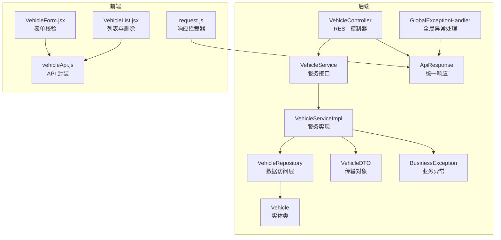
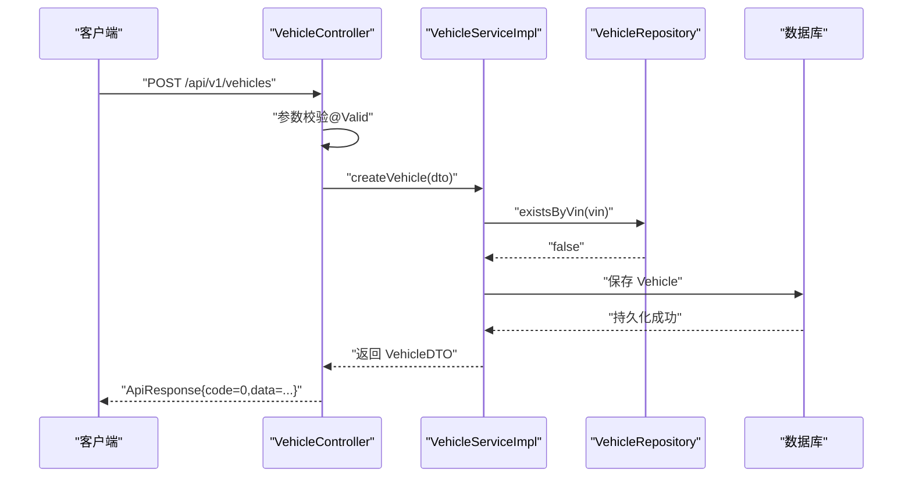
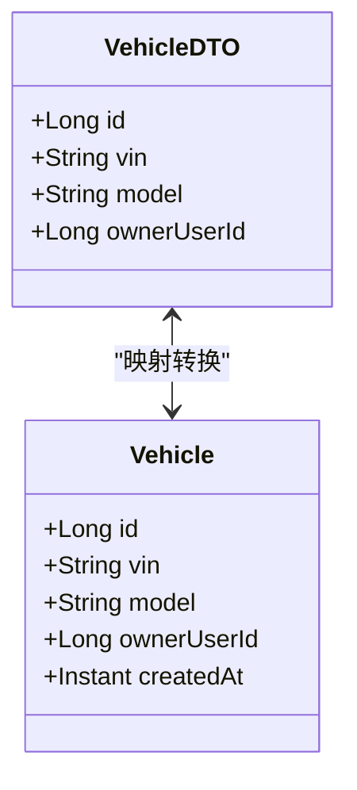
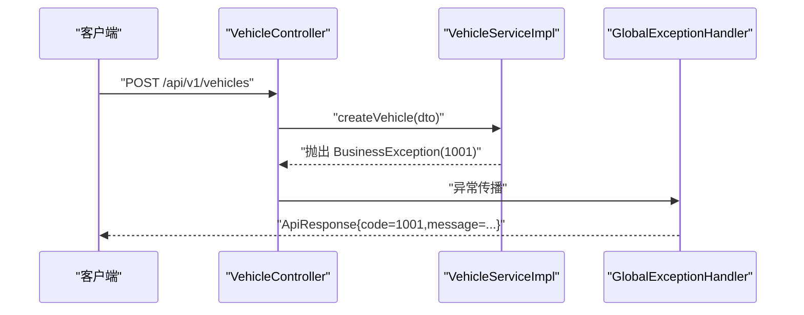
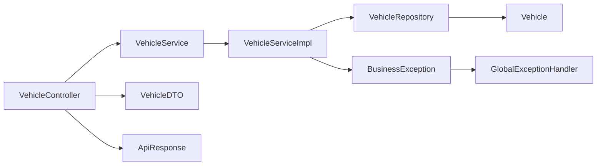
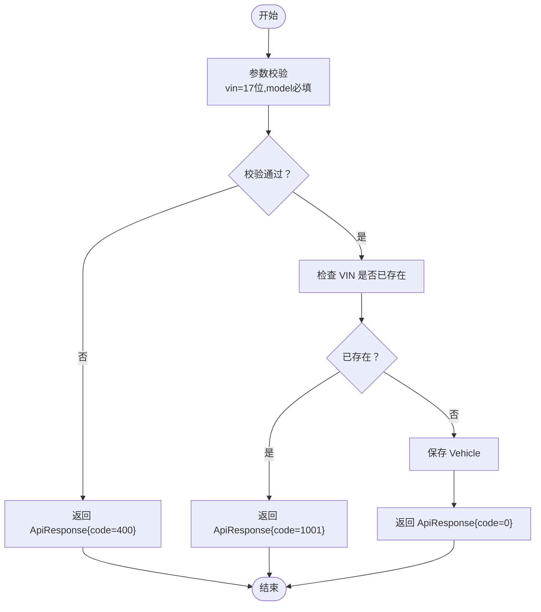

# 车辆管理API

<cite>
**本文引用的文件**
- [VehicleController.java](file://vehicle-service/src/main/java/com/wenjie/cloud/vehicle/controller/VehicleController.java)
- [VehicleService.java](file://vehicle-service/src/main/java/com/wenjie/cloud/vehicle/service/VehicleService.java)
- [VehicleServiceImpl.java](file://vehicle-service/src/main/java/com/wenjie/cloud/vehicle/service/impl/VehicleServiceImpl.java)
- [VehicleRepository.java](file://vehicle-service/src/main/java/com/wenjie/cloud/vehicle/repository/VehicleRepository.java)
- [Vehicle.java](file://vehicle-service/src/main/java/com/wenjie/cloud/vehicle/entity/Vehicle.java)
- [VehicleDTO.java](file://vehicle-service/src/main/java/com/wenjie/cloud/vehicle/dto/VehicleDTO.java)
- [ApiResponse.java](file://vehicle-common/src/main/java/com/wenjie/cloud/common/dto/ApiResponse.java)
- [BusinessException.java](file://vehicle-common/src/main/java/com/wenjie/cloud/common/exception/BusinessException.java)
- [GlobalExceptionHandler.java](file://vehicle-common/src/main/java/com/wenjie/cloud/common/exception/GlobalExceptionHandler.java)
- [application.yml](file://vehicle-service/src/main/resources/application.yml)
- [data.sql](file://vehicle-service/src/main/resources/data.sql)
- [vehicleApi.js](file://vehicle-ui/src/api/vehicleApi.js)
- [VehicleForm.jsx](file://vehicle-ui/src/components/VehicleForm.jsx)
- [VehicleList.jsx](file://vehicle-ui/src/pages/VehicleList.jsx)
- [request.js](file://vehicle-ui/src/api/request.js)
</cite>

## 目录
1. [简介](#简介)
2. [项目结构](#项目结构)
3. [核心组件](#核心组件)
4. [架构总览](#架构总览)
5. [详细组件分析](#详细组件分析)
6. [依赖分析](#依赖分析)
7. [性能考虑](#性能考虑)
8. [故障排查指南](#故障排查指南)
9. [结论](#结论)
10. [附录](#附录)

## 简介
本文件为“车辆管理服务”的完整API文档，覆盖车辆CRUD操作的REST接口定义与业务规则，重点说明VIN码验证规则、唯一性约束、业务逻辑与统一响应格式的使用方式。文档同时提供请求/响应示例、最佳实践、错误处理与性能优化建议，帮助前后端协作与集成。

## 项目结构
- 后端采用多模块结构，核心模块包括：
  - vehicle-service：车辆领域服务与控制器
  - vehicle-common：通用响应封装与异常处理
  - vehicle-status-service：状态报告服务（与车辆管理解耦）
  - vehicle-ui：前端示例，演示如何调用车辆API
- 数据库使用H2内存数据库，启动时自动初始化车辆数据。

**图表来源**
- [VehicleController.java:21-60](file://vehicle-service/src/main/java/com/wenjie/cloud/vehicle/controller/VehicleController.java#L21-L60)
- [VehicleService.java:10-31](file://vehicle-service/src/main/java/com/wenjie/cloud/vehicle/service/VehicleService.java#L10-L31)
- [VehicleServiceImpl.java:23-81](file://vehicle-service/src/main/java/com/wenjie/cloud/vehicle/service/impl/VehicleServiceImpl.java#L23-L81)
- [VehicleRepository.java:11-22](file://vehicle-service/src/main/java/com/wenjie/cloud/vehicle/repository/VehicleRepository.java#L11-L22)
- [Vehicle.java:16-41](file://vehicle-service/src/main/java/com/wenjie/cloud/vehicle/entity/Vehicle.java#L16-L41)
- [VehicleDTO.java:11-27](file://vehicle-service/src/main/java/com/wenjie/cloud/vehicle/dto/VehicleDTO.java#L11-L27)
- [ApiResponse.java:12-51](file://vehicle-common/src/main/java/com/wenjie/cloud/common/dto/ApiResponse.java#L12-L51)
- [BusinessException.java:11-26](file://vehicle-common/src/main/java/com/wenjie/cloud/common/exception/BusinessException.java#L11-L26)
- [GlobalExceptionHandler.java:19-55](file://vehicle-common/src/main/java/com/wenjie/cloud/common/exception/GlobalExceptionHandler.java#L19-L55)
- [vehicleApi.js:3-19](file://vehicle-ui/src/api/vehicleApi.js#L3-L19)
- [VehicleForm.jsx:10-64](file://vehicle-ui/src/components/VehicleForm.jsx#L10-L64)
- [VehicleList.jsx:13-99](file://vehicle-ui/src/pages/VehicleList.jsx#L13-L99)
- [request.js:8-23](file://vehicle-ui/src/api/request.js#L8-L23)

**章节来源**
- [application.yml:1-40](file://vehicle-service/src/main/resources/application.yml#L1-L40)
- [data.sql:1-45](file://vehicle-service/src/main/resources/data.sql#L1-L45)

## 核心组件
- 统一响应格式：所有接口返回统一的 ApiResponse 包裹体，包含业务状态码、消息、数据与时间戳；成功时 code=0，失败时 code 非0。
- 业务异常：通过 BusinessException 抛出可预期的业务错误，由 GlobalExceptionHandler 统一封装为 ApiResponse。
- 数据模型：
  - Vehicle 实体：持久化字段包含 VIN（17位唯一）、model、ownerUserId、createdAt。
  - VehicleDTO：对外传输对象，包含 id、vin（必填且17位）、model（必填）、ownerUserId。
- 数据访问：JPA Repository 提供按 VIN 存在性检查与基础 CRUD。

**章节来源**
- [ApiResponse.java:12-51](file://vehicle-common/src/main/java/com/wenjie/cloud/common/dto/ApiResponse.java#L12-L51)
- [BusinessException.java:11-26](file://vehicle-common/src/main/java/com/wenjie/cloud/common/exception/BusinessException.java#L11-L26)
- [GlobalExceptionHandler.java:19-55](file://vehicle-common/src/main/java/com/wenjie/cloud/common/exception/GlobalExceptionHandler.java#L19-L55)
- [Vehicle.java:16-41](file://vehicle-service/src/main/java/com/wenjie/cloud/vehicle/entity/Vehicle.java#L16-L41)
- [VehicleDTO.java:11-27](file://vehicle-service/src/main/java/com/wenjie/cloud/vehicle/dto/VehicleDTO.java#L11-L27)
- [VehicleRepository.java:11-22](file://vehicle-service/src/main/java/com/wenjie/cloud/vehicle/repository/VehicleRepository.java#L11-L22)

## 架构总览
车辆管理API遵循分层架构：Controller 接收请求、进行参数校验，Service 执行业务逻辑（含唯一性校验），Repository 访问数据库，统一通过 ApiResponse 返回结果。异常通过 GlobalExceptionHandler 统一处理。

**图表来源**
- [VehicleController.java:31-34](file://vehicle-service/src/main/java/com/wenjie/cloud/vehicle/controller/VehicleController.java#L31-L34)
- [VehicleServiceImpl.java:28-43](file://vehicle-service/src/main/java/com/wenjie/cloud/vehicle/service/impl/VehicleServiceImpl.java#L28-L43)
- [VehicleRepository.java:19-21](file://vehicle-service/src/main/java/com/wenjie/cloud/vehicle/repository/VehicleRepository.java#L19-L21)

## 详细组件分析

### API 定义与规范

- 基础路径
  - 前缀：/api/v1/vehicles
- 统一响应格式
  - 字段：code（业务状态码，0表示成功）、message（提示信息）、data（响应数据）、timestamp（时间戳）
  - 成功：code=0；失败：非0错误码
- 错误码约定（基于业务异常）
  - 1001：VIN 已存在
  - 1002：车辆不存在（查询/删除时）

1) 创建车辆
- 方法与路径
  - POST /api/v1/vehicles
- 请求头
  - Content-Type: application/json
- 请求体（VehicleDTO）
  - 字段
    - id：可选（创建时通常不填）
    - vin：必填，字符串，长度必须为17位
    - model：必填，字符串（如 AITO M5/M7/M9）
    - ownerUserId：可选，整数（车主用户ID）
- 成功响应
  - code=0，data 为创建后的 VehicleDTO
- 失败响应
  - 参数校验失败：code=400，message 为字段校验错误拼接
  - VIN重复：code=1001，message 为“VIN 已存在”
- 请求示例
  - POST /api/v1/vehicles
  - 请求体：
    - {"vin":"LWVBD1A56NR100001","model":"AITO M5","ownerUserId":1}
- 响应示例
  - 成功：
    - {"code":0,"message":"success","data":{"id":1,"vin":"LWVBD1A56NR100001","model":"AITO M5","ownerUserId":1},"timestamp":"2025-06-20T12:00:00Z"}
  - 失败（VIN重复）：
    - {"code":1001,"message":"VIN 已存在: LWVBD1A56NR100001","data":null,"timestamp":"2025-06-20T12:00:00Z"}

2) 查询车辆详情
- 方法与路径
  - GET /api/v1/vehicles/{id}
- 路径参数
  - id：车辆ID（Long）
- 成功响应
  - code=0，data 为对应 VehicleDTO
- 失败响应
  - 车辆不存在：code=1002
- 请求示例
  - GET /api/v1/vehicles/1
- 响应示例
  - 成功：
    - {"code":0,"message":"success","data":{"id":1,"vin":"LWVBD1A56NR100001","model":"AITO M5","ownerUserId":1},"timestamp":"2025-06-20T12:00:00Z"}
  - 失败（不存在）：
    - {"code":1002,"message":"车辆不存在, id=1","data":null,"timestamp":"2025-06-20T12:00:00Z"}

3) 获取车辆列表
- 方法与路径
  - GET /api/v1/vehicles
- 查询参数
  - 无
- 成功响应
  - code=0，data 为 VehicleDTO 列表
- 请求示例
  - GET /api/v1/vehicles
- 响应示例
  - 成功：
    - {"code":0,"message":"success","data":[{"id":1,"vin":"LWVBD1A56NR100001","model":"AITO M5","ownerUserId":1},...],"timestamp":"2025-06-20T12:00:00Z"}

4) 删除车辆
- 方法与路径
  - DELETE /api/v1/vehicles/{id}
- 路径参数
  - id：车辆ID（Long）
- 成功响应
  - code=0，data 为空
- 失败响应
  - 车辆不存在：code=1002
- 请求示例
  - DELETE /api/v1/vehicles/1
- 响应示例
  - 成功：
    - {"code":0,"message":"success","data":null,"timestamp":"2025-06-20T12:00:00Z"}
  - 失败（不存在）：
    - {"code":1002,"message":"车辆不存在, id=1","data":null,"timestamp":"2025-06-20T12:00:00Z"}

**章节来源**
- [VehicleController.java:21-60](file://vehicle-service/src/main/java/com/wenjie/cloud/vehicle/controller/VehicleController.java#L21-L60)
- [VehicleService.java:10-31](file://vehicle-service/src/main/java/com/wenjie/cloud/vehicle/service/VehicleService.java#L10-L31)
- [VehicleServiceImpl.java:27-69](file://vehicle-service/src/main/java/com/wenjie/cloud/vehicle/service/impl/VehicleServiceImpl.java#L27-L69)
- [VehicleDTO.java:11-27](file://vehicle-service/src/main/java/com/wenjie/cloud/vehicle/dto/VehicleDTO.java#L11-L27)
- [ApiResponse.java:12-51](file://vehicle-common/src/main/java/com/wenjie/cloud/common/dto/ApiResponse.java#L12-L51)
- [BusinessException.java:11-26](file://vehicle-common/src/main/java/com/wenjie/cloud/common/exception/BusinessException.java#L11-L26)

### 数据模型与业务规则

- Vehicle 实体
  - 字段
    - id：主键
    - vin：17位唯一，非空
    - model：字符串，非空
    - ownerUserId：可选，关联用户ID
    - createdAt：创建时间
  - 约束
    - 数据库层面：vin 唯一
- VehicleDTO
  - 字段
    - id：可选
    - vin：必填，17位
    - model：必填
    - ownerUserId：可选
  - 校验
    - 使用注解确保 vin 非空且长度为17；model 非空
- VIN 码规则
  - 17位字符，字母数字组合
  - 前5位为厂商前缀（示例：LWVBD/LWVBE/LWVBF）
  - 业务上要求唯一性，重复则拒绝创建
- 车主关联
  - ownerUserId 为可选；若提供需指向有效用户（业务上建议在用户服务中校验）

**图表来源**
- [Vehicle.java:16-41](file://vehicle-service/src/main/java/com/wenjie/cloud/vehicle/entity/Vehicle.java#L16-L41)
- [VehicleDTO.java:11-27](file://vehicle-service/src/main/java/com/wenjie/cloud/vehicle/dto/VehicleDTO.java#L11-L27)
- [VehicleServiceImpl.java:73-80](file://vehicle-service/src/main/java/com/wenjie/cloud/vehicle/service/impl/VehicleServiceImpl.java#L73-L80)

**章节来源**
- [Vehicle.java:16-41](file://vehicle-service/src/main/java/com/wenjie/cloud/vehicle/entity/Vehicle.java#L16-L41)
- [VehicleDTO.java:11-27](file://vehicle-service/src/main/java/com/wenjie/cloud/vehicle/dto/VehicleDTO.java#L11-L27)
- [data.sql:1-45](file://vehicle-service/src/main/resources/data.sql#L1-L45)

### 异常处理与统一响应

- 成功响应
  - ApiResponse.success(data)：code=0，message="success"
- 业务异常
  - BusinessException：携带 errorCode 与 message
  - GlobalExceptionHandler.handleBusinessException：返回 ApiResponse.error(code,message)，HTTP 400
- 参数校验异常
  - MethodArgumentNotValidException：收集字段错误并拼接，返回 code=400
- 未捕获异常
  - 兜底：返回 code=500，message="系统内部错误"

**图表来源**
- [VehicleController.java:31-34](file://vehicle-service/src/main/java/com/wenjie/cloud/vehicle/controller/VehicleController.java#L31-L34)
- [VehicleServiceImpl.java:30-32](file://vehicle-service/src/main/java/com/wenjie/cloud/vehicle/service/impl/VehicleServiceImpl.java#L30-L32)
- [GlobalExceptionHandler.java:26-31](file://vehicle-common/src/main/java/com/wenjie/cloud/common/exception/GlobalExceptionHandler.java#L26-L31)

**章节来源**
- [GlobalExceptionHandler.java:19-55](file://vehicle-common/src/main/java/com/wenjie/cloud/common/exception/GlobalExceptionHandler.java#L19-L55)
- [ApiResponse.java:38-50](file://vehicle-common/src/main/java/com/wenjie/cloud/common/dto/ApiResponse.java#L38-L50)

### 前端调用示例与最佳实践

- 前端封装
  - vehicleApi.js：封装 GET/POST/DELETE 调用
  - request.js：响应拦截器统一解析 ApiResponse，仅在 code=0 时返回 data
- 表单校验
  - VehicleForm.jsx：对 vin 进行必填与长度校验，model 下拉选择，ownerUserId 数字输入
- 列表与删除
  - VehicleList.jsx：加载列表、筛选、删除确认、刷新
- 最佳实践
  - 前端在提交前进行基础校验（如 vin 17位、model 必填）
  - 使用响应拦截器集中处理错误提示
  - 删除操作使用二次确认弹窗
  - 刷新页面时重置表单与状态

**章节来源**
- [vehicleApi.js:3-19](file://vehicle-ui/src/api/vehicleApi.js#L3-L19)
- [request.js:8-23](file://vehicle-ui/src/api/request.js#L8-L23)
- [VehicleForm.jsx:10-64](file://vehicle-ui/src/components/VehicleForm.jsx#L10-L64)
- [VehicleList.jsx:13-99](file://vehicle-ui/src/pages/VehicleList.jsx#L13-L99)

## 依赖分析

**图表来源**
- [VehicleController.java:21-60](file://vehicle-service/src/main/java/com/wenjie/cloud/vehicle/controller/VehicleController.java#L21-L60)
- [VehicleService.java:10-31](file://vehicle-service/src/main/java/com/wenjie/cloud/vehicle/service/VehicleService.java#L10-L31)
- [VehicleServiceImpl.java:23-81](file://vehicle-service/src/main/java/com/wenjie/cloud/vehicle/service/impl/VehicleServiceImpl.java#L23-L81)
- [VehicleRepository.java:11-22](file://vehicle-service/src/main/java/com/wenjie/cloud/vehicle/repository/VehicleRepository.java#L11-L22)
- [Vehicle.java:16-41](file://vehicle-service/src/main/java/com/wenjie/cloud/vehicle/entity/Vehicle.java#L16-L41)
- [VehicleDTO.java:11-27](file://vehicle-service/src/main/java/com/wenjie/cloud/vehicle/dto/VehicleDTO.java#L11-L27)
- [ApiResponse.java:12-51](file://vehicle-common/src/main/java/com/wenjie/cloud/common/dto/ApiResponse.java#L12-L51)
- [BusinessException.java:11-26](file://vehicle-common/src/main/java/com/wenjie/cloud/common/exception/BusinessException.java#L11-L26)
- [GlobalExceptionHandler.java:19-55](file://vehicle-common/src/main/java/com/wenjie/cloud/common/exception/GlobalExceptionHandler.java#L19-L55)

**章节来源**
- [VehicleServiceImpl.java:23-81](file://vehicle-service/src/main/java/com/wenjie/cloud/vehicle/service/impl/VehicleServiceImpl.java#L23-L81)
- [VehicleRepository.java:11-22](file://vehicle-service/src/main/java/com/wenjie/cloud/vehicle/repository/VehicleRepository.java#L11-L22)

## 性能考虑
- 数据库索引
  - VIN 唯一索引：用于 existsByVin 与 findByVin 的高效查询
- 查询优化
  - 列表查询一次性加载，避免 N+1 查询；如需分页，建议引入分页参数
- 并发控制
  - 创建时的唯一性检查与插入为原子事务，避免重复
- 日志与监控
  - 业务日志记录创建/删除成功事件，便于审计与问题定位
- 前端体验
  - 列表分页与筛选，删除二次确认，提升交互稳定性

[本节为通用建议，无需特定文件引用]

## 故障排查指南
- 常见错误
  - 参数校验失败：检查 vin 是否为17位、model 是否填写
  - VIN 已存在：确认 VIN 唯一性，避免重复提交
  - 车辆不存在：确认传入的 id 是否正确
- 排查步骤
  - 查看 ApiResponse 的 code 与 message
  - 检查数据库中是否存在相同 vin
  - 确认路径参数 id 是否存在于表中
- 建议
  - 在前端拦截器中统一提示错误信息
  - 对重复提交进行防抖处理

**章节来源**
- [GlobalExceptionHandler.java:33-54](file://vehicle-common/src/main/java/com/wenjie/cloud/common/exception/GlobalExceptionHandler.java#L33-L54)
- [VehicleServiceImpl.java:28-69](file://vehicle-service/src/main/java/com/wenjie/cloud/vehicle/service/impl/VehicleServiceImpl.java#L28-L69)

## 结论
本API以统一响应与异常处理为核心，结合严格的参数校验与数据库唯一约束，保障了VIN码的唯一性与业务一致性。通过清晰的CRUD接口与前端示例，可快速完成车辆管理功能的集成与扩展。

[本节为总结，无需特定文件引用]

## 附录

### API 调用流程图（创建车辆）

**图表来源**
- [VehicleServiceImpl.java:28-43](file://vehicle-service/src/main/java/com/wenjie/cloud/vehicle/service/impl/VehicleServiceImpl.java#L28-L43)
- [VehicleRepository.java:19-21](file://vehicle-service/src/main/java/com/wenjie/cloud/vehicle/repository/VehicleRepository.java#L19-L21)
- [GlobalExceptionHandler.java:33-44](file://vehicle-common/src/main/java/com/wenjie/cloud/common/exception/GlobalExceptionHandler.java#L33-L44)

### 示例数据（H2 初始化）
- 数据库初始化脚本包含多种车型（AITO M5/M7/M9），VIN 前缀分别为 LWVBD/LWVBE/LWVBF，owner_user_id 分散到 1~5 用户。
- 可用于测试 VIN 唯一性与列表查询。

**章节来源**
- [data.sql:1-45](file://vehicle-service/src/main/resources/data.sql#L1-L45)