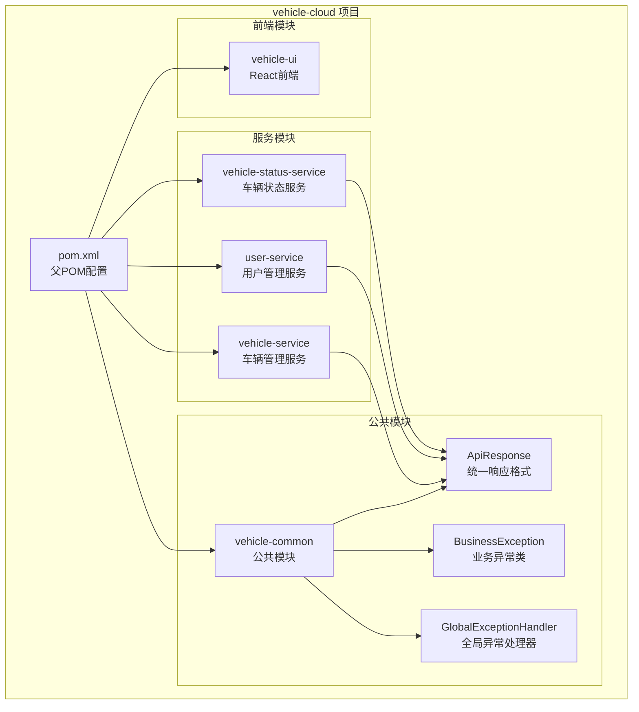
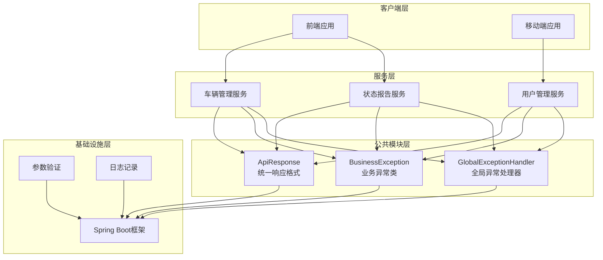
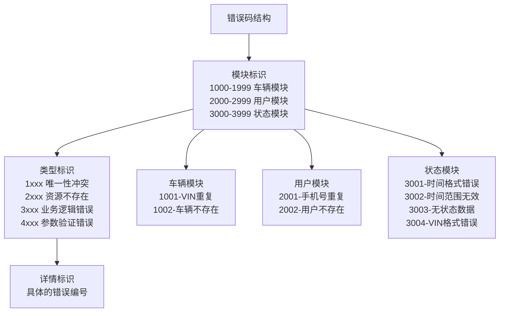
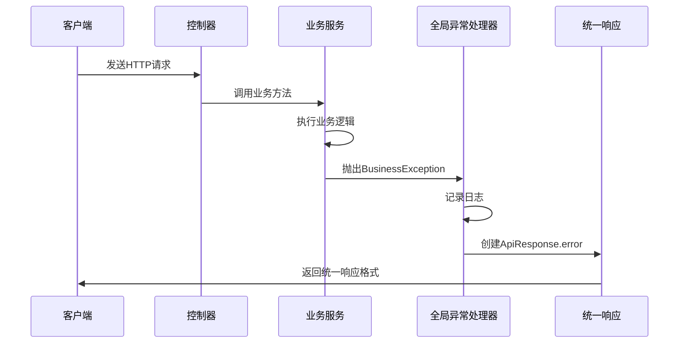
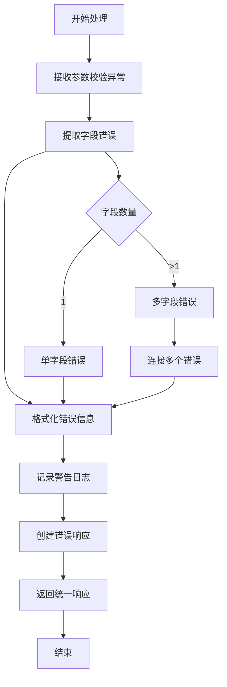
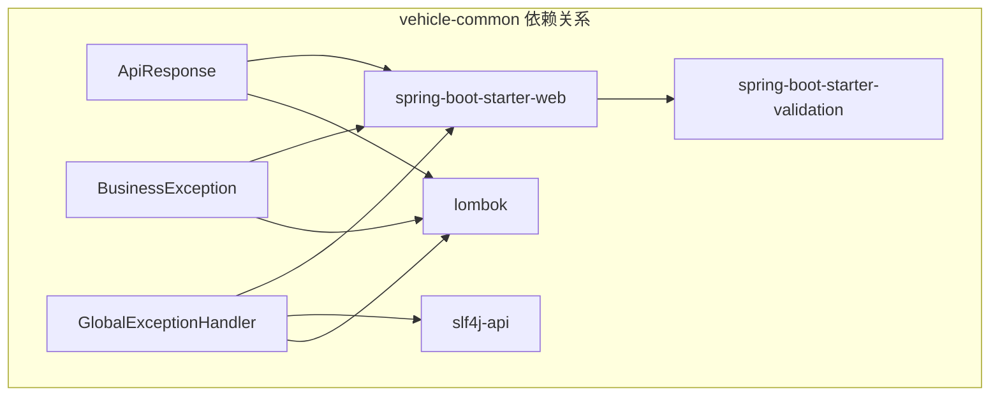

# 公共模块设计

<cite>
**本文档引用的文件**
- [ApiResponse.java](file://vehicle-common/src/main/java/com/wenjie/cloud/common/dto/ApiResponse.java)
- [BusinessException.java](file://vehicle-common/src/main/java/com/wenjie/cloud/common/exception/BusinessException.java)
- [GlobalExceptionHandler.java](file://vehicle-common/src/main/java/com/wenjie/cloud/common/exception/GlobalExceptionHandler.java)
- [vehicle-common/pom.xml](file://vehicle-common/pom.xml)
- [pom.xml](file://pom.xml)
- [README.md](file://README.md)
- [VehicleController.java](file://vehicle-service/src/main/java/com/wenjie/cloud/vehicle/controller/VehicleController.java)
- [UserController.java](file://user-service/src/main/java/com/wenjie/cloud/user/controller/UserController.java)
- [UserServiceImpl.java](file://user-service/src/main/java/com/wenjie/cloud/user/service/impl/UserServiceImpl.java)
- [VehicleServiceImpl.java](file://vehicle-service/src/main/java/com/wenjie/cloud/vehicle/service/impl/VehicleServiceImpl.java)
</cite>

## 目录
1. [简介](#简介)
2. [项目结构](#项目结构)
3. [核心组件](#核心组件)
4. [架构概览](#架构概览)
5. [详细组件分析](#详细组件分析)
6. [依赖分析](#依赖分析)
7. [性能考虑](#性能考虑)
8. [故障排除指南](#故障排除指南)
9. [结论](#结论)

## 简介

vehicle-common 是车联网云平台项目中的公共模块，负责提供统一的API响应格式、业务异常处理机制和全局异常管理。该模块采用Spring Boot多模块架构设计，为整个微服务系统的各个服务提供一致的响应格式和异常处理标准。

该模块的核心设计理念是：
- **统一性**：所有API响应都遵循相同的格式规范
- **可预测性**：异常处理策略标准化，便于前端统一处理
- **可扩展性**：模块化设计，易于维护和扩展
- **易用性**：简化开发者的编码复杂度，专注于业务逻辑

## 项目结构

vehicle-cloud 项目采用Maven多模块架构，vehicle-common作为公共基础设施模块，为其他服务模块提供共享能力。

**图表来源**
- [pom.xml:36-43](file://pom.xml#L36-L43)
- [vehicle-common/pom.xml:14-16](file://vehicle-common/pom.xml#L14-L16)

**章节来源**
- [pom.xml:1-119](file://pom.xml#L1-L119)
- [README.md:19-27](file://README.md#L19-L27)

## 核心组件

vehicle-common模块包含三个核心组件，每个组件都有明确的职责和使用场景：

### ApiResponse统一响应格式

ApiResponse是一个泛型类，用于标准化所有API响应的数据结构。它提供了统一的响应格式，确保前后端交互的一致性和可预测性。

### BusinessException业务异常类

BusinessException是自定义业务异常类，用于封装可预期的业务错误。它继承自RuntimeException，允许在业务逻辑中抛出异常而不强制声明throws语句。

### GlobalExceptionHandler全局异常处理器

GlobalExceptionHandler是一个@RestControllerAdvice类，负责拦截所有Controller层抛出的异常，并将其转换为统一的ApiResponse格式返回给客户端。

**章节来源**
- [ApiResponse.java:7-51](file://vehicle-common/src/main/java/com/wenjie/cloud/common/dto/ApiResponse.java#L7-L51)
- [BusinessException.java:5-26](file://vehicle-common/src/main/java/com/wenjie/cloud/common/exception/BusinessException.java#L5-L26)
- [GlobalExceptionHandler.java:13-55](file://vehicle-common/src/main/java/com/wenjie/cloud/common/exception/GlobalExceptionHandler.java#L13-L55)

## 架构概览

vehicle-common模块在整个系统架构中扮演着基础设施的角色，为所有服务提供统一的响应格式和异常处理机制。

**图表来源**
- [README.md:21-27](file://README.md#L21-L27)
- [vehicle-common/pom.xml:18-29](file://vehicle-common/pom.xml#L18-L29)

## 详细组件分析

### ApiResponse统一响应格式设计

ApiResponse类采用了简洁而强大的设计模式，通过泛型支持不同类型的响应数据。

#### 设计特点

1. **泛型支持**：使用<T>泛型参数，支持任意类型的响应数据
2. **Lombok注解**：使用@Data注解自动生成getter、setter、toString等方法
3. **时间戳自动填充**：构造函数中自动设置当前时间戳
4. **静态工厂方法**：提供success和error静态方法，简化常用操作

#### 字段设计详解

| 字段名 | 类型 | 必填 | 默认值 | 作用说明 |
|--------|------|------|--------|----------|
| code | int | 是 | 无 | 业务状态码，0表示成功，非0表示失败 |
| message | String | 是 | 无 | 提示信息，描述具体错误或成功信息 |
| data | T | 否 | null | 响应数据，可以是任何类型 |
| timestamp | Instant | 是 | 当前时间 | 响应生成时间戳 |

#### 使用规范

1. **成功响应**：使用ApiResponse.success(data)返回成功结果
2. **失败响应**：使用ApiResponse.error(code, message)返回错误结果
3. **空数据响应**：对于删除、更新等操作，data字段可设为null
4. **类型安全**：通过泛型确保编译时类型检查

**章节来源**
- [ApiResponse.java:12-51](file://vehicle-common/src/main/java/com/wenjie/cloud/common/dto/ApiResponse.java#L12-L51)

### BusinessException业务异常类设计

BusinessException是整个异常处理体系的核心，专门用于处理可预期的业务错误。

#### 异常分类设计

根据业务场景的不同，BusinessException可以分为以下几类：

1. **参数验证异常**：输入参数不符合业务规则
2. **资源不存在异常**：请求的资源在数据库中不存在
3. **业务逻辑异常**：违反业务规则的操作
4. **权限异常**：访问权限不足的情况

#### 错误码定义规范

错误码采用分层设计，确保唯一性和可读性：

**图表来源**
- [UserServiceImpl.java:30-65](file://user-service/src/main/java/com/wenjie/cloud/user/service/impl/UserServiceImpl.java#L30-L65)
- [VehicleServiceImpl.java:30-66](file://vehicle-service/src/main/java/com/wenjie/cloud/vehicle/service/impl/VehicleServiceImpl.java#L30-L66)

#### 国际化支持设计

虽然当前版本未实现国际化，但设计时已考虑到国际化需求：

1. **消息模板**：错误消息采用模板格式，便于翻译
2. **参数化**：支持动态参数插入，如ID、名称等
3. **扩展接口**：预留国际化接口，便于后续扩展

**章节来源**
- [BusinessException.java:11-26](file://vehicle-common/src/main/java/com/wenjie/cloud/common/exception/BusinessException.java#L11-L26)

### GlobalExceptionHandler全局异常处理器实现

GlobalExceptionHandler是异常处理的核心组件，负责将各种异常转换为统一的ApiResponse格式。

#### 异常处理策略

**图表来源**
- [GlobalExceptionHandler.java:26-31](file://vehicle-common/src/main/java/com/wenjie/cloud/common/exception/GlobalExceptionHandler.java#L26-L31)

#### 异常分类处理

| 异常类型 | 处理方式 | HTTP状态码 | 错误码 | 日志级别 |
|----------|----------|------------|--------|----------|
| BusinessException | 业务异常 | 400 Bad Request | 自定义错误码 | WARN | 
| MethodArgumentNotValidException | 参数校验异常 | 400 Bad Request | 400 | WARN |
| Exception | 未知异常 | 500 Internal Server Error | 500 | ERROR |

#### 参数校验异常处理流程

**图表来源**
- [GlobalExceptionHandler.java:36-44](file://vehicle-common/src/main/java/com/wenjie/cloud/common/exception/GlobalExceptionHandler.java#L36-L44)

**章节来源**
- [GlobalExceptionHandler.java:19-55](file://vehicle-common/src/main/java/com/wenjie/cloud/common/exception/GlobalExceptionHandler.java#L19-L55)

## 依赖分析

vehicle-common模块的依赖关系相对简单，主要依赖Spring Boot生态系统。

**图表来源**
- [vehicle-common/pom.xml:18-29](file://vehicle-common/pom.xml#L18-L29)

### 外部依赖说明

1. **Spring Boot Starter Web**：提供Web开发必需的基础功能
2. **Spring Boot Starter Validation**：提供参数验证支持
3. **SLF4J API**：提供日志记录功能
4. **Lombok**：简化Java代码，减少样板代码

### 内部依赖关系

所有服务模块都依赖vehicle-common模块，通过Maven依赖管理实现版本统一控制。

**章节来源**
- [vehicle-common/pom.xml:18-30](file://vehicle-common/pom.xml#L18-L30)
- [pom.xml:45-67](file://pom.xml#L45-L67)

## 性能考虑

在设计vehicle-common模块时，性能是一个重要的考虑因素。以下是针对该模块的性能优化建议：

### 响应格式优化

1. **时间戳精度**：使用Instant类确保高精度时间戳
2. **序列化效率**：ApiResponse类设计简洁，便于JSON序列化
3. **内存占用**：泛型设计避免不必要的类型转换

### 异常处理性能

1. **日志级别**：合理使用不同的日志级别，避免过度记录
2. **异常传播**：BusinessException继承RuntimeException，减少异常传播开销
3. **字符串拼接**：参数校验异常处理中使用Stream API进行高效字符串拼接

### 扩展性考虑

1. **模块化设计**：独立的公共模块便于单独部署和升级
2. **接口抽象**：清晰的接口设计便于替换和扩展
3. **配置灵活**：通过Spring Boot配置实现灵活的参数调整

## 故障排除指南

### 常见问题及解决方案

#### 1. 响应格式不一致

**问题现象**：某些API返回的响应格式与统一格式不一致

**解决步骤**：
1. 检查控制器是否使用ApiResponse包装响应
2. 确认所有业务逻辑都抛出BusinessException而非直接返回错误
3. 验证GlobalExceptionHandler是否正确配置

#### 2. 异常处理失效

**问题现象**：业务异常没有被GlobalExceptionHandler捕获

**排查步骤**：
1. 检查@RestControllerAdvice注解是否正确配置
2. 确认BusinessException是否在正确的包路径下
3. 验证异常是否正确抛出而非被捕获

#### 3. 参数校验异常处理异常

**问题现象**：参数校验异常没有正确格式化错误信息

**解决方法**：
1. 检查@Valid注解是否正确使用
2. 确认参数验证注解是否正确配置
3. 验证MethodArgumentNotValidException处理器是否生效

### 调试技巧

1. **日志分析**：通过GlobalExceptionHandler的日志输出定位问题
2. **单元测试**：编写针对异常处理的单元测试
3. **集成测试**：模拟各种异常场景进行测试

**章节来源**
- [GlobalExceptionHandler.java:28-53](file://vehicle-common/src/main/java/com/wenjie/cloud/common/exception/GlobalExceptionHandler.java#L28-L53)

## 结论

vehicle-common模块成功实现了车联网云平台的统一响应格式和异常处理机制。通过精心设计的ApiResponse、BusinessException和GlobalExceptionHandler三个核心组件，该模块为整个微服务系统提供了稳定可靠的基础设施。

### 主要成就

1. **统一性**：所有API响应都遵循相同的格式规范
2. **可预测性**：异常处理策略标准化，便于前端统一处理
3. **可维护性**：模块化设计，代码结构清晰
4. **可扩展性**：设计时考虑了国际化和未来扩展需求

### 最佳实践建议

1. **严格遵守响应格式**：所有API必须使用ApiResponse包装响应
2. **合理使用异常类型**：区分业务异常和系统异常
3. **完善错误码设计**：建立完整的错误码体系
4. **重视日志记录**：通过日志实现问题快速定位

### 未来发展

随着项目的演进，建议考虑以下改进方向：
1. **国际化支持**：实现多语言错误消息支持
2. **监控集成**：集成APM工具进行性能监控
3. **配置中心**：将错误码和消息配置化
4. **API文档**：自动生成API文档和响应示例

该模块为整个车联网云平台奠定了坚实的技术基础，其设计理念和实现方式值得在其他微服务项目中借鉴和推广。