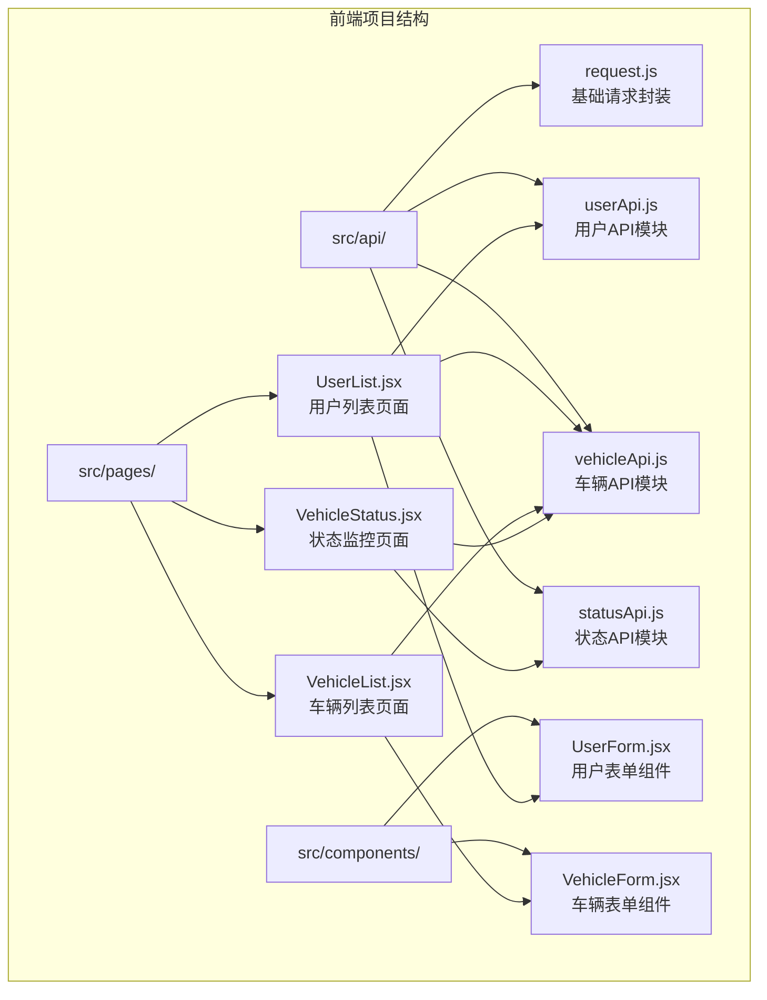
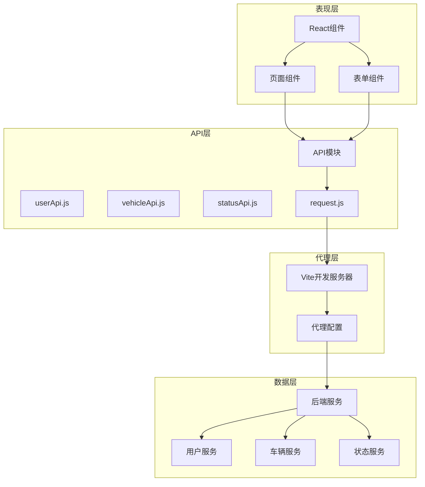
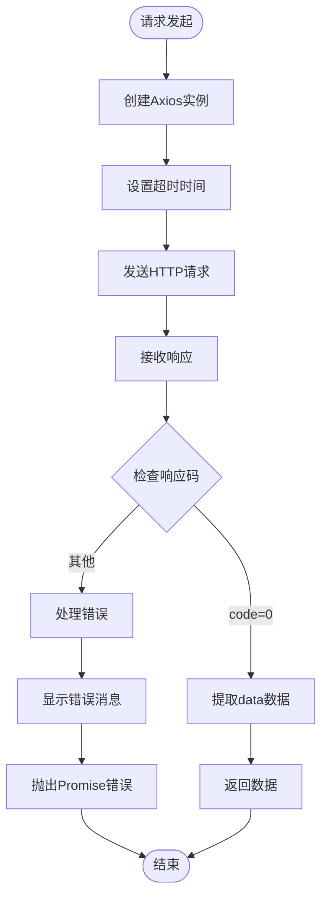
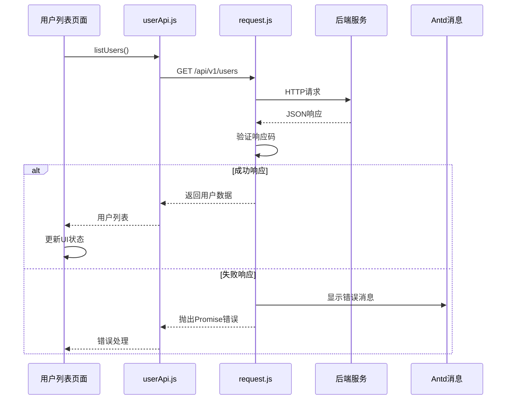
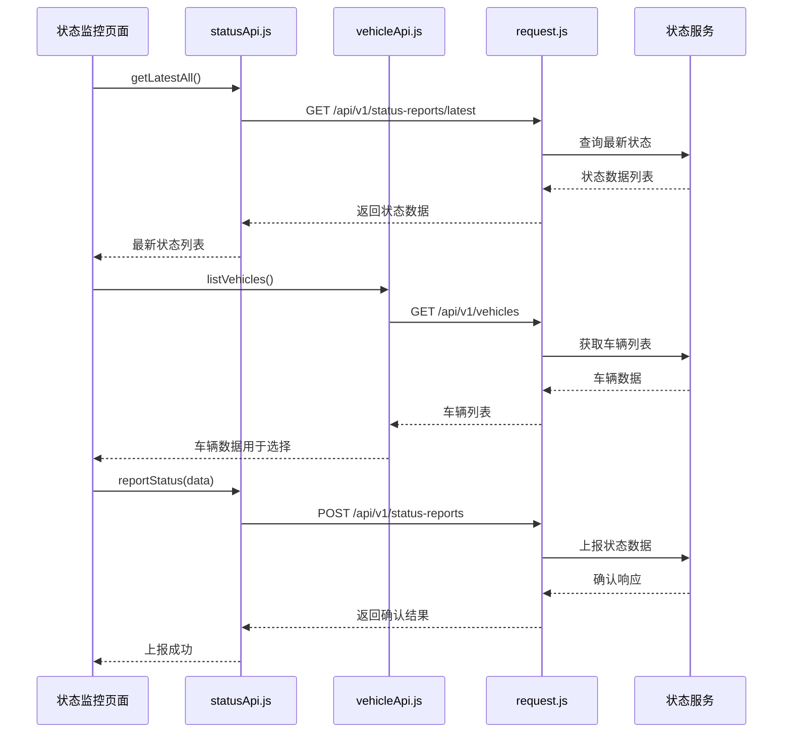
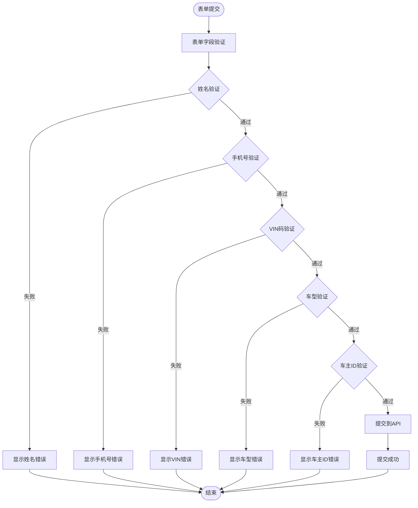
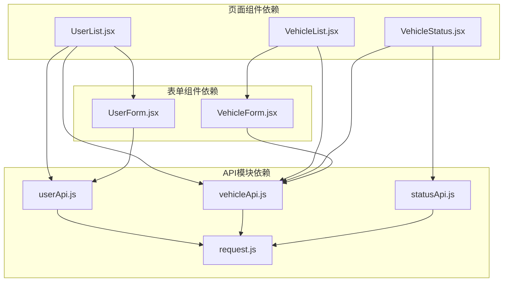

# API客户端设计

<cite>
**本文档引用的文件**
- [request.js](file://vehicle-ui/src/api/request.js)
- [userApi.js](file://vehicle-ui/src/api/userApi.js)
- [vehicleApi.js](file://vehicle-ui/src/api/vehicleApi.js)
- [statusApi.js](file://vehicle-ui/src/api/statusApi.js)
- [UserList.jsx](file://vehicle-ui/src/pages/UserList.jsx)
- [VehicleList.jsx](file://vehicle-ui/src/pages/VehicleList.jsx)
- [VehicleStatus.jsx](file://vehicle-ui/src/pages/VehicleStatus.jsx)
- [UserForm.jsx](file://vehicle-ui/src/components/UserForm.jsx)
- [VehicleForm.jsx](file://vehicle-ui/src/components/VehicleForm.jsx)
- [vite.config.js](file://vehicle-ui/vite.config.js)
- [package.json](file://vehicle-ui/package.json)
</cite>

## 目录
1. [简介](#简介)
2. [项目结构](#项目结构)
3. [核心组件](#核心组件)
4. [架构概览](#架构概览)
5. [详细组件分析](#详细组件分析)
6. [依赖关系分析](#依赖关系分析)
7. [性能考虑](#性能考虑)
8. [故障排除指南](#故障排除指南)
9. [最佳实践](#最佳实践)
10. [结论](#结论)

## 简介

本文件是车辆云平台前端API客户端的设计文档，全面介绍了前端API调用层的设计和实现。该系统采用React + Vite构建，通过Axios进行HTTP请求封装，实现了用户管理、车辆管理和状态监控三大核心功能模块。

系统采用模块化设计，每个API模块独立封装，通过统一的请求基础库进行配置和错误处理。前端通过Vite开发服务器配置代理，解决跨域问题，实现与后端服务的无缝集成。

## 项目结构

前端项目采用清晰的模块化组织结构，API客户端位于`src/api/`目录下，页面组件位于`src/pages/`目录，表单组件位于`src/components/`目录。



**图表来源**
- [request.js:1-26](file://vehicle-ui/src/api/request.js#L1-L26)
- [userApi.js:1-20](file://vehicle-ui/src/api/userApi.js#L1-L20)
- [vehicleApi.js:1-20](file://vehicle-ui/src/api/vehicleApi.js#L1-L20)
- [statusApi.js:1-20](file://vehicle-ui/src/api/statusApi.js#L1-L20)

**章节来源**
- [package.json:1-32](file://vehicle-ui/package.json#L1-L32)
- [vite.config.js:1-25](file://vehicle-ui/vite.config.js#L1-L25)

## 核心组件

### 请求基础库 (request.js)

请求基础库是整个API客户端的核心，基于Axios创建了统一的HTTP客户端实例，并配置了完整的请求和响应拦截器。

#### Axios实例配置
- **超时控制**: 设置10秒超时时间，确保网络请求不会无限等待
- **基础配置**: 通过axios.create()创建独立的实例，避免全局污染

#### 拦截器设计
**响应拦截器**负责统一处理API响应：
- 解析统一的响应格式（code/data/message）
- 成功状态码处理：当code为0时返回data部分
- 错误状态码处理：显示错误消息并抛出Promise错误
- 网络异常处理：捕获网络错误并提供友好的错误提示

**错误拦截器**处理Axios错误：
- 提取响应体中的错误信息
- 处理网络异常情况
- 统一错误消息格式

#### 错误处理策略
- 使用Ant Design的消息组件进行用户友好的错误提示
- 通过Promise.reject()向调用者传递错误信息
- 支持同步和异步错误处理

**章节来源**
- [request.js:1-26](file://vehicle-ui/src/api/request.js#L1-L26)

### 用户API模块 (userApi.js)

用户API模块提供了完整的用户CRUD操作接口，基于统一的请求基础库实现。

#### 接口定义
- **listUsers()**: 获取用户列表
- **getUser(id)**: 根据ID获取用户详情
- **createUser(data)**: 创建新用户
- **deleteUser(id)**: 删除指定用户

#### 参数验证
- 姓名字段必填验证
- 手机号格式验证（11位数字，以1开头）
- 表单级验证在UserForm组件中实现

#### 响应处理
- 自动使用统一的响应拦截器
- 返回标准化的数据格式
- 错误自动提示和处理

**章节来源**
- [userApi.js:1-20](file://vehicle-ui/src/api/userApi.js#L1-L20)
- [UserForm.jsx:1-53](file://vehicle-ui/src/components/UserForm.jsx#L1-L53)

### 车辆API模块 (vehicleApi.js)

车辆API模块实现了车辆管理的核心功能，支持基本的CRUD操作。

#### 接口定义
- **listVehicles()**: 获取车辆列表
- **getVehicle(id)**: 根据ID获取车辆详情
- **createVehicle(data)**: 创建新车辆
- **deleteVehicle(id)**: 删除指定车辆

#### 数据验证
- VIN码长度验证（必须为17位字符）
- 车型选择验证
- 车主ID数值验证

#### 实际应用场景
- 在用户列表页面中展示用户的车辆信息
- 支持车辆筛选和搜索功能
- 提供车辆状态监控的基础数据

**章节来源**
- [vehicleApi.js:1-20](file://vehicle-ui/src/api/vehicleApi.js#L1-L20)
- [VehicleForm.jsx:1-65](file://vehicle-ui/src/components/VehicleForm.jsx#L1-L65)

### 状态API模块 (statusApi.js)

状态API模块专门处理车辆状态报告功能，支持实时状态查询和历史记录管理。

#### 接口定义
- **getLatestAll()**: 获取所有车辆的最新状态
- **getLatestByVin(vin)**: 根据VIN码获取最新状态
- **getStatusHistory(params)**: 获取状态历史记录（支持分页参数）
- **reportStatus(data)**: 上报新的状态数据

#### 分页处理
- 支持分页参数传递
- 通过params对象传递查询条件
- 兼容后端分页接口

#### 实时更新机制
- 提供最新的状态数据查询
- 支持手动刷新和定时更新
- 实现状态数据的动态展示

**章节来源**
- [statusApi.js:1-20](file://vehicle-ui/src/api/statusApi.js#L1-L20)

## 架构概览

系统采用分层架构设计，从上到下分为表现层、API层和数据层。



**图表来源**
- [UserList.jsx:1-114](file://vehicle-ui/src/pages/UserList.jsx#L1-L114)
- [VehicleList.jsx:1-100](file://vehicle-ui/src/pages/VehicleList.jsx#L1-L100)
- [VehicleStatus.jsx:1-169](file://vehicle-ui/src/pages/VehicleStatus.jsx#L1-L169)
- [vite.config.js:1-25](file://vehicle-ui/vite.config.js#L1-L25)

## 详细组件分析

### 请求拦截器流程图



**图表来源**
- [request.js:8-23](file://vehicle-ui/src/api/request.js#L8-L23)

### 用户管理API调用序列



**图表来源**
- [UserList.jsx:15-21](file://vehicle-ui/src/pages/UserList.jsx#L15-L21)
- [userApi.js:5-7](file://vehicle-ui/src/api/userApi.js#L5-L7)
- [request.js:8-23](file://vehicle-ui/src/api/request.js#L8-L23)

### 车辆状态监控流程



**图表来源**
- [VehicleStatus.jsx:17-61](file://vehicle-ui/src/pages/VehicleStatus.jsx#L17-L61)
- [statusApi.js:5-19](file://vehicle-ui/src/api/statusApi.js#L5-L19)
- [vehicleApi.js:5-7](file://vehicle-ui/src/api/vehicleApi.js#L5-L7)

### 表单验证流程



**图表来源**
- [UserForm.jsx:7-17](file://vehicle-ui/src/components/UserForm.jsx#L7-L17)
- [VehicleForm.jsx:13-23](file://vehicle-ui/src/components/VehicleForm.jsx#L13-L23)

**章节来源**
- [UserList.jsx:1-114](file://vehicle-ui/src/pages/UserList.jsx#L1-L114)
- [VehicleList.jsx:1-100](file://vehicle-ui/src/pages/VehicleList.jsx#L1-L100)
- [VehicleStatus.jsx:1-169](file://vehicle-ui/src/pages/VehicleStatus.jsx#L1-L169)

## 依赖关系分析

### 外部依赖

系统主要依赖以下关键包：

```mermaid
graph LR
subgraph "核心依赖"
AXIOS[axios ^1.15.2]
REACT[react ^19.2.5]
REACTDOM[react-dom ^19.2.5]
ANTD[antd ^6.3.6]
ROUTER[react-router-dom ^7.14.2]
end
subgraph "开发依赖"
VITE[vite ^8.0.9]
ESLINT[eslint ^9.39.4]
REACTPLUGIN[@vitejs/plugin-react ^6.0.1]
end
APP[vehicle-ui] --> AXIOS
APP --> REACT
APP --> REACTDOM
APP --> ANTD
APP --> ROUTER
VITECONFIG[vite.config.js] --> VITE
VITECONFIG --> REACTPLUGIN
```

**图表来源**
- [package.json:12-30](file://vehicle-ui/package.json#L12-L30)

### 内部依赖关系



**图表来源**
- [request.js:1-26](file://vehicle-ui/src/api/request.js#L1-L26)
- [userApi.js:1-20](file://vehicle-ui/src/api/userApi.js#L1-L20)
- [vehicleApi.js:1-20](file://vehicle-ui/src/api/vehicleApi.js#L1-L20)
- [statusApi.js:1-20](file://vehicle-ui/src/api/statusApi.js#L1-L20)

**章节来源**
- [package.json:1-32](file://vehicle-ui/package.json#L1-L32)

## 性能考虑

### 网络请求优化

1. **超时控制**: 设置10秒超时时间，平衡用户体验和资源占用
2. **请求合并**: 在用户列表页面中，通过一次请求获取所有用户数据
3. **缓存策略**: 利用React组件的状态缓存已获取的数据

### UI渲染优化

1. **虚拟滚动**: 使用Ant Design表格的分页功能，限制每页显示10条记录
2. **条件渲染**: 只在需要时渲染模态框和对话框
3. **防抖处理**: 在搜索功能中避免频繁的API调用

### 内存管理

1. **清理机制**: 在组件卸载时设置忽略标志，防止内存泄漏
2. **状态管理**: 使用useState和useEffect正确管理组件状态
3. **事件处理**: 使用useCallback优化函数引用，减少不必要的重渲染

## 故障排除指南

### 常见问题及解决方案

#### 跨域问题
**症状**: 浏览器控制台出现CORS错误
**原因**: 开发环境下不同端口的服务间通信
**解决方案**: 
- 检查Vite代理配置是否正确
- 确认后端服务端口配置
- 验证代理路径映射

#### API调用失败
**症状**: 页面显示"请求失败"或"网络异常"
**排查步骤**:
1. 检查后端服务是否正常运行
2. 验证API端点URL是否正确
3. 查看浏览器开发者工具的Network面板
4. 确认响应格式是否符合预期

#### 表单验证错误
**症状**: 表单提交时报验证错误
**解决方案**:
1. 检查表单字段的验证规则
2. 确认用户输入格式是否正确
3. 查看Ant Design提供的错误提示

#### 数据加载问题
**症状**: 页面空白或加载时间过长
**排查方法**:
1. 检查网络连接状态
2. 验证API响应时间
3. 确认前端状态管理逻辑

**章节来源**
- [vite.config.js:7-23](file://vehicle-ui/vite.config.js#L7-L23)
- [request.js:18-22](file://vehicle-ui/src/api/request.js#L18-L22)

## 最佳实践

### 错误处理策略

1. **统一错误处理**: 所有API调用都通过统一的请求基础库处理
2. **用户友好提示**: 使用Ant Design的消息组件提供清晰的错误信息
3. **错误分类**: 区分网络错误、业务错误和参数错误
4. **重试机制**: 对于临时性错误提供重试选项

### 数据验证最佳实践

1. **前端验证**: 在表单层面进行即时验证
2. **后端验证**: 保持后端验证作为最后一道防线
3. **验证规则**: 定义清晰的验证规则和错误消息
4. **用户体验**: 提供实时的验证反馈

### 性能优化建议

1. **请求去重**: 避免重复发送相同的请求
2. **懒加载**: 按需加载数据，减少初始加载时间
3. **缓存策略**: 合理使用缓存提高响应速度
4. **批处理**: 对于批量操作使用批处理接口

### 安全考虑

1. **输入验证**: 对所有用户输入进行严格验证
2. **权限控制**: 在API层面实现适当的权限检查
3. **数据加密**: 敏感数据传输时使用HTTPS
4. **XSS防护**: 对用户输入进行适当的转义处理

### 调试工具使用

1. **浏览器开发者工具**: 使用Network面板监控API调用
2. **React DevTools**: 检查组件状态和props
3. **Vite调试**: 利用Vite的热重载功能快速迭代
4. **日志记录**: 在开发环境中添加必要的日志输出

## 结论

本API客户端设计文档展示了车辆云平台前端API调用层的完整实现。系统采用模块化设计，通过统一的请求基础库实现了代码复用和一致的错误处理。三个核心API模块（用户、车辆、状态）提供了完整的业务功能覆盖。

设计特点包括：
- **统一的错误处理**: 通过拦截器实现全局错误处理
- **清晰的模块边界**: 每个API模块职责明确
- **完善的表单验证**: 前后端双重验证保障数据质量
- **良好的扩展性**: 模块化设计便于功能扩展

该设计为后续的功能扩展和维护奠定了坚实的基础，同时为用户提供流畅的交互体验。