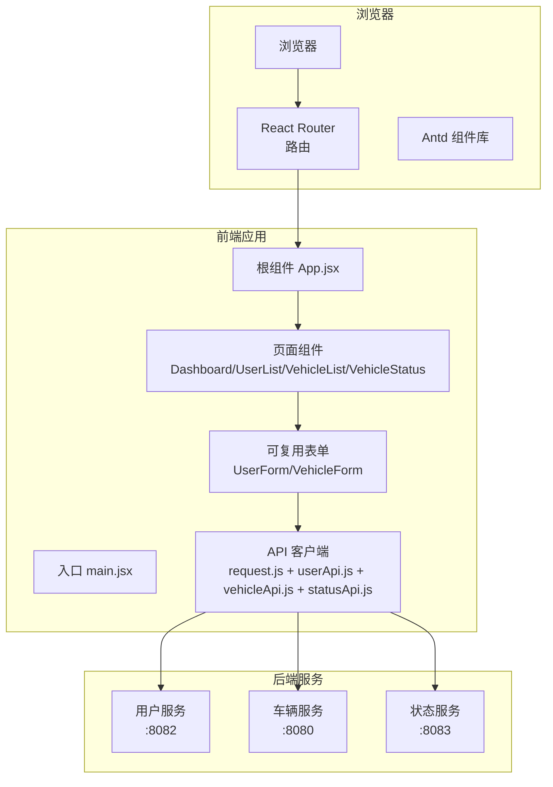
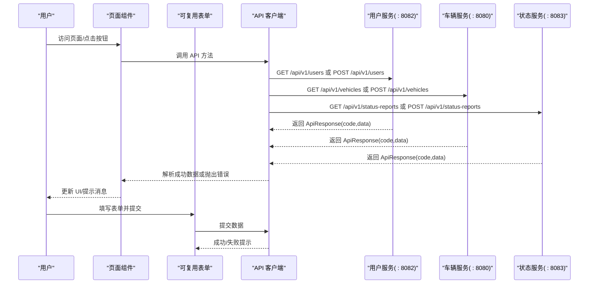
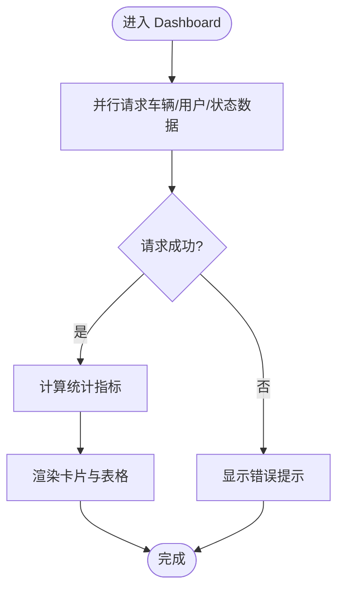
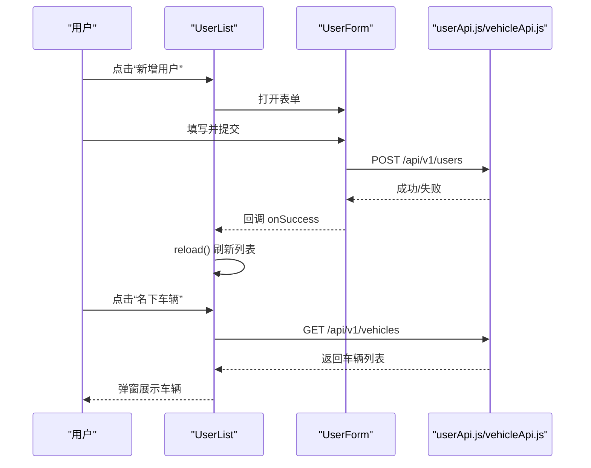
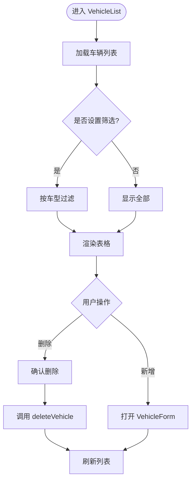
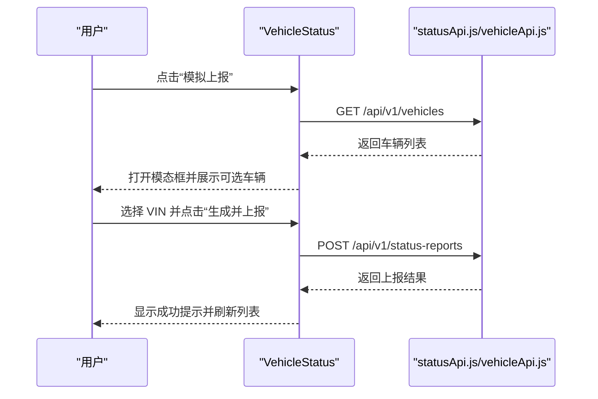
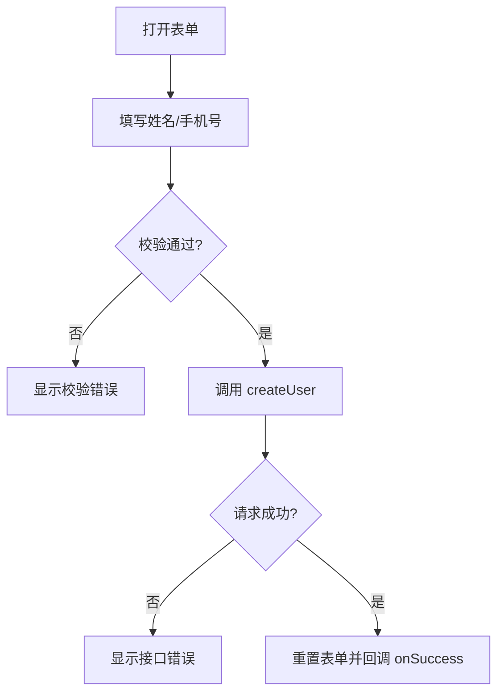
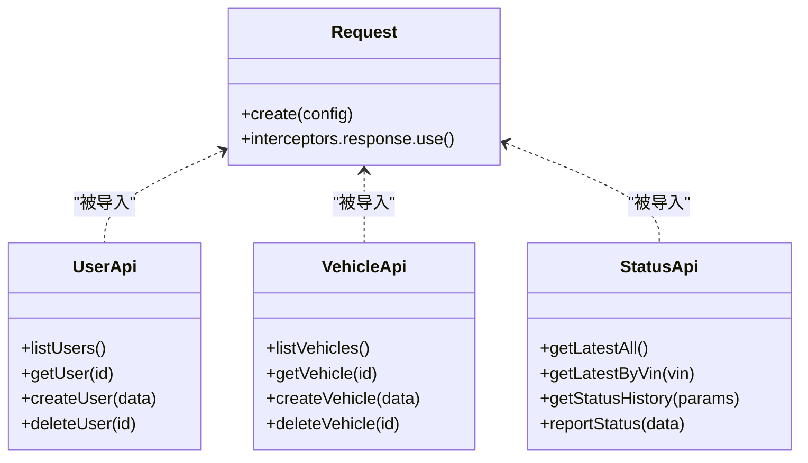
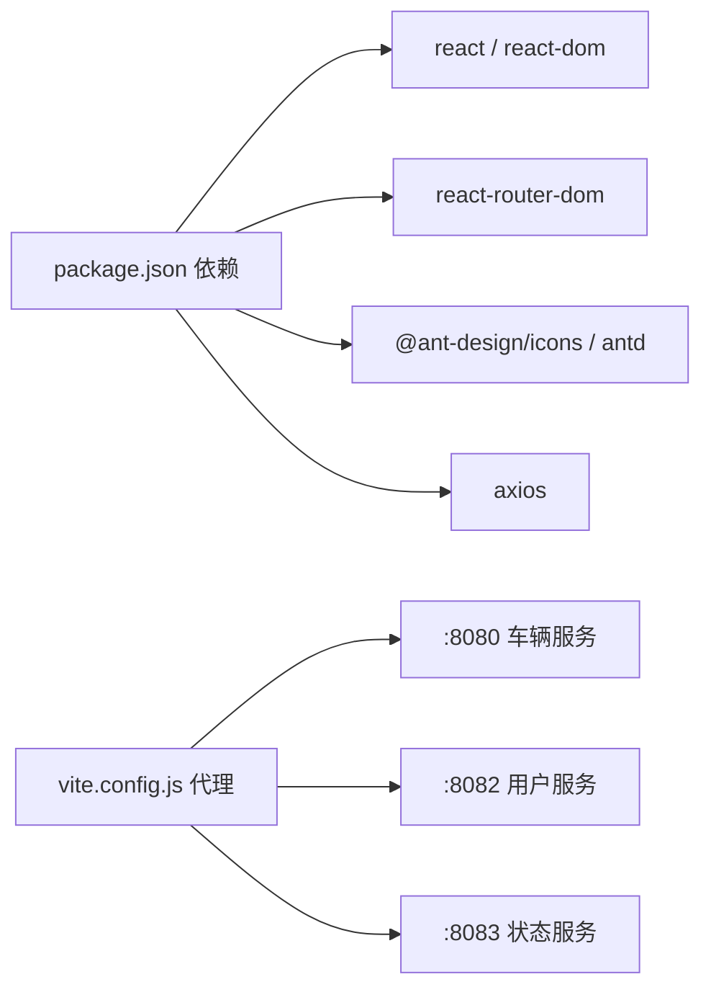

# 前端应用架构

<cite>
**本文档引用的文件**
- [App.jsx](file://vehicle-ui/src/App.jsx)
- [main.jsx](file://vehicle-ui/src/main.jsx)
- [package.json](file://vehicle-ui/package.json)
- [vite.config.js](file://vehicle-ui/vite.config.js)
- [request.js](file://vehicle-ui/src/api/request.js)
- [userApi.js](file://vehicle-ui/src/api/userApi.js)
- [vehicleApi.js](file://vehicle-ui/src/api/vehicleApi.js)
- [statusApi.js](file://vehicle-ui/src/api/statusApi.js)
- [Dashboard.jsx](file://vehicle-ui/src/pages/Dashboard.jsx)
- [UserList.jsx](file://vehicle-ui/src/pages/UserList.jsx)
- [VehicleList.jsx](file://vehicle-ui/src/pages/VehicleList.jsx)
- [VehicleStatus.jsx](file://vehicle-ui/src/pages/VehicleStatus.jsx)
- [UserForm.jsx](file://vehicle-ui/src/components/UserForm.jsx)
- [VehicleForm.jsx](file://vehicle-ui/src/components/VehicleForm.jsx)
</cite>

## 目录
1. [简介](#简介)
2. [项目结构](#项目结构)
3. [核心组件](#核心组件)
4. [架构总览](#架构总览)
5. [详细组件分析](#详细组件分析)
6. [依赖关系分析](#依赖关系分析)
7. [性能考虑](#性能考虑)
8. [故障排查指南](#故障排查指南)
9. [结论](#结论)
10. [附录](#附录)

## 简介
本项目是一个基于 React + Ant Design 的单页应用（SPA），采用 Vite 构建工具与 React Router 进行路由管理，Antd 提供丰富的 UI 组件。应用通过 Axios 封装的 API 客户端与后端服务交互，后端由多个微服务组成，分别提供用户、车辆与状态报告的数据能力。前端负责页面展示、表单校验、状态管理与错误提示，整体架构清晰、职责分离明确。

## 项目结构
- 应用入口与路由
  - 入口文件负责挂载 BrowserRouter 并渲染根组件 App。
  - App 组件定义侧边栏菜单、面包屑风格的头部区域以及路由区域。
  - 路由区域包含仪表盘、车辆管理、用户管理、车辆状态四个页面。
- 页面组件
  - Dashboard：聚合车辆、用户与状态数据，进行统计与可视化展示。
  - UserList：用户列表展示、新增与删除、查看某用户的车辆。
  - VehicleList：车辆列表展示、新增与删除、按车型筛选。
  - VehicleStatus：状态列表展示、VIN 搜索、模拟上报。
- 可复用组件
  - UserForm：用户新增表单，包含 Antd 表单校验与提交。
  - VehicleForm：车辆新增表单，包含 VIN、车型、车主 ID 等字段。
- API 客户端
  - request.js：Axios 实例封装与统一响应拦截。
  - userApi.js、vehicleApi.js、statusApi.js：各模块 API 方法集合。
- 构建与代理
  - vite.config.js：开发服务器代理，将 /api/v1/* 请求转发到对应后端服务端口。

**图表来源**
- [main.jsx:1-14](file://vehicle-ui/src/main.jsx#L1-L14)
- [App.jsx:24-78](file://vehicle-ui/src/App.jsx#L24-L78)
- [Dashboard.jsx:1-140](file://vehicle-ui/src/pages/Dashboard.jsx#L1-L140)
- [UserList.jsx:1-114](file://vehicle-ui/src/pages/UserList.jsx#L1-L114)
- [VehicleList.jsx:1-100](file://vehicle-ui/src/pages/VehicleList.jsx#L1-L100)
- [VehicleStatus.jsx:1-169](file://vehicle-ui/src/pages/VehicleStatus.jsx#L1-L169)
- [UserForm.jsx:1-53](file://vehicle-ui/src/components/UserForm.jsx#L1-L53)
- [VehicleForm.jsx:1-65](file://vehicle-ui/src/components/VehicleForm.jsx#L1-L65)
- [request.js:1-26](file://vehicle-ui/src/api/request.js#L1-L26)
- [userApi.js:1-20](file://vehicle-ui/src/api/userApi.js#L1-L20)
- [vehicleApi.js:1-20](file://vehicle-ui/src/api/vehicleApi.js#L1-L20)
- [statusApi.js:1-20](file://vehicle-ui/src/api/statusApi.js#L1-L20)

**章节来源**
- [main.jsx:1-14](file://vehicle-ui/src/main.jsx#L1-L14)
- [App.jsx:17-22](file://vehicle-ui/src/App.jsx#L17-L22)
- [App.jsx:64-69](file://vehicle-ui/src/App.jsx#L64-L69)
- [vite.config.js:7-23](file://vehicle-ui/vite.config.js#L7-L23)

## 核心组件
- 根组件 App
  - 负责侧边栏菜单与路由容器，使用 Antd Layout、Menu、theme 提供主题与布局。
  - 使用 useLocation 动态高亮当前选中菜单项。
- 页面组件
  - Dashboard：并行加载车辆、用户、状态数据，计算统计指标并渲染卡片与表格。
  - UserList：支持刷新、新增用户、删除用户、查看某用户名下的车辆。
  - VehicleList：支持刷新、新增车辆、删除车辆、按车型筛选。
  - VehicleStatus：支持刷新、VIN 搜索、模拟上报状态。
- 可复用表单
  - UserForm：姓名与手机号必填校验，手机号格式校验。
  - VehicleForm：VIN 长度校验、车型必选项、车主 ID 数字输入。
- API 客户端
  - request.js：统一超时、响应拦截、错误提示；后端返回 code=0 视为成功。
  - userApi/vehicleApi/statusApi：对不同后端服务的 REST 接口进行封装。

**章节来源**
- [App.jsx:24-78](file://vehicle-ui/src/App.jsx#L24-L78)
- [Dashboard.jsx:14-32](file://vehicle-ui/src/pages/Dashboard.jsx#L14-L32)
- [UserList.jsx:8-32](file://vehicle-ui/src/pages/UserList.jsx#L8-L32)
- [VehicleList.jsx:13-37](file://vehicle-ui/src/pages/VehicleList.jsx#L13-L37)
- [VehicleStatus.jsx:7-28](file://vehicle-ui/src/pages/VehicleStatus.jsx#L7-L28)
- [UserForm.jsx:4-17](file://vehicle-ui/src/components/UserForm.jsx#L4-L17)
- [VehicleForm.jsx:10-23](file://vehicle-ui/src/components/VehicleForm.jsx#L10-L23)
- [request.js:4-23](file://vehicle-ui/src/api/request.js#L4-L23)

## 架构总览
应用采用“页面组件 + 可复用表单 + API 客户端”的分层设计，页面组件负责业务逻辑与 UI 呈现，可复用表单承担表单校验与提交，API 客户端统一封装请求与错误处理。路由在根组件集中配置，页面组件通过 API 客户端访问后端服务，开发环境通过 Vite 代理将 /api/v1/* 请求转发至对应后端端口。

**图表来源**
- [App.jsx:64-69](file://vehicle-ui/src/App.jsx#L64-L69)
- [request.js:9-23](file://vehicle-ui/src/api/request.js#L9-L23)
- [userApi.js:3-19](file://vehicle-ui/src/api/userApi.js#L3-L19)
- [vehicleApi.js:3-19](file://vehicle-ui/src/api/vehicleApi.js#L3-L19)
- [statusApi.js:3-19](file://vehicle-ui/src/api/statusApi.js#L3-L19)
- [vite.config.js:9-21](file://vehicle-ui/vite.config.js#L9-L21)

## 详细组件分析

### 仪表盘 Dashboard
- 数据加载
  - 使用 Promise.all 并行请求车辆、用户与状态数据，避免串行等待。
  - 使用 ignore 变量防止卸载后的状态更新。
- 统计与展示
  - 车辆总数、用户总数、车型种类、人均车辆等统计。
  - 车队平均电量、低电量车辆数量。
  - 车型分布进度条与最近添加车辆表格。
- 性能与体验
  - 加载状态控制，避免闪烁。
  - 颜色映射与标签渲染提升可读性。

**图表来源**
- [Dashboard.jsx:20-32](file://vehicle-ui/src/pages/Dashboard.jsx#L20-L32)
- [Dashboard.jsx:34-47](file://vehicle-ui/src/pages/Dashboard.jsx#L34-L47)
- [Dashboard.jsx:61-136](file://vehicle-ui/src/pages/Dashboard.jsx#L61-L136)

**章节来源**
- [Dashboard.jsx:14-32](file://vehicle-ui/src/pages/Dashboard.jsx#L14-L32)
- [Dashboard.jsx:34-102](file://vehicle-ui/src/pages/Dashboard.jsx#L34-L102)
- [Dashboard.jsx:104-136](file://vehicle-ui/src/pages/Dashboard.jsx#L104-L136)

### 用户列表 UserList
- 列表与交互
  - 支持刷新、新增用户、删除用户。
  - 查看某用户名下的车辆，弹窗展示车辆列表。
- 状态管理
  - 使用 refreshKey 控制重新拉取数据，确保删除后即时更新。
  - 使用 vehicleModal 控制模态框状态与数据。
- 错误处理
  - 删除成功后提示并刷新；失败由 API 客户端统一拦截。

**图表来源**
- [UserList.jsx:8-38](file://vehicle-ui/src/pages/UserList.jsx#L8-L38)
- [UserList.jsx:85-89](file://vehicle-ui/src/pages/UserList.jsx#L85-L89)
- [UserForm.jsx:4-17](file://vehicle-ui/src/components/UserForm.jsx#L4-L17)
- [userApi.js:13-14](file://vehicle-ui/src/api/userApi.js#L13-L14)
- [vehicleApi.js:5](file://vehicle-ui/src/api/vehicleApi.js#L5)

**章节来源**
- [UserList.jsx:8-38](file://vehicle-ui/src/pages/UserList.jsx#L8-L38)
- [UserList.jsx:40-68](file://vehicle-ui/src/pages/UserList.jsx#L40-L68)
- [UserList.jsx:90-109](file://vehicle-ui/src/pages/UserList.jsx#L90-L109)

### 车辆列表 VehicleList
- 列表与交互
  - 支持刷新、新增车辆、删除车辆。
  - 提供按车型筛选功能。
- 状态管理
  - 使用 filterModel 控制筛选条件，filteredData 作为渲染数据源。
  - 使用 refreshKey 控制重新拉取数据。
- 错误处理
  - 删除成功后提示并刷新；失败由 API 客户端统一拦截。

**图表来源**
- [VehicleList.jsx:20-41](file://vehicle-ui/src/pages/VehicleList.jsx#L20-L41)
- [VehicleList.jsx:83-96](file://vehicle-ui/src/pages/VehicleList.jsx#L83-L96)
- [VehicleForm.jsx:10-23](file://vehicle-ui/src/components/VehicleForm.jsx#L10-L23)
- [vehicleApi.js:17-18](file://vehicle-ui/src/api/vehicleApi.js#L17-L18)

**章节来源**
- [VehicleList.jsx:13-37](file://vehicle-ui/src/pages/VehicleList.jsx#L13-L37)
- [VehicleList.jsx:39-41](file://vehicle-ui/src/pages/VehicleList.jsx#L39-L41)
- [VehicleList.jsx:83-96](file://vehicle-ui/src/pages/VehicleList.jsx#L83-L96)

### 车辆状态 VehicleStatus
- 列表与交互
  - 支持刷新、VIN 搜索、模拟上报状态。
  - 模态框选择车辆 VIN，生成随机状态并上报。
- 渲染细节
  - 电量使用颜色区分与进度条展示。
  - 速度、温度、里程等字段格式化显示。
- 错误处理
  - 上报前校验 VIN 选择；成功后提示并刷新。

**图表来源**
- [VehicleStatus.jsx:30-61](file://vehicle-ui/src/pages/VehicleStatus.jsx#L30-L61)
- [VehicleStatus.jsx:113-164](file://vehicle-ui/src/pages/VehicleStatus.jsx#L113-L164)
- [statusApi.js:5-19](file://vehicle-ui/src/api/statusApi.js#L5-L19)
- [vehicleApi.js:5](file://vehicle-ui/src/api/vehicleApi.js#L5)

**章节来源**
- [VehicleStatus.jsx:7-28](file://vehicle-ui/src/pages/VehicleStatus.jsx#L7-L28)
- [VehicleStatus.jsx:63-111](file://vehicle-ui/src/pages/VehicleStatus.jsx#L63-L111)
- [VehicleStatus.jsx:137-164](file://vehicle-ui/src/pages/VehicleStatus.jsx#L137-L164)

### 可复用组件 UserForm
- 表单设计
  - 姓名必填；手机号必填且符合 11 位格式。
  - 使用 Antd Form 的 validateFields 进行校验。
- 提交流程
  - 校验通过后调用 createUser，成功后重置表单并回调 onSuccess。
  - 失败由 API 客户端统一拦截并提示。

**图表来源**
- [UserForm.jsx:7-17](file://vehicle-ui/src/components/UserForm.jsx#L7-L17)
- [userApi.js:13-14](file://vehicle-ui/src/api/userApi.js#L13-L14)

**章节来源**
- [UserForm.jsx:4-17](file://vehicle-ui/src/components/UserForm.jsx#L4-L17)
- [UserForm.jsx:29-47](file://vehicle-ui/src/components/UserForm.jsx#L29-L47)

### 可复用组件 VehicleForm
- 表单设计
  - VIN 必填且长度为 17；车型必选；车主 ID 可选数字。
- 提交流程
  - 校验通过后调用 createVehicle，成功后重置表单并回调 onSuccess。
  - 失败由 API 客户端统一拦截并提示。

**章节来源**
- [VehicleForm.jsx:10-23](file://vehicle-ui/src/components/VehicleForm.jsx#L10-L23)
- [VehicleForm.jsx:35-59](file://vehicle-ui/src/components/VehicleForm.jsx#L35-L59)

### API 客户端设计
- request.js
  - 创建 Axios 实例并设置超时。
  - 响应拦截器统一解析后端 ApiResponse，code=0 视为成功，否则弹出错误并拒绝 Promise。
  - 网络错误时提取 message 并提示。
- userApi.js
  - listUsers/getUser/createUser/deleteUser 对应用户管理接口。
- vehicleApi.js
  - listVehicles/getVehicle/createVehicle/deleteVehicle 对应车辆管理接口。
- statusApi.js
  - getLatestAll/getLatestByVin/getStatusHistory/reportStatus 对应状态管理接口。

**图表来源**
- [request.js:4-23](file://vehicle-ui/src/api/request.js#L4-L23)
- [userApi.js:3-19](file://vehicle-ui/src/api/userApi.js#L3-L19)
- [vehicleApi.js:3-19](file://vehicle-ui/src/api/vehicleApi.js#L3-L19)
- [statusApi.js:3-19](file://vehicle-ui/src/api/statusApi.js#L3-L19)

**章节来源**
- [request.js:1-26](file://vehicle-ui/src/api/request.js#L1-L26)
- [userApi.js:1-20](file://vehicle-ui/src/api/userApi.js#L1-L20)
- [vehicleApi.js:1-20](file://vehicle-ui/src/api/vehicleApi.js#L1-L20)
- [statusApi.js:1-20](file://vehicle-ui/src/api/statusApi.js#L1-L20)

## 依赖关系分析
- 运行时依赖
  - React、react-dom、react-router-dom、antd、@ant-design/icons、axios。
- 构建与开发依赖
  - @vitejs/plugin-react、eslint 及相关插件。
- 代理配置
  - 将 /api/v1/vehicles → 车辆服务端口
  - 将 /api/v1/users → 用户服务端口
  - 将 /api/v1/status-reports → 状态服务端口

**图表来源**
- [package.json:12-19](file://vehicle-ui/package.json#L12-L19)
- [vite.config.js:9-21](file://vehicle-ui/vite.config.js#L9-L21)

**章节来源**
- [package.json:1-32](file://vehicle-ui/package.json#L1-L32)
- [vite.config.js:1-25](file://vehicle-ui/vite.config.js#L1-L25)

## 性能考虑
- 并发请求
  - Dashboard 使用 Promise.all 并行加载数据，减少首屏等待时间。
- 列表渲染
  - 使用 rowKey、pagination、size 等参数优化表格渲染性能。
- 表单与模态框
  - destroyOnClose 与 resetFields 在关闭时释放资源，避免重复渲染。
- 代理与跨域
  - 开发环境通过 Vite 代理避免跨域问题，提高调试效率。

**章节来源**
- [Dashboard.jsx:20-32](file://vehicle-ui/src/pages/Dashboard.jsx#L20-L32)
- [UserList.jsx:78-84](file://vehicle-ui/src/pages/UserList.jsx#L78-L84)
- [VehicleList.jsx:83-89](file://vehicle-ui/src/pages/VehicleList.jsx#L83-L89)
- [VehicleStatus.jsx:130-136](file://vehicle-ui/src/pages/VehicleStatus.jsx#L130-L136)
- [UserForm.jsx:24-27](file://vehicle-ui/src/components/UserForm.jsx#L24-L27)
- [VehicleForm.jsx:30-34](file://vehicle-ui/src/components/VehicleForm.jsx#L30-L34)

## 故障排查指南
- 网络请求失败
  - 检查后端服务是否启动及端口是否正确。
  - 确认 Vite 代理配置是否匹配后端端口。
- 响应拦截错误
  - request.js 已统一拦截并提示错误信息，关注控制台与消息提示。
- 表单校验失败
  - UserForm 与 VehicleForm 内置规则，检查必填与格式要求。
- 列表未刷新
  - 确认 refreshKey 是否递增触发重新加载。

**章节来源**
- [request.js:18-23](file://vehicle-ui/src/api/request.js#L18-L23)
- [vite.config.js:9-21](file://vehicle-ui/vite.config.js#L9-L21)
- [UserForm.jsx:30-46](file://vehicle-ui/src/components/UserForm.jsx#L30-L46)
- [VehicleForm.jsx:36-58](file://vehicle-ui/src/components/VehicleForm.jsx#L36-L58)

## 结论
本项目以 React + Ant Design 为基础，结合 Vite 与 React Router 构建了清晰的单页应用架构。页面组件职责明确、可复用表单保证一致的交互体验，API 客户端统一处理请求与错误，开发代理简化了跨域调试。整体设计具备良好的扩展性与可维护性，适合在微服务架构下进行持续演进。

## 附录
- 入口与路由
  - 入口文件挂载 BrowserRouter，根组件集中配置路由与布局。
- 样式与主题
  - 使用 Antd 主题 token 与布局组件，保持视觉一致性。
- 响应式与布局
  - 使用 Antd Grid 与 Layout 组件实现响应式布局与自适应。

**章节来源**
- [main.jsx:7-13](file://vehicle-ui/src/main.jsx#L7-L13)
- [App.jsx:30-74](file://vehicle-ui/src/App.jsx#L30-L74)
- [index.css](file://vehicle-ui/src/index.css)