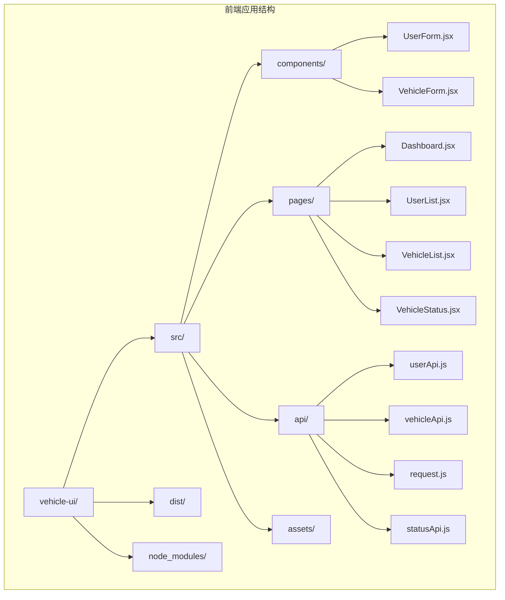
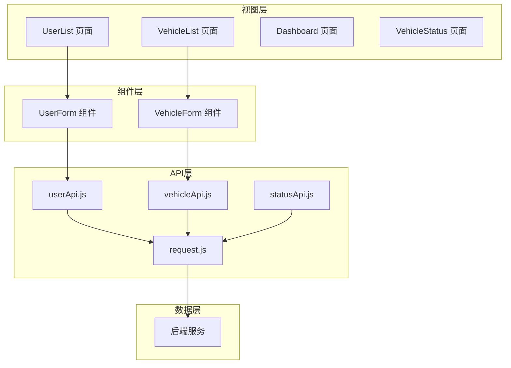
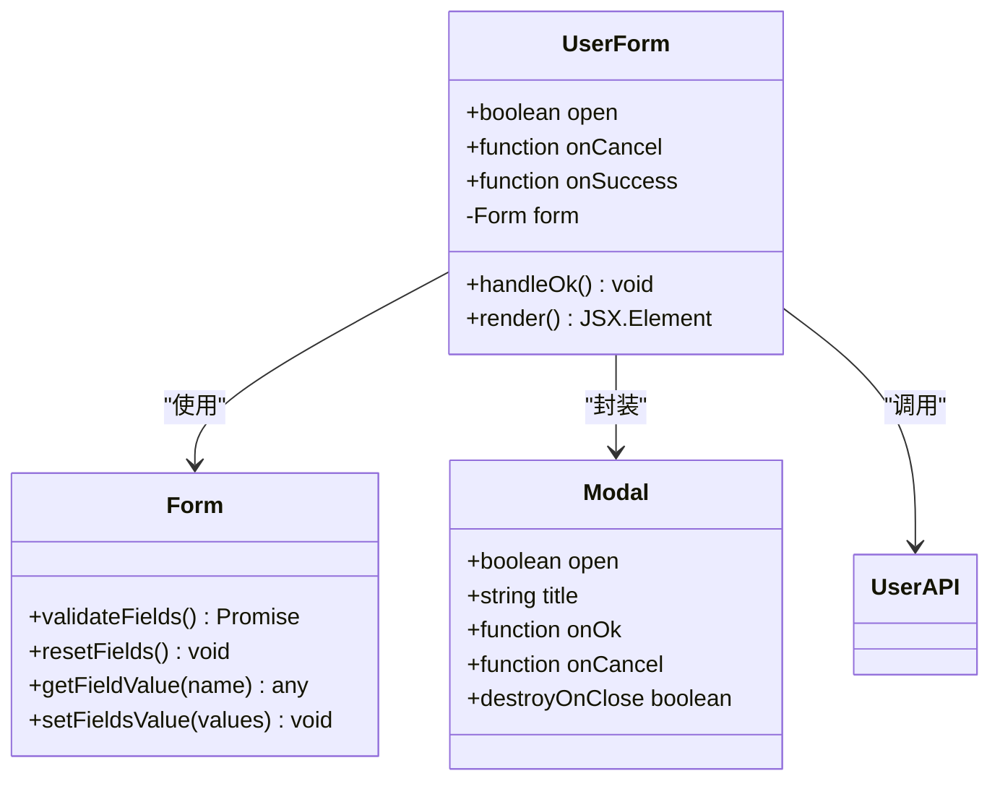
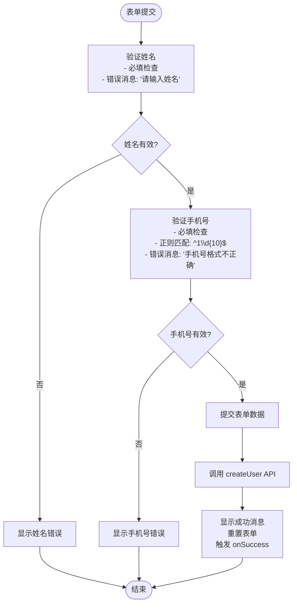
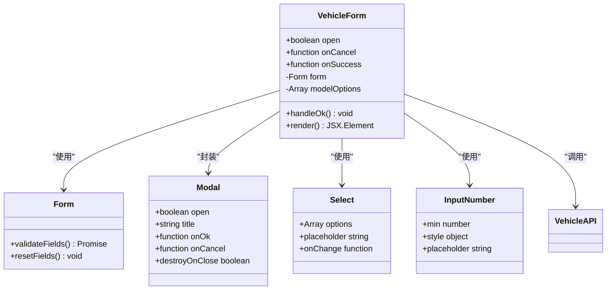
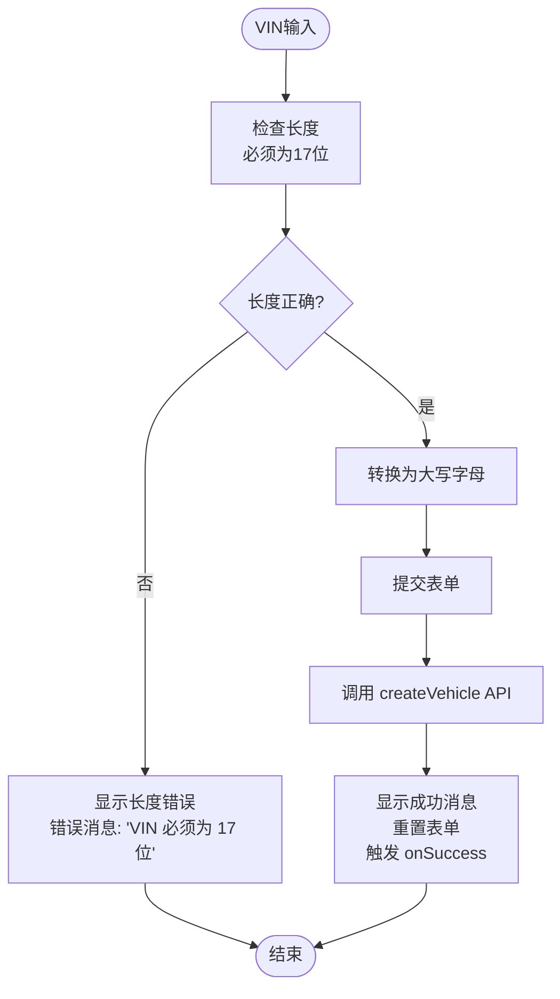
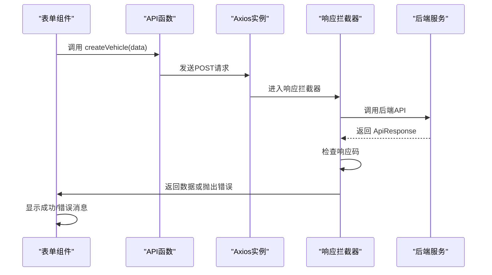
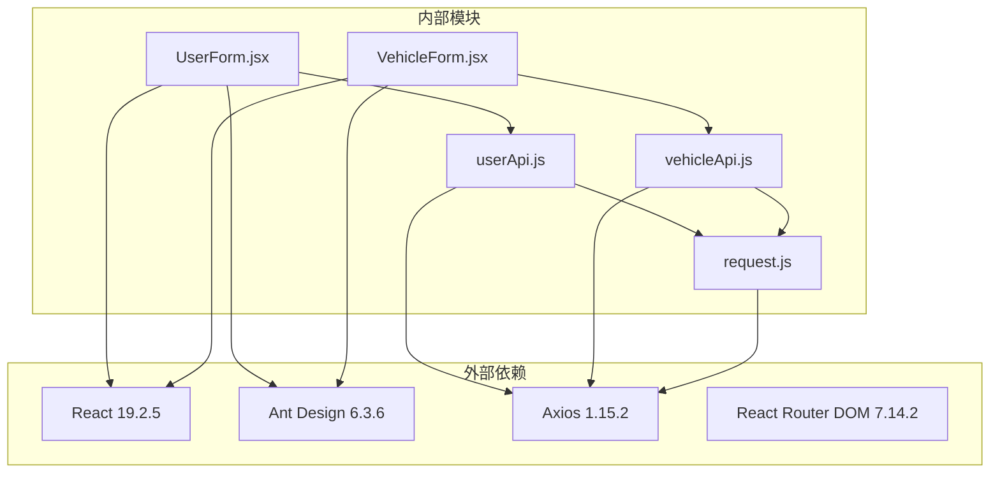

# 可复用组件设计

<cite>
**本文档引用的文件**
- [UserForm.jsx](file://vehicle-ui/src/components/UserForm.jsx)
- [VehicleForm.jsx](file://vehicle-ui/src/components/VehicleForm.jsx)
- [userApi.js](file://vehicle-ui/src/api/userApi.js)
- [vehicleApi.js](file://vehicle-ui/src/api/vehicleApi.js)
- [request.js](file://vehicle-ui/src/api/request.js)
- [UserList.jsx](file://vehicle-ui/src/pages/UserList.jsx)
- [VehicleList.jsx](file://vehicle-ui/src/pages/VehicleList.jsx)
- [Dashboard.jsx](file://vehicle-ui/src/pages/Dashboard.jsx)
- [VehicleStatus.jsx](file://vehicle-ui/src/pages/VehicleStatus.jsx)
- [App.jsx](file://vehicle-ui/src/App.jsx)
- [package.json](file://vehicle-ui/package.json)
</cite>

## 目录
1. [简介](#简介)
2. [项目结构](#项目结构)
3. [核心组件](#核心组件)
4. [架构概览](#架构概览)
5. [详细组件分析](#详细组件分析)
6. [依赖分析](#依赖分析)
7. [性能考虑](#性能考虑)
8. [故障排除指南](#故障排除指南)
9. [结论](#结论)
10. [附录](#附录)

## 简介

本设计文档专注于可复用组件的设计与实现，重点分析两个核心表单组件：UserForm用户表单组件和VehicleForm车辆表单组件。这两个组件采用React Hooks和Ant Design组件库构建，实现了高度可复用、可配置和可扩展的表单解决方案。

系统基于微服务架构，前端通过Axios进行HTTP通信，后端提供RESTful API接口。组件设计遵循单一职责原则，通过清晰的props接口和事件处理机制实现松耦合的组件交互。

## 项目结构

前端项目采用模块化组织方式，主要目录结构如下：



**图表来源**
- [App.jsx:1-78](file://vehicle-ui/src/App.jsx#L1-L78)
- [UserForm.jsx:1-53](file://vehicle-ui/src/components/UserForm.jsx#L1-L53)
- [VehicleForm.jsx:1-65](file://vehicle-ui/src/components/VehicleForm.jsx#L1-L65)

**章节来源**
- [App.jsx:1-78](file://vehicle-ui/src/App.jsx#L1-L78)
- [package.json:1-32](file://vehicle-ui/package.json#L1-L32)

## 核心组件

### 组件设计原则

两个表单组件均遵循以下设计原则：
- **单一职责**：每个组件专注于特定业务场景的表单处理
- **可复用性**：通过props接口实现通用化配置
- **可扩展性**：预留扩展点以适应未来需求变化
- **可配置性**：支持主题定制和行为调整

### 技术栈

- **React 19.2.5**：现代JavaScript框架
- **Ant Design 6.3.6**：企业级UI组件库
- **Axios 1.15.2**：HTTP客户端库
- **React Router DOM 7.14.2**：路由管理
- **Vite 8.0.9**：构建工具

**章节来源**
- [package.json:12-19](file://vehicle-ui/package.json#L12-L19)

## 架构概览

系统采用分层架构设计，组件间通过清晰的接口进行通信：



**图表来源**
- [UserList.jsx:85-89](file://vehicle-ui/src/pages/UserList.jsx#L85-L89)
- [VehicleList.jsx:90-94](file://vehicle-ui/src/pages/VehicleList.jsx#L90-L94)
- [userApi.js:13-15](file://vehicle-ui/src/api/userApi.js#L13-L15)
- [vehicleApi.js:13-15](file://vehicle-ui/src/api/vehicleApi.js#L13-L15)

## 详细组件分析

### UserForm 用户表单组件

#### 组件架构



**图表来源**
- [UserForm.jsx:4-53](file://vehicle-ui/src/components/UserForm.jsx#L4-L53)

#### 表单字段设计

| 字段名称 | 数据类型 | 验证规则 | 描述 |
|---------|----------|----------|------|
| name | string | required | 用户姓名，必填项 |
| phone | string | required, pattern | 手机号，11位数字格式 |

#### 验证规则详解



**图表来源**
- [UserForm.jsx:7-17](file://vehicle-ui/src/components/UserForm.jsx#L7-L17)
- [UserForm.jsx:30-46](file://vehicle-ui/src/components/UserForm.jsx#L30-L46)

#### Props接口设计

```typescript
interface UserFormProps {
  open: boolean;                    // 控制模态框显示/隐藏
  onCancel: () => void;             // 取消回调函数
  onSuccess: () => void;            // 成功回调函数
}
```

#### 事件处理机制

| 事件类型 | 触发时机 | 处理逻辑 | 参数 |
|---------|----------|----------|------|
| onOk | 点击确认按钮 | 验证表单并提交 | 无 |
| onCancel | 点击取消按钮 | 重置表单并关闭 | 无 |
| onSuccess | 创建成功后 | 刷新父组件数据 | 无 |

**章节来源**
- [UserForm.jsx:4-53](file://vehicle-ui/src/components/UserForm.jsx#L4-L53)

### VehicleForm 车辆表单组件

#### 组件架构



**图表来源**
- [VehicleForm.jsx:10-65](file://vehicle-ui/src/components/VehicleForm.jsx#L10-L65)

#### 表单字段设计

| 字段名称 | 数据类型 | 验证规则 | 描述 |
|---------|----------|----------|------|
| vin | string | required, len: 17 | VIN码，17位字符 |
| model | string | required | 车型，从下拉列表选择 |
| ownerUserId | number | min: 1 | 车主用户ID，正整数 |

#### VIN码格式验证



**图表来源**
- [VehicleForm.jsx:36-45](file://vehicle-ui/src/components/VehicleForm.jsx#L36-L45)
- [VehicleForm.jsx:13-23](file://vehicle-ui/src/components/VehicleForm.jsx#L13-L23)

#### 动态字段和表单联动

当前版本中，VehicleForm包含静态字段配置。在实际应用中，可以扩展为支持：
- 根据车型动态加载可用选项
- 车主选择器的远程搜索功能
- 实时验证和错误提示

#### Props接口设计

```typescript
interface VehicleFormProps {
  open: boolean;                    // 控制模态框显示/隐藏
  onCancel: () => void;             // 取消回调函数
  onSuccess: () => void;            // 成功回调函数
}
```

**章节来源**
- [VehicleForm.jsx:10-65](file://vehicle-ui/src/components/VehicleForm.jsx#L10-L65)

### API集成模式

#### 请求拦截器设计



**图表来源**
- [request.js:8-23](file://vehicle-ui/src/api/request.js#L8-L23)
- [vehicleApi.js:13-15](file://vehicle-ui/src/api/vehicleApi.js#L13-L15)

#### 错误处理机制

组件采用统一的错误处理策略：
- 表单验证错误：由Ant Design自动显示
- API调用错误：通过消息提示组件显示
- 网络异常：捕获并显示友好错误信息

**章节来源**
- [request.js:8-23](file://vehicle-ui/src/api/request.js#L8-L23)
- [UserForm.jsx:14-16](file://vehicle-ui/src/components/UserForm.jsx#L14-L16)
- [VehicleForm.jsx:20-22](file://vehicle-ui/src/components/VehicleForm.jsx#L20-L22)

## 依赖分析

### 组件依赖关系



**图表来源**
- [package.json:12-19](file://vehicle-ui/package.json#L12-L19)
- [UserForm.jsx:1-2](file://vehicle-ui/src/components/UserForm.jsx#L1-L2)
- [VehicleForm.jsx:1-2](file://vehicle-ui/src/components/VehicleForm.jsx#L1-L2)

### 内部模块依赖

| 模块 | 依赖模块 | 用途 |
|------|----------|------|
| UserForm | userApi.js, antd | 用户表单数据处理 |
| VehicleForm | vehicleApi.js, antd | 车辆表单数据处理 |
| UserList | UserForm, userApi.js | 用户列表管理 |
| VehicleList | VehicleForm, vehicleApi.js | 车辆列表管理 |
| request.js | axios, antd | HTTP请求统一处理 |

**章节来源**
- [UserList.jsx:6-32](file://vehicle-ui/src/pages/UserList.jsx#L6-L32)
- [VehicleList.jsx:5-37](file://vehicle-ui/src/pages/VehicleList.jsx#L5-L37)

## 性能考虑

### 渲染优化

1. **条件渲染**：仅在需要时渲染模态框
2. **懒加载**：组件按需加载，减少初始包大小
3. **虚拟滚动**：大数据量表格使用虚拟滚动优化

### 网络优化

1. **请求缓存**：合理使用浏览器缓存策略
2. **批量请求**：使用Promise.all进行并发请求
3. **超时控制**：设置合理的请求超时时间

### 内存管理

1. **清理副作用**：在组件卸载时清理定时器和订阅
2. **状态管理**：避免不必要的状态更新
3. **事件监听**：及时移除事件监听器

## 故障排除指南

### 常见问题及解决方案

#### 表单验证问题

**问题**：手机号格式验证失败
**原因**：输入格式不符合11位数字要求
**解决方案**：确保输入11位纯数字，移除空格和特殊字符

**问题**：VIN码长度验证失败  
**原因**：VIN码不是17位字符
**解决方案**：检查VIN码是否包含字母和数字，确保总长度为17位

#### API调用问题

**问题**：创建用户/车辆失败
**原因**：网络连接异常或后端服务不可用
**解决方案**：检查网络连接，查看浏览器开发者工具中的错误信息

#### 状态管理问题

**问题**：表单提交后数据未更新
**原因**：父组件状态未正确刷新
**解决方案**：确保onSuccess回调正确调用父组件的刷新函数

**章节来源**
- [UserForm.jsx:40-43](file://vehicle-ui/src/components/UserForm.jsx#L40-L43)
- [VehicleForm.jsx:39-42](file://vehicle-ui/src/components/VehicleForm.jsx#L39-L42)

## 结论

本设计文档详细分析了UserForm和VehicleForm两个核心表单组件的设计与实现。组件采用现代化的React开发模式，结合Ant Design组件库提供了优秀的用户体验。

### 设计优势

1. **高度可复用**：通过标准化的props接口实现组件复用
2. **强健的验证机制**：内置完整的表单验证和错误处理
3. **清晰的架构**：分层设计便于维护和扩展
4. **良好的用户体验**：响应式设计和友好的错误提示

### 改进建议

1. **增强表单联动**：实现VehicleForm的动态字段和联动功能
2. **国际化支持**：添加多语言支持
3. **无障碍访问**：完善ARIA标签和键盘导航
4. **测试覆盖**：增加单元测试和集成测试

## 附录

### 使用示例

#### UserForm基本用法

```jsx
<UserForm
  open={formOpen}
  onCancel={() => setFormOpen(false)}
  onSuccess={() => { 
    setFormOpen(false); 
    reload(); 
  }}
/>
```

#### VehicleForm基本用法

```jsx
<VehicleForm
  open={formOpen}
  onCancel={() => setFormOpen(false)}
  onSuccess={() => { 
    setFormOpen(false); 
    reload(); 
  }}
/>
```

### 最佳实践

1. **表单设计**：保持简洁明了，避免过多字段
2. **错误处理**：提供清晰的错误信息和恢复路径
3. **性能优化**：合理使用状态管理和渲染优化
4. **可访问性**：确保组件对所有用户都可用

### 扩展建议

1. **自定义验证器**：支持更复杂的验证规则
2. **主题定制**：提供CSS变量支持
3. **插件系统**：允许第三方扩展功能
4. **文档完善**：添加详细的API文档和示例