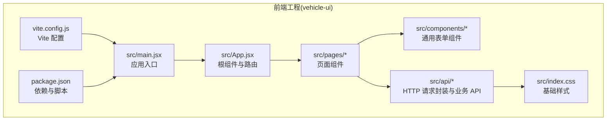
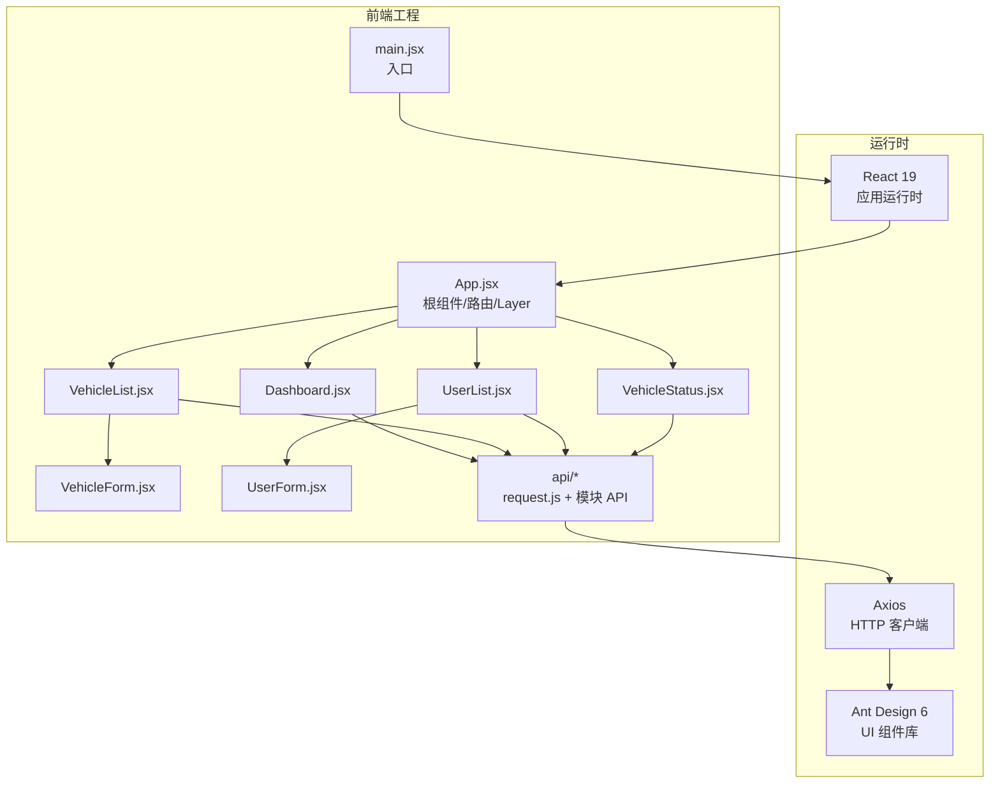
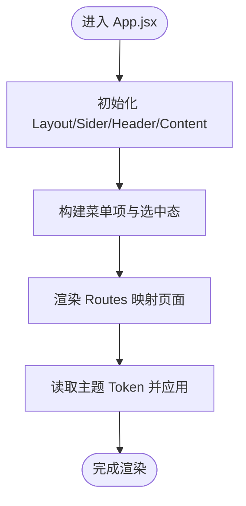
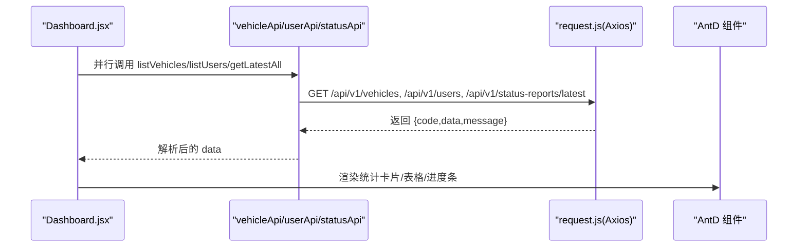
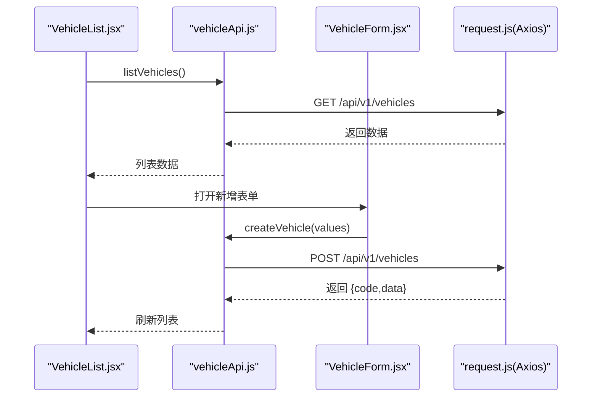
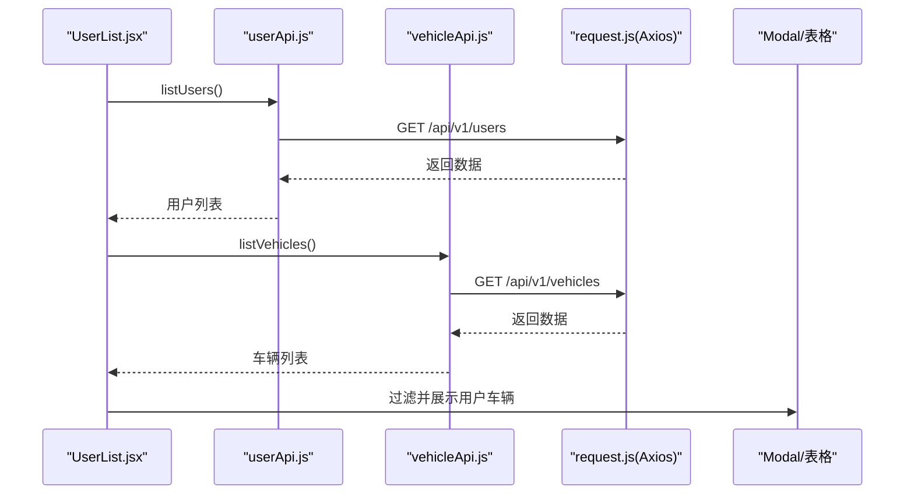
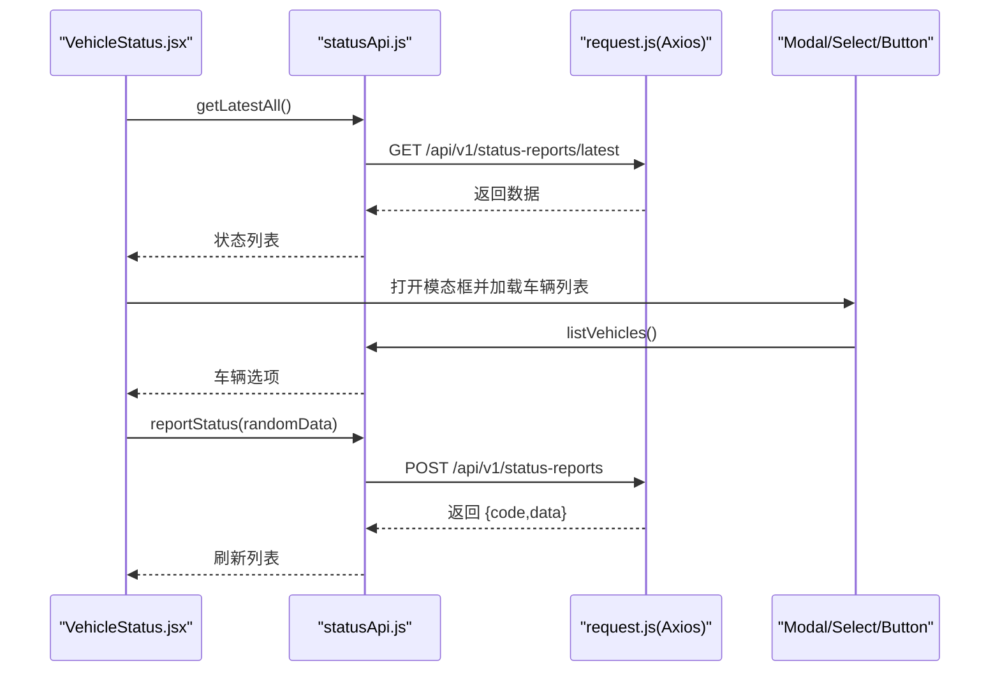
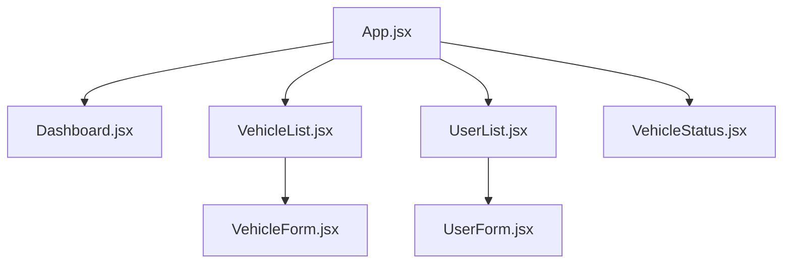
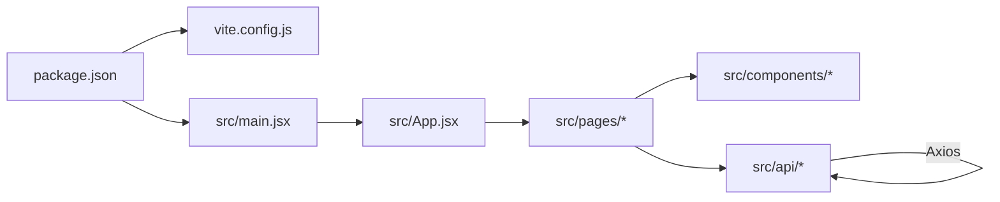

# 应用架构设计

<cite>
**本文档引用的文件**
- [package.json](file://vehicle-ui/package.json)
- [vite.config.js](file://vehicle-ui/vite.config.js)
- [main.jsx](file://vehicle-ui/src/main.jsx)
- [App.jsx](file://vehicle-ui/src/App.jsx)
- [index.css](file://vehicle-ui/src/index.css)
- [request.js](file://vehicle-ui/src/api/request.js)
- [vehicleApi.js](file://vehicle-ui/src/api/vehicleApi.js)
- [userApi.js](file://vehicle-ui/src/api/userApi.js)
- [statusApi.js](file://vehicle-ui/src/api/statusApi.js)
- [Dashboard.jsx](file://vehicle-ui/src/pages/Dashboard.jsx)
- [VehicleList.jsx](file://vehicle-ui/src/pages/VehicleList.jsx)
- [UserList.jsx](file://vehicle-ui/src/pages/UserList.jsx)
- [VehicleStatus.jsx](file://vehicle-ui/src/pages/VehicleStatus.jsx)
- [VehicleForm.jsx](file://vehicle-ui/src/components/VehicleForm.jsx)
- [UserForm.jsx](file://vehicle-ui/src/components/UserForm.jsx)
</cite>

## 目录
1. [引言](#引言)
2. [项目结构](#项目结构)
3. [核心组件](#核心组件)
4. [架构总览](#架构总览)
5. [详细组件分析](#详细组件分析)
6. [依赖关系分析](#依赖关系分析)
7. [性能考虑](#性能考虑)
8. [故障排查指南](#故障排查指南)
9. [结论](#结论)
10. [附录](#附录)

## 引言
本文件面向前端开发者与架构师，系统化阐述基于 React 19 + Vite 8 的单页应用（SPA）整体架构设计。重点覆盖以下方面：
- 组件层次结构：Layout 布局组件、路由配置与主题系统
- Ant Design 集成与配置：主题定制、图标使用、响应式设计
- Vite 构建工具配置与优化：开发服务器、代理设置、打包策略
- 启动流程、全局状态管理与错误边界处理
- 组件树结构图与数据流向图，帮助快速理解应用整体架构

## 项目结构
vehicle-ui 作为前端工程，采用典型的 React 单页应用目录组织方式，包含入口、页面、组件、API 封装与构建配置等模块。

图表来源
- [main.jsx:1-14](file://vehicle-ui/src/main.jsx#L1-L14)
- [App.jsx:1-78](file://vehicle-ui/src/App.jsx#L1-L78)
- [vite.config.js:1-25](file://vehicle-ui/vite.config.js#L1-L25)
- [package.json:1-32](file://vehicle-ui/package.json#L1-L32)

章节来源
- [main.jsx:1-14](file://vehicle-ui/src/main.jsx#L1-L14)
- [App.jsx:1-78](file://vehicle-ui/src/App.jsx#L1-L78)
- [vite.config.js:1-25](file://vehicle-ui/vite.config.js#L1-L25)
- [package.json:1-32](file://vehicle-ui/package.json#L1-L32)

## 核心组件
- 应用入口与启动流程
  - 入口文件负责挂载 React 根节点、启用严格模式与路由上下文，并引入全局样式。
  - 启动流程：创建根节点 → 包裹路由 → 渲染根组件 → 进入路由与页面渲染。
- 根组件与布局
  - 使用 Ant Design Layout 提供侧边栏与内容区，结合 Ant Design Menu 实现导航菜单。
  - 使用 Ant Design 主题 Token 动态读取容器背景色与圆角，实现主题一致性。
- 页面组件
  - Dashboard：聚合车辆、用户、状态数据，展示统计卡片与表格。
  - VehicleList：车辆列表、筛选、分页、新增/删除。
  - UserList：用户列表、查看名下车辆、新增/删除。
  - VehicleStatus：状态列表、搜索、刷新、模拟上报。
- 表单组件
  - VehicleForm：新增车辆的表单校验与提交。
  - UserForm：新增用户的表单校验与提交。
- API 层
  - request.js：统一 Axios 实例与响应拦截器，自动解析后端返回结构并提示错误。
  - vehicleApi.js、userApi.js、statusApi.js：按模块封装 REST 接口。

章节来源
- [main.jsx:1-14](file://vehicle-ui/src/main.jsx#L1-L14)
- [App.jsx:1-78](file://vehicle-ui/src/App.jsx#L1-L78)
- [Dashboard.jsx:1-140](file://vehicle-ui/src/pages/Dashboard.jsx#L1-L140)
- [VehicleList.jsx:1-100](file://vehicle-ui/src/pages/VehicleList.jsx#L1-L100)
- [UserList.jsx:1-114](file://vehicle-ui/src/pages/UserList.jsx#L1-L114)
- [VehicleStatus.jsx:1-169](file://vehicle-ui/src/pages/VehicleStatus.jsx#L1-L169)
- [VehicleForm.jsx:1-65](file://vehicle-ui/src/components/VehicleForm.jsx#L1-L65)
- [UserForm.jsx:1-53](file://vehicle-ui/src/components/UserForm.jsx#L1-L53)
- [request.js:1-26](file://vehicle-ui/src/api/request.js#L1-L26)
- [vehicleApi.js:1-20](file://vehicle-ui/src/api/vehicleApi.js#L1-L20)
- [userApi.js:1-20](file://vehicle-ui/src/api/userApi.js#L1-L20)
- [statusApi.js:1-20](file://vehicle-ui/src/api/statusApi.js#L1-L20)

## 架构总览
应用采用“入口 → 根组件 → 页面 → 组件 → API”的分层架构，Ant Design 提供 UI 基础能力，Axios 负责网络请求，Vite 提供开发与构建支持。

图表来源
- [main.jsx:1-14](file://vehicle-ui/src/main.jsx#L1-L14)
- [App.jsx:1-78](file://vehicle-ui/src/App.jsx#L1-L78)
- [Dashboard.jsx:1-140](file://vehicle-ui/src/pages/Dashboard.jsx#L1-L140)
- [VehicleList.jsx:1-100](file://vehicle-ui/src/pages/VehicleList.jsx#L1-L100)
- [UserList.jsx:1-114](file://vehicle-ui/src/pages/UserList.jsx#L1-L114)
- [VehicleStatus.jsx:1-169](file://vehicle-ui/src/pages/VehicleStatus.jsx#L1-L169)
- [VehicleForm.jsx:1-65](file://vehicle-ui/src/components/VehicleForm.jsx#L1-L65)
- [UserForm.jsx:1-53](file://vehicle-ui/src/components/UserForm.jsx#L1-L53)
- [request.js:1-26](file://vehicle-ui/src/api/request.js#L1-L26)

## 详细组件分析

### 根组件与布局（App.jsx）
- 结构职责
  - 提供 Ant Design Layout 布局骨架（Sider + Header + Content）。
  - 内置侧边导航菜单，使用 Ant Design Icons 图标与 Link 组件。
  - 使用 Ant Design 主题 Token 动态适配容器背景与圆角，提升主题一致性。
- 路由集成
  - 使用 react-router-dom 的 Routes/Route 定义页面级路由，映射到各页面组件。
- 状态管理
  - 使用 useState 管理侧边栏折叠状态；通过 useLocation 获取当前路径以高亮选中项。
- 主题系统
  - 通过 theme.useToken() 获取颜色与圆角等设计令牌，应用于容器背景与圆角。

图表来源
- [App.jsx:1-78](file://vehicle-ui/src/App.jsx#L1-L78)

章节来源
- [App.jsx:1-78](file://vehicle-ui/src/App.jsx#L1-L78)

### 页面组件与数据流

#### Dashboard 页面
- 数据聚合
  - 并行请求车辆、用户、状态数据，汇总统计指标（总数、人均、平均电量、低电量数量）。
  - 计算车型分布并绘制进度条。
- 展示逻辑
  - 使用 Card/Statistic/Progress/Table 等 Ant Design 组件进行可视化展示。
  - 使用 monospace 字体渲染 VIN，增强可读性。

图表来源
- [Dashboard.jsx:1-140](file://vehicle-ui/src/pages/Dashboard.jsx#L1-L140)
- [vehicleApi.js:1-20](file://vehicle-ui/src/api/vehicleApi.js#L1-L20)
- [userApi.js:1-20](file://vehicle-ui/src/api/userApi.js#L1-L20)
- [statusApi.js:1-20](file://vehicle-ui/src/api/statusApi.js#L1-L20)
- [request.js:1-26](file://vehicle-ui/src/api/request.js#L1-L26)

章节来源
- [Dashboard.jsx:1-140](file://vehicle-ui/src/pages/Dashboard.jsx#L1-L140)

#### VehicleList 页面
- 列表与筛选
  - 支持按车型筛选与分页；提供“刷新”按钮触发重新加载。
- 操作交互
  - 删除车辆使用 Popconfirm 确认；新增车辆打开 VehicleForm。
- 表单联动
  - VehicleForm 成功后回调刷新列表。

图表来源
- [VehicleList.jsx:1-100](file://vehicle-ui/src/pages/VehicleList.jsx#L1-L100)
- [VehicleForm.jsx:1-65](file://vehicle-ui/src/components/VehicleForm.jsx#L1-L65)
- [vehicleApi.js:1-20](file://vehicle-ui/src/api/vehicleApi.js#L1-L20)
- [request.js:1-26](file://vehicle-ui/src/api/request.js#L1-L26)

章节来源
- [VehicleList.jsx:1-100](file://vehicle-ui/src/pages/VehicleList.jsx#L1-L100)
- [VehicleForm.jsx:1-65](file://vehicle-ui/src/components/VehicleForm.jsx#L1-L65)

#### UserList 页面
- 用户管理
  - 支持删除用户与“刷新”；点击“名下车辆”弹窗展示该用户关联的车辆。
- 关联查询
  - 通过 listVehicles 过滤 ownerUserId 实现用户与车辆关联展示。

图表来源
- [UserList.jsx:1-114](file://vehicle-ui/src/pages/UserList.jsx#L1-L114)
- [userApi.js:1-20](file://vehicle-ui/src/api/userApi.js#L1-L20)
- [vehicleApi.js:1-20](file://vehicle-ui/src/api/vehicleApi.js#L1-L20)
- [request.js:1-26](file://vehicle-ui/src/api/request.js#L1-L26)

章节来源
- [UserList.jsx:1-114](file://vehicle-ui/src/pages/UserList.jsx#L1-L114)

#### VehicleStatus 页面
- 状态监控
  - 展示最新状态列表，支持 VIN 搜索与刷新。
- 模拟上报
  - 打开模态框选择车辆，随机生成状态数据并上报，成功后刷新列表。

图表来源
- [VehicleStatus.jsx:1-169](file://vehicle-ui/src/pages/VehicleStatus.jsx#L1-L169)
- [statusApi.js:1-20](file://vehicle-ui/src/api/statusApi.js#L1-L20)
- [vehicleApi.js:1-20](file://vehicle-ui/src/api/vehicleApi.js#L1-L20)
- [request.js:1-26](file://vehicle-ui/src/api/request.js#L1-L26)

章节来源
- [VehicleStatus.jsx:1-169](file://vehicle-ui/src/pages/VehicleStatus.jsx#L1-L169)

### 组件树结构图

图表来源
- [App.jsx:1-78](file://vehicle-ui/src/App.jsx#L1-L78)
- [Dashboard.jsx:1-140](file://vehicle-ui/src/pages/Dashboard.jsx#L1-L140)
- [VehicleList.jsx:1-100](file://vehicle-ui/src/pages/VehicleList.jsx#L1-L100)
- [UserList.jsx:1-114](file://vehicle-ui/src/pages/UserList.jsx#L1-L114)
- [VehicleStatus.jsx:1-169](file://vehicle-ui/src/pages/VehicleStatus.jsx#L1-L169)
- [VehicleForm.jsx:1-65](file://vehicle-ui/src/components/VehicleForm.jsx#L1-L65)
- [UserForm.jsx:1-53](file://vehicle-ui/src/components/UserForm.jsx#L1-L53)

## 依赖关系分析
- 外部依赖
  - React 19、React Router DOM 7、Ant Design 6、Axios、@ant-design/icons。
- 开发依赖
  - Vite 8、@vitejs/plugin-react、ESLint 及相关插件。
- 构建与运行
  - npm scripts 提供 dev/build/preview/lint 四类任务。

图表来源
- [package.json:1-32](file://vehicle-ui/package.json#L1-L32)
- [vite.config.js:1-25](file://vehicle-ui/vite.config.js#L1-L25)
- [main.jsx:1-14](file://vehicle-ui/src/main.jsx#L1-L14)
- [App.jsx:1-78](file://vehicle-ui/src/App.jsx#L1-L78)

章节来源
- [package.json:1-32](file://vehicle-ui/package.json#L1-L32)

## 性能考虑
- 构建优化建议
  - 启用 Vite 默认的代码分割与懒加载策略，减少首屏体积。
  - 对 Ant Design 的按需加载与样式预设进行评估，避免全量引入导致包体增大。
  - 在生产环境开启压缩与资源内联策略，结合 CDN 加速静态资源。
- 运行时优化建议
  - 页面组件使用 useMemo/useCallback 缓存计算结果，避免重复渲染。
  - 列表组件使用虚拟滚动（如 antd 表格默认分页）降低大数据量渲染压力。
  - API 层统一错误处理与重试机制，提升弱网场景体验。

## 故障排查指南
- 后端接口不可达
  - 检查 Vite 代理配置是否正确指向后端服务地址与端口。
  - 确认跨域设置与 changeOrigin 配置生效。
- 请求失败或业务异常
  - 查看响应拦截器对后端返回结构的解析逻辑，确保 message 提示与 Promise 抛错路径正常。
- 页面空白或样式异常
  - 检查全局样式文件是否正确引入，Ant Design 样式是否完整加载。
- 菜单选中与路由跳转
  - 确保 Link 与 useLocation 的路径匹配一致，避免选中态不更新。

章节来源
- [vite.config.js:1-25](file://vehicle-ui/vite.config.js#L1-L25)
- [request.js:1-26](file://vehicle-ui/src/api/request.js#L1-L26)
- [index.css:1-5](file://vehicle-ui/src/index.css#L1-L5)

## 结论
本项目以 React 19 + Vite 8 为基础，结合 Ant Design 提供一致的 UI 体验与路由体系，形成清晰的分层架构。通过统一的 API 封装与响应拦截器，实现了前后端解耦与错误处理标准化。建议在后续迭代中进一步完善按需加载、虚拟滚动与缓存策略，持续优化用户体验与性能表现。

## 附录

### Ant Design 集成与配置要点
- 主题定制
  - 使用 theme.useToken() 获取设计令牌，动态适配容器背景与圆角，保持界面风格一致。
- 图标使用
  - 通过 @ant-design/icons 引入图标组件，配合 Menu 与按钮使用，提升可读性与一致性。
- 响应式设计
  - 使用 Ant Design Grid（Row/Col）与组件尺寸属性，适配不同屏幕尺寸。

章节来源
- [App.jsx:1-78](file://vehicle-ui/src/App.jsx#L1-L78)

### Vite 配置与优化策略
- 开发服务器
  - 配置本地端口与代理规则，将 /api/v1/vehicles、/api/v1/users、/api/v1/status-reports 分别转发至对应后端服务。
- 插件与脚本
  - 使用 @vitejs/plugin-react 提升开发体验；npm scripts 提供 dev/build/preview/lint 任务。
- 打包优化
  - 建议结合产物分析与 Tree Shaking，减少冗余依赖与未使用代码。

章节来源
- [vite.config.js:1-25](file://vehicle-ui/vite.config.js#L1-L25)
- [package.json:1-32](file://vehicle-ui/package.json#L1-L32)