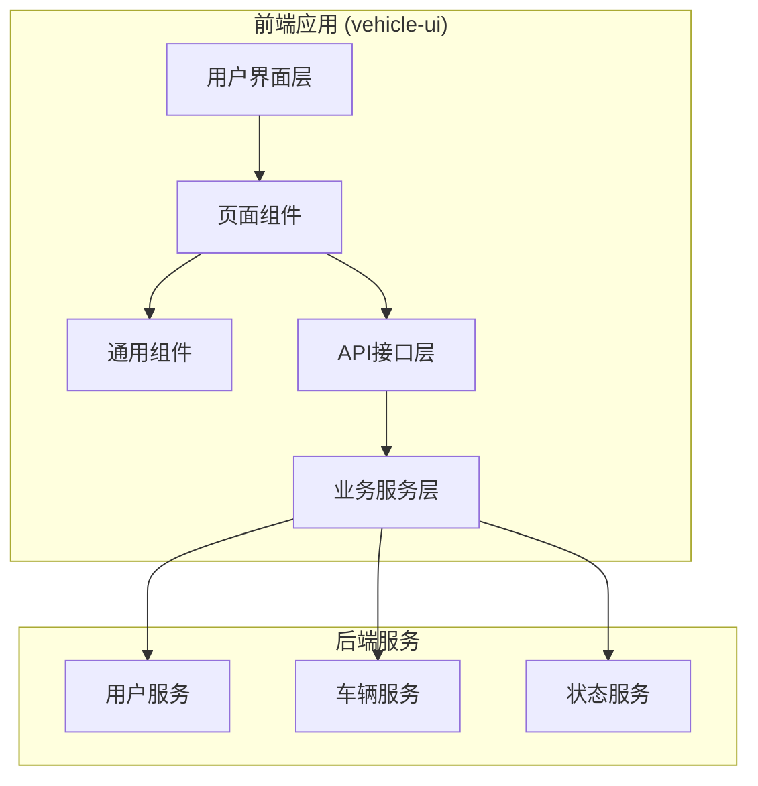
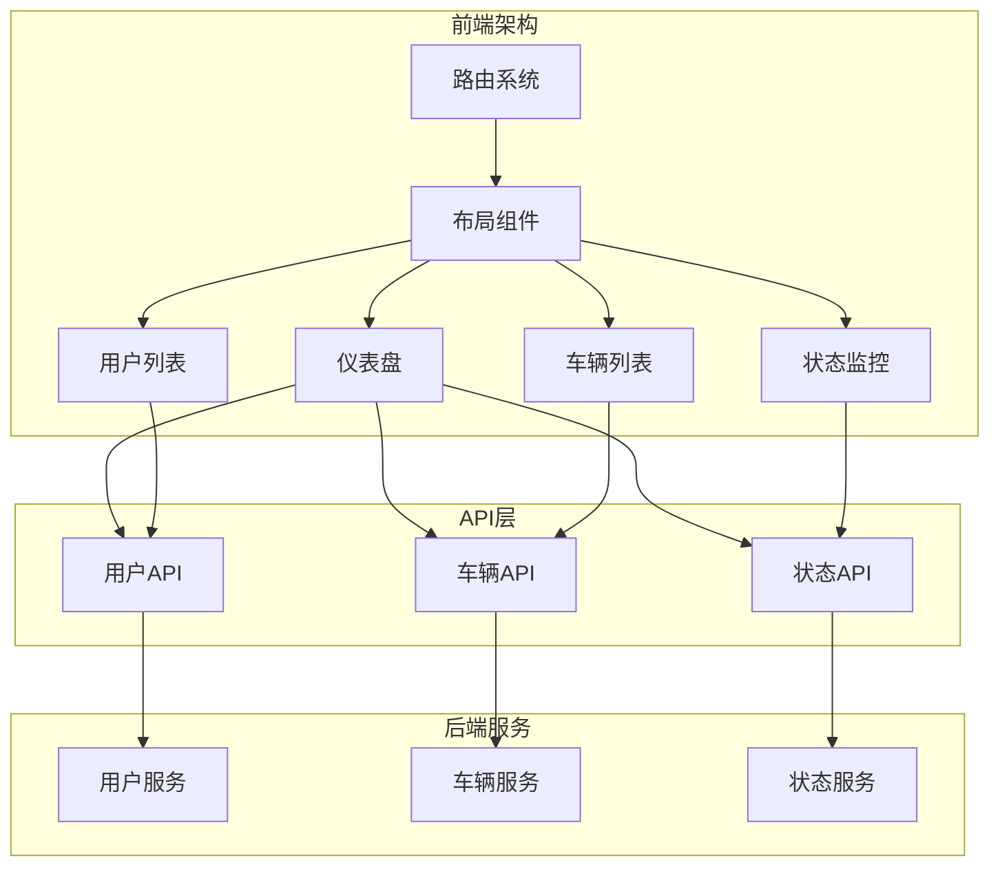
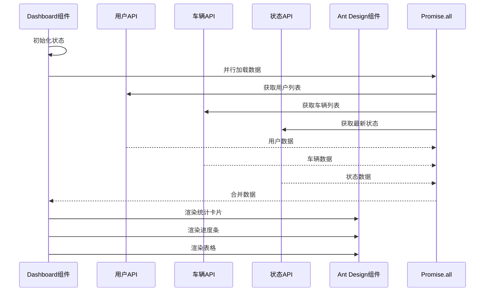
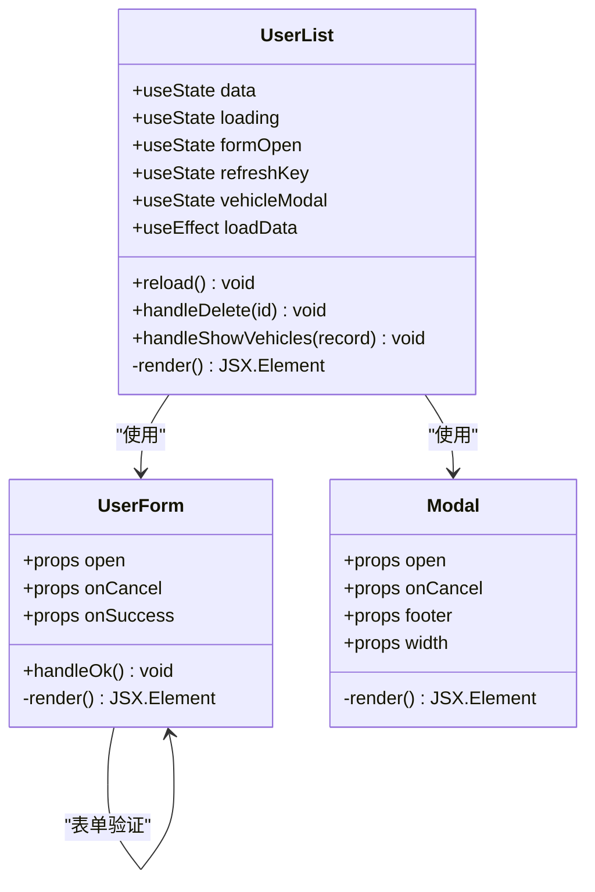
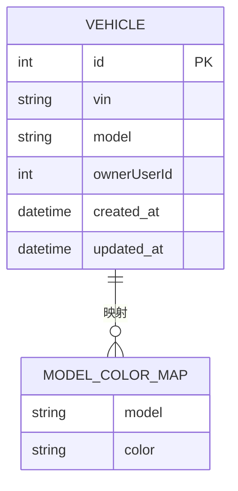
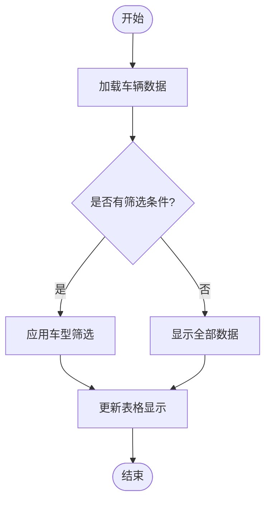
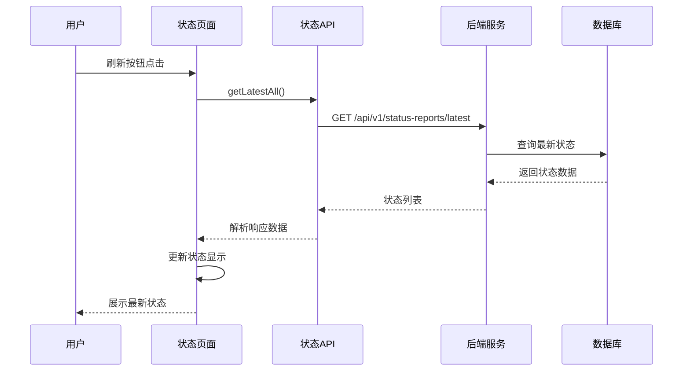
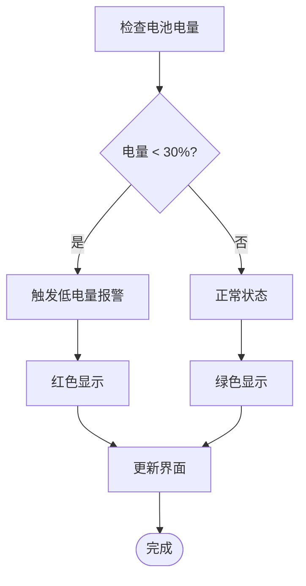
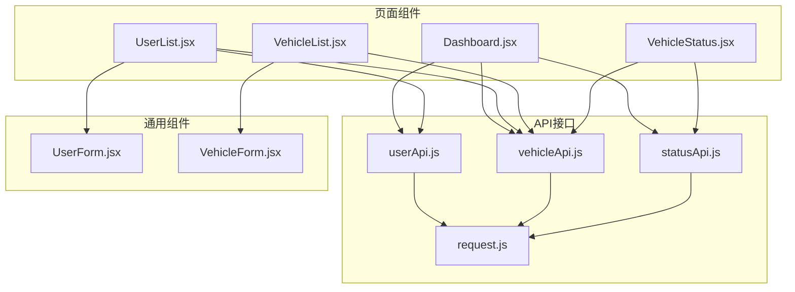

# 页面组件设计

<cite>
**本文档引用的文件**
- [Dashboard.jsx](file://vehicle-ui/src/pages/Dashboard.jsx)
- [UserList.jsx](file://vehicle-ui/src/pages/UserList.jsx)
- [VehicleList.jsx](file://vehicle-ui/src/pages/VehicleList.jsx)
- [VehicleStatus.jsx](file://vehicle-ui/src/pages/VehicleStatus.jsx)
- [App.jsx](file://vehicle-ui/src/App.jsx)
- [userApi.js](file://vehicle-ui/src/api/userApi.js)
- [vehicleApi.js](file://vehicle-ui/src/api/vehicleApi.js)
- [statusApi.js](file://vehicle-ui/src/api/statusApi.js)
- [request.js](file://vehicle-ui/src/api/request.js)
- [UserForm.jsx](file://vehicle-ui/src/components/UserForm.jsx)
- [VehicleForm.jsx](file://vehicle-ui/src/components/VehicleForm.jsx)
</cite>

## 目录
1. [引言](#引言)
2. [项目结构](#项目结构)
3. [核心组件](#核心组件)
4. [架构概览](#架构概览)
5. [详细组件分析](#详细组件分析)
6. [依赖关系分析](#依赖关系分析)
7. [性能考虑](#性能考虑)
8. [故障排除指南](#故障排除指南)
9. [结论](#结论)

## 引言

本文档详细介绍车辆云平台的四个核心页面组件设计与实现。该系统采用前后端分离架构，前端使用React + Ant Design构建用户界面，后端通过Spring Boot微服务提供RESTful API。四个核心页面分别负责仪表盘数据可视化、用户管理、车辆管理和实时状态监控。

## 项目结构

项目采用模块化组织方式，主要分为以下层次：

**图表来源**
- [App.jsx:1-78](file://vehicle-ui/src/App.jsx#L1-L78)
- [Dashboard.jsx:1-140](file://vehicle-ui/src/pages/Dashboard.jsx#L1-L140)

**章节来源**
- [App.jsx:1-78](file://vehicle-ui/src/App.jsx#L1-L78)
- [Dashboard.jsx:1-140](file://vehicle-ui/src/pages/Dashboard.jsx#L1-L140)

## 核心组件

系统包含四个核心页面组件，每个组件都有明确的功能定位和设计目标：

### 组件功能矩阵

| 组件名称 | 主要功能 | 数据来源 | 用户交互 |
|---------|----------|----------|----------|
| Dashboard | 仪表盘数据可视化 | 用户、车辆、状态报告 | 展示统计信息 |
| UserList | 用户管理CRUD操作 | 用户API | 增删改查、批量操作 |
| VehicleList | 车辆管理CRUD操作 | 车辆API | 增删改查、筛选过滤 |
| VehicleStatus | 实时状态监控 | 状态API | 模拟上报、历史查询 |

**章节来源**
- [Dashboard.jsx:1-140](file://vehicle-ui/src/pages/Dashboard.jsx#L1-L140)
- [UserList.jsx:1-114](file://vehicle-ui/src/pages/UserList.jsx#L1-L114)
- [VehicleList.jsx:1-100](file://vehicle-ui/src/pages/VehicleList.jsx#L1-L100)
- [VehicleStatus.jsx:1-169](file://vehicle-ui/src/pages/VehicleStatus.jsx#L1-L169)

## 架构概览

系统采用分层架构设计，确保各组件职责清晰、耦合度低：

**图表来源**
- [App.jsx:17-22](file://vehicle-ui/src/App.jsx#L17-L22)
- [Dashboard.jsx:4-6](file://vehicle-ui/src/pages/Dashboard.jsx#L4-L6)
- [UserList.jsx:4-5](file://vehicle-ui/src/pages/UserList.jsx#L4-L5)
- [VehicleList.jsx:4-5](file://vehicle-ui/src/pages/VehicleList.jsx#L4-L5)
- [VehicleStatus.jsx:4-5](file://vehicle-ui/src/pages/VehicleStatus.jsx#L4-L5)

## 详细组件分析

### Dashboard仪表盘组件

Dashboard组件是整个系统的数据中枢，负责展示关键业务指标和实时状态信息。

#### 数据流设计

**图表来源**
- [Dashboard.jsx:20-32](file://vehicle-ui/src/pages/Dashboard.jsx#L20-L32)
- [Dashboard.jsx:14-18](file://vehicle-ui/src/pages/Dashboard.jsx#L14-L18)

#### 关键指标计算

Dashboard组件实现了多种统计指标的实时计算：

1. **基础统计指标**
   - 车辆总数：直接使用车辆列表长度
   - 用户总数：直接使用用户列表长度
   - 车型种类：基于Object.keys(modelStats).length计算
   - 人均车辆：vehicles.length / users.length

2. **状态统计指标**
   - 上报车辆数：状态列表长度
   - 车队平均电量：statusList.reduce((sum,s)=>sum+(s.batteryLevel||0),0)/statusList.length
   - 低电量车辆：过滤batteryLevel < 30的车辆数量

3. **数据可视化**
   - 使用Ant Design的Statistic组件展示数值
   - 进度条显示车型分布占比
   - 颜色编码区分不同车型

**章节来源**
- [Dashboard.jsx:34-48](file://vehicle-ui/src/pages/Dashboard.jsx#L34-L48)
- [Dashboard.jsx:106-120](file://vehicle-ui/src/pages/Dashboard.jsx#L106-L120)

### UserList用户列表组件

UserList组件提供完整的用户管理功能，支持CRUD操作和数据展示。

#### 表格组件设计

**图表来源**
- [UserList.jsx:8-26](file://vehicle-ui/src/pages/UserList.jsx#L8-L26)
- [UserForm.jsx:4-17](file://vehicle-ui/src/components/UserForm.jsx#L4-L17)

#### CRUD操作实现

1. **数据加载与刷新**
   - 使用useEffect监听refreshKey变化
   - 通过Promise.all实现并行数据加载
   - 支持手动刷新功能

2. **删除操作**
   - 使用Popconfirm进行二次确认
   - 删除成功后自动刷新数据
   - 提供友好的用户反馈

3. **关联数据显示**
   - 点击"名下车辆"按钮查看关联车辆
   - 使用Modal组件展示关联数据
   - 支持按车主ID过滤车辆

4. **分页处理**
   - Ant Design Table组件内置分页
   - 每页显示10条记录
   - 显示总记录数统计

**章节来源**
- [UserList.jsx:15-38](file://vehicle-ui/src/pages/UserList.jsx#L15-L38)
- [UserList.jsx:78-84](file://vehicle-ui/src/pages/UserList.jsx#L78-L84)

### VehicleList车辆列表组件

VehicleList组件专注于车辆管理，提供车辆信息的完整生命周期管理。

#### 车辆数据模型

**图表来源**
- [VehicleList.jsx:7-11](file://vehicle-ui/src/pages/VehicleList.jsx#L7-L11)

#### 车型颜色映射

组件使用预定义的颜色映射来增强视觉效果：

| 车型 | 颜色值 | 用途 |
|------|--------|------|
| AITO M5 | blue | 蓝色标签 |
| AITO M7 | green | 绿色标签 |
| AITO M9 | gold | 金色标签 |

#### 搜索过滤机制

**图表来源**
- [VehicleList.jsx:39-41](file://vehicle-ui/src/pages/VehicleList.jsx#L39-L41)

**章节来源**
- [VehicleList.jsx:39-60](file://vehicle-ui/src/pages/VehicleList.jsx#L39-L60)
- [VehicleList.jsx:62-89](file://vehicle-ui/src/pages/VehicleList.jsx#L62-L89)

### VehicleStatus车辆状态组件

VehicleStatus组件提供实时状态监控功能，支持状态数据的查看和模拟上报。

#### 实时监控架构

**图表来源**
- [VehicleStatus.jsx:17-23](file://vehicle-ui/src/pages/VehicleStatus.jsx#L17-L23)
- [statusApi.js:5-7](file://vehicle-ui/src/api/statusApi.js#L5-L7)

#### 状态数据展示

组件提供了丰富的状态信息展示：

1. **电量状态**
   - 使用Progress组件可视化电量百分比
   - 不同电量区间使用不同颜色标识
   - 低电量状态使用红色警告样式

2. **位置信息**
   - 展示经纬度坐标
   - 支持精确到小数点后四位

3. **车辆状态**
   - 车速显示（km/h）
   - 里程数格式化显示
   - 温度信息展示

#### 报警机制

**图表来源**
- [VehicleStatus.jsx:67-71](file://vehicle-ui/src/pages/VehicleStatus.jsx#L67-L71)

**章节来源**
- [VehicleStatus.jsx:67-111](file://vehicle-ui/src/pages/VehicleStatus.jsx#L67-L111)
- [VehicleStatus.jsx:113-136](file://vehicle-ui/src/pages/VehicleStatus.jsx#L113-L136)

## 依赖关系分析

系统组件之间的依赖关系清晰明确，遵循单一职责原则：

**图表来源**
- [Dashboard.jsx:4-6](file://vehicle-ui/src/pages/Dashboard.jsx#L4-L6)
- [UserList.jsx:4-6](file://vehicle-ui/src/pages/UserList.jsx#L4-L6)
- [VehicleList.jsx:4-5](file://vehicle-ui/src/pages/VehicleList.jsx#L4-L5)
- [VehicleStatus.jsx:4-5](file://vehicle-ui/src/pages/VehicleStatus.jsx#L4-L5)

**章节来源**
- [request.js:1-26](file://vehicle-ui/src/api/request.js#L1-L26)

### 错误处理策略

系统实现了统一的错误处理机制：

1. **API响应拦截**
   - 统一解析ApiResponse格式
   - 错误码0表示成功，其他值表示失败
   - 自动显示错误消息

2. **组件级错误处理**
   - 网络异常捕获和提示
   - 表单验证错误处理
   - 异步操作错误恢复

3. **用户反馈机制**
   - 成功操作的消息提示
   - 失败操作的错误提示
   - 加载状态的视觉反馈

**章节来源**
- [request.js:8-23](file://vehicle-ui/src/api/request.js#L8-L23)

## 性能考虑

### 数据加载优化

1. **并行数据加载**
   - Dashboard组件使用Promise.all并行加载多个API
   - 减少整体加载时间，提升用户体验

2. **状态缓存策略**
   - 使用useEffect的清理函数防止内存泄漏
   - 通过refreshKey控制数据重新加载时机

3. **渲染优化**
   - Ant Design组件内置虚拟滚动支持
   - 条件渲染减少不必要的DOM更新

### 网络请求优化

1. **请求拦截器**
   - 统一设置超时时间10秒
   - 自动处理响应数据格式

2. **错误重试机制**
   - 网络异常自动提示
   - 用户可手动重试操作

## 故障排除指南

### 常见问题及解决方案

1. **数据加载失败**
   - 检查API服务是否正常运行
   - 确认网络连接状态
   - 查看浏览器开发者工具中的错误信息

2. **表单验证失败**
   - 检查必填字段是否填写完整
   - 确认手机号格式是否正确
   - 验证VIN码长度是否为17位

3. **状态显示异常**
   - 确认车辆是否已上报状态数据
   - 检查数据库连接状态
   - 验证状态数据格式是否正确

### 调试技巧

1. **开发工具使用**
   - 使用React DevTools检查组件状态
   - 通过Network面板监控API请求
   - 利用Console输出调试信息

2. **日志记录**
   - 在关键函数中添加console.log
   - 记录异步操作的状态变化
   - 跟踪数据流向和处理过程

**章节来源**
- [request.js:18-22](file://vehicle-ui/src/api/request.js#L18-L22)

## 结论

四个核心页面组件构成了完整的车辆云平台管理界面，每个组件都体现了良好的设计原则和实现质量：

1. **Dashboard仪表盘**提供了全面的数据可视化能力，通过多种统计指标和图表展示业务状态
2. **UserList用户列表**实现了完整的CRUD操作，支持数据筛选和批量处理
3. **VehicleList车辆列表**专注于车辆管理，提供直观的数据展示和操作界面
4. **VehicleStatus车辆状态**实现了实时监控功能，支持状态数据的查看和模拟上报

系统采用模块化设计，组件间职责清晰，依赖关系明确，为后续功能扩展和维护奠定了良好基础。通过统一的API接口和错误处理机制，确保了系统的稳定性和可靠性。