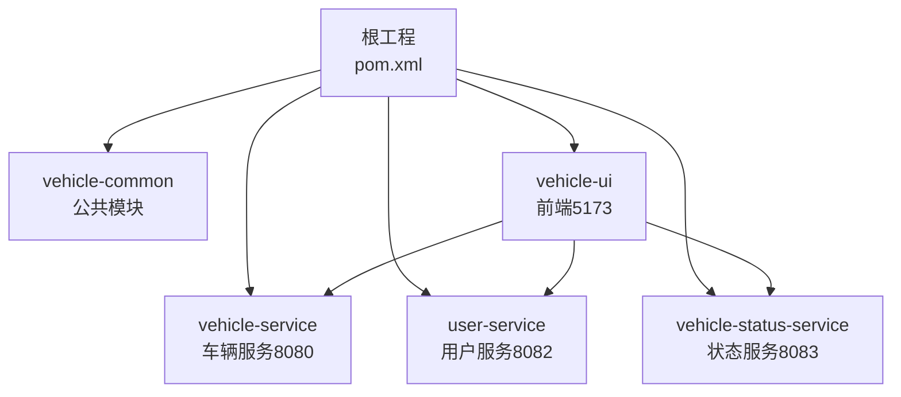
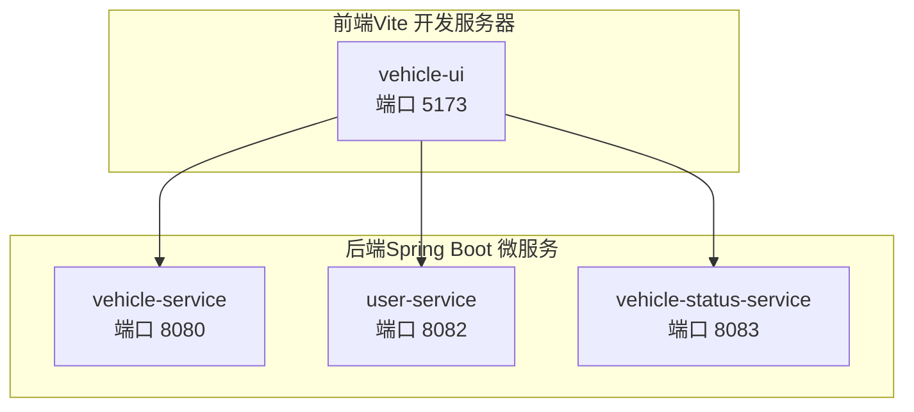
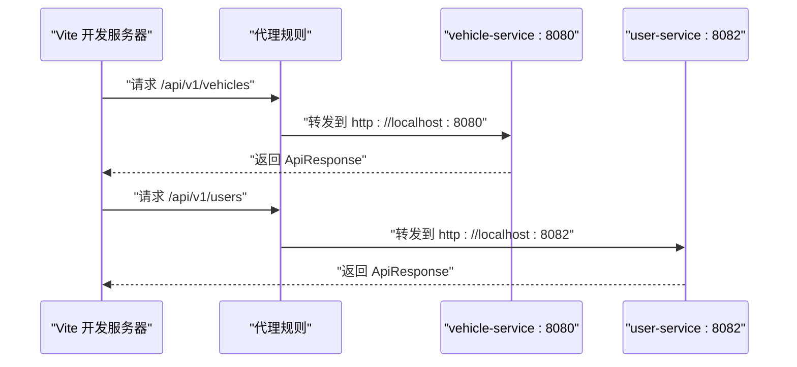
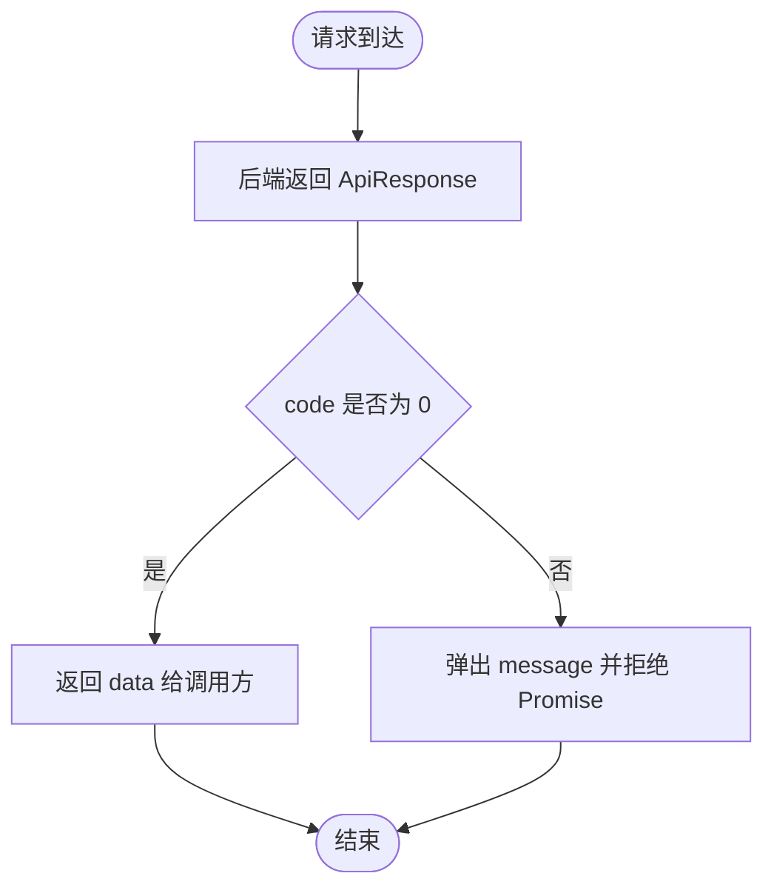
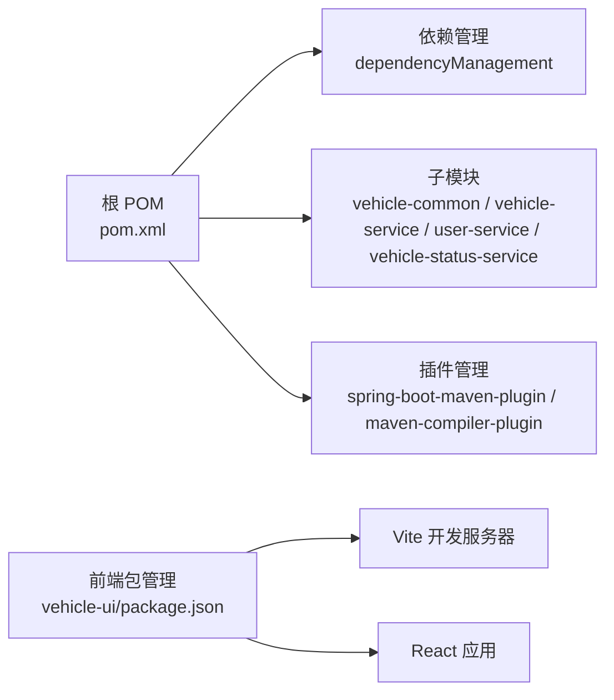

# 快速开始

<cite>
**本文引用的文件**
- [README.md](file://README.md)
- [pom.xml](file://pom.xml)
- [vehicle-ui/package.json](file://vehicle-ui/package.json)
- [vehicle-ui/vite.config.js](file://vehicle-ui/vite.config.js)
- [vehicle-ui/src/api/request.js](file://vehicle-ui/src/api/request.js)
- [vehicle-ui/src/api/userApi.js](file://vehicle-ui/src/api/userApi.js)
- [vehicle-ui/src/api/vehicleApi.js](file://vehicle-ui/src/api/vehicleApi.js)
- [vehicle-ui/src/api/statusApi.js](file://vehicle-ui/src/api/statusApi.js)
- [vehicle-ui/src/main.jsx](file://vehicle-ui/src/main.jsx)
- [user-service/src/main/resources/application.yml](file://user-service/src/main/resources/application.yml)
- [vehicle-service/src/main/resources/application.yml](file://vehicle-service/src/main/resources/application.yml)
- [vehicle-status-service/src/main/resources/application.yml](file://vehicle-status-service/src/main/resources/application.yml)
- [vehicle-common/src/main/java/com/wenjie/cloud/common/dto/ApiResponse.java](file://vehicle-common/src/main/java/com/wenjie/cloud/common/dto/ApiResponse.java)
- [vehicle-common/src/main/java/com/wenjie/cloud/common/exception/BusinessException.java](file://vehicle-common/src/main/java/com/wenjie/cloud/common/exception/BusinessException.java)
</cite>

## 目录
1. [简介](#简介)
2. [项目结构](#项目结构)
3. [核心组件](#核心组件)
4. [架构总览](#架构总览)
5. [详细组件分析](#详细组件分析)
6. [依赖分析](#依赖分析)
7. [性能考虑](#性能考虑)
8. [故障排除指南](#故障排除指南)
9. [结论](#结论)
10. [附录](#附录)

## 简介
本指南面向首次接触车联网云平台项目的开发者，帮助你在本地快速完成环境准备、后端服务构建与启动、前端应用安装与运行，并理解开发服务器的代理配置与统一响应格式。项目采用多模块后端（Spring Boot）与 React 前端（Vite）的组合，提供车辆与用户管理的基础能力。

## 项目结构
项目为多模块 Maven 工程，包含公共模块与三个微服务模块，以及一个 React 前端应用。模块划分清晰，便于独立开发与扩展。

图表来源
- [pom.xml:36-43](file://pom.xml#L36-L43)
- [vehicle-ui/vite.config.js:7-23](file://vehicle-ui/vite.config.js#L7-L23)

章节来源
- [README.md:19-27](file://README.md#L19-L27)
- [pom.xml:36-43](file://pom.xml#L36-L43)

## 核心组件
- 后端技术栈：Spring Boot 2.7.18、JDK 11、H2 内存数据库、Spring Data JPA、Lombok/MapStruct、javax.validation。
- 前端技术栈：React 19、Ant Design 6、Vite 8、Axios。
- 统一响应格式：所有接口返回统一的 ApiResponse 包装，包含 code、message、data、timestamp 字段；业务异常由 BusinessException 抛出，经全局异常处理器转换为统一响应。

章节来源
- [README.md:5-17](file://README.md#L5-L17)
- [vehicle-common/src/main/java/com/wenjie/cloud/common/dto/ApiResponse.java:12-51](file://vehicle-common/src/main/java/com/wenjie/cloud/common/dto/ApiResponse.java#L12-L51)
- [vehicle-common/src/main/java/com/wenjie/cloud/common/exception/BusinessException.java:11-26](file://vehicle-common/src/main/java/com/wenjie/cloud/common/exception/BusinessException.java#L11-L26)

## 架构总览
前后端分离架构，前端通过 Vite 开发服务器代理 API 到后端服务，后端使用 H2 内存数据库并开启 H2 Console 以便调试。

图表来源
- [vehicle-ui/vite.config.js:7-23](file://vehicle-ui/vite.config.js#L7-L23)
- [vehicle-service/src/main/resources/application.yml:1-2](file://vehicle-service/src/main/resources/application.yml#L1-L2)
- [user-service/src/main/resources/application.yml:1-2](file://user-service/src/main/resources/application.yml#L1-L2)
- [vehicle-status-service/src/main/resources/application.yml:1-2](file://vehicle-status-service/src/main/resources/application.yml#L1-L2)

## 详细组件分析

### 环境要求与安装步骤
- 环境要求
  - JDK 11+
  - Maven 3.8+
  - Node.js 18+
- 安装步骤
  - 构建后端：在根目录执行 Maven 安装命令，完成所有模块打包。
  - 启动后端服务：分别在两个终端中启动车辆服务（8080）与用户服务（8082）。
  - 启动前端：进入前端目录安装依赖并启动开发服务器。

章节来源
- [README.md:50-82](file://README.md#L50-L82)
- [pom.xml:26-34](file://pom.xml#L26-L34)

### 开发服务器与 API 代理配置
- 前端开发服务器端口：5173。
- 代理规则
  - /api/v1/vehicles → http://localhost:8080
  - /api/v1/users → http://localhost:8082
  - /api/v1/status-reports → http://localhost:8083
- 前端入口挂载路由：BrowserRouter 包裹 App 根组件。

图表来源
- [vehicle-ui/vite.config.js:7-23](file://vehicle-ui/vite.config.js#L7-L23)
- [vehicle-ui/src/main.jsx:3-12](file://vehicle-ui/src/main.jsx#L3-L12)

章节来源
- [vehicle-ui/vite.config.js:7-23](file://vehicle-ui/vite.config.js#L7-L23)
- [vehicle-ui/src/main.jsx:3-12](file://vehicle-ui/src/main.jsx#L3-L12)

### 统一响应与异常处理
- 统一响应格式：所有接口返回 ApiResponse，包含 code、message、data、timestamp；成功时 code 为 0。
- 业务异常：通过 BusinessException 抛出业务错误码与消息，由全局异常处理器转换为统一响应。
- 前端拦截器：对响应进行统一封装，仅当 code=0 时透出 data，否则弹出错误提示并拒绝 Promise。

图表来源
- [vehicle-common/src/main/java/com/wenjie/cloud/common/dto/ApiResponse.java:12-51](file://vehicle-common/src/main/java/com/wenjie/cloud/common/dto/ApiResponse.java#L12-L51)
- [vehicle-common/src/main/java/com/wenjie/cloud/common/exception/BusinessException.java:11-26](file://vehicle-common/src/main/java/com/wenjie/cloud/common/exception/BusinessException.java#L11-L26)
- [vehicle-ui/src/api/request.js:8-23](file://vehicle-ui/src/api/request.js#L8-L23)

章节来源
- [vehicle-common/src/main/java/com/wenjie/cloud/common/dto/ApiResponse.java:12-51](file://vehicle-common/src/main/java/com/wenjie/cloud/common/dto/ApiResponse.java#L12-L51)
- [vehicle-common/src/main/java/com/wenjie/cloud/common/exception/BusinessException.java:11-26](file://vehicle-common/src/main/java/com/wenjie/cloud/common/exception/BusinessException.java#L11-L26)
- [vehicle-ui/src/api/request.js:8-23](file://vehicle-ui/src/api/request.js#L8-L23)

### 后端服务配置要点
- 车辆服务（8080）
  - H2 内存库：jdbc:h2:mem:vehicledb
  - H2 Console：/h2-console
  - 日志级别：DEBUG
- 用户服务（8082）
  - H2 内存库：jdbc:h2:mem:userdb
  - H2 Console：/h2-console
  - 日志级别：DEBUG
- 状态服务（8083）
  - H2 内存库：jdbc:h2:mem:statusdb
  - H2 Console：/h2-console

章节来源
- [vehicle-service/src/main/resources/application.yml:1-39](file://vehicle-service/src/main/resources/application.yml#L1-L39)
- [user-service/src/main/resources/application.yml:1-39](file://user-service/src/main/resources/application.yml#L1-L39)
- [vehicle-status-service/src/main/resources/application.yml:1-29](file://vehicle-status-service/src/main/resources/application.yml#L1-L29)

### 前端 API 使用说明
- Axios 实例：超时 10 秒，统一响应拦截。
- 用户 API：列出、查询、创建、删除用户。
- 车辆 API：列出、查询、创建、删除车辆。
- 状态 API：获取最新状态、按 VIN 获取最新状态、查询历史、上报状态。

章节来源
- [vehicle-ui/src/api/request.js:4-25](file://vehicle-ui/src/api/request.js#L4-L25)
- [vehicle-ui/src/api/userApi.js:3-19](file://vehicle-ui/src/api/userApi.js#L3-L19)
- [vehicle-ui/src/api/vehicleApi.js:3-19](file://vehicle-ui/src/api/vehicleApi.js#L3-L19)
- [vehicle-ui/src/api/statusApi.js:3-19](file://vehicle-ui/src/api/statusApi.js#L3-L19)

## 依赖分析
- 父 POM 统一管理 Spring Boot 版本、Java 版本与常用依赖（Lombok、测试等），并在子模块中按需引入。
- 依赖管理集中于父 POM 的 dependencyManagement，避免版本冲突。
- 前端依赖集中在 package.json，包含 React、Ant Design、Axios、Vite 及其开发依赖。

图表来源
- [pom.xml:46-91](file://pom.xml#L46-L91)
- [vehicle-ui/package.json:6-30](file://vehicle-ui/package.json#L6-L30)

章节来源
- [pom.xml:46-91](file://pom.xml#L46-L91)
- [vehicle-ui/package.json:6-30](file://vehicle-ui/package.json#L6-L30)

## 性能考虑
- 使用 H2 内存数据库适合开发与演示，不建议用于生产。
- 建议在本地开发时启用日志级别 DEBUG 以辅助定位问题，生产环境请调整为更严格的日志策略。
- 前端代理仅用于开发阶段，生产部署时应将静态资源与后端服务合并或通过网关统一转发。

## 故障排除指南
- 端口占用
  - 现象：服务启动失败，提示端口被占用。
  - 处理：修改对应服务的 application.yml 中的 server.port 或释放占用端口。
- 前端无法代理到后端
  - 现象：访问 /api/v1/* 返回 404 或跨域错误。
  - 处理：确认 vite.config.js 中的代理目标与后端实际端口一致；先启动后端再启动前端。
- H2 控制台无法访问
  - 现象：浏览器访问 /h2-console 无响应。
  - 处理：确认 application.yml 中 h2.console.enabled=true 且路径正确；检查浏览器控制台是否有 CSP 或混合内容错误。
- 统一响应未生效
  - 现象：前端收到非 ApiResponse 结构。
  - 处理：确认后端返回的是 ApiResponse；检查全局异常处理器是否生效；查看后端日志定位异常。
- 初始化数据缺失
  - 现象：接口返回空列表。
  - 处理：确认 application.yml 中 sql.init.mode=always；重启服务触发初始化脚本。

章节来源
- [vehicle-service/src/main/resources/application.yml:31-35](file://vehicle-service/src/main/resources/application.yml#L31-L35)
- [user-service/src/main/resources/application.yml:31-35](file://user-service/src/main/resources/application.yml#L31-L35)
- [vehicle-status-service/src/main/resources/application.yml:12-15](file://vehicle-status-service/src/main/resources/application.yml#L12-L15)
- [vehicle-ui/vite.config.js:9-22](file://vehicle-ui/vite.config.js#L9-L22)
- [vehicle-ui/src/api/request.js:8-23](file://vehicle-ui/src/api/request.js#L8-L23)

## 结论
按照本指南完成环境准备与分步启动后，你将拥有一个可运行的车联网云平台本地开发环境。前端通过 Vite 代理访问后端服务，后端基于 H2 内存数据库提供车辆与用户管理能力。遇到问题时，可依据故障排除指南逐项排查。

## 附录
- 快速启动命令参考
  - 构建后端：在根目录执行 Maven 安装。
  - 启动车辆服务：进入 vehicle-service 目录执行 Spring Boot 运行命令。
  - 启动用户服务：进入 user-service 目录执行 Spring Boot 运行命令。
  - 启动前端：进入 vehicle-ui 目录安装依赖并启动开发服务器。
- API 接口概览
  - 用户服务（8082）：支持用户列表、详情、创建、删除。
  - 车辆服务（8080）：支持车辆列表、详情、创建、删除。
  - 状态服务（8083）：支持状态上报、历史查询、最新状态查询。

章节来源
- [README.md:56-82](file://README.md#L56-L82)
- [README.md:86-121](file://README.md#L86-L121)