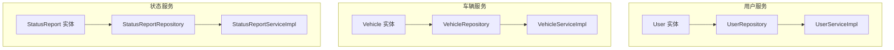
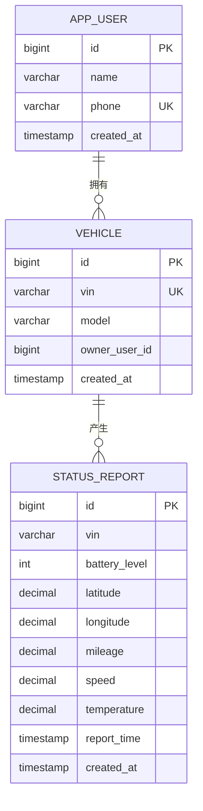
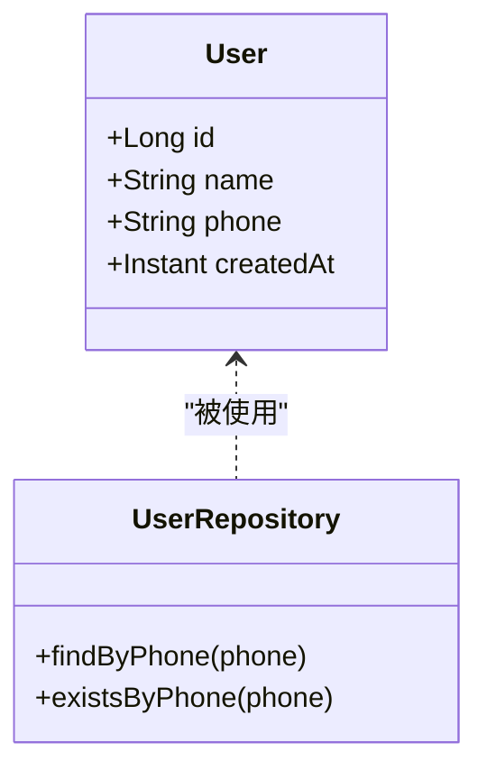
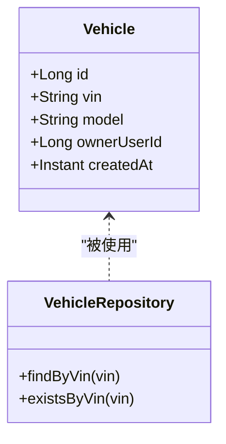
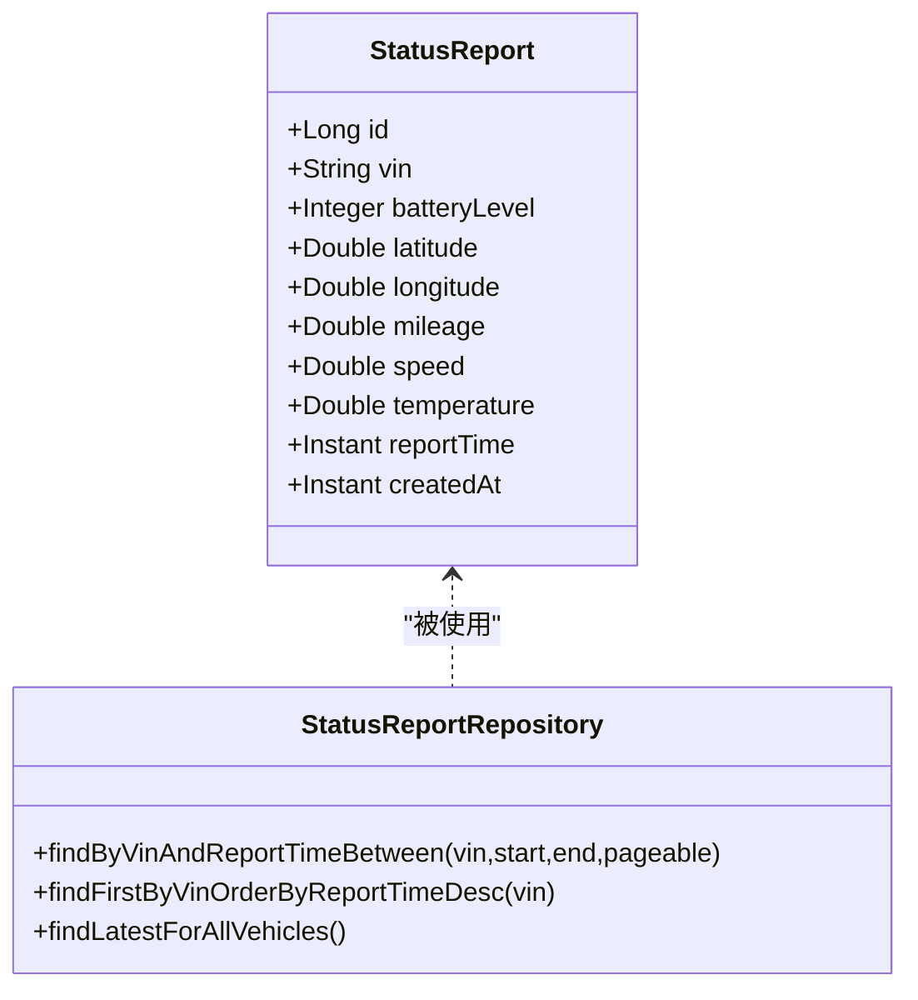
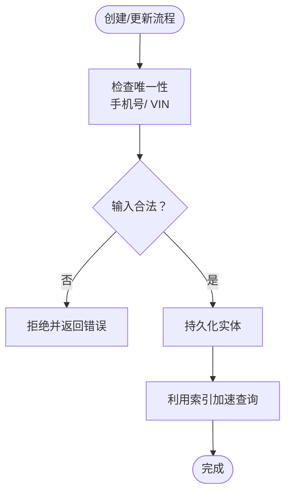
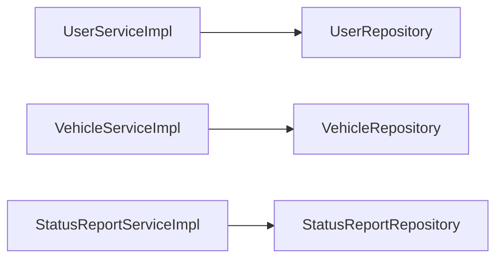

# 数据模型设计

<cite>
**本文引用的文件**
- [User.java](file://user-service/src/main/java/com/wenjie/cloud/user/entity/User.java)
- [UserDTO.java](file://user-service/src/main/java/com/wenjie/cloud/user/dto/UserDTO.java)
- [UserRepository.java](file://user-service/src/main/java/com/wenjie/cloud/user/repository/UserRepository.java)
- [UserServiceImpl.java](file://user-service/src/main/java/com/wenjie/cloud/user/service/impl/UserServiceImpl.java)
- [Vehicle.java](file://vehicle-service/src/main/java/com/wenjie/cloud/vehicle/entity/Vehicle.java)
- [VehicleDTO.java](file://vehicle-service/src/main/java/com/wenjie/cloud/vehicle/dto/VehicleDTO.java)
- [VehicleRepository.java](file://vehicle-service/src/main/java/com/wenjie/cloud/vehicle/repository/VehicleRepository.java)
- [VehicleServiceImpl.java](file://vehicle-service/src/main/java/com/wenjie/cloud/vehicle/service/impl/VehicleServiceImpl.java)
- [StatusReport.java](file://vehicle-status-service/src/main/java/com/wenjie/cloud/vehiclestatus/entity/StatusReport.java)
- [StatusReportDTO.java](file://vehicle-status-service/src/main/java/com/wenjie/cloud/vehiclestatus/dto/StatusReportDTO.java)
- [StatusReportRepository.java](file://vehicle-status-service/src/main/java/com/wenjie/cloud/vehiclestatus/repository/StatusReportRepository.java)
- [StatusReportServiceImpl.java](file://vehicle-status-service/src/main/java/com/wenjie/cloud/vehiclestatus/service/impl/StatusReportServiceImpl.java)
- [application.yml（用户服务）](file://user-service/src/main/resources/application.yml)
- [application.yml（车辆服务）](file://vehicle-service/src/main/resources/application.yml)
- [application.yml（状态服务）](file://vehicle-status-service/src/main/resources/application.yml)
</cite>

## 目录
1. [简介](#简介)
2. [项目结构](#项目结构)
3. [核心组件](#核心组件)
4. [架构总览](#架构总览)
5. [详细组件分析](#详细组件分析)
6. [依赖分析](#依赖分析)
7. [性能考量](#性能考量)
8. [故障排查指南](#故障排查指南)
9. [结论](#结论)
10. [附录](#附录)

## 简介
本文件面向车联网云平台的数据模型设计，聚焦三个核心实体：User（用户）、Vehicle（车辆）与 StatusReport（状态报告）。文档从字段定义、JPA 注解、数据校验规则与业务约束出发，系统阐述三者之间的关系与约束，并给出数据库关系图、演进策略、版本管理与迁移方案建议，以及数据访问模式、索引与性能优化要点。

## 项目结构
本项目采用多模块微服务架构，分别在 user-service、vehicle-service、vehicle-status-service 中独立维护各自的实体、仓库与服务层；vehicle-status-service 还包含 DTO 与 VO，用于接口入参与响应封装。

**章节来源**
- [application.yml（用户服务）:1-40](file://user-service/src/main/resources/application.yml#L1-L40)
- [application.yml（车辆服务）:1-40](file://vehicle-service/src/main/resources/application.yml#L1-L40)
- [application.yml（状态服务）:1-30](file://vehicle-status-service/src/main/resources/application.yml#L1-L30)

## 核心组件
本节对三大实体进行逐项解析，涵盖字段语义、JPA 映射、校验规则与业务约束。

- User（用户）
  - 字段与注解
    - 主键自增 id
    - 姓名：非空、长度限制
    - 手机号：非空、唯一、长度限制
    - 创建时间：非空且不可更新
  - 验证规则
    - DTO 层使用非空与手机号正则校验
  - 业务约束
    - 通过仓库方法保证手机号唯一性
    - 服务层在创建时再次检查重复并抛出业务异常

- Vehicle（车辆）
  - 字段与注解
    - 主键自增 id
    - VIN：非空、唯一、固定长度
    - 车型：可选
    - 关联车主 ID：可选（外键字段）
    - 创建时间：非空且不可更新
  - 验证规则
    - DTO 层校验 VIN 长度与非空，校验车型非空
  - 业务约束
    - 通过仓库方法保证 VIN 唯一性
    - 服务层在创建时再次检查重复并抛出业务异常

- StatusReport（状态报告）
  - 字段与注解
    - 主键自增 id
    - VIN：非空
    - 电池电量：非空、范围 0~100
    - 位置：纬度[-90,90]、经度[-180,180]，均非空
    - 里程、车速：非空且非负
    - 温度：非空
    - 上报时间：非空
    - 创建时间：非空且不可更新（持久化前自动填充）
  - 验证规则
    - DTO 层对各字段进行非空、范围与长度校验
  - 业务约束
    - 上报时间不得晚于当前时间
    - 支持按 VIN 与时间范围分页查询、查询单车最新记录、查询全量车辆最新记录

**章节来源**
- [User.java:13-37](file://user-service/src/main/java/com/wenjie/cloud/user/entity/User.java#L13-L37)
- [UserDTO.java:8-24](file://user-service/src/main/java/com/wenjie/cloud/user/dto/UserDTO.java#L8-L24)
- [UserRepository.java:11-22](file://user-service/src/main/java/com/wenjie/cloud/user/repository/UserRepository.java#L11-L22)
- [UserServiceImpl.java:27-42](file://user-service/src/main/java/com/wenjie/cloud/user/service/impl/UserServiceImpl.java#L27-L42)
- [Vehicle.java:13-41](file://vehicle-service/src/main/java/com/wenjie/cloud/vehicle/entity/Vehicle.java#L13-L41)
- [VehicleDTO.java:8-27](file://vehicle-service/src/main/java/com/wenjie/cloud/vehicle/dto/VehicleDTO.java#L8-L27)
- [VehicleRepository.java:11-22](file://vehicle-service/src/main/java/com/wenjie/cloud/vehicle/repository/VehicleRepository.java#L11-L22)
- [VehicleServiceImpl.java:27-43](file://vehicle-service/src/main/java/com/wenjie/cloud/vehicle/service/impl/VehicleServiceImpl.java#L27-L43)
- [StatusReport.java:15-70](file://vehicle-status-service/src/main/java/com/wenjie/cloud/vehiclestatus/entity/StatusReport.java#L15-L70)
- [StatusReportDTO.java:14-60](file://vehicle-status-service/src/main/java/com/wenjie/cloud/vehiclestatus/dto/StatusReportDTO.java#L14-L60)
- [StatusReportRepository.java:13-38](file://vehicle-status-service/src/main/java/com/wenjie/cloud/vehiclestatus/repository/StatusReportRepository.java#L13-L38)
- [StatusReportServiceImpl.java:30-72](file://vehicle-status-service/src/main/java/com/wenjie/cloud/vehiclestatus/service/impl/StatusReportServiceImpl.java#L30-L72)

## 架构总览
下图展示三实体在数据库中的关系与约束：User 与 Vehicle 之间为“车主-车辆”弱外键关联（owner_user_id），Vehicle 与 StatusReport 之间为“VIN-状态”强关联；同时 StatusReport 表具备复合索引以支持高频查询。

**图表来源**
- [User.java:19-37](file://user-service/src/main/java/com/wenjie/cloud/user/entity/User.java#L19-L37)
- [Vehicle.java:18-41](file://vehicle-service/src/main/java/com/wenjie/cloud/vehicle/entity/Vehicle.java#L18-L41)
- [StatusReport.java:18-70](file://vehicle-status-service/src/main/java/com/wenjie/cloud/vehiclestatus/entity/StatusReport.java#L18-L70)

## 详细组件分析

### User（用户）实体设计
- 字段定义
  - 姓名：字符串，长度上限，必填
  - 手机号：字符串，长度上限，必填且全局唯一
  - 创建时间：时间戳，插入后不变
- JPA 注解
  - 实体表名映射、主键自增、列名与长度、唯一性、不可更新
- 数据验证规则
  - DTO 层要求非空，手机号需满足 11 位中国大陆手机号格式
- 业务约束
  - 服务层在创建前检查手机号是否存在，避免重复
- 数据访问模式
  - 通过 UserRepository 提供按手机号查询与存在性判断

**图表来源**
- [User.java:19-37](file://user-service/src/main/java/com/wenjie/cloud/user/entity/User.java#L19-L37)
- [UserRepository.java:11-22](file://user-service/src/main/java/com/wenjie/cloud/user/repository/UserRepository.java#L11-L22)

**章节来源**
- [User.java:13-37](file://user-service/src/main/java/com/wenjie/cloud/user/entity/User.java#L13-L37)
- [UserDTO.java:8-24](file://user-service/src/main/java/com/wenjie/cloud/user/dto/UserDTO.java#L8-L24)
- [UserRepository.java:11-22](file://user-service/src/main/java/com/wenjie/cloud/user/repository/UserRepository.java#L11-L22)
- [UserServiceImpl.java:27-42](file://user-service/src/main/java/com/wenjie/cloud/user/service/impl/UserServiceImpl.java#L27-L42)

### Vehicle（车辆）实体设计
- 字段定义
  - VIN：字符串，固定长度 17，必填且唯一
  - 车型：字符串，可选
  - 关联车主 ID：整型，可选（弱外键）
  - 创建时间：时间戳，插入后不变
- JPA 注解
  - 实体表名映射、主键自增、列名与长度、唯一性、不可更新
- 数据验证规则
  - DTO 层要求 VIN 非空且长度为 17，车型非空
- 业务约束
  - 服务层在创建前检查 VIN 是否存在，避免重复
- 数据访问模式
  - 通过 VehicleRepository 提供按 VIN 查询与存在性判断

**图表来源**
- [Vehicle.java:18-41](file://vehicle-service/src/main/java/com/wenjie/cloud/vehicle/entity/Vehicle.java#L18-L41)
- [VehicleRepository.java:11-22](file://vehicle-service/src/main/java/com/wenjie/cloud/vehicle/repository/VehicleRepository.java#L11-L22)

**章节来源**
- [Vehicle.java:13-41](file://vehicle-service/src/main/java/com/wenjie/cloud/vehicle/entity/Vehicle.java#L13-L41)
- [VehicleDTO.java:8-27](file://vehicle-service/src/main/java/com/wenjie/cloud/vehicle/dto/VehicleDTO.java#L8-L27)
- [VehicleRepository.java:11-22](file://vehicle-service/src/main/java/com/wenjie/cloud/vehicle/repository/VehicleRepository.java#L11-L22)
- [VehicleServiceImpl.java:27-43](file://vehicle-service/src/main/java/com/wenjie/cloud/vehicle/service/impl/VehicleServiceImpl.java#L27-L43)

### StatusReport（状态报告）实体设计
- 字段定义
  - VIN：字符串，必填
  - 电池电量：整数，范围 0~100
  - 位置：纬度[-90,90]、经度[-180,180]
  - 里程、车速：数值，非负
  - 温度：数值，非空
  - 上报时间：时间戳，必填
  - 创建时间：时间戳，插入后不变（持久化前自动设置）
- JPA 注解
  - 复合索引 idx_vin_report_time(vin, report_time)，加速按 VIN+时间范围查询
- 数据验证规则
  - DTO 层对各字段进行非空、范围与长度校验
- 业务约束
  - 上报时间不得晚于当前时间
  - 支持按 VIN+时间范围分页查询、查询单车最新记录、查询全量车辆最新记录
- 数据访问模式
  - 通过 StatusReportRepository 提供多种查询方法

**图表来源**
- [StatusReport.java:18-70](file://vehicle-status-service/src/main/java/com/wenjie/cloud/vehiclestatus/entity/StatusReport.java#L18-L70)
- [StatusReportRepository.java:13-38](file://vehicle-status-service/src/main/java/com/wenjie/cloud/vehiclestatus/repository/StatusReportRepository.java#L13-L38)

**章节来源**
- [StatusReport.java:15-70](file://vehicle-status-service/src/main/java/com/wenjie/cloud/vehiclestatus/entity/StatusReport.java#L15-L70)
- [StatusReportDTO.java:14-60](file://vehicle-status-service/src/main/java/com/wenjie/cloud/vehiclestatus/dto/StatusReportDTO.java#L14-L60)
- [StatusReportRepository.java:13-38](file://vehicle-status-service/src/main/java/com/wenjie/cloud/vehiclestatus/repository/StatusReportRepository.java#L13-L38)
- [StatusReportServiceImpl.java:30-72](file://vehicle-status-service/src/main/java/com/wenjie/cloud/vehiclestatus/service/impl/StatusReportServiceImpl.java#L30-L72)

### 关系与外键设计
- User 与 Vehicle
  - 弱外键：Vehicle.owner_user_id 指向 User.id，未在 JPA 中声明物理外键约束，但业务上表示“车主-车辆”关系
- Vehicle 与 StatusReport
  - 强关联：StatusReport.vin 与 Vehicle.vin 对应，作为查询与聚合的关键字段
- 索引设计
  - StatusReport.idx_vin_report_time(vin, report_time) 用于高频的按 VIN+时间范围查询与分页

**图表来源**
- [UserRepository.java:11-22](file://user-service/src/main/java/com/wenjie/cloud/user/repository/UserRepository.java#L11-L22)
- [VehicleRepository.java:11-22](file://vehicle-service/src/main/java/com/wenjie/cloud/vehicle/repository/VehicleRepository.java#L11-L22)
- [StatusReport.java:18-22](file://vehicle-status-service/src/main/java/com/wenjie/cloud/vehiclestatus/entity/StatusReport.java#L18-L22)

## 依赖分析
- 组件内聚与耦合
  - 实体仅负责字段与注解，仓库负责数据访问，服务负责业务编排与异常处理，职责清晰
  - 服务层对仓库进行组合，避免跨服务直接依赖
- 外部依赖
  - Spring Data JPA 提供仓库接口能力
  - H2 内存数据库用于开发测试环境初始化
- 可能的循环依赖
  - 当前模块间为单向调用，无循环依赖风险

**图表来源**
- [UserServiceImpl.java:23-25](file://user-service/src/main/java/com/wenjie/cloud/user/service/impl/UserServiceImpl.java#L23-L25)
- [VehicleServiceImpl.java:23-25](file://vehicle-service/src/main/java/com/wenjie/cloud/vehicle/service/impl/VehicleServiceImpl.java#L23-L25)
- [StatusReportServiceImpl.java:26-28](file://vehicle-status-service/src/main/java/com/wenjie/cloud/vehiclestatus/service/impl/StatusReportServiceImpl.java#L26-L28)

**章节来源**
- [UserServiceImpl.java:23-25](file://user-service/src/main/java/com/wenjie/cloud/user/service/impl/UserServiceImpl.java#L23-L25)
- [VehicleServiceImpl.java:23-25](file://vehicle-service/src/main/java/com/wenjie/cloud/vehicle/service/impl/VehicleServiceImpl.java#L23-L25)
- [StatusReportServiceImpl.java:26-28](file://vehicle-status-service/src/main/java/com/wenjie/cloud/vehiclestatus/service/impl/StatusReportServiceImpl.java#L26-L28)

## 性能考量
- 索引设计
  - StatusReport.idx_vin_report_time(vin, report_time) 用于按 VIN 与时间范围查询与分页
- 查询模式
  - 单车最新记录：按 VIN 排序取第一条
  - 全量车辆最新记录：子查询取每组最大上报时间
- 时间序列优化
  - 建议按月/季进行分区或归档历史数据，减少单表膨胀
- 并发与事务
  - 创建用户/车辆时先做存在性检查再保存，避免唯一约束异常带来的回滚成本
- 序列化与存储
  - 开发环境使用 H2，生产建议使用关系型数据库并开启只读副本与连接池

**章节来源**
- [StatusReport.java:18-22](file://vehicle-status-service/src/main/java/com/wenjie/cloud/vehiclestatus/entity/StatusReport.java#L18-L22)
- [StatusReportRepository.java:18-37](file://vehicle-status-service/src/main/java/com/wenjie/cloud/vehiclestatus/repository/StatusReportRepository.java#L18-L37)
- [application.yml（状态服务）:16-29](file://vehicle-status-service/src/main/resources/application.yml#L16-L29)

## 故障排查指南
- 常见错误与定位
  - 手机号已存在：创建用户时由服务层校验并抛出业务异常
  - VIN 已存在：创建车辆时由服务层校验并抛出业务异常
  - 上报时间晚于当前：状态上报时由服务层校验并抛出业务异常
  - 查询时间范围非法：起始时间晚于结束时间时抛出业务异常
  - 无状态数据：查询单车最新记录不存在时抛出业务异常
- 日志与监控
  - 服务层关键操作包含日志输出，便于问题追踪
- 数据库初始化
  - 开发环境使用 H2 内存数据库，DDL 自动建表与初始化 SQL

**章节来源**
- [UserServiceImpl.java:27-42](file://user-service/src/main/java/com/wenjie/cloud/user/service/impl/UserServiceImpl.java#L27-L42)
- [VehicleServiceImpl.java:27-43](file://vehicle-service/src/main/java/com/wenjie/cloud/vehicle/service/impl/VehicleServiceImpl.java#L27-L43)
- [StatusReportServiceImpl.java:30-72](file://vehicle-status-service/src/main/java/com/wenjie/cloud/vehiclestatus/service/impl/StatusReportServiceImpl.java#L30-L72)
- [application.yml（用户服务）:8-35](file://user-service/src/main/resources/application.yml#L8-L35)
- [application.yml（车辆服务）:8-35](file://vehicle-service/src/main/resources/application.yml#L8-L35)
- [application.yml（状态服务）:7-29](file://vehicle-status-service/src/main/resources/application.yml#L7-L29)

## 结论
本数据模型围绕用户、车辆与状态报告三实体构建，通过 JPA 注解明确字段约束，结合 DTO 校验与服务层业务规则，确保数据一致性与可用性。StatusReport 的复合索引与查询策略满足高频读场景。建议在生产环境中引入物理外键、分区归档与连接池优化，并完善版本化迁移方案以支撑持续演进。

## 附录

### 数据模型演进策略、版本管理与迁移方案
- 版本化管理
  - 采用数据库版本控制工具（如 Flyway/Liquibase）管理 DDL 变更
  - 将初始 Schema 与后续变更脚本纳入版本仓库，确保可追溯
- 迁移策略
  - 新增列：默认值与非空约束需谨慎设计，必要时分步迁移
  - 唯一性变更：先建立新唯一索引，再删除旧索引，期间做好数据清洗
  - 索引变更：评估查询热点，避免过多写放大
- 回滚与灰度
  - 迁移脚本支持回滚；生产发布采用灰度与蓝绿部署降低风险
- 兼容性
  - DTO/VO 与实体分离，便于在不破坏数据库的前提下调整字段

### 数据访问模式与最佳实践
- 使用 Spring Data JPA 的派生查询与原生 JPQL，保持简洁与可读
- 对高频查询建立复合索引，避免全表扫描
- 在服务层集中处理业务校验与异常，保持仓储层纯粹
- 使用 Pageable 进行分页，避免一次性加载大量数据