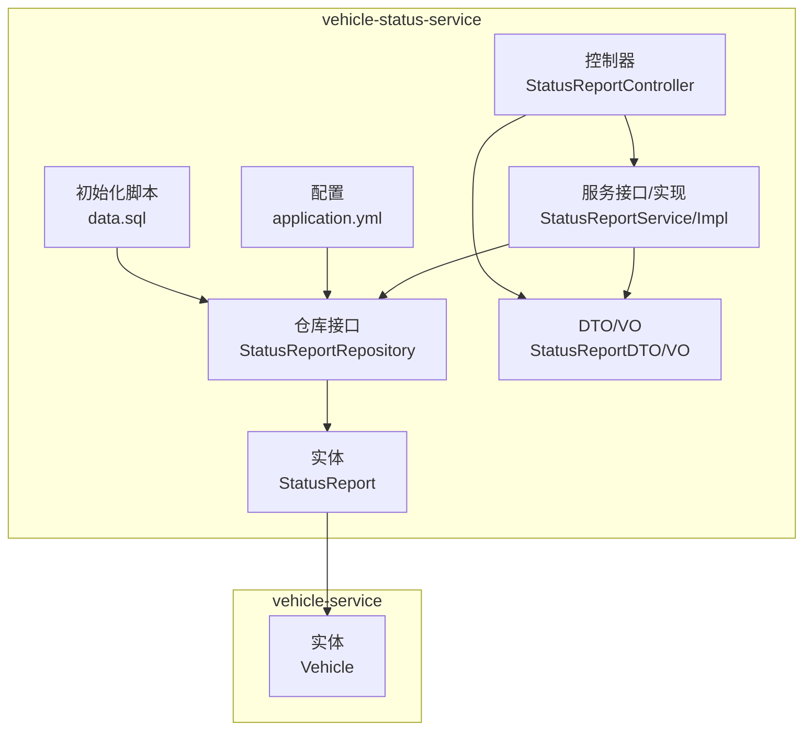
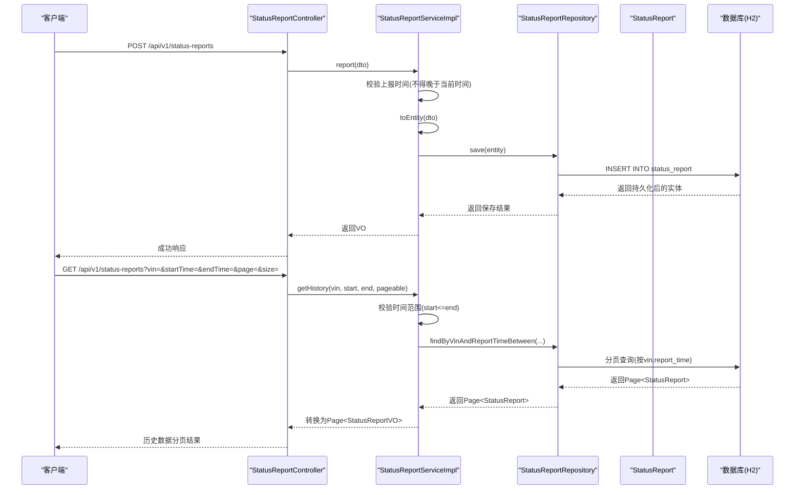
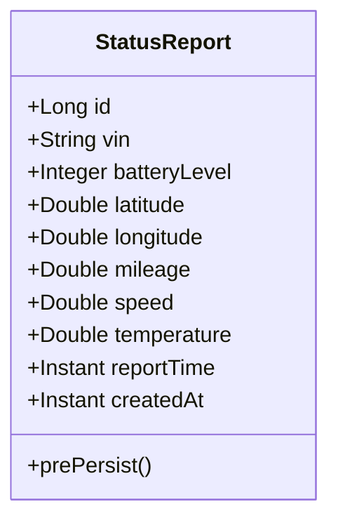
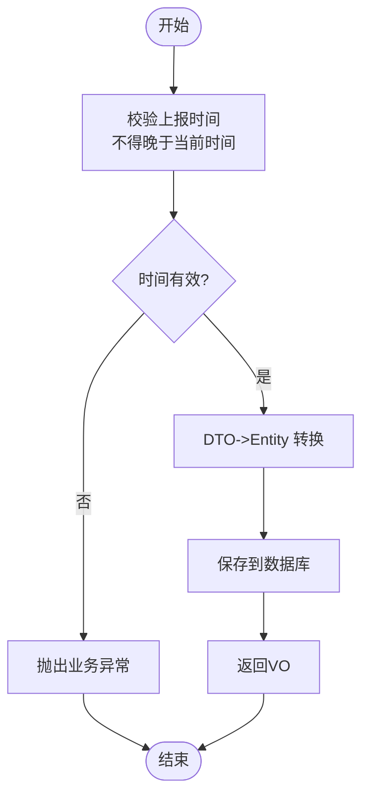
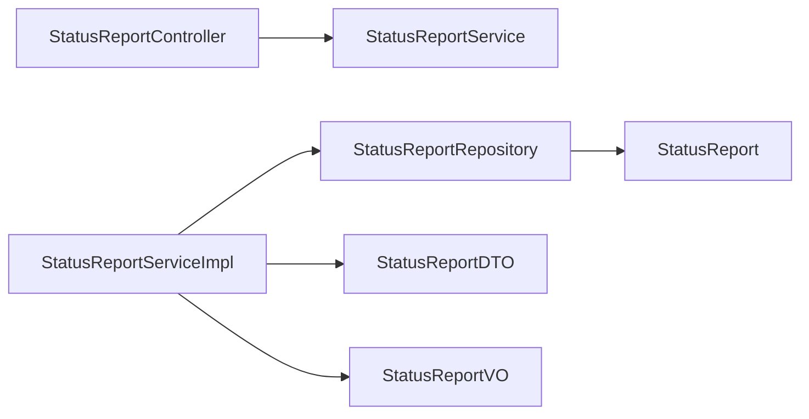

# 状态报告实体设计

<cite>
**本文档引用的文件**
- [StatusReport.java](file://vehicle-status-service/src/main/java/com/wenjie/cloud/vehiclestatus/entity/StatusReport.java)
- [StatusReportRepository.java](file://vehicle-status-service/src/main/java/com/wenjie/cloud/vehiclestatus/repository/StatusReportRepository.java)
- [StatusReportDTO.java](file://vehicle-status-service/src/main/java/com/wenjie/cloud/vehiclestatus/dto/StatusReportDTO.java)
- [StatusReportVO.java](file://vehicle-status-service/src/main/java/com/wenjie/cloud/vehiclestatus/dto/StatusReportVO.java)
- [StatusReportController.java](file://vehicle-status-service/src/main/java/com/wenjie/cloud/vehiclestatus/controller/StatusReportController.java)
- [StatusReportServiceImpl.java](file://vehicle-status-service/src/main/java/com/wenjie/cloud/vehiclestatus/service/impl/StatusReportServiceImpl.java)
- [StatusReportService.java](file://vehicle-status-service/src/main/java/com/wenjie/cloud/vehiclestatus/service/StatusReportService.java)
- [Vehicle.java](file://vehicle-service/src/main/java/com/wenjie/cloud/vehicle/entity/Vehicle.java)
- [application.yml](file://vehicle-status-service/src/main/resources/application.yml)
- [data.sql](file://vehicle-status-service/src/main/resources/data.sql)
</cite>

## 目录
1. [简介](#简介)
2. [项目结构](#项目结构)
3. [核心组件](#核心组件)
4. [架构概览](#架构概览)
5. [详细组件分析](#详细组件分析)
6. [依赖分析](#依赖分析)
7. [性能考量](#性能考量)
8. [故障排查指南](#故障排查指南)
9. [结论](#结论)
10. [附录](#附录)

## 简介
本文件系统性阐述状态报告实体的设计与实现，围绕 StatusReport 实体的字段定义、JPA 注解使用、业务约束与数据模型展开；重点说明电池电量、位置信息、速度、温度、时间戳等关键字段的范围约束与精度设计；解释 vehicleVin 外键字段与 Vehicle 实体的关联关系；给出完整的数据库表结构、复合索引与查询优化策略；并结合时间序列特性与历史数据管理策略，提供大数据量下的性能优化方案。

## 项目结构
状态报告相关代码位于 vehicle-status-service 模块，采用分层架构：
- 控制器层：接收请求并调用服务层
- 服务层：封装业务逻辑与事务控制
- 数据访问层：基于 Spring Data JPA 的仓库接口
- 实体层：JPA 实体与 DTO/VO 映射
- 配置与初始化：H2 内存数据库与 SQL 初始化脚本



**图表来源**
- [StatusReportController.java:1-71](file://vehicle-status-service/src/main/java/com/wenjie/cloud/vehiclestatus/controller/StatusReportController.java#L1-L71)
- [StatusReportServiceImpl.java:1-104](file://vehicle-status-service/src/main/java/com/wenjie/cloud/vehiclestatus/service/impl/StatusReportServiceImpl.java#L1-L104)
- [StatusReportRepository.java:1-39](file://vehicle-status-service/src/main/java/com/wenjie/cloud/vehiclestatus/repository/StatusReportRepository.java#L1-L39)
- [StatusReport.java:1-71](file://vehicle-status-service/src/main/java/com/wenjie/cloud/vehiclestatus/entity/StatusReport.java#L1-L71)
- [StatusReportDTO.java:1-61](file://vehicle-status-service/src/main/java/com/wenjie/cloud/vehiclestatus/dto/StatusReportDTO.java#L1-L61)
- [StatusReportVO.java:1-42](file://vehicle-status-service/src/main/java/com/wenjie/cloud/vehiclestatus/dto/StatusReportVO.java#L1-L42)
- [application.yml:1-30](file://vehicle-status-service/src/main/resources/application.yml#L1-L30)
- [data.sql:1-16](file://vehicle-status-service/src/main/resources/data.sql#L1-L16)
- [Vehicle.java:1-42](file://vehicle-service/src/main/java/com/wenjie/cloud/vehicle/entity/Vehicle.java#L1-L42)

**章节来源**
- [StatusReportController.java:1-71](file://vehicle-status-service/src/main/java/com/wenjie/cloud/vehiclestatus/controller/StatusReportController.java#L1-L71)
- [StatusReportServiceImpl.java:1-104](file://vehicle-status-service/src/main/java/com/wenjie/cloud/vehiclestatus/service/impl/StatusReportServiceImpl.java#L1-L104)
- [StatusReportRepository.java:1-39](file://vehicle-status-service/src/main/java/com/wenjie/cloud/vehiclestatus/repository/StatusReportRepository.java#L1-L39)
- [StatusReport.java:1-71](file://vehicle-status-service/src/main/java/com/wenjie/cloud/vehiclestatus/entity/StatusReport.java#L1-L71)
- [application.yml:1-30](file://vehicle-status-service/src/main/resources/application.yml#L1-L30)

## 核心组件
- 实体 StatusReport：承载单次上报的状态数据，包含 VIN、电量、位置、里程、速度、温度、上报时间、创建时间等字段，并通过 JPA 注解映射到数据库表。
- 仓库接口 StatusReportRepository：提供按 VIN+时间范围分页查询、查询某车最新状态、查询所有车辆各自最新状态等方法。
- 服务实现 StatusReportServiceImpl：封装业务规则（如上报时间不能晚于当前时间）、参数校验、实体与 VO 的转换。
- DTO/VO：StatusReportDTO 用于入参校验，StatusReportVO 用于对外输出。
- 控制器 StatusReportController：暴露 REST 接口，支持上报、历史查询、最新状态查询等。
- 配置与初始化：H2 内存数据库与 SQL 初始化脚本，便于演示与测试。

**章节来源**
- [StatusReport.java:1-71](file://vehicle-status-service/src/main/java/com/wenjie/cloud/vehiclestatus/entity/StatusReport.java#L1-L71)
- [StatusReportRepository.java:1-39](file://vehicle-status-service/src/main/java/com/wenjie/cloud/vehiclestatus/repository/StatusReportRepository.java#L1-L39)
- [StatusReportServiceImpl.java:1-104](file://vehicle-status-service/src/main/java/com/wenjie/cloud/vehiclestatus/service/impl/StatusReportServiceImpl.java#L1-L104)
- [StatusReportDTO.java:1-61](file://vehicle-status-service/src/main/java/com/wenjie/cloud/vehiclestatus/dto/StatusReportDTO.java#L1-L61)
- [StatusReportVO.java:1-42](file://vehicle-status-service/src/main/java/com/wenjie/cloud/vehiclestatus/dto/StatusReportVO.java#L1-L42)
- [StatusReportController.java:1-71](file://vehicle-status-service/src/main/java/com/wenjie/cloud/vehiclestatus/controller/StatusReportController.java#L1-L71)
- [application.yml:1-30](file://vehicle-status-service/src/main/resources/application.yml#L1-L30)
- [data.sql:1-16](file://vehicle-status-service/src/main/resources/data.sql#L1-L16)

## 架构概览
下图展示从控制器到服务、仓库、实体以及数据库的交互流程，体现状态上报与查询的关键路径。



**图表来源**
- [StatusReportController.java:36-53](file://vehicle-status-service/src/main/java/com/wenjie/cloud/vehiclestatus/controller/StatusReportController.java#L36-L53)
- [StatusReportServiceImpl.java:30-52](file://vehicle-status-service/src/main/java/com/wenjie/cloud/vehiclestatus/service/impl/StatusReportServiceImpl.java#L30-L52)
- [StatusReportRepository.java:18-21](file://vehicle-status-service/src/main/java/com/wenjie/cloud/vehiclestatus/repository/StatusReportRepository.java#L18-L21)
- [StatusReport.java:1-71](file://vehicle-status-service/src/main/java/com/wenjie/cloud/vehiclestatus/entity/StatusReport.java#L1-L71)

## 详细组件分析

### StatusReport 实体字段与 JPA 注解设计
- 主键与自增：使用 Long 类型主键，数据库自增策略。
- 字段映射：
  - vin：VARCHAR(17)，非空，作为复合索引的一部分。
  - batteryLevel：整数，非空，范围 0~100。
  - latitude/longitude：双精度浮点，非空，分别限定在地理坐标标准范围内。
  - mileage：双精度浮点，非负数，单位 km。
  - speed：双精度浮点，非负数，单位 km/h。
  - temperature：双精度浮点，非空，单位 ℃。
  - reportTime：时间戳，非空，用于排序与分页查询。
  - createdAt：时间戳，非空且不可更新，用于审计与数据溯源。
- 复合索引：在 vin 与 report_time 上建立复合索引，以优化按 VIN+时间范围的查询与“每车最新”查询。
- 预持久化：在持久化前设置 createdAt 为当前时间。



**图表来源**
- [StatusReport.java:23-70](file://vehicle-status-service/src/main/java/com/wenjie/cloud/vehiclestatus/entity/StatusReport.java#L23-L70)

**章节来源**
- [StatusReport.java:1-71](file://vehicle-status-service/src/main/java/com/wenjie/cloud/vehiclestatus/entity/StatusReport.java#L1-L71)

### 字段范围约束与精度设计

- 电池电量 batteryLevel
  - 范围：0~100，使用整数类型存储，满足百分比精度需求。
  - 约束：通过 DTO 层的最小值 0 与最大值 100 保证输入合法。
  - 存储：整数类型，占用空间小，计算高效。

- 位置信息 location（经纬度）
  - 纬度：范围 -90 到 90，使用 Double 存储。
  - 经度：范围 -180 到 180，使用 Double 存储。
  - 精度：采用 Double 类型，满足 GPS 精度需求；若需更高精度可考虑 Decimal/BigDecimal。
  - 坐标系：未显式声明，通常默认 WGS84；若业务需要其他坐标系，可在入库前进行转换。

- 速度 speed
  - 单位：km/h，使用 Double 存储。
  - 数值范围：非负数，DTO 层限制最小值为 0。
  - 精度：保留小数位以反映实时变化，适合统计分析。

- 温度 temperature
  - 单位：℃，使用 Double 存储。
  - 安全阈值：实体层未设置上限/下限，建议业务侧在服务层或应用层增加阈值检查与告警策略。

- 时间戳 reportTime
  - 类型：Instant（UTC），避免时区混淆。
  - 用途：排序、分页、历史查询。
  - 时区处理：统一使用 UTC，前端展示时再转换为目标时区。

- 创建时间 createdAt
  - 类型：Instant（UTC），不可更新。
  - 用途：审计、数据溯源、排序。

**章节来源**
- [StatusReportDTO.java:25-59](file://vehicle-status-service/src/main/java/com/wenjie/cloud/vehiclestatus/dto/StatusReportDTO.java#L25-L59)
- [StatusReport.java:34-69](file://vehicle-status-service/src/main/java/com/wenjie/cloud/vehiclestatus/entity/StatusReport.java#L34-L69)

### vehicleVin 外键与 Vehicle 实体关联
- 当前实体中，vin 字段为字符串类型，未声明 JPA 外键关系。
- Vehicle 实体中 vin 为唯一标识，长度 17。
- 建议在生产环境中：
  - 将 StatusReport.vin 改为 Long 类型的外键，指向 Vehicle.id，或
  - 在数据库层面添加外键约束，确保数据一致性。
  - 若保持字符串 VIN，应在业务层进行 VIN 校验与存在性检查。

**章节来源**
- [StatusReport.java:30-32](file://vehicle-status-service/src/main/java/com/wenjie/cloud/vehiclestatus/entity/StatusReport.java#L30-L32)
- [Vehicle.java:26-28](file://vehicle-service/src/main/java/com/wenjie/cloud/vehicle/entity/Vehicle.java#L26-L28)

### 数据库表结构与索引设计
- 表名：status_report
- 字段与类型（基于实体映射）：
  - id：自增主键
  - vin：VARCHAR(17)，非空
  - battery_level：整数，非空
  - latitude：双精度，非空
  - longitude：双精度，非空
  - mileage：双精度，非空
  - speed：双精度，非空
  - temperature：双精度，非空
  - report_time：时间戳，非空
  - created_at：时间戳，非空且不可更新
- 复合索引：
  - idx_vin_report_time(vin, report_time)：优化按 VIN+时间范围查询与“每车最新”查询。
- 初始化数据：包含多条示例记录，验证复合索引与查询路径。

```mermaid
erDiagram
STATUS_REPORT {
bigint id PK
varchar vin
integer battery_level
double latitude
double longitude
double mileage
double speed
double temperature
timestamp report_time
timestamp created_at
}
INDEX idx_vin_report_time ON STATUS_REPORT(vin, report_time)
```

**图表来源**
- [StatusReport.java:20-22](file://vehicle-status-service/src/main/java/com/wenjie/cloud/vehiclestatus/entity/StatusReport.java#L20-L22)
- [data.sql:7-16](file://vehicle-status-service/src/main/resources/data.sql#L7-L16)

**章节来源**
- [StatusReport.java:20-22](file://vehicle-status-service/src/main/java/com/wenjie/cloud/vehiclestatus/entity/StatusReport.java#L20-L22)
- [data.sql:1-16](file://vehicle-status-service/src/main/resources/data.sql#L1-L16)

### 查询接口与业务流程

- 上报接口
  - 控制器：POST /api/v1/status-reports
  - 服务：校验上报时间不得晚于当前时间，保存后返回 VO
- 历史查询接口
  - 控制器：GET /api/v1/status-reports?vin=&startTime=&endTime=&page=&size=
  - 服务：校验起止时间顺序，按 report_time 降序分页返回
- 最新状态查询接口
  - 某车最新：GET /api/v1/status-reports/latest/{vin}
  - 所有车最新：GET /api/v1/status-reports/latest
  - 仓库：findFirstByVinOrderByReportTimeDesc 或子查询实现“每车最新”



**图表来源**
- [StatusReportServiceImpl.java:30-41](file://vehicle-status-service/src/main/java/com/wenjie/cloud/vehiclestatus/service/impl/StatusReportServiceImpl.java#L30-L41)

**章节来源**
- [StatusReportController.java:33-69](file://vehicle-status-service/src/main/java/com/wenjie/cloud/vehiclestatus/controller/StatusReportController.java#L33-L69)
- [StatusReportServiceImpl.java:30-72](file://vehicle-status-service/src/main/java/com/wenjie/cloud/vehiclestatus/service/impl/StatusReportServiceImpl.java#L30-L72)
- [StatusReportRepository.java:18-37](file://vehicle-status-service/src/main/java/com/wenjie/cloud/vehiclestatus/repository/StatusReportRepository.java#L18-L37)

### 时间序列特性与历史数据管理策略
- 时间序列特征
  - 每条记录携带 reportTime，天然具备时间维度。
  - 支持按 VIN+时间范围分页查询，适合滚动窗口分析。
- 历史数据管理
  - 建议策略：
    - 归档：对历史数据定期归档至冷存储（如对象存储）。
    - 分表：按月/季度分区，减少单表扫描。
    - 清理：根据业务保留期清理过期数据。
    - 压缩：启用数据库压缩与索引维护。
  - 当前实现已具备良好的查询基础（复合索引 + 分页）。

**章节来源**
- [StatusReportRepository.java:18-21](file://vehicle-status-service/src/main/java/com/wenjie/cloud/vehiclestatus/repository/StatusReportRepository.java#L18-L21)
- [StatusReportServiceImpl.java:43-52](file://vehicle-status-service/src/main/java/com/wenjie/cloud/vehiclestatus/service/impl/StatusReportServiceImpl.java#L43-L52)

## 依赖分析
- 控制器依赖服务接口，服务实现依赖仓库接口与实体。
- 仓库接口继承 JpaRepository，提供分页与排序能力。
- 实体与 DTO/VO 之间通过服务层进行转换，遵循分层职责。



**图表来源**
- [StatusReportController.java:26-29](file://vehicle-status-service/src/main/java/com/wenjie/cloud/vehiclestatus/controller/StatusReportController.java#L26-L29)
- [StatusReportServiceImpl.java:23-26](file://vehicle-status-service/src/main/java/com/wenjie/cloud/vehiclestatus/service/impl/StatusReportServiceImpl.java#L23-L26)
- [StatusReportRepository.java:16-16](file://vehicle-status-service/src/main/java/com/wenjie/cloud/vehiclestatus/repository/StatusReportRepository.java#L16-L16)
- [StatusReport.java:1-71](file://vehicle-status-service/src/main/java/com/wenjie/cloud/vehiclestatus/entity/StatusReport.java#L1-L71)

**章节来源**
- [StatusReportController.java:1-71](file://vehicle-status-service/src/main/java/com/wenjie/cloud/vehiclestatus/controller/StatusReportController.java#L1-L71)
- [StatusReportServiceImpl.java:1-104](file://vehicle-status-service/src/main/java/com/wenjie/cloud/vehiclestatus/service/impl/StatusReportServiceImpl.java#L1-L104)
- [StatusReportRepository.java:1-39](file://vehicle-status-service/src/main/java/com/wenjie/cloud/vehiclestatus/repository/StatusReportRepository.java#L1-L39)

## 性能考量
- 索引优化
  - 已建立 idx_vin_report_time(vin, report_time)，覆盖按 VIN+时间范围查询与“每车最新”场景。
  - 建议：若存在按 report_time 单列高频查询，可考虑单独索引或调整复合索引顺序。
- 分页与排序
  - 使用 PageRequest 指定按 report_time DESC，避免全表扫描。
- 数据类型与精度
  - 电量、速度、温度使用整数/双精度，兼顾精度与存储效率。
  - 若需要更高精度，可考虑 BigDecimal。
- 时区与时间戳
  - 统一使用 Instant（UTC），避免跨时区问题与重复索引。
- 大数据量优化建议
  - 分区表：按时间维度（如月）分区。
  - 读写分离：热点查询走只读副本。
  - 缓存：最近状态可缓存于 Redis，降低数据库压力。
  - 异步写入：上报接口异步落库，提升吞吐。
  - 压缩与归档：历史数据压缩与归档。

[本节为通用性能建议，无需特定文件引用]

## 故障排查指南
- 上报时间晚于当前时间
  - 现象：服务层抛出业务异常，错误码 3001。
  - 排查：确认客户端时间与服务器时间同步，检查时区设置。
- 查询起止时间顺序错误
  - 现象：错误码 3002，提示起始时间不能晚于结束时间。
  - 排查：前端传参校验，确保 startTime <= endTime。
- VIN 格式不正确或无状态数据
  - 现象：错误码 3004/3003，VIN 长度必须为 17，或无对应状态数据。
  - 排查：确认 VIN 是否存在于 Vehicle 表，或在业务层进行存在性检查。

**章节来源**
- [StatusReportServiceImpl.java:33-35](file://vehicle-status-service/src/main/java/com/wenjie/cloud/vehiclestatus/service/impl/StatusReportServiceImpl.java#L33-L35)
- [StatusReportServiceImpl.java:46-48](file://vehicle-status-service/src/main/java/com/wenjie/cloud/vehiclestatus/service/impl/StatusReportServiceImpl.java#L46-L48)
- [StatusReportServiceImpl.java:57-63](file://vehicle-status-service/src/main/java/com/wenjie/cloud/vehiclestatus/service/impl/StatusReportServiceImpl.java#L57-L63)

## 结论
StatusReport 实体设计遵循 JPA 规范，字段命名清晰、注解明确，配合复合索引与分页查询，满足按 VIN+时间范围的历史查询与“每车最新”场景。建议在生产环境完善外键约束、引入更高精度的数据类型与缓存策略，并结合分区与归档机制应对大数据量挑战。温度阈值等业务安全策略应由服务层或应用层补充，确保数据质量与业务合规。

## 附录

### API 定义与示例
- 上报状态
  - 方法：POST
  - 路径：/api/v1/status-reports
  - 请求体：StatusReportDTO
  - 响应体：ApiResponse<StatusReportVO>
- 历史查询
  - 方法：GET
  - 路径：/api/v1/status-reports
  - 查询参数：vin, startTime, endTime, page, size
  - 响应体：ApiResponse<Page<StatusReportVO>>
- 最新状态（单车）
  - 方法：GET
  - 路径：/api/v1/status-reports/latest/{vin}
  - 响应体：ApiResponse<StatusReportVO>
- 最新状态（全部）
  - 方法：GET
  - 路径：/api/v1/status-reports/latest
  - 响应体：ApiResponse<List<StatusReportVO>>

**章节来源**
- [StatusReportController.java:33-69](file://vehicle-status-service/src/main/java/com/wenjie/cloud/vehiclestatus/controller/StatusReportController.java#L33-L69)