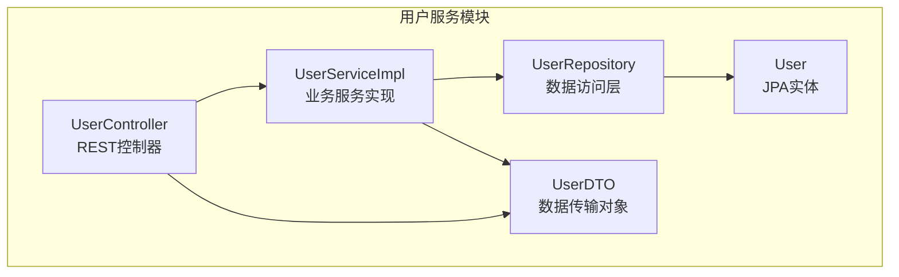
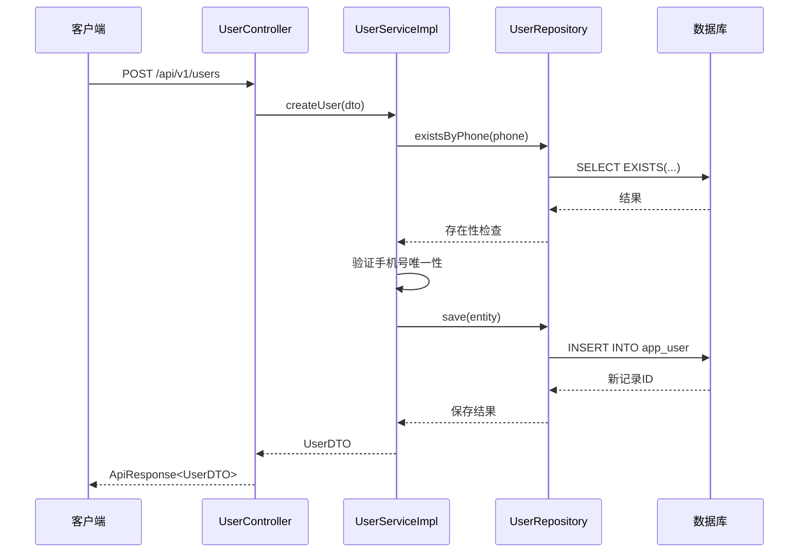
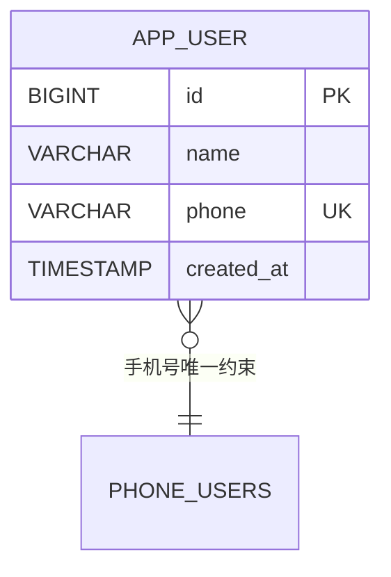
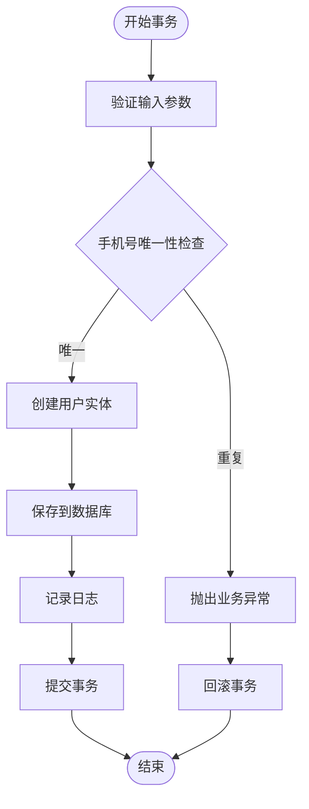
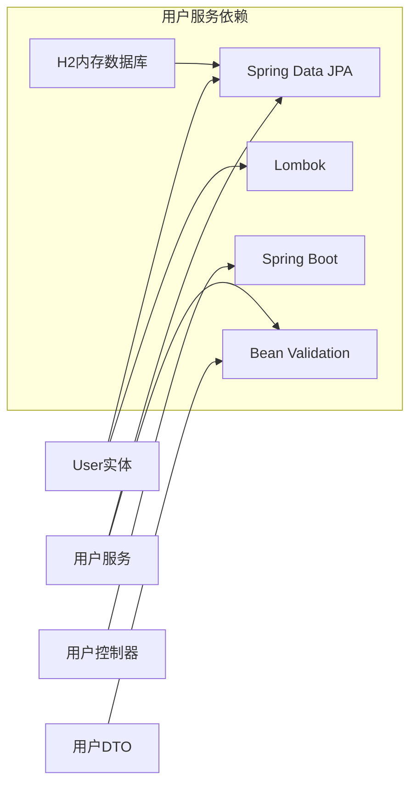
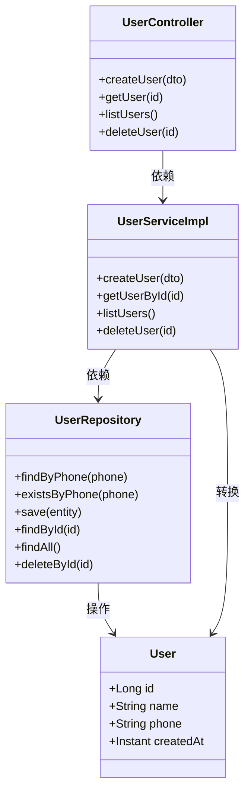

# 用户实体设计

<cite>
**本文档引用的文件**
- [User.java](file://user-service/src/main/java/com/wenjie/cloud/user/entity/User.java)
- [UserRepository.java](file://user-service/src/main/java/com/wenjie/cloud/user/repository/UserRepository.java)
- [UserServiceImpl.java](file://user-service/src/main/java/com/wenjie/cloud/user/service/impl/UserServiceImpl.java)
- [UserController.java](file://user-service/src/main/java/com/wenjie/cloud/user/controller/UserController.java)
- [UserDTO.java](file://user-service/src/main/java/com/wenjie/cloud/user/dto/UserDTO.java)
- [application.yml](file://user-service/src/main/resources/application.yml)
- [data.sql](file://user-service/src/main/resources/data.sql)
- [pom.xml](file://user-service/pom.xml)
</cite>

## 目录
1. [简介](#简介)
2. [项目结构](#项目结构)
3. [核心组件](#核心组件)
4. [架构概览](#架构概览)
5. [详细组件分析](#详细组件分析)
6. [依赖分析](#依赖分析)
7. [性能考虑](#性能考虑)
8. [故障排除指南](#故障排除指南)
9. [结论](#结论)

## 简介

本文件详细阐述了用户实体（User）的设计与实现，涵盖JPA注解使用、字段约束、时间戳管理、Lombok注解简化效果以及完整的数据库表结构设计。通过分析用户服务模块的完整代码栈，展示了从控制器到数据访问层的端到端实现，为开发者提供可操作的参考和最佳实践建议。

## 项目结构

用户服务采用标准的Spring Boot分层架构，围绕User实体构建完整的CRUD功能：

**图表来源**
- [UserController.java:1-60](file://user-service/src/main/java/com/wenjie/cloud/user/controller/UserController.java#L1-L60)
- [UserServiceImpl.java:1-80](file://user-service/src/main/java/com/wenjie/cloud/user/service/impl/UserServiceImpl.java#L1-L80)
- [UserRepository.java:1-23](file://user-service/src/main/java/com/wenjie/cloud/user/repository/UserRepository.java#L1-L23)
- [User.java:1-38](file://user-service/src/main/java/com/wenjie/cloud/user/entity/User.java#L1-L38)

**章节来源**
- [UserController.java:1-60](file://user-service/src/main/java/com/wenjie/cloud/user/controller/UserController.java#L1-L60)
- [UserServiceImpl.java:1-80](file://user-service/src/main/java/com/wenjie/cloud/user/service/impl/UserServiceImpl.java#L1-L80)
- [UserRepository.java:1-23](file://user-service/src/main/java/com/wenjie/cloud/user/repository/UserRepository.java#L1-L23)
- [User.java:1-38](file://user-service/src/main/java/com/wenjie/cloud/user/entity/User.java#L1-L38)

## 核心组件

### User实体类设计

User实体是用户管理的核心数据模型，采用JPA注解进行持久化映射：

#### 主键设计
- 使用`@Id`和`@GeneratedValue(strategy = GenerationType.IDENTITY)`实现数据库自增主键
- 支持MySQL、PostgreSQL等支持自增的数据库引擎
- 主键类型为Long，满足大多数业务场景的ID范围需求

#### 字段约束设计

**姓名字段（name）**
- 长度限制：最大64字符
- 非空约束：`nullable = false`
- 用途：存储用户真实姓名或昵称

**手机号字段（phone）**
- 长度限制：固定11字符
- 唯一性约束：`unique = true`
- 非空约束：`nullable = false`
- 数据库层面保证手机号唯一性，避免重复注册

**创建时间字段（createdAt）**
- 非空约束：`nullable = false`
- 不可更新：`updatable = false`
- 时间戳管理：使用Java 8的`Instant`类型，支持UTC时区
- 自动设置：在服务层创建时自动填充当前时间

#### 注解作用说明

**实体注解**
- `@Entity`：标识该类为JPA实体
- `@Table(name = "app_user")`：指定数据库表名为`app_user`
- 表名映射关系：类名User对应表名app_user

**Lombok注解**
- `@Data`：自动生成getter、setter、toString、equals、hashCode方法
- 显著减少样板代码，提升开发效率
- 保持代码简洁性和可维护性

**章节来源**
- [User.java:13-38](file://user-service/src/main/java/com/wenjie/cloud/user/entity/User.java#L13-L38)

## 架构概览

用户实体在整个系统中的位置和交互关系：

**图表来源**
- [UserController.java:28-34](file://user-service/src/main/java/com/wenjie/cloud/user/controller/UserController.java#L28-L34)
- [UserServiceImpl.java:28-42](file://user-service/src/main/java/com/wenjie/cloud/user/service/impl/UserServiceImpl.java#L28-L42)
- [UserRepository.java:11-22](file://user-service/src/main/java/com/wenjie/cloud/user/repository/UserRepository.java#L11-L22)

## 详细组件分析

### 数据库表结构设计

基于User实体的JPA映射，生成的数据库表结构如下：

**表结构详情**
- 表名：`app_user`
- 主键：`id`（自增）
- 唯一约束：`phone`（手机号）
- 非空约束：`name`、`phone`、`created_at`
- 索引设计：
  - 主键索引：自动创建
  - 唯一索引：手机号字段自动创建唯一索引
  - 建议额外索引：对高频查询字段建立索引

**图表来源**
- [User.java:21-36](file://user-service/src/main/java/com/wenjie/cloud/user/entity/User.java#L21-L36)
- [data.sql:5-10](file://user-service/src/main/resources/data.sql#L5-L10)

### 字段验证机制

#### DTO层验证
UserDTO在API入口处进行参数验证：
- 姓名：非空验证
- 手机号：非空且符合11位数字格式

#### 实体层约束
数据库层面的约束保证：
- 姓名长度限制（64字符）
- 手机号唯一性
- 创建时间非空且不可更新

#### 业务层验证
服务层补充的业务逻辑：
- 手机号重复检查
- 异常处理和日志记录

**章节来源**
- [UserDTO.java:16-24](file://user-service/src/main/java/com/wenjie/cloud/user/dto/UserDTO.java#L16-L24)
- [UserServiceImpl.java:30-32](file://user-service/src/main/java/com/wenjie/cloud/user/service/impl/UserServiceImpl.java#L30-L32)

### 查询优化策略

#### 基础查询
- 根据ID查询：使用JpaRepository默认方法
- 获取所有用户：全表扫描，适合小规模数据

#### 高级查询
UserRepository提供了基于方法名的查询：
- `findByPhone(String phone)`：手机号精确匹配
- `existsByPhone(String phone)`：手机号存在性检查

#### 性能优化建议
1. **索引优化**：为phone字段自动创建唯一索引
2. **分页查询**：大数据量时使用Pageable
3. **投影查询**：仅查询必要字段
4. **缓存策略**：热点数据添加Redis缓存

**章节来源**
- [UserRepository.java:11-22](file://user-service/src/main/java/com/wenjie/cloud/user/repository/UserRepository.java#L11-L22)

### 事务管理

**图表来源**
- [UserServiceImpl.java:28-42](file://user-service/src/main/java/com/wenjie/cloud/user/service/impl/UserServiceImpl.java#L28-L42)

**章节来源**
- [UserServiceImpl.java:28-68](file://user-service/src/main/java/com/wenjie/cloud/user/service/impl/UserServiceImpl.java#L28-L68)

## 依赖分析

### 外部依赖关系

**图表来源**
- [pom.xml:18-48](file://user-service/pom.xml#L18-L48)

### 内部组件依赖

**图表来源**
- [UserController.java:21-26](file://user-service/src/main/java/com/wenjie/cloud/user/controller/UserController.java#L21-L26)
- [UserServiceImpl.java:20-25](file://user-service/src/main/java/com/wenjie/cloud/user/service/impl/UserServiceImpl.java#L20-L25)
- [UserRepository.java:11-22](file://user-service/src/main/java/com/wenjie/cloud/user/repository/UserRepository.java#L11-L22)
- [User.java:19-36](file://user-service/src/main/java/com/wenjie/cloud/user/entity/User.java#L19-L36)

**章节来源**
- [pom.xml:18-48](file://user-service/pom.xml#L18-L48)

## 性能考虑

### 数据库性能优化

1. **索引策略**
   - 手机号字段已建立唯一索引，确保查询和去重性能
   - 建议为常用查询字段建立复合索引

2. **连接池配置**
   - 合理配置最大连接数和超时时间
   - 使用连接池监控工具

3. **查询优化**
   - 避免SELECT *
   - 使用LIMIT限制结果集大小
   - 实施分页查询

### 应用层优化

1. **缓存策略**
   - 对热点用户数据实施缓存
   - 设置合理的过期时间和失效策略

2. **批量操作**
   - 提供批量插入和更新接口
   - 使用JDBC模板进行高性能批量操作

3. **异步处理**
   - 对非关键路径操作实施异步化
   - 使用消息队列处理耗时任务

## 故障排除指南

### 常见问题及解决方案

#### 手机号重复错误
**现象**：创建用户时报手机号已存在
**原因**：数据库唯一约束触发
**解决方案**：
1. 在服务层进行预检查
2. 提供友好的错误提示
3. 考虑软删除场景下的处理

#### 时间戳不一致
**现象**：创建时间显示异常
**原因**：时区配置问题
**解决方案**：
1. 统一时区配置
2. 使用UTC时间存储
3. 前端进行时区转换

#### 查询性能问题
**现象**：大数据量查询响应慢
**解决方案**：
1. 添加适当的索引
2. 实施分页查询
3. 优化SQL语句

**章节来源**
- [UserServiceImpl.java:30-32](file://user-service/src/main/java/com/wenjie/cloud/user/service/impl/UserServiceImpl.java#L30-L32)
- [application.yml:8-25](file://user-service/src/main/resources/application.yml#L8-L25)

## 结论

用户实体设计体现了现代Spring Boot应用的最佳实践：

1. **清晰的分层架构**：从控制器到服务再到数据访问层的职责分离
2. **完善的约束机制**：DTO层、实体层和数据库层的多层验证
3. **高效的代码生成**：Lombok注解显著减少样板代码
4. **良好的扩展性**：基于Spring Data JPA的灵活查询能力
5. **生产就绪特性**：包含事务管理、异常处理和日志记录

该设计为用户管理功能提供了坚实的基础，可根据业务需求进一步扩展，如添加审计字段、实施软删除、集成缓存等高级特性。