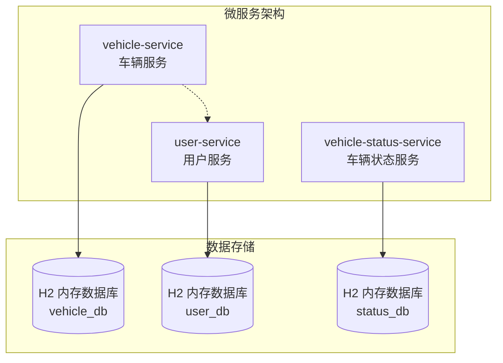
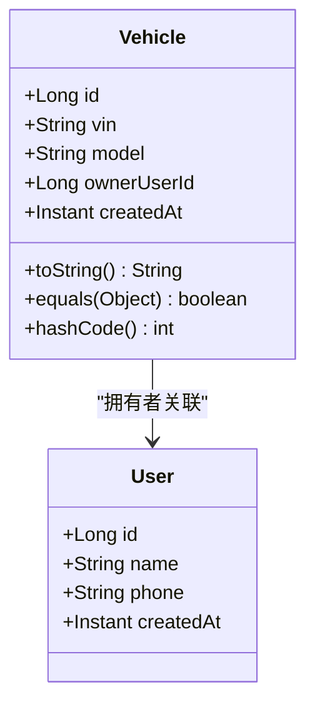
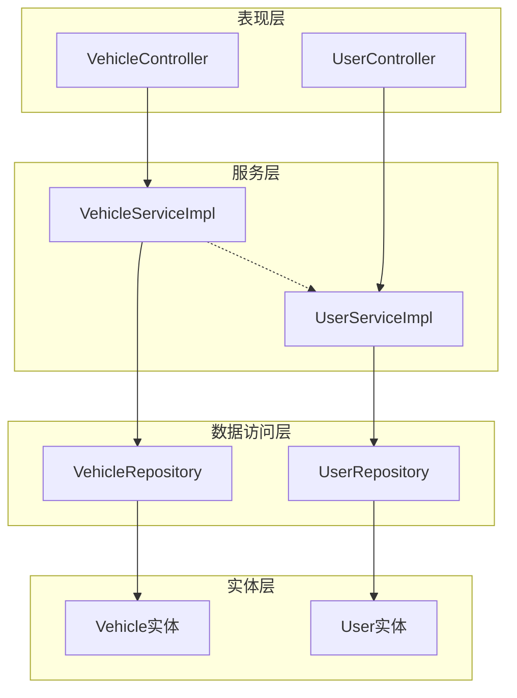
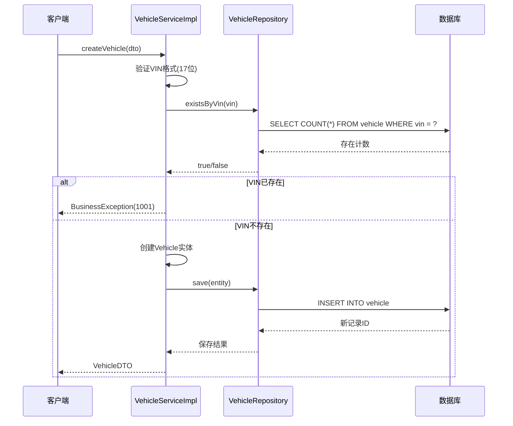
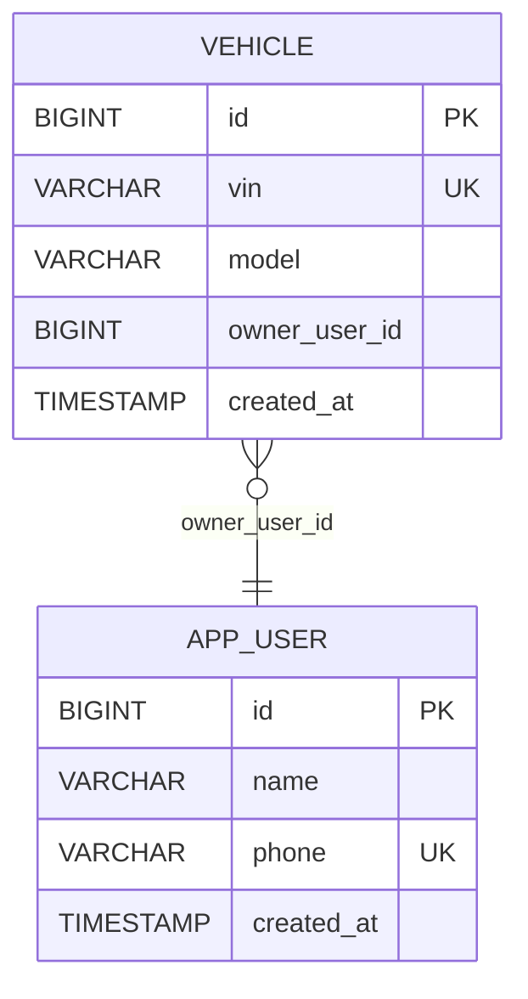
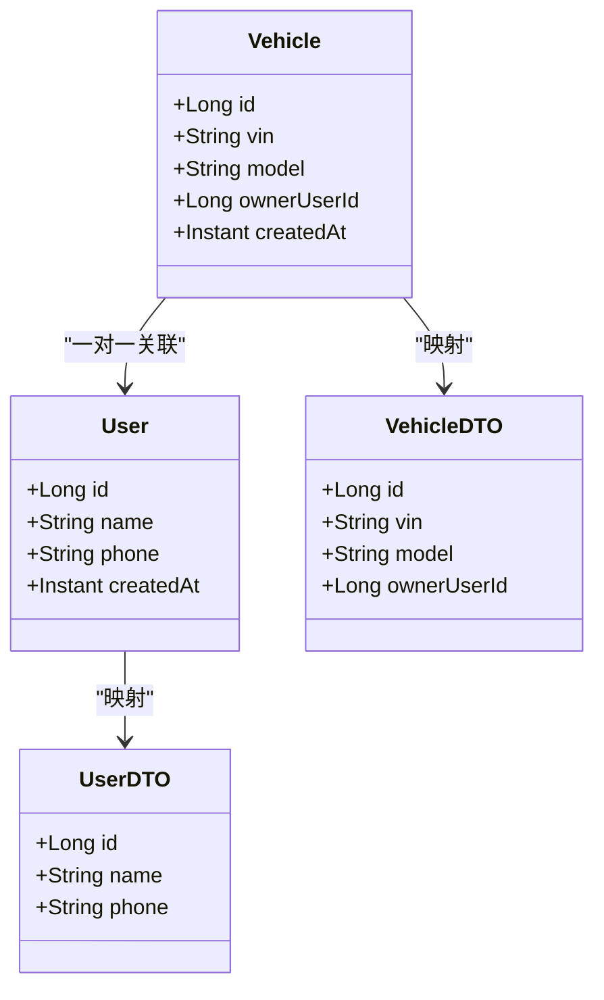
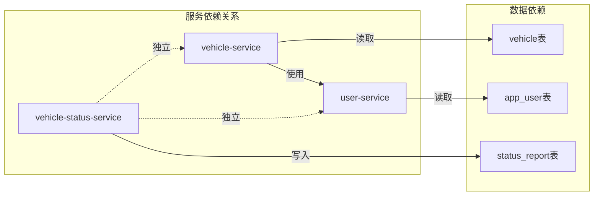
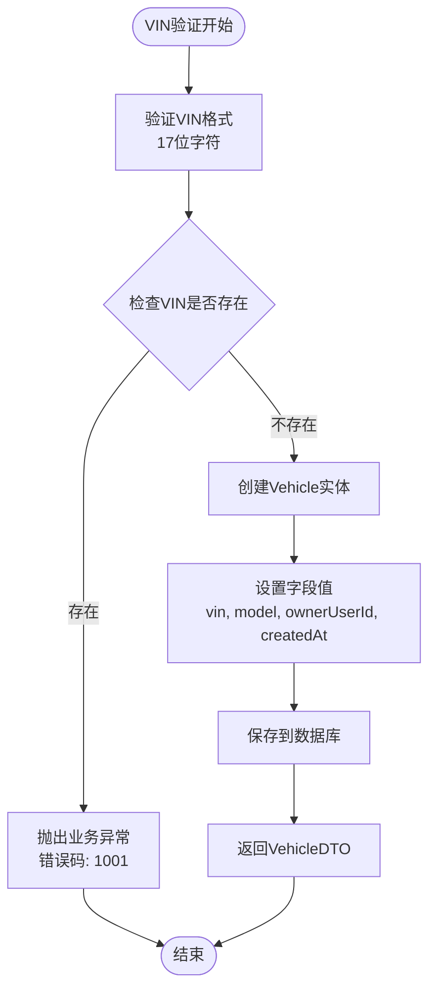
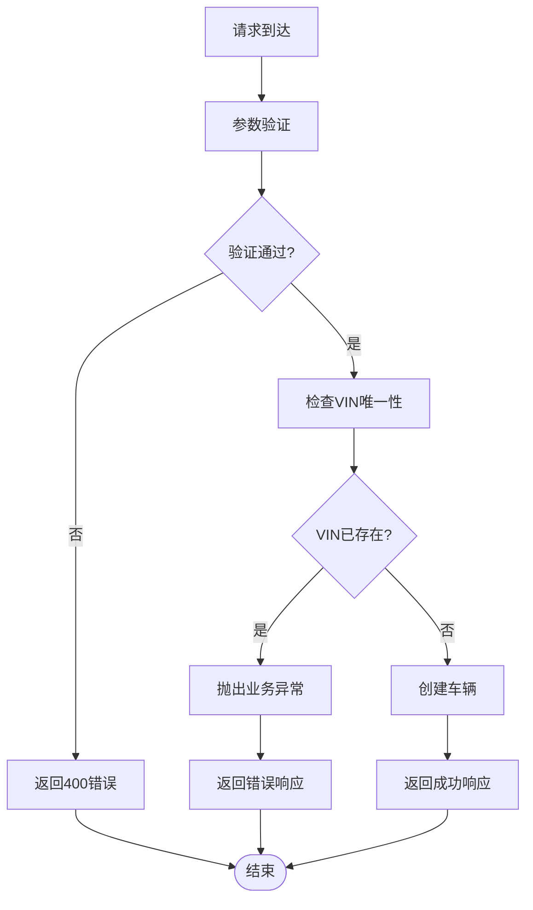

# 车辆实体设计

<cite>
**本文档引用的文件**
- [Vehicle.java](file://vehicle-service/src/main/java/com/wenjie/cloud/vehicle/entity/Vehicle.java)
- [User.java](file://user-service/src/main/java/com/wenjie/cloud/user/entity/User.java)
- [VehicleRepository.java](file://vehicle-service/src/main/java/com/wenjie/cloud/vehicle/repository/VehicleRepository.java)
- [UserRepository.java](file://user-service/src/main/java/com/wenjie/cloud/user/repository/UserRepository.java)
- [VehicleServiceImpl.java](file://vehicle-service/src/main/java/com/wenjie/cloud/vehicle/service/impl/VehicleServiceImpl.java)
- [VehicleDTO.java](file://vehicle-service/src/main/java/com/wenjie/cloud/vehicle/dto/VehicleDTO.java)
- [UserDTO.java](file://user-service/src/main/java/com/wenjie/cloud/user/dto/UserDTO.java)
- [application.yml](file://vehicle-service/src/main/resources/application.yml)
- [data.sql](file://vehicle-service/src/main/resources/data.sql)
</cite>

## 目录
1. [简介](#简介)
2. [项目结构](#项目结构)
3. [核心组件](#核心组件)
4. [架构概览](#架构概览)
5. [详细组件分析](#详细组件分析)
6. [依赖关系分析](#依赖关系分析)
7. [性能考虑](#性能考虑)
8. [故障排除指南](#故障排除指南)
9. [结论](#结论)

## 简介

本文档深入分析了车辆实体设计，重点关注Vehicle实体的字段定义、JPA注解使用以及业务逻辑实现。该设计实现了VIN码的17位唯一性约束、VIN码验证规则、与User实体的一对多关联关系，以及完整的数据完整性保证机制。

## 项目结构

本项目采用微服务架构，包含三个主要服务模块：

**图表来源**
- [application.yml:1-40](file://vehicle-service/src/main/resources/application.yml#L1-L40)
- [application.yml:1-40](file://user-service/src/main/resources/application.yml#L1-L40)

**章节来源**
- [application.yml:1-40](file://vehicle-service/src/main/resources/application.yml#L1-L40)
- [application.yml:1-40](file://user-service/src/main/resources/application.yml#L1-L40)

## 核心组件

### Vehicle实体设计

Vehicle实体是整个系统的核心数据模型，采用标准的JPA注解实现完整的数据持久化功能：

**图表来源**
- [Vehicle.java:16-41](file://vehicle-service/src/main/java/com/wenjie/cloud/vehicle/entity/Vehicle.java#L16-L41)
- [User.java:16-37](file://user-service/src/main/java/com/wenjie/cloud/user/entity/User.java#L16-L37)

### 字段定义与注解分析

#### 主键标识符
- **字段**: `id`
- **注解**: `@Id`, `@GeneratedValue(strategy = GenerationType.IDENTITY)`
- **作用**: 自动生成递增主键，确保每辆车的唯一标识

#### VIN码字段（核心业务字段）
- **字段**: `vin`
- **注解**: `@Column(name = "vin", length = 17, nullable = false, unique = true)`
- **业务意义**: 车辆识别码，严格17位字符长度
- **约束**: 非空且全局唯一，通过数据库唯一约束保证

#### 车型字段
- **字段**: `model`
- **注解**: `@Column(name = "model", length = 64)`
- **业务意义**: 车辆型号，如"AITO M7"
- **约束**: 最大64字符长度

#### 外键字段
- **字段**: `ownerUserId`
- **注解**: `@Column(name = "owner_user_id")`
- **业务意义**: 关联车主的用户ID
- **设计**: 当前为简单外键字段，未使用JPA关系注解

#### 时间戳字段
- **字段**: `createdAt`
- **注解**: `@Column(name = "created_at", nullable = false, updatable = false)`
- **业务意义**: 记录车辆创建时间
- **约束**: 非空且不可更新

**章节来源**
- [Vehicle.java:16-41](file://vehicle-service/src/main/java/com/wenjie/cloud/vehicle/entity/Vehicle.java#L16-L41)

## 架构概览

系统采用分层架构设计，实现了清晰的职责分离：

**图表来源**
- [VehicleServiceImpl.java:23-81](file://vehicle-service/src/main/java/com/wenjie/cloud/vehicle/service/impl/VehicleServiceImpl.java#L23-L81)
- [VehicleRepository.java:11-22](file://vehicle-service/src/main/java/com/wenjie/cloud/vehicle/repository/VehicleRepository.java#L11-L22)

## 详细组件分析

### VIN码验证业务逻辑

VIN码验证实现了多层次的数据完整性保证：

**图表来源**
- [VehicleServiceImpl.java:29-43](file://vehicle-service/src/main/java/com/wenjie/cloud/vehicle/service/impl/VehicleServiceImpl.java#L29-L43)
- [VehicleRepository.java:16-21](file://vehicle-service/src/main/java/com/wenjie/cloud/vehicle/repository/VehicleRepository.java#L16-L21)

### 数据库表结构设计

基于当前实现，Vehicle表的完整结构如下：

**图表来源**
- [Vehicle.java:27-36](file://vehicle-service/src/main/java/com/wenjie/cloud/vehicle/entity/Vehicle.java#L27-L36)
- [User.java:31-32](file://user-service/src/main/java/com/wenjie/cloud/user/entity/User.java#L31-L32)

### 外键关系设计

当前设计采用简单外键字段而非JPA关系注解：

| 字段名 | 类型 | 约束 | 描述 |
|--------|------|------|------|
| id | BIGINT | PRIMARY KEY, AUTO_INCREMENT | 主键标识符 |
| vin | VARCHAR(17) | UNIQUE, NOT NULL | 车辆识别码 |
| model | VARCHAR(64) | NULL | 车辆型号 |
| owner_user_id | BIGINT | NULL | 外键关联用户ID |
| created_at | TIMESTAMP | NOT NULL, NO UPDATE | 创建时间戳 |

**章节来源**
- [Vehicle.java:21-41](file://vehicle-service/src/main/java/com/wenjie/cloud/vehicle/entity/Vehicle.java#L21-L41)

### 实体关系图

**图表来源**
- [Vehicle.java:16-41](file://vehicle-service/src/main/java/com/wenjie/cloud/vehicle/entity/Vehicle.java#L16-L41)
- [User.java:16-37](file://user-service/src/main/java/com/wenjie/cloud/user/entity/User.java#L16-L37)
- [VehicleDTO.java:12-27](file://vehicle-service/src/main/java/com/wenjie/cloud/vehicle/dto/VehicleDTO.java#L12-L27)
- [UserDTO.java:12-24](file://user-service/src/main/java/com/wenjie/cloud/user/dto/UserDTO.java#L12-L24)

**章节来源**
- [VehicleDTO.java:12-27](file://vehicle-service/src/main/java/com/wenjie/cloud/vehicle/dto/VehicleDTO.java#L12-L27)
- [UserDTO.java:12-24](file://user-service/src/main/java/com/wenjie/cloud/user/dto/UserDTO.java#L12-L24)

## 依赖关系分析

### 服务间依赖

**图表来源**
- [VehicleServiceImpl.java:25-25](file://vehicle-service/src/main/java/com/wenjie/cloud/vehicle/service/impl/VehicleServiceImpl.java#L25-L25)

### 数据流分析

**图表来源**
- [VehicleServiceImpl.java:29-43](file://vehicle-service/src/main/java/com/wenjie/cloud/vehicle/service/impl/VehicleServiceImpl.java#L29-L43)

**章节来源**
- [VehicleServiceImpl.java:29-43](file://vehicle-service/src/main/java/com/wenjie/cloud/vehicle/service/impl/VehicleServiceImpl.java#L29-L43)

## 性能考虑

### 查询优化策略

1. **索引设计建议**
   - VIN字段已具备唯一索引（数据库自动创建）
   - owner_user_id字段建议添加普通索引以优化关联查询
   - createdAt字段可考虑添加索引以支持时间范围查询

2. **查询性能优化**
   - 使用existsByVin()方法进行存在性检查，避免不必要的数据加载
   - 采用投影查询减少数据传输量
   - 合理使用分页查询处理大量数据

3. **缓存策略**
   - VIN到Vehicle实体的缓存
   - 用户信息缓存
   - 配置信息缓存

### 数据库配置优化

- **连接池配置**: 建议配置合理的连接池大小和超时时间
- **事务管理**: 使用合适的事务隔离级别
- **批量操作**: 对于大量数据操作使用批量插入/更新

## 故障排除指南

### 常见问题及解决方案

| 问题类型 | 错误代码 | 描述 | 解决方案 |
|----------|----------|------|----------|
| VIN重复 | 1001 | VIN码已存在 | 检查VIN唯一性，生成新的VIN码 |
| 车辆不存在 | 1002 | 车辆ID不存在 | 验证车辆ID有效性 |
| VIN格式错误 | 400 | VIN不是17位 | 验证VIN格式，确保17位字符 |
| 外键约束 | 1452 | 外键引用不存在 | 检查关联用户是否存在 |

### 异常处理流程

**图表来源**
- [VehicleServiceImpl.java:30-32](file://vehicle-service/src/main/java/com/wenjie/cloud/vehicle/service/impl/VehicleServiceImpl.java#L30-L32)

**章节来源**
- [VehicleServiceImpl.java:30-32](file://vehicle-service/src/main/java/com/wenjie/cloud/vehicle/service/impl/VehicleServiceImpl.java#L30-L32)

## 结论

Vehicle实体设计实现了以下关键特性：

1. **数据完整性**: 通过JPA注解和数据库约束确保VIN码的17位唯一性
2. **业务逻辑**: 实现了完整的VIN验证和业务规则检查
3. **扩展性**: 支持未来添加JPA关系注解实现更复杂的关系映射
4. **性能**: 采用高效的查询策略和索引设计

该设计为后续的功能扩展奠定了良好的基础，包括添加完整的JPA关系映射、实现更复杂的业务逻辑，以及集成其他相关服务。