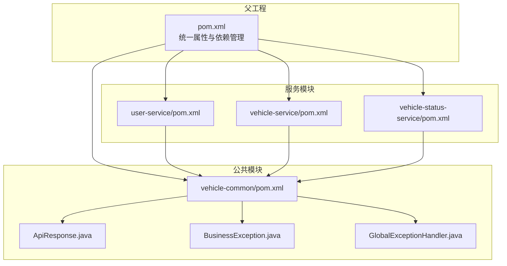
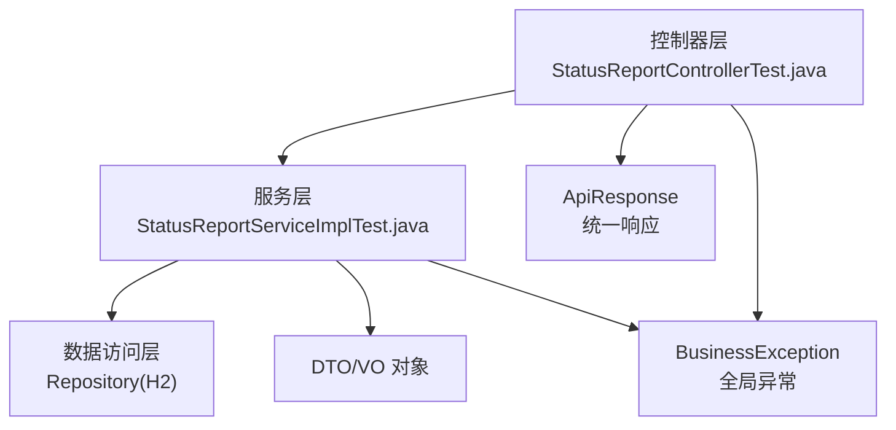
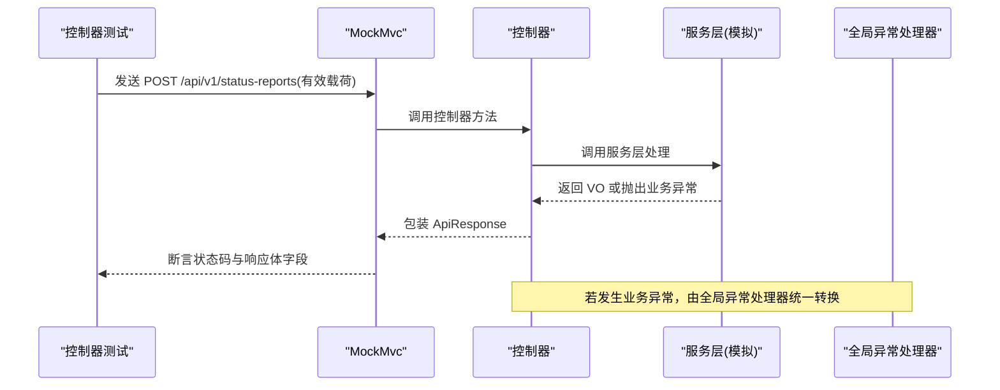
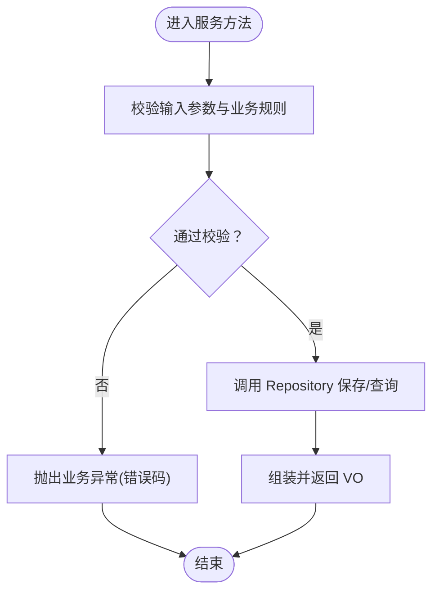
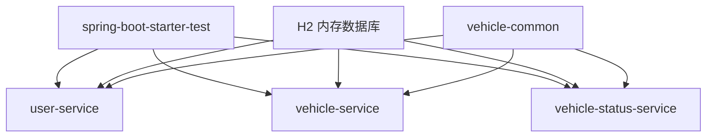

# 测试策略

<cite>
**本文引用的文件**
- [pom.xml](file://pom.xml)
- [vehicle-common/pom.xml](file://vehicle-common/pom.xml)
- [user-service/pom.xml](file://user-service/pom.xml)
- [vehicle-service/pom.xml](file://vehicle-service/pom.xml)
- [vehicle-status-service/pom.xml](file://vehicle-status-service/pom.xml)
- [vehicle-common/src/main/java/com/wenjie/cloud/common/dto/ApiResponse.java](file://vehicle-common/src/main/java/com/wenjie/cloud/common/dto/ApiResponse.java)
- [vehicle-common/src/main/java/com/wenjie/cloud/common/exception/BusinessException.java](file://vehicle-common/src/main/java/com/wenjie/cloud/common/exception/BusinessException.java)
- [vehicle-common/src/main/java/com/wenjie/cloud/common/exception/GlobalExceptionHandler.java](file://vehicle-common/src/main/java/com/wenjie/cloud/common/exception/GlobalExceptionHandler.java)
- [vehicle-status-service/src/test/java/com/wenjie/cloud/vehiclestatus/controller/StatusReportControllerTest.java](file://vehicle-status-service/src/test/java/com/wenjie/cloud/vehiclestatus/controller/StatusReportControllerTest.java)
- [vehicle-status-service/src/test/java/com/wenjie/cloud/vehiclestatus/service/impl/StatusReportServiceImplTest.java](file://vehicle-status-service/src/test/java/com/wenjie/cloud/vehiclestatus/service/impl/StatusReportServiceImplTest.java)
- [vehicle-ui/package.json](file://vehicle-ui/package.json)
- [vehicle-ui/vite.config.js](file://vehicle-ui/vite.config.js)
</cite>

## 目录
1. [引言](#引言)
2. [项目结构](#项目结构)
3. [核心组件](#核心组件)
4. [架构总览](#架构总览)
5. [详细组件分析](#详细组件分析)
6. [依赖分析](#依赖分析)
7. [性能考量](#性能考量)
8. [故障排查指南](#故障排查指南)
9. [结论](#结论)
10. [附录](#附录)

## 引言
本测试策略面向车联网云平台，目标是建立覆盖单元测试、集成测试与端到端测试的完整测试体系，确保控制器层、服务层与数据访问层的质量；同时涵盖前端组件测试、API 测试与用户交互测试的最佳实践。本文结合当前仓库中已有的测试实现，给出可落地的测试设计原则、实施方法与工具选择建议，并补充测试数据管理、测试环境配置、持续集成、覆盖率与性能/安全测试的考虑。

## 项目结构
该多模块 Maven 工程采用父 POM 管理，包含公共模块与三个微服务模块：
- vehicle-common：统一响应体、全局异常处理与校验依赖
- user-service：用户管理服务
- vehicle-service：车辆管理服务
- vehicle-status-service：车辆状态上报与查询服务（包含控制器与服务层的单元测试）

图表来源
- [pom.xml:1-119](file://pom.xml#L1-L119)
- [vehicle-common/pom.xml:1-33](file://vehicle-common/pom.xml#L1-L33)
- [user-service/pom.xml:1-61](file://user-service/pom.xml#L1-L61)
- [vehicle-service/pom.xml:1-61](file://vehicle-service/pom.xml#L1-L61)
- [vehicle-status-service/pom.xml:1-61](file://vehicle-status-service/pom.xml#L1-L61)

章节来源
- [pom.xml:1-119](file://pom.xml#L1-L119)
- [vehicle-common/pom.xml:1-33](file://vehicle-common/pom.xml#L1-L33)
- [user-service/pom.xml:1-61](file://user-service/pom.xml#L1-L61)
- [vehicle-service/pom.xml:1-61](file://vehicle-service/pom.xml#L1-L61)
- [vehicle-status-service/pom.xml:1-61](file://vehicle-status-service/pom.xml#L1-L61)

## 核心组件
- 统一响应体与异常处理
  - ApiResponse：封装统一响应结构，包含状态码、消息、数据与时间戳
  - BusinessException：业务异常载体，携带业务错误码
  - GlobalExceptionHandler：拦截业务异常与参数校验异常，统一返回 ApiResponse
- 测试框架与工具
  - JUnit 5 + Mockito：用于服务层与控制器层单元测试
  - Spring Boot Test Starter：提供测试运行时支持
  - H2 内存数据库：用于服务层与控制器层测试中的数据持久化场景

章节来源
- [vehicle-common/src/main/java/com/wenjie/cloud/common/dto/ApiResponse.java:1-52](file://vehicle-common/src/main/java/com/wenjie/cloud/common/dto/ApiResponse.java#L1-L52)
- [vehicle-common/src/main/java/com/wenjie/cloud/common/exception/BusinessException.java:1-27](file://vehicle-common/src/main/java/com/wenjie/cloud/common/exception/BusinessException.java#L1-L27)
- [vehicle-common/src/main/java/com/wenjie/cloud/common/exception/GlobalExceptionHandler.java:1-56](file://vehicle-common/src/main/java/com/wenjie/cloud/common/exception/GlobalExceptionHandler.java#L1-L56)
- [pom.xml:85-91](file://pom.xml#L85-L91)
- [user-service/pom.xml:43-48](file://user-service/pom.xml#L43-L48)
- [vehicle-service/pom.xml:43-48](file://vehicle-service/pom.xml#L43-L48)
- [vehicle-status-service/pom.xml:43-48](file://vehicle-status-service/pom.xml#L43-L48)

## 架构总览
下图展示控制器层、服务层与数据访问层在测试中的职责划分与交互关系，以及统一响应与异常处理在测试断言中的体现。

图表来源
- [vehicle-status-service/src/test/java/com/wenjie/cloud/vehiclestatus/controller/StatusReportControllerTest.java:1-177](file://vehicle-status-service/src/test/java/com/wenjie/cloud/vehiclestatus/controller/StatusReportControllerTest.java#L1-L177)
- [vehicle-status-service/src/test/java/com/wenjie/cloud/vehiclestatus/service/impl/StatusReportServiceImplTest.java:1-179](file://vehicle-status-service/src/test/java/com/wenjie/cloud/vehiclestatus/service/impl/StatusReportServiceImplTest.java#L1-L179)
- [vehicle-common/src/main/java/com/wenjie/cloud/common/dto/ApiResponse.java:1-52](file://vehicle-common/src/main/java/com/wenjie/cloud/common/dto/ApiResponse.java#L1-L52)
- [vehicle-common/src/main/java/com/wenjie/cloud/common/exception/BusinessException.java:1-27](file://vehicle-common/src/main/java/com/wenjie/cloud/common/exception/BusinessException.java#L1-L27)
- [vehicle-common/src/main/java/com/wenjie/cloud/common/exception/GlobalExceptionHandler.java:1-56](file://vehicle-common/src/main/java/com/wenjie/cloud/common/exception/GlobalExceptionHandler.java#L1-L56)

## 详细组件分析

### 控制器层测试（Web MVC）
- 测试范围
  - 验证控制器对请求参数校验、业务异常与正常响应的处理
  - 使用 WebMvcTest 仅加载控制器层，结合 MockBean 注入服务层依赖
- 关键断言点
  - HTTP 状态码（如 200、400、500）
  - 统一响应体字段（code/message/data/timestamp）
  - 分页查询结果的数据内容与长度
- 示例场景
  - 正常上报：校验响应 code 为成功值且 data 字段存在
  - 参数非法：VIN 长度不合法或电量越界，期望 400
  - 历史查询：传入 vin、起止时间与分页参数，断言分页内容
  - 最新记录查询：断言返回最新记录的字段一致性

图表来源
- [vehicle-status-service/src/test/java/com/wenjie/cloud/vehiclestatus/controller/StatusReportControllerTest.java:46-70](file://vehicle-status-service/src/test/java/com/wenjie/cloud/vehiclestatus/controller/StatusReportControllerTest.java#L46-L70)
- [vehicle-common/src/main/java/com/wenjie/cloud/common/exception/GlobalExceptionHandler.java:26-31](file://vehicle-common/src/main/java/com/wenjie/cloud/common/exception/GlobalExceptionHandler.java#L26-L31)
- [vehicle-common/src/main/java/com/wenjie/cloud/common/dto/ApiResponse.java:41-43](file://vehicle-common/src/main/java/com/wenjie/cloud/common/dto/ApiResponse.java#L41-L43)

章节来源
- [vehicle-status-service/src/test/java/com/wenjie/cloud/vehiclestatus/controller/StatusReportControllerTest.java:1-177](file://vehicle-status-service/src/test/java/com/wenjie/cloud/vehiclestatus/controller/StatusReportControllerTest.java#L1-L177)

### 服务层测试（业务逻辑）
- 测试范围
  - 验证业务规则与边界条件（如未来上报时间、起止时间顺序、空数据场景）
  - 使用 Mockito 注入 Repository，验证调用与返回值
- 关键断言点
  - 返回 VO 的字段一致性
  - 抛出的业务异常错误码
  - Repository 方法是否被正确调用
- 示例场景
  - 正常上报：保存实体并返回 VO
  - 上报时间在未来：抛出业务异常并校验错误码
  - 历史查询：按 vin 与时间区间分页查询，断言总数与内容
  - 最新记录：按 VIN 查询最新记录或抛出“无数据”异常

图表来源
- [vehicle-status-service/src/test/java/com/wenjie/cloud/vehiclestatus/service/impl/StatusReportServiceImplTest.java:46-61](file://vehicle-status-service/src/test/java/com/wenjie/cloud/vehiclestatus/service/impl/StatusReportServiceImplTest.java#L46-L61)
- [vehicle-status-service/src/test/java/com/wenjie/cloud/vehiclestatus/service/impl/StatusReportServiceImplTest.java:63-71](file://vehicle-status-service/src/test/java/com/wenjie/cloud/vehiclestatus/service/impl/StatusReportServiceImplTest.java#L63-L71)
- [vehicle-status-service/src/test/java/com/wenjie/cloud/vehiclestatus/service/impl/StatusReportServiceImplTest.java:74-91](file://vehicle-status-service/src/test/java/com/wenjie/cloud/vehiclestatus/service/impl/StatusReportServiceImplTest.java#L74-L91)
- [vehicle-common/src/main/java/com/wenjie/cloud/common/exception/BusinessException.java:14-25](file://vehicle-common/src/main/java/com/wenjie/cloud/common/exception/BusinessException.java#L14-L25)

章节来源
- [vehicle-status-service/src/test/java/com/wenjie/cloud/vehiclestatus/service/impl/StatusReportServiceImplTest.java:1-179](file://vehicle-status-service/src/test/java/com/wenjie/cloud/vehiclestatus/service/impl/StatusReportServiceImplTest.java#L1-L179)

### 数据访问层测试（Repository/H2）
- 测试范围
  - 使用 H2 内存数据库进行真实 SQL 场景验证（如 findByVinAndReportTimeBetween、findFirstByVinOrderByReportTimeDesc、findLatestForAllVehicles）
- 建议做法
  - 在每个测试方法中使用独立事务或清理数据，避免跨用例污染
  - 使用 @DataJpaTest 或 @AutoConfigureTestDatabase 排除掉真实数据源，确保测试隔离性
- 注意事项
  - 当前服务模块的测试主要集中在服务层与控制器层，数据访问层测试可作为扩展补充

章节来源
- [user-service/pom.xml:43-48](file://user-service/pom.xml#L43-L48)
- [vehicle-service/pom.xml:43-48](file://vehicle-service/pom.xml#L43-L48)
- [vehicle-status-service/pom.xml:43-48](file://vehicle-status-service/pom.xml#L43-L48)

### 集成测试策略
- 服务间通信测试
  - 使用 WireMock 或基于内存网关的方式模拟下游服务，验证请求格式与响应解析
  - 关注统一响应体与异常转换在集成路径上的表现
- 数据库集成测试
  - 使用 Testcontainers 启动真实数据库容器，执行真实 SQL 与索引场景
  - 配置 flyway 或 Liquibase 进行迁移脚本的自动应用
- 端到端测试
  - 使用 Playwright/Cypress 进行浏览器级 E2E，覆盖登录、列表查看、新增编辑等主流程
  - 结合后端服务的健康检查与延迟重试，提升稳定性

### 前端测试配置与最佳实践
- 组件测试
  - 使用 React Testing Library 进行组件渲染与交互测试，关注可访问性与语义标签
- API 测试
  - 使用 axios 模拟接口调用，结合 Mock Service Worker 或 Jest 模拟网络请求
- 用户交互测试
  - 使用 Playwright/Cypress 编写端到端脚本，覆盖关键用户旅程
- 开发与代理
  - Vite 开发服务器已配置代理，将 /api/v1/* 请求转发至对应后端端口，便于本地联调

章节来源
- [vehicle-ui/package.json:1-32](file://vehicle-ui/package.json#L1-L32)
- [vehicle-ui/vite.config.js:1-25](file://vehicle-ui/vite.config.js#L1-L25)

## 依赖分析
- 测试依赖
  - spring-boot-starter-test：提供 JUnit 5、Mockito、AssertJ、JsonPath 等测试能力
  - H2 内存数据库：用于服务层与控制器层测试中的数据持久化场景
- 模块间耦合
  - 各服务模块均依赖 vehicle-common，统一响应与异常处理在测试中保持一致行为

图表来源
- [pom.xml:85-91](file://pom.xml#L85-L91)
- [user-service/pom.xml:43-48](file://user-service/pom.xml#L43-L48)
- [vehicle-service/pom.xml:43-48](file://vehicle-service/pom.xml#L43-L48)
- [vehicle-status-service/pom.xml:43-48](file://vehicle-status-service/pom.xml#L43-L48)

章节来源
- [pom.xml:85-91](file://pom.xml#L85-L91)
- [vehicle-common/pom.xml:18-30](file://vehicle-common/pom.xml#L18-L30)

## 性能考量
- 单元测试
  - 使用 @MockBean 与内存数据库，避免外部依赖带来的性能瓶颈
- 集成测试
  - 使用 Testcontainers 启动最小化数据库容器，减少冷启动开销
- 前端测试
  - 使用无头浏览器与并行执行策略，缩短 E2E 时间
- 监控与基准
  - 在 CI 中引入性能回归阈值，对关键接口设置响应时间与吞吐量基线

## 故障排查指南
- 统一响应与异常
  - 若控制器返回非 200，检查 GlobalExceptionHandler 是否正确捕获 BusinessException 并转换为 ApiResponse
  - 校验参数校验异常时，确认 MethodArgumentNotValidException 的字段拼接逻辑
- 控制器测试
  - 若断言失败，优先核对 MockMvc 的请求路径、Content-Type 与 JSON 序列化
- 服务层测试
  - 若业务异常未触发，检查服务层是否抛出指定错误码的 BusinessException
- 前端代理
  - 若接口 404 或跨域问题，检查 vite.config.js 中的代理配置与后端服务端口

章节来源
- [vehicle-common/src/main/java/com/wenjie/cloud/common/exception/GlobalExceptionHandler.java:26-54](file://vehicle-common/src/main/java/com/wenjie/cloud/common/exception/GlobalExceptionHandler.java#L26-L54)
- [vehicle-status-service/src/test/java/com/wenjie/cloud/vehiclestatus/controller/StatusReportControllerTest.java:62-70](file://vehicle-status-service/src/test/java/com/wenjie/cloud/vehiclestatus/controller/StatusReportControllerTest.java#L62-L70)
- [vehicle-status-service/src/test/java/com/wenjie/cloud/vehiclestatus/service/impl/StatusReportServiceImplTest.java:69,101,129:69-69](file://vehicle-status-service/src/test/java/com/wenjie/cloud/vehiclestatus/service/impl/StatusReportServiceImplTest.java#L69-L69)
- [vehicle-ui/vite.config.js:7-24](file://vehicle-ui/vite.config.js#L7-L24)

## 结论
本测试策略以现有控制器与服务层单元测试为基础，明确了各层测试职责与断言要点，并给出了集成测试与前端测试的实施建议。通过统一响应与异常处理的测试覆盖，能够有效保障接口一致性与错误处理的可靠性。建议在后续迭代中逐步完善数据访问层测试与端到端测试，构建更完整的质量保障体系。

## 附录
- 测试覆盖率要求
  - 行覆盖率：关键路径不低于 80%，分支覆盖率不低于 70%
  - 单元测试：每条业务分支至少一条用例
- 性能测试
  - 关键接口设置 P95/P99 响应时间阈值，CPU/内存占用上限
- 安全测试
  - 输入参数白名单校验、SQL 注入与 XSS 防护验证
- 测试工具与自动化
  - 单元测试：JUnit 5 + Mockito（已内置）
  - 集成测试：Testcontainers + Flyway/Liquibase
  - 前端测试：React Testing Library + Playwright/Cypress
  - 持续集成：在 CI 中执行 mvn test 与覆盖率收集，失败即阻断发布
- 测试报告生成
  - 使用 Jacoco 生成覆盖率报告，结合 SonarQube 进行静态分析与趋势跟踪