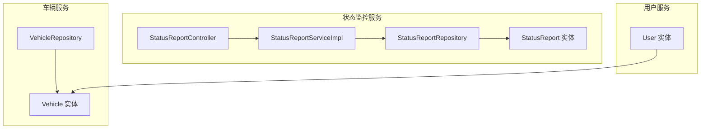
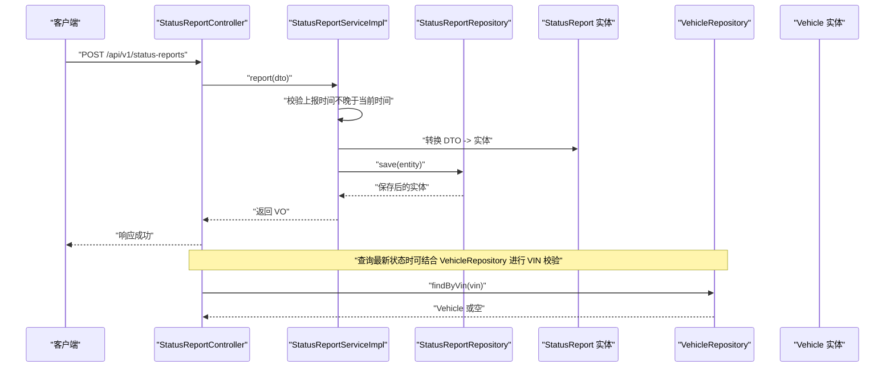
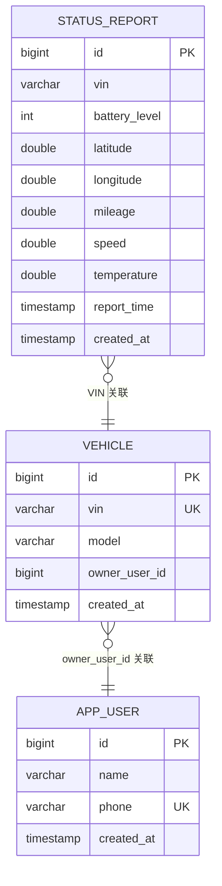
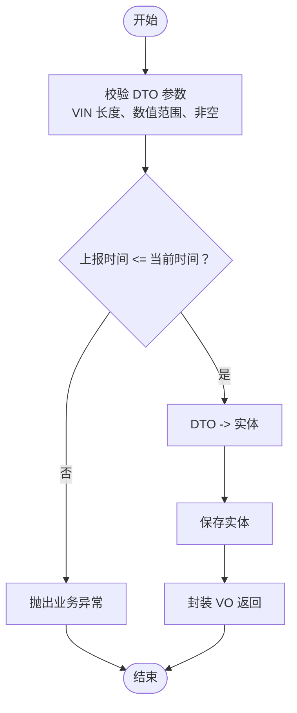
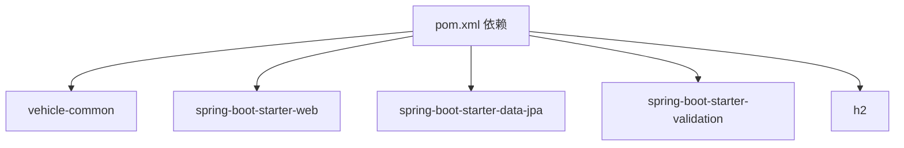

# 实体模型设计

<cite>
**本文引用的文件**
- [StatusReport.java](file://vehicle-status-service/src/main/java/com/wenjie/cloud/vehiclestatus/entity/StatusReport.java)
- [StatusReportRepository.java](file://vehicle-status-service/src/main/java/com/wenjie/cloud/vehiclestatus/repository/StatusReportRepository.java)
- [StatusReportDTO.java](file://vehicle-status-service/src/main/java/com/wenjie/cloud/vehiclestatus/dto/StatusReportDTO.java)
- [StatusReportVO.java](file://vehicle-status-service/src/main/java/com/wenjie/cloud/vehiclestatus/dto/StatusReportVO.java)
- [StatusReportServiceImpl.java](file://vehicle-status-service/src/main/java/com/wenjie/cloud/vehiclestatus/service/impl/StatusReportServiceImpl.java)
- [StatusReportController.java](file://vehicle-status-service/src/main/java/com/wenjie/cloud/vehiclestatus/controller/StatusReportController.java)
- [application.yml](file://vehicle-status-service/src/main/resources/application.yml)
- [Vehicle.java](file://vehicle-service/src/main/java/com/wenjie/cloud/vehicle/entity/Vehicle.java)
- [VehicleRepository.java](file://vehicle-service/src/main/java/com/wenjie/cloud/vehicle/repository/VehicleRepository.java)
- [data.sql](file://vehicle-service/src/main/resources/data.sql)
- [User.java](file://user-service/src/main/java/com/wenjie/cloud/user/entity/User.java)
- [pom.xml](file://vehicle-status-service/pom.xml)
</cite>

## 目录
1. [简介](#简介)
2. [项目结构](#项目结构)
3. [核心组件](#核心组件)
4. [架构总览](#架构总览)
5. [详细组件分析](#详细组件分析)
6. [依赖关系分析](#依赖关系分析)
7. [性能考量](#性能考量)
8. [故障排查指南](#故障排查指南)
9. [结论](#结论)

## 简介
本文件聚焦于状态监控服务中的实体模型设计，系统性阐述 StatusReport 实体的字段定义、JPA 注解使用、时间戳管理策略、数据库索引设计、实体间关系映射以及生命周期与数据完整性保障机制。同时结合控制器、服务层与仓库层的实现，给出端到端的数据流与错误处理流程，帮助读者快速理解并正确使用该实体模型。

## 项目结构
本项目采用多模块微服务架构，状态监控服务位于 vehicle-status-service 模块中，负责接收、存储与查询车辆状态上报数据；车辆服务与用户服务分别维护车辆与用户实体，用于业务上下文关联与数据初始化。

图表来源
- [StatusReport.java:1-71](file://vehicle-status-service/src/main/java/com/wenjie/cloud/vehiclestatus/entity/StatusReport.java#L1-L71)
- [StatusReportRepository.java:1-39](file://vehicle-status-service/src/main/java/com/wenjie/cloud/vehiclestatus/repository/StatusReportRepository.java#L1-L39)
- [StatusReportServiceImpl.java:1-104](file://vehicle-status-service/src/main/java/com/wenjie/cloud/vehiclestatus/service/impl/StatusReportServiceImpl.java#L1-L104)
- [StatusReportController.java:1-71](file://vehicle-status-service/src/main/java/com/wenjie/cloud/vehiclestatus/controller/StatusReportController.java#L1-L71)
- [Vehicle.java:1-41](file://vehicle-service/src/main/java/com/wenjie/cloud/vehicle/entity/Vehicle.java#L1-L41)
- [VehicleRepository.java:1-22](file://vehicle-service/src/main/java/com/wenjie/cloud/vehicle/repository/VehicleRepository.java#L1-L22)
- [User.java:1-38](file://user-service/src/main/java/com/wenjie/cloud/user/entity/User.java#L1-L38)

章节来源
- [application.yml:1-30](file://vehicle-status-service/src/main/resources/application.yml#L1-L30)
- [pom.xml:1-61](file://vehicle-status-service/pom.xml#L1-L61)

## 核心组件
- StatusReport 实体：承载车辆状态上报的核心字段，包含 VIN、电量、位置、里程、速度、温度、上报时间与创建时间等。
- StatusReportRepository：基于 Spring Data JPA 的仓库接口，提供按 VIN 与时间范围分页查询、查询最新记录、查询所有车辆最新记录等方法。
- StatusReportServiceImpl：服务层实现，负责参数校验、业务规则检查、实体转换与异常处理。
- StatusReportController：REST 控制器，暴露上报、历史查询、最新状态查询等接口。
- DTO/VO：StatusReportDTO 用于入参校验，StatusReportVO 用于出参封装。
- 配置与依赖：Spring Boot、Spring Data JPA、H2 内存数据库、Jackson 时间序列配置。

章节来源
- [StatusReport.java:1-71](file://vehicle-status-service/src/main/java/com/wenjie/cloud/vehiclestatus/entity/StatusReport.java#L1-L71)
- [StatusReportRepository.java:1-39](file://vehicle-status-service/src/main/java/com/wenjie/cloud/vehiclestatus/repository/StatusReportRepository.java#L1-L39)
- [StatusReportServiceImpl.java:1-104](file://vehicle-status-service/src/main/java/com/wenjie/cloud/vehiclestatus/service/impl/StatusReportServiceImpl.java#L1-L104)
- [StatusReportController.java:1-71](file://vehicle-status-service/src/main/java/com/wenjie/cloud/vehiclestatus/controller/StatusReportController.java#L1-L71)
- [StatusReportDTO.java:1-61](file://vehicle-status-service/src/main/java/com/wenjie/cloud/vehiclestatus/dto/StatusReportDTO.java#L1-L61)
- [StatusReportVO.java:1-42](file://vehicle-status-service/src/main/java/com/wenjie/cloud/vehiclestatus/dto/StatusReportVO.java#L1-L42)
- [application.yml:1-30](file://vehicle-status-service/src/main/resources/application.yml#L1-L30)
- [pom.xml:1-61](file://vehicle-status-service/pom.xml#L1-L61)

## 架构总览
下图展示了从控制器到服务、仓库再到实体的调用链路，以及与车辆服务的潜在关联关系。

图表来源
- [StatusReportController.java:1-71](file://vehicle-status-service/src/main/java/com/wenjie/cloud/vehiclestatus/controller/StatusReportController.java#L1-L71)
- [StatusReportServiceImpl.java:1-104](file://vehicle-status-service/src/main/java/com/wenjie/cloud/vehiclestatus/service/impl/StatusReportServiceImpl.java#L1-L104)
- [StatusReportRepository.java:1-39](file://vehicle-status-service/src/main/java/com/wenjie/cloud/vehiclestatus/repository/StatusReportRepository.java#L1-L39)
- [StatusReport.java:1-71](file://vehicle-status-service/src/main/java/com/wenjie/cloud/vehiclestatus/entity/StatusReport.java#L1-L71)
- [VehicleRepository.java:1-22](file://vehicle-service/src/main/java/com/wenjie/cloud/vehicle/repository/VehicleRepository.java#L1-L22)
- [Vehicle.java:1-41](file://vehicle-service/src/main/java/com/wenjie/cloud/vehicle/entity/Vehicle.java#L1-L41)

## 详细组件分析

### StatusReport 实体设计与 JPA 注解
- 表映射与索引
  - 使用表名映射与复合索引，提升按 VIN 与上报时间的查询效率。
  - 复合索引列组合为 VIN 与上报时间，满足高频的按车维度与时间范围查询场景。
- 主键与生成策略
  - 主键自增，适合写入密集型场景。
- 字段定义与约束
  - VIN：长度 17，非空，作为业务主键标识车辆。
  - 电池电量：整数类型，范围 0~100，非空。
  - 位置信息：纬度与经度，双精度浮点，非空，分别限定在地理坐标有效范围。
  - 总里程：双精度浮点，非负数，非空。
  - 车速：双精度浮点，非负数，非空。
  - 温度：双精度浮点，非空。
  - 上报时间：时间戳，非空。
  - 创建时间：时间戳，非空且不可更新，通过持久化前回调设置。
- 生命周期回调
  - 在持久化前设置创建时间为当前时间，确保记录创建时间的准确性与一致性。

章节来源
- [StatusReport.java:1-71](file://vehicle-status-service/src/main/java/com/wenjie/cloud/vehiclestatus/entity/StatusReport.java#L1-L71)

### 字段类型与约束详解
- 数据类型选择
  - 整数型用于计数类指标（电池电量），双精度型用于连续型物理量（经纬度、里程、速度、温度）。
- 约束策略
  - 非空约束保证必填字段的完整性。
  - 数值范围约束通过 DTO 层注解实现，确保输入合法性。
  - VIN 长度约束确保唯一性与标准性。
- 地理坐标约束
  - 纬度范围限制在 [-90, 90]，经度范围限制在 [-180, 180]，符合地理学规范。

章节来源
- [StatusReportDTO.java:1-61](file://vehicle-status-service/src/main/java/com/wenjie/cloud/vehiclestatus/dto/StatusReportDTO.java#L1-L61)
- [StatusReport.java:1-71](file://vehicle-status-service/src/main/java/com/wenjie/cloud/vehiclestatus/entity/StatusReport.java#L1-L71)

### 时间戳字段设计与管理策略
- 上报时间
  - 由上报方传入，服务层进行“不得晚于当前时间”的校验，防止未来时间戳导致查询逻辑异常。
- 创建时间
  - 通过持久化前回调自动填充，保证入库时的精确时间，且不可被后续更新覆盖。
- 更新时间
  - 当前实体未显式声明更新时间字段，若需要可扩展添加。

章节来源
- [StatusReportServiceImpl.java:1-104](file://vehicle-status-service/src/main/java/com/wenjie/cloud/vehiclestatus/service/impl/StatusReportServiceImpl.java#L1-L104)
- [StatusReport.java:1-71](file://vehicle-status-service/src/main/java/com/wenjie/cloud/vehiclestatus/entity/StatusReport.java#L1-L71)

### 实体关系映射与业务关联
- 与车辆实体的关系
  - StatusReport 中的 VIN 与 Vehicle 实体的 VIN 对应，二者均为 17 位标准编码。
  - Vehicle 实体的 owner_user_id 字段指向用户实体的主键，形成“车辆-用户”关联。
  - 在查询最新状态时，可结合 VehicleRepository 的 findByVin 方法进行 VIN 存在性与格式校验。
- 与用户实体的关系
  - 通过 Vehicle.owner_user_id 间接关联用户，便于在上层业务中进行用户维度聚合与权限控制。
- 关系图示

图表来源
- [StatusReport.java:1-71](file://vehicle-status-service/src/main/java/com/wenjie/cloud/vehiclestatus/entity/StatusReport.java#L1-L71)
- [Vehicle.java:1-41](file://vehicle-service/src/main/java/com/wenjie/cloud/vehicle/entity/Vehicle.java#L1-L41)
- [User.java:1-38](file://user-service/src/main/java/com/wenjie/cloud/user/entity/User.java#L1-L38)

章节来源
- [Vehicle.java:1-41](file://vehicle-service/src/main/java/com/wenjie/cloud/vehicle/entity/Vehicle.java#L1-L41)
- [VehicleRepository.java:1-22](file://vehicle-service/src/main/java/com/wenjie/cloud/vehicle/repository/VehicleRepository.java#L1-L22)
- [User.java:1-38](file://user-service/src/main/java/com/wenjie/cloud/user/entity/User.java#L1-L38)

### 数据库索引设计与性能优化
- 复合索引
  - 索引名称与列组合：vin, report_time，用于按车维度与时间范围的高效查询。
- 查询优化策略
  - 按 VIN 与时间范围分页查询：利用复合索引避免全表扫描。
  - 查询单车最新记录：通过 ORDER BY report_time DESC 并限制结果集，配合索引提升排序效率。
  - 查询所有车辆各自最新记录：通过子查询聚合，结合索引减少回表成本。
- 索引命中建议
  - 查询条件尽量包含 VIN 与 report_time，以充分利用复合索引。
  - 若业务扩展新增更多筛选维度，可考虑增加相应索引或调整复合索引顺序。

章节来源
- [StatusReport.java:1-71](file://vehicle-status-service/src/main/java/com/wenjie/cloud/vehiclestatus/entity/StatusReport.java#L1-L71)
- [StatusReportRepository.java:1-39](file://vehicle-status-service/src/main/java/com/wenjie/cloud/vehiclestatus/repository/StatusReportRepository.java#L1-L39)

### 实体生命周期管理与数据完整性
- 生命周期管理
  - 创建时间在持久化前自动注入，确保每条记录的创建时间准确。
  - 上报时间在服务层进行严格校验，避免未来时间戳影响历史查询与统计。
- 数据完整性保障
  - DTO 层注解约束输入合法性，减少脏数据进入数据库。
  - 实体层非空与数值范围约束，进一步保证数据库层面的完整性。
  - VIN 作为业务主键，结合 Vehicle 实体的唯一性约束，确保跨服务一致性。
- 异常处理
  - 上报时间晚于当前时间：抛出自定义业务异常。
  - 查询起始时间晚于结束时间：抛出自定义业务异常。
  - VIN 格式不正确：抛出自定义业务异常。
  - 无状态数据：抛出自定义业务异常。

章节来源
- [StatusReportServiceImpl.java:1-104](file://vehicle-status-service/src/main/java/com/wenjie/cloud/vehiclestatus/service/impl/StatusReportServiceImpl.java#L1-L104)
- [StatusReportDTO.java:1-61](file://vehicle-status-service/src/main/java/com/wenjie/cloud/vehiclestatus/dto/StatusReportDTO.java#L1-L61)
- [StatusReport.java:1-71](file://vehicle-status-service/src/main/java/com/wenjie/cloud/vehiclestatus/entity/StatusReport.java#L1-L71)

### 数据流与业务流程
- 上报流程
  - 客户端提交状态上报请求，控制器接收并校验 DTO。
  - 服务层校验上报时间，转换为实体并保存至数据库。
  - 返回封装后的 VO。
- 历史查询流程
  - 控制器接收 VIN、起止时间与分页参数，服务层校验时间范围，仓库层按 VIN 与时间范围分页查询。
- 最新状态查询流程
  - 单车最新：按 VIN 排序取第一条。
  - 全量最新：通过子查询聚合各 VIN 的最大上报时间，再匹配对应记录。

图表来源
- [StatusReportController.java:1-71](file://vehicle-status-service/src/main/java/com/wenjie/cloud/vehiclestatus/controller/StatusReportController.java#L1-L71)
- [StatusReportServiceImpl.java:1-104](file://vehicle-status-service/src/main/java/com/wenjie/cloud/vehiclestatus/service/impl/StatusReportServiceImpl.java#L1-L104)
- [StatusReportDTO.java:1-61](file://vehicle-status-service/src/main/java/com/wenjie/cloud/vehiclestatus/dto/StatusReportDTO.java#L1-L61)

## 依赖关系分析
- 技术栈依赖
  - Spring Boot Web：提供 REST 接口能力。
  - Spring Data JPA：提供 ORM 与仓库接口能力。
  - 参数校验：提供 DTO 层参数校验。
  - H2 内存数据库：开发测试环境默认配置。
- 模块间依赖
  - vehicle-status-service 依赖 vehicle-common 提供通用异常与响应封装。
  - 与 vehicle-service、user-service 的关系体现在业务语义层面（VIN 关联、用户归属），实际运行时通过各自的实体与仓库进行协作。

图表来源
- [pom.xml:1-61](file://vehicle-status-service/pom.xml#L1-L61)

章节来源
- [pom.xml:1-61](file://vehicle-status-service/pom.xml#L1-L61)
- [application.yml:1-30](file://vehicle-status-service/src/main/resources/application.yml#L1-L30)

## 性能考量
- 索引设计
  - 复合索引 vin + report_time 已覆盖高频查询模式，建议在高并发场景下评估是否需要增加更多维度的索引或分区策略。
- 查询优化
  - 分页查询时优先使用复合索引列，避免额外排序开销。
  - 子查询聚合最新记录时，确保 report_time 列建立索引以提升子查询效率。
- 数据库配置
  - 开发环境使用内存数据库，生产环境需替换为稳定的关系型数据库，并开启合适的连接池与慢查询日志。
- 序列化与时区
  - Jackson 配置为时间戳序列化，避免时区差异带来的解析问题。

章节来源
- [StatusReportRepository.java:1-39](file://vehicle-status-service/src/main/java/com/wenjie/cloud/vehiclestatus/repository/StatusReportRepository.java#L1-L39)
- [application.yml:1-30](file://vehicle-status-service/src/main/resources/application.yml#L1-L30)

## 故障排查指南
- 常见异常与定位
  - 上报时间晚于当前时间：检查客户端时间与服务器时间同步，确认时区设置。
  - 查询起始时间晚于结束时间：检查前端传参顺序，确保 startTime <= endTime。
  - VIN 格式不正确：确认 VIN 为 17 位字符，符合业务规范。
  - 无状态数据：确认 VIN 是否正确、是否存在历史数据。
- 日志与监控
  - 服务层记录成功上报的日志，便于审计与排障。
  - 结合数据库控制台查看 SQL 执行计划，验证索引使用情况。
- 数据初始化
  - 可参考车辆服务的数据脚本初始化 VIN 与用户关系，确保业务关联数据完整。

章节来源
- [StatusReportServiceImpl.java:1-104](file://vehicle-status-service/src/main/java/com/wenjie/cloud/vehiclestatus/service/impl/StatusReportServiceImpl.java#L1-L104)
- [data.sql:1-32](file://vehicle-service/src/main/resources/data.sql#L1-L32)

## 结论
StatusReport 实体模型围绕车辆状态上报场景进行了合理的字段设计与约束定义，结合 JPA 注解与 Spring Data JPA 仓库接口，实现了高效的按车维度与时间范围查询。通过 DTO 层参数校验与服务层业务规则，确保了数据的完整性与一致性。配合复合索引与查询优化策略，能够在高并发场景下保持良好的性能表现。未来可根据业务扩展需求，进一步完善索引策略、引入更新时间字段与更细粒度的权限控制。