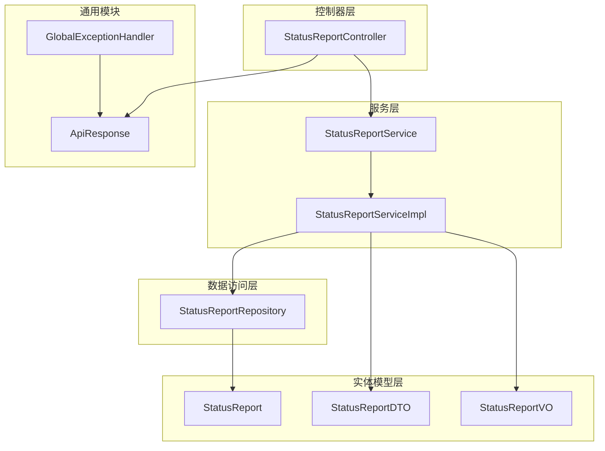
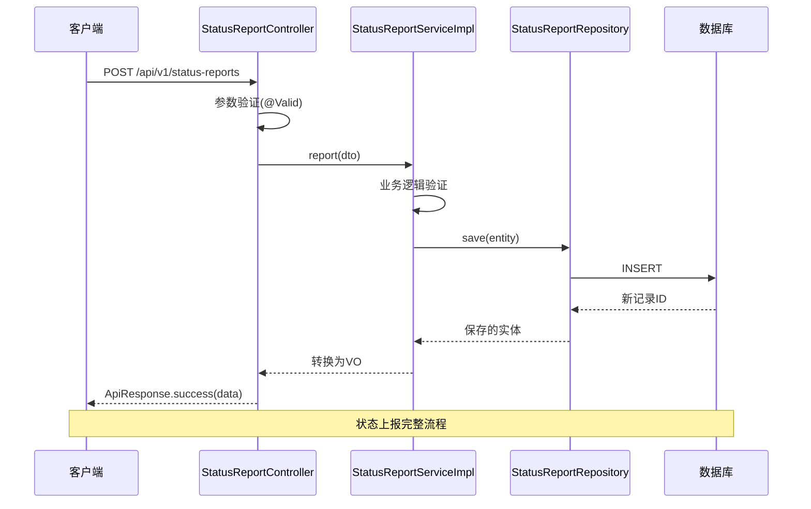
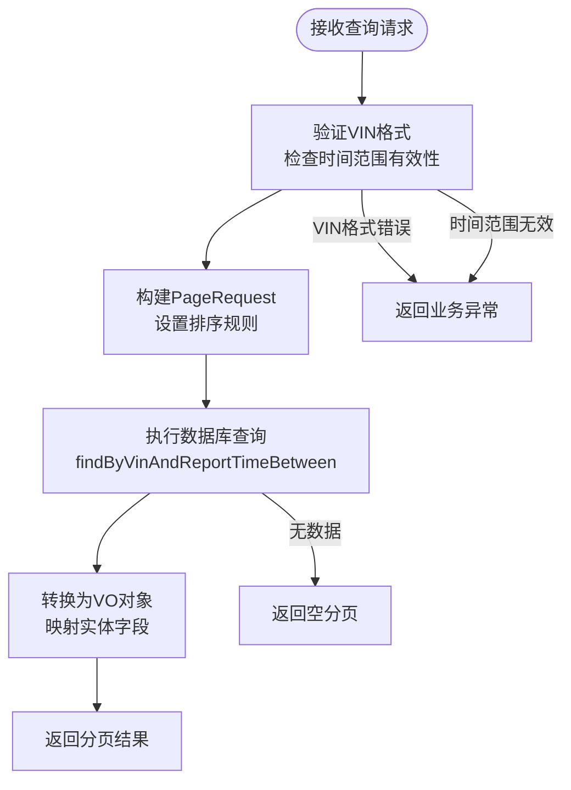
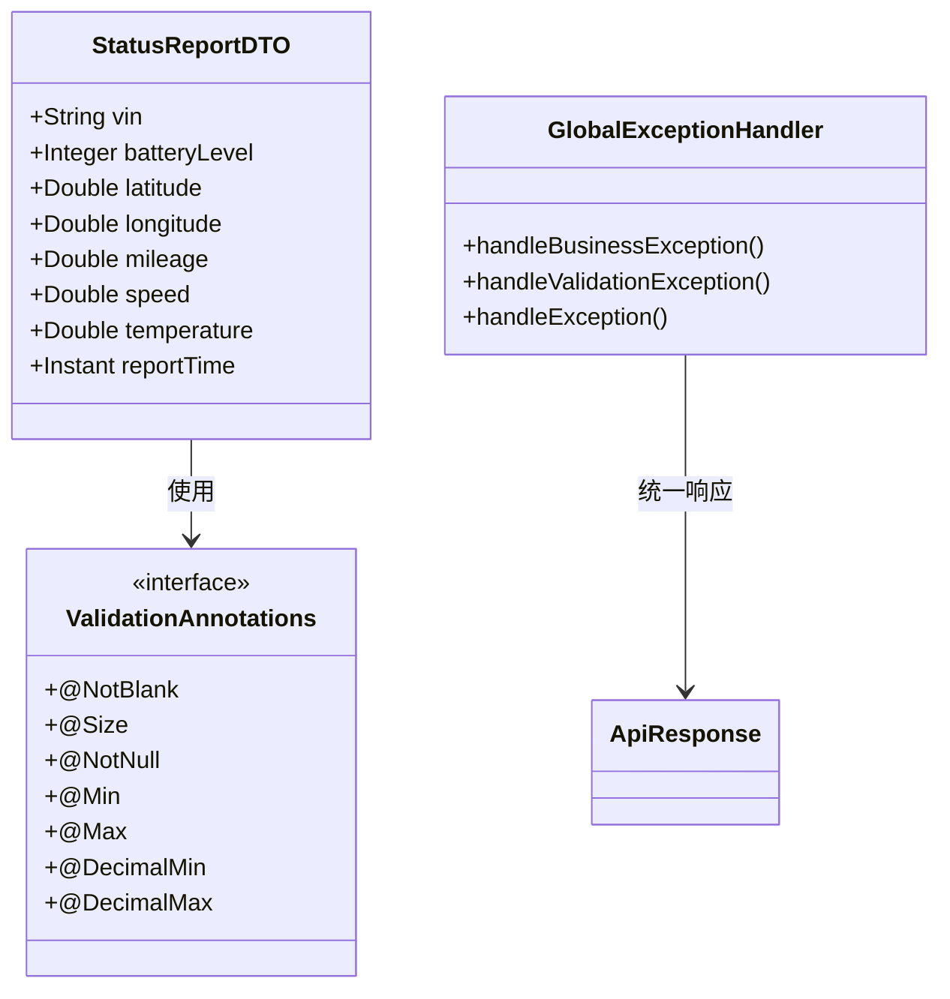
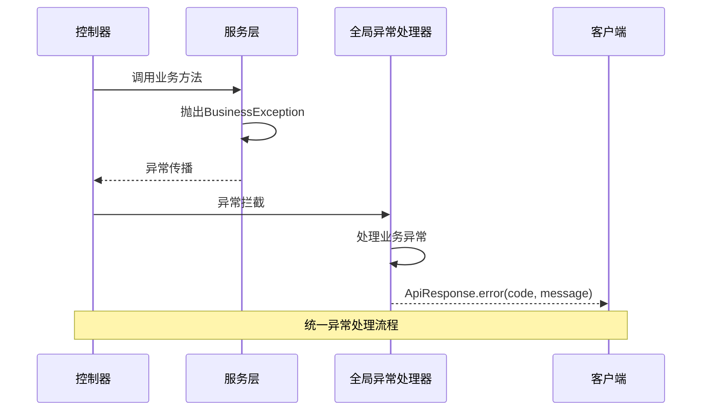
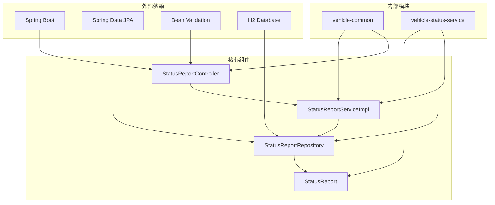

# 控制器层设计

<cite>
**本文档引用的文件**
- [StatusReportController.java](file://vehicle-status-service/src/main/java/com/wenjie/cloud/vehiclestatus/controller/StatusReportController.java)
- [StatusReportDTO.java](file://vehicle-status-service/src/main/java/com/wenjie/cloud/vehiclestatus/dto/StatusReportDTO.java)
- [StatusReportVO.java](file://vehicle-status-service/src/main/java/com/wenjie/cloud/vehiclestatus/dto/StatusReportVO.java)
- [StatusReport.java](file://vehicle-status-service/src/main/java/com/wenjie/cloud/vehiclestatus/entity/StatusReport.java)
- [StatusReportService.java](file://vehicle-status-service/src/main/java/com/wenjie/cloud/vehiclestatus/service/StatusReportService.java)
- [StatusReportServiceImpl.java](file://vehicle-status-service/src/main/java/com/wenjie/cloud/vehiclestatus/service/impl/StatusReportServiceImpl.java)
- [StatusReportRepository.java](file://vehicle-status-service/src/main/java/com/wenjie/cloud/vehiclestatus/repository/StatusReportRepository.java)
- [ApiResponse.java](file://vehicle-common/src/main/java/com/wenjie/cloud/common/dto/ApiResponse.java)
- [GlobalExceptionHandler.java](file://vehicle-common/src/main/java/com/wenjie/cloud/common/exception/GlobalExceptionHandler.java)
- [application.yml](file://vehicle-status-service/src/main/resources/application.yml)
- [pom.xml](file://vehicle-status-service/pom.xml)
- [StatusReportControllerTest.java](file://vehicle-status-service/src/test/java/com/wenjie/cloud/vehiclestatus/controller/StatusReportControllerTest.java)
</cite>

## 目录
1. [简介](#简介)
2. [项目结构](#项目结构)
3. [核心组件](#核心组件)
4. [架构概览](#架构概览)
5. [详细组件分析](#详细组件分析)
6. [依赖关系分析](#依赖关系分析)
7. [性能考虑](#性能考虑)
8. [故障排除指南](#故障排除指南)
9. [结论](#结论)

## 简介

本文档深入分析车辆状态监控服务的控制器层设计，重点介绍StatusReportController的设计架构和REST API接口实现。该控制器提供了完整的车辆状态管理功能，包括状态上报、历史查询和最新状态查询等核心接口。系统采用分层架构设计，通过统一的响应包装和异常处理机制，确保了API的一致性和可靠性。

## 项目结构

车辆状态服务采用标准的Spring Boot分层架构，主要包含以下层次：



**图表来源**
- [StatusReportController.java:26-28](file://vehicle-status-service/src/main/java/com/wenjie/cloud/vehiclestatus/controller/StatusReportController.java#L26-L28)
- [StatusReportService.java:14-35](file://vehicle-status-service/src/main/java/com/wenjie/cloud/vehiclestatus/service/StatusReportService.java#L14-L35)
- [StatusReportServiceImpl.java:26-26](file://vehicle-status-service/src/main/java/com/wenjie/cloud/vehiclestatus/service/impl/StatusReportServiceImpl.java#L26-L26)

**章节来源**
- [StatusReportController.java:1-71](file://vehicle-status-service/src/main/java/com/wenjie/cloud/vehiclestatus/controller/StatusReportController.java#L1-L71)
- [StatusReportService.java:1-36](file://vehicle-status-service/src/main/java/com/wenjie/cloud/vehiclestatus/service/StatusReportService.java#L1-L36)
- [StatusReportServiceImpl.java:1-104](file://vehicle-status-service/src/main/java/com/wenjie/cloud/vehiclestatus/service/impl/StatusReportServiceImpl.java#L1-L104)

## 核心组件

### StatusReportController 控制器

StatusReportController是车辆状态监控服务的核心入口点，负责处理所有与状态报告相关的HTTP请求。该控制器采用@RestController注解，自动将返回值包装为JSON响应。

**主要特性：**
- 使用@RequestMapping("/api/v1/status-reports")定义统一的API前缀
- 采用Lombok的@RequiredArgsConstructor简化依赖注入
- 集成Spring Data的分页查询机制
- 实现统一的异常处理和响应包装

**章节来源**
- [StatusReportController.java:26-28](file://vehicle-status-service/src/main/java/com/wenjie/cloud/vehiclestatus/controller/StatusReportController.java#L26-L28)
- [StatusReportController.java:31-31](file://vehicle-status-service/src/main/java/com/wenjie/cloud/vehiclestatus/controller/StatusReportController.java#L31-L31)

### 数据传输对象(DTO/VO)

系统使用DTO和VO模式来分离请求参数和响应数据：

**StatusReportDTO** - 请求参数验证：
- VIN码长度验证（17位）
- 电池电量范围验证（0-100）
- 地理坐标范围验证
- 时间戳有效性检查

**StatusReportVO** - 响应数据封装：
- 包含所有状态字段
- 添加创建时间字段
- 支持分页查询结果

**章节来源**
- [StatusReportDTO.java:17-60](file://vehicle-status-service/src/main/java/com/wenjie/cloud/vehiclestatus/dto/StatusReportDTO.java#L17-L60)
- [StatusReportVO.java:10-41](file://vehicle-status-service/src/main/java/com/wenjie/cloud/vehiclestatus/dto/StatusReportVO.java#L10-L41)

## 架构概览

系统采用经典的三层架构模式，通过清晰的职责分离实现了高内聚低耦合的设计原则：



**图表来源**
- [StatusReportController.java:36-39](file://vehicle-status-service/src/main/java/com/wenjie/cloud/vehiclestatus/controller/StatusReportController.java#L36-L39)
- [StatusReportServiceImpl.java:32-41](file://vehicle-status-service/src/main/java/com/wenjie/cloud/vehiclestatus/service/impl/StatusReportServiceImpl.java#L32-L41)

**章节来源**
- [StatusReportController.java:1-71](file://vehicle-status-service/src/main/java/com/wenjie/cloud/vehiclestatus/controller/StatusReportController.java#L1-L71)
- [StatusReportServiceImpl.java:1-104](file://vehicle-status-service/src/main/java/com/wenjie/cloud/vehiclestatus/service/impl/StatusReportServiceImpl.java#L1-L104)

## 详细组件分析

### REST API 接口定义

系统提供三个核心REST API接口，每个接口都有明确的功能定位和参数规范：

#### 状态上报接口

**HTTP方法**: POST  
**URL模式**: `/api/v1/status-reports`  
**功能**: 接收车辆状态上报数据并持久化存储

**请求参数**:
- Content-Type: application/json
- Body: StatusReportDTO 对象
- 参数验证: 所有字段均进行严格验证

**响应格式**:
```json
{
  "code": 0,
  "message": "success",
  "data": {
    "id": 1,
    "vin": "LWVBD1A56NR100001",
    "batteryLevel": 85,
    "latitude": 30.5728,
    "longitude": 104.0668,
    "mileage": 10000.0,
    "speed": 60.0,
    "temperature": 25.5,
    "reportTime": "2025-06-15T08:00:00Z",
    "createdAt": "2025-06-15T08:00:01Z"
  },
  "timestamp": "2025-06-15T08:00:00Z"
}
```

**章节来源**
- [StatusReportController.java:36-39](file://vehicle-status-service/src/main/java/com/wenjie/cloud/vehiclestatus/controller/StatusReportController.java#L36-L39)
- [StatusReportDTO.java:17-60](file://vehicle-status-service/src/main/java/com/wenjie/cloud/vehiclestatus/dto/StatusReportDTO.java#L17-L60)

#### 历史查询接口

**HTTP方法**: GET  
**URL模式**: `/api/v1/status-reports`  
**功能**: 按VIN码和时间范围分页查询历史状态数据

**请求参数**:
- vin: String (必填) - 车辆识别码
- startTime: Instant (必填) - 查询开始时间
- endTime: Instant (必填) - 查询结束时间
- page: int (可选, 默认0) - 分页页码
- size: int (可选, 默认20) - 分页大小

**排序规则**: 按reportTime降序排列

**响应格式**: 分页结果，包含内容列表和分页元数据

**章节来源**
- [StatusReportController.java:44-53](file://vehicle-status-service/src/main/java/com/wenjie/cloud/vehiclestatus/controller/StatusReportController.java#L44-L53)

#### 最新状态查询接口

**HTTP方法**: GET  
**URL模式**: `/api/v1/status-reports/latest/{vin}`  
**功能**: 查询指定车辆的最新状态记录

**路径参数**:
- vin: String (必填) - 车辆识别码

**响应格式**: 单个状态记录或业务异常

**章节来源**
- [StatusReportController.java:58-61](file://vehicle-status-service/src/main/java/com/wenjie/cloud/vehiclestatus/controller/StatusReportController.java#L58-L61)

#### 所有车辆最新状态查询接口

**HTTP方法**: GET  
**URL模式**: `/api/v1/status-reports/latest`  
**功能**: 查询所有车辆各自的最新状态记录

**响应格式**: 状态记录列表

**章节来源**
- [StatusReportController.java:66-69](file://vehicle-status-service/src/main/java/com/wenjie/cloud/vehiclestatus/controller/StatusReportController.java#L66-L69)

### 分页查询实现机制

系统采用Spring Data的分页查询机制，实现了高效的数据检索功能：



**图表来源**
- [StatusReportController.java:51-52](file://vehicle-status-service/src/main/java/com/wenjie/cloud/vehiclestatus/controller/StatusReportController.java#L51-L52)
- [StatusReportServiceImpl.java:45-52](file://vehicle-status-service/src/main/java/com/wenjie/cloud/vehiclestatus/service/impl/StatusReportServiceImpl.java#L45-L52)

**分页配置细节**:
- PageRequest.of(page, size, Sort.by(Sort.Direction.DESC, "reportTime"))
- 默认页码: 0
- 默认页面大小: 20
- 排序字段: reportTime（降序）

**章节来源**
- [StatusReportController.java:49-52](file://vehicle-status-service/src/main/java/com/wenjie/cloud/vehiclestatus/controller/StatusReportController.java#L49-L52)
- [StatusReportServiceImpl.java:45-52](file://vehicle-status-service/src/main/java/com/wenjie/cloud/vehiclestatus/service/impl/StatusReportServiceImpl.java#L45-L52)

### 参数验证机制

系统实现了多层次的参数验证机制，确保数据的完整性和有效性：



**图表来源**
- [StatusReportDTO.java:21-23](file://vehicle-status-service/src/main/java/com/wenjie/cloud/vehiclestatus/dto/StatusReportDTO.java#L21-L23)
- [StatusReportDTO.java:26-29](file://vehicle-status-service/src/main/java/com/wenjie/cloud/vehiclestatus/dto/StatusReportDTO.java#L26-L29)
- [GlobalExceptionHandler.java:26-31](file://vehicle-common/src/main/java/com/wenjie/cloud/common/exception/GlobalExceptionHandler.java#L26-L31)

**验证规则**:
- VIN码: 非空且必须为17位字符
- 电池电量: 0-100之间的整数
- 纬度: -90到90之间的数值
- 经度: -180到180之间的数值
- 里程数: 非负数值
- 车速: 非负数值
- 温度: 数值类型
- 上报时间: 非空且不能晚于当前时间

**章节来源**
- [StatusReportDTO.java:17-60](file://vehicle-status-service/src/main/java/com/wenjie/cloud/vehiclestatus/dto/StatusReportDTO.java#L17-L60)
- [GlobalExceptionHandler.java:36-44](file://vehicle-common/src/main/java/com/wenjie/cloud/common/exception/GlobalExceptionHandler.java#L36-L44)

### 异常处理策略

系统采用全局异常处理机制，统一处理各种类型的异常情况：



**图表来源**
- [GlobalExceptionHandler.java:26-31](file://vehicle-common/src/main/java/com/wenjie/cloud/common/exception/GlobalExceptionHandler.java#L26-L31)
- [StatusReportServiceImpl.java:34-35](file://vehicle-status-service/src/main/java/com/wenjie/cloud/vehiclestatus/service/impl/StatusReportServiceImpl.java#L34-L35)

**异常类型及处理**:
- BusinessException: 业务异常，返回400状态码
- MethodArgumentNotValidException: 参数验证失败，返回400状态码
- 其他异常: 系统异常，返回500状态码

**章节来源**
- [GlobalExceptionHandler.java:1-56](file://vehicle-common/src/main/java/com/wenjie/cloud/common/exception/GlobalExceptionHandler.java#L1-L56)
- [StatusReportServiceImpl.java:34-35](file://vehicle-status-service/src/main/java/com/wenjie/cloud/vehiclestatus/service/impl/StatusReportServiceImpl.java#L34-L35)

## 依赖关系分析

系统各组件之间的依赖关系清晰明确，遵循依赖倒置原则：



**图表来源**
- [pom.xml:18-48](file://vehicle-status-service/pom.xml#L18-L48)
- [StatusReportController.java:3-21](file://vehicle-status-service/src/main/java/com/wenjie/cloud/vehiclestatus/controller/StatusReportController.java#L3-L21)

**依赖特点**:
- 明确的模块边界划分
- 依赖注入的正确使用
- 统一的异常处理机制
- 标准化的响应格式

**章节来源**
- [pom.xml:1-61](file://vehicle-status-service/pom.xml#L1-L61)
- [application.yml:1-30](file://vehicle-status-service/src/main/resources/application.yml#L1-L30)

## 性能考虑

系统在设计时充分考虑了性能优化和扩展性需求：

### 数据库索引优化
- 在vin和report_time组合字段上建立索引
- 支持高效的按VIN和时间范围查询
- 减少全表扫描的需要

### 查询优化策略
- 使用原生SQL查询获取每辆车的最新状态
- 避免复杂的JOIN操作
- 合理使用分页机制

### 缓存策略建议
- 可考虑引入Redis缓存最新状态数据
- 对频繁查询的历史数据进行缓存
- 设置合理的缓存失效策略

## 故障排除指南

### 常见问题及解决方案

**1. 参数验证失败**
- 症状: 返回400状态码，包含具体的验证错误信息
- 解决方案: 检查请求参数是否符合验证规则
- 参考: [StatusReportDTO.java:21-23](file://vehicle-status-service/src/main/java/com/wenjie/cloud/vehiclestatus/dto/StatusReportDTO.java#L21-L23)

**2. VIN格式错误**
- 症状: 业务异常，错误码3004
- 解决方案: 确保VIN码为17位字符
- 参考: [StatusReportServiceImpl.java:57-59](file://vehicle-status-service/src/main/java/com/wenjie/cloud/vehiclestatus/service/impl/StatusReportServiceImpl.java#L57-L59)

**3. 时间范围无效**
- 症状: 业务异常，错误码3002
- 解决方案: 确保startTime不超过endTime
- 参考: [StatusReportServiceImpl.java:46-48](file://vehicle-status-service/src/main/java/com/wenjie/cloud/vehiclestatus/service/impl/StatusReportServiceImpl.java#L46-L48)

**4. 上报时间晚于当前时间**
- 症状: 业务异常，错误码3001
- 解决方案: 检查客户端时间设置
- 参考: [StatusReportServiceImpl.java:33-35](file://vehicle-status-service/src/main/java/com/wenjie/cloud/vehiclestatus/service/impl/StatusReportServiceImpl.java#L33-L35)

**章节来源**
- [StatusReportServiceImpl.java:33-64](file://vehicle-status-service/src/main/java/com/wenjie/cloud/vehiclestatus/service/impl/StatusReportServiceImpl.java#L33-L64)
- [GlobalExceptionHandler.java:26-54](file://vehicle-common/src/main/java/com/wenjie/cloud/common/exception/GlobalExceptionHandler.java#L26-L54)

### API调用示例

**状态上报示例**:
```bash
curl -X POST http://localhost:8083/api/v1/status-reports \
  -H "Content-Type: application/json" \
  -d '{
    "vin": "LWVBD1A56NR100001",
    "batteryLevel": 85,
    "latitude": 30.5728,
    "longitude": 104.0668,
    "mileage": 10000.0,
    "speed": 60.0,
    "temperature": 25.5,
    "reportTime": "2025-06-15T08:00:00Z"
  }'
```

**历史查询示例**:
```bash
curl "http://localhost:8083/api/v1/status-reports?vin=LWVBD1A56NR100001&startTime=2025-06-01T00:00:00Z&endTime=2025-06-30T23:59:59Z&page=0&size=20"
```

**最新状态查询示例**:
```bash
curl http://localhost:8083/api/v1/status-reports/latest/LWVBD1A56NR100001
```

**最佳实践建议**:

1. **参数验证**: 始终在客户端和服务端都进行参数验证
2. **错误处理**: 实现重试机制和错误日志记录
3. **性能优化**: 合理使用分页，避免一次性查询大量数据
4. **安全考虑**: 添加必要的权限验证和数据过滤
5. **监控告警**: 实现API调用统计和异常监控

**章节来源**
- [StatusReportControllerTest.java:46-158](file://vehicle-status-service/src/test/java/com/wenjie/cloud/vehiclestatus/controller/StatusReportControllerTest.java#L46-L158)

## 结论

StatusReportController作为车辆状态监控服务的核心组件，展现了良好的架构设计和实现质量。系统通过清晰的分层架构、严格的参数验证、统一的异常处理和标准化的响应格式，为车辆状态管理提供了可靠的技术基础。

主要优势包括：
- 清晰的职责分离和模块化设计
- 完善的参数验证和异常处理机制
- 高效的分页查询和数据库优化
- 统一的API响应格式和错误处理
- 完整的单元测试覆盖

未来可以考虑的改进方向：
- 添加更多的安全认证机制
- 实现缓存策略以提升性能
- 增加API版本管理和向后兼容性
- 扩展监控和日志功能