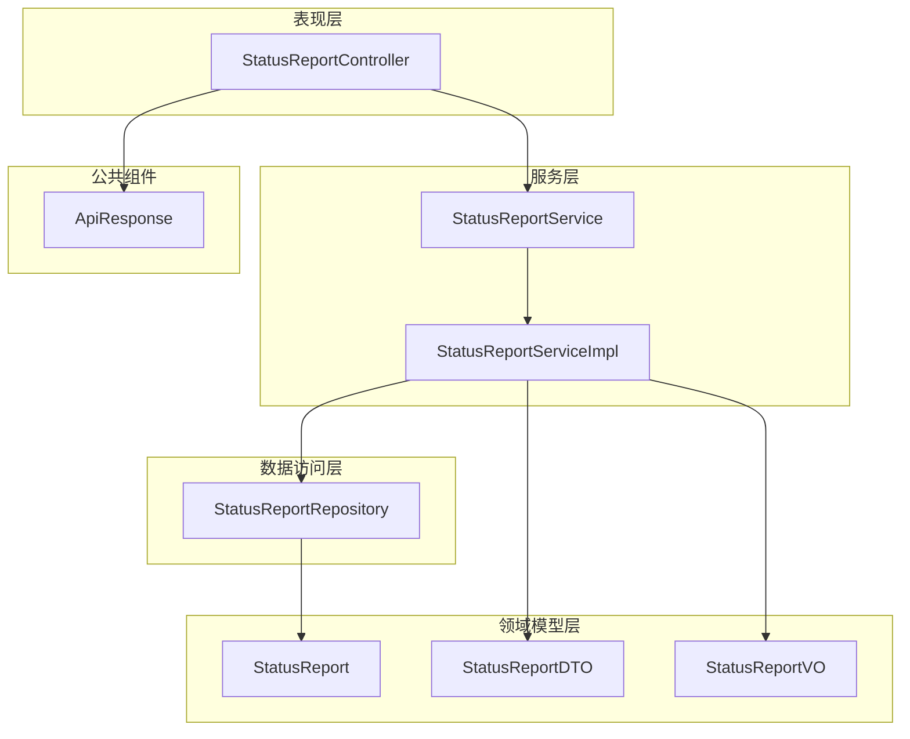
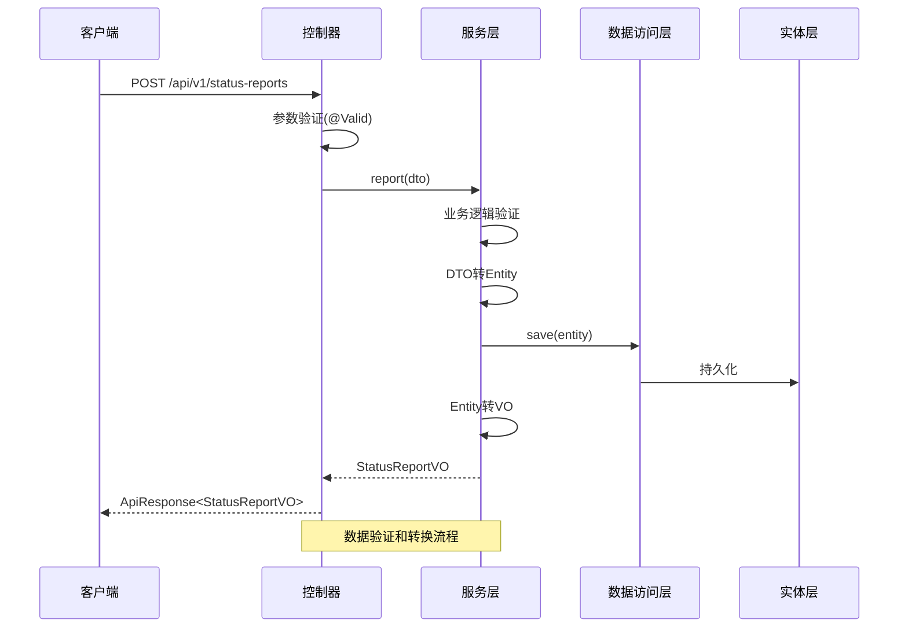
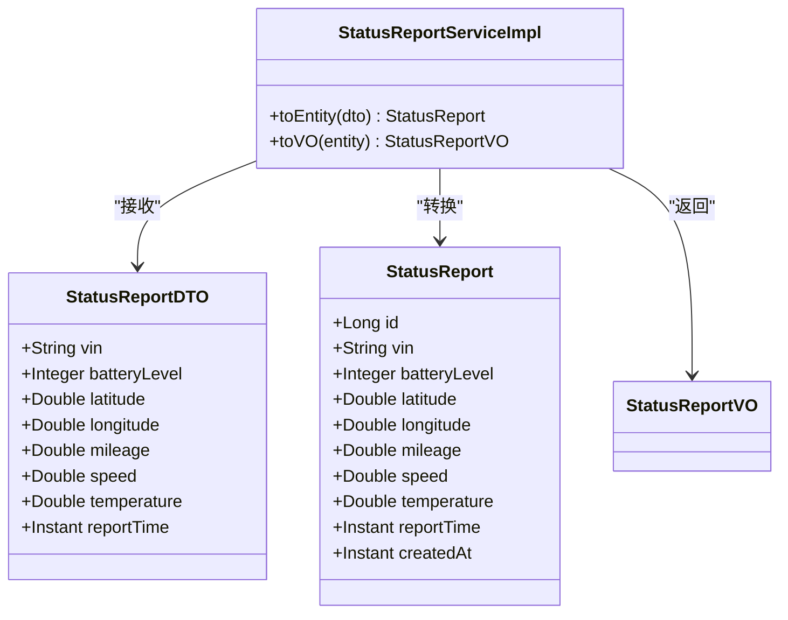
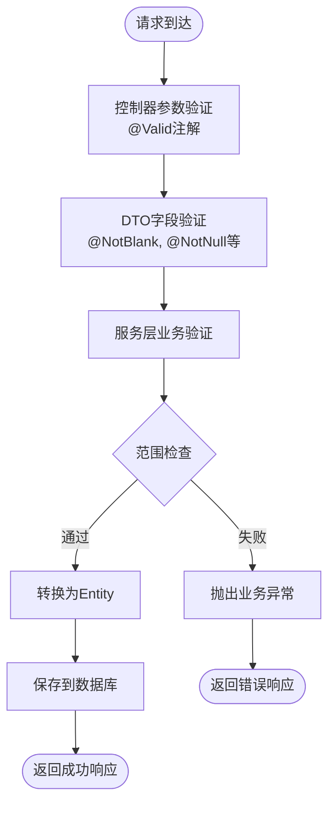
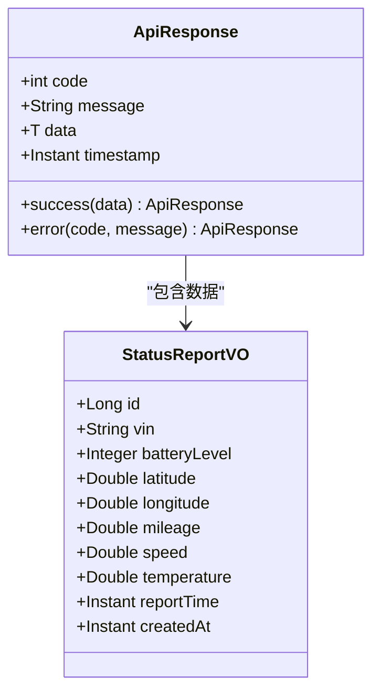
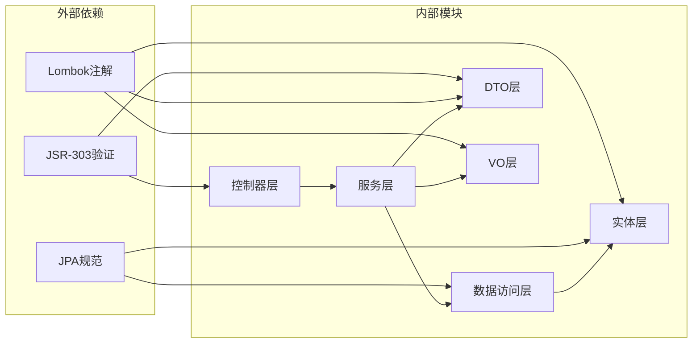
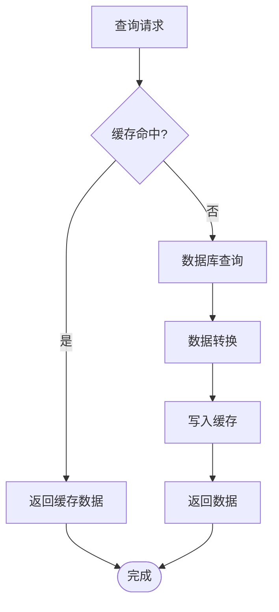

# 数据传输对象设计

<cite>
**本文档引用的文件**
- [StatusReportDTO.java](file://vehicle-status-service/src/main/java/com/wenjie/cloud/vehiclestatus/dto/StatusReportDTO.java)
- [StatusReportVO.java](file://vehicle-status-service/src/main/java/com/wenjie/cloud/vehiclestatus/dto/StatusReportVO.java)
- [StatusReport.java](file://vehicle-status-service/src/main/java/com/wenjie/cloud/vehiclestatus/entity/StatusReport.java)
- [StatusReportService.java](file://vehicle-status-service/src/main/java/com/wenjie/cloud/vehiclestatus/service/StatusReportService.java)
- [StatusReportServiceImpl.java](file://vehicle-status-service/src/main/java/com/wenjie/cloud/vehiclestatus/service/impl/StatusReportServiceImpl.java)
- [StatusReportController.java](file://vehicle-status-service/src/main/java/com/wenjie/cloud/vehiclestatus/controller/StatusReportController.java)
- [StatusReportRepository.java](file://vehicle-status-service/src/main/java/com/wenjie/cloud/vehiclestatus/repository/StatusReportRepository.java)
- [ApiResponse.java](file://vehicle-common/src/main/java/com/wenjie/cloud/common/dto/ApiResponse.java)
- [StatusReportControllerTest.java](file://vehicle-status-service/src/test/java/com/wenjie/cloud/vehiclestatus/controller/StatusReportControllerTest.java)
- [StatusReportServiceImplTest.java](file://vehicle-status-service/src/test/java/com/wenjie/cloud/vehiclestatus/service/impl/StatusReportServiceImplTest.java)
</cite>

## 目录
1. [简介](#简介)
2. [项目结构](#项目结构)
3. [核心组件](#核心组件)
4. [架构概览](#架构概览)
5. [详细组件分析](#详细组件分析)
6. [依赖关系分析](#依赖关系分析)
7. [性能考虑](#性能考虑)
8. [故障排除指南](#故障排除指南)
9. [结论](#结论)

## 简介

本文档深入分析了车辆状态监控服务中的数据传输对象设计，重点介绍了StatusReportDTO和StatusReportVO两个核心数据传输对象。这些对象在微服务架构中扮演着关键角色，负责在不同层次之间传递数据，确保数据的一致性和完整性。

StatusReportDTO作为输入数据传输对象，负责接收来自客户端的状态上报请求；StatusReportVO作为输出数据传输对象，负责向客户端返回格式化的状态查询结果。两者通过服务层进行转换，最终持久化到数据库实体中。

## 项目结构

车辆状态监控服务采用标准的分层架构设计，主要包含以下层次：

**图表来源**
- [StatusReportController.java:1-71](file://vehicle-status-service/src/main/java/com/wenjie/cloud/vehiclestatus/controller/StatusReportController.java#L1-L71)
- [StatusReportService.java:1-36](file://vehicle-status-service/src/main/java/com/wenjie/cloud/vehiclestatus/service/StatusReportService.java#L1-L36)
- [StatusReportServiceImpl.java:1-104](file://vehicle-status-service/src/main/java/com/wenjie/cloud/vehiclestatus/service/impl/StatusReportServiceImpl.java#L1-L104)
- [StatusReportRepository.java:1-39](file://vehicle-status-service/src/main/java/com/wenjie/cloud/vehiclestatus/repository/StatusReportRepository.java#L1-L39)

**章节来源**
- [StatusReportController.java:1-71](file://vehicle-status-service/src/main/java/com/wenjie/cloud/vehiclestatus/controller/StatusReportController.java#L1-L71)
- [StatusReportService.java:1-36](file://vehicle-status-service/src/main/java/com/wenjie/cloud/vehiclestatus/service/StatusReportService.java#L1-L36)
- [StatusReportServiceImpl.java:1-104](file://vehicle-status-service/src/main/java/com/wenjie/cloud/vehiclestatus/service/impl/StatusReportServiceImpl.java#L1-L104)

## 核心组件

### StatusReportDTO - 输入数据传输对象

StatusReportDTO是专门用于接收状态上报请求的输入对象，具有严格的数据验证规则：

**设计目的：**
- 接收客户端发送的车辆状态上报数据
- 在进入业务逻辑之前进行数据验证
- 确保数据格式和范围的正确性

**字段定义与验证规则：**

| 字段名 | 类型 | 验证规则 | 用途 |
|--------|------|----------|------|
| vin | String | @NotBlank, @Size(17) | 车辆识别码，必须为17位字符 |
| batteryLevel | Integer | @NotNull, @Min(0), @Max(100) | 电池电量，0-100之间的整数 |
| latitude | Double | @NotNull, @DecimalMin(-90), @DecimalMax(90) | 纬度，-90到90之间的数值 |
| longitude | Double | @NotNull, @DecimalMin(-180), @DecimalMax(180) | 经度，-180到180之间的数值 |
| mileage | Double | @NotNull, @DecimalMin(0) | 总里程，单位公里，非负数 |
| speed | Double | @NotNull, @DecimalMin(0) | 车速，单位km/h，非负数 |
| temperature | Double | @NotNull | 温度，单位摄氏度 |
| reportTime | Instant | @NotNull | 状态上报时间 |

**章节来源**
- [StatusReportDTO.java:14-60](file://vehicle-status-service/src/main/java/com/wenjie/cloud/vehiclestatus/dto/StatusReportDTO.java#L14-L60)

### StatusReportVO - 输出数据传输对象

StatusReportVO是专门用于向外提供状态查询结果的输出对象：

**设计目的：**
- 向客户端返回格式化的状态查询结果
- 控制对外暴露的数据结构和字段
- 提供统一的响应格式

**字段定义：**

| 字段名 | 类型 | 用途 |
|--------|------|------|
| id | Long | 主键标识 |
| vin | String | 车辆识别码 |
| batteryLevel | Integer | 电池电量 |
| latitude | Double | 纬度 |
| longitude | Double | 经度 |
| mileage | Double | 总里程 |
| speed | Double | 车速 |
| temperature | Double | 温度 |
| reportTime | Instant | 状态上报时间 |
| createdAt | Instant | 记录创建时间 |

**章节来源**
- [StatusReportVO.java:7-41](file://vehicle-status-service/src/main/java/com/wenjie/cloud/vehiclestatus/dto/StatusReportVO.java#L7-L41)

## 架构概览

整个数据传输对象体系遵循清晰的转换流程：

**图表来源**
- [StatusReportController.java:36-39](file://vehicle-status-service/src/main/java/com/wenjie/cloud/vehiclestatus/controller/StatusReportController.java#L36-L39)
- [StatusReportServiceImpl.java:32-41](file://vehicle-status-service/src/main/java/com/wenjie/cloud/vehiclestatus/service/impl/StatusReportServiceImpl.java#L32-L41)
- [StatusReportServiceImpl.java:76-102](file://vehicle-status-service/src/main/java/com/wenjie/cloud/vehiclestatus/service/impl/StatusReportServiceImpl.java#L76-L102)

**章节来源**
- [StatusReportController.java:1-71](file://vehicle-status-service/src/main/java/com/wenjie/cloud/vehiclestatus/controller/StatusReportController.java#L1-L71)
- [StatusReportServiceImpl.java:1-104](file://vehicle-status-service/src/main/java/com/wenjie/cloud/vehiclestatus/service/impl/StatusReportServiceImpl.java#L1-L104)

## 详细组件分析

### DTO到Entity的转换逻辑

服务层实现了精确的DTO到Entity转换逻辑：

**图表来源**
- [StatusReportDTO.java:18-60](file://vehicle-status-service/src/main/java/com/wenjie/cloud/vehiclestatus/dto/StatusReportDTO.java#L18-L60)
- [StatusReport.java:23-70](file://vehicle-status-service/src/main/java/com/wenjie/cloud/vehiclestatus/entity/StatusReport.java#L23-L70)
- [StatusReportServiceImpl.java:76-102](file://vehicle-status-service/src/main/java/com/wenjie/cloud/vehiclestatus/service/impl/StatusReportServiceImpl.java#L76-L102)

**转换特点：**
- 字段映射：一对一直接赋值
- 类型兼容：支持基本数据类型的自动装箱/拆箱
- 时间处理：保持Instant类型的精确性
- 无额外计算：转换过程简单直接

**章节来源**
- [StatusReportServiceImpl.java:76-102](file://vehicle-status-service/src/main/java/com/wenjie/cloud/vehiclestatus/service/impl/StatusReportServiceImpl.java#L76-L102)

### 数据验证机制

系统采用了多层次的数据验证机制：

**图表来源**
- [StatusReportController.java:37](file://vehicle-status-service/src/main/java/com/wenjie/cloud/vehiclestatus/controller/StatusReportController.java#L37)
- [StatusReportDTO.java:21-59](file://vehicle-status-service/src/main/java/com/wenjie/cloud/vehiclestatus/dto/StatusReportDTO.java#L21-L59)
- [StatusReportServiceImpl.java:33-35](file://vehicle-status-service/src/main/java/com/wenjie/cloud/vehiclestatus/service/impl/StatusReportServiceImpl.java#L33-L35)

**验证规则详解：**

1. **VIN验证**：必须为17位非空字符串
2. **电量验证**：0-100之间的整数
3. **地理坐标验证**：
   - 纬度：-90到90
   - 经度：-180到180
4. **数值验证**：里程、速度、温度必须为非负数
5. **时间验证**：上报时间不能晚于当前时间

**章节来源**
- [StatusReportDTO.java:21-59](file://vehicle-status-service/src/main/java/com/wenjie/cloud/vehiclestatus/dto/StatusReportDTO.java#L21-L59)
- [StatusReportServiceImpl.java:33-35](file://vehicle-status-service/src/main/java/com/wenjie/cloud/vehiclestatus/service/impl/StatusReportServiceImpl.java#L33-L35)

### API响应格式

系统使用统一的ApiResponse包装响应：

**图表来源**
- [ApiResponse.java:13-51](file://vehicle-common/src/main/java/com/wenjie/cloud/common/dto/ApiResponse.java#L13-L51)
- [StatusReportVO.java:11-41](file://vehicle-status-service/src/main/java/com/wenjie/cloud/vehiclestatus/dto/StatusReportVO.java#L11-L41)

**响应结构：**
- code：业务状态码，0表示成功
- message：提示信息
- data：实际响应数据
- timestamp：响应时间戳

**章节来源**
- [ApiResponse.java:13-51](file://vehicle-common/src/main/java/com/wenjie/cloud/common/dto/ApiResponse.java#L13-L51)

## 依赖关系分析

系统采用松耦合的设计模式，各组件间依赖关系清晰：

**图表来源**
- [StatusReportDTO.java:3-12](file://vehicle-status-service/src/main/java/com/wenjie/cloud/vehiclestatus/dto/StatusReportDTO.java#L3-L12)
- [StatusReportVO.java:3-6](file://vehicle-status-service/src/main/java/com/wenjie/cloud/vehiclestatus/dto/StatusReportVO.java#L3-L6)
- [StatusReport.java:3-13](file://vehicle-status-service/src/main/java/com/wenjie/cloud/vehiclestatus/entity/StatusReport.java#L3-L13)

**依赖特点：**
- 最小化外部依赖：仅使用必要的标准库
- 注解驱动开发：大量使用Lombok简化代码
- 标准化验证：使用JSR-303进行参数验证
- 规范化持久化：遵循JPA标准

**章节来源**
- [StatusReportDTO.java:1-61](file://vehicle-status-service/src/main/java/com/wenjie/cloud/vehiclestatus/dto/StatusReportDTO.java#L1-L61)
- [StatusReportVO.java:1-42](file://vehicle-status-service/src/main/java/com/wenjie/cloud/vehiclestatus/dto/StatusReportVO.java#L1-L42)
- [StatusReport.java:1-71](file://vehicle-status-service/src/main/java/com/wenjie/cloud/vehiclestatus/entity/StatusReport.java#L1-L71)

## 性能考虑

### 数据传输优化

1. **字段选择优化**：VO对象仅包含对外展示必需的字段，避免不必要的数据传输
2. **时间精度**：使用Instant类型保持时间精度，避免时区转换开销
3. **批量查询**：支持分页查询，避免一次性返回大量数据

### 缓存策略建议

### 数据库优化

1. **索引设计**：实体类已定义vin和report_time复合索引
2. **查询优化**：Repository层提供专门的查询方法
3. **事务管理**：合理使用@Transactional注解控制事务边界

## 故障排除指南

### 常见问题及解决方案

**1. 参数验证失败**
- 症状：HTTP 400 Bad Request
- 原因：DTO字段验证规则不满足
- 解决方案：检查字段格式和范围是否符合要求

**2. 业务逻辑异常**
- 症状：HTTP 200但code非0
- 原因：服务层业务验证失败
- 解决方案：根据错误码定位具体问题

**3. 数据库操作异常**
- 症状：HTTP 500 Internal Server Error
- 原因：数据库约束或连接问题
- 解决方案：检查数据库连接和表结构

**章节来源**
- [StatusReportControllerTest.java:73-110](file://vehicle-status-service/src/test/java/com/wenjie/cloud/vehiclestatus/controller/StatusReportControllerTest.java#L73-L110)
- [StatusReportServiceImplTest.java:64-71](file://vehicle-status-service/src/test/java/com/wenjie/cloud/vehiclestatus/service/impl/StatusReportServiceImplTest.java#L64-L71)

### 测试用例参考

系统提供了完整的单元测试覆盖：

1. **控制器测试**：验证HTTP接口行为
2. **服务层测试**：验证业务逻辑和异常处理
3. **集成测试**：验证端到端数据流

**章节来源**
- [StatusReportControllerTest.java:46-177](file://vehicle-status-service/src/test/java/com/wenjie/cloud/vehiclestatus/controller/StatusReportControllerTest.java#L46-L177)
- [StatusReportServiceImplTest.java:45-179](file://vehicle-status-service/src/test/java/com/wenjie/cloud/vehiclestatus/service/impl/StatusReportServiceImplTest.java#L45-L179)

## 结论

StatusReportDTO和StatusReportVO的设计体现了现代微服务架构的最佳实践：

**设计优势：**
- **职责分离**：输入输出对象职责明确，便于维护
- **验证完整**：多层验证确保数据质量
- **扩展性强**：清晰的转换接口便于功能扩展
- **性能优化**：合理的字段设计和查询策略

**应用场景：**
- 车辆实时状态监控
- 历史数据查询和分析
- 多车状态聚合展示
- 移动端数据同步

**改进建议：**
- 可考虑引入MapStruct进行更高效的对象转换
- 增加数据转换的异常处理和日志记录
- 考虑添加数据脱敏和安全验证
- 实现缓存策略提升查询性能

这个数据传输对象设计为整个车辆状态监控系统提供了坚实的基础，确保了数据在不同层次间的准确传递和一致性保证。