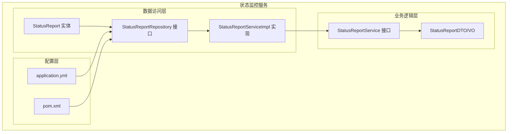
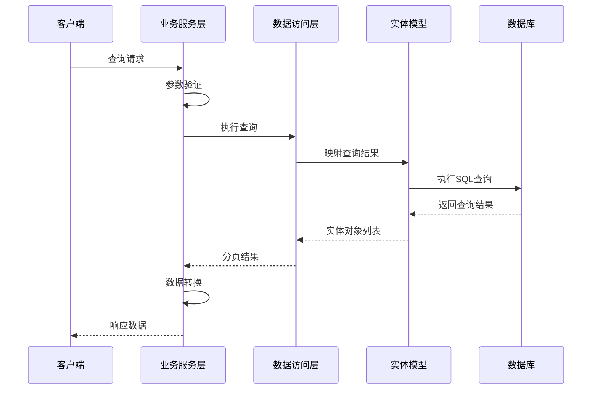
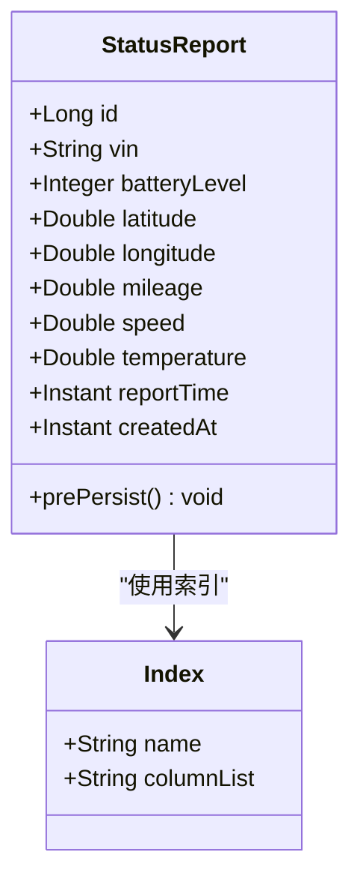
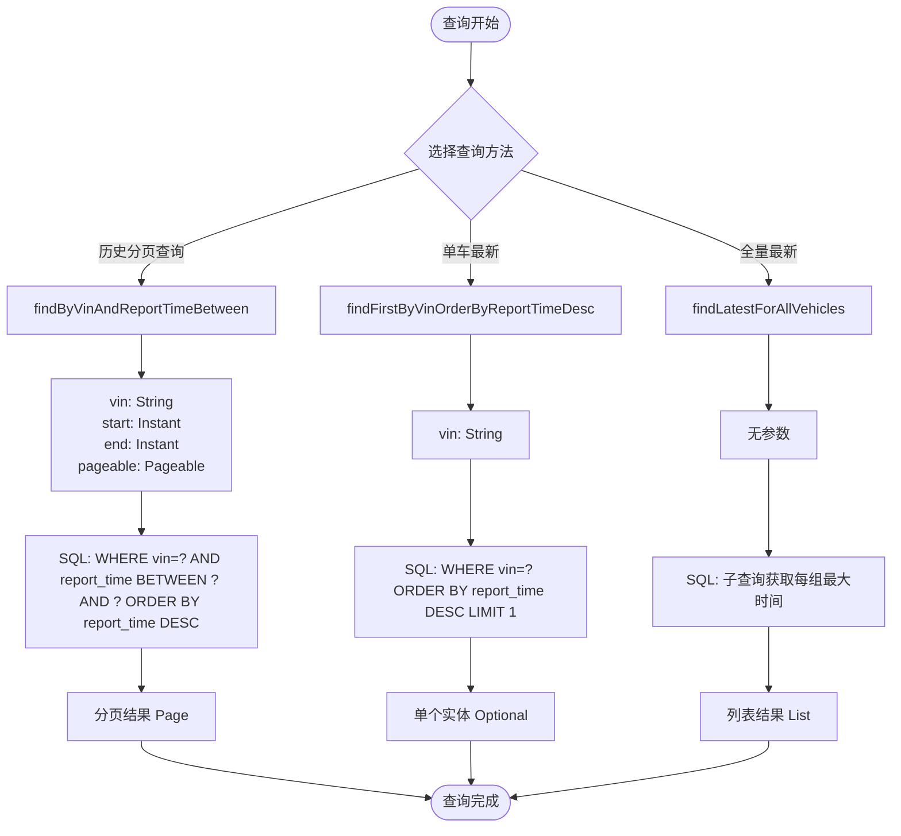
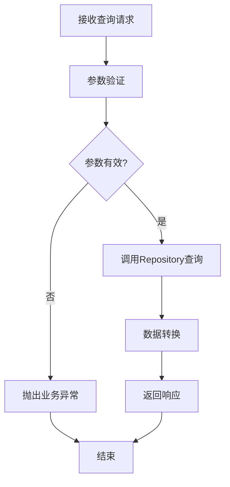
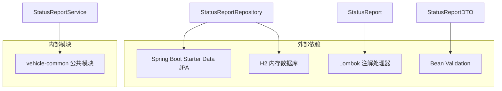
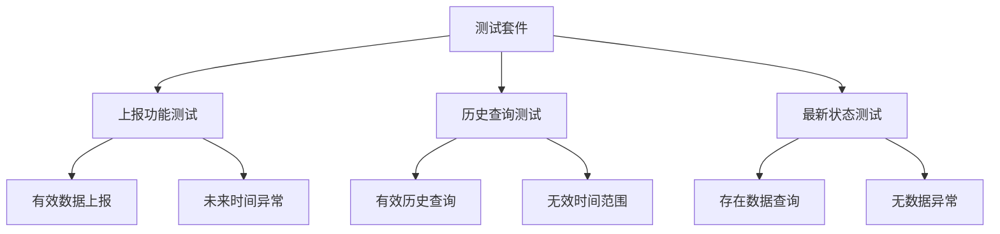

# 数据访问层设计

<cite>
**本文档引用的文件**
- [StatusReport.java](file://vehicle-status-service/src/main/java/com/wenjie/cloud/vehiclestatus/entity/StatusReport.java)
- [StatusReportRepository.java](file://vehicle-status-service/src/main/java/com/wenjie/cloud/vehiclestatus/repository/StatusReportRepository.java)
- [StatusReportServiceImpl.java](file://vehicle-status-service/src/main/java/com/wenjie/cloud/vehiclestatus/service/impl/StatusReportServiceImpl.java)
- [StatusReportService.java](file://vehicle-status-service/src/main/java/com/wenjie/cloud/vehiclestatus/service/StatusReportService.java)
- [StatusReportDTO.java](file://vehicle-status-service/src/main/java/com/wenjie/cloud/vehiclestatus/dto/StatusReportDTO.java)
- [StatusReportVO.java](file://vehicle-status-service/src/main/java/com/wenjie/cloud/vehiclestatus/dto/StatusReportVO.java)
- [application.yml](file://vehicle-status-service/src/main/resources/application.yml)
- [pom.xml](file://vehicle-status-service/pom.xml)
- [StatusReportServiceImplTest.java](file://vehicle-status-service/src/test/java/com/wenjie/cloud/vehiclestatus/service/impl/StatusReportServiceImplTest.java)
</cite>

## 目录
1. [简介](#简介)
2. [项目结构](#项目结构)
3. [核心组件](#核心组件)
4. [架构概览](#架构概览)
5. [详细组件分析](#详细组件分析)
6. [依赖关系分析](#依赖关系分析)
7. [性能考量](#性能考量)
8. [故障排除指南](#故障排除指南)
9. [结论](#结论)

## 简介
本文档深入分析状态监控服务的数据访问层设计，重点介绍StatusReportRepository的实现细节、Spring Data JPA查询方法定义、时间序列数据查询优化策略以及分页查询的数据库层面优化。通过对实体模型映射关系的分析，提供查询性能优化建议和最佳实践指导。

## 项目结构
状态监控服务采用标准的Spring Boot微服务架构，数据访问层位于vehicle-status-service模块中，包含完整的实体、仓库、服务和控制器层。



**图表来源**
- [StatusReport.java:1-71](file://vehicle-status-service/src/main/java/com/wenjie/cloud/vehiclestatus/entity/StatusReport.java#L1-L71)
- [StatusReportRepository.java:1-39](file://vehicle-status-service/src/main/java/com/wenjie/cloud/vehiclestatus/repository/StatusReportRepository.java#L1-L39)
- [application.yml:1-30](file://vehicle-status-service/src/main/resources/application.yml#L1-L30)

**章节来源**
- [pom.xml:1-61](file://vehicle-status-service/pom.xml#L1-L61)
- [application.yml:1-30](file://vehicle-status-service/src/main/resources/application.yml#L1-L30)

## 核心组件
数据访问层由四个关键组件构成：实体模型、仓库接口、服务实现和数据传输对象。

### 实体模型设计
StatusReport实体采用标准的JPA注解配置，包含完整的车辆状态字段定义和索引优化。

### 仓库接口设计
StatusReportRepository继承JpaRepository，提供三种核心查询方法：
- 历史数据分页查询
- 单车最新状态查询  
- 全量最新状态查询

### 服务实现层
StatusReportServiceImpl负责业务逻辑处理、参数验证和数据转换，确保查询的准确性和性能。

**章节来源**
- [StatusReport.java:15-71](file://vehicle-status-service/src/main/java/com/wenjie/cloud/vehiclestatus/entity/StatusReport.java#L15-L71)
- [StatusReportRepository.java:13-39](file://vehicle-status-service/src/main/java/com/wenjie/cloud/vehiclestatus/repository/StatusReportRepository.java#L13-L39)
- [StatusReportServiceImpl.java:20-104](file://vehicle-status-service/src/main/java/com/wenjie/cloud/vehiclestatus/service/impl/StatusReportServiceImpl.java#L20-L104)

## 架构概览
数据访问层采用经典的分层架构，各层职责清晰，耦合度低。



**图表来源**
- [StatusReportServiceImpl.java:43-72](file://vehicle-status-service/src/main/java/com/wenjie/cloud/vehiclestatus/service/impl/StatusReportServiceImpl.java#L43-L72)
- [StatusReportRepository.java:16-38](file://vehicle-status-service/src/main/java/com/wenjie/cloud/vehiclestatus/repository/StatusReportRepository.java#L16-L38)

## 详细组件分析

### StatusReport 实体分析

#### 数据模型设计
实体采用标准的JPA注解配置，包含以下关键特性：



**图表来源**
- [StatusReport.java:20-22](file://vehicle-status-service/src/main/java/com/wenjie/cloud/vehiclestatus/entity/StatusReport.java#L20-L22)

#### 字段约束和验证
- VIN码：固定17位长度，非空验证
- 电池电量：0-100范围验证
- 位置信息：经纬度范围验证
- 时间字段：上报时间和创建时间

**章节来源**
- [StatusReport.java:30-69](file://vehicle-status-service/src/main/java/com/wenjie/cloud/vehiclestatus/entity/StatusReport.java#L30-L69)
- [StatusReportDTO.java:20-60](file://vehicle-status-service/src/main/java/com/wenjie/cloud/vehiclestatus/dto/StatusReportDTO.java#L20-L60)

### StatusReportRepository 查询方法分析

#### 自然语言查询方法
Repository接口定义了三种核心查询方法：



**图表来源**
- [StatusReportRepository.java:18-37](file://vehicle-status-service/src/main/java/com/wenjie/cloud/vehiclestatus/repository/StatusReportRepository.java#L18-L37)

#### 查询方法实现细节

**历史分页查询方法**
- 方法签名：`findByVinAndReportTimeBetween(String vin, Instant start, Instant end, Pageable pageable)`
- 功能：按VIN码和时间范围查询状态报告
- 性能特点：利用复合索引进行高效过滤

**单车最新状态查询**
- 方法签名：`findFirstByVinOrderByReportTimeDesc(String vin)`
- 功能：获取指定VIN码的最新状态记录
- 性能特点：利用索引的排序优势

**全量最新状态查询**
- 方法签名：`findLatestForAllVehicles()`
- 功能：获取所有车辆各自的最新状态
- SQL实现：使用子查询获取每组的最大时间

**章节来源**
- [StatusReportRepository.java:16-38](file://vehicle-status-service/src/main/java/com/wenjie/cloud/vehiclestatus/repository/StatusReportRepository.java#L16-L38)

### 服务层集成分析

#### 业务逻辑处理流程
服务层实现了完整的业务逻辑，包括参数验证、异常处理和数据转换：



**图表来源**
- [StatusReportServiceImpl.java:30-72](file://vehicle-status-service/src/main/java/com/wenjie/cloud/vehiclestatus/service/impl/StatusReportServiceImpl.java#L30-L72)

#### 异常处理机制
服务层实现了完善的异常处理：
- 上报时间验证：防止未来时间戳
- 时间范围验证：确保起始时间不晚于结束时间
- VIN格式验证：确保17位VIN码格式正确
- 数据存在性检查：处理无数据情况

**章节来源**
- [StatusReportServiceImpl.java:30-64](file://vehicle-status-service/src/main/java/com/wenjie/cloud/vehiclestatus/service/impl/StatusReportServiceImpl.java#L30-L64)

## 依赖关系分析

### 外部依赖关系
数据访问层依赖以下核心组件：



**图表来源**
- [pom.xml:18-48](file://vehicle-status-service/pom.xml#L18-L48)

### 内部模块依赖
- 依赖vehicle-common模块提供的通用异常处理机制
- 使用Spring Data JPA进行数据持久化操作
- 采用H2内存数据库进行开发和测试

**章节来源**
- [pom.xml:18-48](file://vehicle-status-service/pom.xml#L18-L48)
- [application.yml:4-23](file://vehicle-status-service/src/main/resources/application.yml#L4-L23)

## 性能考量

### 索引设计优化
实体类中定义了关键的复合索引：

```mermaid
erDiagram
STATUS_REPORT {
BIGINT id PK
VARCHAR vin
INTEGER battery_level
DOUBLE latitude
DOUBLE longitude
DOUBLE mileage
DOUBLE speed
DOUBLE temperature
TIMESTAMP report_time
TIMESTAMP created_at
}
INDEX idx_vin_report_time ON STATUS_REPORT(vin, report_time)
note for STATUS_REPORT "复合索引优化查询性能"
```

**图表来源**
- [StatusReport.java:20-22](file://vehicle-status-service/src/main/java/com/wenjie/cloud/vehiclestatus/entity/StatusReport.java#L20-L22)

#### 索引设计策略
- 复合索引：`(vin, report_time)`完美匹配查询模式
- 查询优化：支持按VIN过滤和时间范围排序
- 存储优化：减少索引维护开销

### 查询性能优化建议

#### 时间序列查询优化
1. **索引利用策略**
   - 使用复合索引 `(vin, report_time)` 进行高效过滤
   - 避免在查询条件中对索引列进行函数操作

2. **分页查询优化**
   - 合理设置页面大小，避免过大的分页查询
   - 使用游标分页替代偏移量分页

3. **SQL查询优化**
   - 避免使用 `SELECT *`，只选择必要字段
   - 使用 `EXPLAIN` 分析查询执行计划

#### 数据库层面优化
1. **表结构优化**
   - 确保时间字段使用合适的精度
   - 考虑分区表策略处理大量历史数据

2. **连接池配置**
   - 合理配置连接池大小
   - 设置适当的超时时间

**章节来源**
- [StatusReportRepository.java:18-37](file://vehicle-status-service/src/main/java/com/wenjie/cloud/vehiclestatus/repository/StatusReportRepository.java#L18-L37)
- [application.yml:16-23](file://vehicle-status-service/src/main/resources/application.yml#L16-L23)

## 故障排除指南

### 常见问题诊断

#### 查询性能问题
1. **慢查询识别**
   - 使用 `SHOW SQL` 查看实际执行的SQL语句
   - 分析查询执行时间分布

2. **索引使用检查**
   - 验证复合索引是否被正确使用
   - 检查查询条件中的字段顺序

#### 数据一致性问题
1. **时间戳验证**
   - 确认上报时间不超过当前时间
   - 检查时间字段的时区处理

2. **数据完整性检查**
   - 验证VIN码格式和唯一性
   - 检查数值字段的范围约束

**章节来源**
- [StatusReportServiceImplTest.java:45-147](file://vehicle-status-service/src/test/java/com/wenjie/cloud/vehiclestatus/service/impl/StatusReportServiceImplTest.java#L45-L147)

### 测试覆盖分析
单元测试涵盖了主要的业务场景：



**图表来源**
- [StatusReportServiceImplTest.java:46-147](file://vehicle-status-service/src/test/java/com/wenjie/cloud/vehiclestatus/service/impl/StatusReportServiceImplTest.java#L46-L147)

**章节来源**
- [StatusReportServiceImplTest.java:1-179](file://vehicle-status-service/src/test/java/com/wenjie/cloud/vehiclestatus/service/impl/StatusReportServiceImplTest.java#L1-L179)

## 结论
状态监控服务的数据访问层设计体现了良好的软件工程实践，通过合理的实体建模、优化的查询方法和完善的异常处理机制，实现了高性能的时间序列数据查询。关键的设计亮点包括：

1. **索引优化**：复合索引 `(vin, report_time)` 为查询提供了强大的性能基础
2. **查询方法设计**：针对不同业务场景提供了专门的查询方法
3. **异常处理**：完善的参数验证和错误处理机制
4. **测试覆盖**：全面的单元测试确保代码质量

建议在生产环境中进一步考虑：
- 数据库分区策略以处理大规模历史数据
- 连接池和缓存配置优化
- 监控和日志记录的增强
- 更详细的性能基准测试