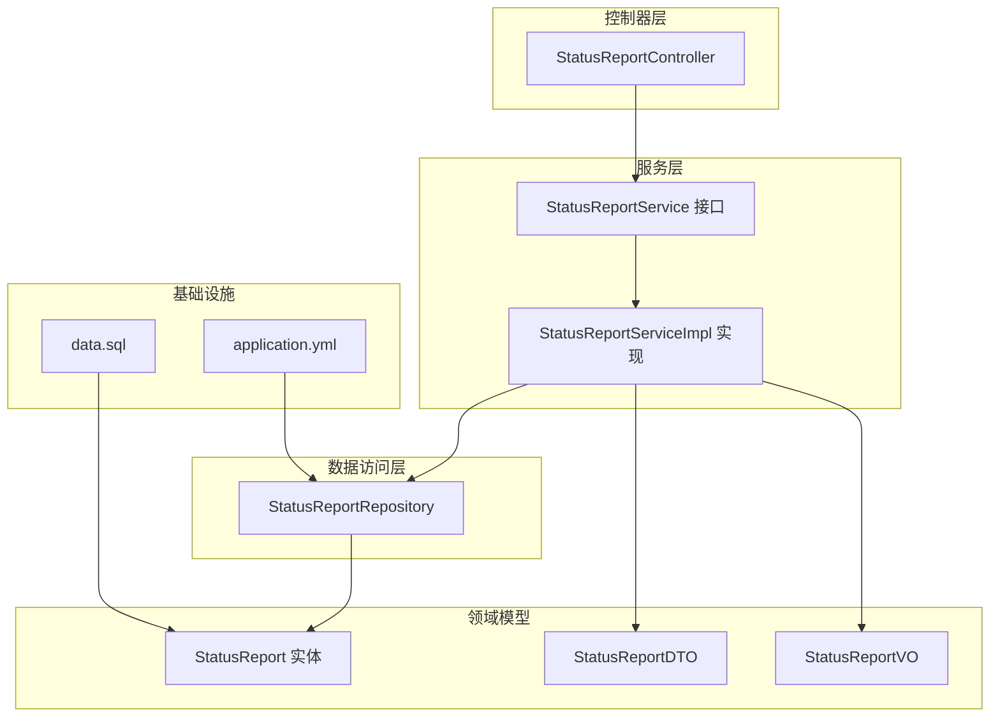
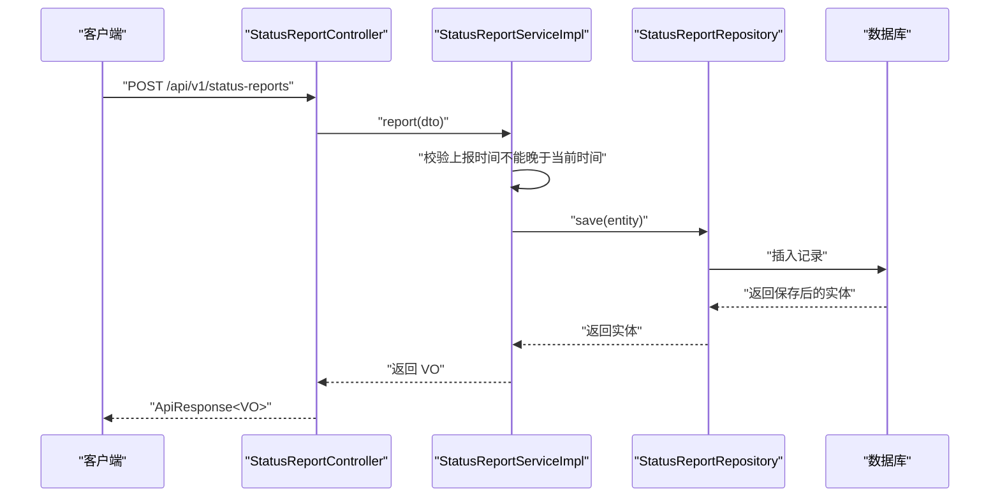
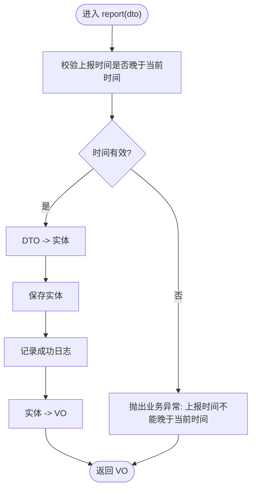
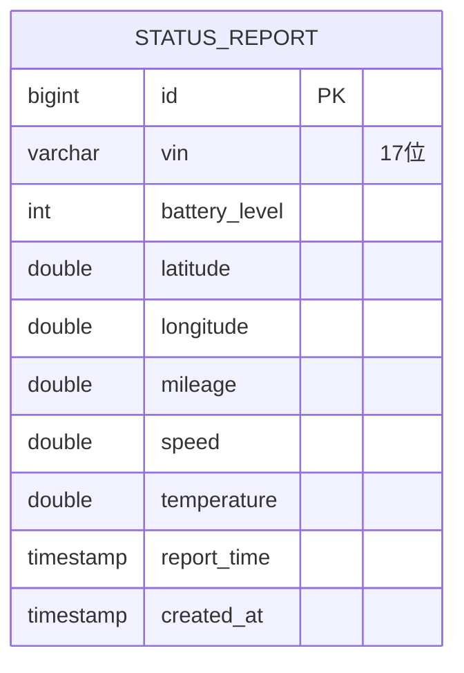
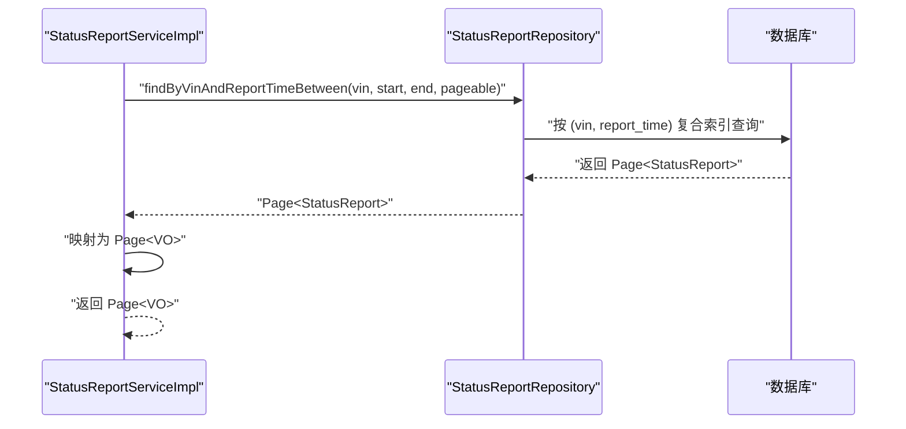
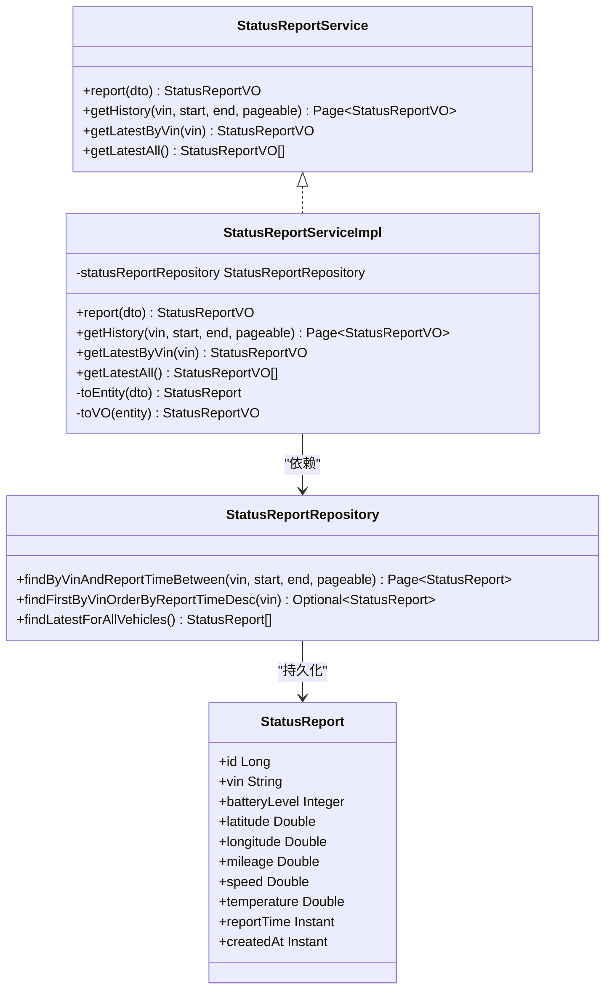

# 服务层实现

<cite>
**本文引用的文件列表**
- [StatusReportService.java](file://vehicle-status-service/src/main/java/com/wenjie/cloud/vehiclestatus/service/StatusReportService.java)
- [StatusReportServiceImpl.java](file://vehicle-status-service/src/main/java/com/wenjie/cloud/vehiclestatus/service/impl/StatusReportServiceImpl.java)
- [StatusReportRepository.java](file://vehicle-status-service/src/main/java/com/wenjie/cloud/vehiclestatus/repository/StatusReportRepository.java)
- [StatusReport.java](file://vehicle-status-service/src/main/java/com/wenjie/cloud/vehiclestatus/entity/StatusReport.java)
- [StatusReportDTO.java](file://vehicle-status-service/src/main/java/com/wenjie/cloud/vehiclestatus/dto/StatusReportDTO.java)
- [StatusReportVO.java](file://vehicle-status-service/src/main/java/com/wenjie/cloud/vehiclestatus/dto/StatusReportVO.java)
- [StatusReportController.java](file://vehicle-status-service/src/main/java/com/wenjie/cloud/vehiclestatus/controller/StatusReportController.java)
- [application.yml](file://vehicle-status-service/src/main/resources/application.yml)
- [data.sql](file://vehicle-status-service/src/main/resources/data.sql)
- [BusinessException.java](file://vehicle-common/src/main/java/com/wenjie/cloud/common/exception/BusinessException.java)
</cite>

## 目录
1. [简介](#简介)
2. [项目结构](#项目结构)
3. [核心组件](#核心组件)
4. [架构总览](#架构总览)
5. [详细组件分析](#详细组件分析)
6. [依赖关系分析](#依赖关系分析)
7. [性能考量](#性能考量)
8. [故障排查指南](#故障排查指南)
9. [结论](#结论)
10. [附录](#附录)

## 简介
本文档聚焦于车辆状态监控服务的服务层实现，系统性梳理 StatusReportService 接口与 StatusReportServiceImpl 的具体实现，覆盖状态上报、历史查询、最新状态查询等核心业务逻辑，并结合数据模型、仓储层查询与控制器层调用，给出关键算法与性能优化建议。同时提供业务流程图与关键实现路径，帮助读者快速理解与扩展。

## 项目结构
服务层位于 vehicle-status-service 模块中，采用典型的分层架构：
- 控制器层：对外暴露 REST API，负责参数校验与分页排序配置
- 服务层：封装业务规则、事务控制与数据转换
- 数据访问层：基于 Spring Data JPA 提供查询与分页能力
- 实体与 DTO/VO：定义数据模型与传输对象

图表来源
- [StatusReportController.java:1-71](file://vehicle-status-service/src/main/java/com/wenjie/cloud/vehiclestatus/controller/StatusReportController.java#L1-L71)
- [StatusReportService.java:1-36](file://vehicle-status-service/src/main/java/com/wenjie/cloud/vehiclestatus/service/StatusReportService.java#L1-L36)
- [StatusReportServiceImpl.java:1-104](file://vehicle-status-service/src/main/java/com/wenjie/cloud/vehiclestatus/service/impl/StatusReportServiceImpl.java#L1-L104)
- [StatusReportRepository.java:1-39](file://vehicle-status-service/src/main/java/com/wenjie/cloud/vehiclestatus/repository/StatusReportRepository.java#L1-L39)
- [StatusReport.java:1-71](file://vehicle-status-service/src/main/java/com/wenjie/cloud/vehiclestatus/entity/StatusReport.java#L1-L71)
- [StatusReportDTO.java:1-61](file://vehicle-status-service/src/main/java/com/wenjie/cloud/vehiclestatus/dto/StatusReportDTO.java#L1-L61)
- [StatusReportVO.java:1-42](file://vehicle-status-service/src/main/java/com/wenjie/cloud/vehiclestatus/dto/StatusReportVO.java#L1-L42)
- [application.yml:1-30](file://vehicle-status-service/src/main/resources/application.yml#L1-L30)
- [data.sql:1-77](file://vehicle-status-service/src/main/resources/data.sql#L1-L77)

章节来源
- [StatusReportController.java:1-71](file://vehicle-status-service/src/main/java/com/wenjie/cloud/vehiclestatus/controller/StatusReportController.java#L1-L71)
- [application.yml:1-30](file://vehicle-status-service/src/main/resources/application.yml#L1-L30)

## 核心组件
- StatusReportService：定义状态上报、历史分页查询、单车最新状态、全量最新状态四类业务接口
- StatusReportServiceImpl：实现上述接口，包含数据验证、业务规则检查、事务控制与实体/VO 转换
- StatusReportRepository：继承 JpaRepository，提供按 VIN+时间范围分页查询、单车最新查询、全量最新聚合查询
- StatusReport 实体：映射 status_report 表，含 VIN、电量、经纬度、里程、速度、温度、上报时间、创建时间等字段
- DTO/VO：输入 DTO（带 JSR-303 参数约束）与输出 VO（用于响应）

章节来源
- [StatusReportService.java:1-36](file://vehicle-status-service/src/main/java/com/wenjie/cloud/vehiclestatus/service/StatusReportService.java#L1-L36)
- [StatusReportServiceImpl.java:1-104](file://vehicle-status-service/src/main/java/com/wenjie/cloud/vehiclestatus/service/impl/StatusReportServiceImpl.java#L1-L104)
- [StatusReportRepository.java:1-39](file://vehicle-status-service/src/main/java/com/wenjie/cloud/vehiclestatus/repository/StatusReportRepository.java#L1-L39)
- [StatusReport.java:1-71](file://vehicle-status-service/src/main/java/com/wenjie/cloud/vehiclestatus/entity/StatusReport.java#L1-L71)
- [StatusReportDTO.java:1-61](file://vehicle-status-service/src/main/java/com/wenjie/cloud/vehiclestatus/dto/StatusReportDTO.java#L1-L61)
- [StatusReportVO.java:1-42](file://vehicle-status-service/src/main/java/com/wenjie/cloud/vehiclestatus/dto/StatusReportVO.java#L1-L42)

## 架构总览
服务层通过控制器接收请求，进行参数校验与分页配置后，调用服务层；服务层执行业务规则与事务控制，再委托仓储层完成持久化或查询；最后将实体转换为 VO 返回给控制器，统一包装为 ApiResponse 响应。

图表来源
- [StatusReportController.java:36-39](file://vehicle-status-service/src/main/java/com/wenjie/cloud/vehiclestatus/controller/StatusReportController.java#L36-L39)
- [StatusReportServiceImpl.java:30-41](file://vehicle-status-service/src/main/java/com/wenjie/cloud/vehiclestatus/service/impl/StatusReportServiceImpl.java#L30-L41)
- [StatusReportRepository.java:16-21](file://vehicle-status-service/src/main/java/com/wenjie/cloud/vehiclestatus/repository/StatusReportRepository.java#L16-L21)

## 详细组件分析

### StatusReportService 接口设计
- 报告接口：report(dto) 返回 VO，用于状态上报
- 历史查询接口：getHistory(vin, start, end, pageable) 支持按 VIN 与时间范围分页查询
- 最新状态接口：
  - getLatestByVin(vin)：查询某辆车的最新状态
  - getLatestAll()：查询所有车辆各自的最新状态

接口职责清晰，遵循单一职责原则，便于单元测试与替换实现。

章节来源
- [StatusReportService.java:14-35](file://vehicle-status-service/src/main/java/com/wenjie/cloud/vehiclestatus/service/StatusReportService.java#L14-L35)

### StatusReportServiceImpl 实现详解
- 事务与日志
  - 上报与查询均使用 @Transactional 注解，确保一致性与可读性
  - 上报成功后记录日志，便于审计与排障
- 数据验证与业务规则
  - 上报时间不能晚于当前时间，否则抛出业务异常
  - 历史查询起始时间不得晚于结束时间，否则抛出业务异常
  - 单车最新查询要求 VIN 长度为 17，否则抛出业务异常
  - 若未找到最新数据，抛出业务异常提示“该车辆无状态数据”
- 数据转换
  - toEntity(dto)：将 DTO 映射到实体，设置 VIN、电量、经纬度、里程、速度、温度、上报时间
  - toVO(entity)：将实体映射到 VO，包含 id、vin、电量、经纬度、里程、速度、温度、上报时间、创建时间
- 查询实现
  - 历史分页：委托仓储层 findByVinAndReportTimeBetween，返回 Page<VO>
  - 单车最新：findFirstByVinOrderByReportTimeDesc，若为空则抛出业务异常
  - 全量最新：findLatestForAllVehicles，使用子查询求每辆车的最大上报时间，再匹配对应记录

图表来源
- [StatusReportServiceImpl.java:30-41](file://vehicle-status-service/src/main/java/com/wenjie/cloud/vehiclestatus/service/impl/StatusReportServiceImpl.java#L30-L41)

章节来源
- [StatusReportServiceImpl.java:30-72](file://vehicle-status-service/src/main/java/com/wenjie/cloud/vehiclestatus/service/impl/StatusReportServiceImpl.java#L30-L72)

### 数据模型与索引设计
- 实体字段覆盖核心指标：VIN（17位）、电量、经纬度、里程、速度、温度、上报时间、创建时间
- 索引设计：在 vin 与 report_time 上建立复合索引，支撑按 VIN+时间范围的高效查询与最新记录排序
- 创建时间自动填充：PrePersist 设置 createdAt，保证数据一致性

图表来源
- [StatusReport.java:20-69](file://vehicle-status-service/src/main/java/com/wenjie/cloud/vehiclestatus/entity/StatusReport.java#L20-L69)

章节来源
- [StatusReport.java:1-71](file://vehicle-status-service/src/main/java/com/wenjie/cloud/vehiclestatus/entity/StatusReport.java#L1-L71)

### 仓储层查询策略
- findByVinAndReportTimeBetween：按 VIN 与时间范围分页查询，利用复合索引提升性能
- findFirstByVinOrderByReportTimeDesc：按上报时间倒序取第一条，满足“最新状态”需求
- findLatestForAllVehicles：使用子查询先求每辆车的最大上报时间，再匹配对应记录，实现“每组最新”的聚合

图表来源
- [StatusReportRepository.java:18-21](file://vehicle-status-service/src/main/java/com/wenjie/cloud/vehiclestatus/repository/StatusReportRepository.java#L18-L21)
- [StatusReportServiceImpl.java:44-52](file://vehicle-status-service/src/main/java/com/wenjie/cloud/vehiclestatus/service/impl/StatusReportServiceImpl.java#L44-L52)

章节来源
- [StatusReportRepository.java:16-37](file://vehicle-status-service/src/main/java/com/wenjie/cloud/vehiclestatus/repository/StatusReportRepository.java#L16-L37)

### 控制器层与分页排序
- 上报接口：接收 JSON DTO，校验通过后调用服务层 report
- 历史查询接口：支持分页参数 page/size，默认按 reportTime 降序
- 最新状态接口：分别提供按 VIN 的单车最新与全量最新

章节来源
- [StatusReportController.java:36-69](file://vehicle-status-service/src/main/java/com/wenjie/cloud/vehiclestatus/controller/StatusReportController.java#L36-L69)

### DTO/VO 与参数校验
- DTO 使用 JSR-303 注解进行参数约束，如 VIN 长度、电量范围、经纬度范围、里程与车速非负、上报时间非空等
- VO 仅用于响应，包含完整字段以便前端展示

章节来源
- [StatusReportDTO.java:17-60](file://vehicle-status-service/src/main/java/com/wenjie/cloud/vehiclestatus/dto/StatusReportDTO.java#L17-L60)
- [StatusReportVO.java:10-41](file://vehicle-status-service/src/main/java/com/wenjie/cloud/vehiclestatus/dto/StatusReportVO.java#L10-L41)

### 错误处理与异常机制
- BusinessException：统一承载业务错误码与消息，由全局异常处理器转换为 ApiResponse
- 服务层在多种非法场景抛出业务异常，如上报时间在未来、起始时间晚于结束时间、VIN 格式不正确、无最新数据等

章节来源
- [BusinessException.java:11-26](file://vehicle-common/src/main/java/com/wenjie/cloud/common/exception/BusinessException.java#L11-L26)
- [StatusReportServiceImpl.java:33-35](file://vehicle-status-service/src/main/java/com/wenjie/cloud/vehiclestatus/service/impl/StatusReportServiceImpl.java#L33-L35)
- [StatusReportServiceImpl.java:46-48](file://vehicle-status-service/src/main/java/com/wenjie/cloud/vehiclestatus/service/impl/StatusReportServiceImpl.java#L46-L48)
- [StatusReportServiceImpl.java:57-59](file://vehicle-status-service/src/main/java/com/wenjie/cloud/vehiclestatus/service/impl/StatusReportServiceImpl.java#L57-L59)
- [StatusReportServiceImpl.java](file://vehicle-status-service/src/main/java/com/wenjie/cloud/vehiclestatus/service/impl/StatusReportServiceImpl.java#L63)

## 依赖关系分析
服务层内部依赖关系清晰，耦合度低，便于维护与扩展。

图表来源
- [StatusReportService.java:14-35](file://vehicle-status-service/src/main/java/com/wenjie/cloud/vehiclestatus/service/StatusReportService.java#L14-L35)
- [StatusReportServiceImpl.java:26-102](file://vehicle-status-service/src/main/java/com/wenjie/cloud/vehiclestatus/service/impl/StatusReportServiceImpl.java#L26-L102)
- [StatusReportRepository.java:16-37](file://vehicle-status-service/src/main/java/com/wenjie/cloud/vehiclestatus/repository/StatusReportRepository.java#L16-L37)
- [StatusReport.java:23-69](file://vehicle-status-service/src/main/java/com/wenjie/cloud/vehiclestatus/entity/StatusReport.java#L23-L69)

## 性能考量
- 索引优化
  - 复合索引 (vin, report_time)：显著提升按 VIN+时间范围分页查询与按时间排序的性能
- 查询策略
  - 历史分页：利用原生分页查询，避免一次性加载大量数据
  - 最新状态：单条记录查询，优先使用 findFirstByVinOrderByReportTimeDesc
  - 全量最新：使用子查询聚合，避免 GROUP BY 的复杂性与额外排序开销
- 分页与排序
  - 控制器默认按 reportTime DESC，确保最新记录优先展示
- 数据库与初始化
  - 应用配置使用内存数据库（H2），便于测试与演示；生产环境需替换为稳定的关系型数据库

章节来源
- [StatusReport.java:20-22](file://vehicle-status-service/src/main/java/com/wenjie/cloud/vehiclestatus/entity/StatusReport.java#L20-L22)
- [StatusReportRepository.java:18-37](file://vehicle-status-service/src/main/java/com/wenjie/cloud/vehiclestatus/repository/StatusReportRepository.java#L18-L37)
- [StatusReportController.java:44-52](file://vehicle-status-service/src/main/java/com/wenjie/cloud/vehiclestatus/controller/StatusReportController.java#L44-L52)
- [application.yml:7-23](file://vehicle-status-service/src/main/resources/application.yml#L7-L23)

## 故障排查指南
- 上报失败
  - 现象：上报时间在未来导致业务异常
  - 定位：检查 DTO 中 reportTime 是否晚于当前时间
  - 解决：调整上报时间或客户端时钟
- 历史查询异常
  - 现象：起始时间晚于结束时间导致业务异常
  - 定位：核对前端传入的时间参数顺序
  - 解决：确保 startTime ≤ endTime
- 最新状态异常
  - 现象：VIN 格式不正确或无最新数据导致业务异常
  - 定位：确认 VIN 长度为 17 且存在对应记录
  - 解决：修正 VIN 或等待数据产生
- 日志与审计
  - 上报成功会记录日志，便于定位问题与审计

章节来源
- [StatusReportServiceImpl.java:33-35](file://vehicle-status-service/src/main/java/com/wenjie/cloud/vehiclestatus/service/impl/StatusReportServiceImpl.java#L33-L35)
- [StatusReportServiceImpl.java:46-48](file://vehicle-status-service/src/main/java/com/wenjie/cloud/vehiclestatus/service/impl/StatusReportServiceImpl.java#L46-L48)
- [StatusReportServiceImpl.java:57-59](file://vehicle-status-service/src/main/java/com/wenjie/cloud/vehiclestatus/service/impl/StatusReportServiceImpl.java#L57-L59)
- [StatusReportServiceImpl.java](file://vehicle-status-service/src/main/java/com/wenjie/cloud/vehiclestatus/service/impl/StatusReportServiceImpl.java#L63)

## 结论
StatusReportService 与 StatusReportServiceImpl 在本项目中实现了清晰的职责划分：控制器负责参数与分页，服务层负责业务规则与事务，仓储层负责数据访问与查询优化。通过合理的索引设计与查询策略，系统在历史分页、单车最新与全量最新等场景下具备良好的性能表现。建议在生产环境中进一步完善数据库配置、缓存策略与监控告警，以支撑更大规模的数据与并发场景。

## 附录
- 初始化数据：包含多辆车、多条记录的示例数据，便于验证查询与聚合逻辑
- 应用配置：H2 内存数据库与 JPA 配置，便于本地开发与测试

章节来源
- [data.sql:6-76](file://vehicle-status-service/src/main/resources/data.sql#L6-L76)
- [application.yml:7-23](file://vehicle-status-service/src/main/resources/application.yml#L7-L23)