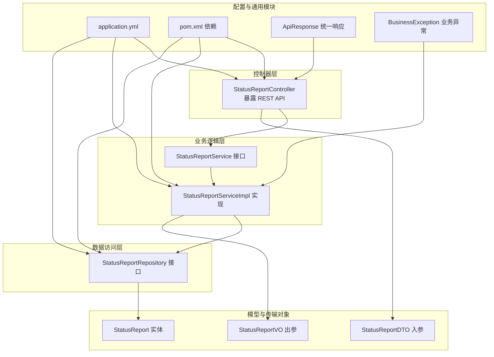
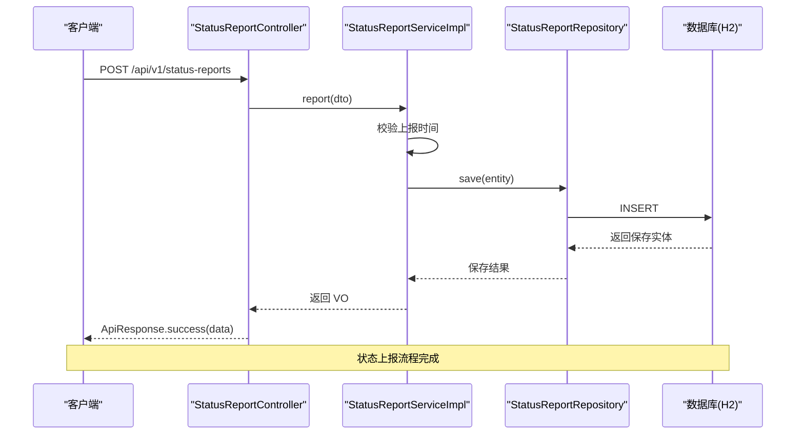
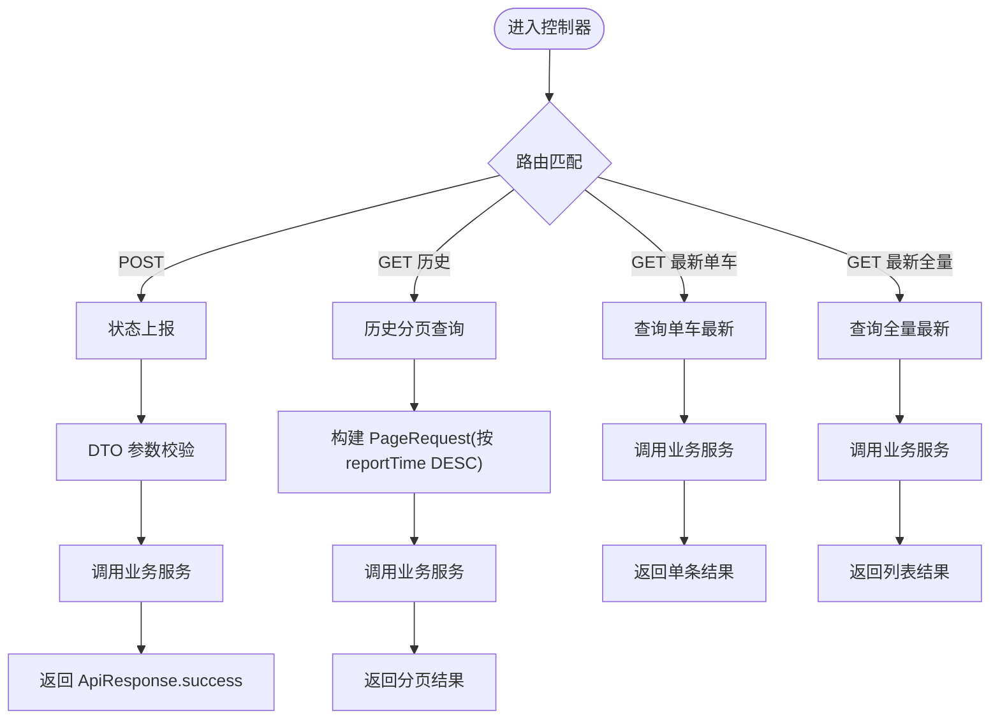
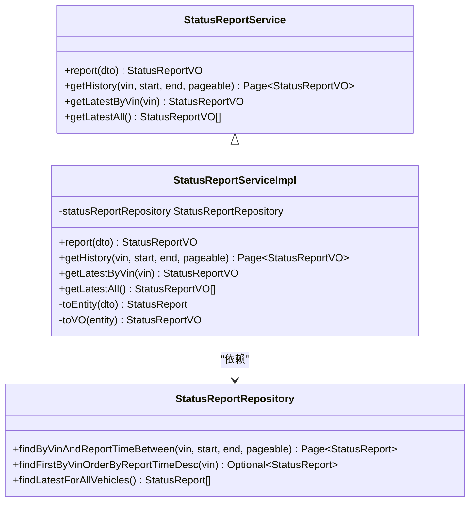
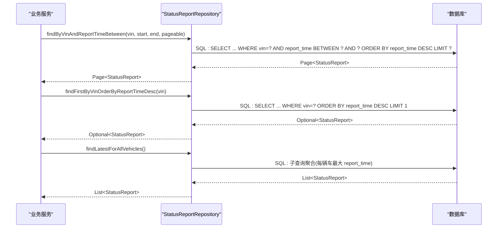
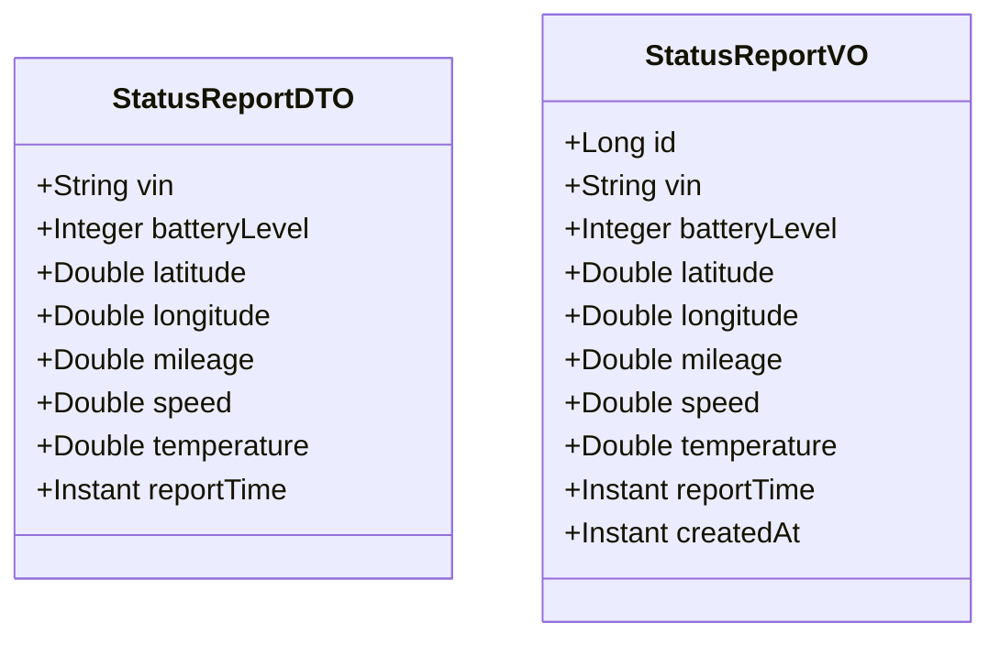
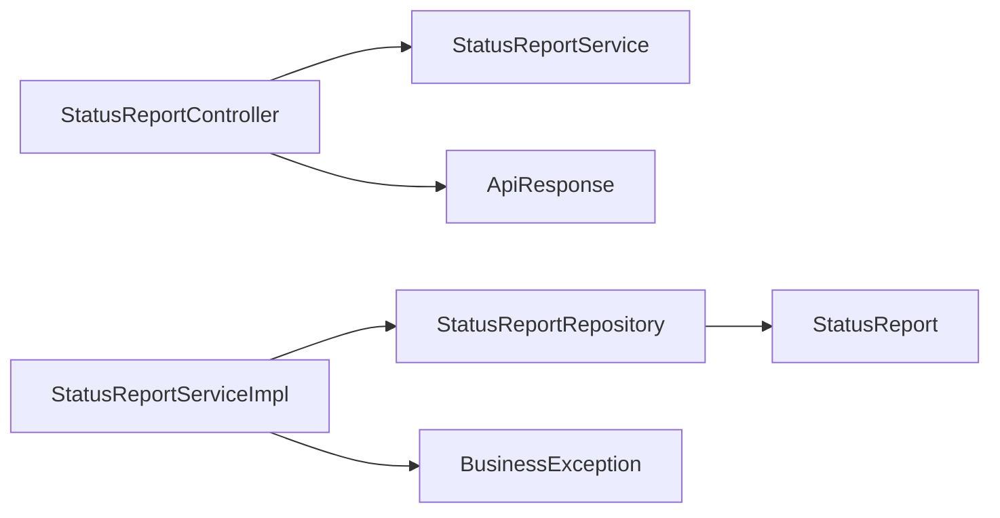

# 状态监控服务

<cite>
**本文引用的文件列表**
- [StatusReportController.java](file://vehicle-status-service/src/main/java/com/wenjie/cloud/vehiclestatus/controller/StatusReportController.java)
- [StatusReportService.java](file://vehicle-status-service/src/main/java/com/wenjie/cloud/vehiclestatus/service/StatusReportService.java)
- [StatusReportServiceImpl.java](file://vehicle-status-service/src/main/java/com/wenjie/cloud/vehiclestatus/service/impl/StatusReportServiceImpl.java)
- [StatusReportRepository.java](file://vehicle-status-service/src/main/java/com/wenjie/cloud/vehiclestatus/repository/StatusReportRepository.java)
- [StatusReport.java](file://vehicle-status-service/src/main/java/com/wenjie/cloud/vehiclestatus/entity/StatusReport.java)
- [StatusReportDTO.java](file://vehicle-status-service/src/main/java/com/wenjie/cloud/vehiclestatus/dto/StatusReportDTO.java)
- [StatusReportVO.java](file://vehicle-status-service/src/main/java/com/wenjie/cloud/vehiclestatus/dto/StatusReportVO.java)
- [application.yml](file://vehicle-status-service/src/main/resources/application.yml)
- [pom.xml](file://vehicle-status-service/pom.xml)
- [ApiResponse.java](file://vehicle-common/src/main/java/com/wenjie/cloud/common/dto/ApiResponse.java)
- [BusinessException.java](file://vehicle-common/src/main/java/com/wenjie/cloud/common/exception/BusinessException.java)
- [StatusReportControllerTest.java](file://vehicle-status-service/src/test/java/com/wenjie/cloud/vehiclestatus/controller/StatusReportControllerTest.java)
- [StatusReportServiceImplTest.java](file://vehicle-status-service/src/test/java/com/wenjie/cloud/vehiclestatus/service/impl/StatusReportServiceImplTest.java)
- [statusApi.js](file://vehicle-ui/src/api/statusApi.js)
</cite>

## 目录
1. [简介](#简介)
2. [项目结构](#项目结构)
3. [核心组件](#核心组件)
4. [架构总览](#架构总览)
5. [详细组件分析](#详细组件分析)
6. [依赖关系分析](#依赖关系分析)
7. [性能考量](#性能考量)
8. [故障排查指南](#故障排查指南)
9. [结论](#结论)
10. [附录](#附录)

## 简介
本项目为“状态监控服务”，提供车辆状态的实时上报与历史查询能力。系统采用分层架构：控制器层负责对外暴露 REST API；业务逻辑层处理状态聚合、分页查询与多维度统计；数据访问层通过 JPA 完成持久化与高效查询；实体模型定义了状态字段与时间戳管理；DTO/VO 用于请求与响应的数据传输与封装。系统还提供了统一的响应包装与业务异常处理机制，并在前端 UI 中通过 API 文件进行调用。

## 项目结构
- 控制器层：对外暴露状态上报、历史查询、最新状态查询等 REST 接口
- 业务逻辑层：实现状态上报、历史分页查询、单车最新状态、全量最新状态等核心业务
- 数据访问层：基于 Spring Data JPA 的仓库接口，支持按 VIN+时间范围分页查询、最新记录查询
- 实体模型：定义状态字段、索引与创建时间管理
- DTO/VO：输入参数校验与输出封装
- 配置与依赖：Spring Boot、JPA、H2 内存数据库、Jackson 时间格式配置



图表来源
- [StatusReportController.java:26-70](file://vehicle-status-service/src/main/java/com/wenjie/cloud/vehiclestatus/controller/StatusReportController.java#L26-L70)
- [StatusReportService.java:14-35](file://vehicle-status-service/src/main/java/com/wenjie/cloud/vehiclestatus/service/StatusReportService.java#L14-L35)
- [StatusReportServiceImpl.java:26-103](file://vehicle-status-service/src/main/java/com/wenjie/cloud/vehiclestatus/service/impl/StatusReportServiceImpl.java#L26-L103)
- [StatusReportRepository.java:16-38](file://vehicle-status-service/src/main/java/com/wenjie/cloud/vehiclestatus/repository/StatusReportRepository.java#L16-L38)
- [StatusReport.java:23-70](file://vehicle-status-service/src/main/java/com/wenjie/cloud/vehiclestatus/entity/StatusReport.java#L23-L70)
- [StatusReportDTO.java:18-60](file://vehicle-status-service/src/main/java/com/wenjie/cloud/vehiclestatus/dto/StatusReportDTO.java#L18-L60)
- [StatusReportVO.java:11-41](file://vehicle-status-service/src/main/java/com/wenjie/cloud/vehiclestatus/dto/StatusReportVO.java#L11-L41)
- [application.yml:1-30](file://vehicle-status-service/src/main/resources/application.yml#L1-L30)
- [pom.xml:18-48](file://vehicle-status-service/pom.xml#L18-L48)
- [ApiResponse.java:13-51](file://vehicle-common/src/main/java/com/wenjie/cloud/common/dto/ApiResponse.java#L13-L51)
- [BusinessException.java:12-26](file://vehicle-common/src/main/java/com/wenjie/cloud/common/exception/BusinessException.java#L12-L26)

章节来源
- [application.yml:1-30](file://vehicle-status-service/src/main/resources/application.yml#L1-L30)
- [pom.xml:18-48](file://vehicle-status-service/pom.xml#L18-L48)

## 核心组件
- 控制器层：提供状态上报、历史分页查询、单车最新状态、全量最新状态四个接口，统一返回 ApiResponse 包装
- 业务逻辑层：实现参数校验、事务控制、分页映射、最新状态聚合
- 数据访问层：提供 VIN+时间范围分页查询、单车最新查询、全量最新聚合查询
- 实体模型：定义状态字段、索引、创建时间自动填充
- DTO/VO：输入参数校验与输出封装，确保数据一致性
- 统一响应与异常：统一响应结构与业务异常码，便于前端处理

章节来源
- [StatusReportController.java:26-70](file://vehicle-status-service/src/main/java/com/wenjie/cloud/vehiclestatus/controller/StatusReportController.java#L26-L70)
- [StatusReportService.java:14-35](file://vehicle-status-service/src/main/java/com/wenjie/cloud/vehiclestatus/service/StatusReportService.java#L14-L35)
- [StatusReportServiceImpl.java:26-103](file://vehicle-status-service/src/main/java/com/wenjie/cloud/vehiclestatus/service/impl/StatusReportServiceImpl.java#L26-L103)
- [StatusReportRepository.java:16-38](file://vehicle-status-service/src/main/java/com/wenjie/cloud/vehiclestatus/repository/StatusReportRepository.java#L16-L38)
- [StatusReport.java:23-70](file://vehicle-status-service/src/main/java/com/wenjie/cloud/vehiclestatus/entity/StatusReport.java#L23-L70)
- [StatusReportDTO.java:18-60](file://vehicle-status-service/src/main/java/com/wenjie/cloud/vehiclestatus/dto/StatusReportDTO.java#L18-L60)
- [StatusReportVO.java:11-41](file://vehicle-status-service/src/main/java/com/wenjie/cloud/vehiclestatus/dto/StatusReportVO.java#L11-L41)
- [ApiResponse.java:13-51](file://vehicle-common/src/main/java/com/wenjie/cloud/common/dto/ApiResponse.java#L13-L51)
- [BusinessException.java:12-26](file://vehicle-common/src/main/java/com/wenjie/cloud/common/exception/BusinessException.java#L12-L26)

## 架构总览
系统采用经典的三层架构：
- 表现层：Spring MVC 控制器，负责接收请求、参数校验、返回统一响应
- 领域层：业务服务，封装领域规则与流程控制
- 数据访问层：JPA Repository，提供高效查询与聚合



图表来源
- [StatusReportController.java:36-39](file://vehicle-status-service/src/main/java/com/wenjie/cloud/vehiclestatus/controller/StatusReportController.java#L36-L39)
- [StatusReportServiceImpl.java:30-41](file://vehicle-status-service/src/main/java/com/wenjie/cloud/vehiclestatus/service/impl/StatusReportServiceImpl.java#L30-L41)
- [StatusReportRepository.java:21-21](file://vehicle-status-service/src/main/java/com/wenjie/cloud/vehiclestatus/repository/StatusReportRepository.java#L21-L21)

## 详细组件分析

### 控制器层：StatusReportController
- 路径前缀：/api/v1/status-reports
- 接口设计
  - POST /api/v1/status-reports：状态上报
  - GET /api/v1/status-reports：历史分页查询（按 VIN+时间范围）
  - GET /api/v1/status-reports/latest/{vin}：查询某辆车最新状态
  - GET /api/v1/status-reports/latest：查询所有车辆各自最新状态
- 参数与返回
  - 统一使用 ApiResponse<T> 包装，code=0 表示成功
  - 历史查询支持分页参数 page、size，默认升序按 reportTime 排序
  - 最新状态查询返回单条记录或列表



图表来源
- [StatusReportController.java:36-69](file://vehicle-status-service/src/main/java/com/wenjie/cloud/vehiclestatus/controller/StatusReportController.java#L36-L69)

章节来源
- [StatusReportController.java:26-70](file://vehicle-status-service/src/main/java/com/wenjie/cloud/vehiclestatus/controller/StatusReportController.java#L26-L70)

### 业务逻辑层：StatusReportService 与 StatusReportServiceImpl
- 报告接口
  - 上报时间不能晚于当前时间，否则抛出业务异常
  - 将 DTO 映射为实体并持久化，记录日志后返回 VO
- 历史查询接口
  - 校验起止时间顺序，防止非法查询
  - 使用仓库接口按 VIN+时间范围分页查询，映射为 VO 分页
- 最新状态接口
  - 单车最新：校验 VIN 格式（17 位），查询最新记录，不存在则抛异常
  - 全量最新：调用仓库聚合查询，返回每辆车最新记录列表



图表来源
- [StatusReportService.java:14-35](file://vehicle-status-service/src/main/java/com/wenjie/cloud/vehiclestatus/service/StatusReportService.java#L14-L35)
- [StatusReportServiceImpl.java:26-103](file://vehicle-status-service/src/main/java/com/wenjie/cloud/vehiclestatus/service/impl/StatusReportServiceImpl.java#L26-L103)
- [StatusReportRepository.java:16-38](file://vehicle-status-service/src/main/java/com/wenjie/cloud/vehiclestatus/repository/StatusReportRepository.java#L16-L38)

章节来源
- [StatusReportService.java:14-35](file://vehicle-status-service/src/main/java/com/wenjie/cloud/vehiclestatus/service/StatusReportService.java#L14-L35)
- [StatusReportServiceImpl.java:26-103](file://vehicle-status-service/src/main/java/com/wenjie/cloud/vehiclestatus/service/impl/StatusReportServiceImpl.java#L26-L103)

### 数据访问层：StatusReportRepository
- 方法
  - findByVinAndReportTimeBetween：按 VIN 与时间范围分页查询
  - findFirstByVinOrderByReportTimeDesc：查询某辆车最新记录
  - findLatestForAllVehicles：使用子查询聚合，获取每辆车最新记录
- 查询优化
  - 使用原生分页 Pageable，避免一次性加载大量数据
  - 子查询方式实现“每组最新”聚合，减少复杂联表



图表来源
- [StatusReportRepository.java:21-37](file://vehicle-status-service/src/main/java/com/wenjie/cloud/vehiclestatus/repository/StatusReportRepository.java#L21-L37)

章节来源
- [StatusReportRepository.java:16-38](file://vehicle-status-service/src/main/java/com/wenjie/cloud/vehiclestatus/repository/StatusReportRepository.java#L16-L38)

### 实体模型：StatusReport
- 字段定义
  - vin：17 位车辆识别码，非空
  - batteryLevel：电池电量 0~100，非空
  - latitude/longitude：经纬度，非空
  - mileage/speed/temperature：里程、速度、温度，非空
  - reportTime：上报时间，非空
  - createdAt：创建时间，插入时自动填充
- 索引
  - 在 vin 与 report_time 上建立复合索引，优化按 VIN+时间范围查询与最新记录查询

```mermaid
erDiagram
STATUS_REPORT {
bigint id PK
varchar vin
integer battery_level
double latitude
double longitude
double mileage
double speed
double temperature
timestamp report_time
timestamp created_at
}
Note for STATUS_REPORT : "索引: idx_vin_report_time(vin, report_time)"
```

图表来源
- [StatusReport.java:23-70](file://vehicle-status-service/src/main/java/com/wenjie/cloud/vehiclestatus/entity/StatusReport.java#L23-L70)

章节来源
- [StatusReport.java:23-70](file://vehicle-status-service/src/main/java/com/wenjie/cloud/vehiclestatus/entity/StatusReport.java#L23-L70)

### 数据传输对象：StatusReportDTO 与 StatusReportVO
- StatusReportDTO（入参）
  - 对 VIN 长度、电池电量范围、经纬度范围、里程与车速非负性、上报时间进行严格校验
- StatusReportVO（出参）
  - 包含实体全部字段，用于对外返回



图表来源
- [StatusReportDTO.java:18-60](file://vehicle-status-service/src/main/java/com/wenjie/cloud/vehiclestatus/dto/StatusReportDTO.java#L18-L60)
- [StatusReportVO.java:11-41](file://vehicle-status-service/src/main/java/com/wenjie/cloud/vehiclestatus/dto/StatusReportVO.java#L11-L41)

章节来源
- [StatusReportDTO.java:18-60](file://vehicle-status-service/src/main/java/com/wenjie/cloud/vehiclestatus/dto/StatusReportDTO.java#L18-L60)
- [StatusReportVO.java:11-41](file://vehicle-status-service/src/main/java/com/wenjie/cloud/vehiclestatus/dto/StatusReportVO.java#L11-L41)

### API 接口文档

- 状态上报
  - 方法：POST
  - 路径：/api/v1/status-reports
  - 请求体：StatusReportDTO
  - 响应体：ApiResponse<StatusReportVO>
  - 说明：上报时间不得晚于当前时间；VIN 必须为 17 位；各字段需满足范围约束

- 历史分页查询
  - 方法：GET
  - 路径：/api/v1/status-reports
  - 查询参数：
    - vin：车辆 VIN（必填）
    - startTime：开始时间（必填，ISO 8601）
    - endTime：结束时间（必填，ISO 8601）
    - page：页码（默认 0）
    - size：每页大小（默认 20）
  - 响应体：ApiResponse<Page<StatusReportVO>>
  - 说明：按 reportTime 降序分页返回

- 查询某辆车最新状态
  - 方法：GET
  - 路径：/api/v1/status-reports/latest/{vin}
  - 路径参数：vin（必填，17 位）
  - 响应体：ApiResponse<StatusReportVO>

- 查询所有车辆各自最新状态
  - 方法：GET
  - 路径：/api/v1/status-reports/latest
  - 响应体：ApiResponse<List<StatusReportVO>>

章节来源
- [StatusReportController.java:36-69](file://vehicle-status-service/src/main/java/com/wenjie/cloud/vehiclestatus/controller/StatusReportController.java#L36-L69)
- [StatusReportDTO.java:18-60](file://vehicle-status-service/src/main/java/com/wenjie/cloud/vehiclestatus/dto/StatusReportDTO.java#L18-L60)
- [StatusReportVO.java:11-41](file://vehicle-status-service/src/main/java/com/wenjie/cloud/vehiclestatus/dto/StatusReportVO.java#L11-L41)

## 依赖关系分析
- 控制器依赖业务服务接口，业务服务依赖仓库接口
- 仓库接口继承 JpaRepository，天然具备分页与排序能力
- 统一响应与异常由公共模块提供，保证跨模块一致性
- 依赖注入使用 Lombok 注解，简化构造函数注入



图表来源
- [StatusReportController.java:31-31](file://vehicle-status-service/src/main/java/com/wenjie/cloud/vehiclestatus/controller/StatusReportController.java#L31-L31)
- [StatusReportServiceImpl.java:28-28](file://vehicle-status-service/src/main/java/com/wenjie/cloud/vehiclestatus/service/impl/StatusReportServiceImpl.java#L28-L28)
- [StatusReportRepository.java:16-16](file://vehicle-status-service/src/main/java/com/wenjie/cloud/vehiclestatus/repository/StatusReportRepository.java#L16-L16)
- [ApiResponse.java:13-51](file://vehicle-common/src/main/java/com/wenjie/cloud/common/dto/ApiResponse.java#L13-L51)
- [BusinessException.java:12-26](file://vehicle-common/src/main/java/com/wenjie/cloud/common/exception/BusinessException.java#L12-L26)

章节来源
- [pom.xml:18-48](file://vehicle-status-service/pom.xml#L18-L48)

## 性能考量
- 查询优化
  - 复合索引 idx_vin_report_time 支持 VIN+时间范围查询与最新记录查询
  - 分页查询避免一次性加载大量数据，提升响应速度
- 事务与并发
  - 上报与查询分别使用读写事务，保证数据一致性
- 数据库选择
  - 开发环境使用 H2 内存数据库，便于快速迭代与测试
- 建议
  - 生产环境建议使用关系型数据库并开启慢查询日志
  - 对高频查询可考虑缓存最新状态，降低数据库压力
  - 合理设置分页大小，避免超大页码导致的性能问题

[本节为通用性能建议，无需特定文件引用]

## 故障排查指南
- 常见错误码
  - 3001：上报时间晚于当前时间
  - 3002：查询起始时间晚于结束时间
  - 3003：该车辆无状态数据
  - 3004：VIN 格式不正确（非 17 位）
- 排查步骤
  - 检查请求参数是否符合 DTO 校验规则
  - 确认数据库中是否存在对应 VIN 的记录
  - 查看业务异常日志与统一响应中的错误码
- 测试验证
  - 单元测试覆盖了参数校验、异常场景与分页查询
  - 可参考控制器与服务层测试用例定位问题

章节来源
- [BusinessException.java:12-26](file://vehicle-common/src/main/java/com/wenjie/cloud/common/exception/BusinessException.java#L12-L26)
- [StatusReportServiceImpl.java:33-35](file://vehicle-status-service/src/main/java/com/wenjie/cloud/vehiclestatus/service/impl/StatusReportServiceImpl.java#L33-L35)
- [StatusReportServiceImplTest.java:64-71](file://vehicle-status-service/src/test/java/com/wenjie/cloud/vehiclestatus/service/impl/StatusReportServiceImplTest.java#L64-L71)
- [StatusReportControllerTest.java:73-90](file://vehicle-status-service/src/test/java/com/wenjie/cloud/vehiclestatus/controller/StatusReportControllerTest.java#L73-L90)

## 结论
本状态监控服务以清晰的分层架构实现了车辆状态的实时上报与历史查询。通过合理的实体设计、严格的 DTO 校验、高效的仓库查询与统一的响应包装，系统具备良好的可维护性与扩展性。建议在生产环境中完善数据库与缓存策略，并持续优化查询性能与异常处理。

[本节为总结性内容，无需特定文件引用]

## 附录

### 前端调用示例
- 获取所有车辆最新状态：GET /api/v1/status-reports/latest
- 获取指定 VIN 最新状态：GET /api/v1/status-reports/latest/{vin}
- 获取历史分页：GET /api/v1/status-reports?vin=...&startTime=...&endTime=...&page=...&size=...
- 上报状态：POST /api/v1/status-reports

章节来源
- [statusApi.js:5-19](file://vehicle-ui/src/api/statusApi.js#L5-L19)