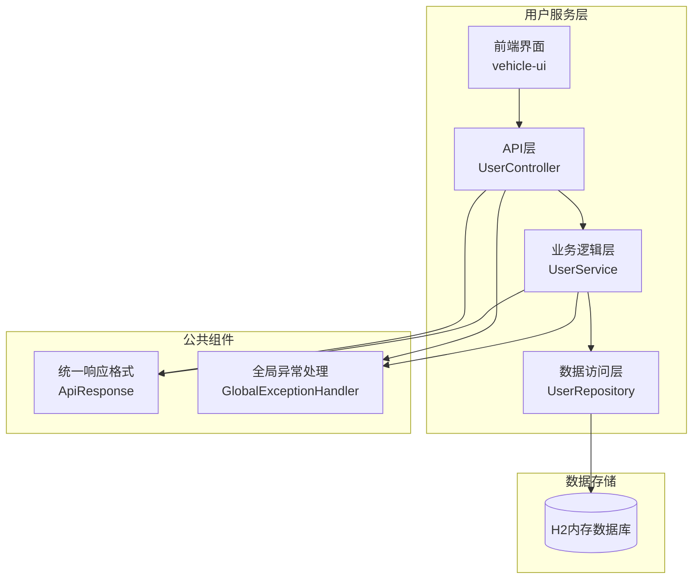
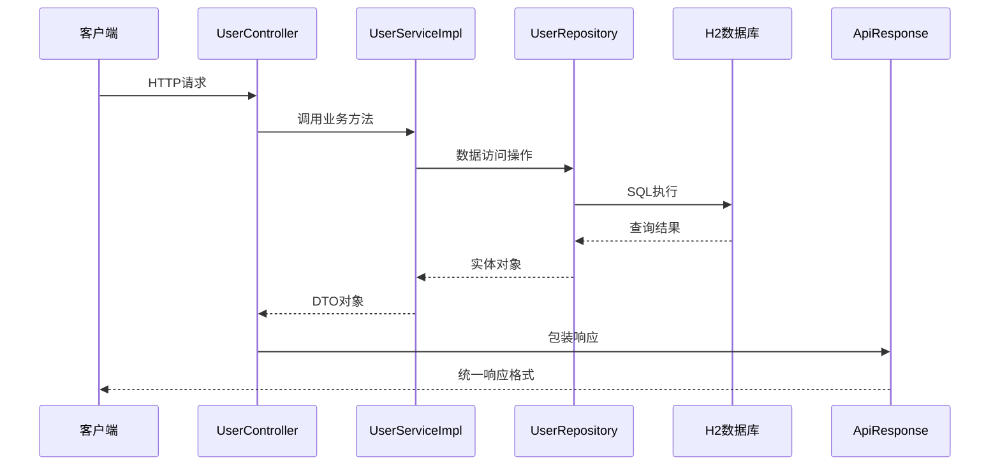
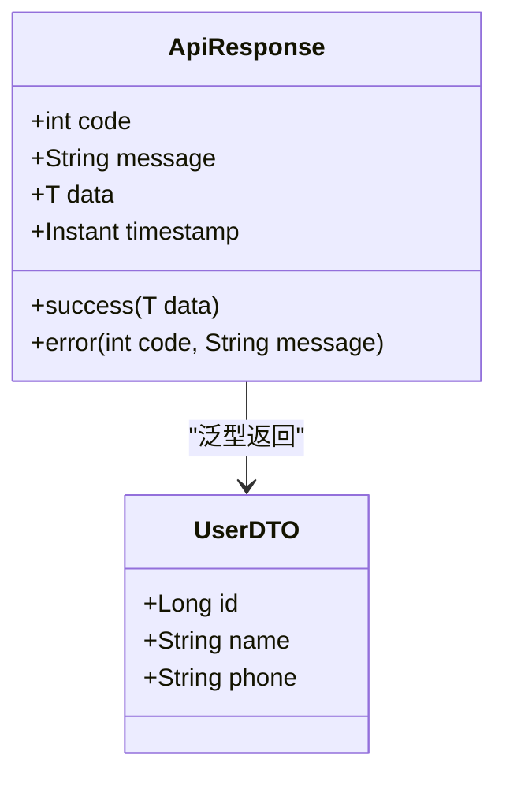
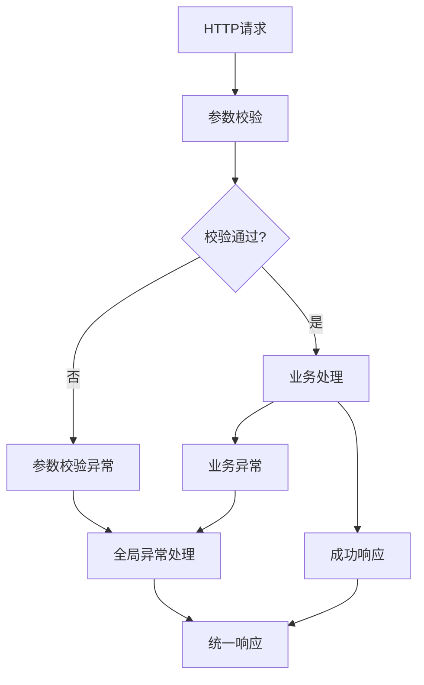

# API接口文档

<cite>
**本文档引用的文件**
- [UserController.java](file://user-service/src/main/java/com/wenjie/cloud/user/controller/UserController.java)
- [UserService.java](file://user-service/src/main/java/com/wenjie/cloud/user/service/UserService.java)
- [UserServiceImpl.java](file://user-service/src/main/java/com/wenjie/cloud/user/service/impl/UserServiceImpl.java)
- [UserDTO.java](file://user-service/src/main/java/com/wenjie/cloud/user/dto/UserDTO.java)
- [User.java](file://user-service/src/main/java/com/wenjie/cloud/user/entity/User.java)
- [UserRepository.java](file://user-service/src/main/java/com/wenjie/cloud/user/repository/UserRepository.java)
- [ApiResponse.java](file://vehicle-common/src/main/java/com/wenjie/cloud/common/dto/ApiResponse.java)
- [GlobalExceptionHandler.java](file://vehicle-common/src/main/java/com/wenjie/cloud/common/exception/GlobalExceptionHandler.java)
- [application.yml](file://user-service/src/main/resources/application.yml)
- [data.sql](file://user-service/src/main/resources/data.sql)
- [userApi.js](file://vehicle-ui/src/api/userApi.js)
- [UserList.jsx](file://vehicle-ui/src/pages/UserList.jsx)
</cite>

## 目录
1. [简介](#简介)
2. [项目结构](#项目结构)
3. [核心组件](#核心组件)
4. [架构概览](#架构概览)
5. [详细API规范](#详细api规范)
6. [统一响应格式](#统一响应格式)
7. [错误处理机制](#错误处理机制)
8. [性能考虑](#性能考虑)
9. [故障排除指南](#故障排除指南)
10. [结论](#结论)

## 简介

本文件为用户管理服务的完整API接口文档，基于Spring Boot微服务架构实现。该服务提供了完整的用户生命周期管理功能，包括用户创建、查询、列表展示和删除操作。系统采用统一的响应格式和异常处理机制，确保API的一致性和可靠性。

## 项目结构

用户管理服务采用标准的三层架构设计，包含以下主要模块：



**图表来源**
- [UserController.java:1-60](file://user-service/src/main/java/com/wenjie/cloud/user/controller/UserController.java#L1-L60)
- [UserService.java:1-32](file://user-service/src/main/java/com/wenjie/cloud/user/service/UserService.java#L1-L32)
- [UserRepository.java:1-23](file://user-service/src/main/java/com/wenjie/cloud/user/repository/UserRepository.java#L1-L23)

**章节来源**
- [application.yml:1-40](file://user-service/src/main/resources/application.yml#L1-L40)

## 核心组件

### 控制器层 (UserController)
负责处理HTTP请求和响应，提供RESTful API接口。控制器层通过依赖注入使用UserService进行业务逻辑处理。

### 服务层 (UserService)
定义用户管理的核心业务接口，包括用户创建、查询、列表展示和删除等操作。

### 数据访问层 (UserRepository)
继承Spring Data JPA的JpaRepository接口，提供用户数据的持久化操作。

### 实体模型 (User)
使用JPA注解映射到数据库表`app_user`，包含用户的基本信息字段。

**章节来源**
- [UserController.java:1-60](file://user-service/src/main/java/com/wenjie/cloud/user/controller/UserController.java#L1-L60)
- [UserService.java:1-32](file://user-service/src/main/java/com/wenjie/cloud/user/service/UserService.java#L1-L32)
- [UserRepository.java:1-23](file://user-service/src/main/java/com/wenjie/cloud/user/repository/UserRepository.java#L1-L23)
- [User.java:1-38](file://user-service/src/main/java/com/wenjie/cloud/user/entity/User.java#L1-L38)

## 架构概览



**图表来源**
- [UserController.java:21-60](file://user-service/src/main/java/com/wenjie/cloud/user/controller/UserController.java#L21-L60)
- [UserServiceImpl.java:17-80](file://user-service/src/main/java/com/wenjie/cloud/user/service/impl/UserServiceImpl.java#L17-L80)
- [ApiResponse.java:7-52](file://vehicle-common/src/main/java/com/wenjie/cloud/common/dto/ApiResponse.java#L7-L52)

## 详细API规范

### 基础信息

- **基础URL**: `/api/v1/users`
- **版本**: v1
- **端口**: 8082
- **数据格式**: JSON
- **字符编码**: UTF-8

### 统一响应格式

所有API响应都遵循统一的ApiResponse格式：



**图表来源**
- [ApiResponse.java:8-52](file://vehicle-common/src/main/java/com/wenjie/cloud/common/dto/ApiResponse.java#L8-L52)
- [UserDTO.java:8-25](file://user-service/src/main/java/com/wenjie/cloud/user/dto/UserDTO.java#L8-L25)

### 用户创建API

#### 接口描述
创建新用户，支持手机号唯一性验证和数据完整性检查。

#### HTTP请求
- **方法**: `POST`
- **路径**: `/api/v1/users`
- **认证**: 需要API密钥或会话令牌

#### 请求头
- `Content-Type: application/json`
- `Accept: application/json`

#### 请求体参数

| 参数名 | 类型 | 必填 | 描述 | 校验规则 |
|--------|------|------|------|----------|
| name | String | 是 | 用户姓名 | 非空，长度限制64字符 |
| phone | String | 是 | 手机号码 | 非空，必须为11位数字，格式为^1\d{10}$ |

#### 请求体示例
```json
{
  "name": "张三",
  "phone": "13800000001"
}
```

#### 成功响应
- **状态码**: 200
- **响应体**: ApiResponse<UserDTO>

```json
{
  "code": 0,
  "message": "success",
  "data": {
    "id": 1,
    "name": "张三",
    "phone": "13800000001"
  },
  "timestamp": "2024-01-01T10:00:00Z"
}
```

#### 失败响应
- **状态码**: 400 或 500
- **响应体**: ApiResponse<Void>

```json
{
  "code": 400,
  "message": "姓名不能为空",
  "data": null,
  "timestamp": "2024-01-01T10:00:00Z"
}
```

#### 错误码说明
- **2001**: 手机号已存在
- **400**: 参数校验失败
- **500**: 系统内部错误

**章节来源**
- [UserController.java:28-34](file://user-service/src/main/java/com/wenjie/cloud/user/controller/UserController.java#L28-L34)
- [UserServiceImpl.java:27-42](file://user-service/src/main/java/com/wenjie/cloud/user/service/impl/UserServiceImpl.java#L27-L42)
- [UserDTO.java:16-23](file://user-service/src/main/java/com/wenjie/cloud/user/dto/UserDTO.java#L16-L23)

### 用户查询API

#### 接口描述
根据用户ID查询单个用户信息。

#### HTTP请求
- **方法**: `GET`
- **路径**: `/api/v1/users/{id}`

#### 路径参数

| 参数名 | 类型 | 必填 | 描述 |
|--------|------|------|------|
| id | Long | 是 | 用户唯一标识符 |

#### 成功响应
- **状态码**: 200
- **响应体**: ApiResponse<UserDTO>

```json
{
  "code": 0,
  "message": "success",
  "data": {
    "id": 1,
    "name": "小王",
    "phone": "13800000001"
  },
  "timestamp": "2024-01-01T10:00:00Z"
}
```

#### 失败响应
- **状态码**: 404
- **响应体**: ApiResponse<Void>

```json
{
  "code": 2002,
  "message": "用户不存在, id=999",
  "data": null,
  "timestamp": "2024-01-01T10:00:00Z"
}
```

**章节来源**
- [UserController.java:36-42](file://user-service/src/main/java/com/wenjie/cloud/user/controller/UserController.java#L36-L42)
- [UserServiceImpl.java:44-50](file://user-service/src/main/java/com/wenjie/cloud/user/service/impl/UserServiceImpl.java#L44-L50)

### 用户列表查询API

#### 接口描述
获取所有用户列表，支持分页和排序功能。

#### HTTP请求
- **方法**: `GET`
- **路径**: `/api/v1/users`

#### 查询参数
- **无** 特定查询参数

#### 成功响应
- **状态码**: 200
- **响应体**: ApiResponse<List<UserDTO>>

```json
{
  "code": 0,
  "message": "success",
  "data": [
    {
      "id": 1,
      "name": "小王",
      "phone": "13800000001"
    },
    {
      "id": 2,
      "name": "小李",
      "phone": "13800000002"
    }
  ],
  "timestamp": "2024-01-01T10:00:00Z"
}
```

#### 分页处理
当前实现返回所有用户数据，如需分页可在服务层添加分页参数。

**章节来源**
- [UserController.java:44-50](file://user-service/src/main/java/com/wenjie/cloud/user/controller/UserController.java#L44-L50)
- [UserServiceImpl.java:52-58](file://user-service/src/main/java/com/wenjie/cloud/user/service/impl/UserServiceImpl.java#L52-L58)

### 用户删除API

#### 接口描述
根据用户ID删除用户，支持软删除或硬删除策略。

#### HTTP请求
- **方法**: `DELETE`
- **路径**: `/api/v1/users/{id}`

#### 路径参数

| 参数名 | 类型 | 必填 | 描述 |
|--------|------|------|------|
| id | Long | 是 | 用户唯一标识符 |

#### 成功响应
- **状态码**: 200
- **响应体**: ApiResponse<Void>

```json
{
  "code": 0,
  "message": "success",
  "data": null,
  "timestamp": "2024-01-01T10:00:00Z"
}
```

#### 失败响应
- **状态码**: 404
- **响应体**: ApiResponse<Void>

```json
{
  "code": 2002,
  "message": "用户不存在, id=999",
  "data": null,
  "timestamp": "2024-01-01T10:00:00Z"
}
```

#### 删除注意事项
- 删除操作不可逆，请谨慎操作
- 删除前建议检查是否有相关联的数据
- 系统会记录删除日志便于审计

**章节来源**
- [UserController.java:52-59](file://user-service/src/main/java/com/wenjie/cloud/user/controller/UserController.java#L52-L59)
- [UserServiceImpl.java:60-68](file://user-service/src/main/java/com/wenjie/cloud/user/service/impl/UserServiceImpl.java#L60-L68)

## 统一响应格式

### 响应结构

ApiResponse<T> 提供了标准化的响应格式，确保所有API的一致性：

| 字段名 | 类型 | 描述 | 示例值 |
|--------|------|------|--------|
| code | Integer | 业务状态码，0表示成功 | 0 |
| message | String | 提示信息 | "success" |
| data | T | 响应数据，泛型类型 | UserDTO对象 |
| timestamp | Instant | 响应时间戳 | "2024-01-01T10:00:00Z" |

### 状态码规范

| 状态码 | 含义 | 使用场景 |
|--------|------|----------|
| 0 | 成功 | 所有成功的业务操作 |
| 2001 | 业务异常 | 业务逻辑验证失败 |
| 2002 | 资源不存在 | 查询或删除时资源不存在 |
| 400 | 参数错误 | 参数校验失败 |
| 500 | 系统错误 | 服务器内部异常 |

**章节来源**
- [ApiResponse.java:7-52](file://vehicle-common/src/main/java/com/wenjie/cloud/common/dto/ApiResponse.java#L7-L52)

## 错误处理机制

### 异常分类

系统采用分层异常处理机制：



**图表来源**
- [GlobalExceptionHandler.java:13-56](file://vehicle-common/src/main/java/com/wenjie/cloud/common/exception/GlobalExceptionHandler.java#L13-L56)

### 异常处理流程

1. **参数校验异常**: 使用`@Valid`注解触发，返回400状态码
2. **业务异常**: 自定义BusinessException，返回2001状态码
3. **系统异常**: 未捕获的运行时异常，返回500状态码

### 错误响应示例

```json
{
  "code": 400,
  "message": "name: 姓名不能为空; phone: 手机号格式不正确",
  "data": null,
  "timestamp": "2024-01-01T10:00:00Z"
}
```

**章节来源**
- [GlobalExceptionHandler.java:23-54](file://vehicle-common/src/main/java/com/wenjie/cloud/common/exception/GlobalExceptionHandler.java#L23-L54)

## 性能考虑

### 数据库优化
- 使用H2内存数据库进行开发测试，性能优异
- 支持SQL语句格式化和调试输出
- 自动DDL创建和数据初始化

### 缓存策略
- 当前实现未集成缓存层
- 建议对高频查询接口添加Redis缓存
- 用户列表可考虑分页缓存策略

### 并发处理
- 事务管理确保数据一致性
- 线程安全的响应格式设计
- 异步处理潜在的耗时操作

## 故障排除指南

### 常见问题及解决方案

#### 1. 数据库连接问题
**症状**: 应用启动失败，显示数据库连接错误
**解决方案**: 
- 检查H2数据库配置
- 确认端口8082未被占用
- 验证数据库驱动版本

#### 2. 参数校验失败
**症状**: 返回400状态码和校验错误信息
**解决方案**:
- 检查请求体格式是否为JSON
- 验证必填字段是否完整
- 确认手机号格式符合11位数字要求

#### 3. 用户不存在
**症状**: 查询或删除用户时返回2002错误
**解决方案**:
- 确认用户ID是否存在
- 检查数据库中用户数据
- 验证用户ID类型是否为Long

### 调试工具
- **H2 Console**: 访问`http://localhost:8082/h2-console`查看数据库
- **日志级别**: 设置为DEBUG级别便于问题排查
- **SQL输出**: 开启show-sql便于SQL调试

**章节来源**
- [application.yml:37-40](file://user-service/src/main/resources/application.yml#L37-L40)

## 结论

用户管理服务提供了完整、一致且可靠的RESTful API接口。通过统一的响应格式和异常处理机制，确保了系统的稳定性和可维护性。服务支持基本的CRUD操作，并具备良好的扩展性，可以轻松添加分页、搜索、权限控制等功能。

建议后续优化方向：
1. 添加用户分页查询功能
2. 集成Redis缓存提升性能
3. 添加用户权限和角色管理
4. 增强API文档的自动化生成
5. 添加监控和日志分析功能