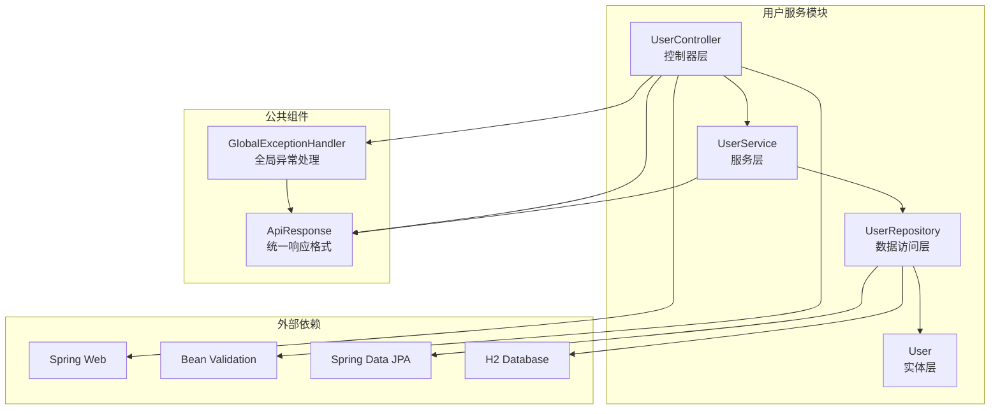
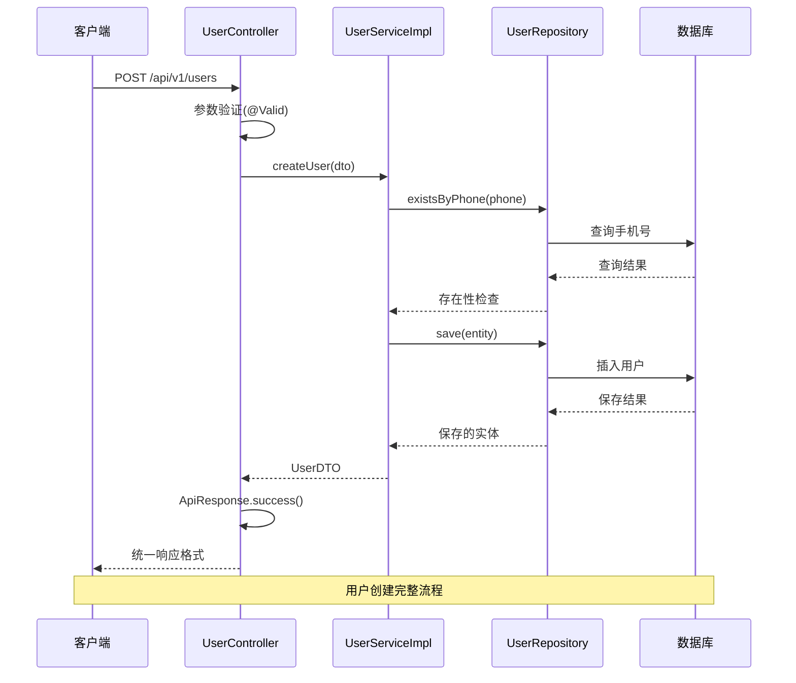
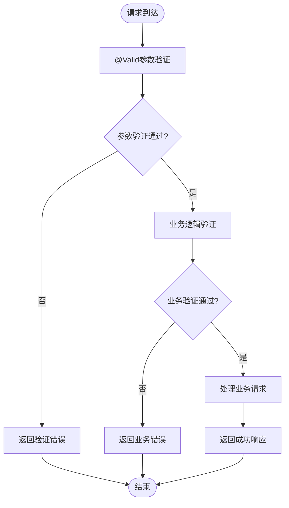
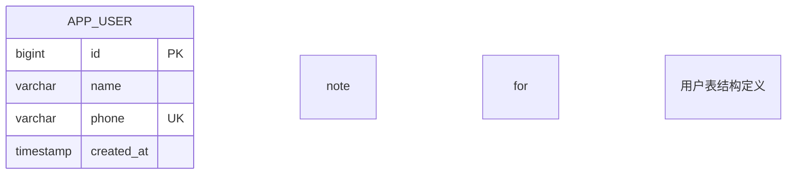
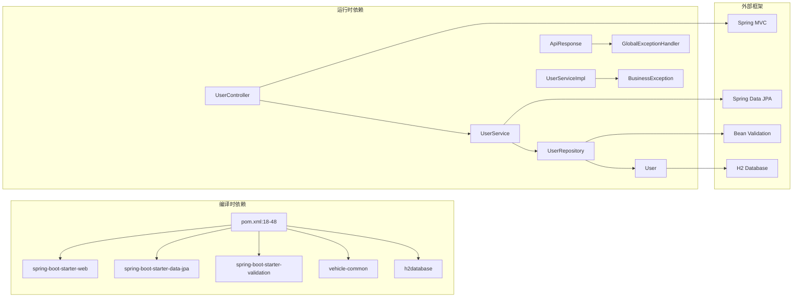

# 控制器层设计

<cite>
**本文档引用的文件**
- [UserController.java](file://user-service/src/main/java/com/wenjie/cloud/user/controller/UserController.java)
- [UserDTO.java](file://user-service/src/main/java/com/wenjie/cloud/user/dto/UserDTO.java)
- [ApiResponse.java](file://vehicle-common/src/main/java/com/wenjie/cloud/common/dto/ApiResponse.java)
- [UserService.java](file://user-service/src/main/java/com/wenjie/cloud/user/service/UserService.java)
- [UserServiceImpl.java](file://user-service/src/main/java/com/wenjie/cloud/user/service/impl/UserServiceImpl.java)
- [GlobalExceptionHandler.java](file://vehicle-common/src/main/java/com/wenjie/cloud/common/exception/GlobalExceptionHandler.java)
- [User.java](file://user-service/src/main/java/com/wenjie/cloud/user/entity/User.java)
- [application.yml](file://user-service/src/main/resources/application.yml)
- [pom.xml](file://user-service/pom.xml)
</cite>

## 目录
1. [简介](#简介)
2. [项目结构](#项目结构)
3. [核心组件](#核心组件)
4. [架构概览](#架构概览)
5. [详细组件分析](#详细组件分析)
6. [依赖关系分析](#依赖关系分析)
7. [性能考虑](#性能考虑)
8. [故障排除指南](#故障排除指南)
9. [结论](#结论)

## 简介

本文档详细介绍了用户管理服务控制器层的设计架构，重点分析了UserController类的REST API接口设计、HTTP方法映射和URL路径配置。该控制器实现了完整的用户生命周期管理功能，包括用户创建、查询、列表展示和删除操作。通过统一的ApiResponse响应格式和完善的参数验证机制，确保了系统的健壮性和一致性。

## 项目结构

用户管理服务采用标准的Spring Boot分层架构，控制器层位于`user-service`模块中，与公共组件分离，体现了良好的模块化设计。

**图表来源**
- [UserController.java:1-60](file://user-service/src/main/java/com/wenjie/cloud/user/controller/UserController.java#L1-L60)
- [UserService.java:1-32](file://user-service/src/main/java/com/wenjie/cloud/user/service/UserService.java#L1-L32)
- [UserServiceImpl.java:1-80](file://user-service/src/main/java/com/wenjie/cloud/user/service/impl/UserServiceImpl.java#L1-L80)

**章节来源**
- [pom.xml:18-48](file://user-service/pom.xml#L18-L48)
- [application.yml:1-40](file://user-service/src/main/resources/application.yml#L1-L40)

## 核心组件

### UserController控制器类

UserController是用户管理服务的核心控制器，采用@RestController注解提供RESTful API接口。该类通过@RequestMapping("/api/v1/users")定义了统一的API前缀，实现了版本化的API设计。

**主要特性：**
- 使用Lombok的@RequiredArgsConstructor简化依赖注入
- 实现了完整的CRUD操作接口
- 采用统一的ApiResponse响应格式
- 集成了参数验证机制

**章节来源**
- [UserController.java:21-24](file://user-service/src/main/java/com/wenjie/cloud/user/controller/UserController.java#L21-L24)

### UserDTO数据传输对象

UserDTO作为用户数据的传输载体，包含了用户的基本信息字段，并应用了严格的验证规则。

**字段定义：**
- `id`: 用户唯一标识符（自动生成）
- `name`: 用户姓名，必填验证
- `phone`: 手机号码，必填且符合11位手机号格式

**验证规则：**
- 使用@NotBlank确保字段非空
- 使用@Pattern验证手机号格式（1开头的11位数字）

**章节来源**
- [UserDTO.java:11-24](file://user-service/src/main/java/com/wenjie/cloud/user/dto/UserDTO.java#L11-L24)

### ApiResponse统一响应格式

ApiResponse提供了标准化的API响应结构，确保所有接口返回一致的数据格式。

**响应结构：**
- `code`: 业务状态码，0表示成功
- `message`: 提示信息
- `data`: 响应数据
- `timestamp`: 响应时间戳

**静态工厂方法：**
- `success(T data)`: 快速创建成功响应
- `error(int code, String message)`: 创建错误响应

**章节来源**
- [ApiResponse.java:13-51](file://vehicle-common/src/main/java/com/wenjie/cloud/common/dto/ApiResponse.java#L13-L51)

## 架构概览

用户管理服务采用了经典的三层架构模式，控制器层负责处理HTTP请求，服务层实现业务逻辑，数据访问层负责数据持久化。

**图表来源**
- [UserController.java:31-34](file://user-service/src/main/java/com/wenjie/cloud/user/controller/UserController.java#L31-L34)
- [UserServiceImpl.java:29-42](file://user-service/src/main/java/com/wenjie/cloud/user/service/impl/UserServiceImpl.java#L29-L42)

**章节来源**
- [UserService.java:10-31](file://user-service/src/main/java/com/wenjie/cloud/user/service/UserService.java#L10-L31)
- [UserServiceImpl.java:20-23](file://user-service/src/main/java/com/wenjie/cloud/user/service/impl/UserServiceImpl.java#L20-L23)

## 详细组件分析

### REST API接口设计

UserController实现了四个核心API端点，每个端点都遵循RESTful设计原则：

#### 用户创建接口
- **HTTP方法**: POST
- **URL路径**: `/api/v1/users`
- **功能**: 创建新用户
- **请求体**: UserDTO对象
- **响应**: ApiResponse<UserDTO>

#### 用户查询接口
- **HTTP方法**: GET
- **URL路径**: `/api/v1/users/{id}`
- **功能**: 根据ID查询用户详情
- **路径参数**: id (Long类型)
- **响应**: ApiResponse<UserDTO>

#### 用户列表查询接口
- **HTTP方法**: GET
- **URL路径**: `/api/v1/users`
- **功能**: 获取用户列表
- **响应**: ApiResponse<List<UserDTO>>

#### 用户删除接口
- **HTTP方法**: DELETE
- **URL路径**: `/api/v1/users/{id}`
- **功能**: 根据ID删除用户
- **路径参数**: id (Long类型)
- **响应**: ApiResponse<Void>

**章节来源**
- [UserController.java:28-60](file://user-service/src/main/java/com/wenjie/cloud/user/controller/UserController.java#L28-L60)

### 参数验证机制

系统采用了多层次的参数验证机制，确保数据的完整性和有效性。

#### Bean Validation集成
- 在UserController中使用@Valid注解启用参数验证
- UserDTO应用了@NotBlank和@Pattern验证注解
- Spring MVC自动拦截验证异常并转换为统一响应

#### 自定义业务验证
- UserServiceImpl中实现了业务层面的验证逻辑
- 检查手机号唯一性，避免重复注册
- 用户存在性验证，防止对不存在用户的操作

**图表来源**
- [UserController.java:32](file://user-service/src/main/java/com/wenjie/cloud/user/controller/UserController.java#L32)
- [UserServiceImpl.java:30-32](file://user-service/src/main/java/com/wenjie/cloud/user/service/impl/UserServiceImpl.java#L30-L32)

**章节来源**
- [UserDTO.java:17-23](file://user-service/src/main/java/com/wenjie/cloud/user/dto/UserDTO.java#L17-L23)
- [GlobalExceptionHandler.java:36-44](file://vehicle-common/src/main/java/com/wenjie/cloud/common/exception/GlobalExceptionHandler.java#L36-L44)

### 错误处理机制

系统实现了完善的异常处理机制，通过GlobalExceptionHandler统一处理各种异常情况。

#### 异常分类处理
- **BusinessException**: 业务异常，返回400状态码
- **MethodArgumentNotValidException**: 参数验证异常，返回400状态码  
- **其他异常**: 系统异常，返回500状态码

#### 统一错误响应
所有异常都会被转换为ApiResponse格式，确保客户端接收到一致的错误信息结构。

**章节来源**
- [GlobalExceptionHandler.java:26-54](file://vehicle-common/src/main/java/com/wenjie/cloud/common/exception/GlobalExceptionHandler.java#L26-L54)

### 数据模型设计

User实体类定义了用户在数据库中的存储结构，采用了JPA注解进行映射配置。

**图表来源**
- [User.java:18-37](file://user-service/src/main/java/com/wenjie/cloud/user/entity/User.java#L18-L37)

**章节来源**
- [User.java:16-37](file://user-service/src/main/java/com/wenjie/cloud/user/entity/User.java#L16-L37)

## 依赖关系分析

用户管理服务的依赖关系清晰明确，体现了良好的分层架构设计。

**图表来源**
- [pom.xml:18-48](file://user-service/pom.xml#L18-L48)
- [UserController.java:3-6](file://user-service/src/main/java/com/wenjie/cloud/user/controller/UserController.java#L3-L6)

**章节来源**
- [pom.xml:1-61](file://user-service/pom.xml#L1-L61)

## 性能考虑

### 数据库优化
- 使用H2内存数据库进行开发和测试，提高响应速度
- 采用延迟数据源初始化，优化启动性能
- 启用SQL格式化输出，便于调试和性能分析

### 缓存策略
- 当前实现未包含缓存层，对于高频查询可考虑添加Redis缓存
- 用户列表查询可考虑分页机制，避免一次性加载大量数据

### 并发控制
- 使用@Transactional注解确保数据一致性
- 对于高并发场景，可考虑添加乐观锁机制

## 故障排除指南

### 常见问题诊断

#### API调用失败
- 检查URL路径是否正确（/api/v1/users）
- 确认HTTP方法与端点定义匹配
- 验证请求头Content-Type设置为application/json

#### 参数验证错误
- 确保UserDTO中的name和phone字段均非空
- 手机号必须符合11位数字格式（以1开头）
- 检查JSON格式是否正确

#### 业务逻辑错误
- 手机号重复：检查是否存在相同手机号的用户
- 用户不存在：确认用户ID的有效性
- 数据库连接问题：检查H2数据库配置

**章节来源**
- [GlobalExceptionHandler.java:26-54](file://vehicle-common/src/main/java/com/wenjie/cloud/common/exception/GlobalExceptionHandler.java#L26-L54)

### 调试建议

1. **启用详细日志**：查看application.yml中的logging配置
2. **使用H2 Console**：通过/h2-console监控数据库状态
3. **检查事务配置**：确认@Transactional注解正确使用
4. **验证依赖注入**：确保UserService正确注入到Controller

## 结论

用户管理服务控制器层设计体现了现代Spring Boot应用的最佳实践。通过清晰的分层架构、统一的响应格式、完善的参数验证和异常处理机制，构建了一个健壮、可维护的RESTful API服务。

**关键优势：**
- 标准化的API设计，易于客户端集成
- 统一的错误处理机制，提升用户体验
- 严格的参数验证，确保数据质量
- 清晰的依赖关系，便于维护和扩展

**改进建议：**
- 添加API文档生成（如Swagger）
- 实现分页查询支持大数据量场景
- 考虑添加缓存机制提升性能
- 增加更多的业务场景测试用例