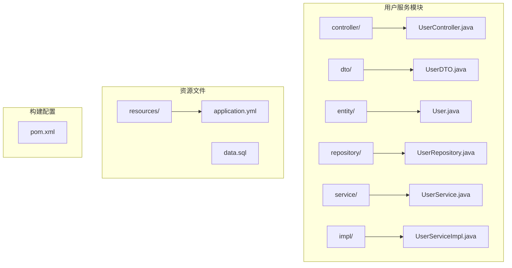
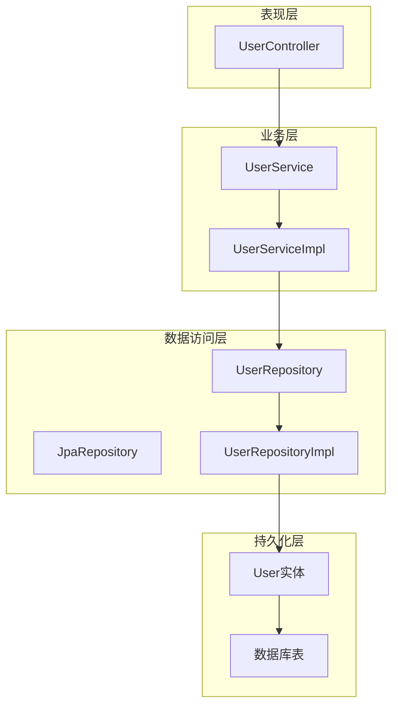
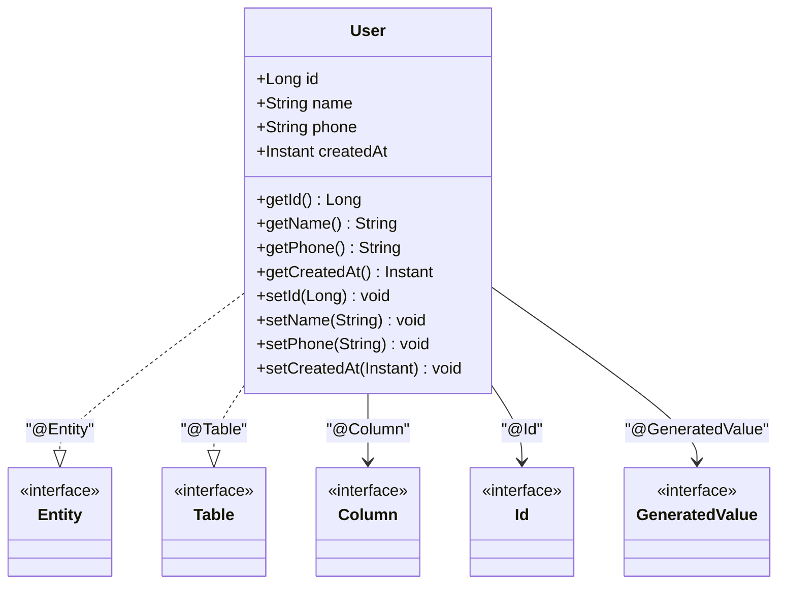
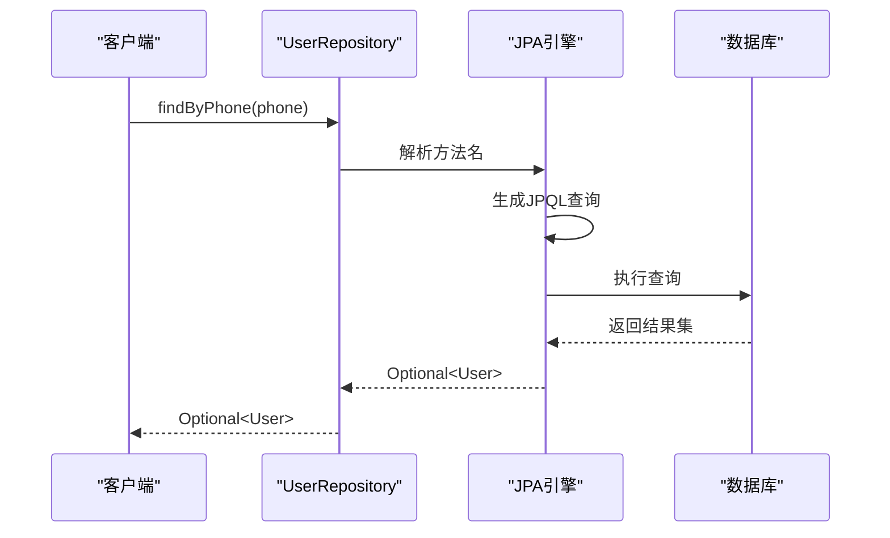
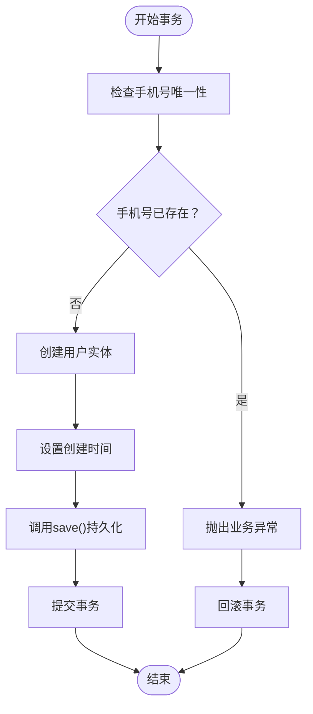
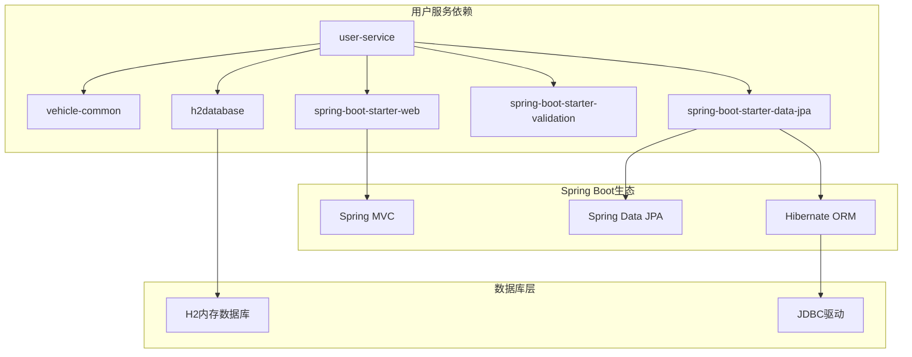

# 数据访问层设计

<cite>
**本文档引用的文件**
- [User.java](file://user-service/src/main/java/com/wenjie/cloud/user/entity/User.java)
- [UserRepository.java](file://user-service/src/main/java/com/wenjie/cloud/user/repository/UserRepository.java)
- [UserServiceImpl.java](file://user-service/src/main/java/com/wenjie/cloud/user/service/impl/UserServiceImpl.java)
- [application.yml](file://user-service/src/main/resources/application.yml)
- [data.sql](file://user-service/src/main/resources/data.sql)
- [UserDTO.java](file://user-service/src/main/java/com/wenjie/cloud/user/dto/UserDTO.java)
- [UserController.java](file://user-service/src/main/java/com/wenjie/cloud/user/controller/UserController.java)
- [UserService.java](file://user-service/src/main/java/com/wenjie/cloud/user/service/UserService.java)
- [pom.xml](file://user-service/pom.xml)
</cite>

## 目录
1. [简介](#简介)
2. [项目结构](#项目结构)
3. [核心组件](#核心组件)
4. [架构概览](#架构概览)
5. [详细组件分析](#详细组件分析)
6. [依赖关系分析](#依赖关系分析)
7. [性能考虑](#性能考虑)
8. [故障排除指南](#故障排除指南)
9. [结论](#结论)

## 简介

本文件详细阐述了用户管理系统的数据访问层设计，重点分析了Spring Data JPA在用户管理场景中的应用。该系统采用分层架构设计，其中数据访问层通过JPA Repository接口实现对用户实体的持久化操作，结合Spring Boot自动配置和H2内存数据库，提供了完整的CRUD功能实现。

## 项目结构

用户管理服务位于独立的服务模块中，采用标准的Spring Boot项目结构：



**图表来源**
- [User.java:1-38](file://user-service/src/main/java/com/wenjie/cloud/user/entity/User.java#L1-L38)
- [UserRepository.java:1-23](file://user-service/src/main/java/com/wenjie/cloud/user/repository/UserRepository.java#L1-L23)
- [UserServiceImpl.java:1-80](file://user-service/src/main/java/com/wenjie/cloud/user/service/impl/UserServiceImpl.java#L1-L80)

**章节来源**
- [User.java:1-38](file://user-service/src/main/java/com/wenjie/cloud/user/entity/User.java#L1-L38)
- [UserRepository.java:1-23](file://user-service/src/main/java/com/wenjie/cloud/user/repository/UserRepository.java#L1-L23)
- [UserServiceImpl.java:1-80](file://user-service/src/main/java/com/wenjie/cloud/user/service/impl/UserServiceImpl.java#L1-L80)

## 核心组件

### 实体层设计

用户实体类采用JPA注解进行数据库映射，实现了完整的用户信息存储需求：

#### 主键映射
- 使用`@Id`注解标识主键字段
- 采用`@GeneratedValue(strategy = GenerationType.IDENTITY)`实现自增主键
- 对应数据库的自增列特性

#### 字段映射与约束
- `name`字段：长度64字符，不可为空
- `phone`字段：11位手机号码，不可为空且唯一
- `createdAt`字段：记录创建时间，不可更新

#### 时间戳处理
- 使用Java 8时间API的`Instant`类型
- 自动处理时区转换和精度要求

**章节来源**
- [User.java:16-37](file://user-service/src/main/java/com/wenjie/cloud/user/entity/User.java#L16-L37)

### Repository接口设计

UserRepository继承Spring Data JPA的JpaRepository接口，提供基础的CRUD操作和扩展查询方法：

#### 基础继承关系
- 继承JpaRepository<User, Long>获得完整的基础操作
- 支持泛型参数：实体类型和主键类型

#### 扩展查询方法
- `findByPhone(String phone)`：根据手机号查询用户
- `existsByPhone(String phone)`：检查手机号是否存在

**章节来源**
- [UserRepository.java:11-22](file://user-service/src/main/java/com/wenjie/cloud/user/repository/UserRepository.java#L11-L22)

### 服务层实现

UserServiceImpl类实现了业务逻辑处理，包含事务管理和错误处理：

#### 事务管理
- 使用`@Transactional`注解确保数据一致性
- 区分读写操作的事务属性设置

#### 业务验证
- 在创建用户前检查手机号唯一性
- 处理用户不存在的情况

#### 数据转换
- 提供实体与DTO之间的转换方法
- 确保对外暴露的数据结构安全

**章节来源**
- [UserServiceImpl.java:25-78](file://user-service/src/main/java/com/wenjie/cloud/user/service/impl/UserServiceImpl.java#L25-L78)

## 架构概览

系统采用经典的三层架构模式，数据访问层通过JPA实现与数据库的交互：



**图表来源**
- [UserController.java:21-60](file://user-service/src/main/java/com/wenjie/cloud/user/controller/UserController.java#L21-L60)
- [UserService.java:10-31](file://user-service/src/main/java/com/wenjie/cloud/user/service/UserService.java#L10-L31)
- [UserServiceImpl.java:23-79](file://user-service/src/main/java/com/wenjie/cloud/user/service/impl/UserServiceImpl.java#L23-L79)
- [UserRepository.java:11-22](file://user-service/src/main/java/com/wenjie/cloud/user/repository/UserRepository.java#L11-L22)

## 详细组件分析

### 实体类详细分析

#### 类结构设计


**图表来源**
- [User.java:16-37](file://user-service/src/main/java/com/wenjie/cloud/user/entity/User.java#L16-L37)

#### 字段详细说明

| 字段名 | 注解配置 | 数据库映射 | 约束条件 | 用途 |
|--------|----------|------------|----------|------|
| id | @Id<br/>@GeneratedValue | BIGINT AUTO_INCREMENT | PRIMARY KEY | 用户唯一标识符 |
| name | @Column(length=64, nullable=false) | VARCHAR(64) NOT NULL | 非空 | 用户姓名 |
| phone | @Column(length=11, nullable=false, unique=true) | VARCHAR(11) NOT NULL UNIQUE | 唯一非空 | 手机号码 |
| createdAt | @Column(nullable=false, updatable=false) | TIMESTAMP NOT NULL DEFAULT CURRENT_TIMESTAMP | 非空不可更新 | 创建时间戳 |

**章节来源**
- [User.java:21-36](file://user-service/src/main/java/com/wenjie/cloud/user/entity/User.java#L21-L36)

### Repository接口方法分析

#### 方法命名约定
Spring Data JPA遵循特定的方法命名约定，支持动态查询生成：



**图表来源**
- [UserRepository.java:16-21](file://user-service/src/main/java/com/wenjie/cloud/user/repository/UserRepository.java#L16-L21)

#### 查询方法实现

| 方法签名 | 查询类型 | 功能描述 | 返回类型 |
|----------|----------|----------|----------|
| findByPhone(String phone) | 属性查询 | 根据手机号精确匹配 | Optional<User> |
| existsByPhone(String phone) | 存在性查询 | 检查手机号是否存在 | boolean |
| findById(Long id) | 主键查询 | 根据ID查询用户 | Optional<User> |
| findAll() | 列表查询 | 获取所有用户 | List<User> |
| save(User entity) | 保存操作 | 保存或更新用户 | User |
| deleteById(Long id) | 删除操作 | 根据ID删除用户 | void |

**章节来源**
- [UserRepository.java:11-22](file://user-service/src/main/java/com/wenjie/cloud/user/repository/UserRepository.java#L11-L22)

### 数据库表结构设计

基于实体映射的数据库表结构设计如下：

```mermaid
erDiagram
APP_USER {
BIGINT ID PK
VARCHAR_64 NAME
VARCHAR_11 PHONE UK
TIMESTAMP CREATED_AT
}
INDEX APP_USER_PHONE_IDX ON APP_USER(PHONE)
INDEX APP_USER_CREATED_AT_IDX ON APP_USER(CREATED_AT)
```

**图表来源**
- [User.java:18-36](file://user-service/src/main/java/com/wenjie/cloud/user/entity/User.java#L18-L36)
- [data.sql:5-9](file://user-service/src/main/resources/data.sql#L5-L9)

#### 表结构约束

| 列名 | 类型 | 约束 | 描述 |
|------|------|------|------|
| id | BIGINT | PRIMARY KEY, AUTO_INCREMENT | 主键标识符 |
| name | VARCHAR(64) | NOT NULL | 用户姓名 |
| phone | VARCHAR(11) | NOT NULL, UNIQUE | 手机号码 |
| created_at | TIMESTAMP | NOT NULL, DEFAULT CURRENT_TIMESTAMP | 创建时间 |

**章节来源**
- [data.sql:5-9](file://user-service/src/main/resources/data.sql#L5-L9)

### 事务处理流程



**图表来源**
- [UserServiceImpl.java:29-42](file://user-service/src/main/java/com/wenjie/cloud/user/service/impl/UserServiceImpl.java#L29-L42)

**章节来源**
- [UserServiceImpl.java:27-68](file://user-service/src/main/java/com/wenjie/cloud/user/service/impl/UserServiceImpl.java#L27-L68)

## 依赖关系分析

### Maven依赖配置

用户服务模块的关键依赖关系：



**图表来源**
- [pom.xml:18-48](file://user-service/pom.xml#L18-L48)

### 运行时配置

应用程序配置文件展示了完整的JPA/Hibernate配置：

| 配置项 | 值 | 作用 |
|--------|----|------|
| spring.datasource.url | jdbc:h2:mem:userdb | H2内存数据库连接 |
| spring.jpa.database-platform | org.hibernate.dialect.H2Dialect | H2数据库方言 |
| spring.jpa.hibernate.ddl-auto | create-drop | 自动DDL管理 |
| spring.jpa.show-sql | true | 显示SQL语句 |
| spring.h2.console.enabled | true | 启用H2控制台 |

**章节来源**
- [application.yml:8-35](file://user-service/src/main/resources/application.yml#L8-L35)

## 性能考虑

### 查询优化建议

1. **索引策略**
   - 为高频查询字段建立适当索引
   - 考虑复合索引优化复杂查询

2. **批量操作**
   - 使用批量插入减少数据库往返
   - 合理设置批次大小

3. **缓存策略**
   - 对热点数据实施二级缓存
   - 谨慎处理缓存一致性

### 连接池配置

建议在生产环境中配置连接池参数：
- 最大连接数：根据并发需求调整
- 连接超时时间：避免长时间阻塞
- 空闲连接清理：定期清理无效连接

## 故障排除指南

### 常见问题诊断

#### 数据库连接问题
- 检查数据源配置是否正确
- 验证H2数据库是否正常启动
- 确认JDBC驱动版本兼容性

#### JPA映射错误
- 验证实体类注解配置
- 检查字段类型映射关系
- 确认主键生成策略

#### 事务处理异常
- 检查事务传播行为设置
- 验证异常处理机制
- 确认回滚条件配置

### 日志监控

启用调试日志以获取详细的SQL执行信息：
- Spring Data JPA SQL输出
- Hibernate SQL语句跟踪
- 事务边界日志

**章节来源**
- [application.yml:37-40](file://user-service/src/main/resources/application.yml#L37-L40)

## 结论

用户管理数据访问层设计充分体现了Spring Data JPA的优势，通过简洁的接口定义和自动化的查询生成，实现了高效的数据库操作。该设计具有以下特点：

1. **简洁性**：通过继承JpaRepository获得完整的基础功能
2. **可扩展性**：支持自定义查询方法和复杂查询
3. **类型安全**：编译时检查查询方法的有效性
4. **易维护性**：遵循约定优于配置的原则

通过合理的实体设计、完善的约束配置和清晰的分层架构，该数据访问层为上层业务逻辑提供了稳定可靠的数据支撑，适用于中小规模的应用场景，并可根据需要扩展到更复杂的业务需求。