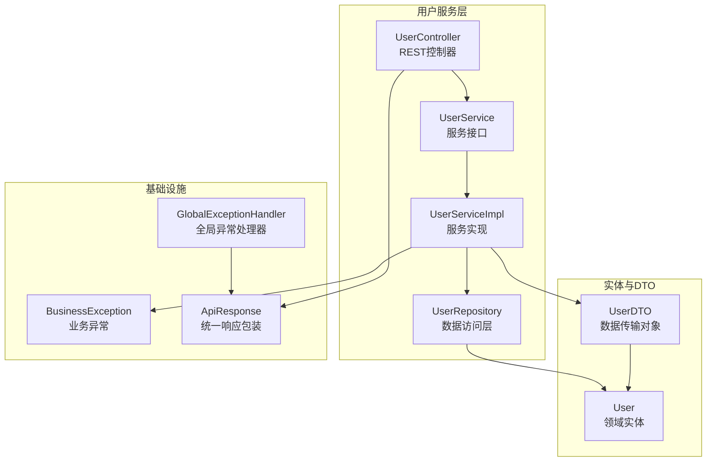
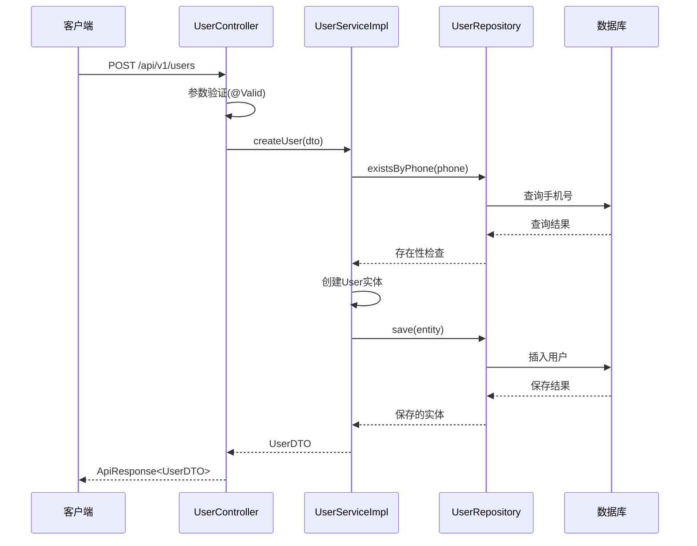
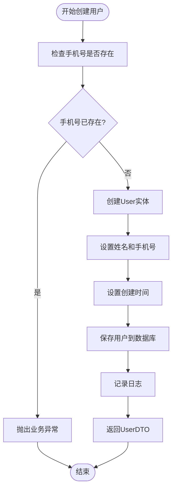
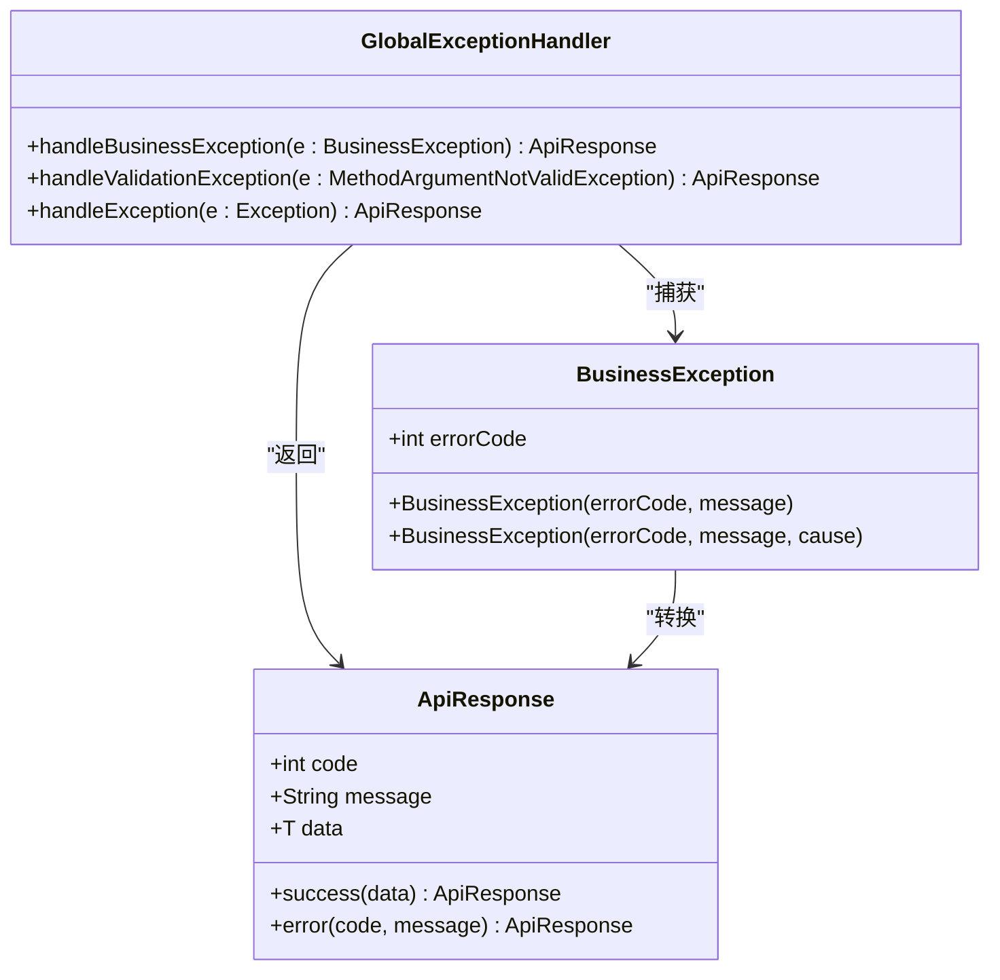
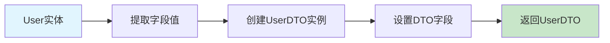
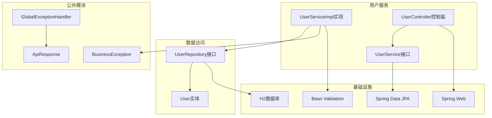

# 服务层实现

<cite>
**本文档引用的文件**
- [UserService.java](file://user-service/src/main/java/com/wenjie/cloud/user/service/UserService.java)
- [UserServiceImpl.java](file://user-service/src/main/java/com/wenjie/cloud/user/service/impl/UserServiceImpl.java)
- [UserController.java](file://user-service/src/main/java/com/wenjie/cloud/user/controller/UserController.java)
- [UserDTO.java](file://user-service/src/main/java/com/wenjie/cloud/user/dto/UserDTO.java)
- [User.java](file://user-service/src/main/java/com/wenjie/cloud/user/entity/User.java)
- [UserRepository.java](file://user-service/src/main/java/com/wenjie/cloud/user/repository/UserRepository.java)
- [BusinessException.java](file://vehicle-common/src/main/java/com/wenjie/cloud/common/exception/BusinessException.java)
- [GlobalExceptionHandler.java](file://vehicle-common/src/main/java/com/wenjie/cloud/common/exception/GlobalExceptionHandler.java)
- [ApiResponse.java](file://vehicle-common/src/main/java/com/wenjie/cloud/common/dto/ApiResponse.java)
- [application.yml](file://user-service/src/main/resources/application.yml)
- [pom.xml](file://user-service/pom.xml)
</cite>

## 目录
1. [简介](#简介)
2. [项目结构](#项目结构)
3. [核心组件](#核心组件)
4. [架构概览](#架构概览)
5. [详细组件分析](#详细组件分析)
6. [依赖分析](#依赖分析)
7. [性能考虑](#性能考虑)
8. [故障排除指南](#故障排除指南)
9. [结论](#结论)

## 简介

本文档详细介绍了用户管理服务层的实现，重点分析了UserService接口设计和UserServiceImpl的具体实现。该服务层采用分层架构设计，包含完整的业务逻辑实现、数据验证规则、事务管理和异常处理策略。系统支持用户创建、查询、列表获取和删除等核心功能，并实现了从UserDTO到User实体的转换机制。

## 项目结构

用户服务模块采用标准的Spring Boot分层架构，主要包含以下层次：

**图表来源**
- [UserController.java:1-60](file://user-service/src/main/java/com/wenjie/cloud/user/controller/UserController.java#L1-L60)
- [UserService.java:1-32](file://user-service/src/main/java/com/wenjie/cloud/user/service/UserService.java#L1-L32)
- [UserServiceImpl.java:1-80](file://user-service/src/main/java/com/wenjie/cloud/user/service/impl/UserServiceImpl.java#L1-L80)
- [UserRepository.java:1-23](file://user-service/src/main/java/com/wenjie/cloud/user/repository/UserRepository.java#L1-L23)

**章节来源**
- [pom.xml:1-61](file://user-service/pom.xml#L1-L61)
- [application.yml:1-40](file://user-service/src/main/resources/application.yml#L1-L40)

## 核心组件

### 用户服务接口设计

UserService接口定义了用户管理的核心业务操作，采用简洁明了的方法签名设计：

- `createUser(UserDTO dto)` - 创建用户
- `getUserById(Long id)` - 根据ID查询用户  
- `listUsers()` - 获取用户列表
- `deleteUser(Long id)` - 删除用户

每个方法都明确标注了业务职责，遵循单一职责原则。

### 数据传输对象(UserDTO)

UserDTO作为服务层与外部交互的数据载体，包含了完整的数据验证注解：

- **姓名验证**: 使用`@NotBlank`确保非空
- **手机号验证**: 使用`@NotBlank`和`@Pattern`确保11位数字格式
- **验证规则**: 支持国际化消息配置

### 领域实体(User)

User实体映射到数据库表`app_user`，包含完整的字段约束：

- **唯一性约束**: 手机号字段设置唯一索引
- **长度限制**: 姓名最大64字符，手机号固定11字符
- **时间戳**: 自动记录创建时间

**章节来源**
- [UserService.java:10-31](file://user-service/src/main/java/com/wenjie/cloud/user/service/UserService.java#L10-L31)
- [UserDTO.java:12-24](file://user-service/src/main/java/com/wenjie/cloud/user/dto/UserDTO.java#L12-L24)
- [User.java:19-37](file://user-service/src/main/java/com/wenjie/cloud/user/entity/User.java#L19-L37)

## 架构概览

用户服务采用经典的三层架构模式，实现了清晰的职责分离：

**图表来源**
- [UserController.java:31-34](file://user-service/src/main/java/com/wenjie/cloud/user/controller/UserController.java#L31-L34)
- [UserServiceImpl.java:29-42](file://user-service/src/main/java/com/wenjie/cloud/user/service/impl/UserServiceImpl.java#L29-L42)
- [UserRepository.java:11-22](file://user-service/src/main/java/com/wenjie/cloud/user/repository/UserRepository.java#L11-L22)

## 详细组件分析

### UserServiceImpl实现详解

UserServiceImpl是服务层的核心实现类，提供了完整的业务逻辑处理：

#### 事务管理机制

服务层使用Spring声明式事务管理：

- **创建用户**: 使用`@Transactional`确保数据一致性
- **查询操作**: 使用`@Transactional(readOnly = true)`优化读取性能
- **删除操作**: 使用`@Transactional`保证删除完整性

#### 用户创建业务逻辑

用户创建流程包含多重验证和处理步骤：

**图表来源**
- [UserServiceImpl.java:29-42](file://user-service/src/main/java/com/wenjie/cloud/user/service/impl/UserServiceImpl.java#L29-L42)

#### 用户查询业务流程

查询操作采用惰性加载和异常处理机制：

- **单个查询**: 使用`Optional.orElseThrow()`处理不存在的情况
- **列表查询**: 直接遍历所有用户并进行DTO转换
- **异常处理**: 统一抛出业务异常供上层处理

#### 用户删除级联处理

删除操作包含完整性检查：

- **存在性验证**: 在删除前检查用户是否存在
- **删除执行**: 调用JPA Repository执行删除
- **日志记录**: 记录删除操作的审计信息

**章节来源**
- [UserServiceImpl.java:23-79](file://user-service/src/main/java/com/wenjie/cloud/user/service/impl/UserServiceImpl.java#L23-L79)

### 数据验证规则

系统实现了多层次的数据验证机制：

#### 参数验证注解

UserDTO使用JSR-303 Bean Validation注解：

- **@NotBlank**: 确保字段非空且去除空白字符
- **@Pattern**: 使用正则表达式验证手机号格式
- **消息配置**: 支持自定义验证错误消息

#### 数据库约束验证

User实体定义了数据库层面的约束：

- **唯一性**: 手机号字段设置唯一约束
- **非空性**: 关键字段设置NOT NULL约束
- **长度限制**: 字段长度限制防止数据溢出

**章节来源**
- [UserDTO.java:17-23](file://user-service/src/main/java/com/wenjie/cloud/user/dto/UserDTO.java#L17-L23)
- [User.java:31-32](file://user-service/src/main/java/com/wenjie/cloud/user/entity/User.java#L31-L32)

### 异常处理策略

系统采用统一的异常处理机制：

**图表来源**
- [BusinessException.java:12-26](file://vehicle-common/src/main/java/com/wenjie/cloud/common/exception/BusinessException.java#L12-L26)
- [GlobalExceptionHandler.java:26-54](file://vehicle-common/src/main/java/com/wenjie/cloud/common/exception/GlobalExceptionHandler.java#L26-L54)
- [ApiResponse.java:41-50](file://vehicle-common/src/main/java/com/wenjie/cloud/common/dto/ApiResponse.java#L41-L50)

**章节来源**
- [BusinessException.java:11-26](file://vehicle-common/src/main/java/com/wenjie/cloud/common/exception/BusinessException.java#L11-L26)
- [GlobalExceptionHandler.java:21-55](file://vehicle-common/src/main/java/com/wenjie/cloud/common/exception/GlobalExceptionHandler.java#L21-L55)
- [ApiResponse.java:13-51](file://vehicle-common/src/main/java/com/wenjie/cloud/common/dto/ApiResponse.java#L13-L51)

### UserDTO到Entity转换

服务层实现了手动的DTO与Entity转换机制：

#### 转换策略

UserServiceImpl内部提供了私有的转换方法：

- **单向转换**: 仅支持Entity到DTO的转换
- **字段映射**: 一对一的字段复制
- **性能优化**: 避免使用复杂的映射框架

#### 转换流程

**图表来源**
- [UserServiceImpl.java:72-78](file://user-service/src/main/java/com/wenjie/cloud/user/service/impl/UserServiceImpl.java#L72-L78)

**章节来源**
- [UserServiceImpl.java:72-78](file://user-service/src/main/java/com/wenjie/cloud/user/service/impl/UserServiceImpl.java#L72-L78)

## 依赖分析

### 外部依赖关系

用户服务模块依赖于多个核心组件：

**图表来源**
- [pom.xml:18-48](file://user-service/pom.xml#L18-L48)

### 内部耦合度分析

服务层具有良好的内聚性和低耦合性：

- **接口隔离**: 通过UserService接口实现松耦合
- **依赖注入**: 使用Lombok的@RequiredArgsConstructor简化DI
- **异常隔离**: 业务异常与系统异常分离处理

**章节来源**
- [pom.xml:18-48](file://user-service/pom.xml#L18-L48)

## 性能考虑

### 查询性能优化

- **只读事务**: 查询操作使用readOnly=true优化性能
- **批量操作**: 列表查询使用Stream API进行高效转换
- **延迟初始化**: 合理使用JPA的延迟加载机制

### 缓存策略

当前实现未包含缓存机制，建议在高并发场景下考虑：

- **查询缓存**: 对热点用户数据添加Redis缓存
- **二级缓存**: 配置Hibernate二级缓存
- **缓存失效**: 实现合理的缓存更新策略

### 数据库优化

- **索引优化**: 手机号字段已建立唯一索引
- **连接池**: 配置合适的数据库连接池参数
- **SQL优化**: 监控慢查询并进行优化

## 故障排除指南

### 常见问题诊断

#### 参数验证失败

当UserDTO验证失败时，系统会返回400状态码：

- **验证异常**: `MethodArgumentNotValidException`
- **错误格式**: 字段名+消息的组合字符串
- **日志记录**: 详细的验证失败日志

#### 业务逻辑异常

业务异常通过BusinessException统一处理：

- **错误码**: 2001表示手机号已存在
- **错误码**: 2002表示用户不存在
- **异常传播**: 自动转换为ApiResponse格式

#### 数据库约束冲突

数据库层面的约束冲突处理：

- **唯一性冲突**: 手机号重复导致的约束异常
- **数据类型错误**: 字段长度或格式不符合要求
- **外键约束**: 级联删除时的完整性检查

**章节来源**
- [GlobalExceptionHandler.java:26-54](file://vehicle-common/src/main/java/com/wenjie/cloud/common/exception/GlobalExceptionHandler.java#L26-L54)
- [UserServiceImpl.java:30-32](file://user-service/src/main/java/com/wenjie/cloud/user/service/impl/UserServiceImpl.java#L30-L32)
- [UserServiceImpl.java:62-67](file://user-service/src/main/java/com/wenjie/cloud/user/service/impl/UserServiceImpl.java#L62-L67)

## 结论

用户管理服务层实现了完整的业务功能，具有以下特点：

### 设计优势

- **清晰的分层架构**: 控制器、服务、数据访问层职责明确
- **完善的异常处理**: 统一的异常处理机制确保系统稳定性
- **严格的参数验证**: 多层次的数据验证保障数据质量
- **优雅的事务管理**: 合理的事务边界设计保证数据一致性

### 可扩展性

- **接口设计**: 基于接口的编程便于测试和扩展
- **依赖注入**: 灵活的依赖注入机制支持模块化开发
- **异常隔离**: 业务异常与系统异常分离便于维护

### 改进建议

1. **引入MapStruct**: 考虑使用MapStruct替代手动转换
2. **添加缓存层**: 实现用户数据的缓存机制提升性能
3. **增强监控**: 添加详细的性能指标和健康检查
4. **完善测试**: 增加单元测试和集成测试覆盖率

该服务层为整个微服务架构提供了坚实的基础，具备良好的可维护性和扩展性。