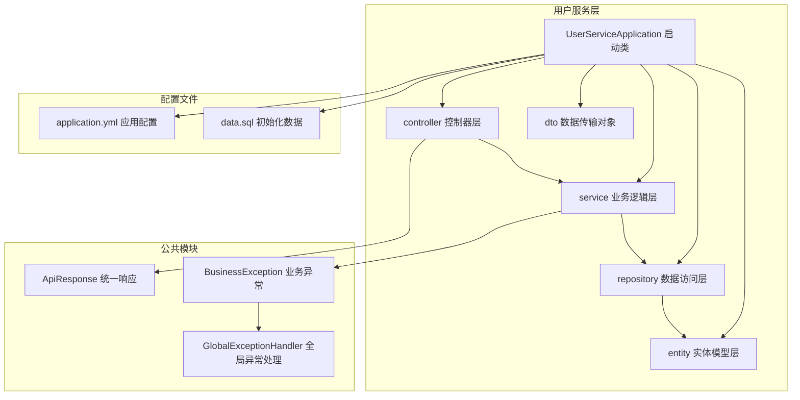
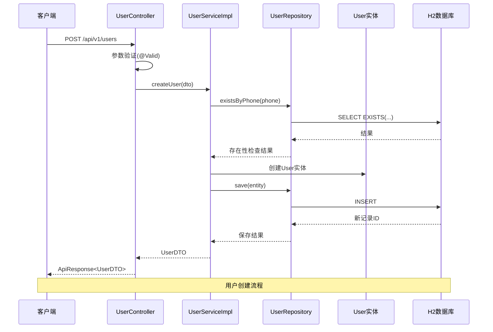
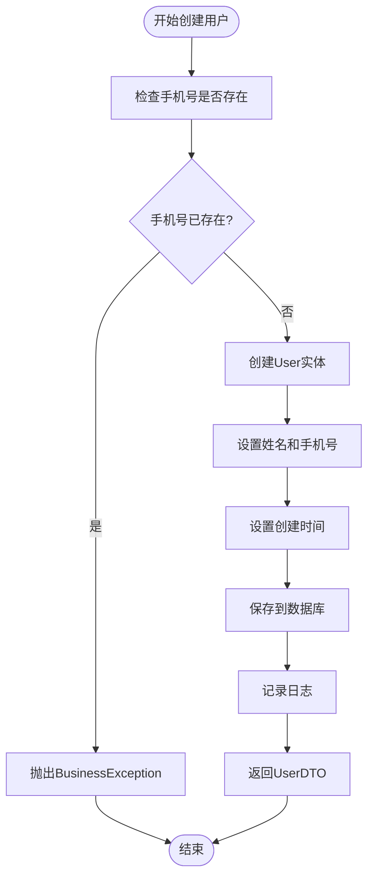
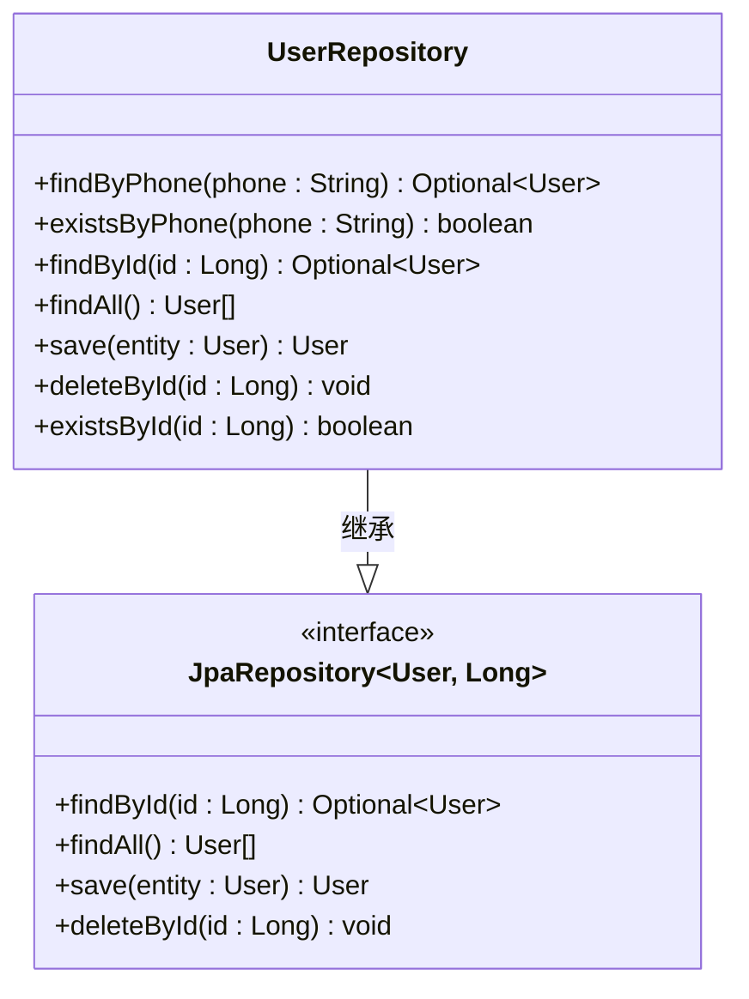
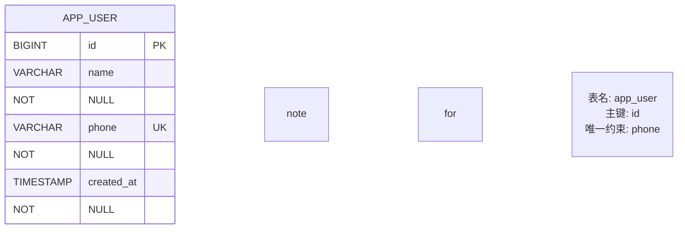
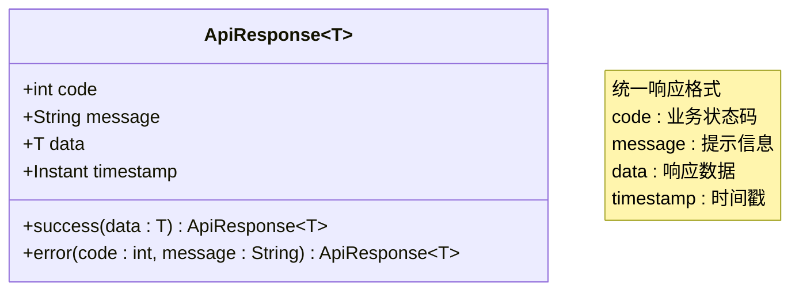
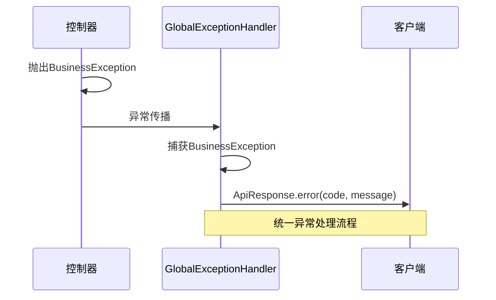
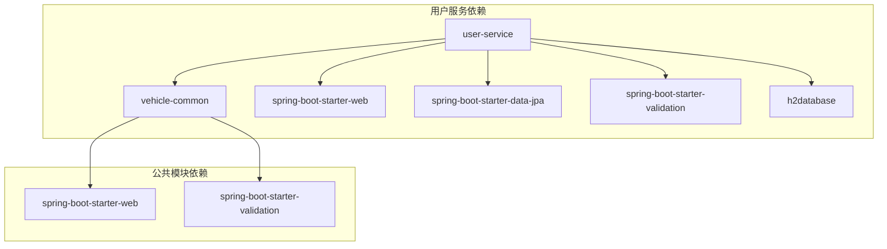

# 用户管理服务

<cite>
**本文档引用的文件**
- [UserServiceApplication.java](file://user-service/src/main/java/com/wenjie/cloud/user/UserServiceApplication.java)
- [UserController.java](file://user-service/src/main/java/com/wenjie/cloud/user/controller/UserController.java)
- [UserService.java](file://user-service/src/main/java/com/wenjie/cloud/user/service/UserService.java)
- [UserServiceImpl.java](file://user-service/src/main/java/com/wenjie/cloud/user/service/impl/UserServiceImpl.java)
- [UserRepository.java](file://user-service/src/main/java/com/wenjie/cloud/user/repository/UserRepository.java)
- [User.java](file://user-service/src/main/java/com/wenjie/cloud/user/entity/User.java)
- [UserDTO.java](file://user-service/src/main/java/com/wenjie/cloud/user/dto/UserDTO.java)
- [ApiResponse.java](file://vehicle-common/src/main/java/com/wenjie/cloud/common/dto/ApiResponse.java)
- [BusinessException.java](file://vehicle-common/src/main/java/com/wenjie/cloud/common/exception/BusinessException.java)
- [GlobalExceptionHandler.java](file://vehicle-common/src/main/java/com/wenjie/cloud/common/exception/GlobalExceptionHandler.java)
- [application.yml](file://user-service/src/main/resources/application.yml)
- [data.sql](file://user-service/src/main/resources/data.sql)
- [pom.xml](file://user-service/pom.xml)
</cite>

## 目录
1. [简介](#简介)
2. [项目结构](#项目结构)
3. [核心组件](#核心组件)
4. [架构概览](#架构概览)
5. [详细组件分析](#详细组件分析)
6. [依赖分析](#依赖分析)
7. [性能考虑](#性能考虑)
8. [故障排除指南](#故障排除指南)
9. [结论](#结论)
10. [附录](#附录)

## 简介

用户管理服务是一个基于Spring Boot的微服务应用，实现了完整的用户CRUD操作功能。该服务采用分层架构设计，包括控制器层、业务逻辑层、数据访问层和实体模型层，提供了RESTful API接口来管理用户信息。

本服务的主要特性包括：
- 完整的用户CRUD操作（创建、查询、列表、删除）
- 参数验证和业务规则检查
- 统一的API响应格式
- 异常处理和错误码管理
- 基于JPA的数据持久化
- 内存数据库支持（H2）

## 项目结构

用户管理服务采用标准的Spring Boot项目结构，主要分为以下层次：



**图表来源**
- [UserServiceApplication.java:1-16](file://user-service/src/main/java/com/wenjie/cloud/user/UserServiceApplication.java#L1-L16)
- [UserController.java:1-60](file://user-service/src/main/java/com/wenjie/cloud/user/controller/UserController.java#L1-L60)
- [UserServiceImpl.java:1-80](file://user-service/src/main/java/com/wenjie/cloud/user/service/impl/UserServiceImpl.java#L1-L80)

**章节来源**
- [pom.xml:1-61](file://user-service/pom.xml#L1-L61)
- [application.yml:1-40](file://user-service/src/main/resources/application.yml#L1-L40)

## 核心组件

用户管理服务的核心组件包括四个主要层次：

### 控制器层（Controller Layer）
负责处理HTTP请求和响应，提供RESTful API接口。

### 业务逻辑层（Service Layer）
实现业务规则和流程控制，包含事务管理。

### 数据访问层（Repository Layer）
基于Spring Data JPA提供数据持久化功能。

### 实体模型层（Entity Layer）
定义数据库表结构和JPA映射关系。

**章节来源**
- [UserController.java:18-60](file://user-service/src/main/java/com/wenjie/cloud/user/controller/UserController.java#L18-L60)
- [UserService.java:7-32](file://user-service/src/main/java/com/wenjie/cloud/user/service/UserService.java#L7-L32)
- [UserRepository.java:8-23](file://user-service/src/main/java/com/wenjie/cloud/user/repository/UserRepository.java#L8-L23)

## 架构概览

用户管理服务采用经典的三层架构模式，通过依赖注入实现松耦合设计：



**图表来源**
- [UserController.java:31-34](file://user-service/src/main/java/com/wenjie/cloud/user/controller/UserController.java#L31-L34)
- [UserServiceImpl.java:28-42](file://user-service/src/main/java/com/wenjie/cloud/user/service/impl/UserServiceImpl.java#L28-L42)
- [UserRepository.java:21](file://user-service/src/main/java/com/wenjie/cloud/user/repository/UserRepository.java#L21)

**章节来源**
- [UserServiceApplication.java:9-14](file://user-service/src/main/java/com/wenjie/cloud/user/UserServiceApplication.java#L9-L14)
- [GlobalExceptionHandler.java:13-56](file://vehicle-common/src/main/java/com/wenjie/cloud/common/exception/GlobalExceptionHandler.java#L13-L56)

## 详细组件分析

### 控制器层设计

UserController是用户管理服务的入口点，提供RESTful API接口：

#### 接口定义

| 方法 | HTTP方法 | 路径 | 功能描述 | 请求体 | 响应体 |
|------|----------|------|----------|--------|--------|
| createUser | POST | `/api/v1/users` | 创建新用户 | UserDTO | ApiResponse<UserDTO> |
| getUser | GET | `/api/v1/users/{id}` | 根据ID获取用户 | 无 | ApiResponse<UserDTO> |
| listUsers | GET | `/api/v1/users` | 获取用户列表 | 无 | ApiResponse<List<UserDTO>> |
| deleteUser | DELETE | `/api/v1/users/{id}` | 删除用户 | 无 | ApiResponse<Void> |

#### 参数验证机制

控制器层使用Bean Validation进行参数验证：
- 使用`@Valid`注解触发验证
- `UserDTO`中包含`@NotBlank`和`@Pattern`约束
- 验证失败时自动抛出`MethodArgumentNotValidException`

**章节来源**
- [UserController.java:28-60](file://user-service/src/main/java/com/wenjie/cloud/user/controller/UserController.java#L28-L60)
- [UserDTO.java:17-23](file://user-service/src/main/java/com/wenjie/cloud/user/dto/UserDTO.java#L17-L23)

### 业务逻辑层实现

UserServiceImpl实现了完整的业务逻辑，包含事务管理和错误处理：

#### 业务流程



**图表来源**
- [UserServiceImpl.java:28-42](file://user-service/src/main/java/com/wenjie/cloud/user/service/impl/UserServiceImpl.java#L28-L42)

#### 事务管理策略

- `createUser`: 使用`@Transactional`确保数据一致性
- `getUserById`和`listUsers`: 使用`@Transactional(readOnly = true)`优化只读操作
- `deleteUser`: 使用`@Transactional`执行删除操作

**章节来源**
- [UserServiceImpl.java:17-80](file://user-service/src/main/java/com/wenjie/cloud/user/service/impl/UserServiceImpl.java#L17-L80)

### 数据访问层设计

UserRepository基于Spring Data JPA提供数据访问功能：

#### JPA Repository接口



**图表来源**
- [UserRepository.java:11-22](file://user-service/src/main/java/com/wenjie/cloud/user/repository/UserRepository.java#L11-L22)

#### 查询方法

- `findByPhone(String phone)`: 根据手机号查询用户
- `existsByPhone(String phone)`: 检查手机号是否存在
- 继承自JpaRepository的方法用于基本CRUD操作

**章节来源**
- [UserRepository.java:13-21](file://user-service/src/main/java/com/wenjie/cloud/user/repository/UserRepository.java#L13-L21)

### 实体模型设计

User实体定义了数据库表结构和JPA映射关系：

#### 字段定义

| 字段名 | 类型 | 约束 | 描述 |
|--------|------|------|------|
| id | Long | 主键, 自增 | 用户唯一标识 |
| name | String | 非空, 长度64 | 用户姓名 |
| phone | String | 非空, 唯一, 长度11 | 手机号码 |
| created_at | Instant | 非空, 不可更新 | 创建时间 |

#### JPA注解使用



**图表来源**
- [User.java:21-37](file://user-service/src/main/java/com/wenjie/cloud/user/entity/User.java#L21-L37)

**章节来源**
- [User.java:13-38](file://user-service/src/main/java/com/wenjie/cloud/user/entity/User.java#L13-L38)

### 数据传输对象设计

UserDTO用于API接口的数据传输，包含参数验证规则：

#### DTO字段

| 字段名 | 验证规则 | 描述 |
|--------|----------|------|
| id | 无验证 | 用户ID（可选） |
| name | @NotBlank | 姓名，不能为空 |
| phone | @NotBlank, @Pattern | 手机号，必须为11位数字格式 |

#### 验证规则说明

- 姓名验证：使用`@NotBlank`确保非空
- 手机号验证：使用`@Pattern("^1\\d{10}$")`确保11位数字格式
- 错误消息：提供清晰的错误提示信息

**章节来源**
- [UserDTO.java:8-25](file://user-service/src/main/java/com/wenjie/cloud/user/dto/UserDTO.java#L8-L25)

### 统一响应和异常处理

服务使用统一的API响应格式和全局异常处理机制：

#### ApiResponse结构



**图表来源**
- [ApiResponse.java:12-52](file://vehicle-common/src/main/java/com/wenjie/cloud/common/dto/ApiResponse.java#L12-L52)

#### 异常处理流程



**图表来源**
- [GlobalExceptionHandler.java:26-31](file://vehicle-common/src/main/java/com/wenjie/cloud/common/exception/GlobalExceptionHandler.java#L26-L31)

**章节来源**
- [ApiResponse.java:38-50](file://vehicle-common/src/main/java/com/wenjie/cloud/common/dto/ApiResponse.java#L38-L50)
- [BusinessException.java:11-27](file://vehicle-common/src/main/java/com/wenjie/cloud/common/exception/BusinessException.java#L11-L27)

## 依赖分析

用户管理服务的依赖关系如下：



**图表来源**
- [pom.xml:18-48](file://user-service/pom.xml#L18-L48)
- [vehicle-common/pom.xml:18-29](file://vehicle-common/pom.xml#L18-L29)

### 外部依赖

- **Spring Boot Starter Web**: 提供Web开发支持和RESTful API功能
- **Spring Boot Starter Data JPA**: 提供JPA数据访问支持
- **Spring Boot Starter Validation**: 提供Bean Validation功能
- **H2 Database**: 内存数据库，用于开发和测试环境

**章节来源**
- [pom.xml:25-48](file://user-service/pom.xml#L25-L48)

## 性能考虑

用户管理服务在设计时考虑了以下性能因素：

### 数据库优化
- 使用内存数据库（H2）提高开发效率
- 通过DDL自动创建和删除简化数据库管理
- 优化查询方法减少不必要的数据库访问

### 缓存策略
- 当前实现未包含缓存层，可根据业务需求添加Redis缓存
- 对频繁查询的用户列表可考虑添加二级缓存

### 并发处理
- 使用Spring事务管理确保数据一致性
- 对只读操作使用`readOnly = true`优化性能

## 故障排除指南

### 常见问题及解决方案

#### 1. 参数验证失败
**症状**: API返回400错误，包含验证错误信息  
**原因**: UserDTO中的字段不符合验证规则  
**解决**: 检查请求体中的name和phone字段格式

#### 2. 手机号重复
**症状**: API返回业务错误，错误码2001  
**原因**: 提供的手机号已在数据库中存在  
**解决**: 使用唯一的手机号或修改现有用户的手机号

#### 3. 用户不存在
**症状**: API返回业务错误，错误码2002  
**原因**: 查询或删除的用户ID不存在  
**解决**: 确认用户ID的有效性或先创建用户

#### 4. 数据库连接问题
**症状**: 应用启动失败或数据库操作异常  
**原因**: H2数据库配置问题或连接池耗尽  
**解决**: 检查application.yml中的数据库配置

**章节来源**
- [GlobalExceptionHandler.java:33-54](file://vehicle-common/src/main/java/com/wenjie/cloud/common/exception/GlobalExceptionHandler.java#L33-L54)
- [UserServiceImpl.java:30-32](file://user-service/src/main/java/com/wenjie/cloud/user/service/impl/UserServiceImpl.java#L30-L32)

## 结论

用户管理服务是一个设计良好的微服务应用，具有以下特点：

### 设计优势
- **清晰的分层架构**: 控制器、业务、数据访问层职责明确
- **完善的异常处理**: 统一的错误码和响应格式
- **参数验证机制**: 前端和后端双重验证保障数据质量
- **事务管理**: 合理的事务边界确保数据一致性

### 可扩展性
- **模块化设计**: 易于添加新的功能模块
- **依赖注入**: 支持单元测试和集成测试
- **配置灵活**: 支持多种数据库和部署环境

### 改进建议
- 添加用户更新功能
- 实现分页查询支持大数据量场景
- 添加用户权限管理
- 集成Redis缓存提升性能
- 添加API文档生成

## 附录

### API使用示例

#### 创建用户
```bash
curl -X POST http://localhost:8082/api/v1/users \
  -H "Content-Type: application/json" \
  -d '{
    "name": "张三",
    "phone": "13800000001"
  }'
```

#### 获取用户详情
```bash
curl http://localhost:8082/api/v1/users/1
```

#### 获取用户列表
```bash
curl http://localhost:8082/api/v1/users
```

#### 删除用户
```bash
curl -X DELETE http://localhost:8082/api/v1/users/1
```

### 数据库初始化

服务启动时会自动执行data.sql脚本，初始化示例用户数据：

| 姓名 | 手机号 | 创建时间 |
|------|--------|----------|
| 小王 | 13800000001 | 当前时间 |
| 小李 | 13800000002 | 当前时间 |
| 老张 | 13800000003 | 当前时间 |
| 赵敏 | 13800000004 | 当前时间 |
| 陈博 | 13800000005 | 当前时间 |

**章节来源**
- [data.sql:5-10](file://user-service/src/main/resources/data.sql#L5-L10)