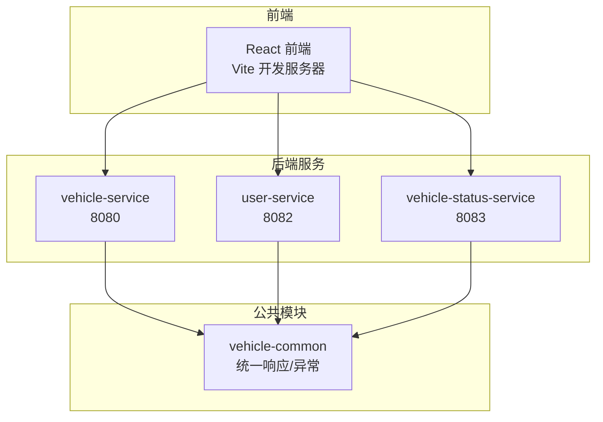
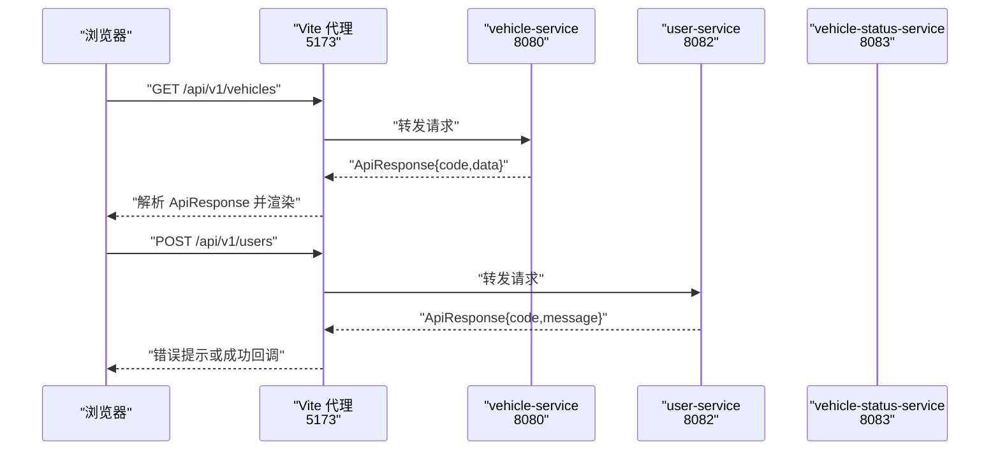
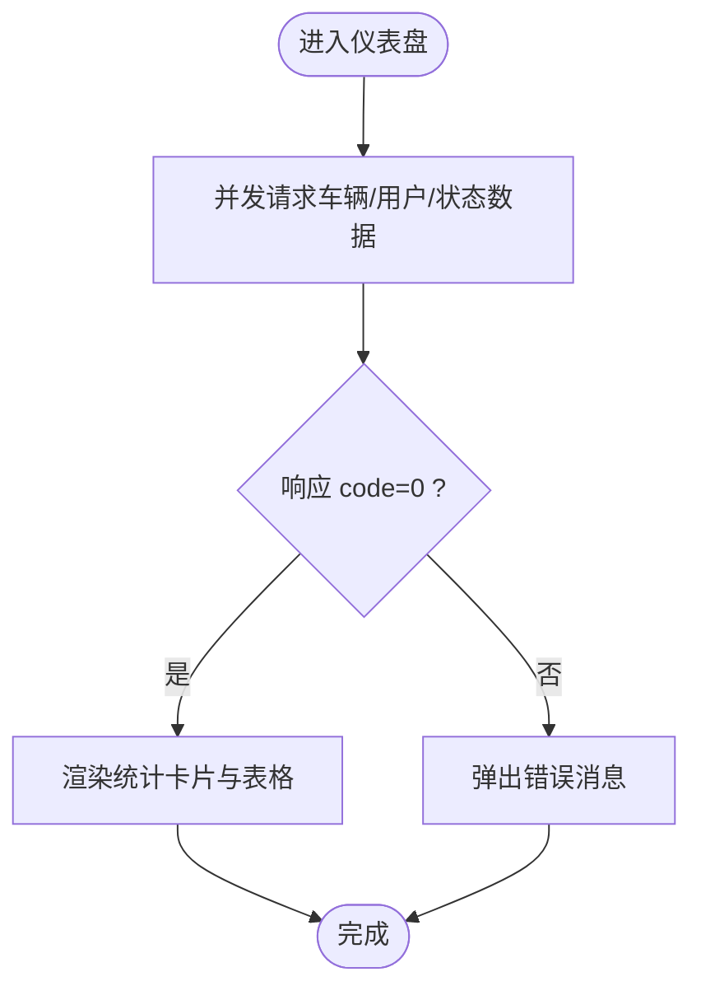
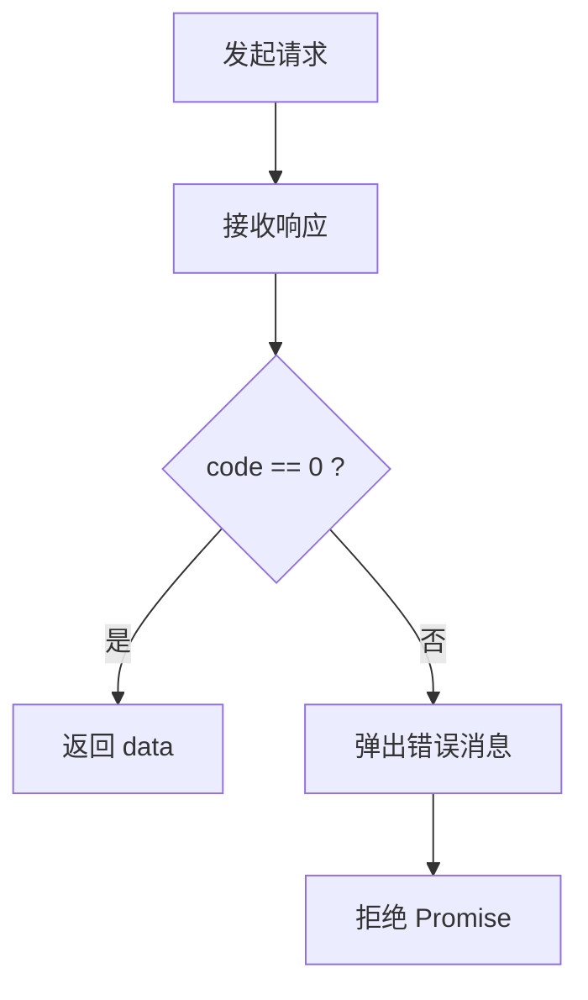
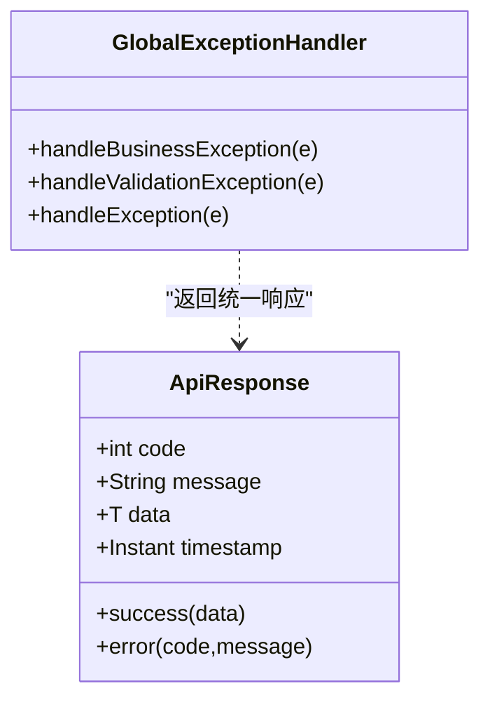
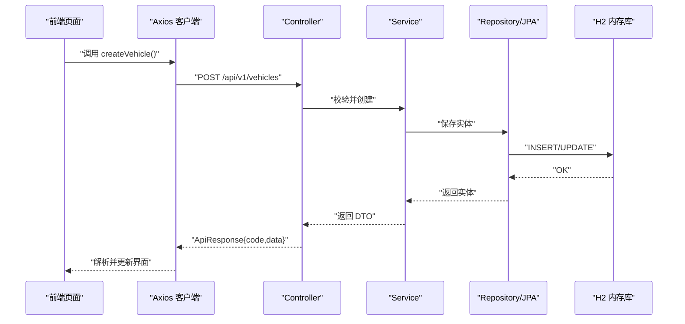
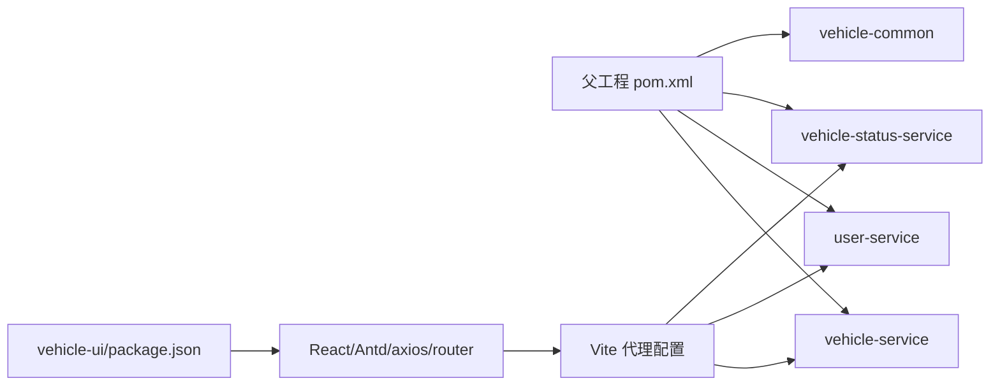

# 前后端分离架构

<cite>
**本文引用的文件**
- [README.md](file://README.md)
- [pom.xml](file://pom.xml)
- [vehicle-common/src/main/java/com/wenjie/cloud/common/dto/ApiResponse.java](file://vehicle-common/src/main/java/com/wenjie/cloud/common/dto/ApiResponse.java)
- [vehicle-common/src/main/java/com/wenjie/cloud/common/exception/GlobalExceptionHandler.java](file://vehicle-common/src/main/java/com/wenjie/cloud/common/exception/GlobalExceptionHandler.java)
- [vehicle-service/src/main/java/com/wenjie/cloud/vehicle/VehicleServiceApplication.java](file://vehicle-service/src/main/java/com/wenjie/cloud/vehicle/VehicleServiceApplication.java)
- [vehicle-service/src/main/java/com/wenjie/cloud/vehicle/controller/VehicleController.java](file://vehicle-service/src/main/java/com/wenjie/cloud/vehicle/controller/VehicleController.java)
- [vehicle-service/src/main/resources/application.yml](file://vehicle-service/src/main/resources/application.yml)
- [user-service/src/main/java/com/wenjie/cloud/user/UserServiceApplication.java](file://user-service/src/main/java/com/wenjie/cloud/user/UserServiceApplication.java)
- [user-service/src/main/java/com/wenjie/cloud/user/controller/UserController.java](file://user-service/src/main/java/com/wenjie/cloud/user/controller/UserController.java)
- [user-service/src/main/resources/application.yml](file://user-service/src/main/resources/application.yml)
- [vehicle-status-service/src/main/java/com/wenjie/cloud/vehiclestatus/VehicleStatusServiceApplication.java](file://vehicle-status-service/src/main/java/com/wenjie/cloud/vehiclestatus/VehicleStatusServiceApplication.java)
- [vehicle-status-service/src/main/java/com/wenjie/cloud/vehiclestatus/controller/StatusReportController.java](file://vehicle-status-service/src/main/java/com/wenjie/cloud/vehiclestatus/controller/StatusReportController.java)
- [vehicle-status-service/src/main/resources/application.yml](file://vehicle-status-service/src/main/resources/application.yml)
- [vehicle-ui/package.json](file://vehicle-ui/package.json)
- [vehicle-ui/vite.config.js](file://vehicle-ui/vite.config.js)
- [vehicle-ui/src/App.jsx](file://vehicle-ui/src/App.jsx)
- [vehicle-ui/src/api/request.js](file://vehicle-ui/src/api/request.js)
- [vehicle-ui/src/pages/Dashboard.jsx](file://vehicle-ui/src/pages/Dashboard.jsx)
- [vehicle-ui/src/components/VehicleForm.jsx](file://vehicle-ui/src/components/VehicleForm.jsx)
</cite>

## 目录
1. [引言](#引言)
2. [项目结构](#项目结构)
3. [核心组件](#核心组件)
4. [架构总览](#架构总览)
5. [详细组件分析](#详细组件分析)
6. [依赖关系分析](#依赖关系分析)
7. [性能考虑](#性能考虑)
8. [故障排查指南](#故障排查指南)
9. [结论](#结论)
10. [附录](#附录)

## 引言
本项目为车联网云平台的前后端分离演示，采用多模块 Spring Boot 微服务后端与 React 前端的典型架构。后端以 vehicle-service、user-service、vehicle-status-service 三个服务为核心，提供车辆、用户与车辆状态的 RESTful API；vehicle-common 提供统一响应与全局异常处理；前端基于 React + Ant Design，通过 Vite 代理将 /api/v1/* 请求转发至对应后端服务，形成完整的开发与运行闭环。

## 项目结构
- 多模块 Maven 结构，父工程统一管理版本与插件。
- vehicle-common：公共模块，定义统一响应体与全局异常处理。
- vehicle-service：车辆管理服务，端口 8080，提供车辆 CRUD。
- user-service：用户管理服务，端口 8082，提供用户 CRUD。
- vehicle-status-service：车辆状态服务，端口 8083，提供状态上报与查询。
- vehicle-ui：前端单页应用，端口 5173，通过 Vite 代理转发 API 请求。

图表来源
- [vehicle-ui/vite.config.js:1-25](file://vehicle-ui/vite.config.js#L1-L25)
- [vehicle-service/src/main/resources/application.yml:1-40](file://vehicle-service/src/main/resources/application.yml#L1-L40)
- [user-service/src/main/resources/application.yml:1-40](file://user-service/src/main/resources/application.yml#L1-L40)
- [vehicle-status-service/src/main/resources/application.yml:1-30](file://vehicle-status-service/src/main/resources/application.yml#L1-L30)

章节来源
- [README.md:19-47](file://README.md#L19-L47)
- [pom.xml](file://pom.xml)

## 核心组件
- 统一响应体 ApiResponse：所有控制器返回值统一包装，包含 code、message、data、timestamp 字段，便于前端一致处理。
- 全局异常处理器 GlobalExceptionHandler：集中捕获业务异常、参数校验异常与未知异常，统一转换为 ApiResponse。
- 前端 Axios 客户端 request：创建带超时的 axios 实例，并通过响应拦截器统一解析 ApiResponse，仅在 code=0 时透传 data，其他情况弹出消息并拒绝 Promise。
- 前端路由与页面：App.jsx 配置侧边栏与路由，Dashboard.jsx 展示聚合数据，VehicleForm.jsx 提供表单校验与提交。
- 后端控制器：VehicleController、UserController、StatusReportController 分别提供车辆、用户与状态的 REST API。

章节来源
- [vehicle-common/src/main/java/com/wenjie/cloud/common/dto/ApiResponse.java:1-52](file://vehicle-common/src/main/java/com/wenjie/cloud/common/dto/ApiResponse.java#L1-L52)
- [vehicle-common/src/main/java/com/wenjie/cloud/common/exception/GlobalExceptionHandler.java:1-56](file://vehicle-common/src/main/java/com/wenjie/cloud/common/exception/GlobalExceptionHandler.java#L1-L56)
- [vehicle-ui/src/api/request.js:1-26](file://vehicle-ui/src/api/request.js#L1-L26)
- [vehicle-ui/src/App.jsx:1-78](file://vehicle-ui/src/App.jsx#L1-L78)
- [vehicle-ui/src/pages/Dashboard.jsx:1-140](file://vehicle-ui/src/pages/Dashboard.jsx#L1-L140)
- [vehicle-ui/src/components/VehicleForm.jsx:1-65](file://vehicle-ui/src/components/VehicleForm.jsx#L1-L65)
- [vehicle-service/src/main/java/com/wenjie/cloud/vehicle/controller/VehicleController.java:1-61](file://vehicle-service/src/main/java/com/wenjie/cloud/vehicle/controller/VehicleController.java#L1-L61)
- [user-service/src/main/java/com/wenjie/cloud/user/controller/UserController.java:1-60](file://user-service/src/main/java/com/wenjie/cloud/user/controller/UserController.java#L1-L60)
- [vehicle-status-service/src/main/java/com/wenjie/cloud/vehiclestatus/controller/StatusReportController.java:1-71](file://vehicle-status-service/src/main/java/com/wenjie/cloud/vehiclestatus/controller/StatusReportController.java#L1-L71)

## 架构总览
前后端通过 REST API 通信，前端通过 Vite 代理将 /api/v1/* 请求转发到对应后端服务。后端服务使用 Spring MVC 提供 REST 接口，统一使用 ApiResponse 包装响应，全局异常处理器确保错误信息标准化输出。

图表来源
- [vehicle-ui/vite.config.js:9-22](file://vehicle-ui/vite.config.js#L9-L22)
- [vehicle-service/src/main/java/com/wenjie/cloud/vehicle/controller/VehicleController.java:21-60](file://vehicle-service/src/main/java/com/wenjie/cloud/vehicle/controller/VehicleController.java#L21-L60)
- [user-service/src/main/java/com/wenjie/cloud/user/controller/UserController.java:18-60](file://user-service/src/main/java/com/wenjie/cloud/user/controller/UserController.java#L18-L60)
- [vehicle-status-service/src/main/java/com/wenjie/cloud/vehiclestatus/controller/StatusReportController.java:26-71](file://vehicle-status-service/src/main/java/com/wenjie/cloud/vehiclestatus/controller/StatusReportController.java#L26-L71)

## 详细组件分析

### 前端组件与路由
- App.jsx：Ant Design Layout + 路由配置，左侧菜单导航到仪表盘、车辆管理、用户管理、车辆状态四个页面。
- Dashboard.jsx：并发拉取车辆、用户、状态数据，计算统计指标并在卡片中展示。
- VehicleForm.jsx：表单校验（VIN 17 位、必填等），提交成功后提示并回调刷新列表。

图表来源
- [vehicle-ui/src/pages/Dashboard.jsx:20-32](file://vehicle-ui/src/pages/Dashboard.jsx#L20-L32)
- [vehicle-ui/src/api/request.js:8-23](file://vehicle-ui/src/api/request.js#L8-L23)

章节来源
- [vehicle-ui/src/App.jsx:17-75](file://vehicle-ui/src/App.jsx#L17-L75)
- [vehicle-ui/src/pages/Dashboard.jsx:14-137](file://vehicle-ui/src/pages/Dashboard.jsx#L14-L137)
- [vehicle-ui/src/components/VehicleForm.jsx:10-64](file://vehicle-ui/src/components/VehicleForm.jsx#L10-L64)

### 前端 Axios 客户端封装
- 创建带超时的 axios 实例，统一设置响应拦截器：
  - 当响应 code=0 时，直接返回 data；
  - 否则弹出消息并拒绝 Promise，便于上层统一处理。
- 该封装屏蔽了后端响应格式差异，使调用方无需关心统一响应体细节。

图表来源
- [vehicle-ui/src/api/request.js:4-23](file://vehicle-ui/src/api/request.js#L4-L23)

章节来源
- [vehicle-ui/src/api/request.js:1-26](file://vehicle-ui/src/api/request.js#L1-L26)

### 后端统一响应与异常处理
- ApiResponse：统一封装 code、message、data、timestamp，提供 success/error 工厂方法。
- GlobalExceptionHandler：
  - 捕获 BusinessException，返回 400 与错误码/消息；
  - 捕获参数校验异常 MethodArgumentNotValidException，拼接字段错误并返回 400；
  - 捕获未知异常，记录日志并返回 500。

图表来源
- [vehicle-common/src/main/java/com/wenjie/cloud/common/dto/ApiResponse.java:13-51](file://vehicle-common/src/main/java/com/wenjie/cloud/common/dto/ApiResponse.java#L13-L51)
- [vehicle-common/src/main/java/com/wenjie/cloud/common/exception/GlobalExceptionHandler.java:21-55](file://vehicle-common/src/main/java/com/wenjie/cloud/common/exception/GlobalExceptionHandler.java#L21-L55)

章节来源
- [vehicle-common/src/main/java/com/wenjie/cloud/common/dto/ApiResponse.java:1-52](file://vehicle-common/src/main/java/com/wenjie/cloud/common/dto/ApiResponse.java#L1-L52)
- [vehicle-common/src/main/java/com/wenjie/cloud/common/exception/GlobalExceptionHandler.java:1-56](file://vehicle-common/src/main/java/com/wenjie/cloud/common/exception/GlobalExceptionHandler.java#L1-L56)

### RESTful API 设计与参数校验
- 车辆服务（8080）：POST/GET/DELETE /api/v1/vehicles，参数校验 VIN 17 位。
- 用户服务（8082）：POST/GET/DELETE /api/v1/users，参数校验姓名非空、手机号格式。
- 车辆状态服务（8083）：POST /api/v1/status-reports；GET /api/v1/status-reports/latest/{vin}、/latest；支持分页与排序。

图表来源
- [vehicle-service/src/main/java/com/wenjie/cloud/vehicle/controller/VehicleController.java:21-60](file://vehicle-service/src/main/java/com/wenjie/cloud/vehicle/controller/VehicleController.java#L21-L60)
- [vehicle-service/src/main/resources/application.yml:8-35](file://vehicle-service/src/main/resources/application.yml#L8-L35)
- [user-service/src/main/resources/application.yml:8-35](file://user-service/src/main/resources/application.yml#L8-L35)
- [vehicle-status-service/src/main/resources/application.yml:7-29](file://vehicle-status-service/src/main/resources/application.yml#L7-L29)

章节来源
- [vehicle-service/src/main/java/com/wenjie/cloud/vehicle/controller/VehicleController.java:1-61](file://vehicle-service/src/main/java/com/wenjie/cloud/vehicle/controller/VehicleController.java#L1-L61)
- [user-service/src/main/java/com/wenjie/cloud/user/controller/UserController.java:1-60](file://user-service/src/main/java/com/wenjie/cloud/user/controller/UserController.java#L1-L60)
- [vehicle-status-service/src/main/java/com/wenjie/cloud/vehiclestatus/controller/StatusReportController.java:1-71](file://vehicle-status-service/src/main/java/com/wenjie/cloud/vehiclestatus/controller/StatusReportController.java#L1-L71)

### 开发环境配置与构建流程
- 后端：Maven 多模块，分别启动 vehicle-service（8080）、user-service（8082）、vehicle-status-service（8083）。
- 前端：Vite 开发服务器（5173），通过代理将 /api/v1/* 转发到对应后端端口。
- 初始化数据：H2 内存库启动时自动执行 data.sql 初始化脚本。

章节来源
- [README.md:56-84](file://README.md#L56-L84)
- [vehicle-ui/vite.config.js:7-24](file://vehicle-ui/vite.config.js#L7-L24)
- [vehicle-service/src/main/resources/application.yml:26-35](file://vehicle-service/src/main/resources/application.yml#L26-L35)
- [user-service/src/main/resources/application.yml:26-35](file://user-service/src/main/resources/application.yml#L26-L35)
- [vehicle-status-service/src/main/resources/application.yml:24-26](file://vehicle-status-service/src/main/resources/application.yml#L24-L26)

## 依赖关系分析
- 前端依赖：React、Ant Design、axios、react-router-dom、Vite。
- 后端依赖：Spring Boot、Spring Data JPA、H2、Lombok、MapStruct、javax.validation。
- 服务间无直接耦合，通过 REST API 与统一响应体解耦。

图表来源
- [pom.xml](file://pom.xml)
- [vehicle-ui/package.json:12-30](file://vehicle-ui/package.json#L12-L30)
- [vehicle-ui/vite.config.js:6-24](file://vehicle-ui/vite.config.js#L6-L24)

章节来源
- [vehicle-ui/package.json:1-32](file://vehicle-ui/package.json#L1-L32)
- [pom.xml](file://pom.xml)

## 性能考虑
- 前端：
  - 使用并发请求减少等待时间（如 Dashboard 中 Promise.all 并行获取数据）。
  - 合理使用本地状态与缓存，避免重复请求。
  - 表单校验在提交前进行，减少无效请求。
- 后端：
  - 使用统一响应体与异常处理，减少前端分支判断成本。
  - H2 内存库适合演示，生产环境建议替换为持久化数据库并开启连接池与索引优化。
  - 控制日志级别，避免高频写入影响性能。

## 故障排查指南
- 前端：
  - 若出现“请求失败”或“网络异常”，检查 Vite 代理是否正确指向后端端口。
  - 若响应 code 非 0，查看后端日志定位业务异常或参数校验错误。
- 后端：
  - H2 控制台访问：vehicle-service 8080/h2-console，user-service 8082/h2-console，vehicle-status-service 8083/h2-console。
  - 日志级别已配置为 DEBUG，可观察请求处理链路。
  - 全局异常处理器会记录业务异常与参数校验异常，便于快速定位问题。

章节来源
- [README.md:134-142](file://README.md#L134-L142)
- [vehicle-common/src/main/java/com/wenjie/cloud/common/exception/GlobalExceptionHandler.java:26-54](file://vehicle-common/src/main/java/com/wenjie/cloud/common/exception/GlobalExceptionHandler.java#L26-L54)
- [vehicle-service/src/main/resources/application.yml:31-35](file://vehicle-service/src/main/resources/application.yml#L31-L35)
- [user-service/src/main/resources/application.yml:31-35](file://user-service/src/main/resources/application.yml#L31-L35)
- [vehicle-status-service/src/main/resources/application.yml:12-15](file://vehicle-status-service/src/main/resources/application.yml#L12-L15)

## 结论
本项目通过前后端分离架构实现了清晰的职责划分：前端专注 UI 与交互，后端专注领域模型与数据服务；通过统一响应体与全局异常处理，保证了前后端交互的一致性与可靠性；通过 Vite 代理与多服务端口，提供了良好的开发体验。后续可在生产环境中引入跨域配置、鉴权与网关、数据库持久化与缓存策略，进一步完善整体架构。

## 附录
- 快速启动步骤与端口说明见 README。
- API 接口清单与统一响应格式见 README。

章节来源
- [README.md:48-151](file://README.md#L48-L151)