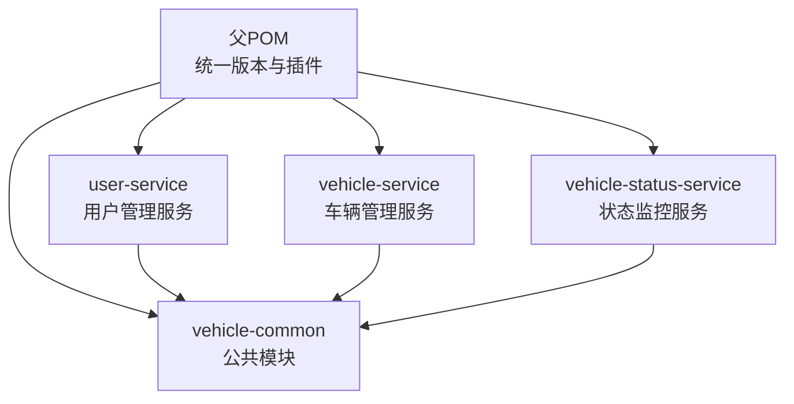
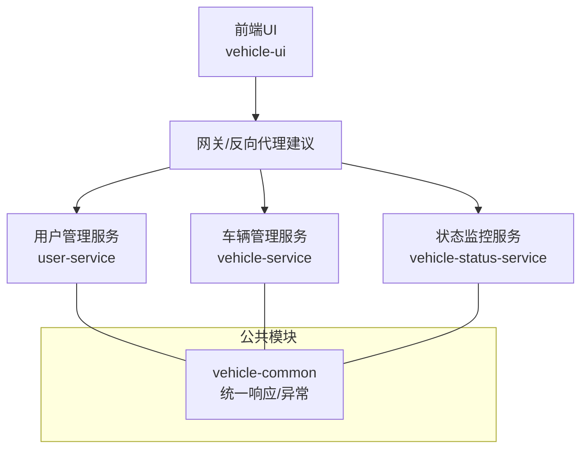
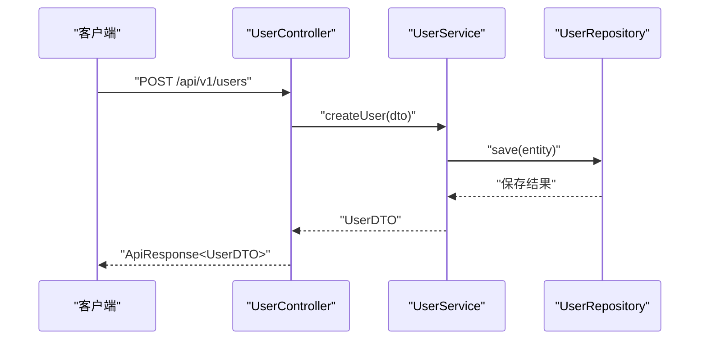
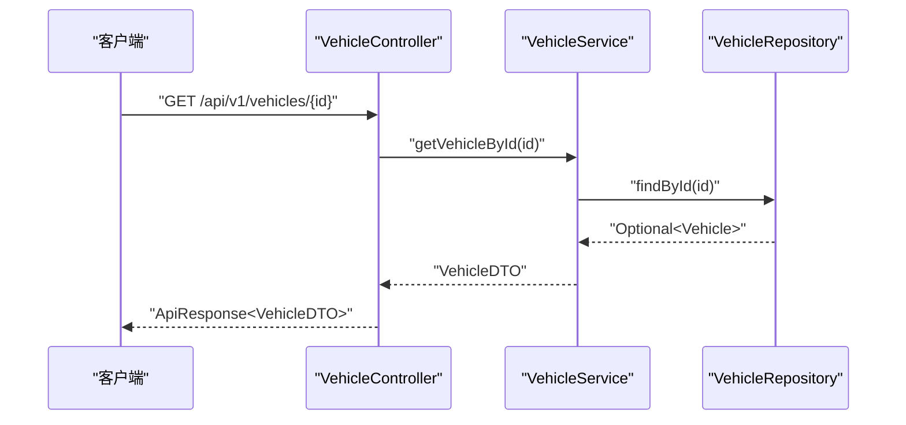
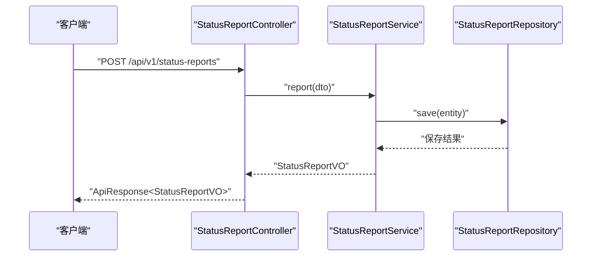
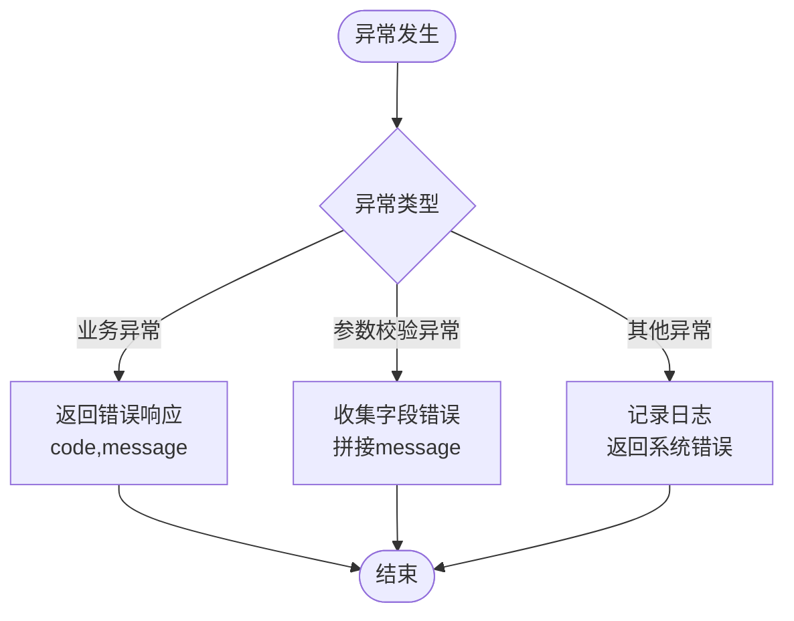
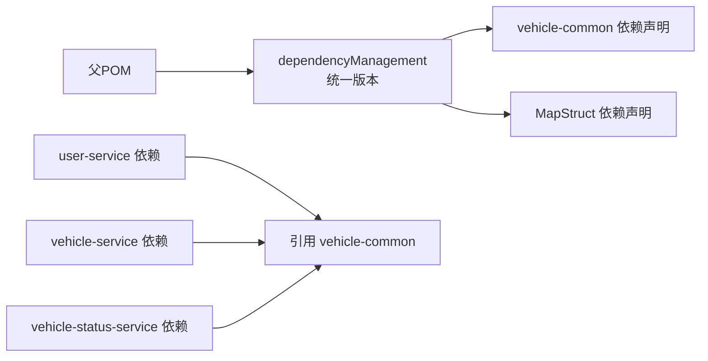

# 微服务架构设计

<cite>
**本文引用的文件**
- [pom.xml](file://pom.xml)
- [user-service/pom.xml](file://user-service/pom.xml)
- [vehicle-service/pom.xml](file://vehicle-service/pom.xml)
- [vehicle-status-service/pom.xml](file://vehicle-status-service/pom.xml)
- [vehicle-common/pom.xml](file://vehicle-common/pom.xml)
- [user-service/src/main/java/com/wenjie/cloud/user/UserServiceApplication.java](file://user-service/src/main/java/com/wenjie/cloud/user/UserServiceApplication.java)
- [vehicle-service/src/main/java/com/wenjie/cloud/vehicle/VehicleServiceApplication.java](file://vehicle-service/src/main/java/com/wenjie/cloud/vehicle/VehicleServiceApplication.java)
- [vehicle-status-service/src/main/java/com/wenjie/cloud/vehiclestatus/VehicleStatusServiceApplication.java](file://vehicle-status-service/src/main/java/com/wenjie/cloud/vehiclestatus/VehicleStatusServiceApplication.java)
- [user-service/src/main/resources/application.yml](file://user-service/src/main/resources/application.yml)
- [vehicle-service/src/main/resources/application.yml](file://vehicle-service/src/main/resources/application.yml)
- [vehicle-status-service/src/main/resources/application.yml](file://vehicle-status-service/src/main/resources/application.yml)
- [vehicle-common/src/main/java/com/wenjie/cloud/common/dto/ApiResponse.java](file://vehicle-common/src/main/java/com/wenjie/cloud/common/dto/ApiResponse.java)
- [vehicle-common/src/main/java/com/wenjie/cloud/common/exception/GlobalExceptionHandler.java](file://vehicle-common/src/main/java/com/wenjie/cloud/common/exception/GlobalExceptionHandler.java)
- [user-service/src/main/java/com/wenjie/cloud/user/controller/UserController.java](file://user-service/src/main/java/com/wenjie/cloud/user/controller/UserController.java)
- [vehicle-service/src/main/java/com/wenjie/cloud/vehicle/controller/VehicleController.java](file://vehicle-service/src/main/java/com/wenjie/cloud/vehicle/controller/VehicleController.java)
- [vehicle-status-service/src/main/java/com/wenjie/cloud/vehiclestatus/controller/StatusReportController.java](file://vehicle-status-service/src/main/java/com/wenjie/cloud/vehiclestatus/controller/StatusReportController.java)
</cite>

## 目录
1. [引言](#引言)
2. [项目结构](#项目结构)
3. [核心组件](#核心组件)
4. [架构总览](#架构总览)
5. [详细组件分析](#详细组件分析)
6. [依赖分析](#依赖分析)
7. [性能考虑](#性能考虑)
8. [故障排查指南](#故障排查指南)
9. [结论](#结论)
10. [附录](#附录)

## 引言
本设计文档面向车联网云平台的微服务架构，围绕用户管理服务、车辆管理服务与状态监控服务进行拆分与实现原理说明。文档涵盖服务边界划分原则、服务发现与负载均衡、容错处理、服务间通信（HTTP REST API）、Maven多模块管理、启动顺序与配置管理、监控策略，以及微服务架构的优势、挑战与最佳实践。

## 项目结构
该仓库采用Maven多模块聚合工程，父POM统一管理版本与插件，子模块按功能域拆分：
- vehicle-common：公共模块，提供统一响应封装与全局异常处理
- user-service：用户管理服务，提供用户增删改查REST接口
- vehicle-service：车辆管理服务，提供车辆增删改查REST接口
- vehicle-status-service：状态监控服务，提供状态上报、历史查询与最新状态查询REST接口

图表来源
- [pom.xml:36-43](file://pom.xml#L36-L43)
- [vehicle-common/pom.xml:18-30](file://vehicle-common/pom.xml#L18-L30)
- [user-service/pom.xml:18-49](file://user-service/pom.xml#L18-L49)
- [vehicle-service/pom.xml:18-49](file://vehicle-service/pom.xml#L18-L49)
- [vehicle-status-service/pom.xml:18-49](file://vehicle-status-service/pom.xml#L18-L49)

章节来源
- [pom.xml:1-119](file://pom.xml#L1-L119)

## 核心组件
- 统一响应封装：提供统一的响应体结构，包含状态码、消息、数据与时间戳，便于前端与网关层统一处理。
- 全局异常处理：集中拦截业务异常、参数校验异常与未知异常，统一返回标准响应。
- REST控制器：分别在用户、车辆与状态服务中暴露REST API，遵循资源化命名与HTTP方法约定。

章节来源
- [vehicle-common/src/main/java/com/wenjie/cloud/common/dto/ApiResponse.java:1-52](file://vehicle-common/src/main/java/com/wenjie/cloud/common/dto/ApiResponse.java#L1-L52)
- [vehicle-common/src/main/java/com/wenjie/cloud/common/exception/GlobalExceptionHandler.java:1-56](file://vehicle-common/src/main/java/com/wenjie/cloud/common/exception/GlobalExceptionHandler.java#L1-L56)
- [user-service/src/main/java/com/wenjie/cloud/user/controller/UserController.java:1-60](file://user-service/src/main/java/com/wenjie/cloud/user/controller/UserController.java#L1-L60)
- [vehicle-service/src/main/java/com/wenjie/cloud/vehicle/controller/VehicleController.java:1-61](file://vehicle-service/src/main/java/com/wenjie/cloud/vehicle/controller/VehicleController.java#L1-L61)
- [vehicle-status-service/src/main/java/com/wenjie/cloud/vehiclestatus/controller/StatusReportController.java:1-71](file://vehicle-status-service/src/main/java/com/wenjie/cloud/vehiclestatus/controller/StatusReportController.java#L1-L71)

## 架构总览
系统采用“多模块+多服务”的Spring Boot微服务架构，服务之间通过HTTP REST API通信，公共能力下沉至vehicle-common模块，确保一致性与可维护性。

说明
- 当前仓库未包含网关模块，建议在生产环境引入API网关或使用反向代理实现统一入口、鉴权与限流。
- 服务间通信以HTTP REST为主，未来可扩展为事件驱动或RPC（如引入Spring Cloud Stream/Feign）。

## 详细组件分析

### 用户管理服务（user-service）
- 功能边界：负责用户实体的增删改查，提供REST接口与数据持久化。
- 控制器：暴露用户资源的CRUD端点，使用统一响应与全局异常处理。
- 配置：独立端口与内存数据库，便于本地开发与测试。

图表来源
- [user-service/src/main/java/com/wenjie/cloud/user/controller/UserController.java:28-34](file://user-service/src/main/java/com/wenjie/cloud/user/controller/UserController.java#L28-L34)
- [user-service/src/main/resources/application.yml:1-40](file://user-service/src/main/resources/application.yml#L1-L40)

章节来源
- [user-service/src/main/java/com/wenjie/cloud/user/UserServiceApplication.java:1-16](file://user-service/src/main/java/com/wenjie/cloud/user/UserServiceApplication.java#L1-L16)
- [user-service/src/main/java/com/wenjie/cloud/user/controller/UserController.java:1-60](file://user-service/src/main/java/com/wenjie/cloud/user/controller/UserController.java#L1-L60)
- [user-service/src/main/resources/application.yml:1-40](file://user-service/src/main/resources/application.yml#L1-L40)

### 车辆管理服务（vehicle-service）
- 功能边界：负责车辆实体的增删改查，提供REST接口与数据持久化。
- 控制器：暴露车辆资源的CRUD端点，使用统一响应与全局异常处理。
- 配置：独立端口与内存数据库，便于本地开发与测试。

图表来源
- [vehicle-service/src/main/java/com/wenjie/cloud/vehicle/controller/VehicleController.java:36-42](file://vehicle-service/src/main/java/com/wenjie/cloud/vehicle/controller/VehicleController.java#L36-L42)
- [vehicle-service/src/main/resources/application.yml:1-40](file://vehicle-service/src/main/resources/application.yml#L1-L40)

章节来源
- [vehicle-service/src/main/java/com/wenjie/cloud/vehicle/VehicleServiceApplication.java:1-16](file://vehicle-service/src/main/java/com/wenjie/cloud/vehicle/VehicleServiceApplication.java#L1-L16)
- [vehicle-service/src/main/java/com/wenjie/cloud/vehicle/controller/VehicleController.java:1-61](file://vehicle-service/src/main/java/com/wenjie/cloud/vehicle/controller/VehicleController.java#L1-L61)
- [vehicle-service/src/main/resources/application.yml:1-40](file://vehicle-service/src/main/resources/application.yml#L1-L40)

### 状态监控服务（vehicle-status-service）
- 功能边界：负责车辆状态上报、历史查询与最新状态查询，支持分页与排序。
- 控制器：暴露状态上报、历史查询与最新状态端点，使用统一响应与全局异常处理。
- 配置：独立端口与内存数据库，便于本地开发与测试。

图表来源
- [vehicle-status-service/src/main/java/com/wenjie/cloud/vehiclestatus/controller/StatusReportController.java:33-39](file://vehicle-status-service/src/main/java/com/wenjie/cloud/vehiclestatus/controller/StatusReportController.java#L33-L39)
- [vehicle-status-service/src/main/resources/application.yml:1-30](file://vehicle-status-service/src/main/resources/application.yml#L1-L30)

章节来源
- [vehicle-status-service/src/main/java/com/wenjie/cloud/vehiclestatus/VehicleStatusServiceApplication.java:1-16](file://vehicle-status-service/src/main/java/com/wenjie/cloud/vehiclestatus/VehicleStatusServiceApplication.java#L1-L16)
- [vehicle-status-service/src/main/java/com/wenjie/cloud/vehiclestatus/controller/StatusReportController.java:1-71](file://vehicle-status-service/src/main/java/com/wenjie/cloud/vehiclestatus/controller/StatusReportController.java#L1-L71)
- [vehicle-status-service/src/main/resources/application.yml:1-30](file://vehicle-status-service/src/main/resources/application.yml#L1-L30)

### 统一响应与异常处理
- 统一响应：封装业务状态码、消息、数据与时间戳，便于前后端一致处理。
- 全局异常：拦截业务异常、参数校验异常与未知异常，统一返回标准响应。

图表来源
- [vehicle-common/src/main/java/com/wenjie/cloud/common/exception/GlobalExceptionHandler.java:26-54](file://vehicle-common/src/main/java/com/wenjie/cloud/common/exception/GlobalExceptionHandler.java#L26-L54)
- [vehicle-common/src/main/java/com/wenjie/cloud/common/dto/ApiResponse.java:38-50](file://vehicle-common/src/main/java/com/wenjie/cloud/common/dto/ApiResponse.java#L38-L50)

章节来源
- [vehicle-common/src/main/java/com/wenjie/cloud/common/dto/ApiResponse.java:1-52](file://vehicle-common/src/main/java/com/wenjie/cloud/common/dto/ApiResponse.java#L1-L52)
- [vehicle-common/src/main/java/com/wenjie/cloud/common/exception/GlobalExceptionHandler.java:1-56](file://vehicle-common/src/main/java/com/wenjie/cloud/common/exception/GlobalExceptionHandler.java#L1-L56)

## 依赖分析
- 版本统一：父POM集中管理Java版本、编码、Lombok与MapStruct版本。
- 依赖管理：父POM通过dependencyManagement统一声明内部模块与第三方依赖版本，子模块按需引入。
- 模块依赖：各业务服务均依赖vehicle-common，以复用统一响应与异常处理；同时引入Web、JPA与校验等Starter。

图表来源
- [pom.xml:46-67](file://pom.xml#L46-L67)
- [vehicle-common/pom.xml:18-30](file://vehicle-common/pom.xml#L18-L30)
- [user-service/pom.xml:18-49](file://user-service/pom.xml#L18-L49)
- [vehicle-service/pom.xml:18-49](file://vehicle-service/pom.xml#L18-L49)
- [vehicle-status-service/pom.xml:18-49](file://vehicle-status-service/pom.xml#L18-L49)

章节来源
- [pom.xml:25-91](file://pom.xml#L25-L91)

## 性能考虑
- 数据库选择：当前使用内存数据库，适合开发与测试；生产环境建议使用关系型数据库并启用连接池与索引优化。
- 分页与排序：状态服务已使用分页与排序，避免一次性返回大量历史数据。
- 缓存策略：可引入Redis缓存热点数据（如最新状态），降低数据库压力。
- 并发与限流：建议在网关层或服务侧增加限流与熔断策略，防止雪崩效应。
- 日志与监控：结合统一响应与异常处理，完善埋点与指标采集，支撑APM与链路追踪。

## 故障排查指南
- 统一异常处理：业务异常与参数校验异常会被统一拦截并返回标准响应，便于快速定位问题。
- 日志级别：服务配置了调试级别的包级日志，便于问题诊断。
- 数据初始化：数据库初始化模式为always，确保首次启动时自动建表与导入基础数据。

章节来源
- [vehicle-common/src/main/java/com/wenjie/cloud/common/exception/GlobalExceptionHandler.java:26-54](file://vehicle-common/src/main/java/com/wenjie/cloud/common/exception/GlobalExceptionHandler.java#L26-L54)
- [user-service/src/main/resources/application.yml:37-40](file://user-service/src/main/resources/application.yml#L37-L40)
- [vehicle-service/src/main/resources/application.yml:37-40](file://vehicle-service/src/main/resources/application.yml#L37-L40)
- [vehicle-status-service/src/main/resources/application.yml:24-26](file://vehicle-status-service/src/main/resources/application.yml#L24-L26)

## 结论
本架构以Maven多模块实现公共能力下沉，以Spring Boot微服务实现用户、车辆与状态三大领域的清晰边界。通过HTTP REST API实现服务间通信，配合统一响应与异常处理提升一致性与可观测性。建议在生产环境中引入网关、缓存、限流与监控体系，持续优化性能与稳定性。

## 附录

### 服务启动顺序与配置管理
- 启动顺序：建议按“公共模块 → 业务服务”的顺序启动，确保异常处理器与响应封装可用。
- 配置管理：各服务独立端口与数据库配置，便于并行运行与隔离测试；生产环境建议集中化配置中心（如Spring Cloud Config）。

章节来源
- [user-service/src/main/resources/application.yml:1-40](file://user-service/src/main/resources/application.yml#L1-L40)
- [vehicle-service/src/main/resources/application.yml:1-40](file://vehicle-service/src/main/resources/application.yml#L1-L40)
- [vehicle-status-service/src/main/resources/application.yml:1-30](file://vehicle-status-service/src/main/resources/application.yml#L1-L30)

### 服务发现、负载均衡与容错
- 服务发现：当前未包含注册中心依赖，可在引入Spring Cloud后接入Eureka/Nacos实现自动注册与发现。
- 负载均衡：结合网关或Spring Cloud LoadBalancer实现客户端负载均衡。
- 容错：引入Resilience4j或Sentinel实现熔断、降级与限流。

### 最佳实践
- 明确服务边界：以业务领域为核心划分服务，避免交叉耦合。
- 统一协议与契约：REST API保持版本化与向后兼容。
- 数据一致性：优先采用最终一致的事件模型，必要时使用分布式事务。
- 可观测性：统一日志、指标与链路追踪，建立告警与排障流程。