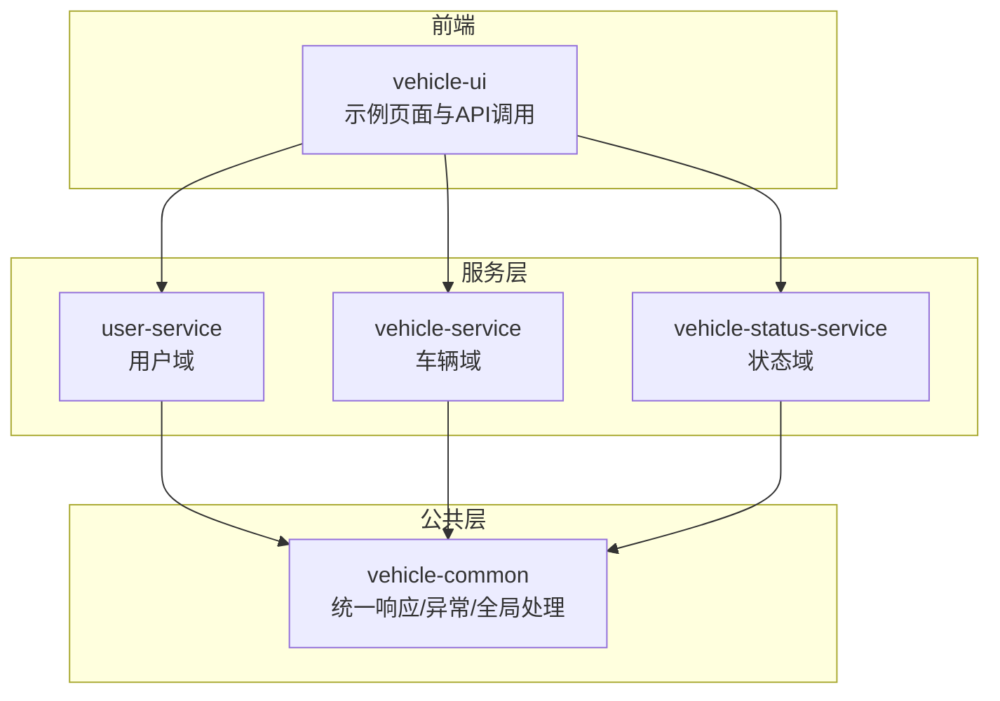
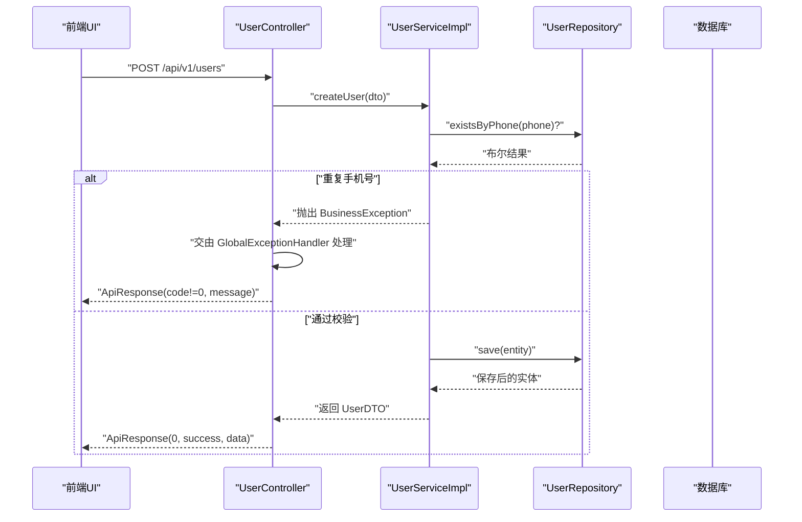
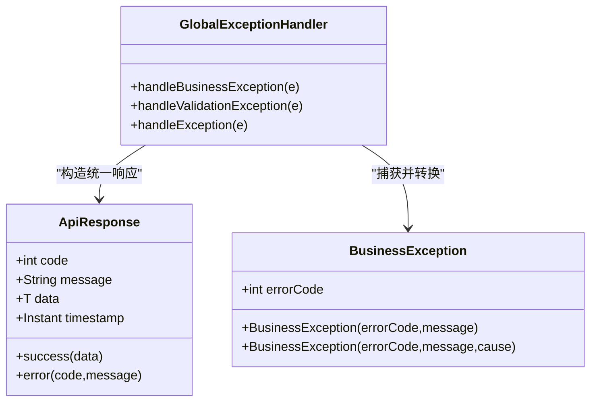
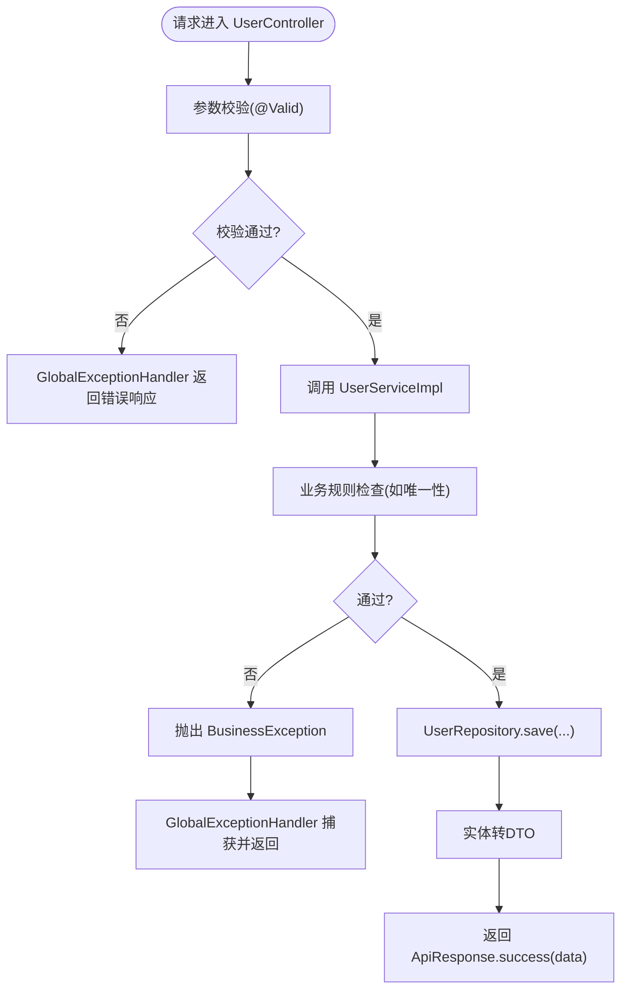
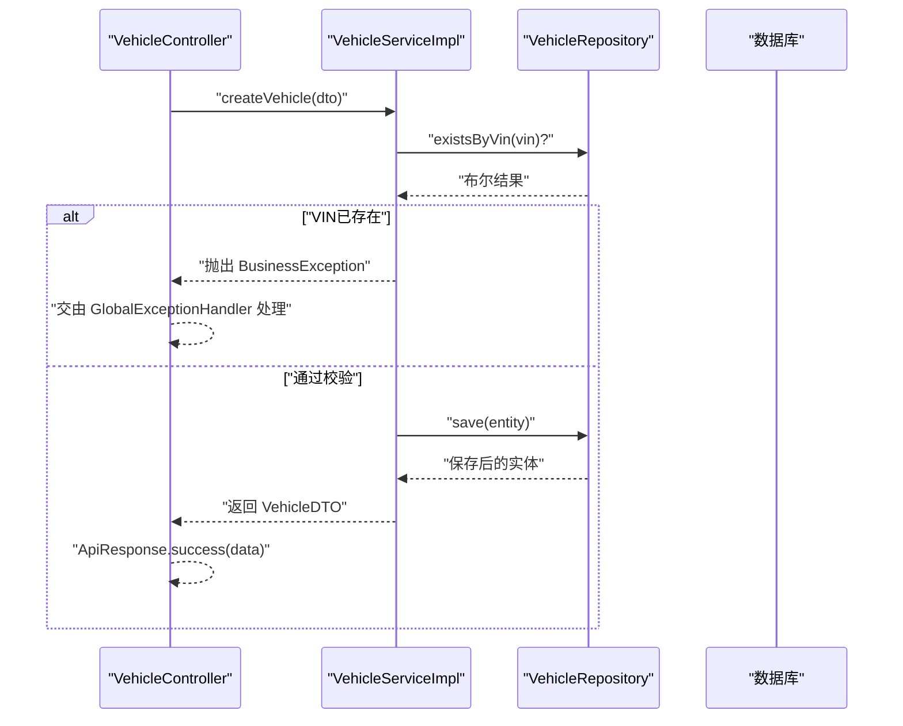
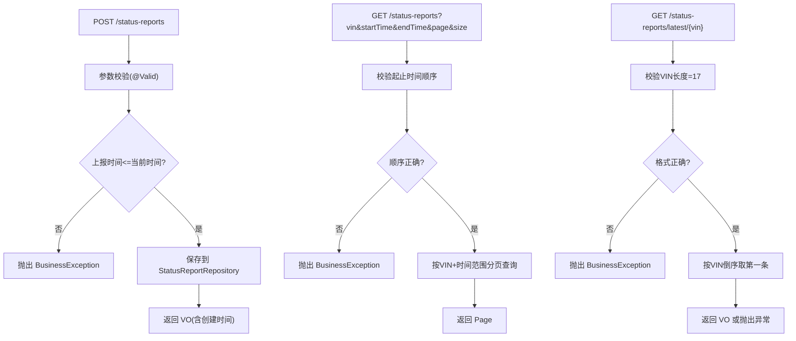
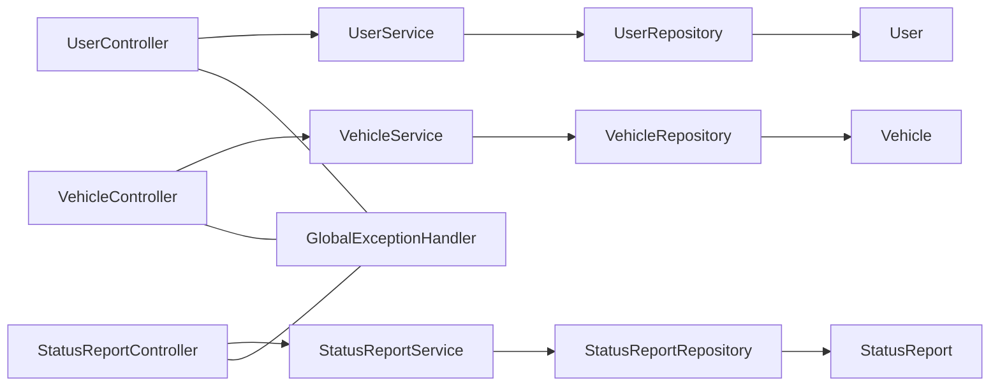

# 数据流设计

<cite>
**本文引用的文件**
- [ApiResponse.java](file://vehicle-common/src/main/java/com/wenjie/cloud/common/dto/ApiResponse.java)
- [BusinessException.java](file://vehicle-common/src/main/java/com/wenjie/cloud/common/exception/BusinessException.java)
- [GlobalExceptionHandler.java](file://vehicle-common/src/main/java/com/wenjie/cloud/common/exception/GlobalExceptionHandler.java)
- [UserController.java](file://user-service/src/main/java/com/wenjie/cloud/user/controller/UserController.java)
- [UserService.java](file://user-service/src/main/java/com/wenjie/cloud/user/service/UserService.java)
- [UserServiceImpl.java](file://user-service/src/main/java/com/wenjie/cloud/user/service/impl/UserServiceImpl.java)
- [User.java](file://user-service/src/main/java/com/wenjie/cloud/user/entity/User.java)
- [UserRepository.java](file://user-service/src/main/java/com/wenjie/cloud/user/repository/UserRepository.java)
- [VehicleController.java](file://vehicle-service/src/main/java/com/wenjie/cloud/vehicle/controller/VehicleController.java)
- [VehicleService.java](file://vehicle-service/src/main/java/com/wenjie/cloud/vehicle/service/VehicleService.java)
- [VehicleServiceImpl.java](file://vehicle-service/src/main/java/com/wenjie/cloud/vehicle/service/impl/VehicleServiceImpl.java)
- [Vehicle.java](file://vehicle-service/src/main/java/com/wenjie/cloud/vehicle/entity/Vehicle.java)
- [VehicleRepository.java](file://vehicle-service/src/main/java/com/wenjie/cloud/vehicle/repository/VehicleRepository.java)
- [StatusReportController.java](file://vehicle-status-service/src/main/java/com/wenjie/cloud/vehiclestatus/controller/StatusReportController.java)
- [StatusReportService.java](file://vehicle-status-service/src/main/java/com/wenjie/cloud/vehiclestatus/service/StatusReportService.java)
- [StatusReportServiceImpl.java](file://vehicle-status-service/src/main/java/com/wenjie/cloud/vehiclestatus/service/impl/StatusReportServiceImpl.java)
- [StatusReport.java](file://vehicle-status-service/src/main/java/com/wenjie/cloud/vehiclestatus/entity/StatusReport.java)
- [StatusReportRepository.java](file://vehicle-status-service/src/main/java/com/wenjie/cloud/vehiclestatus/repository/StatusReportRepository.java)
</cite>

## 目录
1. [简介](#简介)
2. [项目结构](#项目结构)
3. [核心组件](#核心组件)
4. [架构总览](#架构总览)
5. [详细组件分析](#详细组件分析)
6. [依赖分析](#依赖分析)
7. [性能考虑](#性能考虑)
8. [故障排查指南](#故障排查指南)
9. [结论](#结论)
10. [附录](#附录)

## 简介
本设计文档围绕车联网云平台的数据流架构展开，覆盖从用户请求到数据库存储的完整链路：请求接收、参数验证、业务处理、数据持久化与响应返回。文档重点阐述统一响应格式ApiResponse的设计理念与实现方式；解析异常处理机制（业务异常BusinessException与全局异常处理器）；梳理前后端多层验证体系；总结JPA Repository的数据访问模式与数据库操作优化；并给出数据流监控、日志记录与性能分析建议，以及数据一致性与事务管理策略。

## 项目结构
项目采用多模块微服务架构，按领域拆分：
- vehicle-common：公共模块，提供统一响应、异常与全局处理等基础设施
- user-service：用户域服务，提供用户增删改查能力
- vehicle-service：车辆域服务，提供车辆增删改查能力
- vehicle-status-service：车辆状态上报与查询服务，提供上报、历史分页查询、最新状态查询等能力
- vehicle-ui：前端示例，演示调用各服务接口

**图表来源**
- [UserController.java:21-60](file://user-service/src/main/java/com/wenjie/cloud/user/controller/UserController.java#L21-L60)
- [VehicleController.java:21-61](file://vehicle-service/src/main/java/com/wenjie/cloud/vehicle/controller/VehicleController.java#L21-L61)
- [StatusReportController.java:26-71](file://vehicle-status-service/src/main/java/com/wenjie/cloud/vehiclestatus/controller/StatusReportController.java#L26-L71)
- [ApiResponse.java:12-52](file://vehicle-common/src/main/java/com/wenjie/cloud/common/dto/ApiResponse.java#L12-L52)
- [BusinessException.java:11-27](file://vehicle-common/src/main/java/com/wenjie/cloud/common/exception/BusinessException.java#L11-L27)
- [GlobalExceptionHandler.java:19-56](file://vehicle-common/src/main/java/com/wenjie/cloud/common/exception/GlobalExceptionHandler.java#L19-L56)

**章节来源**
- [UserController.java:18-60](file://user-service/src/main/java/com/wenjie/cloud/user/controller/UserController.java#L18-L60)
- [VehicleController.java:18-61](file://vehicle-service/src/main/java/com/wenjie/cloud/vehicle/controller/VehicleController.java#L18-L61)
- [StatusReportController.java:23-71](file://vehicle-status-service/src/main/java/com/wenjie/cloud/vehiclestatus/controller/StatusReportController.java#L23-L71)

## 核心组件
- 统一响应格式 ApiResponse：封装业务状态码、消息、数据与时间戳，提供成功与失败静态工厂方法，确保前后端一致的响应契约
- 业务异常 BusinessException：承载业务错误码与消息，便于在服务层抛出并被全局异常处理器统一转换
- 全局异常处理器 GlobalExceptionHandler：拦截控制器层异常，统一输出ApiResponse，区分业务异常、参数校验异常与未知异常

**章节来源**
- [ApiResponse.java:12-52](file://vehicle-common/src/main/java/com/wenjie/cloud/common/dto/ApiResponse.java#L12-L52)
- [BusinessException.java:11-27](file://vehicle-common/src/main/java/com/wenjie/cloud/common/exception/BusinessException.java#L11-L27)
- [GlobalExceptionHandler.java:19-56](file://vehicle-common/src/main/java/com/wenjie/cloud/common/exception/GlobalExceptionHandler.java#L19-L56)

## 架构总览
下图展示典型请求从UI到数据库的端到端数据流，以“创建用户”为例：

**图表来源**
- [UserController.java:31-34](file://user-service/src/main/java/com/wenjie/cloud/user/controller/UserController.java#L31-L34)
- [UserServiceImpl.java:28-42](file://user-service/src/main/java/com/wenjie/cloud/user/service/impl/UserServiceImpl.java#L28-L42)
- [UserRepository.java:11-22](file://user-service/src/main/java/com/wenjie/cloud/user/repository/UserRepository.java#L11-L22)
- [GlobalExceptionHandler.java:26-31](file://vehicle-common/src/main/java/com/wenjie/cloud/common/exception/GlobalExceptionHandler.java#L26-L31)
- [ApiResponse.java:41-43](file://vehicle-common/src/main/java/com/wenjie/cloud/common/dto/ApiResponse.java#L41-L43)

## 详细组件分析

### 统一响应与异常处理
- ApiResponse 设计要点
  - 固定字段：code（业务状态码，0表示成功）、message（提示信息）、data（泛型数据）、timestamp（响应时间）
  - 静态工厂：success(data)与error(code,message)，简化控制器返回
- BusinessException
  - 携带业务错误码与消息，继承RuntimeException，便于在业务分支中快速失败
- GlobalExceptionHandler
  - 拦截 BusinessException 并映射为400，参数校验异常 MethodArgumentNotValidException 映射为400，兜底异常映射为500
  - 日志记录：对业务异常与未知异常分别记录warn与error级别日志

**图表来源**
- [ApiResponse.java:12-52](file://vehicle-common/src/main/java/com/wenjie/cloud/common/dto/ApiResponse.java#L12-L52)
- [BusinessException.java:11-27](file://vehicle-common/src/main/java/com/wenjie/cloud/common/exception/BusinessException.java#L11-L27)
- [GlobalExceptionHandler.java:19-56](file://vehicle-common/src/main/java/com/wenjie/cloud/common/exception/GlobalExceptionHandler.java#L19-L56)

**章节来源**
- [ApiResponse.java:12-52](file://vehicle-common/src/main/java/com/wenjie/cloud/common/dto/ApiResponse.java#L12-L52)
- [BusinessException.java:11-27](file://vehicle-common/src/main/java/com/wenjie/cloud/common/exception/BusinessException.java#L11-L27)
- [GlobalExceptionHandler.java:19-56](file://vehicle-common/src/main/java/com/wenjie/cloud/common/exception/GlobalExceptionHandler.java#L19-L56)

### 用户域数据流（创建/查询/删除）
- 控制器层：UserController 使用@RestController与@RequestMapping暴露REST接口，使用@Valid触发参数校验
- 服务层：UserServiceImpl 实现业务逻辑，使用@Transactional标注事务边界，进行业务规则校验（如手机号唯一性），并在成功时转换为DTO返回
- 数据访问层：UserRepository 继承JpaRepository，提供基于方法名的查询与存在性判断
- 实体层：User 定义表结构与列约束（唯一索引、长度、非空等）

**图表来源**
- [UserController.java:31-34](file://user-service/src/main/java/com/wenjie/cloud/user/controller/UserController.java#L31-L34)
- [UserServiceImpl.java:28-42](file://user-service/src/main/java/com/wenjie/cloud/user/service/impl/UserServiceImpl.java#L28-L42)
- [UserRepository.java:11-22](file://user-service/src/main/java/com/wenjie/cloud/user/repository/UserRepository.java#L11-L22)
- [User.java:16-38](file://user-service/src/main/java/com/wenjie/cloud/user/entity/User.java#L16-L38)
- [GlobalExceptionHandler.java:26-31](file://vehicle-common/src/main/java/com/wenjie/cloud/common/exception/GlobalExceptionHandler.java#L26-L31)

**章节来源**
- [UserController.java:18-60](file://user-service/src/main/java/com/wenjie/cloud/user/controller/UserController.java#L18-L60)
- [UserService.java:10-32](file://user-service/src/main/java/com/wenjie/cloud/user/service/UserService.java#L10-L32)
- [UserServiceImpl.java:27-80](file://user-service/src/main/java/com/wenjie/cloud/user/service/impl/UserServiceImpl.java#L27-L80)
- [UserRepository.java:11-23](file://user-service/src/main/java/com/wenjie/cloud/user/repository/UserRepository.java#L11-L23)
- [User.java:16-38](file://user-service/src/main/java/com/wenjie/cloud/user/entity/User.java#L16-L38)

### 车辆域数据流（创建/查询/删除）
- 与用户域类似，VehicleController、VehicleServiceImpl、VehicleRepository与Vehicle实体构成标准的CRUD链路
- 业务规则：VIN唯一性校验，不存在则抛出业务异常，最终由全局异常处理器统一返回

**图表来源**
- [VehicleController.java:31-34](file://vehicle-service/src/main/java/com/wenjie/cloud/vehicle/controller/VehicleController.java#L31-L34)
- [VehicleServiceImpl.java:28-43](file://vehicle-service/src/main/java/com/wenjie/cloud/vehicle/service/impl/VehicleServiceImpl.java#L28-L43)
- [VehicleRepository.java:11-23](file://vehicle-service/src/main/java/com/wenjie/cloud/vehicle/repository/VehicleRepository.java#L11-L23)

**章节来源**
- [VehicleController.java:18-61](file://vehicle-service/src/main/java/com/wenjie/cloud/vehicle/controller/VehicleController.java#L18-L61)
- [VehicleService.java:10-32](file://vehicle-service/src/main/java/com/wenjie/cloud/vehicle/service/VehicleService.java#L10-L32)
- [VehicleServiceImpl.java:27-82](file://vehicle-service/src/main/java/com/wenjie/cloud/vehicle/service/impl/VehicleServiceImpl.java#L27-L82)
- [VehicleRepository.java:11-23](file://vehicle-service/src/main/java/com/wenjie/cloud/vehicle/repository/VehicleRepository.java#L11-L23)
- [Vehicle.java:16-42](file://vehicle-service/src/main/java/com/wenjie/cloud/vehicle/entity/Vehicle.java#L16-L42)

### 车辆状态上报与查询
- 控制器层：StatusReportController 支持上报、历史分页查询、单车最新状态、全量最新状态
- 服务层：StatusReportServiceImpl 实现业务规则校验（上报时间不能晚于当前时间、VIN格式与范围校验、起止时间合法性），并进行实体与VO转换
- 数据访问层：StatusReportRepository 提供按VIN与时间范围分页查询、按VIN倒序取第一条、以及子查询获取每辆车最新上报
- 实体层：StatusReport 定义字段与索引（vin+report_time复合索引），PrePersist设置创建时间

**图表来源**
- [StatusReportController.java:36-69](file://vehicle-status-service/src/main/java/com/wenjie/cloud/vehiclestatus/controller/StatusReportController.java#L36-L69)
- [StatusReportServiceImpl.java:30-72](file://vehicle-status-service/src/main/java/com/wenjie/cloud/vehiclestatus/service/impl/StatusReportServiceImpl.java#L30-L72)
- [StatusReportRepository.java:16-38](file://vehicle-status-service/src/main/java/com/wenjie/cloud/vehiclestatus/repository/StatusReportRepository.java#L16-L38)
- [StatusReport.java:18-71](file://vehicle-status-service/src/main/java/com/wenjie/cloud/vehiclestatus/entity/StatusReport.java#L18-L71)

**章节来源**
- [StatusReportController.java:23-71](file://vehicle-status-service/src/main/java/com/wenjie/cloud/vehiclestatus/controller/StatusReportController.java#L23-L71)
- [StatusReportService.java:14-36](file://vehicle-status-service/src/main/java/com/wenjie/cloud/vehiclestatus/service/StatusReportService.java#L14-L36)
- [StatusReportServiceImpl.java:26-104](file://vehicle-status-service/src/main/java/com/wenjie/cloud/vehiclestatus/service/impl/StatusReportServiceImpl.java#L26-L104)
- [StatusReportRepository.java:16-39](file://vehicle-status-service/src/main/java/com/wenjie/cloud/vehiclestatus/repository/StatusReportRepository.java#L16-L39)
- [StatusReport.java:18-71](file://vehicle-status-service/src/main/java/com/wenjie/cloud/vehiclestatus/entity/StatusReport.java#L18-L71)

## 依赖分析
- 控制器依赖服务接口，服务实现依赖仓库接口，仓库接口继承JPA，实体定义表结构
- 异常处理横切于所有控制器，统一响应贯穿所有服务
- 事务注解分布在服务层，明确读写事务边界

**图表来源**
- [UserController.java:21-60](file://user-service/src/main/java/com/wenjie/cloud/user/controller/UserController.java#L21-L60)
- [VehicleController.java:21-61](file://vehicle-service/src/main/java/com/wenjie/cloud/vehicle/controller/VehicleController.java#L21-L61)
- [StatusReportController.java:26-71](file://vehicle-status-service/src/main/java/com/wenjie/cloud/vehiclestatus/controller/StatusReportController.java#L26-L71)
- [UserServiceImpl.java:23-80](file://user-service/src/main/java/com/wenjie/cloud/user/service/impl/UserServiceImpl.java#L23-L80)
- [VehicleServiceImpl.java:23-82](file://vehicle-service/src/main/java/com/wenjie/cloud/vehicle/service/impl/VehicleServiceImpl.java#L23-L82)
- [StatusReportServiceImpl.java:26-104](file://vehicle-status-service/src/main/java/com/wenjie/cloud/vehiclestatus/service/impl/StatusReportServiceImpl.java#L26-L104)
- [UserRepository.java:11-23](file://user-service/src/main/java/com/wenjie/cloud/user/repository/UserRepository.java#L11-L23)
- [VehicleRepository.java:11-23](file://vehicle-service/src/main/java/com/wenjie/cloud/vehicle/repository/VehicleRepository.java#L11-L23)
- [StatusReportRepository.java:16-39](file://vehicle-status-service/src/main/java/com/wenjie/cloud/vehiclestatus/repository/StatusReportRepository.java#L16-L39)
- [User.java:16-38](file://user-service/src/main/java/com/wenjie/cloud/user/entity/User.java#L16-L38)
- [Vehicle.java:16-42](file://vehicle-service/src/main/java/com/wenjie/cloud/vehicle/entity/Vehicle.java#L16-L42)
- [StatusReport.java:18-71](file://vehicle-status-service/src/main/java/com/wenjie/cloud/vehiclestatus/entity/StatusReport.java#L18-L71)
- [GlobalExceptionHandler.java:19-56](file://vehicle-common/src/main/java/com/wenjie/cloud/common/exception/GlobalExceptionHandler.java#L19-L56)

**章节来源**
- [UserServiceImpl.java:23-80](file://user-service/src/main/java/com/wenjie/cloud/user/service/impl/UserServiceImpl.java#L23-L80)
- [VehicleServiceImpl.java:23-82](file://vehicle-service/src/main/java/com/wenjie/cloud/vehicle/service/impl/VehicleServiceImpl.java#L23-L82)
- [StatusReportServiceImpl.java:26-104](file://vehicle-status-service/src/main/java/com/wenjie/cloud/vehiclestatus/service/impl/StatusReportServiceImpl.java#L26-L104)

## 性能考虑
- 数据库索引
  - StatusReport 实体定义了 vin 与 report_time 的复合索引，有利于按VIN与时间范围查询与“每车最新”场景
- 分页查询
  - 历史查询使用 PageRequest 排序与分页，避免一次性拉取大量数据
- 事务边界
  - 写操作使用 @Transactional 包裹，读操作使用 @Transactional(readOnly=true) 降低锁竞争
- 日志与监控
  - 在关键节点记录info/warn/error日志，结合统一响应的timestamp便于追踪请求耗时与异常定位
- DTO/VO转换
  - 服务层集中进行实体与DTO/VO转换，减少控制器负担，提升可维护性

**章节来源**
- [StatusReport.java:20-22](file://vehicle-status-service/src/main/java/com/wenjie/cloud/vehiclestatus/entity/StatusReport.java#L20-L22)
- [StatusReportController.java:44-53](file://vehicle-status-service/src/main/java/com/wenjie/cloud/vehiclestatus/controller/StatusReportController.java#L44-L53)
- [UserServiceImpl.java:27-42](file://user-service/src/main/java/com/wenjie/cloud/user/service/impl/UserServiceImpl.java#L27-L42)
- [VehicleServiceImpl.java:27-43](file://vehicle-service/src/main/java/com/wenjie/cloud/vehicle/service/impl/VehicleServiceImpl.java#L27-L43)
- [StatusReportServiceImpl.java:30-41](file://vehicle-status-service/src/main/java/com/wenjie/cloud/vehiclestatus/service/impl/StatusReportServiceImpl.java#L30-L41)

## 故障排查指南
- 业务异常排查
  - 现象：客户端收到code!=0的统一响应
  - 排查：查看服务日志中的warn级别记录，确认BusinessException的错误码与消息来源
- 参数校验异常排查
  - 现象：400错误，message为字段校验组合信息
  - 排查：检查控制器方法上的@Valid与DTO字段校验注解配置
- 未知异常排查
  - 现象：500错误，message为系统内部错误
  - 排查：查看服务日志中的error级别堆栈，定位具体异常位置

**章节来源**
- [GlobalExceptionHandler.java:26-54](file://vehicle-common/src/main/java/com/wenjie/cloud/common/exception/GlobalExceptionHandler.java#L26-L54)

## 结论
本项目通过统一响应、业务异常与全局异常处理构建了清晰的错误与响应契约；通过JPA Repository与实体模型实现了标准化的数据访问；通过事务注解明确了读写边界；通过索引与分页提升了查询性能。整体数据流自上而下职责分明，便于扩展与维护。

## 附录
- 数据一致性与事务策略
  - 写操作（创建用户/车辆/状态上报）使用 @Transactional，确保数据库变更原子性
  - 读操作使用 @Transactional(readOnly=true)，减少不必要的写锁
  - 业务规则前置校验（唯一性、时间范围、VIN格式）在服务层执行，避免无效写入
- 监控与日志
  - 建议在网关或API层增加请求耗时、QPS与错误率指标采集
  - 对关键业务（创建、删除、状态上报）增加审计日志字段（如操作人、IP、traceId）
- 前后端验证协作
  - 前端负责基础输入校验与交互体验
  - 后端负责业务规则校验与安全边界，两者共同保障数据质量