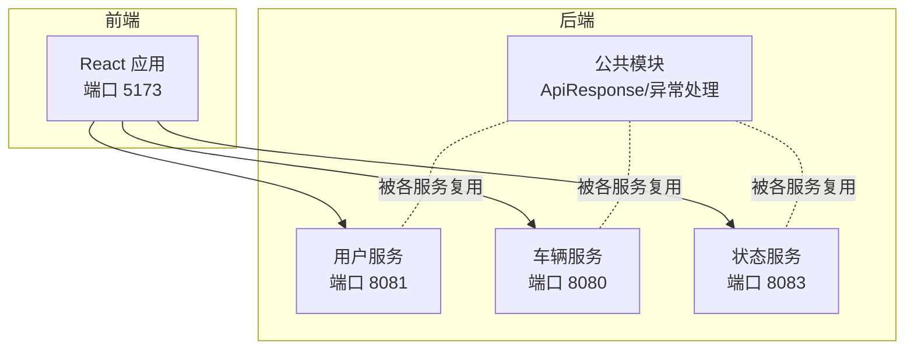
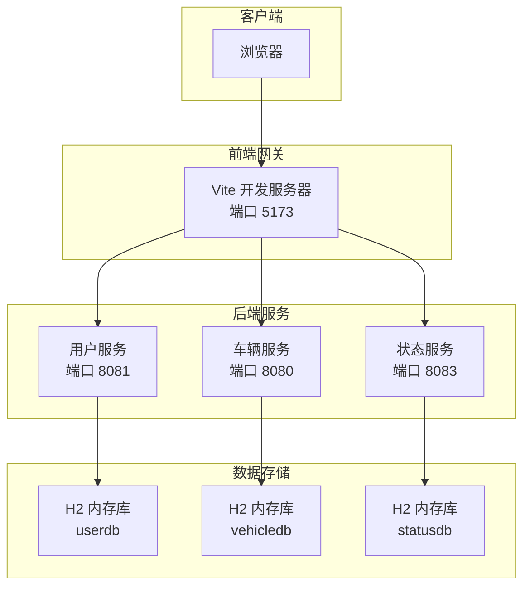
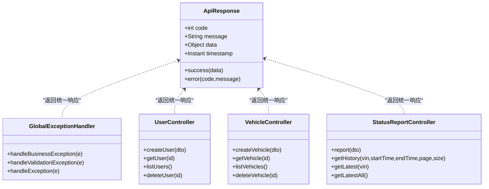
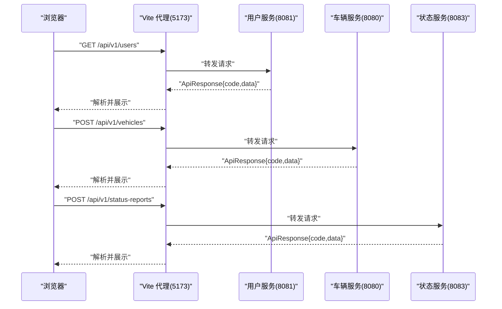
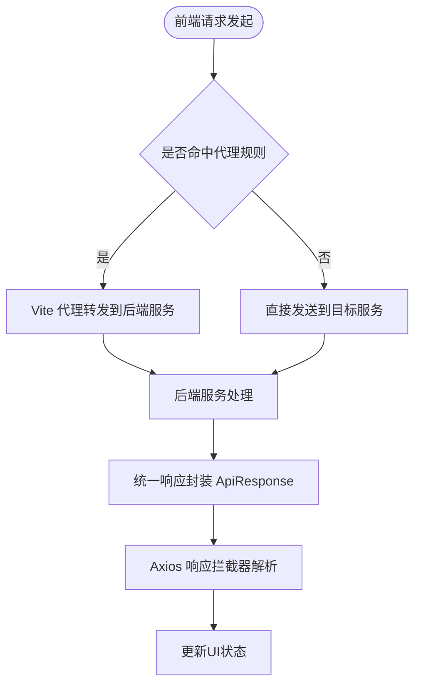
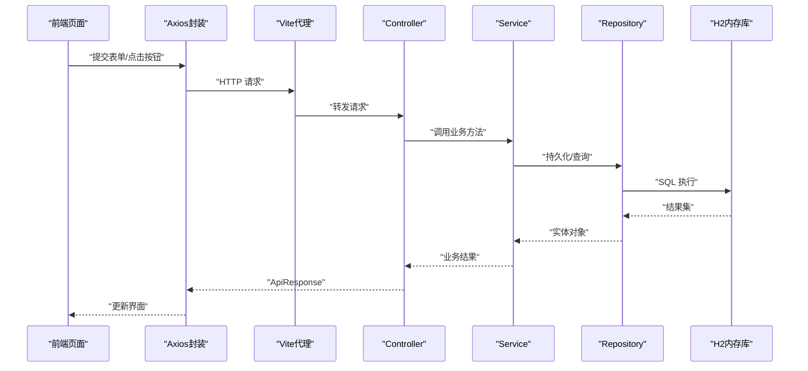
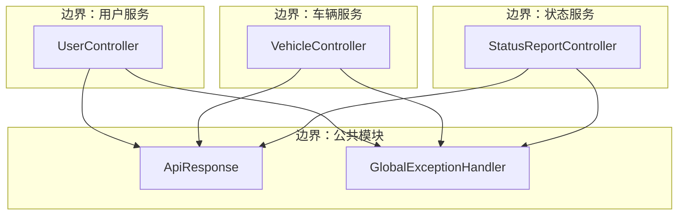
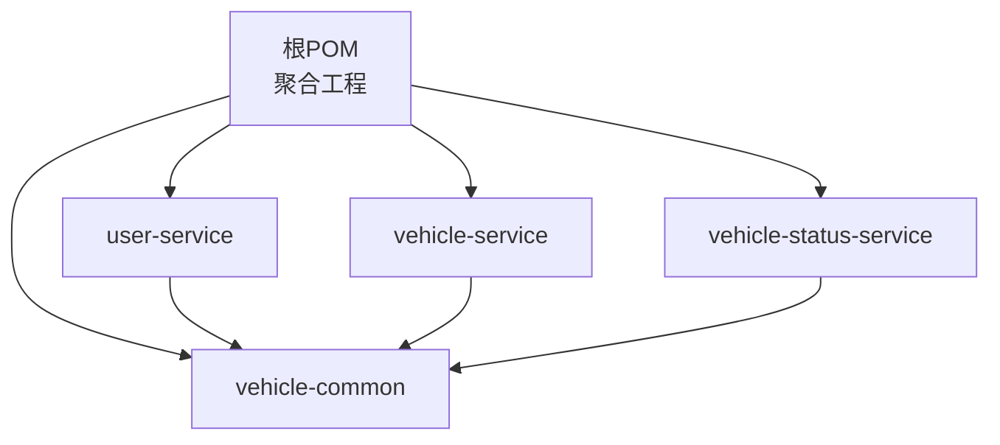

# 系统架构设计

<cite>
**本文引用的文件**
- [根POM文件](file://pom.xml)
- [项目说明文档](file://README.md)
- [用户服务启动类](file://user-service/src/main/java/com/wenjie/cloud/user/UserServiceApplication.java)
- [车辆服务启动类](file://vehicle-service/src/main/java/com/wenjie/cloud/vehicle/VehicleServiceApplication.java)
- [车辆状态服务启动类](file://vehicle-status-service/src/main/java/com/wenjie/cloud/vehiclestatus/VehicleStatusServiceApplication.java)
- [公共响应封装](file://vehicle-common/src/main/java/com/wenjie/cloud/common/dto/ApiResponse.java)
- [全局异常处理器](file://vehicle-common/src/main/java/com/wenjie/cloud/common/exception/GlobalExceptionHandler.java)
- [用户控制器](file://user-service/src/main/java/com/wenjie/cloud/user/controller/UserController.java)
- [车辆控制器](file://vehicle-service/src/main/java/com/wenjie/cloud/vehicle/controller/VehicleController.java)
- [状态报告控制器](file://vehicle-status-service/src/main/java/com/wenjie/cloud/vehiclestatus/controller/StatusReportController.java)
- [前端Vite配置](file://vehicle-ui/vite.config.js)
- [前端Axios封装](file://vehicle-ui/src/api/request.js)
- [前端用户API封装](file://vehicle-ui/src/api/userApi.js)
- [前端车辆API封装](file://vehicle-ui/src/api/vehicleApi.js)
</cite>

## 目录
1. [引言](#引言)
2. [项目结构](#项目结构)
3. [核心组件](#核心组件)
4. [架构总览](#架构总览)
5. [详细组件分析](#详细组件分析)
6. [依赖分析](#依赖分析)
7. [性能考虑](#性能考虑)
8. [故障排除指南](#故障排除指南)
9. [结论](#结论)
10. [附录](#附录)

## 引言
本文件面向车联网云平台的系统架构设计，基于当前多模块Spring Boot后端与React前端的演示项目，给出微服务架构设计原则、服务拆分策略、服务间通信机制、负载均衡考虑、前后端分离实现、数据流设计、系统边界与组件交互、部署拓扑以及技术决策的权衡与约束。

## 项目结构
该项目采用Maven聚合工程组织，包含以下模块：
- vehicle-common：公共基础设施模块，提供统一响应封装与全局异常处理
- user-service：用户管理微服务，提供用户CRUD接口
- vehicle-service：车辆管理微服务，提供车辆CRUD接口
- vehicle-status-service：车辆状态上报与查询微服务，支持分页与最新状态查询
- vehicle-ui：React前端单页应用，通过Vite代理转发API请求

**图表来源**
- [根POM文件](file://pom.xml)
- [用户服务启动类](file://user-service/src/main/java/com/wenjie/cloud/user/UserServiceApplication.java)
- [车辆服务启动类](file://vehicle-service/src/main/java/com/wenjie/cloud/vehicle/VehicleServiceApplication.java)
- [车辆状态服务启动类](file://vehicle-status-service/src/main/java/com/wenjie/cloud/vehiclestatus/VehicleStatusServiceApplication.java)
- [前端Vite配置](file://vehicle-ui/vite.config.js)

**章节来源**
- [根POM文件](file://pom.xml)
- [项目说明文档](file://README.md)

## 核心组件
- 统一响应封装：提供标准响应结构，包含状态码、消息、数据与时间戳，便于前后端契约一致化
- 全局异常处理：集中处理业务异常、参数校验异常与未知异常，返回统一响应格式
- 微服务边界：用户服务、车辆服务、状态服务分别承担不同领域职责，避免功能耦合
- 前后端分离：前端通过Axios封装统一处理响应与错误，Vite开发服务器配置代理转发至后端服务

**章节来源**
- [公共响应封装](file://vehicle-common/src/main/java/com/wenjie/cloud/common/dto/ApiResponse.java)
- [全局异常处理器](file://vehicle-common/src/main/java/com/wenjie/cloud/common/exception/GlobalExceptionHandler.java)
- [用户控制器](file://user-service/src/main/java/com/wenjie/cloud/user/controller/UserController.java)
- [车辆控制器](file://vehicle-service/src/main/java/com/wenjie/cloud/vehicle/controller/VehicleController.java)
- [状态报告控制器](file://vehicle-status-service/src/main/java/com/wenjie/cloud/vehiclestatus/controller/StatusReportController.java)
- [前端Axios封装](file://vehicle-ui/src/api/request.js)
- [前端Vite配置](file://vehicle-ui/vite.config.js)

## 架构总览
系统采用微服务架构与前后端分离模式：
- 微服务层：用户服务、车辆服务、状态服务独立部署，端口区分，职责清晰
- 公共层：统一响应与异常处理在公共模块中定义，被各服务复用
- 前端层：React应用通过Vite代理将/api/v1/*请求转发到对应后端服务
- 数据层：各服务使用H2内存数据库，启动时自动初始化测试数据

**图表来源**
- [前端Vite配置](file://vehicle-ui/vite.config.js)
- [用户服务启动类](file://user-service/src/main/java/com/wenjie/cloud/user/UserServiceApplication.java)
- [车辆服务启动类](file://vehicle-service/src/main/java/com/wenjie/cloud/vehicle/VehicleServiceApplication.java)
- [车辆状态服务启动类](file://vehicle-status-service/src/main/java/com/wenjie/cloud/vehiclestatus/VehicleStatusServiceApplication.java)
- [项目说明文档](file://README.md)

## 详细组件分析

### 微服务拆分策略
- 用户服务：负责用户实体的增删改查，参数校验（姓名非空、手机号格式），H2内存库初始化5条用户数据
- 车辆服务：负责车辆实体的增删改查，参数校验（VIN码长度与格式），H2内存库初始化30条车辆数据
- 状态服务：负责车辆状态上报、历史查询与最新状态查询，支持分页与排序，数据模型包含上报时间等字段

**图表来源**
- [公共响应封装](file://vehicle-common/src/main/java/com/wenjie/cloud/common/dto/ApiResponse.java)
- [全局异常处理器](file://vehicle-common/src/main/java/com/wenjie/cloud/common/exception/GlobalExceptionHandler.java)
- [用户控制器](file://user-service/src/main/java/com/wenjie/cloud/user/controller/UserController.java)
- [车辆控制器](file://vehicle-service/src/main/java/com/wenjie/cloud/vehicle/controller/VehicleController.java)
- [状态报告控制器](file://vehicle-status-service/src/main/java/com/wenjie/cloud/vehiclestatus/controller/StatusReportController.java)

**章节来源**
- [用户控制器](file://user-service/src/main/java/com/wenjie/cloud/user/controller/UserController.java)
- [车辆控制器](file://vehicle-service/src/main/java/com/wenjie/cloud/vehicle/controller/VehicleController.java)
- [状态报告控制器](file://vehicle-status-service/src/main/java/com/wenjie/cloud/vehiclestatus/controller/StatusReportController.java)
- [公共响应封装](file://vehicle-common/src/main/java/com/wenjie/cloud/common/dto/ApiResponse.java)
- [全局异常处理器](file://vehicle-common/src/main/java/com/wenjie/cloud/common/exception/GlobalExceptionHandler.java)

### 服务间通信机制与负载均衡
- 当前实现：前端通过Vite代理将/api/v1/*请求转发到对应后端服务端口（用户服务8081、车辆服务8080、状态服务8083）
- 负载均衡：当前为单实例部署，未集成外部负载均衡器；可扩展方向包括：Nginx反向代理、Spring Cloud LoadBalancer或云厂商SLB
- 通信协议：HTTP/HTTPS REST API，统一JSON响应格式

**图表来源**
- [前端Vite配置](file://vehicle-ui/vite.config.js)
- [前端Axios封装](file://vehicle-ui/src/api/request.js)
- [用户控制器](file://user-service/src/main/java/com/wenjie/cloud/user/controller/UserController.java)
- [车辆控制器](file://vehicle-service/src/main/java/com/wenjie/cloud/vehicle/controller/VehicleController.java)
- [状态报告控制器](file://vehicle-status-service/src/main/java/com/wenjie/cloud/vehiclestatus/controller/StatusReportController.java)

**章节来源**
- [前端Vite配置](file://vehicle-ui/vite.config.js)
- [前端Axios封装](file://vehicle-ui/src/api/request.js)

### 前后端分离架构实现
- API网关设计：当前未实现专用API网关，采用Vite开发服务器代理实现本地联调
- 跨域处理：通过代理配置changeOrigin=true实现同源代理，避免浏览器跨域限制
- 安全策略：当前未实现鉴权与CORS配置，建议在生产环境增加Spring Security、JWT令牌与CORS白名单

**图表来源**
- [前端Vite配置](file://vehicle-ui/vite.config.js)
- [前端Axios封装](file://vehicle-ui/src/api/request.js)

**章节来源**
- [前端Vite配置](file://vehicle-ui/vite.config.js)
- [前端Axios封装](file://vehicle-ui/src/api/request.js)

### 数据流设计
从前端请求到数据库存储的完整流程：
1. 前端通过Axios封装发送HTTP请求
2. Vite代理将请求转发到对应后端服务
3. 控roller接收请求，进行参数校验
4. Service层执行业务逻辑
5. Repository层操作H2内存数据库
6. 统一响应封装ApiResponse返回给前端

**图表来源**
- [前端Axios封装](file://vehicle-ui/src/api/request.js)
- [前端Vite配置](file://vehicle-ui/vite.config.js)
- [用户控制器](file://user-service/src/main/java/com/wenjie/cloud/user/controller/UserController.java)
- [车辆控制器](file://vehicle-service/src/main/java/com/wenjie/cloud/vehicle/controller/VehicleController.java)
- [状态报告控制器](file://vehicle-status-service/src/main/java/com/wenjie/cloud/vehiclestatus/controller/StatusReportController.java)

**章节来源**
- [前端Axios封装](file://vehicle-ui/src/api/request.js)
- [用户控制器](file://user-service/src/main/java/com/wenjie/cloud/user/controller/UserController.java)
- [车辆控制器](file://vehicle-service/src/main/java/com/wenjie/cloud/vehicle/controller/VehicleController.java)
- [状态报告控制器](file://vehicle-status-service/src/main/java/com/wenjie/cloud/vehiclestatus/controller/StatusReportController.java)

### 系统边界与组件交互
- 系统边界：以模块为单位划分，用户服务、车辆服务、状态服务互不依赖，仅通过HTTP API交互
- 组件交互：前端通过统一API路径与后端交互，后端通过Spring MVC暴露REST接口，公共模块提供统一响应与异常处理
- 部署边界：每个服务独立启动，端口隔离，便于独立扩展与运维

**图表来源**
- [用户控制器](file://user-service/src/main/java/com/wenjie/cloud/user/controller/UserController.java)
- [车辆控制器](file://vehicle-service/src/main/java/com/wenjie/cloud/vehicle/controller/VehicleController.java)
- [状态报告控制器](file://vehicle-status-service/src/main/java/com/wenjie/cloud/vehiclestatus/controller/StatusReportController.java)
- [公共响应封装](file://vehicle-common/src/main/java/com/wenjie/cloud/common/dto/ApiResponse.java)
- [全局异常处理器](file://vehicle-common/src/main/java/com/wenjie/cloud/common/exception/GlobalExceptionHandler.java)

**章节来源**
- [用户控制器](file://user-service/src/main/java/com/wenjie/cloud/user/controller/UserController.java)
- [车辆控制器](file://vehicle-service/src/main/java/com/wenjie/cloud/vehicle/controller/VehicleController.java)
- [状态报告控制器](file://vehicle-status-service/src/main/java/com/wenjie/cloud/vehiclestatus/controller/StatusReportController.java)
- [公共响应封装](file://vehicle-common/src/main/java/com/wenjie/cloud/common/dto/ApiResponse.java)
- [全局异常处理器](file://vehicle-common/src/main/java/com/wenjie/cloud/common/exception/GlobalExceptionHandler.java)

## 依赖分析
- 项目采用Maven聚合工程，父POM统一管理依赖版本与构建插件
- vehicle-common作为公共模块被其他服务模块依赖
- 各服务模块独立启动，无相互直接依赖，体现微服务解耦原则

**图表来源**
- [根POM文件](file://pom.xml)

**章节来源**
- [根POM文件](file://pom.xml)

## 性能考虑
- 当前使用H2内存数据库，适合开发与演示，不适用于高并发生产场景
- 建议在生产环境采用关系型数据库（如MySQL/PostgreSQL）与连接池优化
- 前端Axios设置超时时间，可在网络异常时快速反馈
- 可引入缓存（Redis）减少重复查询压力
- 负载均衡与限流策略应在网关层实现

## 故障排除指南
- 统一异常处理：业务异常、参数校验异常与未知异常均通过全局异常处理器转换为统一响应格式，便于前端提示与日志定位
- 前端错误拦截：Axios响应拦截器对非成功状态进行错误提示与Promise拒绝，便于上层捕获
- 建议：增加更详细的日志记录与错误追踪（如链路追踪与错误监控）

**章节来源**
- [全局异常处理器](file://vehicle-common/src/main/java/com/wenjie/cloud/common/exception/GlobalExceptionHandler.java)
- [前端Axios封装](file://vehicle-ui/src/api/request.js)

## 结论
该车联网云平台演示项目展示了清晰的微服务拆分与前后端分离架构。通过公共模块统一响应与异常处理，确保了接口一致性与可维护性。当前为单实例演示部署，建议在生产环境中引入API网关、鉴权安全、数据库持久化、缓存与负载均衡等能力，以满足高可用与高性能需求。

## 附录
- 快速启动与端口说明：用户服务8081、车辆服务8080、状态服务8083、前端5173
- 初始化数据：用户服务5条、车辆服务30条，均匀分配
- H2控制台：车辆服务与用户服务分别提供Web控制台访问入口

**章节来源**
- [项目说明文档](file://README.md)