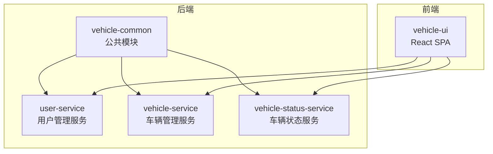
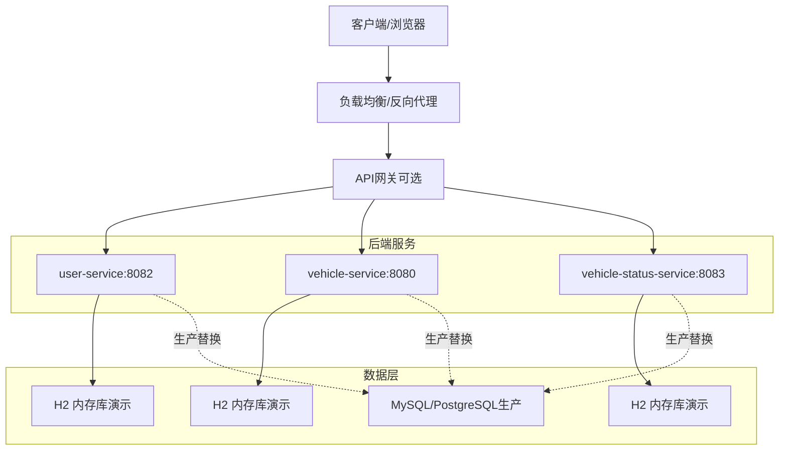
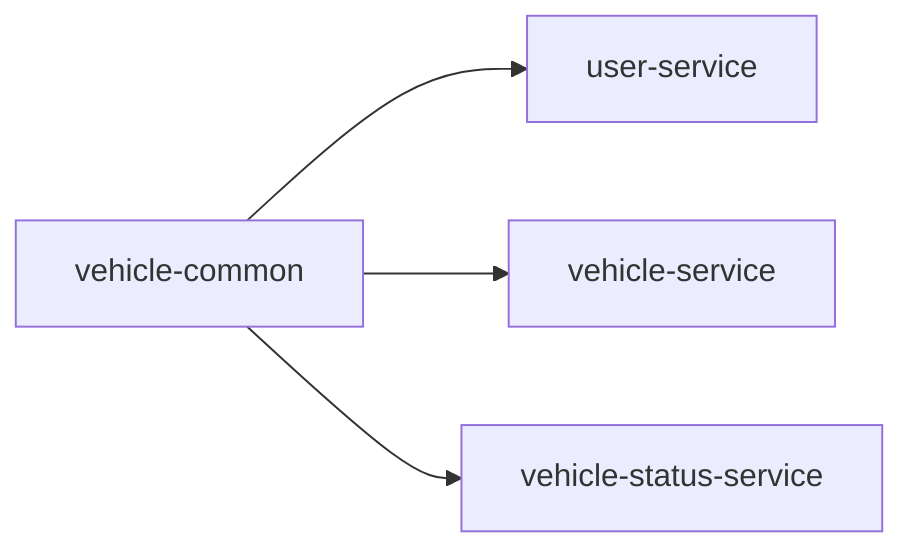

# 部署架构与拓扑

<cite>
**本文引用的文件**
- [根POM](file://pom.xml)
- [项目总览与快速启动](file://README.md)
- [用户服务配置](file://user-service/src/main/resources/application.yml)
- [车辆服务配置](file://vehicle-service/src/main/resources/application.yml)
- [车辆状态服务配置](file://vehicle-status-service/src/main/resources/application.yml)
- [用户服务POM](file://user-service/pom.xml)
- [车辆服务POM](file://vehicle-service/pom.xml)
- [车辆状态服务POM](file://vehicle-status-service/pom.xml)
- [公共模块POM](file://vehicle-common/pom.xml)
- [用户服务启动类](file://user-service/src/main/java/com/wenjie/cloud/user/UserServiceApplication.java)
- [车辆服务启动类](file://vehicle-service/src/main/java/com/wenjie/cloud/vehicle/VehicleServiceApplication.java)
- [车辆状态服务启动类](file://vehicle-status-service/src/main/java/com/wenjie/cloud/vehiclestatus/VehicleStatusServiceApplication.java)
- [统一响应模型](file://vehicle-common/src/main/java/com/wenjie/cloud/common/dto/ApiResponse.java)
- [全局异常处理](file://vehicle-common/src/main/java/com/wenjie/cloud/common/exception/GlobalExceptionHandler.java)
- [前端包配置](file://vehicle-ui/package.json)
</cite>

## 目录
1. [引言](#引言)
2. [项目结构](#项目结构)
3. [核心组件](#核心组件)
4. [架构总览](#架构总览)
5. [详细组件分析](#详细组件分析)
6. [依赖关系分析](#依赖关系分析)
7. [性能考虑](#性能考虑)
8. [故障排查指南](#故障排查指南)
9. [结论](#结论)
10. [附录](#附录)

## 引言
本文件面向车联网云平台的部署与运维团队，基于当前多模块Spring Boot后端与React前端的代码库，给出可落地的部署架构与拓扑设计建议。内容涵盖微服务独立部署、端口与资源规划、开发/测试/生产差异化配置、容器化与Kubernetes部署思路、负载均衡与高可用设计、数据库选型与迁移策略、监控与日志、部署自动化与CI/CD建议，以及安全与备份恢复要点。

## 项目结构
项目采用Maven多模块结构，包含统一公共模块与三个业务服务模块，配合React前端。模块间通过公共模块共享统一响应与异常处理能力；服务之间无直接耦合，便于独立演进与部署。

图表来源
- [根POM:36-43](file://pom.xml#L36-L43)
- [用户服务POM:18-23](file://user-service/pom.xml#L18-L23)
- [车辆服务POM:18-23](file://vehicle-service/pom.xml#L18-L23)
- [车辆状态服务POM:18-23](file://vehicle-status-service/pom.xml#L18-L23)
- [公共模块POM:18-29](file://vehicle-common/pom.xml#L18-L29)

章节来源
- [根POM:36-43](file://pom.xml#L36-L43)
- [项目总览与快速启动:19-27](file://README.md#L19-L27)

## 核心组件
- 公共模块（vehicle-common）
  - 统一响应模型与全局异常处理，确保各服务对外接口一致、错误处理规范。
- 业务服务
  - user-service：用户管理，端口配置见服务配置文件。
  - vehicle-service：车辆管理，端口配置见服务配置文件。
  - vehicle-status-service：车辆状态服务，端口配置见服务配置文件。
- 前端（vehicle-ui）
  - React单页应用，开发时由Vite代理转发API请求至后端服务。

章节来源
- [统一响应模型:12-36](file://vehicle-common/src/main/java/com/wenjie/cloud/common/dto/ApiResponse.java#L12-L36)
- [全局异常处理:19-54](file://vehicle-common/src/main/java/com/wenjie/cloud/common/exception/GlobalExceptionHandler.java#L19-L54)
- [用户服务配置:1-40](file://user-service/src/main/resources/application.yml#L1-L40)
- [车辆服务配置:1-40](file://vehicle-service/src/main/resources/application.yml#L1-L40)
- [车辆状态服务配置:1-30](file://vehicle-status-service/src/main/resources/application.yml#L1-L30)
- [前端包配置:1-32](file://vehicle-ui/package.json#L1-L32)

## 架构总览
下图展示典型部署拓扑：前端通过反向代理或网关暴露服务，后端三个业务服务独立部署，各自绑定不同端口；数据库在演示环境使用H2内存库，在生产环境建议替换为持久化数据库并启用高可用。

图表来源
- [用户服务配置:1-40](file://user-service/src/main/resources/application.yml#L1-L40)
- [车辆服务配置:1-40](file://vehicle-service/src/main/resources/application.yml#L1-L40)
- [车辆状态服务配置:1-30](file://vehicle-status-service/src/main/resources/application.yml#L1-L30)
- [项目总览与快速启动:134-142](file://README.md#L134-L142)

## 详细组件分析

### 微服务独立部署与端口配置
- 独立部署策略
  - 三个业务服务均可独立打包与运行，便于灰度发布与独立扩缩容。
- 端口映射
  - user-service：端口配置见服务配置文件。
  - vehicle-service：端口配置见服务配置文件。
  - vehicle-status-service：端口配置见服务配置文件。
- 资源分配建议
  - 初期可按CPU 512Mi~1Gi、内存1Gi起步，结合压测结果动态调整。
  - 为每个服务设置独立的命名空间与资源配额，避免资源争用。

章节来源
- [用户服务配置:1-40](file://user-service/src/main/resources/application.yml#L1-L40)
- [车辆服务配置:1-40](file://vehicle-service/src/main/resources/application.yml#L1-L40)
- [车辆状态服务配置:1-30](file://vehicle-status-service/src/main/resources/application.yml#L1-L30)

### 开发/测试/生产差异化配置
- 环境差异点
  - 数据库：演示使用H2内存库；生产使用MySQL/PostgreSQL并开启主从/集群。
  - 日志：生产开启结构化日志与集中采集。
  - 安全：生产启用HTTPS、鉴权与审计。
  - 运行参数：生产增加JVM调优参数与健康检查端点。
- 配置管理
  - 使用Spring Profiles区分环境，或通过ConfigMap/Secret注入。
  - 关键配置项包括数据库连接、日志级别、跨域与安全策略等。

章节来源
- [用户服务配置:8-35](file://user-service/src/main/resources/application.yml#L8-L35)
- [车辆服务配置:8-35](file://vehicle-service/src/main/resources/application.yml#L8-L35)
- [车辆状态服务配置:7-26](file://vehicle-status-service/src/main/resources/application.yml#L7-L26)

### 容器化与Kubernetes部署
- Docker镜像构建
  - 建议使用多阶段构建，基础镜像选择官方JRE，减少镜像体积。
  - 将Spring Boot可执行jar复制入镜像，设置非root用户运行。
- Kubernetes部署
  - Deployment：为每个服务创建Deployment，设置副本数与滚动更新策略。
  - Service：暴露ClusterIP或LoadBalancer，结合Ingress对外暴露。
  - ConfigMap：存放application.yml中的非敏感配置。
  - Secret：存放数据库密码、密钥等敏感信息。
  - HPA：根据CPU/自定义指标进行水平扩展。
- 集群管理
  - 使用命名空间隔离环境；为生产环境启用RBAC与网络策略。

章节来源
- [用户服务POM:51-58](file://user-service/pom.xml#L51-L58)
- [车辆服务POM:51-58](file://vehicle-service/pom.xml#L51-L58)
- [车辆状态服务POM:51-58](file://vehicle-status-service/pom.xml#L51-L58)

### 负载均衡与高可用设计
- 负载均衡
  - 在Kubernetes中使用Service与Ingress组合；Ingress支持TLS终止与路径路由。
- 服务发现与健康检查
  - K8s原生服务发现；为每个Deployment配置liveness/readiness探针。
- 故障转移
  - 多副本部署与滚动升级；Ingress与Service确保流量平滑切换。

章节来源
- [项目总览与快速启动:84-122](file://README.md#L84-L122)

### 数据库部署架构
- 演示环境
  - H2内存数据库，DDL自动建表与SQL初始化，H2控制台便于调试。
- 生产替换方案
  - MySQL/PostgreSQL：使用StatefulSet与持久卷；主从或Galera/高可用集群。
  - 连接池：HikariCP；读写分离与只读副本。
  - 备份：逻辑备份与物理快照结合，定期校验恢复流程。

章节来源
- [用户服务配置:8-35](file://user-service/src/main/resources/application.yml#L8-L35)
- [车辆服务配置:8-35](file://vehicle-service/src/main/resources/application.yml#L8-L35)
- [车辆状态服务配置:7-26](file://vehicle-status-service/src/main/resources/application.yml#L7-L26)

### 监控与日志收集
- 应用监控
  - Spring Boot Actuator：健康检查、指标导出；Prometheus抓取。
  - 自定义指标：业务关键指标（QPS、耗时、错误率）。
- 性能指标
  - JVM指标：GC、堆内存、线程数；业务指标：接口耗时分位。
- 日志聚合
  - 结构化日志（JSON）；ELK/EFK或Loki+Grafana集中收集与检索。
  - 日志切割与保留策略；敏感字段脱敏。

章节来源
- [统一响应模型:12-36](file://vehicle-common/src/main/java/com/wenjie/cloud/common/dto/ApiResponse.java#L12-L36)
- [全局异常处理:19-54](file://vehicle-common/src/main/java/com/wenjie/cloud/common/exception/GlobalExceptionHandler.java#L19-L54)

### 部署自动化与CI/CD
- 构建与测试
  - Maven多模块构建；单元测试与集成测试纳入流水线。
- 容器化与制品
  - Docker镜像构建与推送；制品库管理镜像版本。
- 发布策略
  - 蓝绿/金丝雀发布；回滚机制；变更审批。
- 配置与密钥
  - ConfigMap/Secret管理配置；密钥轮换与权限控制。

章节来源
- [根POM:94-116](file://pom.xml#L94-L116)
- [用户服务POM:51-58](file://user-service/pom.xml#L51-L58)
- [车辆服务POM:51-58](file://vehicle-service/pom.xml#L51-L58)
- [车辆状态服务POM:51-58](file://vehicle-status-service/pom.xml#L51-L58)

### 安全配置、网络策略与备份恢复
- 安全
  - HTTPS/TLS；API鉴权（如JWT/OAuth2）；CORS与CSRF防护。
  - 最小权限原则；镜像与节点安全加固。
- 网络策略
  - K8s NetworkPolicy限制Pod间通信；Ingress白名单与WAF。
- 备份与恢复
  - 数据库定时备份；离线归档；演练恢复流程。

章节来源
- [项目总览与快速启动:134-142](file://README.md#L134-L142)

## 依赖关系分析
- 模块依赖
  - 三个业务服务均依赖公共模块，获得统一响应与异常处理能力。
- 外部依赖
  - Spring Web、Spring Data JPA、H2内存库、参数校验等。

图表来源
- [用户服务POM:18-23](file://user-service/pom.xml#L18-L23)
- [车辆服务POM:18-23](file://vehicle-service/pom.xml#L18-L23)
- [车辆状态服务POM:18-23](file://vehicle-status-service/pom.xml#L18-L23)
- [公共模块POM:18-29](file://vehicle-common/pom.xml#L18-L29)

章节来源
- [根POM:46-67](file://pom.xml#L46-L67)

## 性能考虑
- 数据库性能
  - 生产环境使用持久化数据库并优化索引；连接池参数调优。
- 应用性能
  - 合理设置JVM参数；启用压缩与缓存；异步处理耗时任务。
- 网络与存储
  - Ingress限流与超时；SSD存储提升I/O性能。

## 故障排查指南
- 常见问题定位
  - 查看统一响应与异常处理输出，定位业务异常与参数校验失败。
  - 检查H2控制台（演示环境）确认数据初始化与DDL执行情况。
- 健康检查
  - 通过K8s探针与Actuator健康端点判断服务状态。
- 日志与追踪
  - 集中日志检索；必要时开启更细粒度的日志级别。

章节来源
- [全局异常处理:26-54](file://vehicle-common/src/main/java/com/wenjie/cloud/common/exception/GlobalExceptionHandler.java#L26-L54)
- [用户服务配置:31-35](file://user-service/src/main/resources/application.yml#L31-L35)
- [车辆服务配置:31-35](file://vehicle-service/src/main/resources/application.yml#L31-L35)
- [车辆状态服务配置:12-15](file://vehicle-status-service/src/main/resources/application.yml#L12-L15)

## 结论
本方案以多模块Spring Boot为基础，结合Kubernetes实现微服务独立部署与弹性伸缩；演示环境使用H2内存库便于本地开发，生产环境建议替换为高可用关系型数据库并配套完善的监控、日志与安全体系。通过CI/CD与蓝绿/金丝雀发布策略，保障交付质量与风险可控。

## 附录
- 快速启动与端口参考
  - 服务端口与API接口详见项目说明。
- H2控制台
  - 演示环境可通过指定路径访问H2控制台进行调试。

章节来源
- [项目总览与快速启动:62-84](file://README.md#L62-L84)
- [项目总览与快速启动:134-142](file://README.md#L134-L142)