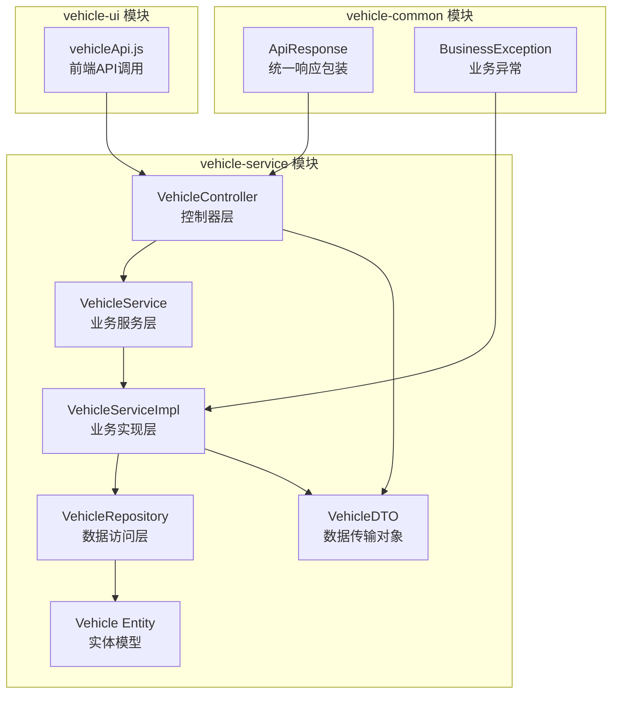
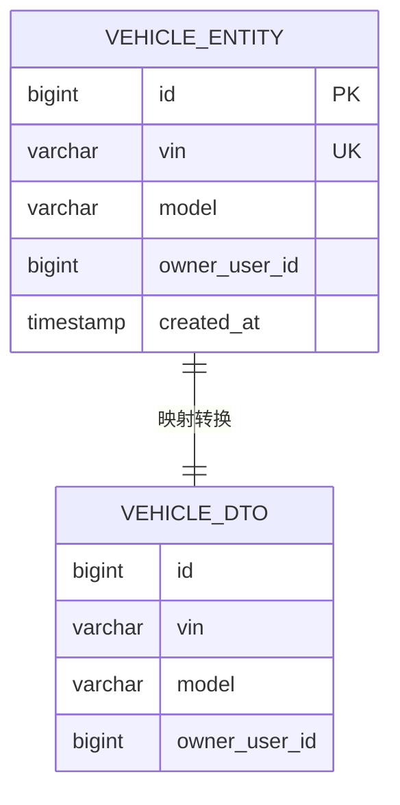
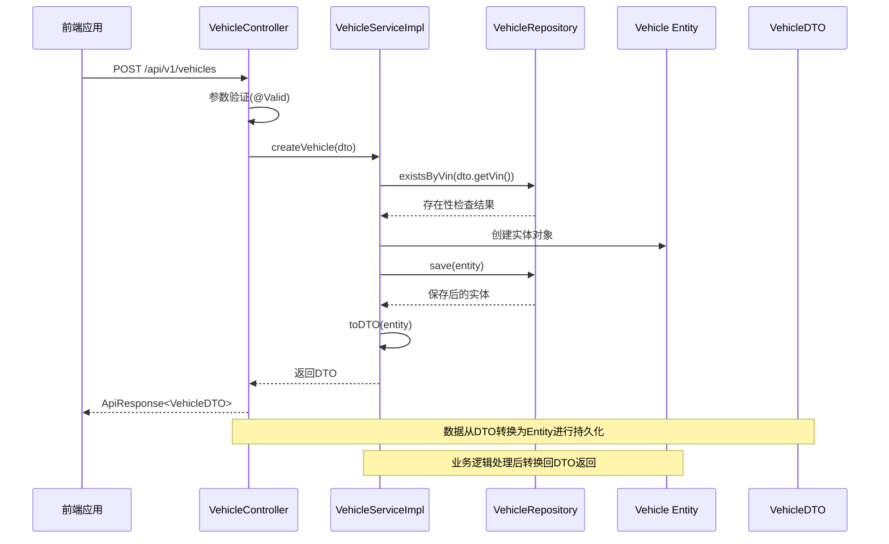
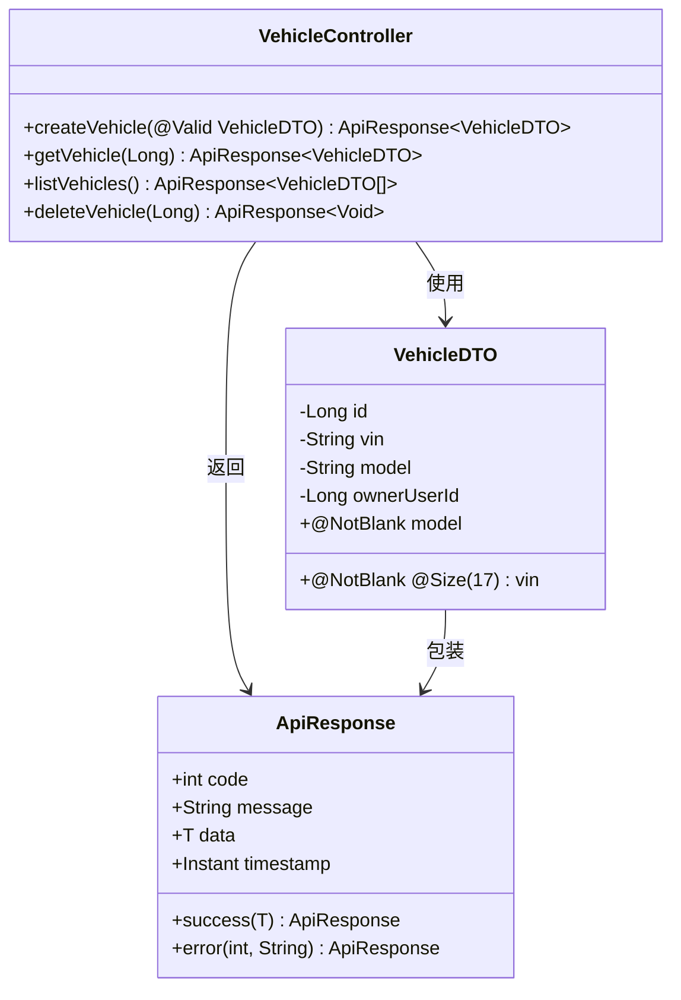
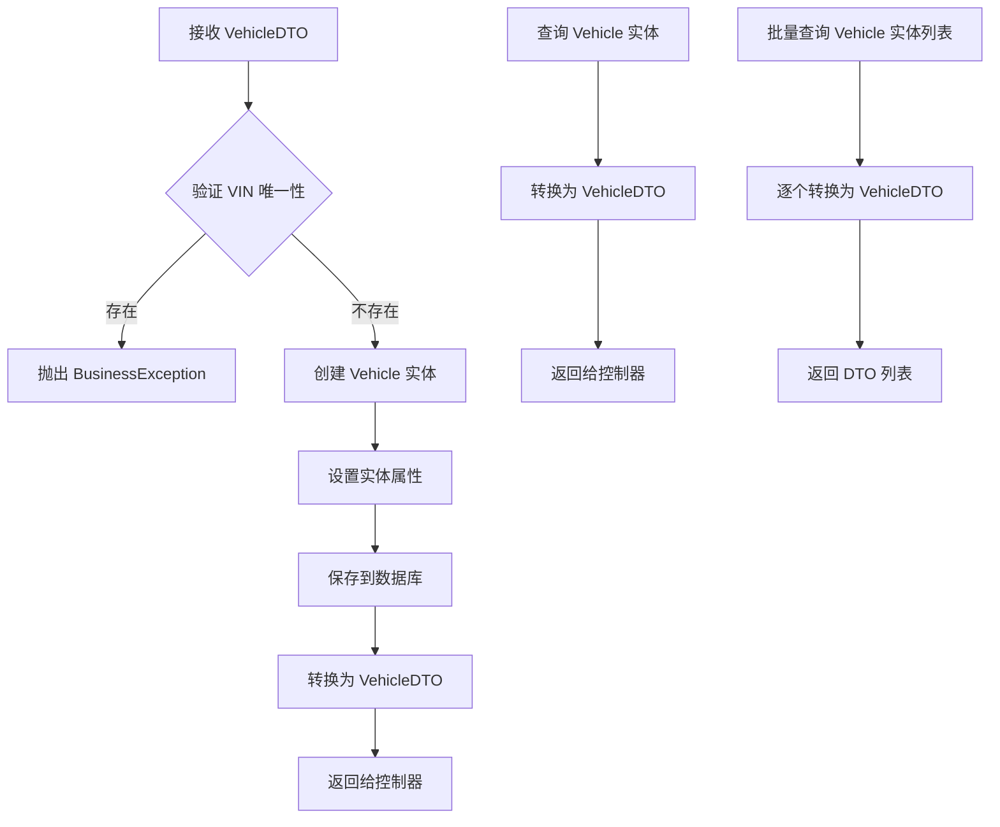
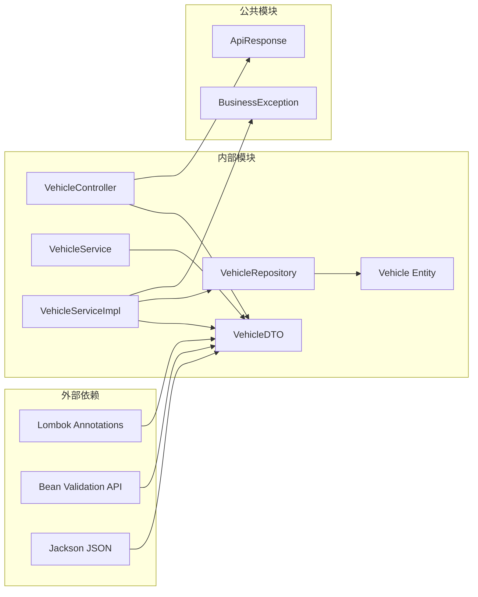
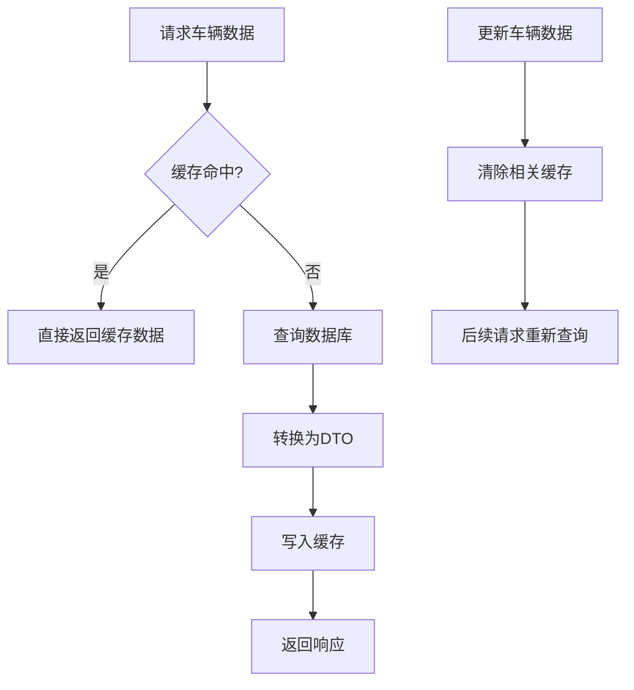

# DTO数据传输对象

<cite>
**本文档引用的文件**
- [VehicleDTO.java](file://vehicle-service/src/main/java/com/wenjie/cloud/vehicle/dto/VehicleDTO.java)
- [Vehicle.java](file://vehicle-service/src/main/java/com/wenjie/cloud/vehicle/entity/Vehicle.java)
- [VehicleController.java](file://vehicle-service/src/main/java/com/wenjie/cloud/vehicle/controller/VehicleController.java)
- [VehicleService.java](file://vehicle-service/src/main/java/com/wenjie/cloud/vehicle/service/VehicleService.java)
- [VehicleServiceImpl.java](file://vehicle-service/src/main/java/com/wenjie/cloud/vehicle/service/impl/VehicleServiceImpl.java)
- [VehicleRepository.java](file://vehicle-service/src/main/java/com/wenjie/cloud/vehicle/repository/VehicleRepository.java)
- [ApiResponse.java](file://vehicle-common/src/main/java/com/wenjie/cloud/common/dto/ApiResponse.java)
- [BusinessException.java](file://vehicle-common/src/main/java/com/wenjie/cloud/common/exception/BusinessException.java)
- [application.yml](file://vehicle-service/src/main/resources/application.yml)
- [vehicleApi.js](file://vehicle-ui/src/api/vehicleApi.js)
</cite>

## 目录
1. [简介](#简介)
2. [项目结构](#项目结构)
3. [核心组件](#核心组件)
4. [架构概览](#架构概览)
5. [详细组件分析](#详细组件分析)
6. [依赖关系分析](#依赖关系分析)
7. [性能考虑](#性能考虑)
8. [故障排除指南](#故障排除指南)
9. [结论](#结论)

## 简介

本文档深入解析车辆管理系统的VehicleDTO数据传输对象设计。VehicleDTO作为控制器层与业务层之间的桥梁，承担着数据传输、验证和格式化的关键职责。通过分析该系统中DTO与Entity的分离设计，我们将探讨数据传输对象的最佳实践，包括字段映射、验证机制、序列化配置以及在不同业务场景下的应用策略。

## 项目结构

该车辆云平台采用多模块架构，VehicleDTO位于vehicle-service模块中，体现了清晰的分层设计：

**图表来源**
- [VehicleController.java:1-61](file://vehicle-service/src/main/java/com/wenjie/cloud/vehicle/controller/VehicleController.java#L1-L61)
- [VehicleService.java:1-32](file://vehicle-service/src/main/java/com/wenjie/cloud/vehicle/service/VehicleService.java#L1-L32)
- [VehicleServiceImpl.java:1-82](file://vehicle-service/src/main/java/com/wenjie/cloud/vehicle/service/impl/VehicleServiceImpl.java#L1-L82)

**章节来源**
- [VehicleDTO.java:1-28](file://vehicle-service/src/main/java/com/wenjie/cloud/vehicle/dto/VehicleDTO.java#L1-L28)
- [Vehicle.java:1-42](file://vehicle-service/src/main/java/com/wenjie/cloud/vehicle/entity/Vehicle.java#L1-L42)

## 核心组件

### VehicleDTO 设计分析

VehicleDTO作为车辆管理的核心数据传输对象，采用了简洁而实用的设计原则：

| 字段 | 类型 | 验证规则 | 描述 |
|------|------|----------|------|
| id | Long | 无 | 车辆唯一标识符 |
| vin | String | @NotBlank, @Size(17) | 17位车辆识别码，唯一标识车辆 |
| model | String | @NotBlank | 车辆型号，如"AITO M7" |
| ownerUserId | Long | 无 | 关联车主用户ID |

**字段验证机制**：
- VIN字段采用双重验证：非空检查和长度验证（必须为17位）
- 车型字段确保非空，防止空值导致的业务逻辑问题

**章节来源**
- [VehicleDTO.java:8-27](file://vehicle-service/src/main/java/com/wenjie/cloud/vehicle/dto/VehicleDTO.java#L8-L27)

### Entity-DTO 映射关系

Vehicle实体与DTO之间建立了精确的字段映射关系：

**图表来源**
- [Vehicle.java:26-41](file://vehicle-service/src/main/java/com/wenjie/cloud/vehicle/entity/Vehicle.java#L26-L41)
- [VehicleDTO.java:14-26](file://vehicle-service/src/main/java/com/wenjie/cloud/vehicle/dto/VehicleDTO.java#L14-L26)

**章节来源**
- [VehicleServiceImpl.java:73-80](file://vehicle-service/src/main/java/com/wenjie/cloud/vehicle/service/impl/VehicleServiceImpl.java#L73-L80)

## 架构概览

VehicleDTO在整个系统架构中扮演着关键的数据传输角色，连接着表现层、业务层和数据持久层：

**图表来源**
- [VehicleController.java:31-34](file://vehicle-service/src/main/java/com/wenjie/cloud/vehicle/controller/VehicleController.java#L31-L34)
- [VehicleServiceImpl.java:29-43](file://vehicle-service/src/main/java/com/wenjie/cloud/vehicle/service/impl/VehicleServiceImpl.java#L29-L43)
- [VehicleServiceImpl.java:73-80](file://vehicle-service/src/main/java/com/wenjie/cloud/vehicle/service/impl/VehicleServiceImpl.java#L73-L80)

**章节来源**
- [VehicleController.java:18-60](file://vehicle-service/src/main/java/com/wenjie/cloud/vehicle/controller/VehicleController.java#L18-L60)
- [VehicleService.java:10-31](file://vehicle-service/src/main/java/com/wenjie/cloud/vehicle/service/VehicleService.java#L10-L31)

## 详细组件分析

### 控制器层集成

VehicleController将VehicleDTO作为API接口的核心数据载体：

**图表来源**
- [VehicleController.java:21-24](file://vehicle-service/src/main/java/com/wenjie/cloud/vehicle/controller/VehicleController.java#L21-L24)
- [VehicleDTO.java:11-27](file://vehicle-service/src/main/java/com/wenjie/cloud/vehicle/dto/VehicleDTO.java#L11-L27)
- [ApiResponse.java:12-51](file://vehicle-common/src/main/java/com/wenjie/cloud/common/dto/ApiResponse.java#L12-L51)

**章节来源**
- [VehicleController.java:28-59](file://vehicle-service/src/main/java/com/wenjie/cloud/vehicle/controller/VehicleController.java#L28-L59)

### 业务层转换逻辑

VehicleServiceImpl实现了Entity与DTO之间的双向转换：

**图表来源**
- [VehicleServiceImpl.java:29-43](file://vehicle-service/src/main/java/com/wenjie/cloud/vehicle/service/impl/VehicleServiceImpl.java#L29-L43)
- [VehicleServiceImpl.java:47-51](file://vehicle-service/src/main/java/com/wenjie/cloud/vehicle/service/impl/VehicleServiceImpl.java#L47-L51)
- [VehicleServiceImpl.java:55-59](file://vehicle-service/src/main/java/com/wenjie/cloud/vehicle/service/impl/VehicleServiceImpl.java#L55-L59)

**章节来源**
- [VehicleServiceImpl.java:27-80](file://vehicle-service/src/main/java/com/wenjie/cloud/vehicle/service/impl/VehicleServiceImpl.java#L27-L80)

### 数据验证与错误处理

系统采用了多层次的验证和错误处理机制：

| 层级 | 验证点 | 实现方式 | 错误处理 |
|------|--------|----------|----------|
| 控制器层 | 参数验证 | @Valid 注解 | ApiResponse 包装 |
| 业务层 | 业务逻辑验证 | BusinessException | 统一异常处理 |
| 数据层 | 唯一性约束 | 数据库约束 | 异常传播 |
| 前端层 | 用户输入验证 | UI 层验证 | 用户反馈 |

**章节来源**
- [VehicleController.java:15](file://vehicle-service/src/main/java/com/wenjie/cloud/vehicle/controller/VehicleController.java#L15)
- [BusinessException.java:12-26](file://vehicle-common/src/main/java/com/wenjie/cloud/common/exception/BusinessException.java#L12-L26)

## 依赖关系分析

VehicleDTO的依赖关系体现了清晰的分层架构：

**图表来源**
- [VehicleDTO.java:3-6](file://vehicle-service/src/main/java/com/wenjie/cloud/vehicle/dto/VehicleDTO.java#L3-L6)
- [VehicleController.java:3](file://vehicle-service/src/main/java/com/wenjie/cloud/vehicle/controller/VehicleController.java#L3)
- [ApiResponse.java:3](file://vehicle-common/src/main/java/com/wenjie/cloud/common/dto/ApiResponse.java#L3)

**章节来源**
- [VehicleDTO.java:1-28](file://vehicle-service/src/main/java/com/wenjie/cloud/vehicle/dto/VehicleDTO.java#L1-L28)
- [VehicleServiceImpl.java:1-16](file://vehicle-service/src/main/java/com/wenjie/cloud/vehicle/service/impl/VehicleServiceImpl.java#L1-L16)

## 性能考虑

基于当前实现的性能特征分析：

### 序列化性能
- **JSON序列化**：使用Jackson默认配置，适合小到中等规模的数据传输
- **字段选择**：DTO仅包含必要字段，避免了Entity中createdAt等冗余字段的序列化开销

### 数据库交互优化
- **批量操作**：listVehicles方法使用Stream API进行批量转换，内存效率较高
- **延迟加载**：当前实现直接转换所有字段，可根据需要实现延迟加载策略

### 缓存策略建议

## 故障排除指南

### 常见问题及解决方案

**1. VIN重复错误**
- **症状**：创建车辆时抛出BusinessException，错误码1001
- **原因**：VIN字段在数据库中要求唯一
- **解决方案**：检查VIN输入是否正确，或修改为新的唯一标识

**2. 车辆不存在错误**
- **症状**：查询单个车辆时抛出BusinessException，错误码1002
- **原因**：数据库中不存在指定ID的车辆记录
- **解决方案**：确认车辆ID是否正确，检查数据库状态

**3. 参数验证失败**
- **症状**：API返回400错误，包含验证错误信息
- **原因**：VIN长度不为17位或为空，或model为空
- **解决方案**：按照验证规则修正输入数据

**章节来源**
- [VehicleServiceImpl.java:30-32](file://vehicle-service/src/main/java/com/wenjie/cloud/vehicle/service/impl/VehicleServiceImpl.java#L30-L32)
- [VehicleServiceImpl.java:48-50](file://vehicle-service/src/main/java/com/wenjie/cloud/vehicle/service/impl/VehicleServiceImpl.java#L48-L50)

## 结论

VehicleDTO的设计体现了现代Java Web应用的最佳实践，通过明确的分层架构和清晰的数据传输机制，实现了以下优势：

### 设计优势
1. **职责分离**：DTO专注于数据传输，Entity专注于数据持久化
2. **验证机制**：多层次的验证确保数据质量
3. **统一响应**：ApiResponse提供一致的API响应格式
4. **异常处理**：BusinessException实现可预期的错误处理

### 改进建议
1. **版本控制**：考虑引入DTO版本号以支持向后兼容
2. **嵌套对象**：对于复杂的关联关系，可以考虑使用嵌套DTO
3. **性能优化**：对大量数据的场景，考虑实现分页和懒加载
4. **序列化配置**：根据实际需求调整JSON序列化策略

### 最佳实践总结
- **字段最小化**：只暴露必要的字段，避免信息泄露
- **验证前置**：在控制器层进行基础验证，在业务层进行复杂验证
- **异常统一**：使用BusinessException处理可预期的业务错误
- **日志记录**：在关键节点添加适当的日志记录

该VehicleDTO设计为后续扩展提供了良好的基础，无论是增加新的业务功能还是支持更复杂的用户界面，都能保持架构的清晰性和可维护性。