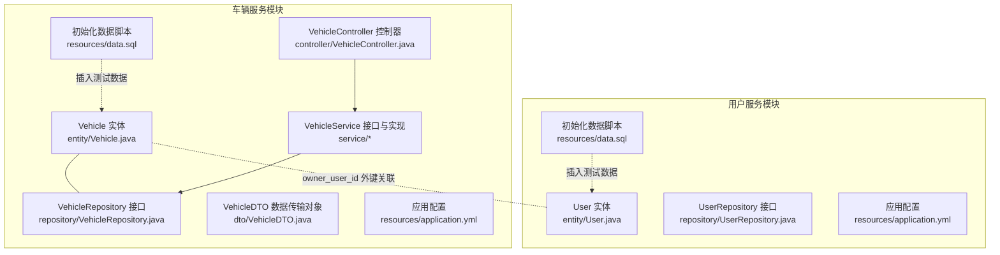
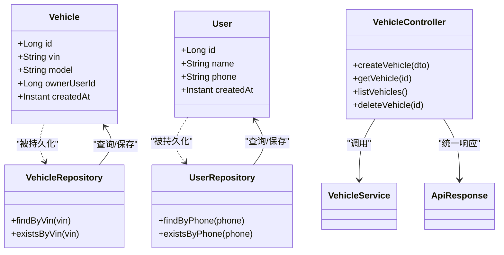
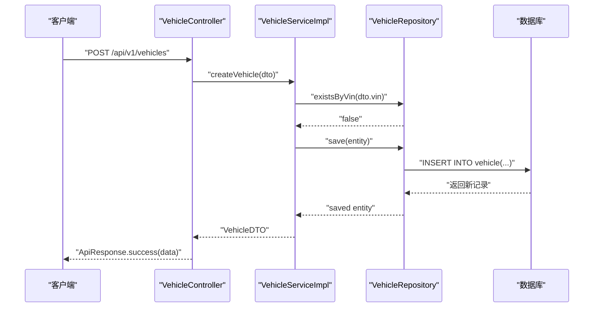
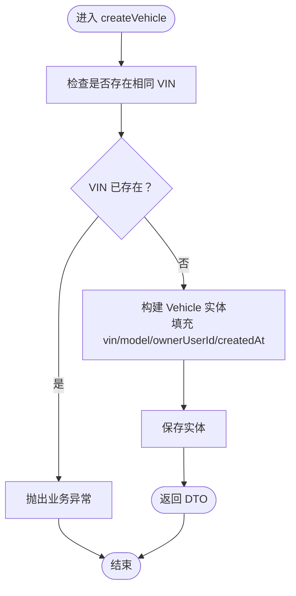
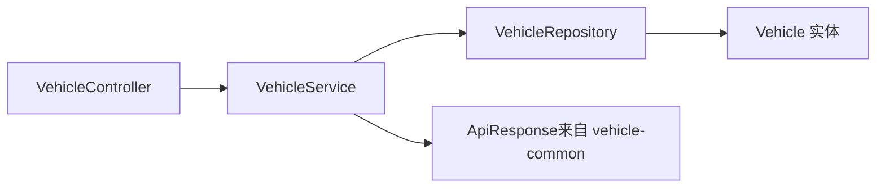

# 实体模型设计

<cite>
**本文引用的文件**
- [Vehicle.java](file://vehicle-service/src/main/java/com/wenjie/cloud/vehicle/entity/Vehicle.java)
- [User.java](file://user-service/src/main/java/com/wenjie/cloud/user/entity/User.java)
- [VehicleRepository.java](file://vehicle-service/src/main/java/com/wenjie/cloud/vehicle/repository/VehicleRepository.java)
- [UserRepository.java](file://user-service/src/main/java/com/wenjie/cloud/user/repository/UserRepository.java)
- [VehicleDTO.java](file://vehicle-service/src/main/java/com/wenjie/cloud/vehicle/dto/VehicleDTO.java)
- [application.yml（车辆服务）](file://vehicle-service/src/main/resources/application.yml)
- [application.yml（用户服务）](file://user-service/src/main/resources/application.yml)
- [data.sql（车辆服务）](file://vehicle-service/src/main/resources/data.sql)
- [data.sql（用户服务）](file://user-service/src/main/resources/data.sql)
- [VehicleController.java](file://vehicle-service/src/main/java/com/wenjie/cloud/vehicle/controller/VehicleController.java)
- [VehicleService.java](file://vehicle-service/src/main/java/com/wenjie/cloud/vehicle/service/VehicleService.java)
- [VehicleServiceImpl.java](file://vehicle-service/src/main/java/com/wenjie/cloud/vehicle/service/impl/VehicleServiceImpl.java)
- [ApiResponse.java](file://vehicle-common/src/main/java/com/wenjie/cloud/common/dto/ApiResponse.java)
</cite>

## 目录
1. [简介](#简介)
2. [项目结构](#项目结构)
3. [核心组件](#核心组件)
4. [架构总览](#架构总览)
5. [详细组件分析](#详细组件分析)
6. [依赖分析](#依赖分析)
7. [性能考虑](#性能考虑)
8. [故障排查指南](#故障排查指南)
9. [结论](#结论)
10. [附录](#附录)

## 简介
本设计文档围绕车辆实体模型展开，系统性解析 Vehicle 实体类的设计架构与 JPA 注解使用方式；明确字段定义与约束（尤其是 VIN 码的 17 位长度与唯一性），阐述与 User 实体的关联关系与外键映射；给出数据库表结构设计（主键、外键、索引与约束）；并提供实体生命周期回调、审计字段与软删除等高级特性的实现建议。

## 项目结构
该仓库采用多模块微服务结构，车辆相关能力集中在 vehicle-service 模块，用户相关能力在 user-service 模块。Vehicle 实体位于 vehicle-service 的 entity 包中，User 实体位于 user-service 的 entity 包中。两者通过 owner_user_id 字段建立逻辑上的“车主”关联关系。

图表来源
- [Vehicle.java:1-42](file://vehicle-service/src/main/java/com/wenjie/cloud/vehicle/entity/Vehicle.java#L1-L42)
- [User.java:1-38](file://user-service/src/main/java/com/wenjie/cloud/user/entity/User.java#L1-L38)
- [VehicleRepository.java:1-23](file://vehicle-service/src/main/java/com/wenjie/cloud/vehicle/repository/VehicleRepository.java#L1-L23)
- [UserRepository.java:1-23](file://user-service/src/main/java/com/wenjie/cloud/user/repository/UserRepository.java#L1-L23)
- [VehicleController.java:1-61](file://vehicle-service/src/main/java/com/wenjie/cloud/vehicle/controller/VehicleController.java#L1-L61)
- [VehicleDTO.java:1-28](file://vehicle-service/src/main/java/com/wenjie/cloud/vehicle/dto/VehicleDTO.java#L1-L28)
- [application.yml（车辆服务）:1-40](file://vehicle-service/src/main/resources/application.yml#L1-L40)
- [application.yml（用户服务）:1-40](file://user-service/src/main/resources/application.yml#L1-L40)
- [data.sql（车辆服务）:1-45](file://vehicle-service/src/main/resources/data.sql#L1-L45)
- [data.sql（用户服务）:1-10](file://user-service/src/main/resources/data.sql#L1-L10)

章节来源
- [Vehicle.java:1-42](file://vehicle-service/src/main/java/com/wenjie/cloud/vehicle/entity/Vehicle.java#L1-L42)
- [User.java:1-38](file://user-service/src/main/java/com/wenjie/cloud/user/entity/User.java#L1-L38)
- [VehicleRepository.java:1-23](file://vehicle-service/src/main/java/com/wenjie/cloud/vehicle/repository/VehicleRepository.java#L1-L23)
- [UserRepository.java:1-23](file://user-service/src/main/java/com/wenjie/cloud/user/repository/UserRepository.java#L1-L23)
- [application.yml（车辆服务）:1-40](file://vehicle-service/src/main/resources/application.yml#L1-L40)
- [application.yml（用户服务）:1-40](file://user-service/src/main/resources/application.yml#L1-L40)
- [data.sql（车辆服务）:1-45](file://vehicle-service/src/main/resources/data.sql#L1-L45)
- [data.sql（用户服务）:1-10](file://user-service/src/main/resources/data.sql#L1-L10)

## 核心组件
- Vehicle 实体：承载车辆基本信息，包含 VIN（17 位唯一）、车型、车主 ID 以及审计字段 created_at。
- User 实体：承载用户基本信息，包含姓名、手机号（11 位唯一）与审计字段 created_at。
- VehicleRepository：基于 Spring Data JPA 的仓储接口，提供按 VIN 查询与存在性判断。
- VehicleController：对外暴露 REST API，负责接收请求、调用服务层并返回统一响应包装。
- VehicleService/Impl：业务层实现，包含事务控制、重复 VIN 校验与实体/DTO 转换。
- VehicleDTO：用于入参校验与出参封装的数据传输对象，包含 VIN 长度约束与必填校验。

章节来源
- [Vehicle.java:13-42](file://vehicle-service/src/main/java/com/wenjie/cloud/vehicle/entity/Vehicle.java#L13-L42)
- [User.java:13-38](file://user-service/src/main/java/com/wenjie/cloud/user/entity/User.java#L13-L38)
- [VehicleRepository.java:8-22](file://vehicle-service/src/main/java/com/wenjie/cloud/vehicle/repository/VehicleRepository.java#L8-L22)
- [VehicleController.java:18-61](file://vehicle-service/src/main/java/com/wenjie/cloud/vehicle/controller/VehicleController.java#L18-L61)
- [VehicleService.java:7-32](file://vehicle-service/src/main/java/com/wenjie/cloud/vehicle/service/VehicleService.java#L7-L32)
- [VehicleServiceImpl.java:17-82](file://vehicle-service/src/main/java/com/wenjie/cloud/vehicle/service/impl/VehicleServiceImpl.java#L17-L82)
- [VehicleDTO.java:8-28](file://vehicle-service/src/main/java/com/wenjie/cloud/vehicle/dto/VehicleDTO.java#L8-L28)

## 架构总览
下图展示 Vehicle 与 User 的实体关系、仓储与控制器交互，以及数据初始化脚本对实体表的影响。

图表来源
- [Vehicle.java:1-42](file://vehicle-service/src/main/java/com/wenjie/cloud/vehicle/entity/Vehicle.java#L1-L42)
- [User.java:1-38](file://user-service/src/main/java/com/wenjie/cloud/user/entity/User.java#L1-L38)
- [VehicleRepository.java:1-23](file://vehicle-service/src/main/java/com/wenjie/cloud/vehicle/repository/VehicleRepository.java#L1-L23)
- [UserRepository.java:1-23](file://user-service/src/main/java/com/wenjie/cloud/user/repository/UserRepository.java#L1-L23)
- [VehicleController.java:1-61](file://vehicle-service/src/main/java/com/wenjie/cloud/vehicle/controller/VehicleController.java#L1-L61)
- [ApiResponse.java:1-52](file://vehicle-common/src/main/java/com/wenjie/cloud/common/dto/ApiResponse.java#L1-L52)

## 详细组件分析

### Vehicle 实体类设计与 JPA 注解详解
- 类级注解
  - @Entity：声明该类为 JPA 实体。
  - @Table(name = "vehicle")：指定持久化到数据库中的表名为 vehicle。
- 主键与生成策略
  - @Id + @GeneratedValue(strategy = GenerationType.IDENTITY)：使用数据库自增主键。
- 字段定义与约束
  - id：主键，自增。
  - vin：VARCHAR(17)，非空且唯一，用于存储车辆识别码。
  - model：VARCHAR(64)，存储车型名称。
  - owner_user_id：BIGINT，作为逻辑外键关联 User 实体的 id。
  - created_at：TIMESTAMP，非空且不可更新，用于审计记录创建时间。
- 审计字段
  - 使用 Instant 类型的 created_at 字段，结合 @Column 的可更新属性设置，体现只写不更新的审计语义。

章节来源
- [Vehicle.java:16-42](file://vehicle-service/src/main/java/com/wenjie/cloud/vehicle/entity/Vehicle.java#L16-L42)

### User 实体类设计与 JPA 注解详解
- 类级注解
  - @Entity + @Table(name = "app_user")：实体映射到 app_user 表。
- 主键与生成策略
  - @Id + @GeneratedValue(strategy = GenerationType.IDENTITY)：自增主键。
- 字段定义与约束
  - id：主键。
  - name：VARCHAR(64)，非空。
  - phone：VARCHAR(11)，非空且唯一，符合手机号长度约束。
  - created_at：TIMESTAMP，非空且不可更新。
- 与 Vehicle 的关系
  - Vehicle 的 owner_user_id 字段在数据库层面未显式声明外键约束，但逻辑上指向 User.id。

章节来源
- [User.java:16-38](file://user-service/src/main/java/com/wenjie/cloud/user/entity/User.java#L16-L38)

### JPA 注解使用与配置要点
- @Entity：标记实体类。
- @Table：指定表名。
- @Id：标识主键。
- @GeneratedValue：指定主键生成策略。
- @Column：映射列名、长度、是否可空、是否唯一、是否可更新等。
- @ManyToOne：当前版本未使用，后续可扩展为实体关联（见“高级特性建议”）。

章节来源
- [Vehicle.java:16-42](file://vehicle-service/src/main/java/com/wenjie/cloud/vehicle/entity/Vehicle.java#L16-L42)
- [User.java:16-38](file://user-service/src/main/java/com/wenjie/cloud/user/entity/User.java#L16-L38)

### 实体关系映射与外键设计
- 当前设计
  - Vehicle 与 User 之间通过 owner_user_id 字段建立逻辑关联，未在 JPA 层声明 @ManyToOne/@JoinColumn。
  - UserRepository 提供按 phone 查询与存在性判断；VehicleRepository 提供按 vin 查询与存在性判断。
- 建议的物理外键设计
  - 在数据库层面为 vehicle.owner_user_id 添加外键约束，指向 app_user.id。
  - 若需在 JPA 层表达关系，可在 Vehicle 中添加 @ManyToOne(fetch = ...)+@JoinColumn(foreignKey = ...)。
- 级联与删除
  - 当前未启用级联删除；若启用，需谨慎评估对历史数据的影响。

章节来源
- [VehicleRepository.java:11-22](file://vehicle-service/src/main/java/com/wenjie/cloud/vehicle/repository/VehicleRepository.java#L11-L22)
- [UserRepository.java:11-22](file://user-service/src/main/java/com/wenjie/cloud/user/repository/UserRepository.java#L11-L22)

### 数据库表结构设计
- vehicle 表
  - 主键：id（自增）
  - 唯一约束：vin（17 位）
  - 索引建议：为 vin、owner_user_id 建立索引以提升查询性能。
  - 约束：vin 非空；created_at 非空且不可更新。
- app_user 表
  - 主键：id（自增）
  - 唯一约束：phone（11 位）
  - 索引建议：为 phone 建立唯一索引。
  - 约束：name 非空；phone 非空且唯一；created_at 非空且不可更新。
- 初始化数据
  - data.sql 脚本为 vehicle 与 app_user 插入测试数据，验证 VIN 前缀与 owner_user_id 的分布。

章节来源
- [data.sql（车辆服务）:1-45](file://vehicle-service/src/main/resources/data.sql#L1-L45)
- [data.sql（用户服务）:1-10](file://user-service/src/main/resources/data.sql#L1-L10)

### API 工作流与实体交互

图表来源
- [VehicleController.java:28-34](file://vehicle-service/src/main/java/com/wenjie/cloud/vehicle/controller/VehicleController.java#L28-L34)
- [VehicleServiceImpl.java:28-43](file://vehicle-service/src/main/java/com/wenjie/cloud/vehicle/service/impl/VehicleServiceImpl.java#L28-L43)
- [VehicleRepository.java:13-21](file://vehicle-service/src/main/java/com/wenjie/cloud/vehicle/repository/VehicleRepository.java#L13-L21)

### 复杂逻辑流程（VIN 唯一性校验）

图表来源
- [VehicleServiceImpl.java:28-43](file://vehicle-service/src/main/java/com/wenjie/cloud/vehicle/service/impl/VehicleServiceImpl.java#L28-L43)
- [VehicleRepository.java:13-21](file://vehicle-service/src/main/java/com/wenjie/cloud/vehicle/repository/VehicleRepository.java#L13-L21)

### DTO 设计与校验
- VehicleDTO 用于入参校验与响应封装，包含：
  - vin：必填且必须为 17 位。
  - model：必填。
  - ownerUserId：可选（表示车主 ID）。
- 与实体字段的对应关系清晰，便于服务层进行实体/DTO 转换。

章节来源
- [VehicleDTO.java:8-28](file://vehicle-service/src/main/java/com/wenjie/cloud/vehicle/dto/VehicleDTO.java#L8-L28)
- [VehicleServiceImpl.java:73-80](file://vehicle-service/src/main/java/com/wenjie/cloud/vehicle/service/impl/VehicleServiceImpl.java#L73-L80)

### 高级特性实现建议
- 实体生命周期回调
  - 可使用 @PrePersist/@PostPersist/@PreUpdate/@PostUpdate 等回调，在持久化前后自动填充 created_at 或更新时间字段。
- 审计字段
  - 建议引入 @CreatedDate/@LastModifiedDate 等注解或手动维护 created_at/updated_at 字段，确保审计一致性。
- 软删除
  - 引入 deleted 标志位与 @Where 条件过滤，避免物理删除造成关联数据丢失。
- 关系映射增强
  - 在 Vehicle 中添加 @ManyToOne(fetch = ...) 与 @JoinColumn(foreignKey = ...)，并在 User 中添加 @OneToMany(mappedBy = ...)，形成双向关联，便于级联查询与维护。

章节来源
- [Vehicle.java:26-41](file://vehicle-service/src/main/java/com/wenjie/cloud/vehicle/entity/Vehicle.java#L26-L41)
- [User.java:26-36](file://user-service/src/main/java/com/wenjie/cloud/user/entity/User.java#L26-L36)

## 依赖分析
- 模块间依赖
  - vehicle-service 依赖 vehicle-common（统一响应包装）。
  - 两个服务模块均使用 H2 内存数据库与 Spring Data JPA。
- 仓储与实体
  - VehicleRepository/UserRepository 继承 JpaRepository，天然具备 CRUD 能力。
  - VehicleController 通过 VehicleService 调用仓储，遵循分层架构。

图表来源
- [VehicleController.java:1-61](file://vehicle-service/src/main/java/com/wenjie/cloud/vehicle/controller/VehicleController.java#L1-L61)
- [VehicleService.java:1-32](file://vehicle-service/src/main/java/com/wenjie/cloud/vehicle/service/VehicleService.java#L1-L32)
- [VehicleServiceImpl.java:1-82](file://vehicle-service/src/main/java/com/wenjie/cloud/vehicle/service/impl/VehicleServiceImpl.java#L1-L82)
- [ApiResponse.java:1-52](file://vehicle-common/src/main/java/com/wenjie/cloud/common/dto/ApiResponse.java#L1-L52)

章节来源
- [pom.xml（车辆服务）:18-48](file://vehicle-service/pom.xml#L18-L48)
- [pom.xml（用户服务）:18-48](file://user-service/pom.xml#L18-L48)

## 性能考虑
- 查询优化
  - 对 vin 与 owner_user_id 建立索引，提升按 VIN 查询与按车主筛选的性能。
- 事务边界
  - 创建与删除操作使用 @Transactional，确保一致性；读取操作使用只读事务减少锁竞争。
- 批量操作
  - 如需批量导入数据，建议使用 JDBC Template 或原生 SQL 批处理，降低 ORM 开销。
- 连接池与 DDL 自动建模
  - 当前使用 H2 与 ddl-auto=drop-create，适合开发环境；生产环境建议关闭自动建模，改为 Flyway/Liquibase 管理迁移。

章节来源
- [application.yml（车辆服务）:15-25](file://vehicle-service/src/main/resources/application.yml#L15-L25)
- [application.yml（用户服务）:15-25](file://user-service/src/main/resources/application.yml#L15-L25)
- [VehicleServiceImpl.java:27-69](file://vehicle-service/src/main/java/com/wenjie/cloud/vehicle/service/impl/VehicleServiceImpl.java#L27-L69)

## 故障排查指南
- VIN 重复导致创建失败
  - 现象：抛出业务异常，提示 VIN 已存在。
  - 处理：检查传入的 vin 是否正确，或先查询是否存在再决定创建或更新。
- 车辆不存在
  - 现象：按 ID 查询时抛出业务异常。
  - 处理：确认传入的 id 是否有效，或检查初始化数据是否正确加载。
- 数据库初始化问题
  - 现象：启动后表结构不一致或数据缺失。
  - 处理：确认 data.sql 是否执行，H2 控制台路径为 /h2-console，核对表名与字段是否匹配。

章节来源
- [VehicleServiceImpl.java:30-32](file://vehicle-service/src/main/java/com/wenjie/cloud/vehicle/service/impl/VehicleServiceImpl.java#L30-L32)
- [VehicleServiceImpl.java:48-50](file://vehicle-service/src/main/java/com/wenjie/cloud/vehicle/service/impl/VehicleServiceImpl.java#L48-L50)
- [application.yml（车辆服务）:31-35](file://vehicle-service/src/main/resources/application.yml#L31-L35)
- [application.yml（用户服务）:31-35](file://user-service/src/main/resources/application.yml#L31-L35)

## 结论
Vehicle 实体模型以简洁清晰的方式实现了 VIN 唯一性、车型与车主 ID 的关键字段，并通过 Spring Data JPA 提供了高效的仓储能力。当前设计满足基本业务需求，建议在生产环境中补充物理外键、索引与软删除等高级特性，以提升数据完整性与可维护性。

## 附录
- 统一响应包装
  - ApiResponse 提供统一的响应结构，包含状态码、消息、数据与时间戳，便于前端与监控系统消费。
- 配置要点
  - H2 控制台开启与 SQL 格式化，有助于开发调试与 SQL 观察。

章节来源
- [ApiResponse.java:7-52](file://vehicle-common/src/main/java/com/wenjie/cloud/common/dto/ApiResponse.java#L7-L52)
- [application.yml（车辆服务）:31-35](file://vehicle-service/src/main/resources/application.yml#L31-L35)
- [application.yml（用户服务）:31-35](file://user-service/src/main/resources/application.yml#L31-L35)