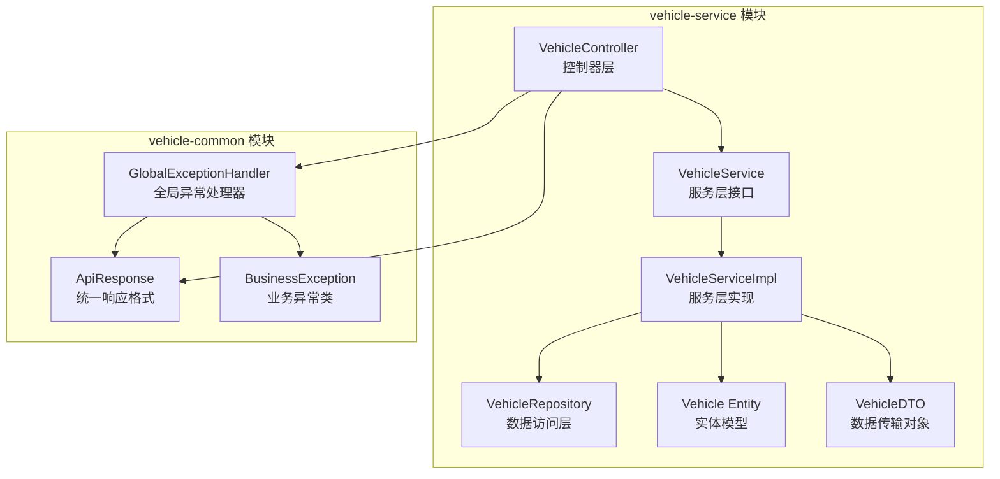
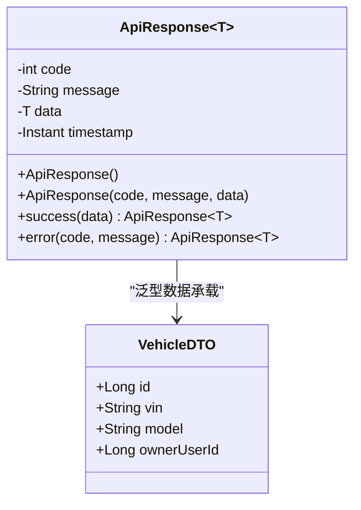
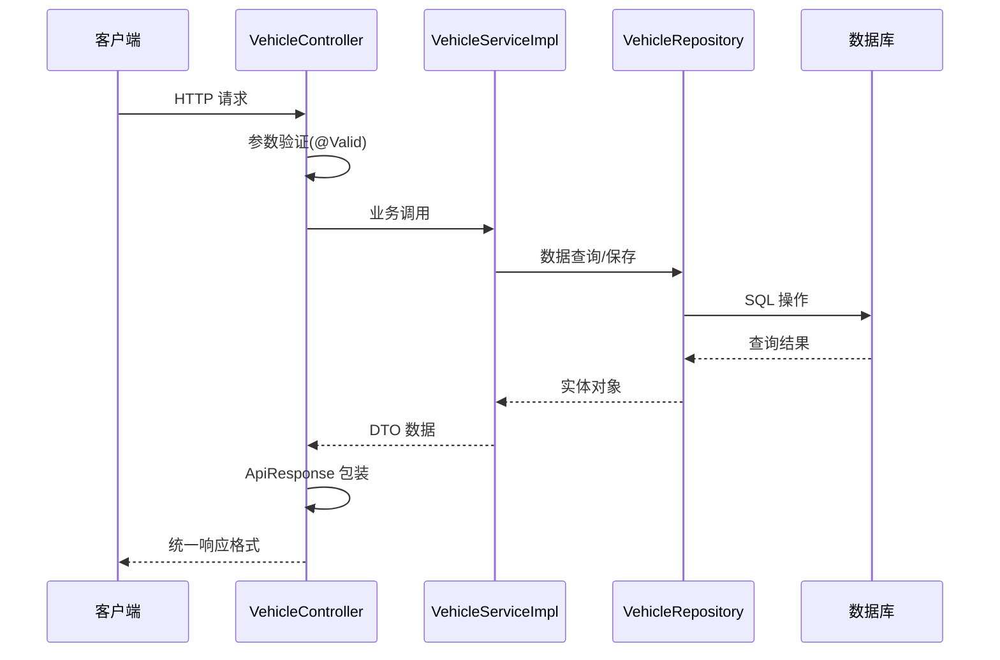
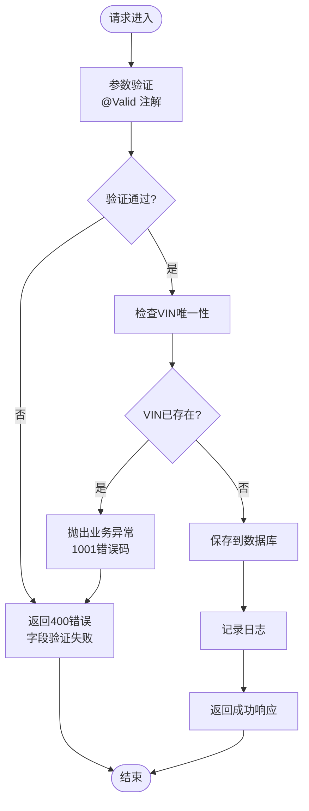
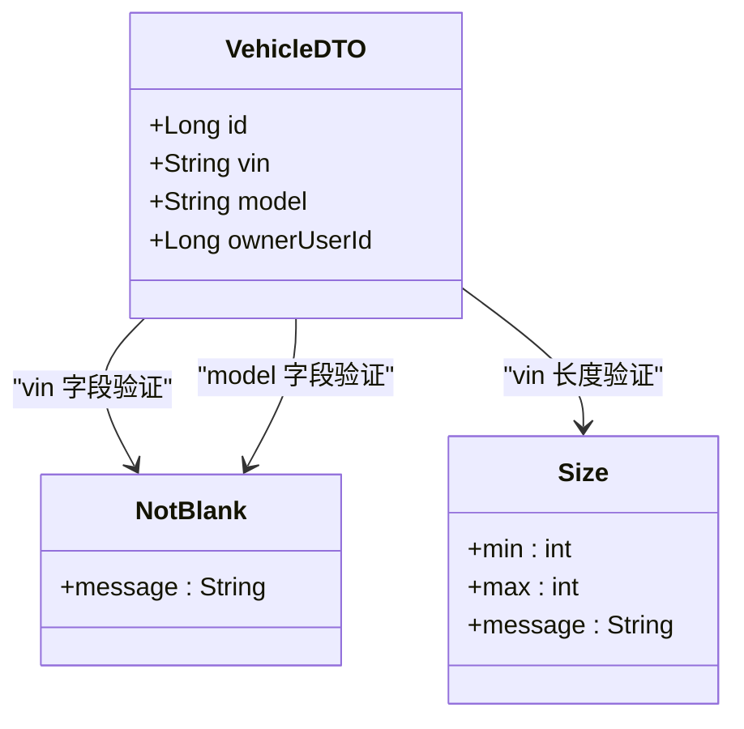
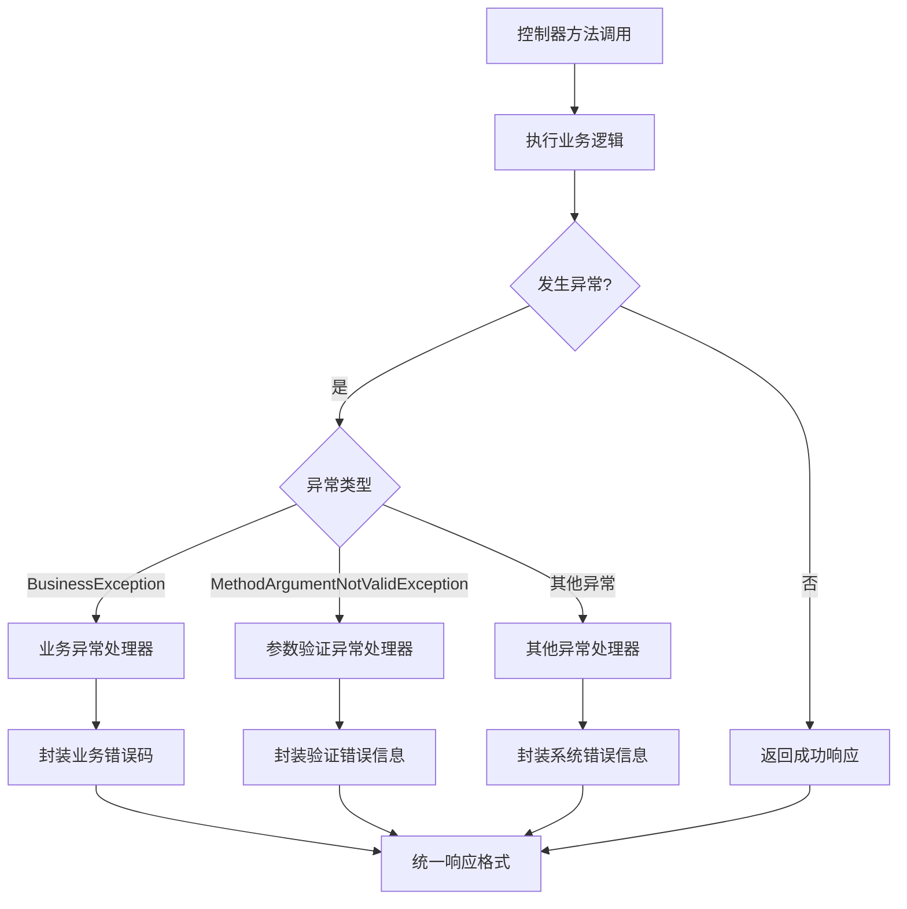
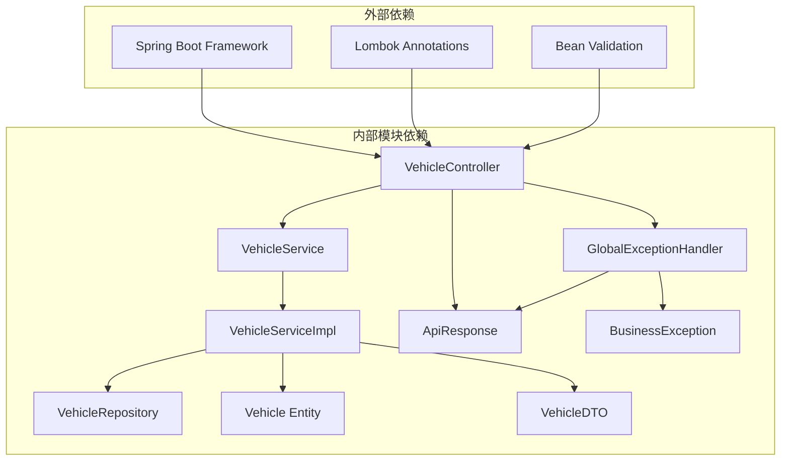
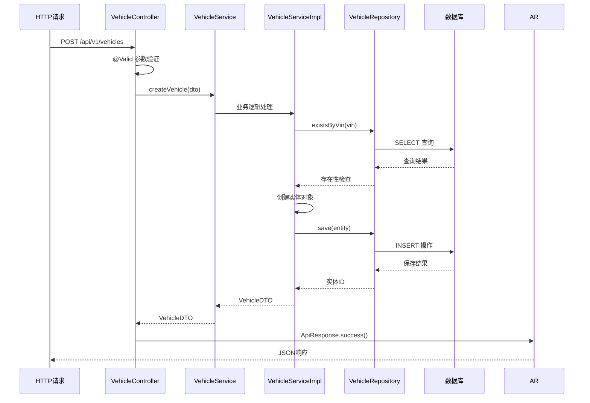
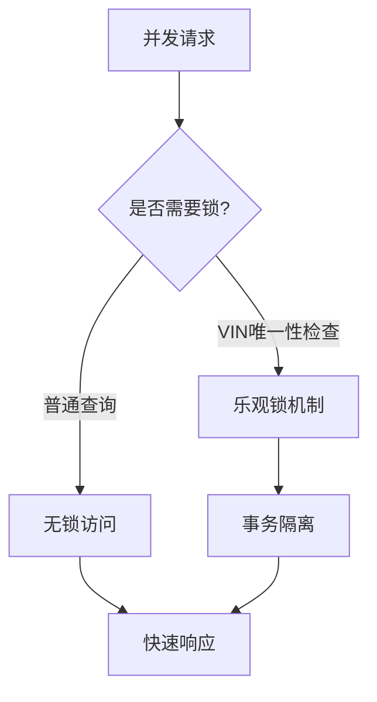
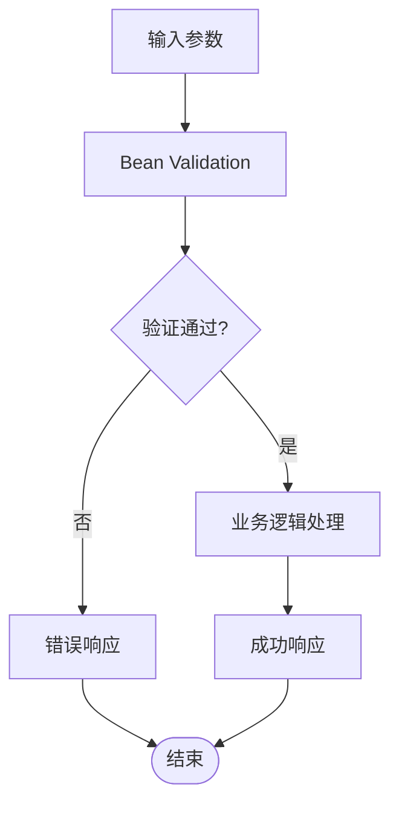

# 控制器层设计

<cite>
**本文档引用的文件**
- [VehicleController.java](file://vehicle-service/src/main/java/com/wenjie/cloud/vehicle/controller/VehicleController.java)
- [ApiResponse.java](file://vehicle-common/src/main/java/com/wenjie/cloud/common/dto/ApiResponse.java)
- [GlobalExceptionHandler.java](file://vehicle-common/src/main/java/com/wenjie/cloud/common/exception/GlobalExceptionHandler.java)
- [VehicleDTO.java](file://vehicle-service/src/main/java/com/wenjie/cloud/vehicle/dto/VehicleDTO.java)
- [VehicleService.java](file://vehicle-service/src/main/java/com/wenjie/cloud/vehicle/service/VehicleService.java)
- [VehicleServiceImpl.java](file://vehicle-service/src/main/java/com/wenjie/cloud/vehicle/service/impl/VehicleServiceImpl.java)
- [BusinessException.java](file://vehicle-common/src/main/java/com/wenjie/cloud/common/exception/BusinessException.java)
- [Vehicle.java](file://vehicle-service/src/main/java/com/wenjie/cloud/vehicle/entity/Vehicle.java)
- [application.yml](file://vehicle-service/src/main/resources/application.yml)
- [vehicleApi.js](file://vehicle-ui/src/api/vehicleApi.js)
</cite>

## 目录
1. [简介](#简介)
2. [项目结构](#项目结构)
3. [核心组件](#核心组件)
4. [架构概览](#架构概览)
5. [详细组件分析](#详细组件分析)
6. [依赖关系分析](#依赖关系分析)
7. [性能考虑](#性能考虑)
8. [故障排除指南](#故障排除指南)
9. [最佳实践](#最佳实践)
10. [结论](#结论)

## 简介

本文档深入分析了车辆管理服务的控制器层设计，重点解析VehicleController的REST API接口实现。该控制器层采用Spring Boot框架构建，实现了完整的CRUD操作，包括车辆创建、查询、删除等核心功能。系统通过统一的ApiResponse响应格式和全局异常处理机制，确保了API的一致性和可靠性。

## 项目结构

车辆管理服务采用多模块架构，控制器层位于vehicle-service模块中，与通用组件分离，体现了清晰的分层设计：

**图表来源**
- [VehicleController.java:1-61](file://vehicle-service/src/main/java/com/wenjie/cloud/vehicle/controller/VehicleController.java#L1-L61)
- [VehicleServiceImpl.java:1-82](file://vehicle-service/src/main/java/com/wenjie/cloud/vehicle/service/impl/VehicleServiceImpl.java#L1-L82)
- [ApiResponse.java:1-52](file://vehicle-common/src/main/java/com/wenjie/cloud/common/dto/ApiResponse.java#L1-L52)

**章节来源**
- [VehicleController.java:1-61](file://vehicle-service/src/main/java/com/wenjie/cloud/vehicle/controller/VehicleController.java#L1-L61)
- [application.yml:1-40](file://vehicle-service/src/main/resources/application.yml#L1-L40)

## 核心组件

### VehicleController 控制器

VehicleController是车辆管理服务的核心控制器，负责处理所有车辆相关的HTTP请求。该控制器采用了现代化的Spring Boot注解驱动开发模式：

- **@RestController**: 将控制器标记为RESTful Web服务
- **@RequestMapping("/api/v1/vehicles")**: 定义统一的API路径前缀
- **@RequiredArgsConstructor**: 使用Lombok自动生成构造函数注入

### ApiResponse 统一响应格式

ApiResponse提供了标准化的API响应结构，确保所有接口返回一致的数据格式：

**图表来源**
- [ApiResponse.java:12-51](file://vehicle-common/src/main/java/com/wenjie/cloud/common/dto/ApiResponse.java#L12-L51)
- [VehicleDTO.java:11-27](file://vehicle-service/src/main/java/com/wenjie/cloud/vehicle/dto/VehicleDTO.java#L11-L27)

**章节来源**
- [VehicleController.java:18-24](file://vehicle-service/src/main/java/com/wenjie/cloud/vehicle/controller/VehicleController.java#L18-L24)
- [ApiResponse.java:7-51](file://vehicle-common/src/main/java/com/wenjie/cloud/common/dto/ApiResponse.java#L7-L51)

## 架构概览

车辆管理服务采用经典的三层架构模式，控制器层作为系统的入口点，负责处理HTTP请求并协调其他层的工作：

**图表来源**
- [VehicleController.java:31-59](file://vehicle-service/src/main/java/com/wenjie/cloud/vehicle/controller/VehicleController.java#L31-L59)
- [VehicleServiceImpl.java:28-69](file://vehicle-service/src/main/java/com/wenjie/cloud/vehicle/service/impl/VehicleServiceImpl.java#L28-L69)

## 详细组件分析

### REST API 接口设计

VehicleController实现了完整的RESTful API规范，支持标准的CRUD操作：

#### POST /api/v1/vehicles - 创建车辆

该接口负责创建新的车辆记录，实现了严格的参数验证和业务逻辑检查：

**图表来源**
- [VehicleController.java:31-34](file://vehicle-service/src/main/java/com/wenjie/cloud/vehicle/controller/VehicleController.java#L31-L34)
- [VehicleServiceImpl.java:29-43](file://vehicle-service/src/main/java/com/wenjie/cloud/vehicle/service/impl/VehicleServiceImpl.java#L29-L43)

#### GET /api/v1/vehicles - 查询车辆列表

该接口提供车辆列表查询功能，支持分页和过滤条件：

**章节来源**
- [VehicleController.java:47-49](file://vehicle-service/src/main/java/com/wenjie/cloud/vehicle/controller/VehicleController.java#L47-L49)
- [VehicleServiceImpl.java:53-59](file://vehicle-service/src/main/java/com/wenjie/cloud/vehicle/service/impl/VehicleServiceImpl.java#L53-L59)

#### GET /api/v1/vehicles/{id} - 按ID查询车辆

该接口支持根据车辆ID精确查询单个车辆信息：

**章节来源**
- [VehicleController.java:39-42](file://vehicle-service/src/main/java/com/wenjie/cloud/vehicle/controller/VehicleController.java#L39-L42)
- [VehicleServiceImpl.java:45-51](file://vehicle-service/src/main/java/com/wenjie/cloud/vehicle/service/impl/VehicleServiceImpl.java#L45-L51)

#### DELETE /api/v1/vehicles/{id} - 删除车辆

该接口提供车辆删除功能，包含完整性检查和级联删除：

**章节来源**
- [VehicleController.java:55-59](file://vehicle-service/src/main/java/com/wenjie/cloud/vehicle/controller/VehicleController.java#L55-L59)
- [VehicleServiceImpl.java:61-69](file://vehicle-service/src/main/java/com/wenjie/cloud/vehicle/service/impl/VehicleServiceImpl.java#L61-L69)

### 参数验证机制

系统采用Bean Validation标准实现参数验证，确保数据的完整性和一致性：

**图表来源**
- [VehicleDTO.java:17-26](file://vehicle-service/src/main/java/com/wenjie/cloud/vehicle/dto/VehicleDTO.java#L17-L26)

**章节来源**
- [VehicleDTO.java:5-27](file://vehicle-service/src/main/java/com/wenjie/cloud/vehicle/dto/VehicleDTO.java#L5-L27)

### 异常处理机制

系统实现了完善的异常处理体系，通过全局异常处理器统一处理各种异常情况：

**图表来源**
- [GlobalExceptionHandler.java:26-54](file://vehicle-common/src/main/java/com/wenjie/cloud/common/exception/GlobalExceptionHandler.java#L26-L54)

**章节来源**
- [GlobalExceptionHandler.java:13-55](file://vehicle-common/src/main/java/com/wenjie/cloud/common/exception/GlobalExceptionHandler.java#L13-L55)

## 依赖关系分析

### 控制器层依赖图

**图表来源**
- [VehicleController.java:1-16](file://vehicle-service/src/main/java/com/wenjie/cloud/vehicle/controller/VehicleController.java#L1-L16)
- [VehicleServiceImpl.java:1-16](file://vehicle-service/src/main/java/com/wenjie/cloud/vehicle/service/impl/VehicleServiceImpl.java#L1-L16)

### 数据流分析

系统采用清晰的数据流向设计，从HTTP请求到数据库操作的完整流程：

**图表来源**
- [VehicleController.java:31-34](file://vehicle-service/src/main/java/com/wenjie/cloud/vehicle/controller/VehicleController.java#L31-L34)
- [VehicleServiceImpl.java:29-43](file://vehicle-service/src/main/java/com/wenjie/cloud/vehicle/service/impl/VehicleServiceImpl.java#L29-L43)

**章节来源**
- [VehicleController.java:21-26](file://vehicle-service/src/main/java/com/wenjie/cloud/vehicle/controller/VehicleController.java#L21-L26)
- [VehicleServiceImpl.java:25-42](file://vehicle-service/src/main/java/com/wenjie/cloud/vehicle/service/impl/VehicleServiceImpl.java#L25-L42)

## 性能考虑

### 缓存策略

系统目前未实现缓存机制，对于高频查询场景建议考虑以下优化：

- **读写分离**: 对于只读查询使用独立的数据源连接
- **批量操作**: 支持批量查询和批量删除操作
- **分页优化**: 实现高效的分页查询机制

### 并发控制

**图表来源**
- [VehicleServiceImpl.java:30-32](file://vehicle-service/src/main/java/com/wenjie/cloud/vehicle/service/impl/VehicleServiceImpl.java#L30-L32)

## 故障排除指南

### 常见问题诊断

#### 参数验证失败

当遇到参数验证失败时，系统会返回400状态码和详细的错误信息：

**章节来源**
- [GlobalExceptionHandler.java:36-44](file://vehicle-common/src/main/java/com/wenjie/cloud/common/exception/GlobalExceptionHandler.java#L36-L44)

#### 业务逻辑异常

业务异常通过BusinessException类统一处理，错误码和消息由业务逻辑决定：

**章节来源**
- [BusinessException.java:12-26](file://vehicle-common/src/main/java/com/wenjie/cloud/common/exception/BusinessException.java#L12-L26)

#### 数据库连接问题

系统使用H2内存数据库进行演示，生产环境需要配置真实的关系型数据库：

**章节来源**
- [application.yml:8-14](file://vehicle-service/src/main/resources/application.yml#L8-L14)

## 最佳实践

### 控制器层设计原则

1. **单一职责原则**: 每个控制器专注于特定的业务领域
2. **依赖注入**: 使用构造函数注入而非字段注入
3. **异常处理**: 统一异常处理，避免在控制器中分散处理
4. **响应格式**: 使用统一的ApiResponse格式

### 参数验证最佳实践

**图表来源**
- [VehicleDTO.java:17-26](file://vehicle-service/src/main/java/com/wenjie/cloud/vehicle/dto/VehicleDTO.java#L17-L26)

### 错误处理最佳实践

1. **业务异常分类**: 不同类型的业务错误使用不同的错误码
2. **日志记录**: 详细的日志记录便于问题排查
3. **用户友好**: 向用户显示友好的错误信息
4. **安全考虑**: 避免泄露敏感的系统信息

**章节来源**
- [GlobalExceptionHandler.java:26-54](file://vehicle-common/src/main/java/com/wenjie/cloud/common/exception/GlobalExceptionHandler.java#L26-L54)

## 结论

VehicleController展现了现代Spring Boot应用的优秀实践，通过清晰的分层架构、统一的响应格式和完善的异常处理机制，实现了高内聚、低耦合的系统设计。该控制器层不仅满足了基本的CRUD需求，还为未来的扩展和维护奠定了坚实的基础。

系统的主要优势包括：
- **一致性**: 统一的API设计和响应格式
- **可维护性**: 清晰的代码结构和职责分离
- **可扩展性**: 模块化设计便于功能扩展
- **可靠性**: 完善的异常处理和日志记录

通过遵循本文档的设计原则和最佳实践，开发者可以在此基础上构建更加复杂和健壮的车辆管理服务。