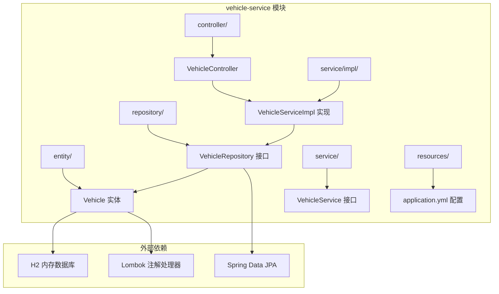
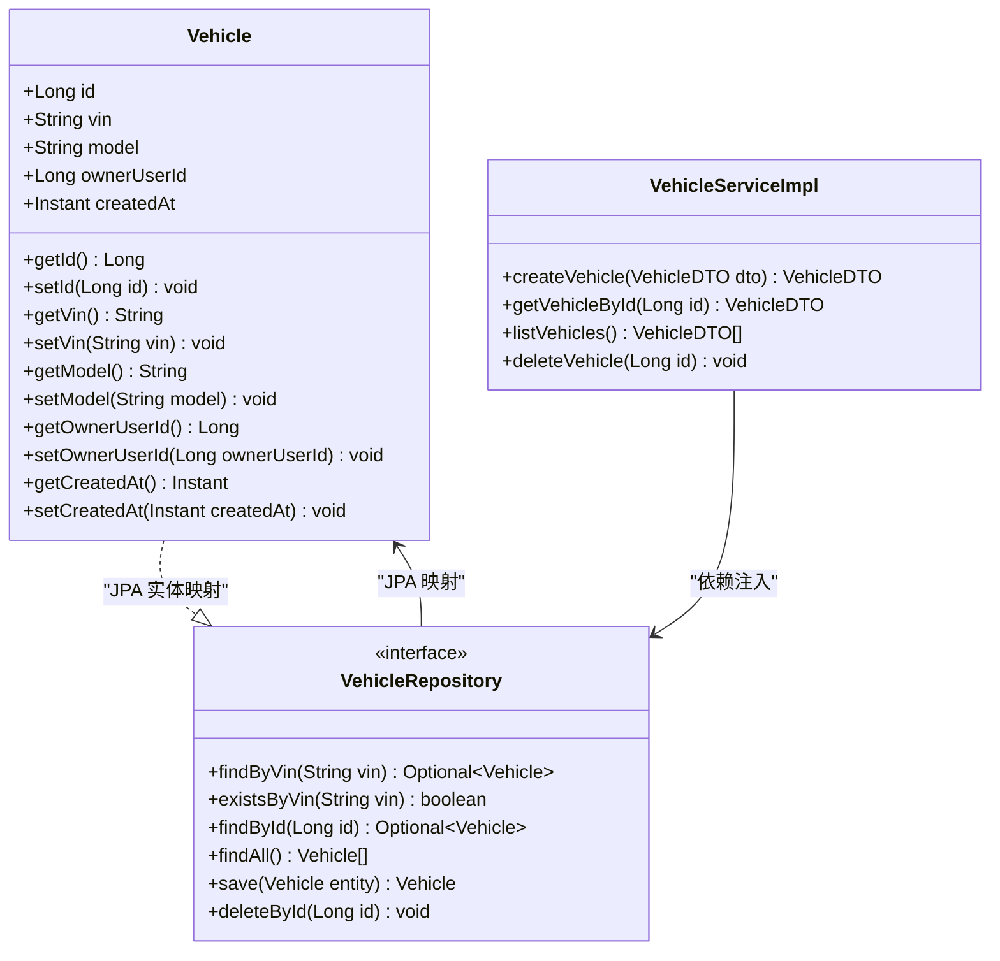
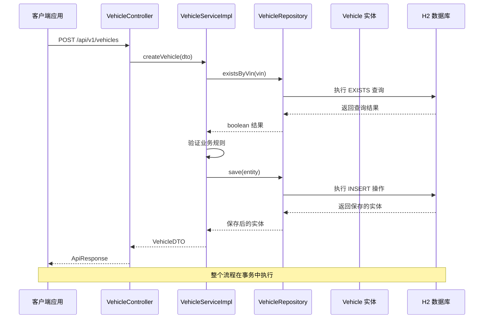
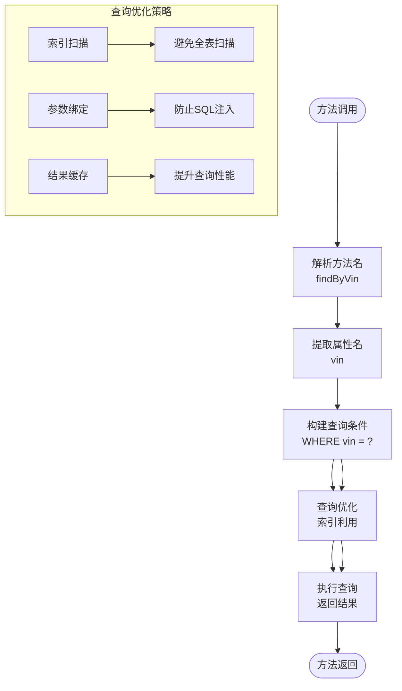
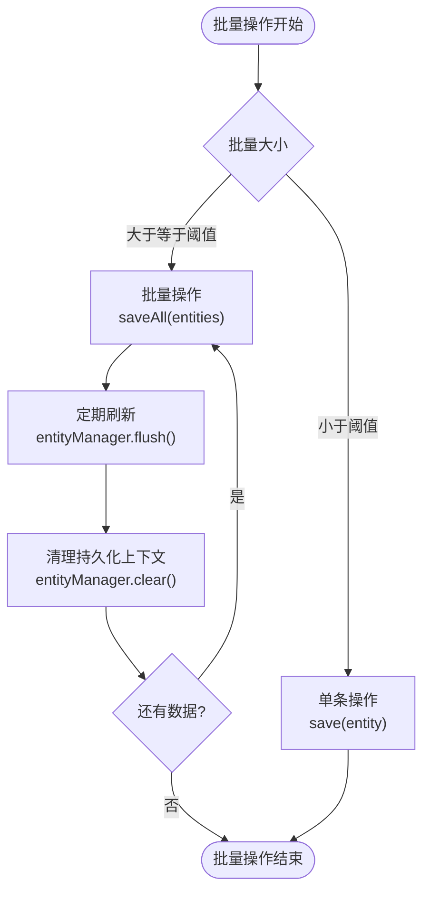
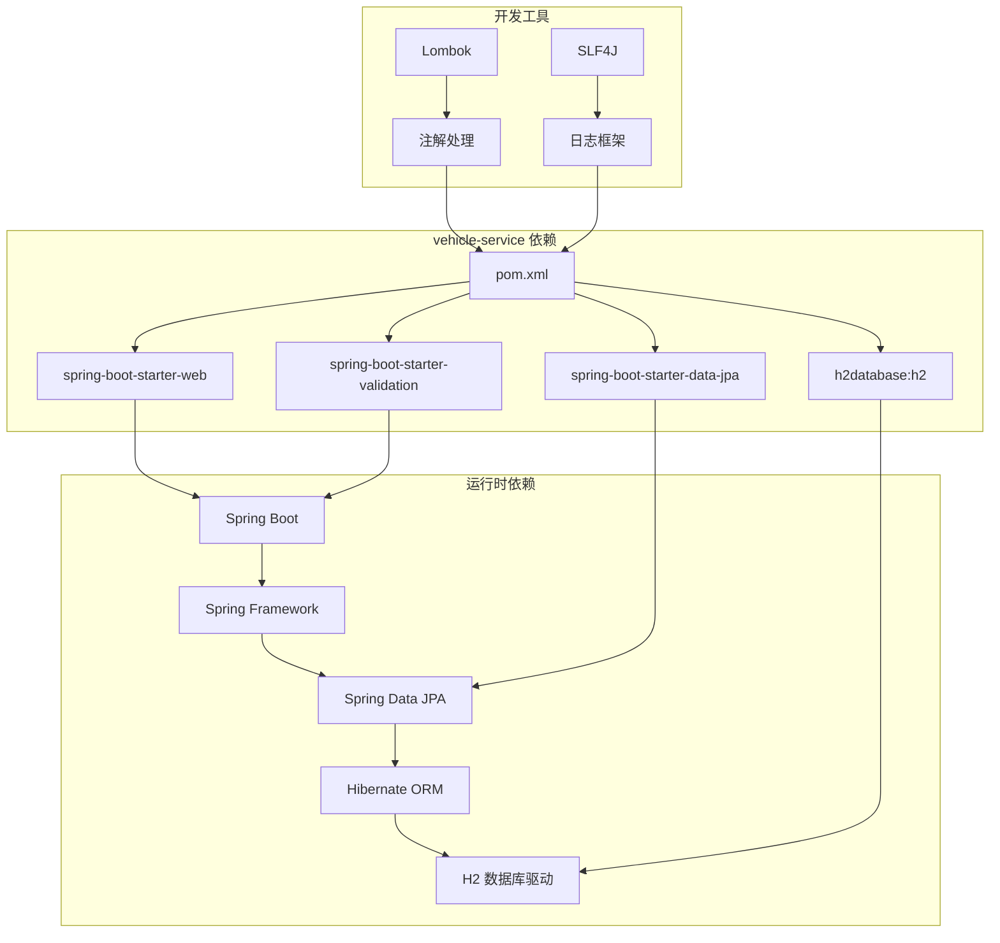
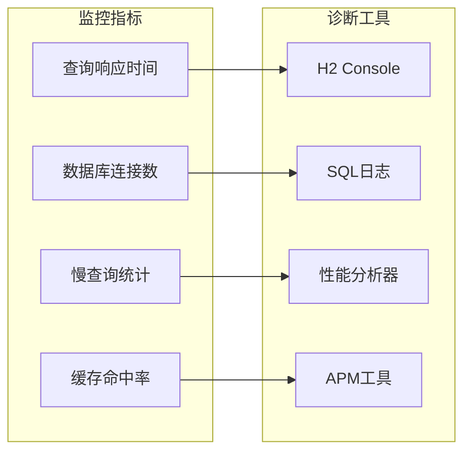

# 数据访问层设计

<cite>
**本文档引用的文件**
- [Vehicle.java](file://vehicle-service/src/main/java/com/wenjie/cloud/vehicle/entity/Vehicle.java)
- [VehicleRepository.java](file://vehicle-service/src/main/java/com/wenjie/cloud/vehicle/repository/VehicleRepository.java)
- [VehicleServiceImpl.java](file://vehicle-service/src/main/java/com/wenjie/cloud/vehicle/service/impl/VehicleServiceImpl.java)
- [VehicleController.java](file://vehicle-service/src/main/java/com/wenjie/cloud/vehicle/controller/VehicleController.java)
- [application.yml](file://vehicle-service/src/main/resources/application.yml)
- [VehicleDTO.java](file://vehicle-service/src/main/java/com/wenjie/cloud/vehicle/dto/VehicleDTO.java)
- [VehicleService.java](file://vehicle-service/src/main/java/com/wenjie/cloud/vehicle/service/VehicleService.java)
- [VehicleServiceApplication.java](file://vehicle-service/src/main/java/com/wenjie/cloud/vehicle/VehicleServiceApplication.java)
- [pom.xml](file://vehicle-service/pom.xml)
</cite>

## 目录
1. [简介](#简介)
2. [项目结构](#项目结构)
3. [核心组件](#核心组件)
4. [架构概览](#架构概览)
5. [详细组件分析](#详细组件分析)
6. [依赖关系分析](#依赖关系分析)
7. [性能考虑](#性能考虑)
8. [故障排除指南](#故障排除指南)
9. [结论](#结论)

## 简介

本文档深入分析了车辆管理系统的数据访问层设计，重点解析VehicleRepository接口的设计理念和Spring Data JPA的实现机制。该系统采用分层架构设计，通过Repository模式实现了数据持久化层的抽象，提供了完整的CRUD操作支持，并展示了Spring Data JPA在方法命名约定、查询优化和性能考虑方面的最佳实践。

## 项目结构

车辆管理系统采用多模块微服务架构，数据访问层位于vehicle-service模块中，遵循标准的Spring Boot项目结构：



**图表来源**
- [VehicleController.java:1-61](file://vehicle-service/src/main/java/com/wenjie/cloud/vehicle/controller/VehicleController.java#L1-L61)
- [VehicleRepository.java:1-23](file://vehicle-service/src/main/java/com/wenjie/cloud/vehicle/repository/VehicleRepository.java#L1-L23)
- [VehicleServiceImpl.java:1-82](file://vehicle-service/src/main/java/com/wenjie/cloud/vehicle/service/impl/VehicleServiceImpl.java#L1-L82)

**章节来源**
- [VehicleServiceApplication.java:1-16](file://vehicle-service/src/main/java/com/wenjie/cloud/vehicle/VehicleServiceApplication.java#L1-L16)
- [pom.xml:1-61](file://vehicle-service/pom.xml#L1-L61)

## 核心组件

### Vehicle 实体模型

Vehicle实体是数据访问层的核心数据结构，采用了标准的JPA注解配置：



**图表来源**
- [Vehicle.java:13-42](file://vehicle-service/src/main/java/com/wenjie/cloud/vehicle/entity/Vehicle.java#L13-L42)
- [VehicleRepository.java:8-22](file://vehicle-service/src/main/java/com/wenjie/cloud/vehicle/repository/VehicleRepository.java#L8-L22)
- [VehicleServiceImpl.java:17-82](file://vehicle-service/src/main/java/com/wenjie/cloud/vehicle/service/impl/VehicleServiceImpl.java#L17-L82)

### Repository 接口设计

VehicleRepository接口继承了Spring Data JPA的JpaRepository，提供了丰富的数据访问能力：

| 方法签名 | 功能描述 | 返回类型 | 使用场景 |
|---------|----------|----------|----------|
| `Optional<Vehicle> findByVin(String vin)` | 根据VIN查询车辆 | Optional<Vehicle> | 车辆存在性检查、详细信息查询 |
| `boolean existsByVin(String vin)` | 判断VIN是否存在 | boolean | 业务规则验证、重复性检查 |
| `Optional<Vehicle> findById(Long id)` | 根据ID查询车辆 | Optional<Vehicle> | 单个记录查询 |
| `List<Vehicle> findAll()` | 查询所有车辆 | List<Vehicle> | 列表展示、数据导出 |
| `Vehicle save(Vehicle entity)` | 保存或更新车辆 | Vehicle | 创建、修改操作 |
| `void deleteById(Long id)` | 根据ID删除车辆 | void | 删除操作 |

**章节来源**
- [VehicleRepository.java:8-22](file://vehicle-service/src/main/java/com/wenjie/cloud/vehicle/repository/VehicleRepository.java#L8-L22)
- [Vehicle.java:13-42](file://vehicle-service/src/main/java/com/wenjie/cloud/vehicle/entity/Vehicle.java#L13-L42)

## 架构概览

系统采用经典的三层架构模式，数据访问层通过Repository模式实现了清晰的职责分离：



**图表来源**
- [VehicleController.java:28-34](file://vehicle-service/src/main/java/com/wenjie/cloud/vehicle/controller/VehicleController.java#L28-L34)
- [VehicleServiceImpl.java:27-43](file://vehicle-service/src/main/java/com/wenjie/cloud/vehicle/service/impl/VehicleServiceImpl.java#L27-L43)
- [VehicleRepository.java:11-22](file://vehicle-service/src/main/java/com/wenjie/cloud/vehicle/repository/VehicleRepository.java#L11-L22)

**章节来源**
- [VehicleController.java:18-61](file://vehicle-service/src/main/java/com/wenjie/cloud/vehicle/controller/VehicleController.java#L18-L61)
- [VehicleServiceImpl.java:17-82](file://vehicle-service/src/main/java/com/wenjie/cloud/vehicle/service/impl/VehicleServiceImpl.java#L17-L82)

## 详细组件分析

### Spring Data JPA 自动实现机制

Spring Data JPA通过方法命名约定自动生成查询实现，这种机制体现了声明式编程的优势：

#### 方法命名约定解析

| 方法名 | 对应的查询逻辑 | 适用场景 |
|--------|----------------|----------|
| `findByVin` | WHERE vin = ?1 | 精确匹配查询 |
| `existsByVin` | EXISTS(SELECT 1 FROM vehicle WHERE vin = ?1) | 存在性检查 |
| `findById` | WHERE id = ?1 | 主键查询 |
| `findAll` | SELECT * FROM vehicle | 全表查询 |
| `save` | INSERT/UPDATE | 持久化操作 |
| `deleteById` | DELETE FROM vehicle WHERE id = ?1 | 删除操作 |

#### 查询生成原理



**图表来源**
- [VehicleRepository.java:13-21](file://vehicle-service/src/main/java/com/wenjie/cloud/vehicle/repository/VehicleRepository.java#L13-L21)

### 数据模型映射分析

Vehicle实体与数据库表的映射关系体现了JPA的约定优于配置原则：

```mermaid
erDiagram
VEHICLE {
BIGINT id PK
VARCHAR vin UK
VARCHAR model
BIGINT owner_user_id
TIMESTAMP created_at
}
USER {
BIGINT id PK
VARCHAR phone UK
VARCHAR name
TIMESTAMP created_at
}
VEHICLE ||--|| USER : "owner_user_id -> user.id"
subgraph "约束定义"
PK[id] : 主键约束
UK[vin] : 唯一约束
UK[phone] : 唯一约束
NN[created_at] : 非空约束
FK[owner_user_id] : 外键约束
end
```

**图表来源**
- [Vehicle.java:17-41](file://vehicle-service/src/main/java/com/wenjie/cloud/vehicle/entity/Vehicle.java#L17-L41)

### 查询性能优化策略

#### 索引设计建议

基于Vehicle实体的查询模式，建议建立以下索引：

| 索引类型 | 字段 | 用途 | 性能收益 |
|----------|------|------|----------|
| 主键索引 | id | 主键查询 | O(log n) 查询时间 |
| 唯一索引 | vin | VIN 唯一性约束 | 唯一性保证 + 快速查找 |
| 普通索引 | owner_user_id | 关联查询 | 连接操作优化 |
| 复合索引 | (vin, owner_user_id) | 组合查询 | 多条件查询优化 |

#### 查询优化技术

1. **懒加载策略**: 对关联实体使用懒加载，避免不必要的数据加载
2. **批量操作**: 使用批量插入和更新减少数据库往返次数
3. **查询投影**: 只选择需要的字段，避免 SELECT *
4. **分页查询**: 对大数据集使用分页，限制单次查询结果数量

**章节来源**
- [Vehicle.java:26-36](file://vehicle-service/src/main/java/com/wenjie/cloud/vehicle/entity/Vehicle.java#L26-L36)
- [VehicleRepository.java:13-21](file://vehicle-service/src/main/java/com/wenjie/cloud/vehicle/repository/VehicleRepository.java#L13-L21)

### 扩展点和自定义查询实现

虽然当前的VehicleRepository相对简单，但Spring Data JPA提供了丰富的扩展机制：

#### 自定义查询实现方式

1. **@Query 注解**: 支持JPQL和原生SQL查询
2. **方法命名约定**: 基于关键字的方法名自动查询
3. **@Procedure**: 调用数据库存储过程
4. **Specification**: 动态查询构建器

#### 批量操作最佳实践



**图表来源**
- [VehicleServiceImpl.java:55-59](file://vehicle-service/src/main/java/com/wenjie/cloud/vehicle/service/impl/VehicleServiceImpl.java#L55-L59)

**章节来源**
- [VehicleServiceImpl.java:17-82](file://vehicle-service/src/main/java/com/wenjie/cloud/vehicle/service/impl/VehicleServiceImpl.java#L17-L82)

## 依赖关系分析

系统依赖关系清晰，体现了模块化设计的优势：



**图表来源**
- [pom.xml:18-48](file://vehicle-service/pom.xml#L18-L48)

**章节来源**
- [pom.xml:1-61](file://vehicle-service/pom.xml#L1-L61)

## 性能考虑

### 数据库配置优化

系统使用H2内存数据库进行开发和测试，配置了多项性能优化选项：

| 配置项 | 值 | 作用 | 性能影响 |
|--------|-----|------|----------|
| `hibernate.dialect` | H2Dialect | 数据库方言 | 优化SQL生成 |
| `ddl-auto` | create-drop | 开发模式DDL | 自动建表删表 |
| `show-sql` | true | SQL调试 | 开发期诊断 |
| `format_sql` | true | SQL格式化 | 可读性提升 |

### 缓存策略

建议在生产环境中引入缓存层：

1. **查询结果缓存**: 缓存热点查询结果
2. **二级缓存**: Hibernate二级缓存配置
3. **Redis缓存**: 分布式缓存解决方案

### 监控和诊断



## 故障排除指南

### 常见问题及解决方案

#### 1. 数据库连接问题

**症状**: 应用启动失败，显示数据库连接错误
**原因**: 数据库配置不正确或H2服务未启动
**解决**: 检查application.yml中的数据库连接配置

#### 2. 实体映射异常

**症状**: 启动时报实体映射错误
**原因**: 实体类注解配置错误或字段类型不匹配
**解决**: 验证@Entity、@Table、@Column注解配置

#### 3. 查询性能问题

**症状**: 查询响应缓慢
**原因**: 缺少必要的数据库索引
**解决**: 分析查询计划，添加适当的索引

#### 4. 事务管理问题

**症状**: 数据一致性问题或事务回滚异常
**原因**: 事务配置不当或异常处理错误
**解决**: 检查@Transactional注解使用和异常捕获逻辑

**章节来源**
- [application.yml:8-35](file://vehicle-service/src/main/resources/application.yml#L8-L35)
- [VehicleServiceImpl.java:27-43](file://vehicle-service/src/main/java/com/wenjie/cloud/vehicle/service/impl/VehicleServiceImpl.java#L27-L43)

## 结论

车辆管理系统的数据访问层设计体现了现代Spring Boot应用的最佳实践。通过合理运用Spring Data JPA的自动实现机制，系统实现了简洁高效的CRUD操作，同时保持了良好的可扩展性和维护性。

关键设计亮点包括：
- 清晰的分层架构和职责分离
- 基于方法命名约定的声明式查询
- 完整的业务规则验证和异常处理
- 标准化的实体模型和数据库映射
- 可扩展的查询优化策略

未来可以考虑的改进方向：
- 引入更复杂的查询需求，如分页、排序、动态过滤
- 实施缓存策略提升性能
- 添加审计日志和变更追踪
- 集成更完善的监控和诊断工具