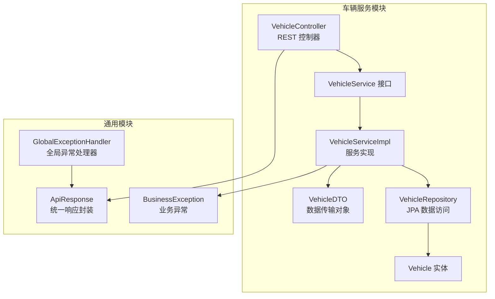
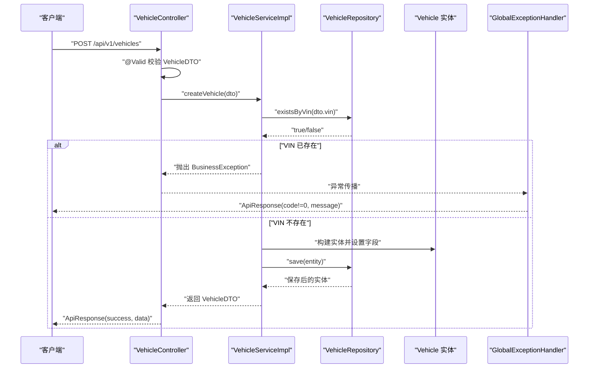
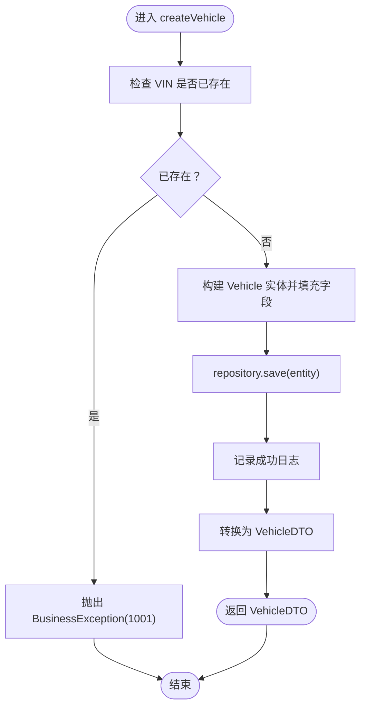
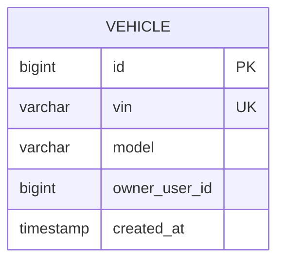
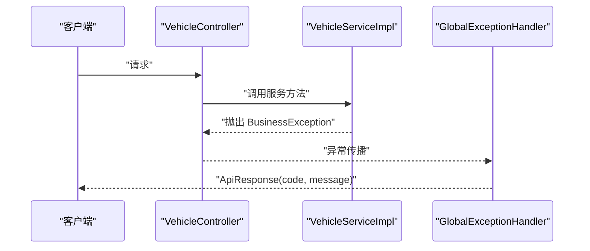
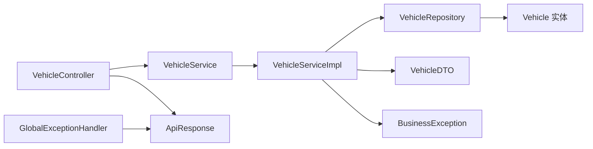

# 服务层实现

<cite>
**本文引用的文件**
- [VehicleService.java](file://vehicle-service/src/main/java/com/wenjie/cloud/vehicle/service/VehicleService.java)
- [VehicleServiceImpl.java](file://vehicle-service/src/main/java/com/wenjie/cloud/vehicle/service/impl/VehicleServiceImpl.java)
- [Vehicle.java](file://vehicle-service/src/main/java/com/wenjie/cloud/vehicle/entity/Vehicle.java)
- [VehicleRepository.java](file://vehicle-service/src/main/java/com/wenjie/cloud/vehicle/repository/VehicleRepository.java)
- [VehicleDTO.java](file://vehicle-service/src/main/java/com/wenjie/cloud/vehicle/dto/VehicleDTO.java)
- [VehicleController.java](file://vehicle-service/src/main/java/com/wenjie/cloud/vehicle/controller/VehicleController.java)
- [BusinessException.java](file://vehicle-common/src/main/java/com/wenjie/cloud/common/exception/BusinessException.java)
- [GlobalExceptionHandler.java](file://vehicle-common/src/main/java/com/wenjie/cloud/common/exception/GlobalExceptionHandler.java)
- [ApiResponse.java](file://vehicle-common/src/main/java/com/wenjie/cloud/common/dto/ApiResponse.java)
</cite>

## 目录
1. [简介](#简介)
2. [项目结构](#项目结构)
3. [核心组件](#核心组件)
4. [架构总览](#架构总览)
5. [详细组件分析](#详细组件分析)
6. [依赖关系分析](#依赖关系分析)
7. [性能考虑](#性能考虑)
8. [故障排查指南](#故障排查指南)
9. [结论](#结论)
10. [附录](#附录)

## 简介
本文件面向车辆管理服务层，系统化梳理 VehicleService 接口设计与 VehicleServiceImpl 实现细节，重点覆盖以下主题：
- VIN 码 17 位唯一性验证规则的实现逻辑（含参数校验、数据库唯一约束与业务检查）
- 车辆与用户关联关系的业务逻辑（外键关系维护、数据一致性与级联处理建议）
- 服务层异常处理、事务管理与数据转换机制
- 方法参数说明、返回值类型与异常处理策略
- 完整业务流程图与数据流转说明

## 项目结构
车辆服务模块采用分层架构，服务层位于 controller -> service -> repository -> entity 的调用链路中，配合通用异常与响应封装模块，形成清晰的职责边界。

图表来源
- [VehicleController.java:1-61](file://vehicle-service/src/main/java/com/wenjie/cloud/vehicle/controller/VehicleController.java#L1-L61)
- [VehicleService.java:1-32](file://vehicle-service/src/main/java/com/wenjie/cloud/vehicle/service/VehicleService.java#L1-L32)
- [VehicleServiceImpl.java:1-82](file://vehicle-service/src/main/java/com/wenjie/cloud/vehicle/service/impl/VehicleServiceImpl.java#L1-L82)
- [VehicleRepository.java:1-23](file://vehicle-service/src/main/java/com/wenjie/cloud/vehicle/repository/VehicleRepository.java#L1-L23)
- [Vehicle.java:1-42](file://vehicle-service/src/main/java/com/wenjie/cloud/vehicle/entity/Vehicle.java#L1-L42)
- [VehicleDTO.java:1-28](file://vehicle-service/src/main/java/com/wenjie/cloud/vehicle/dto/VehicleDTO.java#L1-L28)
- [BusinessException.java:1-27](file://vehicle-common/src/main/java/com/wenjie/cloud/common/exception/BusinessException.java#L1-L27)
- [GlobalExceptionHandler.java:1-56](file://vehicle-common/src/main/java/com/wenjie/cloud/common/exception/GlobalExceptionHandler.java#L1-L56)
- [ApiResponse.java:1-52](file://vehicle-common/src/main/java/com/wenjie/cloud/common/dto/ApiResponse.java#L1-L52)

章节来源
- [VehicleController.java:1-61](file://vehicle-service/src/main/java/com/wenjie/cloud/vehicle/controller/VehicleController.java#L1-L61)
- [VehicleService.java:1-32](file://vehicle-service/src/main/java/com/wenjie/cloud/vehicle/service/VehicleService.java#L1-L32)
- [VehicleServiceImpl.java:1-82](file://vehicle-service/src/main/java/com/wenjie/cloud/vehicle/service/impl/VehicleServiceImpl.java#L1-L82)
- [VehicleRepository.java:1-23](file://vehicle-service/src/main/java/com/wenjie/cloud/vehicle/repository/VehicleRepository.java#L1-L23)
- [Vehicle.java:1-42](file://vehicle-service/src/main/java/com/wenjie/cloud/vehicle/entity/Vehicle.java#L1-L42)
- [VehicleDTO.java:1-28](file://vehicle-service/src/main/java/com/wenjie/cloud/vehicle/dto/VehicleDTO.java#L1-L28)
- [BusinessException.java:1-27](file://vehicle-common/src/main/java/com/wenjie/cloud/common/exception/BusinessException.java#L1-L27)
- [GlobalExceptionHandler.java:1-56](file://vehicle-common/src/main/java/com/wenjie/cloud/common/exception/GlobalExceptionHandler.java#L1-L56)
- [ApiResponse.java:1-52](file://vehicle-common/src/main/java/com/wenjie/cloud/common/dto/ApiResponse.java#L1-L52)

## 核心组件
- VehicleService 接口：定义车辆 CRUD 的标准契约，包括创建、查询单个、查询列表、删除。
- VehicleServiceImpl 实现：承载业务规则与事务控制，负责 VIN 唯一性检查、实体转换、日志记录与异常抛出。
- Vehicle 实体：映射数据库表 vehicle，包含 VIN（17 位唯一）、model、owner_user_id、createdAt 等字段。
- VehicleRepository：基于 Spring Data JPA 的仓库接口，提供按 VIN 存在性检查与基础 CRUD。
- VehicleDTO：输入/输出的数据传输对象，包含 VIN、model、owner_user_id，并通过 Bean Validation 进行参数校验。
- VehicleController：REST 控制器，接收请求、触发服务层方法、返回统一响应。
- BusinessException：业务异常基类，用于可预期的业务错误。
- GlobalExceptionHandler：统一异常处理，将业务异常转换为 ApiResponse。
- ApiResponse：统一响应封装，包含 code、message、data、timestamp 字段。

章节来源
- [VehicleService.java:1-32](file://vehicle-service/src/main/java/com/wenjie/cloud/vehicle/service/VehicleService.java#L1-L32)
- [VehicleServiceImpl.java:1-82](file://vehicle-service/src/main/java/com/wenjie/cloud/vehicle/service/impl/VehicleServiceImpl.java#L1-L82)
- [Vehicle.java:1-42](file://vehicle-service/src/main/java/com/wenjie/cloud/vehicle/entity/Vehicle.java#L1-L42)
- [VehicleRepository.java:1-23](file://vehicle-service/src/main/java/com/wenjie/cloud/vehicle/repository/VehicleRepository.java#L1-L23)
- [VehicleDTO.java:1-28](file://vehicle-service/src/main/java/com/wenjie/cloud/vehicle/dto/VehicleDTO.java#L1-L28)
- [VehicleController.java:1-61](file://vehicle-service/src/main/java/com/wenjie/cloud/vehicle/controller/VehicleController.java#L1-L61)
- [BusinessException.java:1-27](file://vehicle-common/src/main/java/com/wenjie/cloud/common/exception/BusinessException.java#L1-L27)
- [GlobalExceptionHandler.java:1-56](file://vehicle-common/src/main/java/com/wenjie/cloud/common/exception/GlobalExceptionHandler.java#L1-L56)
- [ApiResponse.java:1-52](file://vehicle-common/src/main/java/com/wenjie/cloud/common/dto/ApiResponse.java#L1-L52)

## 架构总览
服务层整体调用链如下：控制器接收请求，进行参数校验后调用服务层；服务层执行业务规则与事务控制，必要时访问仓库层持久化；异常统一由全局处理器转换为标准化响应。

图表来源
- [VehicleController.java:28-34](file://vehicle-service/src/main/java/com/wenjie/cloud/vehicle/controller/VehicleController.java#L28-L34)
- [VehicleServiceImpl.java:27-43](file://vehicle-service/src/main/java/com/wenjie/cloud/vehicle/service/impl/VehicleServiceImpl.java#L27-L43)
- [VehicleRepository.java:11-22](file://vehicle-service/src/main/java/com/wenjie/cloud/vehicle/repository/VehicleRepository.java#L11-L22)
- [Vehicle.java:16-42](file://vehicle-service/src/main/java/com/wenjie/cloud/vehicle/entity/Vehicle.java#L16-L42)
- [BusinessException.java:11-27](file://vehicle-common/src/main/java/com/wenjie/cloud/common/exception/BusinessException.java#L11-L27)
- [GlobalExceptionHandler.java:26-31](file://vehicle-common/src/main/java/com/wenjie/cloud/common/exception/GlobalExceptionHandler.java#L26-L31)
- [ApiResponse.java:41-50](file://vehicle-common/src/main/java/com/wenjie/cloud/common/dto/ApiResponse.java#L41-L50)

## 详细组件分析

### VehicleService 接口设计
- 职责：定义车辆管理的标准方法集合，确保服务层对外暴露一致的契约。
- 方法清单：
  - createVehicle(VehicleDTO): 创建车辆
  - getVehicleById(Long): 查询单个车辆
  - listVehicles(): 查询车辆列表
  - deleteVehicle(Long): 删除车辆

章节来源
- [VehicleService.java:10-31](file://vehicle-service/src/main/java/com/wenjie/cloud/vehicle/service/VehicleService.java#L10-L31)

### VehicleServiceImpl 实现要点
- 事务管理：
  - createVehicle/deleteVehicle 使用写事务（@Transactional），确保数据库一致性。
  - getVehicleById/listVehicles 使用只读事务（@Transactional(readOnly = true）），提升查询性能。
- VIN 唯一性验证：
  - 在保存前调用 existsByVin(dto.getVin()) 进行存在性检查，若已存在则抛出 BusinessException。
- 数据转换：
  - toDTO(entity) 将实体转换为 VehicleDTO，避免直接暴露实体给控制器或外部。
- 日志记录：
  - 成功创建/删除后记录日志，便于审计与问题追踪。

图表来源
- [VehicleServiceImpl.java:27-43](file://vehicle-service/src/main/java/com/wenjie/cloud/vehicle/service/impl/VehicleServiceImpl.java#L27-L43)
- [VehicleRepository.java:20-21](file://vehicle-service/src/main/java/com/wenjie/cloud/vehicle/repository/VehicleRepository.java#L20-L21)
- [BusinessException.java:14-20](file://vehicle-common/src/main/java/com/wenjie/cloud/common/exception/BusinessException.java#L14-L20)

章节来源
- [VehicleServiceImpl.java:27-69](file://vehicle-service/src/main/java/com/wenjie/cloud/vehicle/service/impl/VehicleServiceImpl.java#L27-L69)

### Vehicle 实体与数据库约束
- 字段说明：
  - id：自增主键
  - vin：长度 17，非空且唯一
  - model：长度 64
  - owner_user_id：关联车主 ID（外键建议）
  - createdAt：创建时间，不可更新
- 约束与索引：
  - 数据库层面通过唯一约束保障 VIN 唯一性，避免并发重复插入导致的脏数据。
  - owner_user_id 当前未声明外键约束，建议在数据库层添加外键以保证引用完整性。

图表来源
- [Vehicle.java:21-41](file://vehicle-service/src/main/java/com/wenjie/cloud/vehicle/entity/Vehicle.java#L21-L41)

章节来源
- [Vehicle.java:16-42](file://vehicle-service/src/main/java/com/wenjie/cloud/vehicle/entity/Vehicle.java#L16-L42)

### VehicleRepository 数据访问
- findByVin(String): 根据 VIN 查询车辆，返回 Optional，用于存在性判断与后续加载。
- existsByVin(String): 快速存在性检查，用于业务前置校验。
- 继承 JpaRepository：天然具备基础 CRUD 能力，支持分页、排序等扩展。

章节来源
- [VehicleRepository.java:11-22](file://vehicle-service/src/main/java/com/wenjie/cloud/vehicle/repository/VehicleRepository.java#L11-L22)

### VehicleDTO 参数校验与数据模型
- 参数校验：
  - vin：非空且必须为 17 位（@NotBlank + @Size(min=17,max=17)）
  - model：非空（@NotBlank）
- 与实体差异：
  - DTO 仅承载传输所需字段，避免将实体的内部属性暴露到 API。

章节来源
- [VehicleDTO.java:11-27](file://vehicle-service/src/main/java/com/wenjie/cloud/vehicle/dto/VehicleDTO.java#L11-L27)

### VehicleController REST 接口
- 路径与方法：
  - POST /api/v1/vehicles：创建车辆
  - GET /api/v1/vehicles/{id}：查询单个车辆
  - GET /api/v1/vehicles：查询车辆列表
  - DELETE /api/v1/vehicles/{id}：删除车辆
- 参数校验：
  - @Valid 对请求体进行 Bean Validation 校验，失败时由全局异常处理器拦截。
- 响应封装：
  - 所有响应通过 ApiResponse 包装，统一 code/message/data/timestamp 结构。

章节来源
- [VehicleController.java:21-60](file://vehicle-service/src/main/java/com/wenjie/cloud/vehicle/controller/VehicleController.java#L21-L60)

### 异常处理与统一响应
- BusinessException：
  - 业务异常基类，携带 errorCode 与 message，便于前端识别与国际化。
- GlobalExceptionHandler：
  - 捕获 BusinessException 并返回 ApiResponse(code!=0)。
  - 捕获 MethodArgumentNotValidException，提取字段级错误并返回 ApiResponse(code=400)。
  - 捕获其他异常返回 ApiResponse(code=500)。
- ApiResponse：
  - 成功响应 code=0，失败响应 code≠0；统一时间戳便于对账。

图表来源
- [BusinessException.java:11-27](file://vehicle-common/src/main/java/com/wenjie/cloud/common/exception/BusinessException.java#L11-L27)
- [GlobalExceptionHandler.java:26-54](file://vehicle-common/src/main/java/com/wenjie/cloud/common/exception/GlobalExceptionHandler.java#L26-L54)
- [ApiResponse.java:41-50](file://vehicle-common/src/main/java/com/wenjie/cloud/common/dto/ApiResponse.java#L41-L50)

章节来源
- [BusinessException.java:11-27](file://vehicle-common/src/main/java/com/wenjie/cloud/common/exception/BusinessException.java#L11-L27)
- [GlobalExceptionHandler.java:19-56](file://vehicle-common/src/main/java/com/wenjie/cloud/common/exception/GlobalExceptionHandler.java#L19-L56)
- [ApiResponse.java:12-51](file://vehicle-common/src/main/java/com/wenjie/cloud/common/dto/ApiResponse.java#L12-L51)

## 依赖关系分析
服务层内部依赖清晰，遵循分层解耦原则：
- 控制器依赖服务接口，不关心具体实现。
- 服务实现依赖仓库接口与 DTO，不直接依赖控制器。
- 仓库接口继承 JPA 基础能力，实体定义字段与约束。
- 异常与响应封装独立于业务，通过全局处理器统一处理。

图表来源
- [VehicleController.java:21-60](file://vehicle-service/src/main/java/com/wenjie/cloud/vehicle/controller/VehicleController.java#L21-L60)
- [VehicleService.java:10-31](file://vehicle-service/src/main/java/com/wenjie/cloud/vehicle/service/VehicleService.java#L10-L31)
- [VehicleServiceImpl.java:23-81](file://vehicle-service/src/main/java/com/wenjie/cloud/vehicle/service/impl/VehicleServiceImpl.java#L23-L81)
- [VehicleRepository.java:11-22](file://vehicle-service/src/main/java/com/wenjie/cloud/vehicle/repository/VehicleRepository.java#L11-L22)
- [Vehicle.java:16-42](file://vehicle-service/src/main/java/com/wenjie/cloud/vehicle/entity/Vehicle.java#L16-L42)
- [VehicleDTO.java:11-27](file://vehicle-service/src/main/java/com/wenjie/cloud/vehicle/dto/VehicleDTO.java#L11-L27)
- [BusinessException.java:11-27](file://vehicle-common/src/main/java/com/wenjie/cloud/common/exception/BusinessException.java#L11-L27)
- [GlobalExceptionHandler.java:19-56](file://vehicle-common/src/main/java/com/wenjie/cloud/common/exception/GlobalExceptionHandler.java#L19-L56)
- [ApiResponse.java:12-51](file://vehicle-common/src/main/java/com/wenjie/cloud/common/dto/ApiResponse.java#L12-L51)

章节来源
- [VehicleController.java:21-60](file://vehicle-service/src/main/java/com/wenjie/cloud/vehicle/controller/VehicleController.java#L21-L60)
- [VehicleServiceImpl.java:23-81](file://vehicle-service/src/main/java/com/wenjie/cloud/vehicle/service/impl/VehicleServiceImpl.java#L23-L81)
- [VehicleRepository.java:11-22](file://vehicle-service/src/main/java/com/wenjie/cloud/vehicle/repository/VehicleRepository.java#L11-L22)
- [Vehicle.java:16-42](file://vehicle-service/src/main/java/com/wenjie/cloud/vehicle/entity/Vehicle.java#L16-L42)
- [VehicleDTO.java:11-27](file://vehicle-service/src/main/java/com/wenjie/cloud/vehicle/dto/VehicleDTO.java#L11-L27)
- [BusinessException.java:11-27](file://vehicle-common/src/main/java/com/wenjie/cloud/common/exception/BusinessException.java#L11-L27)
- [GlobalExceptionHandler.java:19-56](file://vehicle-common/src/main/java/com/wenjie/cloud/common/exception/GlobalExceptionHandler.java#L19-L56)
- [ApiResponse.java:12-51](file://vehicle-common/src/main/java/com/wenjie/cloud/common/dto/ApiResponse.java#L12-L51)

## 性能考虑
- 事务范围：
  - 写操作使用 @Transactional，读操作使用 @Transactional(readOnly = true)，减少锁竞争与资源占用。
- 查询优化：
  - existsByVin 与 findByVin 均基于数据库索引，建议确保 vin 字段建立唯一索引以提升命中率。
- DTO 转换：
  - 通过 toDTO 隔离实体与传输对象，避免不必要的懒加载与级联序列化开销。
- 日志级别：
  - 建议在生产环境将 INFO 级别日志降级为 DEBUG 或按需采样，降低 I/O 压力。

## 故障排查指南
- VIN 已存在错误（1001）：
  - 现象：创建车辆时报错“VIN 已存在”。
  - 排查：确认数据库中是否存在相同 VIN；检查 DTO 输入是否正确；查看服务层日志。
  - 参考路径：[VehicleServiceImpl.java:30-32](file://vehicle-service/src/main/java/com/wenjie/cloud/vehicle/service/impl/VehicleServiceImpl.java#L30-L32)
- 车辆不存在错误（1002）：
  - 现象：查询或删除不存在的车辆时报错“车辆不存在”。
  - 排查：确认传入的 id 是否正确；检查数据库记录；查看服务层日志。
  - 参考路径：[VehicleServiceImpl.java:48-49](file://vehicle-service/src/main/java/com/wenjie/cloud/vehicle/service/impl/VehicleServiceImpl.java#L48-L49), [VehicleServiceImpl.java:63-66](file://vehicle-service/src/main/java/com/wenjie/cloud/vehicle/service/impl/VehicleServiceImpl.java#L63-L66)
- 参数校验失败（400）：
  - 现象：VIN 非空但不是 17 位、model 为空等导致校验失败。
  - 排查：检查 VehicleDTO 字段注解与前端传参；查看全局异常处理器返回的错误详情。
  - 参考路径：[VehicleDTO.java:17-23](file://vehicle-service/src/main/java/com/wenjie/cloud/vehicle/dto/VehicleDTO.java#L17-L23), [GlobalExceptionHandler.java:35-44](file://vehicle-common/src/main/java/com/wenjie/cloud/common/exception/GlobalExceptionHandler.java#L35-L44)
- 业务异常统一处理：
  - 现象：服务层抛出 BusinessException 后被全局处理器转换为 ApiResponse。
  - 排查：确认 errorCode 与 message 是否符合预期；检查日志输出。
  - 参考路径：[BusinessException.java:14-25](file://vehicle-common/src/main/java/com/wenjie/cloud/common/exception/BusinessException.java#L14-L25), [GlobalExceptionHandler.java:26-31](file://vehicle-common/src/main/java/com/wenjie/cloud/common/exception/GlobalExceptionHandler.java#L26-L31)

章节来源
- [VehicleServiceImpl.java:30-32](file://vehicle-service/src/main/java/com/wenjie/cloud/vehicle/service/impl/VehicleServiceImpl.java#L30-L32)
- [VehicleServiceImpl.java:48-49](file://vehicle-service/src/main/java/com/wenjie/cloud/vehicle/service/impl/VehicleServiceImpl.java#L48-L49)
- [VehicleServiceImpl.java:63-66](file://vehicle-service/src/main/java/com/wenjie/cloud/vehicle/service/impl/VehicleServiceImpl.java#L63-L66)
- [VehicleDTO.java:17-23](file://vehicle-service/src/main/java/com/wenjie/cloud/vehicle/dto/VehicleDTO.java#L17-L23)
- [GlobalExceptionHandler.java:26-44](file://vehicle-common/src/main/java/com/wenjie/cloud/common/exception/GlobalExceptionHandler.java#L26-L44)
- [BusinessException.java:14-25](file://vehicle-common/src/main/java/com/wenjie/cloud/common/exception/BusinessException.java#L14-L25)

## 结论
本服务层通过清晰的接口设计、严格的参数校验、完善的事务与异常处理机制，实现了车辆管理的核心功能。VIN 唯一性在 DTO、数据库与业务层三重保障下得到可靠保证；服务层与控制器、仓库层职责分明，便于扩展与维护。建议后续补充 owner_user_id 的外键约束与级联策略，进一步强化数据一致性。

## 附录

### 方法签名与返回值说明
- createVehicle(VehicleDTO):
  - 输入：VehicleDTO（包含 vin、model、owner_user_id）
  - 返回：VehicleDTO（创建成功后的完整数据）
  - 异常：当 VIN 已存在时抛出 BusinessException（errorCode=1001）
  - 参考路径：[VehicleService.java:14-15](file://vehicle-service/src/main/java/com/wenjie/cloud/vehicle/service/VehicleService.java#L14-L15), [VehicleServiceImpl.java:27-43](file://vehicle-service/src/main/java/com/wenjie/cloud/vehicle/service/impl/VehicleServiceImpl.java#L27-L43)
- getVehicleById(Long id):
  - 输入：Long id
  - 返回：VehicleDTO（查询结果）
  - 异常：当 id 不存在时抛出 BusinessException（errorCode=1002）
  - 参考路径：[VehicleService.java:17-20](file://vehicle-service/src/main/java/com/wenjie/cloud/vehicle/service/VehicleService.java#L17-L20), [VehicleServiceImpl.java:45-51](file://vehicle-service/src/main/java/com/wenjie/cloud/vehicle/service/impl/VehicleServiceImpl.java#L45-L51)
- listVehicles():
  - 输入：无
  - 返回：List<VehicleDTO>
  - 异常：无（查询不到返回空列表）
  - 参考路径：[VehicleService.java:22-25](file://vehicle-service/src/main/java/com/wenjie/cloud/vehicle/service/VehicleService.java#L22-L25), [VehicleServiceImpl.java:53-59](file://vehicle-service/src/main/java/com/wenjie/cloud/vehicle/service/impl/VehicleServiceImpl.java#L53-L59)
- deleteVehicle(Long id):
  - 输入：Long id
  - 返回：void
  - 异常：当 id 不存在时抛出 BusinessException（errorCode=1002）
  - 参考路径：[VehicleService.java:27-30](file://vehicle-service/src/main/java/com/wenjie/cloud/vehicle/service/VehicleService.java#L27-L30), [VehicleServiceImpl.java:61-69](file://vehicle-service/src/main/java/com/wenjie/cloud/vehicle/service/impl/VehicleServiceImpl.java#L61-L69)

### VIN 唯一性验证规则实现逻辑
- 参数校验（DTO 层）：
  - vin 必须为 17 位字符串，确保输入格式正确。
  - 参考路径：[VehicleDTO.java:17-19](file://vehicle-service/src/main/java/com/wenjie/cloud/vehicle/dto/VehicleDTO.java#L17-L19)
- 数据库唯一约束（实体层）：
  - vin 字段声明唯一约束，防止并发重复插入。
  - 参考路径：[Vehicle.java:26-28](file://vehicle-service/src/main/java/com/wenjie/cloud/vehicle/entity/Vehicle.java#L26-L28)
- 业务层检查（服务层）：
  - 在保存前调用 existsByVin 进行存在性检查，若已存在则抛出 BusinessException。
  - 参考路径：[VehicleServiceImpl.java:30-32](file://vehicle-service/src/main/java/com/wenjie/cloud/vehicle/service/impl/VehicleServiceImpl.java#L30-L32), [VehicleRepository.java:20-21](file://vehicle-service/src/main/java/com/wenjie/cloud/vehicle/repository/VehicleRepository.java#L20-L21)

### 车辆与用户关联关系的业务逻辑
- 现状：
  - 实体包含 owner_user_id 字段，表示关联车主 ID。
  - 仓库与服务层未实现外键约束与级联操作。
- 建议：
  - 在数据库层为 owner_user_id 添加外键约束，指向用户表主键。
  - 根据业务需求选择合适的级联策略（RESTRICT/SET NULL/CASCADE），确保删除用户时不会破坏车辆数据完整性。
  - 在服务层增加对 owner_user_id 的存在性校验与权限控制（如需要），避免无效关联。

章节来源
- [Vehicle.java:34-36](file://vehicle-service/src/main/java/com/wenjie/cloud/vehicle/entity/Vehicle.java#L34-L36)
- [VehicleServiceImpl.java:37-37](file://vehicle-service/src/main/java/com/wenjie/cloud/vehicle/service/impl/VehicleServiceImpl.java#L37-L37)