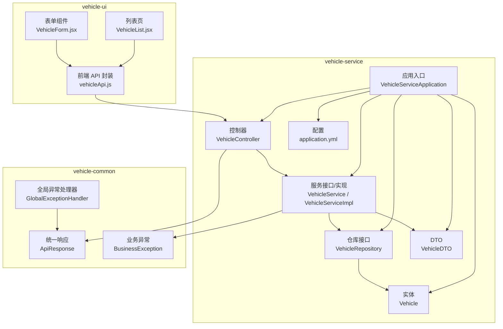
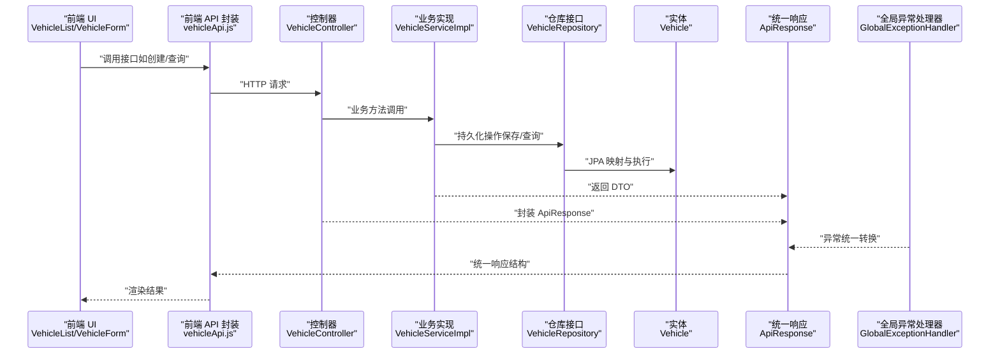
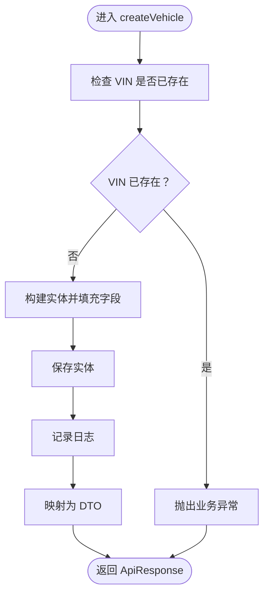
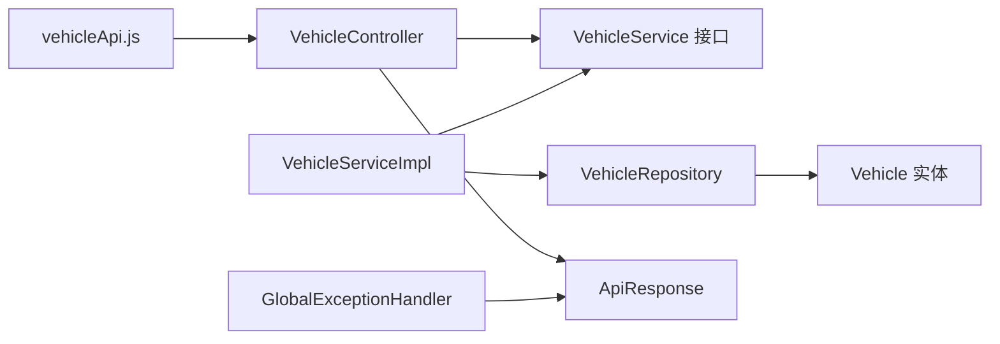

# 车辆管理服务

<cite>
**本文引用的文件**
- [VehicleController.java](file://vehicle-service/src/main/java/com/wenjie/cloud/vehicle/controller/VehicleController.java)
- [VehicleService.java](file://vehicle-service/src/main/java/com/wenjie/cloud/vehicle/service/VehicleService.java)
- [VehicleServiceImpl.java](file://vehicle-service/src/main/java/com/wenjie/cloud/vehicle/service/impl/VehicleServiceImpl.java)
- [VehicleRepository.java](file://vehicle-service/src/main/java/com/wenjie/cloud/vehicle/repository/VehicleRepository.java)
- [Vehicle.java](file://vehicle-service/src/main/java/com/wenjie/cloud/vehicle/entity/Vehicle.java)
- [VehicleDTO.java](file://vehicle-service/src/main/java/com/wenjie/cloud/vehicle/dto/VehicleDTO.java)
- [VehicleServiceApplication.java](file://vehicle-service/src/main/java/com/wenjie/cloud/vehicle/VehicleServiceApplication.java)
- [application.yml](file://vehicle-service/src/main/resources/application.yml)
- [ApiResponse.java](file://vehicle-common/src/main/java/com/wenjie/cloud/common/dto/ApiResponse.java)
- [BusinessException.java](file://vehicle-common/src/main/java/com/wenjie/cloud/common/exception/BusinessException.java)
- [GlobalExceptionHandler.java](file://vehicle-common/src/main/java/com/wenjie/cloud/common/exception/GlobalExceptionHandler.java)
- [vehicleApi.js](file://vehicle-ui/src/api/vehicleApi.js)
- [VehicleForm.jsx](file://vehicle-ui/src/components/VehicleForm.jsx)
- [VehicleList.jsx](file://vehicle-ui/src/pages/VehicleList.jsx)
</cite>

## 目录
1. [简介](#简介)
2. [项目结构](#项目结构)
3. [核心组件](#核心组件)
4. [架构总览](#架构总览)
5. [详细组件分析](#详细组件分析)
6. [依赖分析](#依赖分析)
7. [性能考虑](#性能考虑)
8. [故障排查指南](#故障排查指南)
9. [结论](#结论)
10. [附录](#附录)

## 简介
本文件面向“车辆管理服务”的开发与运维人员，系统化梳理车辆 CRUD 的完整实现方案，覆盖控制器层、业务逻辑层、数据访问层、实体模型、数据传输对象、统一响应与异常处理机制，并提供 API 接口文档、数据验证规则与使用示例。通过分层次的架构图与流程图，帮助读者快速理解各模块职责与交互方式。

## 项目结构
- 后端采用多模块 Maven 结构，核心模块为 vehicle-service（车辆服务）、vehicle-common（通用组件），另有 vehicle-status-service（状态服务）与 vehicle-ui（前端界面）。
- vehicle-service 包含控制器、服务、仓库、实体与 DTO；vehicle-common 提供统一响应与全局异常处理；vehicle-ui 提供前端调用与页面展示。

图表来源
- [VehicleController.java:1-61](file://vehicle-service/src/main/java/com/wenjie/cloud/vehicle/controller/VehicleController.java#L1-L61)
- [VehicleServiceImpl.java:1-82](file://vehicle-service/src/main/java/com/wenjie/cloud/vehicle/service/impl/VehicleServiceImpl.java#L1-L82)
- [VehicleRepository.java:1-23](file://vehicle-service/src/main/java/com/wenjie/cloud/vehicle/repository/VehicleRepository.java#L1-L23)
- [Vehicle.java:1-42](file://vehicle-service/src/main/java/com/wenjie/cloud/vehicle/entity/Vehicle.java#L1-L42)
- [VehicleDTO.java:1-28](file://vehicle-service/src/main/java/com/wenjie/cloud/vehicle/dto/VehicleDTO.java#L1-L28)
- [VehicleServiceApplication.java:1-16](file://vehicle-service/src/main/java/com/wenjie/cloud/vehicle/VehicleServiceApplication.java#L1-L16)
- [application.yml:1-40](file://vehicle-service/src/main/resources/application.yml#L1-L40)
- [ApiResponse.java:1-52](file://vehicle-common/src/main/java/com/wenjie/cloud/common/dto/ApiResponse.java#L1-L52)
- [BusinessException.java:1-27](file://vehicle-common/src/main/java/com/wenjie/cloud/common/exception/BusinessException.java#L1-L27)
- [GlobalExceptionHandler.java:1-56](file://vehicle-common/src/main/java/com/wenjie/cloud/common/exception/GlobalExceptionHandler.java#L1-L56)
- [vehicleApi.js:1-20](file://vehicle-ui/src/api/vehicleApi.js#L1-L20)
- [VehicleForm.jsx:1-65](file://vehicle-ui/src/components/VehicleForm.jsx#L1-L65)
- [VehicleList.jsx:1-100](file://vehicle-ui/src/pages/VehicleList.jsx#L1-L100)

章节来源
- [VehicleServiceApplication.java:1-16](file://vehicle-service/src/main/java/com/wenjie/cloud/vehicle/VehicleServiceApplication.java#L1-L16)
- [application.yml:1-40](file://vehicle-service/src/main/resources/application.yml#L1-L40)

## 核心组件
- 控制器层：提供 REST API，负责请求接收、参数校验与响应封装。
- 业务逻辑层：实现 VIN 唯一性校验、车辆与用户关联关系的业务规则与数据一致性保障。
- 数据访问层：基于 Spring Data JPA 的仓库接口，提供 VIN 存在性判断与基础 CRUD。
- 实体模型：定义车辆表结构、字段约束与索引策略。
- DTO：封装对外传输的数据结构与校验规则。
- 统一响应与异常：统一返回格式与异常处理，确保前后端一致的错误语义。

章节来源
- [VehicleController.java:1-61](file://vehicle-service/src/main/java/com/wenjie/cloud/vehicle/controller/VehicleController.java#L1-L61)
- [VehicleService.java:1-32](file://vehicle-service/src/main/java/com/wenjie/cloud/vehicle/service/VehicleService.java#L1-L32)
- [VehicleServiceImpl.java:1-82](file://vehicle-service/src/main/java/com/wenjie/cloud/vehicle/service/impl/VehicleServiceImpl.java#L1-L82)
- [VehicleRepository.java:1-23](file://vehicle-service/src/main/java/com/wenjie/cloud/vehicle/repository/VehicleRepository.java#L1-L23)
- [Vehicle.java:1-42](file://vehicle-service/src/main/java/com/wenjie/cloud/vehicle/entity/Vehicle.java#L1-L42)
- [VehicleDTO.java:1-28](file://vehicle-service/src/main/java/com/wenjie/cloud/vehicle/dto/VehicleDTO.java#L1-L28)
- [ApiResponse.java:1-52](file://vehicle-common/src/main/java/com/wenjie/cloud/common/dto/ApiResponse.java#L1-L52)
- [BusinessException.java:1-27](file://vehicle-common/src/main/java/com/wenjie/cloud/common/exception/BusinessException.java#L1-L27)
- [GlobalExceptionHandler.java:1-56](file://vehicle-common/src/main/java/com/wenjie/cloud/common/exception/GlobalExceptionHandler.java#L1-L56)

## 架构总览
下图展示了从客户端到后端服务的典型调用链路，以及异常处理与统一响应的归口。

图表来源
- [vehicleApi.js:1-20](file://vehicle-ui/src/api/vehicleApi.js#L1-L20)
- [VehicleController.java:1-61](file://vehicle-service/src/main/java/com/wenjie/cloud/vehicle/controller/VehicleController.java#L1-L61)
- [VehicleServiceImpl.java:1-82](file://vehicle-service/src/main/java/com/wenjie/cloud/vehicle/service/impl/VehicleServiceImpl.java#L1-L82)
- [VehicleRepository.java:1-23](file://vehicle-service/src/main/java/com/wenjie/cloud/vehicle/repository/VehicleRepository.java#L1-L23)
- [Vehicle.java:1-42](file://vehicle-service/src/main/java/com/wenjie/cloud/vehicle/entity/Vehicle.java#L1-L42)
- [ApiResponse.java:1-52](file://vehicle-common/src/main/java/com/wenjie/cloud/common/dto/ApiResponse.java#L1-L52)
- [GlobalExceptionHandler.java:1-56](file://vehicle-common/src/main/java/com/wenjie/cloud/common/exception/GlobalExceptionHandler.java#L1-L56)

## 详细组件分析

### 控制器层：VehicleController
- 路径与方法
  - POST /api/v1/vehicles：创建车辆
  - GET /api/v1/vehicles/{id}：根据 ID 查询车辆
  - GET /api/v1/vehicles：查询车辆列表
  - DELETE /api/v1/vehicles/{id}：删除车辆
- 参数处理与校验
  - 使用 @Valid 对请求体进行参数校验，结合 DTO 的 JSR-303 注解完成输入约束。
  - 使用 @PathVariable 提取路径参数。
- 响应封装
  - 统一返回 ApiResponse<T>，成功时 code=0，message="success"。

章节来源
- [VehicleController.java:1-61](file://vehicle-service/src/main/java/com/wenjie/cloud/vehicle/controller/VehicleController.java#L1-L61)
- [ApiResponse.java:1-52](file://vehicle-common/src/main/java/com/wenjie/cloud/common/dto/ApiResponse.java#L1-L52)

### 业务逻辑层：VehicleService 与 VehicleServiceImpl
- 业务职责
  - 创建车辆：检查 VIN 唯一性，写入创建时间，保存并返回 DTO。
  - 查询车辆：按 ID 查询，不存在则抛出业务异常。
  - 列表查询：全量读取并映射为 DTO 列表。
  - 删除车辆：先校验存在性，再删除并记录日志。
- 事务与一致性
  - 使用 @Transactional 确保创建与删除的原子性。
  - 使用 @Transactional(readOnly = true) 保证查询只读。
- 异常处理
  - 通过 BusinessException 抛出可预期的业务错误，交由全局异常处理器统一转换为 ApiResponse。

图表来源
- [VehicleServiceImpl.java:1-82](file://vehicle-service/src/main/java/com/wenjie/cloud/vehicle/service/impl/VehicleServiceImpl.java#L1-L82)
- [BusinessException.java:1-27](file://vehicle-common/src/main/java/com/wenjie/cloud/common/exception/BusinessException.java#L1-L27)

章节来源
- [VehicleService.java:1-32](file://vehicle-service/src/main/java/com/wenjie/cloud/vehicle/service/VehicleService.java#L1-L32)
- [VehicleServiceImpl.java:1-82](file://vehicle-service/src/main/java/com/wenjie/cloud/vehicle/service/impl/VehicleServiceImpl.java#L1-L82)

### 数据访问层：VehicleRepository
- 接口能力
  - 继承 JpaRepository<Vehicle, Long>，天然具备基础 CRUD。
  - findByVin：按 VIN 查询，返回 Optional。
  - existsByVin：判断 VIN 是否已存在，用于业务层唯一性校验。
- 查询优化建议
  - 在数据库层面为 vin 字段建立唯一索引（实体已标注唯一，DDL 由 Hibernate 自动生成）。
  - 如需高频条件查询，可在复杂场景下添加自定义查询方法以减少 N+1 风险。

章节来源
- [VehicleRepository.java:1-23](file://vehicle-service/src/main/java/com/wenjie/cloud/vehicle/repository/VehicleRepository.java#L1-L23)
- [Vehicle.java:1-42](file://vehicle-service/src/main/java/com/wenjie/cloud/vehicle/entity/Vehicle.java#L1-L42)

### 实体模型：Vehicle
- 字段与约束
  - id：主键，自增。
  - vin：17 位字符串，非空且唯一。
  - model：车型描述，长度限制。
  - ownerUserId：关联车主 ID（外键关系在业务层体现，未声明 JPA 外键注解）。
  - createdAt：创建时间，不可更新。
- 索引与约束
  - 唯一性约束由实体注解声明，配合数据库唯一索引，确保 VIN 唯一。
  - 建议在 ownerUserId 上建立普通索引以提升关联查询效率。

章节来源
- [Vehicle.java:1-42](file://vehicle-service/src/main/java/com/wenjie/cloud/vehicle/entity/Vehicle.java#L1-L42)

### 数据传输对象：VehicleDTO
- 字段与校验
  - id：可选（响应时填充）。
  - vin：必填，且必须为 17 位。
  - model：必填。
  - ownerUserId：可选（关联车主 ID）。
- 作用
  - 控制器层接收请求体，服务层与仓库层之间传递数据，避免直接暴露实体细节。

章节来源
- [VehicleDTO.java:1-28](file://vehicle-service/src/main/java/com/wenjie/cloud/vehicle/dto/VehicleDTO.java#L1-L28)

### 统一响应与异常处理
- ApiResponse
  - 统一响应结构，包含 code、message、data、timestamp。
  - 成功响应：code=0，message="success"。
- BusinessException
  - 可预期业务错误，携带 errorCode。
- GlobalExceptionHandler
  - 捕获 BusinessException 并返回 400。
  - 捕获参数校验异常 MethodArgumentNotValidException 并拼接字段级错误。
  - 捕获未知异常并返回 500。

章节来源
- [ApiResponse.java:1-52](file://vehicle-common/src/main/java/com/wenjie/cloud/common/dto/ApiResponse.java#L1-L52)
- [BusinessException.java:1-27](file://vehicle-common/src/main/java/com/wenjie/cloud/common/exception/BusinessException.java#L1-L27)
- [GlobalExceptionHandler.java:1-56](file://vehicle-common/src/main/java/com/wenjie/cloud/common/exception/GlobalExceptionHandler.java#L1-L56)

### 前端集成：vehicle-ui
- API 封装
  - vehicleApi.js：封装 /api/v1/vehicles 的 GET/POST/DELETE 方法。
- 页面与表单
  - VehicleList.jsx：表格展示、筛选、刷新与删除。
  - VehicleForm.jsx：表单校验（VIN 17 位、车型必选、车主 ID 数字）并提交。

章节来源
- [vehicleApi.js:1-20](file://vehicle-ui/src/api/vehicleApi.js#L1-L20)
- [VehicleForm.jsx:1-65](file://vehicle-ui/src/components/VehicleForm.jsx#L1-L65)
- [VehicleList.jsx:1-100](file://vehicle-ui/src/pages/VehicleList.jsx#L1-L100)

## 依赖分析
- 控制器依赖服务接口，服务实现依赖仓库接口与实体。
- 统一响应与异常处理作为横切关注点，被控制器与全局异常处理器共同使用。
- 前端通过 API 封装与控制器交互，页面组件负责 UI 逻辑与用户交互。

图表来源
- [VehicleController.java:1-61](file://vehicle-service/src/main/java/com/wenjie/cloud/vehicle/controller/VehicleController.java#L1-L61)
- [VehicleService.java:1-32](file://vehicle-service/src/main/java/com/wenjie/cloud/vehicle/service/VehicleService.java#L1-L32)
- [VehicleServiceImpl.java:1-82](file://vehicle-service/src/main/java/com/wenjie/cloud/vehicle/service/impl/VehicleServiceImpl.java#L1-L82)
- [VehicleRepository.java:1-23](file://vehicle-service/src/main/java/com/wenjie/cloud/vehicle/repository/VehicleRepository.java#L1-L23)
- [Vehicle.java:1-42](file://vehicle-service/src/main/java/com/wenjie/cloud/vehicle/entity/Vehicle.java#L1-L42)
- [ApiResponse.java:1-52](file://vehicle-common/src/main/java/com/wenjie/cloud/common/dto/ApiResponse.java#L1-L52)
- [GlobalExceptionHandler.java:1-56](file://vehicle-common/src/main/java/com/wenjie/cloud/common/exception/GlobalExceptionHandler.java#L1-L56)
- [vehicleApi.js:1-20](file://vehicle-ui/src/api/vehicleApi.js#L1-L20)

## 性能考虑
- 查询优化
  - 为 vin 建立唯一索引，确保 existsByVin 与 findByVin 的高效执行。
  - 为 ownerUserId 建立索引，提升按车主查询的性能。
- 分页与批量
  - 列表查询建议引入分页（Pageable）以控制单次返回量，避免大列表带来的内存压力。
- 缓存
  - 对热点查询（如按 VIN 查询）可引入缓存层降低数据库压力。
- 日志与监控
  - 业务关键路径增加必要的日志埋点，便于定位性能瓶颈。

## 故障排查指南
- 常见错误与定位
  - VIN 已存在：业务异常，错误码 1001；检查是否存在重复 VIN 或并发创建。
  - 车辆不存在：业务异常，错误码 1002；确认 ID 是否正确或是否已被删除。
  - 参数校验失败：返回 400，字段级错误信息由全局异常处理器拼接。
- 排查步骤
  - 查看统一响应中的 code/message 定位问题类型。
  - 检查数据库中是否存在重复 VIN 或缺失记录。
  - 核对前端传参是否满足 DTO 校验规则（VIN 17 位、车型必填等）。

章节来源
- [VehicleServiceImpl.java:1-82](file://vehicle-service/src/main/java/com/wenjie/cloud/vehicle/service/impl/VehicleServiceImpl.java#L1-L82)
- [GlobalExceptionHandler.java:1-56](file://vehicle-common/src/main/java/com/wenjie/cloud/common/exception/GlobalExceptionHandler.java#L1-L56)

## 结论
本方案以清晰的分层架构实现了车辆 CRUD 的完整闭环：控制器负责接口与参数校验，业务层保障 VIN 唯一性与数据一致性，仓库层提供高效查询，实体与 DTO 明确边界，统一响应与异常处理确保前后端一致的交互体验。结合前端 UI 的表单与列表展示，形成端到端的可用能力。后续可在查询分页、索引优化与缓存策略上进一步增强性能与扩展性。

## 附录

### API 接口文档
- 创建车辆
  - 方法：POST
  - 路径：/api/v1/vehicles
  - 请求体：VehicleDTO（vin 必填且 17 位、model 必填、ownerUserId 可选）
  - 成功响应：code=0，data 为 VehicleDTO
  - 错误响应：VIN 已存在（1001）、参数校验失败（400）
- 查询车辆详情
  - 方法：GET
  - 路径：/api/v1/vehicles/{id}
  - 成功响应：code=0，data 为 VehicleDTO
  - 错误响应：车辆不存在（1002）
- 查询车辆列表
  - 方法：GET
  - 路径：/api/v1/vehicles
  - 成功响应：code=0，data 为 VehicleDTO 列表
- 删除车辆
  - 方法：DELETE
  - 路径：/api/v1/vehicles/{id}
  - 成功响应：code=0，data 为空
  - 错误响应：车辆不存在（1002）

章节来源
- [VehicleController.java:1-61](file://vehicle-service/src/main/java/com/wenjie/cloud/vehicle/controller/VehicleController.java#L1-L61)
- [ApiResponse.java:1-52](file://vehicle-common/src/main/java/com/wenjie/cloud/common/dto/ApiResponse.java#L1-L52)

### 数据验证规则
- VehicleDTO
  - vin：非空，长度必须为 17
  - model：非空
  - ownerUserId：可空
- 前端校验
  - VIN 17 位、车型必选、车主 ID 数字输入

章节来源
- [VehicleDTO.java:1-28](file://vehicle-service/src/main/java/com/wenjie/cloud/vehicle/dto/VehicleDTO.java#L1-L28)
- [VehicleForm.jsx:1-65](file://vehicle-ui/src/components/VehicleForm.jsx#L1-L65)

### 使用示例（前端）
- 新增车辆
  - 通过 VehicleForm.jsx 输入 VIN（17 位）、选择车型、填写车主 ID，点击确认触发 vehicleApi.js 的 POST 请求。
- 列表查看与删除
  - VehicleList.jsx 加载车辆列表，支持按车型筛选与刷新；删除按钮触发 DELETE 请求。

章节来源
- [vehicleApi.js:1-20](file://vehicle-ui/src/api/vehicleApi.js#L1-L20)
- [VehicleForm.jsx:1-65](file://vehicle-ui/src/components/VehicleForm.jsx#L1-L65)
- [VehicleList.jsx:1-100](file://vehicle-ui/src/pages/VehicleList.jsx#L1-L100)