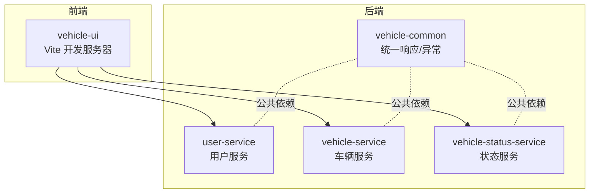
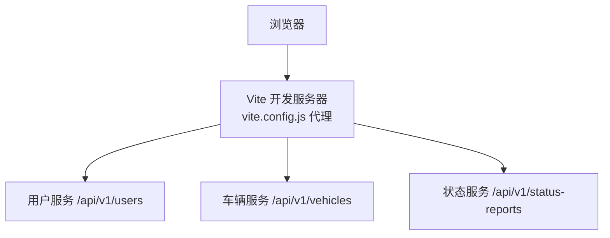
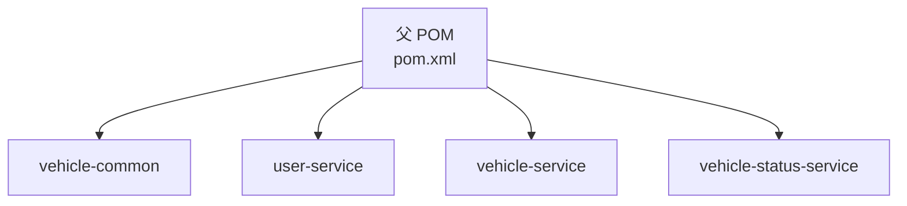

# 安全加固

<cite>
**本文引用的文件**
- [pom.xml](file://pom.xml)
- [application.yml（用户服务）](file://user-service/src/main/resources/application.yml)
- [application.yml（车辆服务）](file://vehicle-service/src/main/resources/application.yml)
- [application.yml（车辆状态服务）](file://vehicle-status-service/src/main/resources/application.yml)
- [vite.config.js（前端工程）](file://vehicle-ui/vite.config.js)
- [package.json（前端工程）](file://vehicle-ui/package.json)
- [UserServiceApplication（用户服务）](file://user-service/src/main/java/com/wenjie/cloud/user/UserServiceApplication.java)
- [VehicleServiceApplication（车辆服务）](file://vehicle-service/src/main/java/com/wenjie/cloud/vehicle/VehicleServiceApplication.java)
- [VehicleStatusServiceApplication（车辆状态服务）](file://vehicle-status-service/src/main/java/com/wenjie/cloud/vehiclestatus/VehicleStatusServiceApplication.java)
- [GlobalExceptionHandler（通用异常处理）](file://vehicle-common/src/main/java/com/wenjie/cloud/common/exception/GlobalExceptionHandler.java)
- [ApiResponse（统一响应模型）](file://vehicle-common/src/main/java/com/wenjie/cloud/common/dto/ApiResponse.java)
- [UserController（用户控制器）](file://user-service/src/main/java/com/wenjie/cloud/user/controller/UserController.java)
- [VehicleController（车辆控制器）](file://vehicle-service/src/main/java/com/wenjie/cloud/vehicle/controller/VehicleController.java)
- [StatusReportController（状态上报控制器）](file://vehicle-status-service/src/main/java/com/wenjie/cloud/vehiclestatus/controller/StatusReportController.java)
- [BusinessException（业务异常）](file://vehicle-common/src/main/java/com/wenjie/cloud/common/exception/BusinessException.java)
</cite>

## 目录
1. [引言](#引言)
2. [项目结构](#项目结构)
3. [核心组件](#核心组件)
4. [架构总览](#架构总览)
5. [详细组件分析](#详细组件分析)
6. [依赖分析](#依赖分析)
7. [性能考虑](#性能考虑)
8. [故障排查指南](#故障排查指南)
9. [结论](#结论)
10. [附录](#附录)

## 引言
本文件面向车联网云平台的安全加固需求，基于当前代码库现状，提出应用安全配置、身份认证与授权、API安全防护、网络安全配置、安全审计与合规等实施建议。由于当前仓库未包含任何安全框架或中间件（如 Spring Security、OAuth2/JWT、CORS/CSRF 防护、HTTPS/安全头等），本文在不改变现有实现的前提下，提供可落地的安全增强方案与最佳实践。

## 项目结构
该工程采用多模块 Maven 结构，包含通用模块与三个微服务模块，前端通过 Vite 开发服务器代理转发到后端服务。整体结构清晰，便于在各模块中按需引入安全能力。

图表来源
- [pom.xml:36-43](file://pom.xml#L36-L43)
- [UserServiceApplication（用户服务）:9-9](file://user-service/src/main/java/com/wenjie/cloud/user/UserServiceApplication.java#L9-L9)
- [VehicleServiceApplication（车辆服务）:9-9](file://vehicle-service/src/main/java/com/wenjie/cloud/vehicle/VehicleServiceApplication.java#L9-L9)
- [VehicleStatusServiceApplication（车辆状态服务）:9-9](file://vehicle-status-service/src/main/java/com/wenjie/cloud/vehiclestatus/VehicleStatusServiceApplication.java#L9-L9)

章节来源
- [pom.xml:36-43](file://pom.xml#L36-L43)
- [vite.config.js（前端工程）:7-23](file://vehicle-ui/vite.config.js#L7-L23)

## 核心组件
- 统一响应与异常处理：通过通用模块提供统一的 API 响应封装与全局异常拦截，有助于在引入安全中间件后保持一致的错误输出格式。
- 控制器层：用户、车辆、状态上报三类控制器提供 REST 接口，是后续接入鉴权、限流、审计等安全能力的关键入口。
- 应用启动类：各服务模块的 Spring Boot 启动类位于根包路径下，便于集中扫描与扩展安全配置。

章节来源
- [ApiResponse（统一响应模型）:12-51](file://vehicle-common/src/main/java/com/wenjie/cloud/common/dto/ApiResponse.java#L12-L51)
- [GlobalExceptionHandler（通用异常处理）:19-55](file://vehicle-common/src/main/java/com/wenjie/cloud/common/exception/GlobalExceptionHandler.java#L19-L55)
- [UserController（用户控制器）:21-60](file://user-service/src/main/java/com/wenjie/cloud/user/controller/UserController.java#L21-L60)
- [VehicleController（车辆控制器）:21-61](file://vehicle-service/src/main/java/com/wenjie/cloud/vehicle/controller/VehicleController.java#L21-L61)
- [StatusReportController（状态上报控制器）:26-71](file://vehicle-status-service/src/main/java/com/wenjie/cloud/vehiclestatus/controller/StatusReportController.java#L26-L71)
- [UserServiceApplication（用户服务）:9-9](file://user-service/src/main/java/com/wenjie/cloud/user/UserServiceApplication.java#L9-L9)
- [VehicleServiceApplication（车辆服务）:9-9](file://vehicle-service/src/main/java/com/wenjie/cloud/vehicle/VehicleServiceApplication.java#L9-L9)
- [VehicleStatusServiceApplication（车辆状态服务）:9-9](file://vehicle-status-service/src/main/java/com/wenjie/cloud/vehiclestatus/VehicleStatusServiceApplication.java#L9-L9)

## 架构总览
当前系统为前后端分离架构，前端通过本地开发代理将请求转发至对应后端服务。为满足安全加固目标，建议在网关层或各服务侧引入安全中间件，并在前端构建阶段启用 HTTPS 与安全头。

图表来源
- [vite.config.js（前端工程）:7-23](file://vehicle-ui/vite.config.js#L7-L23)

## 详细组件分析

### 应用安全配置（CORS、CSRF、HTTPS、安全头）
- CORS 配置
  - 当前未见显式 CORS 配置。建议在网关或各服务的 WebMvc/WebFlux 配置中开启白名单域名、允许的方法与头字段，并限制凭证传递。
  - 参考路径：在各服务启动类所在包下新增 WebMvcConfigurer 或 WebFluxConfigurer 实现。
- CSRF 防护
  - 当前未见 CSRF 防护配置。若使用同源 Cookie 认证，建议在网关或服务侧启用 CSRF 过滤，或迁移到无状态令牌（JWT）以避免 CSRF。
  - 参考路径：在安全配置类中启用 CSRF 并排除静态资源与 API。
- HTTPS 强制跳转
  - 当前未见 HTTPS 强制跳转配置。建议在网关层启用 302/308 跳转至 HTTPS；生产环境务必部署证书。
  - 参考路径：在网关或 Tomcat/Nginx 层配置。
- 安全头设置
  - 当前未见安全头配置。建议在网关或服务侧设置 Content-Security-Policy、X-Frame-Options、X-Content-Type-Options、Referrer-Policy、Permissions-Policy 等。
  - 参考路径：在过滤器链中统一注入响应头。

章节来源
- [vite.config.js（前端工程）:7-23](file://vehicle-ui/vite.config.js#L7-L23)

### 身份认证与授权机制（JWT、权限策略、会话管理）
- JWT 令牌配置
  - 建议引入 Spring Security + Spring Security JWT，在网关或服务侧进行令牌解析与签名校验，支持对称/非对称密钥与刷新令牌。
  - 参考路径：在安全配置类中定义 JWT 解码器、Token 验证器与用户详情加载器。
- 权限控制策略
  - 建议基于角色/资源的细粒度授权，结合方法级注解（@PreAuthorize）与路径匹配规则，确保不同用户仅能访问授权资源。
  - 参考路径：在控制器或服务层使用 @PreAuthorize 或基于 AccessDecisionManager 的自定义策略。
- 会话管理
  - 当前未见会话管理配置。建议禁用服务端 Session，采用无状态 JWT；若必须使用 Session，需启用 HttpOnly、Secure、SameSite 等安全标志，并配置超时与并发登录策略。

章节来源
- [GlobalExceptionHandler（通用异常处理）:19-55](file://vehicle-common/src/main/java/com/wenjie/cloud/common/exception/GlobalExceptionHandler.java#L19-L55)
- [ApiResponse（统一响应模型）:12-51](file://vehicle-common/src/main/java/com/wenjie/cloud/common/dto/ApiResponse.java#L12-L51)

### API 安全防护（请求限流、防重放、敏感数据加密）
- 请求限流
  - 建议在网关层集成限流算法（令牌桶/滑动窗口），针对 IP/用户/接口维度进行配额控制，防止恶意刷量。
  - 参考路径：在网关路由配置中启用限流过滤器。
- 防重放攻击
  - 建议在网关或服务侧引入 Nonce+Timestamp 校验，结合 Redis 缓存去重与过期控制，拒绝重复请求。
  - 参考路径：在过滤器中读取请求头中的 nonce 与 timestamp，校验窗口期内是否已存在。
- 敏感数据加密
  - 建议对数据库连接串、密钥、日志脱敏与传输加密（TLS）进行统一管理；对存储于数据库的敏感字段采用透明加密或字段级加密。
  - 参考路径：在 application.yml 中使用 Spring Cloud Config 或 Secret 管理工具注入敏感配置。

章节来源
- [application.yml（用户服务）:1-40](file://user-service/src/main/resources/application.yml#L1-L40)
- [application.yml（车辆服务）:1-40](file://vehicle-service/src/main/resources/application.yml#L1-L40)
- [application.yml（车辆状态服务）:1-30](file://vehicle-status-service/src/main/resources/application.yml#L1-L30)

### 网络安全配置（防火墙、内网隔离、端口管理）
- 防火墙规则
  - 生产环境仅开放必要端口（如 443/80），对内网服务间通信使用内网 IP 与专用子网；对外暴露的网关/反向代理仅开放 80/443。
- 内网隔离
  - 建议将数据库与开发控制台置于隔离子网，仅通过堡垒机或 VPN 访问；关闭 H2 Console 等调试界面。
- 端口管理
  - 当前各服务端口分别为 8080/8082/8083，建议在生产环境统一收敛至网关层，避免直接暴露服务端口。

章节来源
- [application.yml（用户服务）:1-40](file://user-service/src/main/resources/application.yml#L1-L40)
- [application.yml（车辆服务）:1-40](file://vehicle-service/src/main/resources/application.yml#L1-L40)
- [application.yml（车辆状态服务）:1-30](file://vehicle-status-service/src/main/resources/application.yml#L1-L30)

### 安全审计与合规（访问日志、事件监控、漏洞扫描与修复）
- 访问日志记录
  - 建议在网关层统一记录请求/响应摘要（URI、方法、耗时、状态码、客户端 IP、用户标识），并落盘或推送至 SIEM。
- 安全事件监控
  - 建议集成告警通道（邮件/IM），对异常登录、高风险操作、频繁失败等事件触发即时通知。
- 漏洞扫描与修复
  - 建议在 CI/CD 中集成 SCA 与 SAST 扫描，定期对依赖与源码进行扫描，形成修复清单并跟踪闭环。

## 依赖分析
- 项目采用 Spring Boot 2.7.x，需关注其安全公告与补丁版本。
- 通用模块提供统一响应与异常处理，便于在引入安全中间件后保持一致的错误输出格式。

图表来源
- [pom.xml:36-43](file://pom.xml#L36-L43)

章节来源
- [pom.xml:8-14](file://pom.xml#L8-L14)
- [pom.xml:69-91](file://pom.xml#L69-L91)

## 性能考虑
- 在引入限流、鉴权与审计后，建议对热点接口进行缓存与异步化处理，避免阻塞链路。
- 日志与监控开销需评估，建议采用采样与批量上报策略。

## 故障排查指南
- 统一异常处理
  - 全局异常处理器已覆盖业务异常与参数校验异常，便于在引入安全中间件后统一返回标准错误格式。
- 常见问题定位
  - 若出现跨域失败，检查 CORS 白名单与预检请求处理。
  - 若出现鉴权失败，检查令牌格式、签名与过期时间。
  - 若出现限流触发，检查配额与维度设置。

章节来源
- [GlobalExceptionHandler（通用异常处理）:26-54](file://vehicle-common/src/main/java/com/wenjie/cloud/common/exception/GlobalExceptionHandler.java#L26-L54)
- [BusinessException（业务异常）:12-26](file://vehicle-common/src/main/java/com/wenjie/cloud/common/exception/BusinessException.java#L12-L26)

## 结论
当前代码库尚未集成任何安全框架，建议按“网关层统一防护 + 服务侧细粒度控制”的思路逐步落地：先在网关层完成 HTTPS、CORS、CSRF、限流与审计，再在服务侧完善鉴权与敏感数据保护。同时，关闭调试接口、收敛端口、强化日志与监控，确保满足车联网场景下的安全与合规要求。

## 附录
- 前端工程
  - 开发服务器端口与代理配置位于前端工程，建议在生产构建时启用 HTTPS 与安全头。
- 数据库与调试
  - 各服务均启用了 H2 Console，建议在生产环境关闭或限制访问。

章节来源
- [vite.config.js（前端工程）:7-23](file://vehicle-ui/vite.config.js#L7-L23)
- [application.yml（用户服务）:31-35](file://user-service/src/main/resources/application.yml#L31-L35)
- [application.yml（车辆服务）:31-35](file://vehicle-service/src/main/resources/application.yml#L31-L35)
- [application.yml（车辆状态服务）:12-15](file://vehicle-status-service/src/main/resources/application.yml#L12-L15)