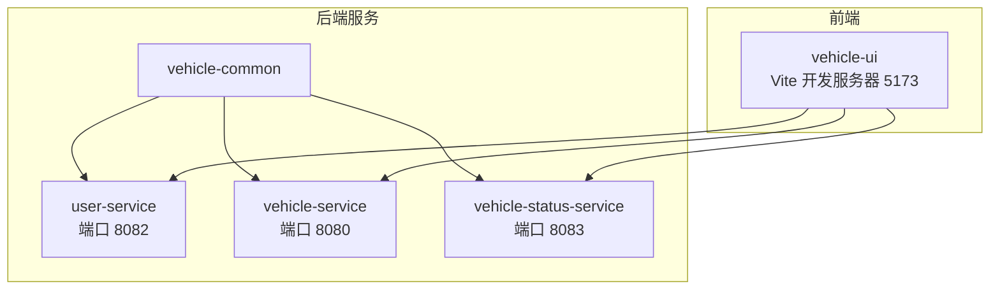
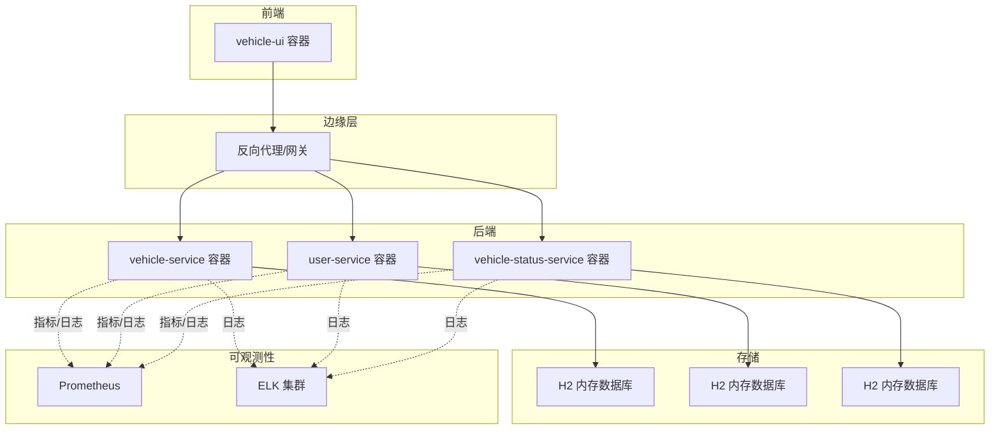
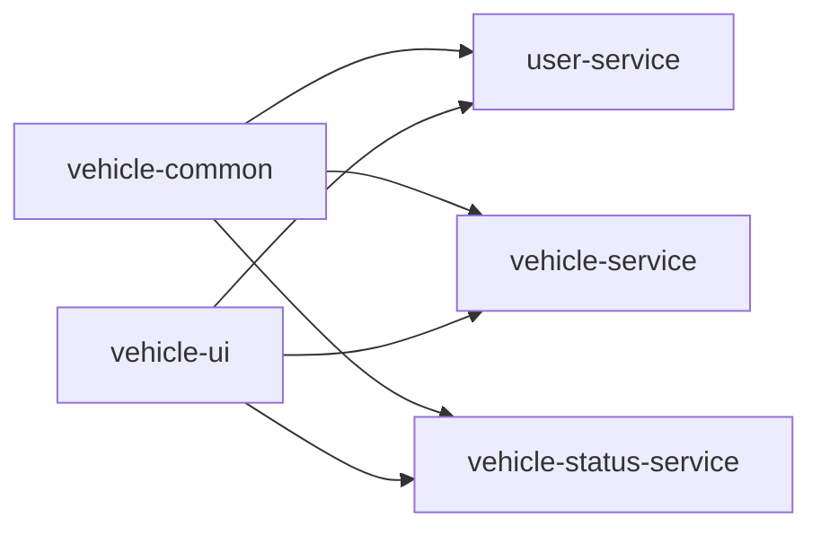

# 容器化部署

<cite>
**本文引用的文件**
- [pom.xml](file://pom.xml)
- [README.md](file://README.md)
- [user-service/pom.xml](file://user-service/pom.xml)
- [vehicle-service/pom.xml](file://vehicle-service/pom.xml)
- [vehicle-status-service/pom.xml](file://vehicle-status-service/pom.xml)
- [user-service/src/main/resources/application.yml](file://user-service/src/main/resources/application.yml)
- [vehicle-service/src/main/resources/application.yml](file://vehicle-service/src/main/resources/application.yml)
- [vehicle-status-service/src/main/resources/application.yml](file://vehicle-status-service/src/main/resources/application.yml)
- [user-service/src/main/java/com/wenjie/cloud/user/UserServiceApplication.java](file://user-service/src/main/java/com/wenjie/cloud/user/UserServiceApplication.java)
- [vehicle-service/src/main/java/com/wenjie/cloud/vehicle/VehicleServiceApplication.java](file://vehicle-service/src/main/java/com/wenjie/cloud/vehicle/VehicleServiceApplication.java)
- [vehicle-ui/package.json](file://vehicle-ui/package.json)
- [vehicle-ui/vite.config.js](file://vehicle-ui/vite.config.js)
- [vehicle-ui/.gitignore](file://vehicle-ui/.gitignore)
</cite>

## 目录
1. [简介](#简介)
2. [项目结构](#项目结构)
3. [核心组件](#核心组件)
4. [架构总览](#架构总览)
5. [详细组件分析](#详细组件分析)
6. [依赖分析](#依赖分析)
7. [性能考虑](#性能考虑)
8. [故障排查指南](#故障排查指南)
9. [结论](#结论)
10. [附录](#附录)

## 简介
本文件面向车联网云平台的容器化部署，基于当前仓库中的多模块Spring Boot后端与React前端工程，提供从Docker镜像构建、Compose编排、Kubernetes资源定义到CI/CD流水线与监控日志的完整实施建议。内容涵盖：
- Dockerfile编写规范：多阶段构建、镜像层优化、安全基线
- Docker Compose编排：服务依赖、网络与卷策略
- Kubernetes部署：Deployment、Service、ConfigMap、Secret
- CI/CD流水线：构建、测试、打包与部署
- 监控与日志：Prometheus指标暴露、ELK日志聚合

## 项目结构
项目为Maven多模块结构，包含公共模块与三个独立服务，以及一个React前端。后端服务均使用Spring Boot，前端使用Vite开发服务器。

图表来源
- [pom.xml:36-43](file://pom.xml#L36-L43)
- [vehicle-ui/vite.config.js:7-24](file://vehicle-ui/vite.config.js#L7-L24)

章节来源
- [README.md:19-27](file://README.md#L19-L27)
- [pom.xml:36-43](file://pom.xml#L36-L43)

## 核心组件
- user-service：用户管理，端口8082，使用H2内存数据库，开启H2控制台
- vehicle-service：车辆管理，端口8080，使用H2内存数据库，开启H2控制台
- vehicle-status-service：车辆状态上报，端口8083，使用H2内存数据库，开启H2控制台
- vehicle-common：公共模块，提供统一响应与异常处理
- vehicle-ui：React前端，Vite开发服务器，端口5173，代理/api/v1前缀到后端

章节来源
- [user-service/src/main/resources/application.yml:1-40](file://user-service/src/main/resources/application.yml#L1-L40)
- [vehicle-service/src/main/resources/application.yml:1-40](file://vehicle-service/src/main/resources/application.yml#L1-L40)
- [vehicle-status-service/src/main/resources/application.yml:1-30](file://vehicle-status-service/src/main/resources/application.yml#L1-L30)
- [vehicle-ui/vite.config.js:7-24](file://vehicle-ui/vite.config.js#L7-L24)

## 架构总览
下图展示容器化后的服务交互：前端通过反向代理或Service访问后端；后端服务各自连接H2内存数据库；Prometheus采集指标；ELK负责日志聚合。

图表来源
- [vehicle-ui/vite.config.js:7-24](file://vehicle-ui/vite.config.js#L7-L24)
- [user-service/src/main/resources/application.yml:1-40](file://user-service/src/main/resources/application.yml#L1-L40)
- [vehicle-service/src/main/resources/application.yml:1-40](file://vehicle-service/src/main/resources/application.yml#L1-L40)
- [vehicle-status-service/src/main/resources/application.yml:1-30](file://vehicle-status-service/src/main/resources/application.yml#L1-L30)

## 详细组件分析

### Dockerfile 编写规范
- 多阶段构建
  - 使用Maven插件生成可执行jar（参考父POM中spring-boot-maven-plugin配置），在构建阶段仅保留必要的依赖与编译产物
  - 在最终运行阶段仅复制生成的可执行jar到精简基础镜像（如官方OpenJDK镜像），避免携带构建工具与源码
- 镜像层优化
  - 将变更频率低的步骤（如复制依赖、解压）放在前面，变更频繁的步骤（如复制源码）放在后面
  - 使用.dockerignore排除不必要的文件（如node_modules、dist、日志、IDE目录），减少层大小
- 安全基线
  - 使用非root用户运行应用进程
  - 固定基础镜像版本，定期更新
  - 禁止在容器内安装未授权软件包
  - 限制容器能力（capabilities），最小权限原则
- 运行时参数
  - 设置JAVA_OPTS或JVM参数（如堆大小、GC策略、时区、语言环境）
  - 显式设置容器健康检查（HTTP/TCPSocket探针）

章节来源
- [pom.xml:94-116](file://pom.xml#L94-L116)
- [vehicle-ui/.gitignore:1-25](file://vehicle-ui/.gitignore#L1-L25)

### Docker Compose 编排配置
- 服务定义
  - 为每个后端服务定义独立服务，映射不同端口（8080、8082、8083），便于本地调试
  - 为前端服务定义开发服务器，映射端口5173，并配置代理规则指向对应后端服务
- 依赖关系
  - 使用depends_on确保后端服务在前端之前启动（注意：depends_on不保证服务完全就绪，建议配合健康检查）
- 网络配置
  - 使用自定义bridge网络，使服务间可通过服务名互相访问
- 卷挂载策略
  - 前端开发使用bind mount挂载源码目录，实现热更新
  - 后端服务使用匿名卷或绑定卷持久化日志与临时文件（生产环境建议使用命名卷）
- 环境变量与密钥
  - 使用.env文件或外部密钥管理（如Kubernetes Secret）注入敏感信息（数据库URL、密码、认证令牌）

章节来源
- [vehicle-ui/vite.config.js:7-24](file://vehicle-ui/vite.config.js#L7-L24)
- [user-service/src/main/resources/application.yml:1-40](file://user-service/src/main/resources/application.yml#L1-L40)
- [vehicle-service/src/main/resources/application.yml:1-40](file://vehicle-service/src/main/resources/application.yml#L1-L40)
- [vehicle-status-service/src/main/resources/application.yml:1-30](file://vehicle-status-service/src/main/resources/application.yml#L1-L30)

### Kubernetes 部署配置
- Deployment
  - 为每个服务创建Deployment，设置副本数、滚动更新策略、资源请求与限制
  - 使用initContainers进行数据库初始化（如需要）
- Service
  - 为每个服务创建ClusterIP或LoadBalancer类型的Service，暴露端口
- ConfigMap
  - 将application.yml中的非敏感配置放入ConfigMap（如日志级别、数据源URL占位符）
- Secret
  - 将数据库密码、第三方认证密钥放入Secret，以环境变量或挂载形式注入
- Pod 规格
  - 设置安全上下文（non-root用户、只读根文件系统）
  - 配置liveness/readiness探针，结合Spring Actuator健康端点
- Ingress/网关
  - 通过Ingress或API Gateway统一入口，配置TLS与路由规则

章节来源
- [user-service/src/main/resources/application.yml:1-40](file://user-service/src/main/resources/application.yml#L1-L40)
- [vehicle-service/src/main/resources/application.yml:1-40](file://vehicle-service/src/main/resources/application.yml#L1-L40)
- [vehicle-status-service/src/main/resources/application.yml:1-30](file://vehicle-status-service/src/main/resources/application.yml#L1-L30)

### CI/CD 流水线配置示例
- 触发条件
  - push到主分支、PR合并、tag推送
- 步骤
  - 代码检出与缓存
  - 依赖安装（Maven、npm）
  - 单元测试与集成测试
  - 打包可执行jar与前端静态资源
  - 构建镜像并推送到镜像仓库
  - 应用Kubernetes清单（或docker-compose up）
  - 可选：发布制品与通知
- 最佳实践
  - 分模块并行构建，缩短流水线时间
  - 使用容器化测试，确保环境一致性
  - 将镜像标签与Git SHA/版本关联
  - 对敏感信息使用受控的密钥管理

章节来源
- [pom.xml:94-116](file://pom.xml#L94-L116)
- [vehicle-ui/package.json:6-11](file://vehicle-ui/package.json#L6-L11)

### 容器监控与日志收集
- Prometheus 监控
  - 后端服务启用Spring Boot Actuator，暴露/metrics与/health端点
  - 配置Prometheus抓取任务，按服务维度拉取指标（JVM、HTTP请求、业务指标）
- 日志收集（ELK）
  - 后端服务输出结构化JSON日志（如使用Logback JSON格式）
  - 使用Filebeat/Fluent Bit采集容器标准输出，发送至Elasticsearch
  - Kibana可视化日志与指标
- 建议
  - 为每个Pod配置日志轮转与大小限制
  - 使用命名空间隔离不同环境的日志索引

章节来源
- [user-service/src/main/resources/application.yml:37-40](file://user-service/src/main/resources/application.yml#L37-L40)
- [vehicle-service/src/main/resources/application.yml:37-40](file://vehicle-service/src/main/resources/application.yml#L37-L40)
- [vehicle-status-service/src/main/resources/application.yml:27-30](file://vehicle-status-service/src/main/resources/application.yml#L27-L30)

## 依赖分析
- 模块依赖
  - user-service、vehicle-service、vehicle-status-service均依赖vehicle-common
  - 后端服务依赖Spring Web、Spring Data JPA、H2运行时依赖
- 外部依赖
  - 前端依赖React、Ant Design、Axios、Vite等
- 端口与服务发现
  - vehicle-service:8080、user-service:8082、vehicle-status-service:8083、vehicle-ui:5173
  - 前端通过Vite代理将/api/v1/*转发到对应后端

图表来源
- [pom.xml:48-53](file://pom.xml#L48-L53)
- [vehicle-ui/vite.config.js:9-22](file://vehicle-ui/vite.config.js#L9-L22)

章节来源
- [pom.xml:48-67](file://pom.xml#L48-L67)
- [vehicle-ui/vite.config.js:9-22](file://vehicle-ui/vite.config.js#L9-L22)

## 性能考虑
- 镜像体积
  - 使用多阶段构建，仅复制最终产物
  - 清理构建缓存与无用文件
- JVM调优
  - 设置合适的堆大小与GC策略，避免频繁Full GC
  - 启用JFR或Micrometer观测指标
- 数据库
  - 生产环境替换为持久化数据库（如PostgreSQL），并配置连接池
  - 合理设置DDL模式与SQL初始化策略
- 前端
  - 使用Vite生产构建，启用压缩与分包策略
  - CDN与缓存策略优化静态资源加载

## 故障排查指南
- 启动失败
  - 检查端口占用（8080/8082/8083/5173）
  - 查看容器日志，确认数据库连接与初始化是否成功
- 代理问题
  - 确认Vite代理配置正确，目标地址与端口匹配
- 健康检查
  - 在Kubernetes中查看Pod事件与日志，确认liveness/readiness探针返回正常
- 性能问题
  - 使用Prometheus查看JVM指标与HTTP请求耗时，定位瓶颈

章节来源
- [vehicle-ui/vite.config.js:7-24](file://vehicle-ui/vite.config.js#L7-L24)
- [user-service/src/main/resources/application.yml:1-40](file://user-service/src/main/resources/application.yml#L1-L40)
- [vehicle-service/src/main/resources/application.yml:1-40](file://vehicle-service/src/main/resources/application.yml#L1-L40)
- [vehicle-status-service/src/main/resources/application.yml:1-30](file://vehicle-status-service/src/main/resources/application.yml#L1-L30)

## 结论
本容器化方案以多阶段构建与精简运行时为基础，结合Compose与Kubernetes实现本地开发与生产部署的一致性。通过合理的网络与卷策略、安全基线与可观测性配置，能够满足车联网云平台的可维护性与可扩展性需求。建议在生产环境中进一步完善数据库持久化、密钥管理与网络策略。

## 附录
- 快速启动（本地）
  - 构建后端：在项目根目录执行Maven打包
  - 启动后端服务：分别在user-service与vehicle-service目录执行Spring Boot运行命令
  - 启动前端：在vehicle-ui目录安装依赖并运行开发服务器
- 端口与接口
  - vehicle-service：8080，提供车辆管理API
  - user-service：8082，提供用户管理API
  - vehicle-status-service：8083，提供状态上报API
  - vehicle-ui：5173，代理/api/v1前缀到上述服务

章节来源
- [README.md:56-84](file://README.md#L56-L84)
- [vehicle-ui/vite.config.js:7-24](file://vehicle-ui/vite.config.js#L7-L24)