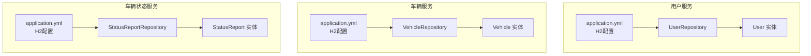
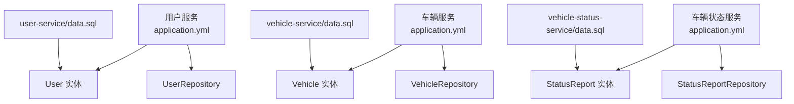
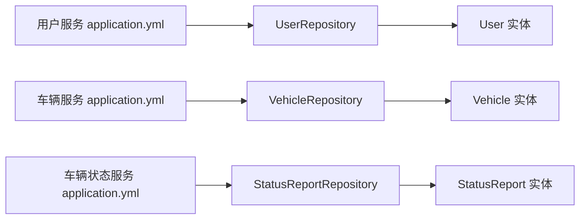

# 数据库管理

<cite>
**本文引用的文件**
- [application.yml（用户服务）](file://user-service/src/main/resources/application.yml)
- [application.yml（车辆服务）](file://vehicle-service/src/main/resources/application.yml)
- [application.yml（车辆状态服务）](file://vehicle-status-service/src/main/resources/application.yml)
- [User.java（用户实体）](file://user-service/src/main/java/com/wenjie/cloud/user/entity/User.java)
- [Vehicle.java（车辆实体）](file://vehicle-service/src/main/java/com/wenjie/cloud/vehicle/entity/Vehicle.java)
- [StatusReport.java（状态上报实体）](file://vehicle-status-service/src/main/java/com/wenjie/cloud/vehiclestatus/entity/StatusReport.java)
- [UserRepository.java（用户仓库）](file://user-service/src/main/java/com/wenjie/cloud/user/repository/UserRepository.java)
- [VehicleRepository.java（车辆仓库）](file://vehicle-service/src/main/java/com/wenjie/cloud/vehicle/repository/VehicleRepository.java)
- [StatusReportRepository.java（状态上报仓库）](file://vehicle-status-service/src/main/java/com/wenjie/cloud/vehiclestatus/repository/StatusReportRepository.java)
- [data.sql（用户初始化）](file://user-service/src/main/resources/data.sql)
- [data.sql（车辆初始化）](file://vehicle-service/src/main/resources/data.sql)
- [data.sql（状态上报初始化）](file://vehicle-status-service/src/main/resources/data.sql)
</cite>

## 目录
1. [简介](#简介)
2. [项目结构](#项目结构)
3. [核心组件](#核心组件)
4. [架构总览](#架构总览)
5. [详细组件分析](#详细组件分析)
6. [依赖分析](#依赖分析)
7. [性能考虑](#性能考虑)
8. [故障排查指南](#故障排查指南)
9. [结论](#结论)
10. [附录](#附录)

## 简介
本文件面向车联网云平台的数据库管理，基于当前代码库现状，提供从H2内存数据库配置与优化、SQL初始化、到数据库迁移（Flyway/Liquibase）与备份恢复策略的系统性方案。同时给出生产环境替换至MySQL/PostgreSQL的集成要点与最佳实践，帮助团队在开发、测试与生产环境中实现一致且可演进的数据管理能力。

## 项目结构
当前代码库采用多模块微服务结构，每个服务独立配置H2内存数据库，并通过JPA/Hibernate进行实体映射与数据初始化。数据库配置集中在各服务的资源目录中，实体定义位于对应模块的entity包内，数据访问层位于repository包内，业务逻辑位于service包内。

图表来源
- [application.yml（用户服务）:8-35](file://user-service/src/main/resources/application.yml#L8-L35)
- [application.yml（车辆服务）:8-35](file://vehicle-service/src/main/resources/application.yml#L8-L35)
- [application.yml（车辆状态服务）:7-26](file://vehicle-status-service/src/main/resources/application.yml#L7-L26)
- [User.java（用户实体）:16-37](file://user-service/src/main/java/com/wenjie/cloud/user/entity/User.java#L16-L37)
- [Vehicle.java（车辆实体）:16-41](file://vehicle-service/src/main/java/com/wenjie/cloud/vehicle/entity/Vehicle.java#L16-L41)
- [StatusReport.java（状态上报实体）:18-70](file://vehicle-status-service/src/main/java/com/wenjie/cloud/vehiclestatus/entity/StatusReport.java#L18-L70)

章节来源
- [application.yml（用户服务）:1-40](file://user-service/src/main/resources/application.yml#L1-L40)
- [application.yml（车辆服务）:1-40](file://vehicle-service/src/main/resources/application.yml#L1-L40)
- [application.yml（车辆状态服务）:1-30](file://vehicle-status-service/src/main/resources/application.yml#L1-L30)

## 核心组件
- 数据源与JPA配置：各服务均使用H2内存数据库，通过Spring Boot自动装配启用JPA/Hibernate，DDL自动生成策略为create-drop，SQL初始化模式为always。
- 实体模型：用户、车辆、状态上报三类实体分别定义了主键、字段约束与索引（状态上报包含复合索引），并提供预保存钩子设置创建时间。
- 数据访问层：基于Spring Data JPA接口，提供基础CRUD与条件查询方法，状态上报仓库包含按VIN与时间范围分页查询、最新记录查询等。
- 初始化脚本：各服务提供data.sql用于快速填充示例数据，便于本地开发与演示。

章节来源
- [application.yml（用户服务）:8-35](file://user-service/src/main/resources/application.yml#L8-L35)
- [application.yml（车辆服务）:8-35](file://vehicle-service/src/main/resources/application.yml#L8-L35)
- [application.yml（车辆状态服务）:7-26](file://vehicle-status-service/src/main/resources/application.yml#L7-L26)
- [User.java（用户实体）:16-37](file://user-service/src/main/java/com/wenjie/cloud/user/entity/User.java#L16-L37)
- [Vehicle.java（车辆实体）:16-41](file://vehicle-service/src/main/java/com/wenjie/cloud/vehicle/entity/Vehicle.java#L16-L41)
- [StatusReport.java（状态上报实体）:18-70](file://vehicle-status-service/src/main/java/com/wenjie/cloud/vehiclestatus/entity/StatusReport.java#L18-L70)
- [UserRepository.java（用户仓库）:11-22](file://user-service/src/main/java/com/wenjie/cloud/user/repository/UserRepository.java#L11-L22)
- [VehicleRepository.java（车辆仓库）:11-22](file://vehicle-service/src/main/java/com/wenjie/cloud/vehicle/repository/VehicleRepository.java#L11-L22)
- [StatusReportRepository.java（状态上报仓库）:16-38](file://vehicle-status-service/src/main/java/com/wenjie/cloud/vehiclestatus/repository/StatusReportRepository.java#L16-L38)
- [data.sql（用户初始化）:1-10](file://user-service/src/main/resources/data.sql#L1-L10)
- [data.sql（车辆初始化）:1-45](file://vehicle-service/src/main/resources/data.sql#L1-L45)
- [data.sql（状态上报初始化）:1-77](file://vehicle-status-service/src/main/resources/data.sql#L1-L77)

## 架构总览
下图展示了各服务的数据库配置与实体关系，以及初始化脚本的作用位置。

图表来源
- [application.yml（用户服务）:8-35](file://user-service/src/main/resources/application.yml#L8-L35)
- [application.yml（车辆服务）:8-35](file://vehicle-service/src/main/resources/application.yml#L8-L35)
- [application.yml（车辆状态服务）:7-26](file://vehicle-status-service/src/main/resources/application.yml#L7-L26)
- [User.java（用户实体）:16-37](file://user-service/src/main/java/com/wenjie/cloud/user/entity/User.java#L16-L37)
- [Vehicle.java（车辆实体）:16-41](file://vehicle-service/src/main/java/com/wenjie/cloud/vehicle/entity/Vehicle.java#L16-L41)
- [StatusReport.java（状态上报实体）:18-70](file://vehicle-status-service/src/main/java/com/wenjie/cloud/vehiclestatus/entity/StatusReport.java#L18-L70)
- [UserRepository.java（用户仓库）:11-22](file://user-service/src/main/java/com/wenjie/cloud/user/repository/UserRepository.java#L11-L22)
- [VehicleRepository.java（车辆仓库）:11-22](file://vehicle-service/src/main/java/com/wenjie/cloud/vehicle/repository/VehicleRepository.java#L11-L22)
- [StatusReportRepository.java（状态上报仓库）:16-38](file://vehicle-status-service/src/main/java/com/wenjie/cloud/vehiclestatus/repository/StatusReportRepository.java#L16-L38)
- [data.sql（用户初始化）:1-10](file://user-service/src/main/resources/data.sql#L1-L10)
- [data.sql（车辆初始化）:1-45](file://vehicle-service/src/main/resources/data.sql#L1-L45)
- [data.sql（状态上报初始化）:1-77](file://vehicle-status-service/src/main/resources/data.sql#L1-L77)

## 详细组件分析

### H2内存数据库配置与优化
- 连接参数：各服务使用H2内存数据库，驱动类名与URL分别为H2驱动与内存地址；用户名默认sa，密码为空。
- JPA/Hibernate：数据库平台方言为H2方言，DDL策略为create-drop，SQL输出开启，格式化SQL便于调试；延迟数据源初始化以配合SQL初始化。
- SQL初始化：初始化模式为always，确保每次启动都执行data.sql，便于快速复现数据。
- H2 Console：启用Console并指定路径，便于在浏览器中直接访问数据库控制台进行查询与调试。

优化建议
- 生产替换：内存数据库不适合生产，应替换为MySQL/PostgreSQL，保留相同JPA方言与DDL策略以便迁移。
- 连接池：引入HikariCP连接池，合理设置最大连接数、空闲超时、连接生命周期等参数，提升并发与稳定性。
- 日志与审计：生产环境关闭show-sql与格式化SQL，开启慢查询日志与SQL审计，便于性能分析与合规审计。
- 索引与分区：根据查询模式建立合适索引，必要时对大表进行分区，减少扫描范围。

章节来源
- [application.yml（用户服务）:8-35](file://user-service/src/main/resources/application.yml#L8-L35)
- [application.yml（车辆服务）:8-35](file://vehicle-service/src/main/resources/application.yml#L8-L35)
- [application.yml（车辆状态服务）:7-26](file://vehicle-status-service/src/main/resources/application.yml#L7-L26)

### 数据库迁移管理（Flyway/Liquibase）
- Flyway方案：在各服务模块中添加Flyway依赖，将数据库变更脚本置于resources/db/migration目录，命名采用V<版本>__<描述>.sql，通过Spring Boot自动执行迁移。
- Liquibase方案：在各服务模块中添加Liquibase依赖，配置changelog文件（如db.changelog-master.yaml），将变更拆分为多个变更集，支持回滚与条件执行。
- 版本控制：统一版本命名规范，变更脚本需经过评审并在发布分支中合并，避免破坏性变更。
- 回滚策略：优先采用“向前修复”（新增修正脚本）而非直接回滚，若必须回滚，先在测试环境验证，再在灰度环境逐步回滚。

章节来源
- [application.yml（用户服务）:8-35](file://user-service/src/main/resources/application.yml#L8-L35)
- [application.yml（车辆服务）:8-35](file://vehicle-service/src/main/resources/application.yml#L8-L35)
- [application.yml（车辆状态服务）:7-26](file://vehicle-status-service/src/main/resources/application.yml#L7-L26)

### 数据备份与恢复方案
- 全量备份：使用数据库自带工具导出SQL或二进制快照，建议在业务低峰期执行，备份后校验完整性与可恢复性。
- 增量备份：针对高频更新表，结合归档日志或CDC（变更数据捕获）实现增量备份，缩短RPO。
- 恢复测试：定期进行恢复演练，验证备份文件可用性与恢复时间目标（RTO），形成标准化操作手册。
- 多活与灾备：跨机房部署与读写分离，结合自动化切换机制，降低单点风险。

章节来源
- [application.yml（用户服务）:8-35](file://user-service/src/main/resources/application.yml#L8-L35)
- [application.yml（车辆服务）:8-35](file://vehicle-service/src/main/resources/application.yml#L8-L35)
- [application.yml（车辆状态服务）:7-26](file://vehicle-status-service/src/main/resources/application.yml#L7-L26)

### 数据库性能监控
- 慢查询分析：启用慢查询日志阈值，定位执行时间长、扫描行数多的SQL，结合执行计划优化索引与查询条件。
- 索引优化：根据查询模式建立单列/复合索引，定期评估索引使用率，删除冗余索引，平衡写入与查询性能。
- 连接池监控：监控活跃连接数、等待时间、超时次数，及时发现连接泄漏与资源瓶颈，调整连接池参数。
- 周期性维护：定期统计表大小、碎片率与锁等待，执行ANALYZE/REBUILD等维护操作，保持查询计划最优。

章节来源
- [application.yml（用户服务）:8-35](file://user-service/src/main/resources/application.yml#L8-L35)
- [application.yml（车辆服务）:8-35](file://vehicle-service/src/main/resources/application.yml#L8-L35)
- [application.yml（车辆状态服务）:7-26](file://vehicle-status-service/src/main/resources/application.yml#L7-L26)

### 生产环境数据库替换方案（MySQL/PostgreSQL）
- 配置替换：将H2内存数据库替换为MySQL/PostgreSQL，保留相同的JPA方言与DDL策略，确保迁移脚本兼容。
- 连接池与高可用：引入HikariCP，配置主从复制、读写分离与故障转移，提升可用性与扩展性。
- 安全加固：启用SSL连接、最小权限账户、审计日志与敏感信息加密，满足生产安全要求。
- 监控与告警：接入数据库监控平台，设置关键指标阈值与告警策略，保障线上稳定运行。

章节来源
- [application.yml（用户服务）:8-35](file://user-service/src/main/resources/application.yml#L8-L35)
- [application.yml（车辆服务）:8-35](file://vehicle-service/src/main/resources/application.yml#L8-L35)
- [application.yml（车辆状态服务）:7-26](file://vehicle-status-service/src/main/resources/application.yml#L7-L26)

## 依赖分析
各服务的数据库依赖主要来自Spring Data JPA与Hibernate，实体与仓库之间通过注解与方法签名建立清晰的依赖关系。初始化脚本与应用配置共同决定服务启动时的数据状态。

图表来源
- [UserRepository.java（用户仓库）:11-22](file://user-service/src/main/java/com/wenjie/cloud/user/repository/UserRepository.java#L11-L22)
- [VehicleRepository.java（车辆仓库）:11-22](file://vehicle-service/src/main/java/com/wenjie/cloud/vehicle/repository/VehicleRepository.java#L11-L22)
- [StatusReportRepository.java（状态上报仓库）:16-38](file://vehicle-status-service/src/main/java/com/wenjie/cloud/vehiclestatus/repository/StatusReportRepository.java#L16-L38)
- [User.java（用户实体）:16-37](file://user-service/src/main/java/com/wenjie/cloud/user/entity/User.java#L16-L37)
- [Vehicle.java（车辆实体）:16-41](file://vehicle-service/src/main/java/com/wenjie/cloud/vehicle/entity/Vehicle.java#L16-L41)
- [StatusReport.java（状态上报实体）:18-70](file://vehicle-status-service/src/main/java/com/wenjie/cloud/vehiclestatus/entity/StatusReport.java#L18-L70)
- [application.yml（用户服务）:8-35](file://user-service/src/main/resources/application.yml#L8-L35)
- [application.yml（车辆服务）:8-35](file://vehicle-service/src/main/resources/application.yml#L8-L35)
- [application.yml（车辆状态服务）:7-26](file://vehicle-status-service/src/main/resources/application.yml#L7-L26)

章节来源
- [UserRepository.java（用户仓库）:11-22](file://user-service/src/main/java/com/wenjie/cloud/user/repository/UserRepository.java#L11-L22)
- [VehicleRepository.java（车辆仓库）:11-22](file://vehicle-service/src/main/java/com/wenjie/cloud/vehicle/repository/VehicleRepository.java#L11-L22)
- [StatusReportRepository.java（状态上报仓库）:16-38](file://vehicle-status-service/src/main/java/com/wenjie/cloud/vehiclestatus/repository/StatusReportRepository.java#L16-L38)
- [User.java（用户实体）:16-37](file://user-service/src/main/java/com/wenjie/cloud/user/entity/User.java#L16-L37)
- [Vehicle.java（车辆实体）:16-41](file://vehicle-service/src/main/java/com/wenjie/cloud/vehicle/entity/Vehicle.java#L16-L41)
- [StatusReport.java（状态上报实体）:18-70](file://vehicle-status-service/src/main/java/com/wenjie/cloud/vehiclestatus/entity/StatusReport.java#L18-L70)
- [application.yml（用户服务）:8-35](file://user-service/src/main/resources/application.yml#L8-L35)
- [application.yml（车辆服务）:8-35](file://vehicle-service/src/main/resources/application.yml#L8-L35)
- [application.yml（车辆状态服务）:7-26](file://vehicle-status-service/src/main/resources/application.yml#L7-L26)

## 性能考虑
- H2内存数据库特性：适合开发与测试，但不具备持久化能力，生产必须替换为MySQL/PostgreSQL。
- 查询优化：利用实体定义中的索引（如状态上报的VIN+上报时间复合索引）与分页查询，避免全表扫描。
- 初始化脚本：SQL初始化仅适用于开发环境，生产环境应通过迁移脚本与受控流程加载数据。
- 连接池与事务：合理设置连接池大小与事务隔离级别，避免长时间持有锁导致阻塞。

章节来源
- [application.yml（用户服务）:8-35](file://user-service/src/main/resources/application.yml#L8-L35)
- [application.yml（车辆服务）:8-35](file://vehicle-service/src/main/resources/application.yml#L8-L35)
- [application.yml（车辆状态服务）:7-26](file://vehicle-status-service/src/main/resources/application.yml#L7-L26)
- [StatusReport.java（状态上报实体）:20-22](file://vehicle-status-service/src/main/java/com/wenjie/cloud/vehiclestatus/entity/StatusReport.java#L20-L22)
- [StatusReportRepository.java（状态上报仓库）:21-37](file://vehicle-status-service/src/main/java/com/wenjie/cloud/vehiclestatus/repository/StatusReportRepository.java#L21-L37)

## 故障排查指南
- 启动失败：检查H2 URL、驱动类名与用户名密码配置是否正确；确认DDL策略与SQL初始化模式符合预期。
- 数据未初始化：确认SQL初始化模式为always，data.sql路径与文件名正确，且SQL语法兼容H2。
- 查询异常：核对实体字段与表结构一致性，检查索引是否存在，必要时重建索引。
- 控制台访问：通过H2 Console路径进入数据库控制台，执行SQL验证数据与索引状态。

章节来源
- [application.yml（用户服务）:8-35](file://user-service/src/main/resources/application.yml#L8-L35)
- [application.yml（车辆服务）:8-35](file://vehicle-service/src/main/resources/application.yml#L8-L35)
- [application.yml（车辆状态服务）:7-26](file://vehicle-status-service/src/main/resources/application.yml#L7-L26)

## 结论
当前代码库以H2内存数据库为基础，为各服务提供了轻量级的开发与测试支撑。为满足生产需求，建议尽快完成数据库替换（MySQL/PostgreSQL）、引入Flyway/Liquibase进行迁移管理、建立完善的备份与恢复流程，并配套性能监控与告警体系。通过以上措施，可实现从开发到生产的平滑过渡与可持续演进。

## 附录
- 初始化脚本位置与用途
  - 用户服务：用于初始化用户示例数据
  - 车辆服务：用于初始化车辆示例数据（含VIN编码规则与归属关系）
  - 车辆状态服务：用于初始化状态上报示例数据（含电量、里程、经纬度等）

章节来源
- [data.sql（用户初始化）:1-10](file://user-service/src/main/resources/data.sql#L1-L10)
- [data.sql（车辆初始化）:1-45](file://vehicle-service/src/main/resources/data.sql#L1-L45)
- [data.sql（状态上报初始化）:1-77](file://vehicle-status-service/src/main/resources/data.sql#L1-L77)