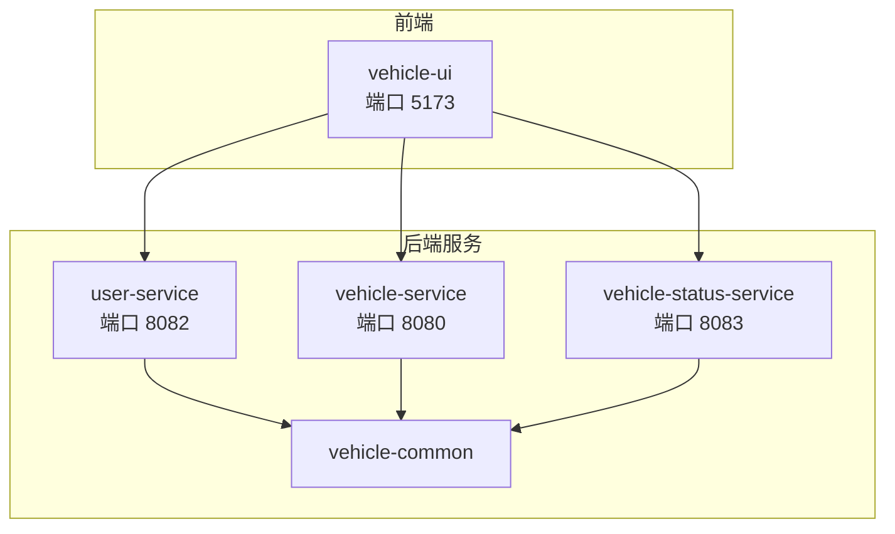
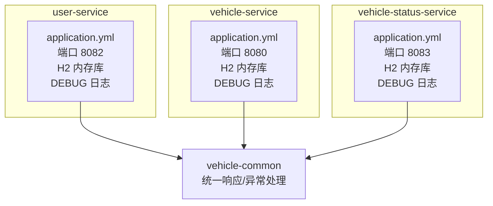
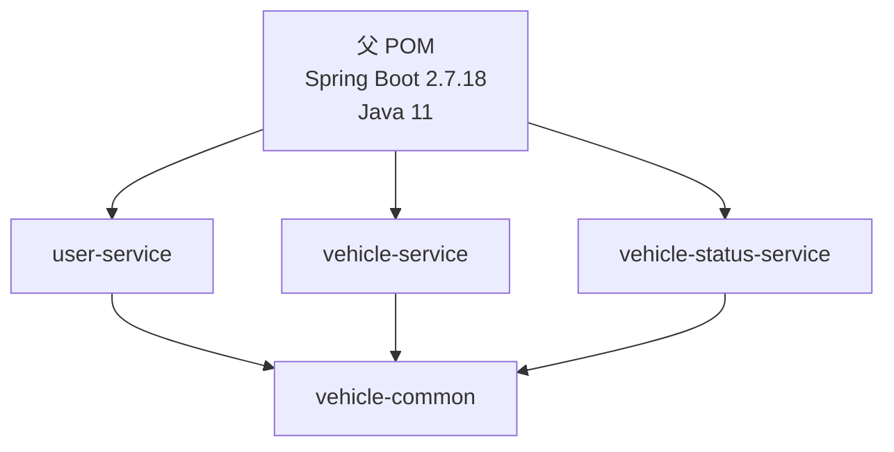

# 环境配置

<cite>
**本文引用的文件**
- [pom.xml](file://pom.xml)
- [README.md](file://README.md)
- [user-service/src/main/resources/application.yml](file://user-service/src/main/resources/application.yml)
- [vehicle-service/src/main/resources/application.yml](file://vehicle-service/src/main/resources/application.yml)
- [vehicle-status-service/src/main/resources/application.yml](file://vehicle-status-service/src/main/resources/application.yml)
- [user-service/src/main/java/com/wenjie/cloud/user/UserServiceApplication.java](file://user-service/src/main/java/com/wenjie/cloud/user/UserServiceApplication.java)
- [vehicle-service/src/main/java/com/wenjie/cloud/vehicle/VehicleServiceApplication.java](file://vehicle-service/src/main/java/com/wenjie/cloud/vehicle/VehicleServiceApplication.java)
- [vehicle-status-service/src/main/java/com/wenjie/cloud/vehiclestatus/VehicleStatusServiceApplication.java](file://vehicle-status-service/src/main/java/com/wenjie/cloud/vehiclestatus/VehicleStatusServiceApplication.java)
- [vehicle-common/src/main/java/com/wenjie/cloud/common/dto/ApiResponse.java](file://vehicle-common/src/main/java/com/wenjie/cloud/common/dto/ApiResponse.java)
- [vehicle-common/src/main/java/com/wenjie/cloud/common/exception/GlobalExceptionHandler.java](file://vehicle-common/src/main/java/com/wenjie/cloud/common/exception/GlobalExceptionHandler.java)
</cite>

## 目录
1. [简介](#简介)
2. [项目结构](#项目结构)
3. [核心组件](#核心组件)
4. [架构总览](#架构总览)
5. [详细组件分析](#详细组件分析)
6. [依赖分析](#依赖分析)
7. [性能考虑](#性能考虑)
8. [故障排查指南](#故障排查指南)
9. [结论](#结论)
10. [附录](#附录)

## 简介
本文件面向车联网云平台在不同环境下的配置与优化实践，覆盖开发、测试与生产环境的差异化配置要点，并结合当前仓库中各服务的配置现状，给出可落地的调优建议。内容涵盖：
- JVM 参数调优建议（堆内存大小、GC 策略、线程池配置）
- 数据库连接池配置（HikariCP 参数、连接超时、最大连接数）
- 日志级别设置与日志轮转策略
- application.yml 关键参数详解与调优建议（端口、数据库、缓存、安全等）

说明：当前仓库使用 H2 内存数据库进行演示，未包含生产级数据库连接池配置。本文在“生产环境”部分提供通用最佳实践与迁移建议，便于后续替换为真实数据库。

## 项目结构
该多模块工程采用 Spring Boot 2.7.18，Java 11，模块化组织如下：
- vehicle-common：公共模块，提供统一响应、异常处理等基础设施
- user-service：用户管理服务，默认端口 8082，使用 H2 内存库
- vehicle-service：车辆管理服务，默认端口 8080，使用 H2 内存库
- vehicle-status-service：车辆状态服务，默认端口 8083，使用 H2 内存库
- vehicle-ui：React 前端，通过 Vite 代理转发 API 请求

图表来源
- [README.md:19-27](file://README.md#L19-L27)
- [user-service/src/main/resources/application.yml:1-40](file://user-service/src/main/resources/application.yml#L1-L40)
- [vehicle-service/src/main/resources/application.yml:1-40](file://vehicle-service/src/main/resources/application.yml#L1-L40)
- [vehicle-status-service/src/main/resources/application.yml:1-30](file://vehicle-status-service/src/main/resources/application.yml#L1-L30)

章节来源
- [README.md:19-27](file://README.md#L19-L27)
- [pom.xml:36-43](file://pom.xml#L36-L43)

## 核心组件
- 统一响应与异常处理：由 vehicle-common 提供 ApiResponse 与 GlobalExceptionHandler，确保接口返回一致、异常处理统一。
- 应用启动类：各服务均通过 SpringBootApplication 注解扫描 com.wenjie.cloud 包路径，保证组件被正确注册。
- 配置文件：各服务的 application.yml 定义了端口、数据库、JPA、SQL 初始化、H2 控制台及日志级别等。

章节来源
- [vehicle-common/src/main/java/com/wenjie/cloud/common/dto/ApiResponse.java:1-52](file://vehicle-common/src/main/java/com/wenjie/cloud/common/dto/ApiResponse.java#L1-L52)
- [vehicle-common/src/main/java/com/wenjie/cloud/common/exception/GlobalExceptionHandler.java:1-56](file://vehicle-common/src/main/java/com/wenjie/cloud/common/exception/GlobalExceptionHandler.java#L1-L56)
- [user-service/src/main/java/com/wenjie/cloud/user/UserServiceApplication.java:9-15](file://user-service/src/main/java/com/wenjie/cloud/user/UserServiceApplication.java#L9-L15)
- [vehicle-service/src/main/java/com/wenjie/cloud/vehicle/VehicleServiceApplication.java:9-15](file://vehicle-service/src/main/java/com/wenjie/cloud/vehicle/VehicleServiceApplication.java#L9-L15)
- [vehicle-status-service/src/main/java/com/wenjie/cloud/vehiclestatus/VehicleStatusServiceApplication.java:9-15](file://vehicle-status-service/src/main/java/com/wenjie/cloud/vehiclestatus/VehicleStatusServiceApplication.java#L9-L15)

## 架构总览
下图展示服务间关系与配置要点（端口、数据库、日志）：

图表来源
- [user-service/src/main/resources/application.yml:1-40](file://user-service/src/main/resources/application.yml#L1-L40)
- [vehicle-service/src/main/resources/application.yml:1-40](file://vehicle-service/src/main/resources/application.yml#L1-L40)
- [vehicle-status-service/src/main/resources/application.yml:1-30](file://vehicle-status-service/src/main/resources/application.yml#L1-L30)
- [vehicle-common/src/main/java/com/wenjie/cloud/common/dto/ApiResponse.java:1-52](file://vehicle-common/src/main/java/com/wenjie/cloud/common/dto/ApiResponse.java#L1-L52)
- [vehicle-common/src/main/java/com/wenjie/cloud/common/exception/GlobalExceptionHandler.java:1-56](file://vehicle-common/src/main/java/com/wenjie/cloud/common/exception/GlobalExceptionHandler.java#L1-L56)

## 详细组件分析

### 开发环境配置
- 端口与服务分离：三个服务分别使用不同端口，避免冲突；前端通过 Vite 代理转发请求。
- 数据库：使用 H2 内存库，启动即初始化，便于本地快速验证。
- 日志：设置为 DEBUG 级别，便于问题定位。
- H2 控制台：开启控制台以便查看表结构与数据。

建议与注意事项
- 端口：如需在同一主机运行多个实例，请修改端口或使用容器编排。
- 数据库：H2 内存库重启即清空，适合短期开发；如需持久化，建议切换至 MySQL/PostgreSQL 并配置连接池。
- 日志：开发阶段 DEBUG 可接受，但注意磁盘占用与性能影响。

章节来源
- [user-service/src/main/resources/application.yml:1-40](file://user-service/src/main/resources/application.yml#L1-L40)
- [vehicle-service/src/main/resources/application.yml:1-40](file://vehicle-service/src/main/resources/application.yml#L1-L40)
- [vehicle-status-service/src/main/resources/application.yml:1-30](file://vehicle-status-service/src/main/resources/application.yml#L1-L30)
- [README.md:64-84](file://README.md#L64-L84)

### 测试环境配置
- 数据库：建议使用与生产一致的数据库类型（MySQL/PostgreSQL），并启用连接池。
- 连接池：推荐 HikariCP，设置合理的连接超时、最大连接数与最小空闲连接数。
- 日志：INFO 或 WARN 级别，避免过多调试信息影响性能。
- 健康检查与监控：启用 Actuator 端点，便于 CI/CD 自动化部署与健康检查。

章节来源
- [pom.xml:46-67](file://pom.xml#L46-L67)

### 生产环境配置
- 数据库：使用 MySQL/PostgreSQL，配置连接池参数（最大连接数、连接超时、空闲回收等）。
- JVM：根据业务吞吐与延迟目标选择合适的 GC 策略与堆大小；线程池大小与队列长度需结合 CPU 核心数与 IO 特性调优。
- 日志：生产环境建议使用异步日志与滚动策略，避免阻塞主线程与磁盘爆满。
- 安全：启用 HTTPS、限流、鉴权与审计日志；敏感配置通过密钥管理服务注入。

章节来源
- [pom.xml:46-67](file://pom.xml#L46-L67)

### application.yml 参数详解与调优建议

#### server
- 端口：用于定义服务监听端口，避免冲突。
- 建议：开发环境可自定义端口；测试/生产环境通过环境变量注入，便于容器化部署。

章节来源
- [user-service/src/main/resources/application.yml:1-2](file://user-service/src/main/resources/application.yml#L1-L2)
- [vehicle-service/src/main/resources/application.yml:1-2](file://vehicle-service/src/main/resources/application.yml#L1-L2)
- [vehicle-status-service/src/main/resources/application.yml:1-2](file://vehicle-status-service/src/main/resources/application.yml#L1-L2)

#### spring.application.name
- 作用：标识服务名称，便于日志聚合与监控。
- 建议：与服务模块名保持一致，避免重复。

章节来源
- [user-service/src/main/resources/application.yml:5-6](file://user-service/src/main/resources/application.yml#L5-L6)
- [vehicle-service/src/main/resources/application.yml:5-6](file://vehicle-service/src/main/resources/application.yml#L5-L6)
- [vehicle-status-service/src/main/resources/application.yml:5](file://vehicle-status-service/src/main/resources/application.yml#L5)

#### spring.datasource
- 当前配置：H2 内存库，JDBC URL、驱动、用户名与密码。
- 建议（生产）：替换为 MySQL/PostgreSQL，启用 HikariCP 连接池，设置连接超时、最大连接数、最小空闲连接数、连接泄漏检测等。

章节来源
- [user-service/src/main/resources/application.yml:9-13](file://user-service/src/main/resources/application.yml#L9-L13)
- [vehicle-service/src/main/resources/application.yml:9-13](file://vehicle-service/src/main/resources/application.yml#L9-L13)
- [vehicle-status-service/src/main/resources/application.yml:7-11](file://vehicle-status-service/src/main/resources/application.yml#L7-L11)

#### spring.jpa
- 当前配置：H2 方言、DDL 自动建表/删表、SQL 输出、延迟初始化、SQL 初始化模式。
- 建议（生产）：禁用 DDL 自动建表；使用 Flyway/Liquibase 管理迁移；开启 SQL 格式化与慢查询日志。

章节来源
- [user-service/src/main/resources/application.yml:16-24](file://user-service/src/main/resources/application.yml#L16-L24)
- [vehicle-service/src/main/resources/application.yml:16-24](file://vehicle-service/src/main/resources/application.yml#L16-L24)
- [vehicle-status-service/src/main/resources/application.yml:16-23](file://vehicle-status-service/src/main/resources/application.yml#L16-L23)

#### spring.sql.init
- 当前配置：初始化模式为 always。
- 建议（生产）：改为 schema-*.sql 与 data-*.sql 分离，避免重复初始化。

章节来源
- [user-service/src/main/resources/application.yml:27-29](file://user-service/src/main/resources/application.yml#L27-L29)
- [vehicle-service/src/main/resources/application.yml:27-29](file://vehicle-service/src/main/resources/application.yml#L27-L29)
- [vehicle-status-service/src/main/resources/application.yml:24-26](file://vehicle-status-service/src/main/resources/application.yml#L24-L26)

#### spring.h2.console
- 当前配置：H2 控制台启用，路径为 /h2-console。
- 建议（生产）：关闭控制台，仅在开发/测试环境启用。

章节来源
- [user-service/src/main/resources/application.yml:32-35](file://user-service/src/main/resources/application.yml#L32-L35)
- [vehicle-service/src/main/resources/application.yml:32-35](file://vehicle-service/src/main/resources/application.yml#L32-L35)
- [vehicle-status-service/src/main/resources/application.yml:12-15](file://vehicle-status-service/src/main/resources/application.yml#L12-L15)

#### logging.level
- 当前配置：com.wenjie.cloud 设置为 DEBUG。
- 建议（生产）：调整为 INFO/WARN，配合异步日志与滚动策略。

章节来源
- [user-service/src/main/resources/application.yml:37-40](file://user-service/src/main/resources/application.yml#L37-L40)
- [vehicle-service/src/main/resources/application.yml:37-40](file://vehicle-service/src/main/resources/application.yml#L37-L40)
- [vehicle-status-service/src/main/resources/application.yml:29](file://vehicle-status-service/src/main/resources/application.yml#L29)

#### Jackson（vehicle-status-service）
- 当前配置：日期序列化为时间戳开关关闭。
- 建议：根据前后端约定统一时间格式，避免跨语言解析差异。

章节来源
- [vehicle-status-service/src/main/resources/application.yml:27-29](file://vehicle-status-service/src/main/resources/application.yml#L27-L29)

## 依赖分析
- 父 POM 统一管理 Spring Boot 版本、Java 版本与常用依赖（Lombok、MapStruct、测试框架）。
- 各服务依赖 vehicle-common，实现统一响应与异常处理。
- 数据访问层依赖 Spring Data JPA 与 H2，便于演示。

图表来源
- [pom.xml:8-14](file://pom.xml#L8-L14)
- [pom.xml:36-43](file://pom.xml#L36-L43)
- [user-service/pom.xml:18-48](file://user-service/pom.xml#L18-L48)
- [vehicle-service/pom.xml:18-48](file://vehicle-service/pom.xml#L18-L48)
- [vehicle-status-service/pom.xml:18-48](file://vehicle-status-service/pom.xml#L18-L48)

章节来源
- [pom.xml:25-34](file://pom.xml#L25-L34)
- [pom.xml:46-91](file://pom.xml#L46-L91)

## 性能考虑
- JVM 参数调优（通用建议）
  - 堆内存：初始堆与最大堆按 1:2~1:4 配置，预留 20%~30% 空余以降低 Full GC 风险。
  - GC 策略：生产环境优先考虑 G1GC 或 ZGC（低延迟场景），合理设置新生代比例与晋升阈值。
  - 线程池：IO 密集型服务线程数 ≈ CPU 核心数 × (1 + 平均等待时间/平均工作时间)，并设置有界队列与拒绝策略。
- 数据库连接池（HikariCP，通用建议）
  - 最大连接数：建议与业务峰值并发接近，避免过度连接导致资源争用。
  - 连接超时：连接获取超时与连接生命周期需与业务超时策略匹配。
  - 最小空闲连接：维持少量空闲连接以降低热启动延迟。
  - 连接泄漏检测：开启检测并在日志中记录可疑连接。
- 日志性能
  - 异步日志：使用 AsyncAppender，避免同步 I/O 阻塞请求线程。
  - 滚动策略：按大小与时间滚动，保留必要天数的日志，定期清理过期日志。
  - 日志级别：生产环境避免 DEBUG，必要时使用 TRACE 并限制范围。

[本节为通用指导，不直接分析具体文件]

## 故障排查指南
- 统一异常处理
  - 全局异常处理器拦截业务异常、参数校验异常与未知异常，统一返回 ApiResponse 格式，便于前端与监控系统消费。
- 日志级别
  - 开发环境 DEBUG 有助于定位问题；生产环境建议提升到 INFO/WARN，减少日志体积。
- H2 控制台
  - 开发/测试环境可使用 H2 控制台查看表结构与数据；生产环境务必关闭。

章节来源
- [vehicle-common/src/main/java/com/wenjie/cloud/common/exception/GlobalExceptionHandler.java:26-54](file://vehicle-common/src/main/java/com/wenjie/cloud/common/exception/GlobalExceptionHandler.java#L26-L54)
- [user-service/src/main/resources/application.yml:37-40](file://user-service/src/main/resources/application.yml#L37-L40)
- [vehicle-service/src/main/resources/application.yml:37-40](file://vehicle-service/src/main/resources/application.yml#L37-L40)
- [vehicle-status-service/src/main/resources/application.yml:12-15](file://vehicle-status-service/src/main/resources/application.yml#L12-L15)

## 结论
- 当前仓库以 H2 内存库与简单配置适配开发与演示需求。
- 迁移至测试/生产环境时，应重点完善数据库连接池、JVM 参数、日志策略与安全配置。
- 通过模块化与统一异常处理，平台具备良好的扩展性与可观测性基础。

[本节为总结，不直接分析具体文件]

## 附录

### A. 端口与服务映射
- user-service：端口 8082
- vehicle-service：端口 8080
- vehicle-status-service：端口 8083
- vehicle-ui：端口 5173（通过 Vite 代理转发）

章节来源
- [user-service/src/main/resources/application.yml:1-2](file://user-service/src/main/resources/application.yml#L1-L2)
- [vehicle-service/src/main/resources/application.yml:1-2](file://vehicle-service/src/main/resources/application.yml#L1-L2)
- [vehicle-status-service/src/main/resources/application.yml:1-2](file://vehicle-status-service/src/main/resources/application.yml#L1-L2)
- [README.md:64-84](file://README.md#L64-L84)

### B. 数据库与连接池（生产建议）
- 数据库：MySQL/PostgreSQL
- 连接池：HikariCP
  - 关键参数：maximumPoolSize、connectionTimeout、idleTimeout、leakDetectionThreshold、minimumIdle
  - 初始化策略：使用 Flyway/Liquibase 管理迁移脚本
- 连接字符串：通过环境变量注入，避免硬编码

章节来源
- [pom.xml:46-67](file://pom.xml#L46-L67)

### C. 日志级别与轮转（生产建议）
- 级别：INFO/WARN（必要时使用 TRACE 并限定范围）
- 轮转：按大小与时间滚动，保留 7~30 天日志
- 异步：使用异步 Appender，避免阻塞请求线程

章节来源
- [user-service/src/main/resources/application.yml:37-40](file://user-service/src/main/resources/application.yml#L37-L40)
- [vehicle-service/src/main/resources/application.yml:37-40](file://vehicle-service/src/main/resources/application.yml#L37-L40)
- [vehicle-status-service/src/main/resources/application.yml:29](file://vehicle-status-service/src/main/resources/application.yml#L29)

### D. 安全与监控（生产建议）
- 安全：启用 HTTPS、限流、鉴权与审计日志
- 监控：启用 Actuator 端点，集成 Prometheus/Grafana
- 配置注入：使用密钥管理服务注入敏感配置

章节来源
- [pom.xml:46-67](file://pom.xml#L46-L67)