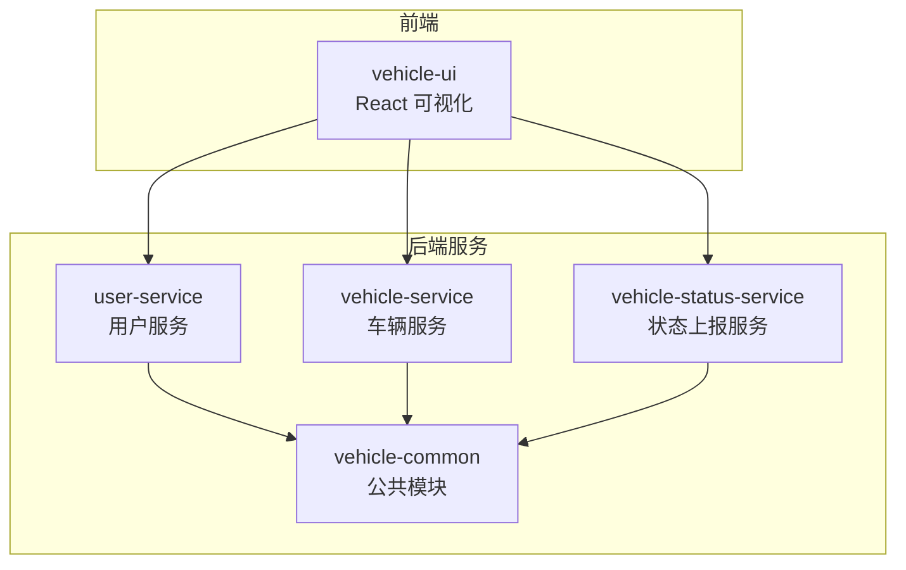
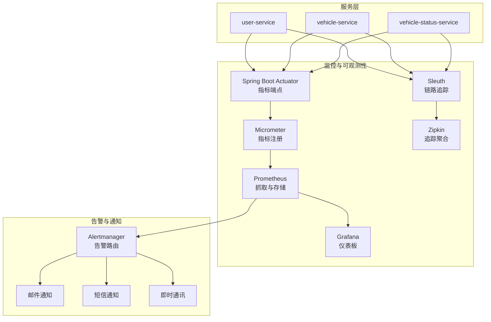
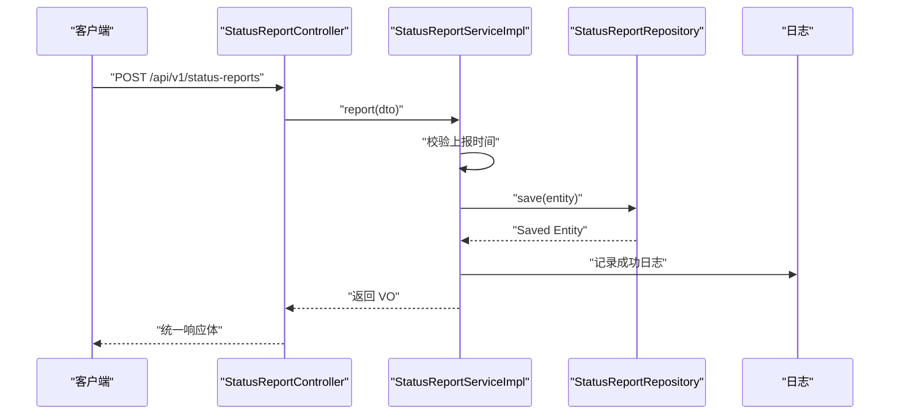
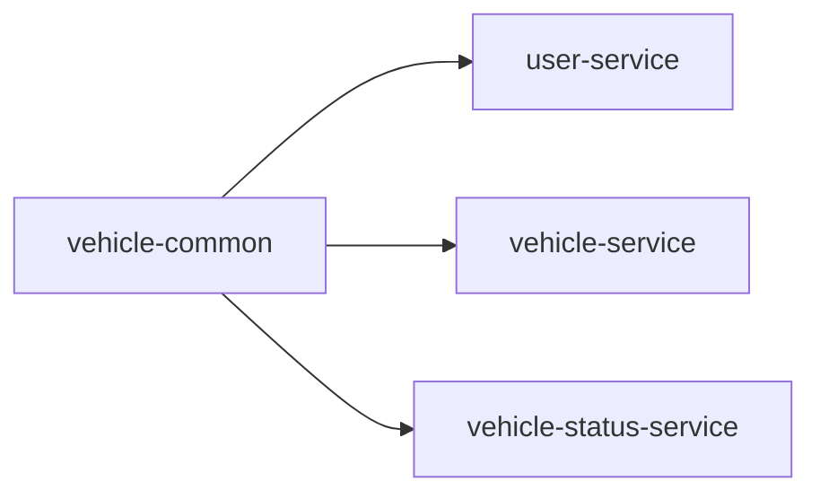
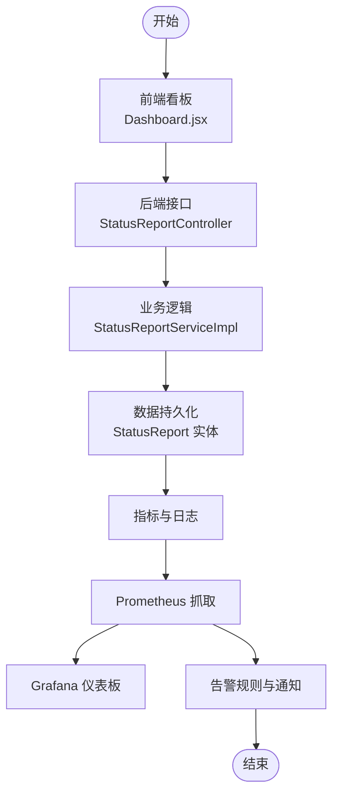

# 监控告警

<cite>
**本文引用的文件**   
- [pom.xml](file://pom.xml)
- [user-service/pom.xml](file://user-service/pom.xml)
- [vehicle-service/pom.xml](file://vehicle-service/pom.xml)
- [vehicle-status-service/pom.xml](file://vehicle-status-service/pom.xml)
- [user-service/src/main/resources/application.yml](file://user-service/src/main/resources/application.yml)
- [vehicle-service/src/main/resources/application.yml](file://vehicle-service/src/main/resources/application.yml)
- [vehicle-status-service/src/main/resources/application.yml](file://vehicle-status-service/src/main/resources/application.yml)
- [vehicle-common/src/main/java/com/wenjie/cloud/common/dto/ApiResponse.java](file://vehicle-common/src/main/java/com/wenjie/cloud/common/dto/ApiResponse.java)
- [vehicle-common/src/main/java/com/wenjie/cloud/common/exception/GlobalExceptionHandler.java](file://vehicle-common/src/main/java/com/wenjie/cloud/common/exception/GlobalExceptionHandler.java)
- [vehicle-common/src/main/java/com/wenjie/cloud/common/exception/BusinessException.java](file://vehicle-common/src/main/java/com/wenjie/cloud/common/exception/BusinessException.java)
- [vehicle-status-service/src/main/java/com/wenjie/cloud/vehiclestatus/VehicleStatusServiceApplication.java](file://vehicle-status-service/src/main/java/com/wenjie/cloud/vehiclestatus/VehicleStatusServiceApplication.java)
- [vehicle-status-service/src/main/java/com/wenjie/cloud/vehiclestatus/controller/StatusReportController.java](file://vehicle-status-service/src/main/java/com/wenjie/cloud/vehiclestatus/controller/StatusReportController.java)
- [vehicle-status-service/src/main/java/com/wenjie/cloud/vehiclestatus/service/impl/StatusReportServiceImpl.java](file://vehicle-status-service/src/main/java/com/wenjie/cloud/vehiclestatus/service/impl/StatusReportServiceImpl.java)
- [vehicle-status-service/src/main/java/com/wenjie/cloud/vehiclestatus/entity/StatusReport.java](file://vehicle-status-service/src/main/java/com/wenjie/cloud/vehiclestatus/entity/StatusReport.java)
- [vehicle-status-service/src/main/java/com/wenjie/cloud/vehiclestatus/dto/StatusReportDTO.java](file://vehicle-status-service/src/main/java/com/wenjie/cloud/vehiclestatus/dto/StatusReportDTO.java)
- [vehicle-status-service/src/main/java/com/wenjie/cloud/vehiclestatus/dto/StatusReportVO.java](file://vehicle-status-service/src/main/java/com/wenjie/cloud/vehiclestatus/dto/StatusReportVO.java)
- [vehicle-status-service/src/main/resources/data.sql](file://vehicle-status-service/src/main/resources/data.sql)
- [vehicle-ui/src/pages/Dashboard.jsx](file://vehicle-ui/src/pages/Dashboard.jsx)
- [vehicle-ui/src/pages/VehicleStatus.jsx](file://vehicle-ui/src/pages/VehicleStatus.jsx)
</cite>

## 目录
1. [简介](#简介)
2. [项目结构](#项目结构)
3. [核心组件](#核心组件)
4. [架构总览](#架构总览)
5. [详细组件分析](#详细组件分析)
6. [依赖分析](#依赖分析)
7. [性能考虑](#性能考虑)
8. [故障排查指南](#故障排查指南)
9. [结论](#结论)
10. [附录](#附录)

## 简介
本文件面向车联网云平台的监控与告警体系建设，目标是基于现有代码库，构建一套完整的应用性能监控（APM）、业务指标监控、告警规则与通知、以及可观测性（Prometheus+Grafana）与分布式链路追踪（Sleuth+Zipkin）方案。当前仓库以 Spring Boot 微服务为主，包含用户、车辆与状态上报三个服务，并在前端提供了基础的可视化看板。本文将结合现有代码与通用最佳实践，给出可落地的监控与告警配置建议。

## 项目结构
项目采用多模块 Maven 结构，包含公共模块与三个微服务模块；前端使用 React + Ant Design。服务之间通过 REST 接口交互，状态上报服务提供车辆状态数据的采集与存储。

图表来源
- [pom.xml:36-43](file://pom.xml#L36-L43)
- [user-service/pom.xml:18-23](file://user-service/pom.xml#L18-L23)
- [vehicle-service/pom.xml:18-23](file://vehicle-service/pom.xml#L18-L23)
- [vehicle-status-service/pom.xml:18-23](file://vehicle-status-service/pom.xml#L18-L23)

章节来源
- [pom.xml:36-43](file://pom.xml#L36-L43)
- [user-service/pom.xml:18-23](file://user-service/pom.xml#L18-L23)
- [vehicle-service/pom.xml:18-23](file://vehicle-service/pom.xml#L18-L23)
- [vehicle-status-service/pom.xml:18-23](file://vehicle-status-service/pom.xml#L18-L23)

## 核心组件
- 统一响应封装与异常处理：公共模块提供统一响应体与全局异常处理，便于监控侧统一采集错误事件与异常指标。
- 状态上报服务：提供 REST 接口接收车辆状态上报，包含数据校验、入库与日志记录，是业务指标采集的核心入口。
- 前端看板：提供车辆总数、用户总数、平均电量、低电量车辆等关键指标的可视化展示，便于运营与运维观察。

章节来源
- [vehicle-common/src/main/java/com/wenjie/cloud/common/dto/ApiResponse.java:12-51](file://vehicle-common/src/main/java/com/wenjie/cloud/common/dto/ApiResponse.java#L12-L51)
- [vehicle-common/src/main/java/com/wenjie/cloud/common/exception/GlobalExceptionHandler.java:19-55](file://vehicle-common/src/main/java/com/wenjie/cloud/common/exception/GlobalExceptionHandler.java#L19-L55)
- [vehicle-status-service/src/main/java/com/wenjie/cloud/vehiclestatus/controller/StatusReportController.java:26-39](file://vehicle-status-service/src/main/java/com/wenjie/cloud/vehiclestatus/controller/StatusReportController.java#L26-L39)
- [vehicle-ui/src/pages/Dashboard.jsx:14-139](file://vehicle-ui/src/pages/Dashboard.jsx#L14-L139)

## 架构总览
下图展示了监控与告警在系统中的位置与交互关系：各服务通过 Spring Boot Actuator 暴露指标，Prometheus 拉取指标，Grafana 进行可视化；异常与业务事件通过日志与指标暴露；链路追踪通过 Sleuth 生成 Span，发送至 Zipkin。

（本图为概念性架构示意，不直接映射具体源码文件）

## 详细组件分析

### 应用性能监控（APM）与 Actuator 配置
- 启用 Actuator 端点：在各服务的依赖中增加 Spring Boot Actuator，以便暴露健康检查、指标端点与线程池、HTTP 请求等运行时信息。
- 健康检查：启用默认健康指示器，结合自定义健康检查扩展（如数据库、外部服务可用性），并通过 /actuator/health 对外暴露。
- 指标采集：启用 Micrometer，结合 Prometheus 抓取端点 /actuator/prometheus，采集 JVM、HTTP 请求、业务计数器等指标。
- 安全与限流：生产环境建议限制对 /actuator/* 的访问，仅允许内网或特定网段访问；必要时开启基本认证或 API 网关鉴权。

（本节为通用配置说明，未直接分析具体源码文件）

### 业务指标监控方案
- 用户活跃度：可通过用户服务的用户列表接口调用次数、新增用户数、登录行为等作为活跃度指标；也可在前端看板中统计“最近登录”等行为。
- 车辆在线率：以状态上报服务的上报速率与总量计算在线率；例如单位时间内上报条数占总车辆数的比例。
- 状态上报频率：统计每分钟/每小时上报请求数、平均响应时间、成功率；异常请求占比作为质量指标。
- 关键指标采集点：
  - 状态上报接口：POST /api/v1/status-reports
  - 统一异常处理：捕获业务异常与参数校验异常，用于告警与趋势分析
  - 日志埋点：在服务关键路径（如入库前校验、保存成功）输出结构化日志，便于日志型监控（如 ELK/Loki）

章节来源
- [vehicle-status-service/src/main/java/com/wenjie/cloud/vehiclestatus/controller/StatusReportController.java:36-39](file://vehicle-status-service/src/main/java/com/wenjie/cloud/vehiclestatus/controller/StatusReportController.java#L36-L39)
- [vehicle-common/src/main/java/com/wenjie/cloud/common/exception/GlobalExceptionHandler.java:26-54](file://vehicle-common/src/main/java/com/wenjie/cloud/common/exception/GlobalExceptionHandler.java#L26-L54)

### 告警规则配置
- 阈值设置：
  - 状态上报成功率低于阈值（如 95%）
  - 平均响应时间超过阈值（如 500ms）
  - 异常请求占比超过阈值（如 1%）
  - 低电量车辆比例超过阈值（如 10%）
- 告警级别：P0（核心业务中断）、P1（严重）、P2（一般）、P3（提示）
- 通知渠道：邮件、短信、IM（企业微信/钉钉/飞书），并区分不同级别与场景
- 告警收敛：同一线索在一定周期内去重合并，避免风暴

（本节为通用配置说明，未直接分析具体源码文件）

### Prometheus + Grafana 监控面板
- 指标来源：各服务 /actuator/prometheus 暴露的指标，包括 http_server_requests_seconds、jvm_threads_live、logback_events_total 等
- 面板设计建议：
  - 服务健康：CPU、内存、GC、线程池使用率
  - 业务指标：上报速率、成功率、平均耗时、异常率
  - 运行时指标：JVM 堆内存、GC 次数与耗时、打开文件句柄数
- 预置模板：可基于官方模板进行二次开发，覆盖“服务拓扑”、“业务看板”、“异常追踪”三大主题

（本节为通用配置说明，未直接分析具体源码文件）

### 分布式链路追踪（Sleuth + Zipkin）
- Sleuth 集成：在各服务引入 spring-cloud-starter-sleuth，自动为 HTTP 调用生成 TraceId 与 SpanId
- Zipkin 配置：部署 Zipkin Server，服务端通过 HTTP 发送数据；或使用消息队列/OTLP 等方式传输
- 使用建议：在跨服务调用链路中查看延迟、错误与慢调用，定位性能瓶颈与故障根因

（本节为通用配置说明，未直接分析具体源码文件）

### 现有代码中的监控相关要点
- 统一响应与异常处理：全局异常处理器将业务异常与参数校验异常统一返回，便于监控侧识别错误模式与趋势。
- 状态上报流程：控制器接收请求、服务层进行时间校验与入库、日志记录成功信息，形成可观测的关键路径。
- 前端看板：Dashboard 页面聚合了车辆、用户、电量等指标，可作为业务监控的入口。

图表来源
- [vehicle-status-service/src/main/java/com/wenjie/cloud/vehiclestatus/controller/StatusReportController.java:36-39](file://vehicle-status-service/src/main/java/com/wenjie/cloud/vehiclestatus/controller/StatusReportController.java#L36-L39)
- [vehicle-status-service/src/main/java/com/wenjie/cloud/vehiclestatus/service/impl/StatusReportServiceImpl.java:30-41](file://vehicle-status-service/src/main/java/com/wenjie/cloud/vehiclestatus/service/impl/StatusReportServiceImpl.java#L30-L41)

章节来源
- [vehicle-common/src/main/java/com/wenjie/cloud/common/dto/ApiResponse.java:12-51](file://vehicle-common/src/main/java/com/wenjie/cloud/common/dto/ApiResponse.java#L12-L51)
- [vehicle-common/src/main/java/com/wenjie/cloud/common/exception/GlobalExceptionHandler.java:26-54](file://vehicle-common/src/main/java/com/wenjie/cloud/common/exception/GlobalExceptionHandler.java#L26-L54)
- [vehicle-status-service/src/main/java/com/wenjie/cloud/vehiclestatus/controller/StatusReportController.java:36-39](file://vehicle-status-service/src/main/java/com/wenjie/cloud/vehiclestatus/controller/StatusReportController.java#L36-L39)
- [vehicle-status-service/src/main/java/com/wenjie/cloud/vehiclestatus/service/impl/StatusReportServiceImpl.java:30-41](file://vehicle-status-service/src/main/java/com/wenjie/cloud/vehiclestatus/service/impl/StatusReportServiceImpl.java#L30-L41)

## 依赖分析
- 服务间依赖：各服务依赖 vehicle-common 提供的统一响应与异常处理能力。
- 数据持久化：各服务使用 H2 内存数据库进行演示，实际生产建议替换为 MySQL/PostgreSQL 并开启备份与高可用。
- 前端依赖：React + Ant Design，通过 API 与后端交互，前端可扩展更多监控可视化组件。

图表来源
- [pom.xml:48-53](file://pom.xml#L48-L53)
- [user-service/pom.xml:19-23](file://user-service/pom.xml#L19-L23)
- [vehicle-service/pom.xml:19-23](file://vehicle-service/pom.xml#L19-L23)
- [vehicle-status-service/pom.xml:19-23](file://vehicle-status-service/pom.xml#L19-L23)

章节来源
- [pom.xml:48-53](file://pom.xml#L48-L53)
- [user-service/pom.xml:19-23](file://user-service/pom.xml#L19-L23)
- [vehicle-service/pom.xml:19-23](file://vehicle-service/pom.xml#L19-L23)
- [vehicle-status-service/pom.xml:19-23](file://vehicle-status-service/pom.xml#L19-L23)

## 性能考虑
- 指标维度：建议按服务、接口、方法、异常类型、响应码等维度打点，便于快速定位热点与异常。
- 指标粒度：高频指标（如请求量、错误数）可按秒级采样，低频指标（如 GC、堆内存）按分钟级采样。
- 前端渲染：Dashboard 中的聚合计算应在服务端完成，前端仅负责展示，避免大屏并发导致前端卡顿。
- 数据保留：根据合规与成本控制策略设置指标与日志的保留周期。

（本节为通用指导，未直接分析具体源码文件）

## 故障排查指南
- 统一异常处理：当出现业务异常或参数校验失败时，全局异常处理器会统一返回错误响应并记录日志，便于定位问题。
- 日志与指标：结合日志与指标（如异常计数、错误率）快速定位故障范围与根因。
- 健康检查：通过 /actuator/health 判断服务健康状态，必要时结合自定义健康指示器扩展。

章节来源
- [vehicle-common/src/main/java/com/wenjie/cloud/common/exception/GlobalExceptionHandler.java:26-54](file://vehicle-common/src/main/java/com/wenjie/cloud/common/exception/GlobalExceptionHandler.java#L26-L54)
- [vehicle-common/src/main/java/com/wenjie/cloud/common/exception/BusinessException.java:11-26](file://vehicle-common/src/main/java/com/wenjie/cloud/common/exception/BusinessException.java#L11-L26)

## 结论
本项目已具备良好的统一响应与异常处理基础，结合 Actuator、Micrometer、Prometheus、Grafana、Sleuth 与 Zipkin，可快速搭建覆盖应用性能、业务指标、告警通知与链路追踪的完整监控体系。建议优先落地以下工作：启用 Actuator 与 Micrometer、配置 Prometheus 抓取、设计关键业务指标面板、制定告警阈值与通知策略，并逐步完善链路追踪与日志分析。

## 附录
- 端到端流程概览：从前端看板到后端服务，再到指标与告警的闭环。

图表来源
- [vehicle-ui/src/pages/Dashboard.jsx:14-139](file://vehicle-ui/src/pages/Dashboard.jsx#L14-L139)
- [vehicle-status-service/src/main/java/com/wenjie/cloud/vehiclestatus/controller/StatusReportController.java:26-39](file://vehicle-status-service/src/main/java/com/wenjie/cloud/vehiclestatus/controller/StatusReportController.java#L26-L39)
- [vehicle-status-service/src/main/java/com/wenjie/cloud/vehiclestatus/service/impl/StatusReportServiceImpl.java:30-41](file://vehicle-status-service/src/main/java/com/wenjie/cloud/vehiclestatus/service/impl/StatusReportServiceImpl.java#L30-L41)
- [vehicle-status-service/src/main/java/com/wenjie/cloud/vehiclestatus/entity/StatusReport.java:23-70](file://vehicle-status-service/src/main/java/com/wenjie/cloud/vehiclestatus/entity/StatusReport.java#L23-L70)