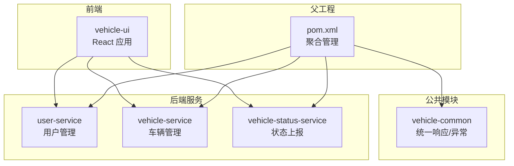
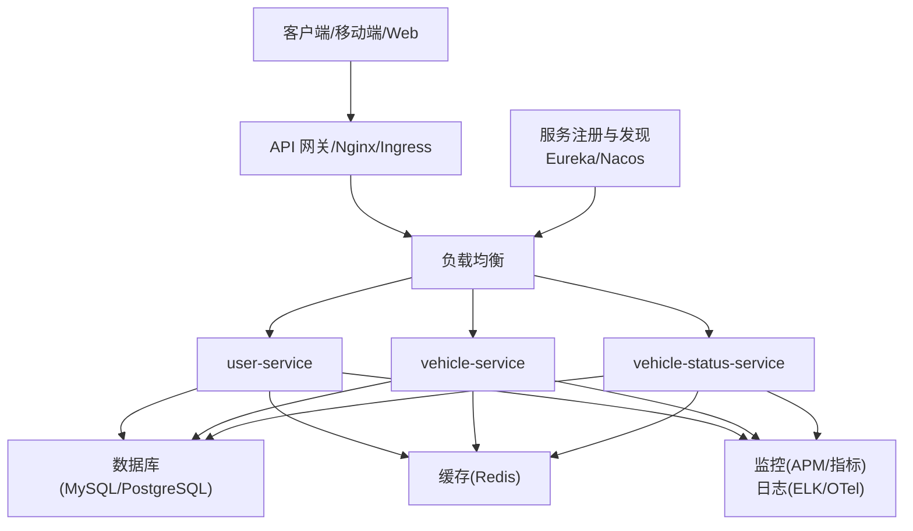
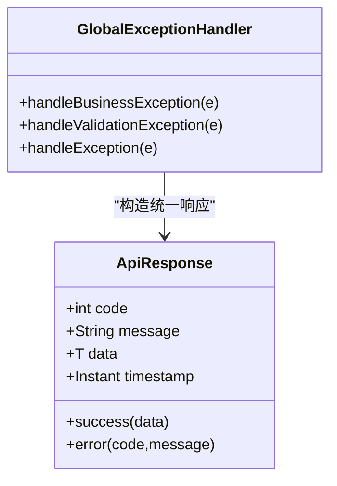
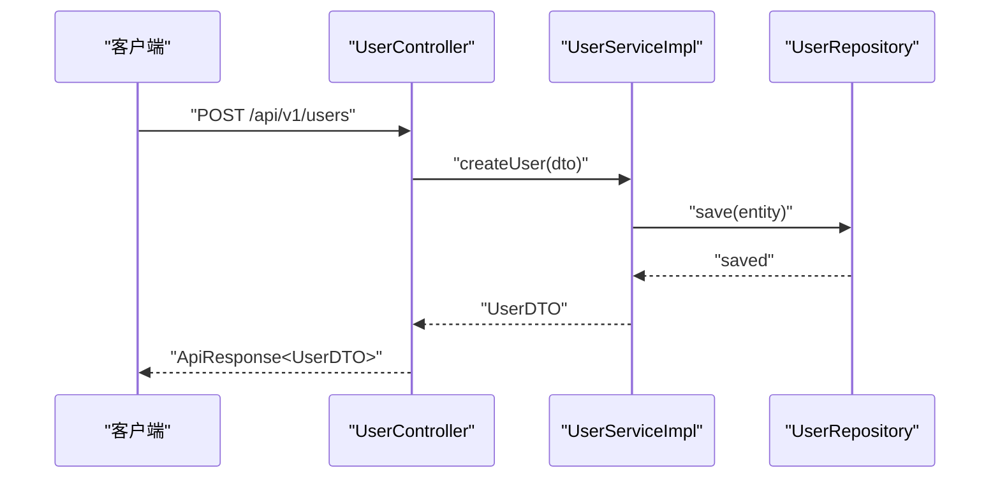
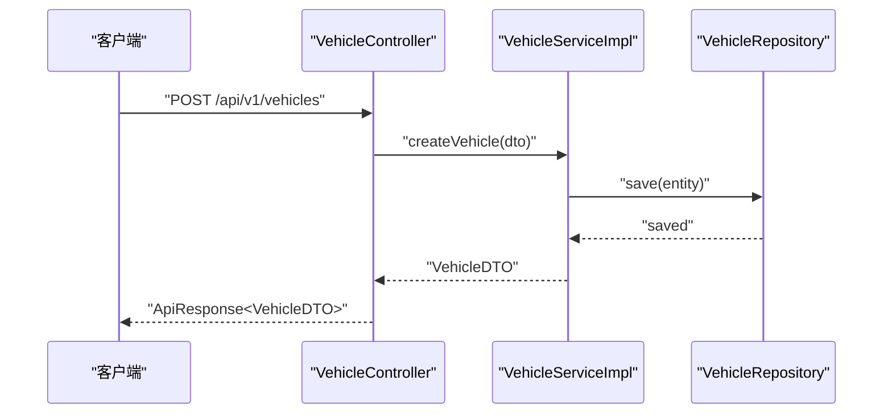
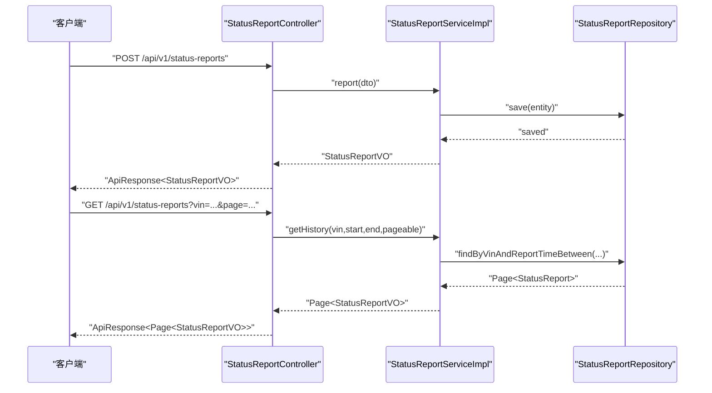
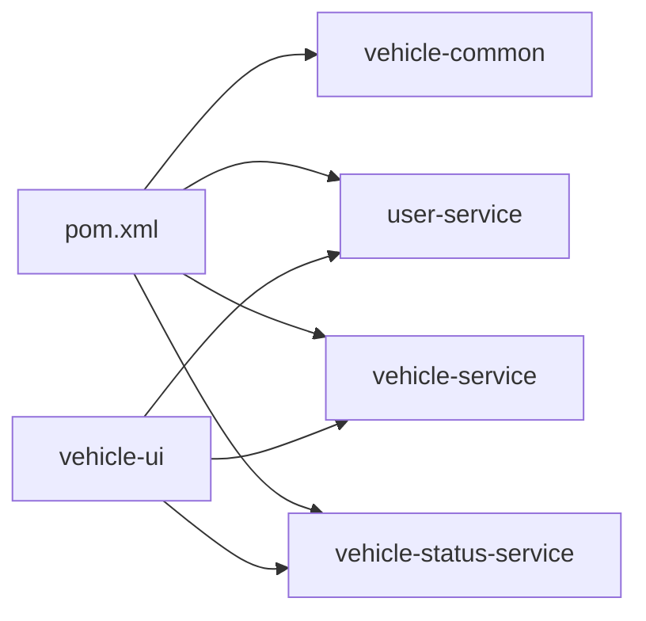

# 部署与运维

<cite>
**本文引用的文件**
- [pom.xml](file://pom.xml)
- [README.md](file://README.md)
- [application.yml（用户服务）](file://user-service/src/main/resources/application.yml)
- [application.yml（车辆服务）](file://vehicle-service/src/main/resources/application.yml)
- [application.yml（车辆状态服务）](file://vehicle-status-service/src/main/resources/application.yml)
- [UserServiceApplication（用户服务）](file://user-service/src/main/java/com/wenjie/cloud/user/UserServiceApplication.java)
- [VehicleServiceApplication（车辆服务）](file://vehicle-service/src/main/java/com/wenjie/cloud/vehicle/VehicleServiceApplication.java)
- [VehicleStatusServiceApplication（车辆状态服务）](file://vehicle-status-service/src/main/java/com/wenjie/cloud/vehiclestatus/VehicleStatusServiceApplication.java)
- [ApiResponse（公共响应）](file://vehicle-common/src/main/java/com/wenjie/cloud/common/dto/ApiResponse.java)
- [GlobalExceptionHandler（全局异常）](file://vehicle-common/src/main/java/com/wenjie/cloud/common/exception/GlobalExceptionHandler.java)
- [UserController（用户控制器）](file://user-service/src/main/java/com/wenjie/cloud/user/controller/UserController.java)
- [VehicleController（车辆控制器）](file://vehicle-service/src/main/java/com/wenjie/cloud/vehicle/controller/VehicleController.java)
- [StatusReportController（状态上报控制器）](file://vehicle-status-service/src/main/java/com/wenjie/cloud/vehiclestatus/controller/StatusReportController.java)
- [UserServiceImpl（用户服务实现）](file://user-service/src/main/java/com/wenjie/cloud/user/service/impl/UserServiceImpl.java)
- [VehicleServiceImpl（车辆服务实现）](file://vehicle-service/src/main/java/com/wenjie/cloud/vehicle/service/impl/VehicleServiceImpl.java)
- [StatusReportServiceImpl（状态上报服务实现）](file://vehicle-status-service/src/main/java/com/wenjie/cloud/vehiclestatus/service/impl/StatusReportServiceImpl.java)
- [package.json（前端）](file://vehicle-ui/package.json)
</cite>

## 目录
1. [简介](#简介)
2. [项目结构](#项目结构)
3. [核心组件](#核心组件)
4. [架构总览](#架构总览)
5. [详细组件分析](#详细组件分析)
6. [依赖关系分析](#依赖关系分析)
7. [性能考虑](#性能考虑)
8. [故障排查指南](#故障排查指南)
9. [结论](#结论)
10. [附录](#附录)

## 简介
本文件面向车联网云平台的部署与运维团队，提供从生产环境配置、容器化部署、监控告警、数据库迁移与备份恢复、负载均衡与服务治理到安全加固与性能优化的完整方案。项目基于 Spring Boot 多模块架构与 React 前端，当前以 H2 内存数据库演示为主，生产环境需替换为持久化数据库与完善的中间件栈。

## 项目结构
- 父工程采用 Maven 聚合管理多模块，包含公共模块与三个业务服务模块。
- 服务模块均使用 Spring Boot，提供 REST API；公共模块提供统一响应与全局异常处理。
- 前端采用 React + Vite，开发时通过代理转发 API 请求至后端服务。

图表来源
- [pom.xml:1-119](file://pom.xml#L1-L119)
- [README.md:19-27](file://README.md#L19-L27)

章节来源
- [pom.xml:1-119](file://pom.xml#L1-L119)
- [README.md:19-27](file://README.md#L19-L27)

## 核心组件
- 统一响应与异常处理：公共模块提供统一响应封装与全局异常拦截，确保前后端交互一致性与可诊断性。
- 业务服务：用户、车辆与状态上报服务均提供标准 CRUD 接口，配合 DTO/VO 进行数据传输。
- 配置与日志：各服务通过 application.yml 定义端口、数据库、JPA、SQL 初始化与 H2 控制台等；日志级别可按需调整。

章节来源
- [ApiResponse.java:1-52](file://vehicle-common/src/main/java/com/wenjie/cloud/common/dto/ApiResponse.java#L1-L52)
- [GlobalExceptionHandler.java:1-56](file://vehicle-common/src/main/java/com/wenjie/cloud/common/exception/GlobalExceptionHandler.java#L1-L56)
- [application.yml（用户服务）:1-40](file://user-service/src/main/resources/application.yml#L1-L40)
- [application.yml（车辆服务）:1-40](file://vehicle-service/src/main/resources/application.yml#L1-L40)
- [application.yml（车辆状态服务）:1-30](file://vehicle-status-service/src/main/resources/application.yml#L1-L30)

## 架构总览
下图展示生产环境典型拓扑：前端通过反向代理或 API 网关接入，后端服务通过服务注册与发现进行通信，数据库与缓存作为外部依赖，监控与日志集中采集。

说明
- 反向代理/网关负责路由、限流、鉴权与协议转换。
- 服务间通信建议启用服务治理（如 Nacos/Eureka），并结合熔断与重试策略。
- 数据库与缓存需具备高可用与灾备能力，避免单点风险。
- 监控与日志覆盖应用指标、链路追踪与日志聚合。

（本图为概念性架构示意，不直接映射具体源文件）

## 详细组件分析

### 统一响应与异常处理
- 统一响应封装了状态码、消息、数据与时间戳，便于前端与监控系统解析。
- 全局异常处理器拦截业务异常、参数校验异常与未知异常，返回标准化错误响应并记录日志。

图表来源
- [ApiResponse.java:1-52](file://vehicle-common/src/main/java/com/wenjie/cloud/common/dto/ApiResponse.java#L1-L52)
- [GlobalExceptionHandler.java:1-56](file://vehicle-common/src/main/java/com/wenjie/cloud/common/exception/GlobalExceptionHandler.java#L1-L56)

章节来源
- [ApiResponse.java:1-52](file://vehicle-common/src/main/java/com/wenjie/cloud/common/dto/ApiResponse.java#L1-L52)
- [GlobalExceptionHandler.java:1-56](file://vehicle-common/src/main/java/com/wenjie/cloud/common/exception/GlobalExceptionHandler.java#L1-L56)

### 用户服务（user-service）
- 启动类位于 com.wenjie.cloud.user 包，端口与数据库在 application.yml 中配置。
- 控制器提供用户创建、查询、删除接口；服务层执行业务校验与事务控制；仓储层完成数据持久化。

图表来源
- [UserController.java:1-60](file://user-service/src/main/java/com/wenjie/cloud/user/controller/UserController.java#L1-L60)
- [UserServiceImpl.java:1-80](file://user-service/src/main/java/com/wenjie/cloud/user/service/impl/UserServiceImpl.java#L1-L80)

章节来源
- [UserServiceApplication.java:1-16](file://user-service/src/main/java/com/wenjie/cloud/user/UserServiceApplication.java#L1-L16)
- [application.yml（用户服务）:1-40](file://user-service/src/main/resources/application.yml#L1-L40)
- [UserController.java:1-60](file://user-service/src/main/java/com/wenjie/cloud/user/controller/UserController.java#L1-L60)
- [UserServiceImpl.java:1-80](file://user-service/src/main/java/com/wenjie/cloud/user/service/impl/UserServiceImpl.java#L1-L80)

### 车辆服务（vehicle-service）
- 启动类位于 com.wenjie.cloud.vehicle，端口与数据库在 application.yml 中配置。
- 控制器提供车辆 CRUD 接口；服务层执行 VIN 校验与业务规则；仓储层完成数据持久化。

图表来源
- [VehicleController.java:1-61](file://vehicle-service/src/main/java/com/wenjie/cloud/vehicle/controller/VehicleController.java#L1-L61)
- [VehicleServiceImpl.java:1-82](file://vehicle-service/src/main/java/com/wenjie/cloud/vehicle/service/impl/VehicleServiceImpl.java#L1-L82)

章节来源
- [VehicleServiceApplication.java:1-16](file://vehicle-service/src/main/java/com/wenjie/cloud/vehicle/VehicleServiceApplication.java#L1-L16)
- [application.yml（车辆服务）:1-40](file://vehicle-service/src/main/resources/application.yml#L1-L40)
- [VehicleController.java:1-61](file://vehicle-service/src/main/java/com/wenjie/cloud/vehicle/controller/VehicleController.java#L1-L61)
- [VehicleServiceImpl.java:1-82](file://vehicle-service/src/main/java/com/wenjie/cloud/vehicle/service/impl/VehicleServiceImpl.java#L1-L82)

### 车辆状态服务（vehicle-status-service）
- 启动类位于 com.wenjie.cloud.vehiclestatus，提供状态上报、历史查询与最新状态查询接口。
- 服务层对上报时间、VIN 格式与边界条件进行校验；仓储层支持分页与排序查询。

图表来源
- [StatusReportController.java:1-71](file://vehicle-status-service/src/main/java/com/wenjie/cloud/vehiclestatus/controller/StatusReportController.java#L1-L71)
- [StatusReportServiceImpl.java:1-104](file://vehicle-status-service/src/main/java/com/wenjie/cloud/vehiclestatus/service/impl/StatusReportServiceImpl.java#L1-L104)

章节来源
- [VehicleStatusServiceApplication.java:1-16](file://vehicle-status-service/src/main/java/com/wenjie/cloud/vehiclestatus/VehicleStatusServiceApplication.java#L1-L16)
- [application.yml（车辆状态服务）:1-30](file://vehicle-status-service/src/main/resources/application.yml#L1-L30)
- [StatusReportController.java:1-71](file://vehicle-status-service/src/main/java/com/wenjie/cloud/vehiclestatus/controller/StatusReportController.java#L1-L71)
- [StatusReportServiceImpl.java:1-104](file://vehicle-status-service/src/main/java/com/wenjie/cloud/vehiclestatus/service/impl/StatusReportServiceImpl.java#L1-L104)

### 配置与日志级别
- 端口与应用名：各服务在 application.yml 中定义 server.port 与 spring.application.name。
- 数据库与 JPA：H2 内存库配置、DDL 自动建模、SQL 初始化模式与 H2 控制台路径。
- 日志级别：当前示例将包 com.wenjie.cloud 设置为 DEBUG，生产环境建议调整为 INFO 或 WARN 并开启滚动日志。

章节来源
- [application.yml（用户服务）:1-40](file://user-service/src/main/resources/application.yml#L1-L40)
- [application.yml（车辆服务）:1-40](file://vehicle-service/src/main/resources/application.yml#L1-L40)
- [application.yml（车辆状态服务）:1-30](file://vehicle-status-service/src/main/resources/application.yml#L1-L30)

## 依赖关系分析
- 父 POM 负责统一版本与插件管理，子模块按需引入依赖。
- 业务服务依赖 vehicle-common 提供统一响应与异常处理。
- 前端通过 Vite 代理将 API 请求转发至对应后端服务端口。

图表来源
- [pom.xml:1-119](file://pom.xml#L1-L119)
- [README.md:44-84](file://README.md#L44-L84)

章节来源
- [pom.xml:1-119](file://pom.xml#L1-L119)
- [README.md:44-84](file://README.md#L44-L84)

## 性能考虑
- JVM 参数调优（示例方向）
  - 初始堆与最大堆：根据服务吞吐与对象分配速率设定，避免频繁 Full GC。
  - 垃圾收集器：优先选择 G1/ ZGC，降低停顿时间；结合应用特性评估。
  - 元空间与线程栈：合理设置以避免 OOM。
  - JIT 优化：启用逃逸分析与循环展开，结合压测验证收益。
- 数据库连接池配置（示例方向）
  - 连接池大小：最小空闲、最大活跃、超时回收策略需与 QPS、RT 目标匹配。
  - 连接泄漏防护：开启健康检查与超时检测。
  - 读写分离与分库分表：高并发场景按业务维度拆分。
- 日志级别与采样
  - 生产环境建议 INFO/WARN，关键路径 DEBUG，异常 TRACE。
  - 结合 APM 采样策略，避免日志风暴影响性能。
- 缓存策略
  - L1/L2 多级缓存，热点数据预热，淘汰策略（LRU/TTL）。
  - 缓存一致性：写穿/回源与失效策略需明确。
- 线程模型与异步化
  - IO 密集型任务使用线程池隔离；CPU 密集型任务拆分批次。
  - 异步化接口需保证幂等与可观测性。

（本节为通用性能建议，不直接分析具体源文件）

## 故障排查指南
- 统一异常处理
  - 全局异常处理器将业务异常、参数校验异常与未知异常转换为统一响应，便于前端与监控系统识别。
- 常见问题定位
  - 业务异常：查看服务日志中的 warn/error 记录，结合响应 code/message 定位。
  - 参数校验失败：关注字段校验提示，确认请求体格式与约束。
  - 未知异常：捕获系统异常并记录堆栈，排查数据库连接、缓存可用性与第三方依赖。
- 日志级别
  - 生产环境建议提升日志级别并开启滚动归档，必要时临时降级以便复盘。

章节来源
- [GlobalExceptionHandler.java:1-56](file://vehicle-common/src/main/java/com/wenjie/cloud/common/exception/GlobalExceptionHandler.java#L1-L56)
- [application.yml（用户服务）:37-40](file://user-service/src/main/resources/application.yml#L37-L40)
- [application.yml（车辆服务）:37-40](file://vehicle-service/src/main/resources/application.yml#L37-L40)
- [application.yml（车辆状态服务）:27-30](file://vehicle-status-service/src/main/resources/application.yml#L27-L30)

## 结论
本方案提供了从配置、部署到运维的全链路指导。当前代码以 H2 内存库演示，生产落地需替换为持久化数据库、完善中间件与监控体系，并结合业务流量特征持续优化 JVM、连接池与缓存策略。建议以模块化方式推进容器化与微服务编排，逐步引入服务治理与安全加固措施。

## 附录

### 生产环境配置清单（示例）
- JVM 参数
  - 堆大小：-Xms/-Xmx
  - GC：-XX:+UseG1GC
  - 元空间：-XX:MetaspaceSize
  - 线程栈：-Xss
- 数据库连接池
  - 连接数：最小空闲、最大活跃
  - 超时：连接获取、连接关闭
  - 健康检查：validationTimeout、idleTimeout
- 日志级别
  - 包级别：com.wenjie.cloud=INFO
  - 归档：按天滚动与压缩
- 监控与日志
  - 指标：QPS、RT、错误率、GC、堆使用
  - 链路：TraceID、Span、标签
  - 日志：ELK/OTel 收集与检索

（本节为通用配置建议，不直接分析具体源文件）

### 容器化与编排（实施要点）
- Docker 镜像
  - 基于精简基础镜像，多阶段构建产物，暴露健康检查端口。
  - 通过环境变量注入数据库连接、日志级别与 JVM 参数。
- Kubernetes
  - Deployment：副本数、就绪探针、存活探针、资源限制。
  - Service/Ingress：暴露服务、TLS 终止、限流与重试。
  - ConfigMap/Secret：配置与密钥管理。
- 微服务编排
  - 服务注册与发现：Nacos/Eureka
  - 熔断与限流：Sentinel/Hystrix
  - 配置中心：Apollo/Consul
  - CI/CD：流水线自动化构建、测试与发布

（本节为通用编排建议，不直接分析具体源文件）

### 监控告警（实施要点）
- 应用性能监控
  - 指标采集：Prometheus Exporter、Micrometer
  - 告警规则：阈值、趋势、异常波动
- 业务指标监控
  - 关键业务指标：用户/车辆/状态上报成功率、延迟分布
- 异常告警
  - 错误率、P95/P99 延迟、下游依赖异常
  - 通知渠道：邮件、IM、电话分级

（本节为通用监控建议，不直接分析具体源文件）

### 数据库迁移与备份恢复（实施要点）
- 迁移工具
  - Flyway/Liquibase：版本化迁移脚本，灰度与回滚策略
- 备份与恢复
  - 全量/增量备份、跨区域冗余、RPO/RTO 目标
  - 恢复演练：定期验证备份可用性与恢复流程
- 读写分离与分库分表
  - 按业务域拆分，主从复制与一致性策略

（本节为通用迁移与备份建议，不直接分析具体源文件）

### 负载均衡、服务发现与 API 网关（实施要点）
- 负载均衡
  - 轮询/加权轮询/最少连接/IP 哈希
- 服务发现
  - 注册中心：Nacos/Eureka/Consul
  - 健康检查与自动摘除
- API 网关
  - 路由、鉴权、限流、熔断、协议转换

（本节为通用网关与服务治理建议，不直接分析具体源文件）

### 安全加固与运维最佳实践
- 安全加固
  - 最小权限原则、密钥轮换、网络隔离、WAF/IDS
  - 输入校验、参数绑定、防注入与越权
- 运维最佳实践
  - 变更评审、灰度发布、回滚预案
  - 压测与容量规划、事件响应流程
  - 文档化与知识沉淀

（本节为通用安全与运维建议，不直接分析具体源文件）