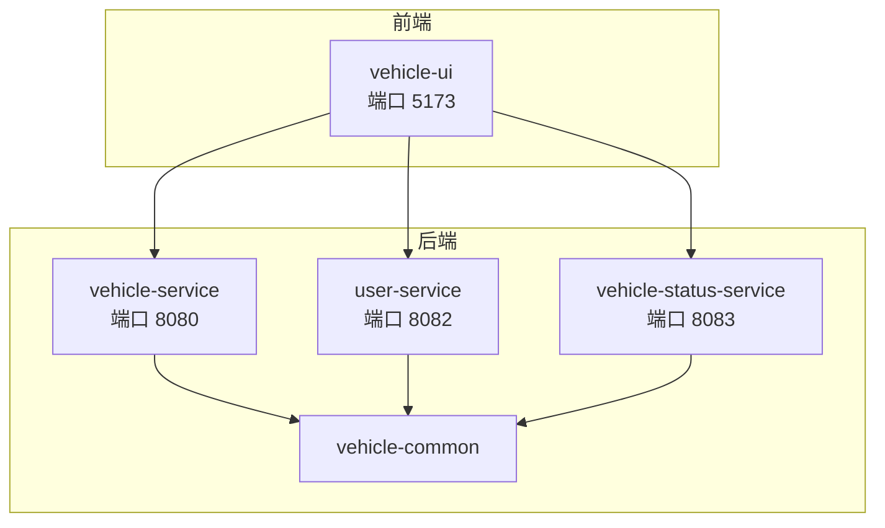
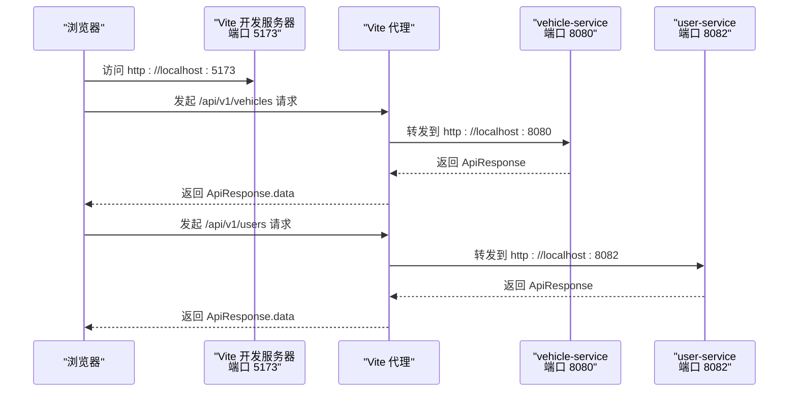
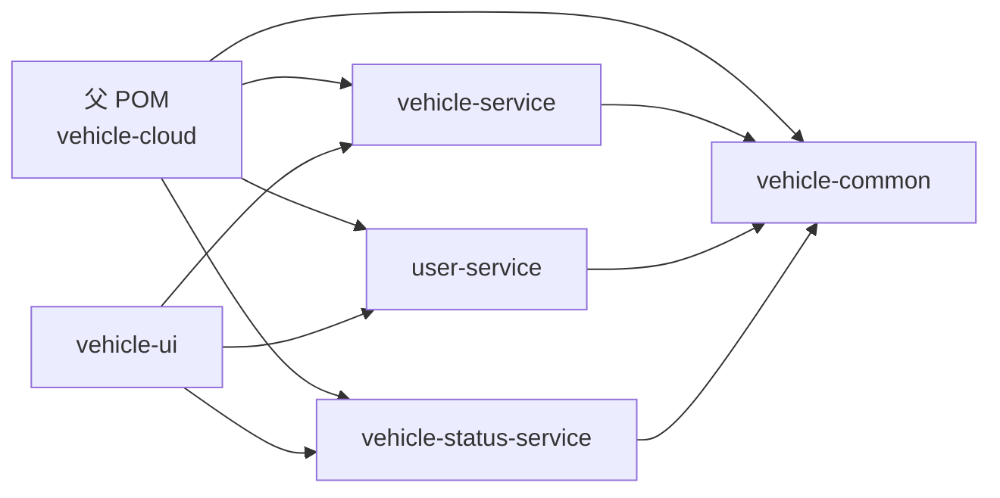

# 快速开始

<cite>
**本文引用的文件**
- [README.md](file://README.md)
- [pom.xml](file://pom.xml)
- [vehicle-service/pom.xml](file://vehicle-service/pom.xml)
- [user-service/pom.xml](file://user-service/pom.xml)
- [vehicle-status-service/pom.xml](file://vehicle-status-service/pom.xml)
- [vehicle-service/src/main/resources/application.yml](file://vehicle-service/src/main/resources/application.yml)
- [user-service/src/main/resources/application.yml](file://user-service/src/main/resources/application.yml)
- [vehicle-ui/package.json](file://vehicle-ui/package.json)
- [vehicle-ui/vite.config.js](file://vehicle-ui/vite.config.js)
- [vehicle-ui/src/api/request.js](file://vehicle-ui/src/api/request.js)
- [vehicle-service/src/main/java/com/wenjie/cloud/vehicle/VehicleServiceApplication.java](file://vehicle-service/src/main/java/com/wenjie/cloud/vehicle/VehicleServiceApplication.java)
- [user-service/src/main/java/com/wenjie/cloud/user/UserServiceApplication.java](file://user-service/src/main/java/com/wenjie/cloud/user/UserServiceApplication.java)
- [vehicle-common/src/main/java/com/wenjie/cloud/common/dto/ApiResponse.java](file://vehicle-common/src/main/java/com/wenjie/cloud/common/dto/ApiResponse.java)
</cite>

## 目录
1. [简介](#简介)
2. [项目结构](#项目结构)
3. [核心组件](#核心组件)
4. [架构总览](#架构总览)
5. [详细组件分析](#详细组件分析)
6. [依赖关系分析](#依赖关系分析)
7. [性能考虑](#性能考虑)
8. [故障排查指南](#故障排查指南)
9. [结论](#结论)
10. [附录](#附录)

## 简介
本指南面向首次接触车联网云平台项目的开发者，帮助你在本地快速完成环境准备、后端服务构建与启动、前端应用安装与启动，并提供常见问题的解决方案与调试技巧。项目采用多模块 Spring Boot 后端 + React 前端的架构，使用 Maven 进行后端构建，使用 Vite 作为前端开发服务器与代理。

## 项目结构
项目为多模块 Maven 工程，包含以下主要模块：
- vehicle-common：公共模块，提供统一响应、异常处理等基础设施
- vehicle-service：车辆管理服务（端口 8080）
- user-service：用户管理服务（端口 8082）
- vehicle-status-service：车辆状态服务（端口 8083）
- vehicle-ui：React 前端应用（端口 5173），通过 Vite 代理转发 API 请求

图表来源
- [pom.xml:37-43](file://pom.xml#L37-L43)
- [vehicle-service/src/main/resources/application.yml:1-2](file://vehicle-service/src/main/resources/application.yml#L1-L2)
- [user-service/src/main/resources/application.yml:1-2](file://user-service/src/main/resources/application.yml#L1-L2)
- [vehicle-ui/vite.config.js:9-22](file://vehicle-ui/vite.config.js#L9-L22)

章节来源
- [README.md:19-27](file://README.md#L19-L27)
- [pom.xml:37-43](file://pom.xml#L37-L43)

## 核心组件
- 统一响应模型：所有后端接口返回统一的 ApiResponse 结构，便于前端统一处理。
- H2 内存数据库：每个服务使用 H2 内存数据库，启动时自动初始化测试数据。
- 前端代理：Vite 开发服务器代理 /api/v1/* 到对应后端服务端口，简化跨域与联调。

章节来源
- [vehicle-common/src/main/java/com/wenjie/cloud/common/dto/ApiResponse.java:12-51](file://vehicle-common/src/main/java/com/wenjie/cloud/common/dto/ApiResponse.java#L12-L51)
- [vehicle-service/src/main/resources/application.yml:8-35](file://vehicle-service/src/main/resources/application.yml#L8-L35)
- [user-service/src/main/resources/application.yml:8-35](file://user-service/src/main/resources/application.yml#L8-L35)
- [vehicle-ui/vite.config.js:9-22](file://vehicle-ui/vite.config.js#L9-L22)

## 架构总览
下图展示了从浏览器到后端服务的整体交互路径，以及前端如何通过 Vite 代理转发请求。

图表来源
- [vehicle-ui/vite.config.js:9-22](file://vehicle-ui/vite.config.js#L9-L22)
- [vehicle-service/src/main/resources/application.yml:1-2](file://vehicle-service/src/main/resources/application.yml#L1-L2)
- [user-service/src/main/resources/application.yml:1-2](file://user-service/src/main/resources/application.yml#L1-L2)

## 详细组件分析

### 环境准备与安装
- JDK 11+：用于编译与运行 Spring Boot 应用。请确保 JAVA_HOME 指向 JDK 11 或更高版本，并在 PATH 中可用。
- Maven 3.8+：用于后端多模块构建。建议使用 3.8 及以上版本以获得更好的插件兼容性。
- Node.js 18+：用于前端开发与构建。确保 npm 可用。

章节来源
- [README.md:50-54](file://README.md#L50-L54)

### 后端服务构建
- 在项目根目录执行 Maven 构建命令，完成依赖下载与打包：
  - mvn clean install
- 构建完成后，进入各服务子目录，使用 Spring Boot 插件启动服务：
  - 车辆服务：cd vehicle-service && mvn spring-boot:run
  - 用户服务：cd user-service && mvn spring-boot:run
  - 车辆状态服务：cd vehicle-status-service && mvn spring-boot:run

章节来源
- [README.md:56-82](file://README.md#L56-L82)
- [pom.xml:94-116](file://pom.xml#L94-L116)
- [vehicle-service/pom.xml:52-57](file://vehicle-service/pom.xml#L52-L57)
- [user-service/pom.xml:52-57](file://user-service/pom.xml#L52-L57)
- [vehicle-status-service/pom.xml:52-57](file://vehicle-status-service/pom.xml#L52-L57)

### 后端服务启动（分步指导）
- 车辆服务（端口 8080）
  - 进入 vehicle-service 目录，执行 mvn spring-boot:run
  - 启动日志显示服务名称与端口；可通过 http://localhost:8080/h2-console 访问 H2 控制台
- 用户服务（端口 8082）
  - 进入 user-service 目录，执行 mvn spring-boot:run
  - 启动日志显示服务名称与端口；可通过 http://localhost:8082/h2-console 访问 H2 控制台
- 车辆状态服务（端口 8083）
  - 进入 vehicle-status-service 目录，执行 mvn spring-boot:run
  - 启动日志显示服务名称与端口；可通过 http://localhost:8083/h2-console 访问 H2 控制台

章节来源
- [README.md:62-74](file://README.md#L62-L74)
- [vehicle-service/src/main/resources/application.yml:1-2](file://vehicle-service/src/main/resources/application.yml#L1-L2)
- [user-service/src/main/resources/application.yml:1-2](file://user-service/src/main/resources/application.yml#L1-L2)
- [vehicle-ui/vite.config.js:17-21](file://vehicle-ui/vite.config.js#L17-L21)

### 前端应用安装与启动
- 安装依赖：在 vehicle-ui 目录执行 npm install
- 启动开发服务器：执行 npm run dev
- 默认访问地址：http://localhost:5173
- API 代理规则：/api/v1/vehicles -> http://localhost:8080，/api/v1/users -> http://localhost:8082，/api/v1/status-reports -> http://localhost:8083

章节来源
- [README.md:76-84](file://README.md#L76-L84)
- [vehicle-ui/package.json:6-11](file://vehicle-ui/package.json#L6-L11)
- [vehicle-ui/vite.config.js:9-22](file://vehicle-ui/vite.config.js#L9-L22)

### API 接口概览
- 用户服务（端口 8082）
  - POST /api/v1/users：创建用户
  - GET /api/v1/users：查询用户列表
  - GET /api/v1/users/{id}：按 ID 查询用户
  - DELETE /api/v1/users/{id}：删除用户
- 车辆服务（端口 8080）
  - POST /api/v1/vehicles：创建车辆
  - GET /api/v1/vehicles：查询车辆列表
  - GET /api/v1/vehicles/{id}：按 ID 查询车辆
  - DELETE /api/v1/vehicles/{id}：删除车辆
- 统一响应格式：所有接口返回 ApiResponse，包含 code、message、data、timestamp 字段

章节来源
- [README.md:86-132](file://README.md#L86-L132)

## 依赖关系分析
- 父 POM 统一管理 Spring Boot 版本、Java 版本、Lombok 与 MapStruct 版本，并定义了模块化结构。
- 各服务模块依赖 vehicle-common，实现统一响应与异常处理。
- 前端通过 Vite 代理将 API 请求转发至对应后端端口。

图表来源
- [pom.xml:37-43](file://pom.xml#L37-L43)
- [vehicle-service/pom.xml:19-23](file://vehicle-service/pom.xml#L19-L23)
- [user-service/pom.xml:19-23](file://user-service/pom.xml#L19-L23)
- [vehicle-status-service/pom.xml:19-23](file://vehicle-status-service/pom.xml#L19-L23)

章节来源
- [pom.xml:37-43](file://pom.xml#L37-L43)
- [vehicle-service/pom.xml:19-23](file://vehicle-service/pom.xml#L19-L23)
- [user-service/pom.xml:19-23](file://user-service/pom.xml#L19-L23)
- [vehicle-status-service/pom.xml:19-23](file://vehicle-status-service/pom.xml#L19-L23)

## 性能考虑
- 使用 H2 内存数据库进行开发与测试，启动速度快但不持久化；生产环境请替换为关系型数据库。
- 建议在本地开发时开启 Spring Boot 的热重载（DevTools）以提升迭代效率。
- 前端开发服务器使用 Vite，具备快速冷启动与热更新能力。

## 故障排查指南
- 端口冲突
  - 症状：服务启动时报端口占用错误
  - 解决：修改 application.yml 中的 server.port，或关闭占用端口的进程
- 依赖下载失败
  - 症状：mvn install 报网络错误或超时
  - 解决：检查网络与 Maven 配置，必要时切换为国内镜像源
- 前端代理无效
  - 症状：浏览器控制台出现跨域错误或 404
  - 解决：确认 vite.config.js 中的代理配置与后端端口一致；重启 Vite 开发服务器
- H2 控制台无法访问
  - 症状：浏览器访问 /h2-console 返回 404
  - 解决：确认 application.yml 中 h2.console.enabled=true 且路径正确
- 响应格式异常
  - 症状：前端收到非 ApiResponse 结构
  - 解决：确认后端控制器返回值使用 ApiResponse 包装；检查全局异常处理器是否生效

章节来源
- [vehicle-service/src/main/resources/application.yml:31-35](file://vehicle-service/src/main/resources/application.yml#L31-L35)
- [user-service/src/main/resources/application.yml:31-35](file://user-service/src/main/resources/application.yml#L31-L35)
- [vehicle-ui/vite.config.js:9-22](file://vehicle-ui/vite.config.js#L9-L22)
- [vehicle-common/src/main/java/com/wenjie/cloud/common/dto/ApiResponse.java:12-51](file://vehicle-common/src/main/java/com/wenjie/cloud/common/dto/ApiResponse.java#L12-L51)

## 结论
按照本指南完成环境准备与构建启动后，你将能够在本地成功运行车联网云平台的前后端服务，并通过前端界面进行车辆与用户的增删改查操作。如遇问题，请参考故障排查指南逐步定位与解决。

## 附录
- 初始化数据概览
  - user-service：5 条用户数据
  - vehicle-service：30 条车辆数据（AITO M5 × 10、AITO M7 × 10、AITO M9 × 10）
  - 车辆均匀分配给 5 个用户，每人 6 辆

章节来源
- [README.md:143-151](file://README.md#L143-L151)