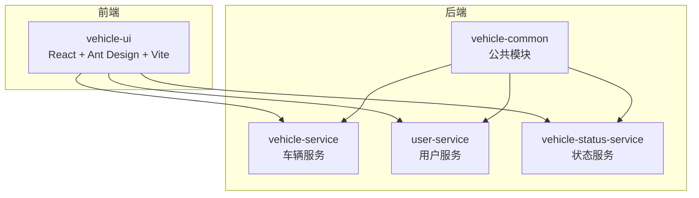
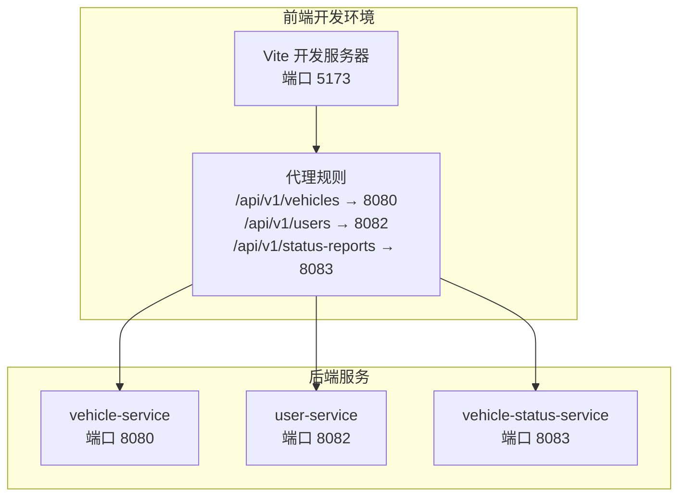
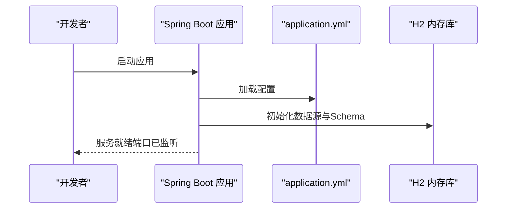
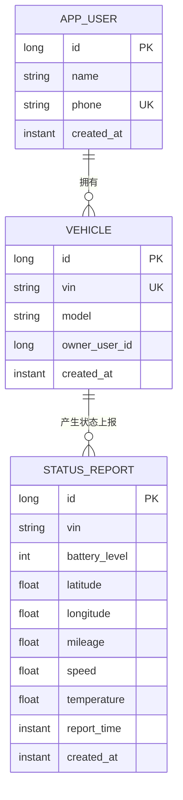
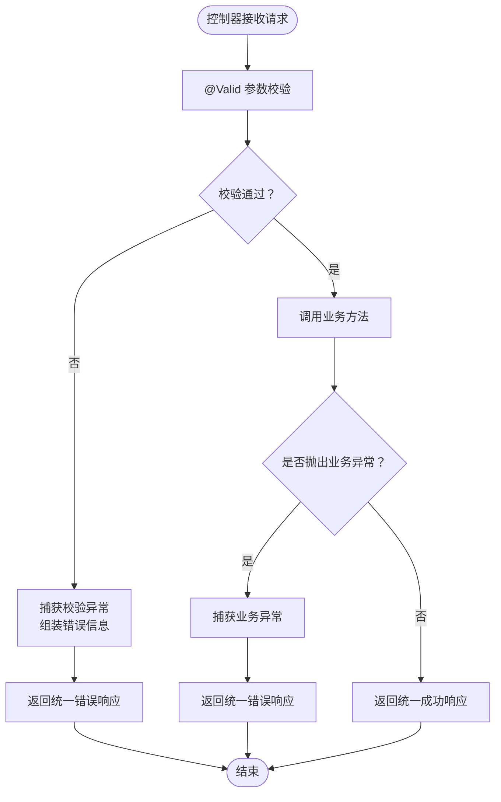
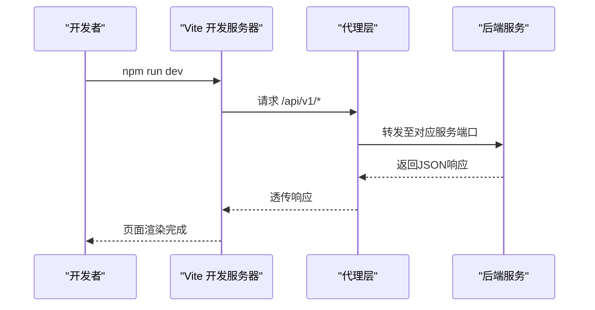
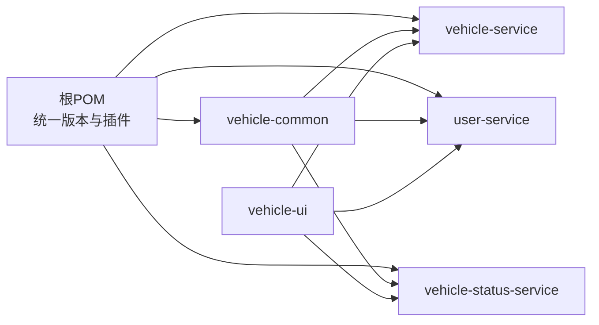

# 技术栈概览

<cite>
**本文引用的文件**
- [根POM](file://pom.xml)
- [用户服务POM](file://user-service/pom.xml)
- [车辆服务POM](file://vehicle-service/pom.xml)
- [车辆状态服务POM](file://vehicle-status-service/pom.xml)
- [用户服务启动类](file://user-service/src/main/java/com/wenjie/cloud/user/UserServiceApplication.java)
- [车辆服务启动类](file://vehicle-service/src/main/java/com/wenjie/cloud/vehicle/VehicleServiceApplication.java)
- [车辆状态服务启动类](file://vehicle-status-service/src/main/java/com/wenjie/cloud/vehiclestatus/VehicleStatusServiceApplication.java)
- [用户服务配置](file://user-service/src/main/resources/application.yml)
- [车辆服务配置](file://vehicle-service/src/main/resources/application.yml)
- [车辆状态服务配置](file://vehicle-status-service/src/main/resources/application.yml)
- [通用响应封装](file://vehicle-common/src/main/java/com/wenjie/cloud/common/dto/ApiResponse.java)
- [全局异常处理](file://vehicle-common/src/main/java/com/wenjie/cloud/common/exception/GlobalExceptionHandler.java)
- [用户实体](file://user-service/src/main/java/com/wenjie/cloud/user/entity/User.java)
- [车辆实体](file://vehicle-service/src/main/java/com/wenjie/cloud/vehicle/entity/Vehicle.java)
- [状态上报实体](file://vehicle-status-service/src/main/java/com/wenjie/cloud/vehiclestatus/entity/StatusReport.java)
- [前端包配置](file://vehicle-ui/package.json)
- [前端Vite配置](file://vehicle-ui/vite.config.js)
</cite>

## 目录
1. [引言](#引言)
2. [项目结构](#项目结构)
3. [核心组件](#核心组件)
4. [架构总览](#架构总览)
5. [详细组件分析](#详细组件分析)
6. [依赖分析](#依赖分析)
7. [性能考虑](#性能考虑)
8. [故障排除指南](#故障排除指南)
9. [结论](#结论)

## 引言
本文件面向车联网云平台的开发者与架构师，系统性梳理后端与前端技术栈，明确Spring Boot 2.7.18、Java 11、H2数据库、Spring Data JPA、Lombok、MapStruct等后端核心组件及版本信息；同时阐述前端React 19、Ant Design 6、Vite 8等现代前端技术的选择理由与优势。文档还说明javax.validation参数校验框架的使用方式、Maven与Node.js在工程中的作用，并给出技术选型的决策依据与组件协作关系，帮助读者快速理解整体技术架构的设计思路。

## 项目结构
本项目采用多模块Maven聚合工程组织，包含以下模块：
- vehicle-common：公共模块，提供统一响应封装与全局异常处理
- vehicle-service：车辆管理服务，基于Spring Boot + Spring Data JPA + H2
- user-service：用户管理服务，基于Spring Boot + Spring Data JPA + H2
- vehicle-status-service：车辆状态服务，基于Spring Boot + Spring Data JPA + H2
- vehicle-ui：前端UI，基于React 19 + Ant Design 6 + Vite 8

**图表来源**
- [根POM:37-43](file://pom.xml#L37-L43)
- [用户服务POM:18-49](file://user-service/pom.xml#L18-L49)
- [车辆服务POM:18-49](file://vehicle-service/pom.xml#L18-L49)
- [车辆状态服务POM:18-49](file://vehicle-status-service/pom.xml#L18-L49)

**章节来源**
- [根POM:1-119](file://pom.xml#L1-L119)
- [用户服务POM:1-61](file://user-service/pom.xml#L1-L61)
- [车辆服务POM:1-61](file://vehicle-service/pom.xml#L1-L61)
- [车辆状态服务POM:1-61](file://vehicle-status-service/pom.xml#L1-L61)

## 核心组件
- 后端技术栈
  - Spring Boot 2.7.18：统一依赖管理与自动配置，提供Web、JPA、验证等Starter
  - Java 11：长期支持版本，兼顾性能与生态成熟度
  - H2内存数据库：开发/测试环境零配置，支持console调试
  - Spring Data JPA：ORM抽象，简化数据访问层开发
  - Lombok：通过注解减少样板代码，提升开发效率
  - MapStruct：类型安全的对象映射，编译期生成高性能映射器
  - javax.validation（spring-boot-starter-validation）：参数校验框架，配合全局异常处理统一返回格式
- 前端技术栈
  - React 19：函数式组件与并发特性，提供现代化开发体验
  - Ant Design 6：企业级UI设计体系，组件丰富且可定制
  - Vite 8：极速构建工具，热更新与打包优化
  - axios：HTTP客户端，统一请求与响应处理
  - react-router-dom：路由管理，支持单页应用导航

**章节来源**
- [根POM:26-34](file://pom.xml#L26-L34)
- [用户服务POM:25-48](file://user-service/pom.xml#L25-L48)
- [车辆服务POM:25-48](file://vehicle-service/pom.xml#L25-L48)
- [车辆状态服务POM:25-48](file://vehicle-status-service/pom.xml#L25-L48)
- [前端包配置:12-29](file://vehicle-ui/package.json#L12-L29)

## 架构总览
后端采用多服务微服务风格（本项目以多模块形式体现），每个服务独立运行并暴露REST接口；前端通过Vite代理将不同API前缀转发到对应后端服务端口，形成前后端分离的开发与部署模式。

**图表来源**
- [前端Vite配置:7-23](file://vehicle-ui/vite.config.js#L7-L23)
- [用户服务配置:1-2](file://user-service/src/main/resources/application.yml#L1-L2)
- [车辆服务配置:1-2](file://vehicle-service/src/main/resources/application.yml#L1-L2)
- [车辆状态服务配置:1-2](file://vehicle-status-service/src/main/resources/application.yml#L1-L2)

**章节来源**
- [前端Vite配置:1-25](file://vehicle-ui/vite.config.js#L1-L25)
- [用户服务配置:1-40](file://user-service/src/main/resources/application.yml#L1-L40)
- [车辆服务配置:1-40](file://vehicle-service/src/main/resources/application.yml#L1-L40)
- [车辆状态服务配置:1-30](file://vehicle-status-service/src/main/resources/application.yml#L1-L30)

## 详细组件分析

### 后端应用启动与配置
- 应用启动类均位于各自模块的根包下，使用@SpringBootApplication启用自动配置，并扫描com.wenjie.cloud包路径
- 各服务通过application.yml配置端口、数据源、JPA/Hibernate、SQL初始化与H2 Console等

**图表来源**
- [用户服务启动类:9-14](file://user-service/src/main/java/com/wenjie/cloud/user/UserServiceApplication.java#L9-L14)
- [车辆服务启动类:9-14](file://vehicle-service/src/main/java/com/wenjie/cloud/vehicle/VehicleServiceApplication.java#L9-L14)
- [车辆状态服务启动类:9-14](file://vehicle-status-service/src/main/java/com/wenjie/cloud/vehiclestatus/VehicleStatusServiceApplication.java#L9-L14)
- [用户服务配置:1-35](file://user-service/src/main/resources/application.yml#L1-L35)
- [车辆服务配置:1-35](file://vehicle-service/src/main/resources/application.yml#L1-L35)
- [车辆状态服务配置:1-23](file://vehicle-status-service/src/main/resources/application.yml#L1-L23)

**章节来源**
- [用户服务启动类:1-16](file://user-service/src/main/java/com/wenjie/cloud/user/UserServiceApplication.java#L1-L16)
- [车辆服务启动类:1-16](file://vehicle-service/src/main/java/com/wenjie/cloud/vehicle/VehicleServiceApplication.java#L1-L16)
- [车辆状态服务启动类:1-16](file://vehicle-status-service/src/main/java/com/wenjie/cloud/vehiclestatus/VehicleStatusServiceApplication.java#L1-L16)
- [用户服务配置:1-40](file://user-service/src/main/resources/application.yml#L1-L40)
- [车辆服务配置:1-40](file://vehicle-service/src/main/resources/application.yml#L1-L40)
- [车辆状态服务配置:1-30](file://vehicle-status-service/src/main/resources/application.yml#L1-L30)

### 数据模型与持久化
- 用户实体：包含自增主键、姓名、手机号（唯一）、创建时间等字段
- 车辆实体：包含VIN（唯一）、车型、车主ID、创建时间等字段
- 状态上报实体：包含VIN、电量、经纬度、里程、车速、温度、上报时间、创建时间，并定义复合索引以优化查询

**图表来源**
- [用户实体:16-37](file://user-service/src/main/java/com/wenjie/cloud/user/entity/User.java#L16-L37)
- [车辆实体:16-41](file://vehicle-service/src/main/java/com/wenjie/cloud/vehicle/entity/Vehicle.java#L16-L41)
- [状态上报实体:18-70](file://vehicle-status-service/src/main/java/com/wenjie/cloud/vehiclestatus/entity/StatusReport.java#L18-L70)

**章节来源**
- [用户实体:1-38](file://user-service/src/main/java/com/wenjie/cloud/user/entity/User.java#L1-L38)
- [车辆实体:1-42](file://vehicle-service/src/main/java/com/wenjie/cloud/vehicle/entity/Vehicle.java#L1-L42)
- [状态上报实体:1-71](file://vehicle-status-service/src/main/java/com/wenjie/cloud/vehiclestatus/entity/StatusReport.java#L1-L71)

### 参数校验与统一异常处理
- 参数校验：通过spring-boot-starter-validation引入javax.validation，结合@RestControllerAdvice在全局捕获校验异常，统一返回ApiResponse格式
- 业务异常：自定义BusinessException，由全局异常处理器捕获并返回标准错误响应
- 未捕获异常：兜底处理未知异常，返回系统内部错误

**图表来源**
- [全局异常处理:26-54](file://vehicle-common/src/main/java/com/wenjie/cloud/common/exception/GlobalExceptionHandler.java#L26-L54)
- [通用响应封装:41-50](file://vehicle-common/src/main/java/com/wenjie/cloud/common/dto/ApiResponse.java#L41-L50)

**章节来源**
- [全局异常处理:1-56](file://vehicle-common/src/main/java/com/wenjie/cloud/common/exception/GlobalExceptionHandler.java#L1-L56)
- [通用响应封装:1-52](file://vehicle-common/src/main/java/com/wenjie/cloud/common/dto/ApiResponse.java#L1-L52)

### 前端技术栈与开发流程
- React 19：函数式组件与并发渲染能力，适合复杂交互场景
- Ant Design 6：提供丰富的中后台组件，内置主题与国际化支持
- Vite 8：基于ESBuild的快速构建工具，开发时热更新与生产打包性能优异
- axios：统一HTTP请求封装，便于拦截器与错误处理
- 路由：react-router-dom负责页面级导航

**图表来源**
- [前端包配置:6-11](file://vehicle-ui/package.json#L6-L11)
- [前端Vite配置:7-23](file://vehicle-ui/vite.config.js#L7-L23)

**章节来源**
- [前端包配置:1-32](file://vehicle-ui/package.json#L1-L32)
- [前端Vite配置:1-25](file://vehicle-ui/vite.config.js#L1-L25)

## 依赖分析
- Maven统一管理后端依赖版本，包括Lombok与MapStruct；各子模块按需引入Spring Web、Spring Data JPA、参数校验与H2
- 前端通过package.json声明依赖与脚本，Vite作为构建与开发工具链

**图表来源**
- [根POM:46-67](file://pom.xml#L46-L67)
- [用户服务POM:18-49](file://user-service/pom.xml#L18-L49)
- [车辆服务POM:18-49](file://vehicle-service/pom.xml#L18-L49)
- [车辆状态服务POM:18-49](file://vehicle-status-service/pom.xml#L18-L49)

**章节来源**
- [根POM:1-119](file://pom.xml#L1-L119)
- [用户服务POM:1-61](file://user-service/pom.xml#L1-L61)
- [车辆服务POM:1-61](file://vehicle-service/pom.xml#L1-L61)
- [车辆状态服务POM:1-61](file://vehicle-status-service/pom.xml#L1-L61)

## 性能考虑
- 后端
  - 使用H2内存数据库适配开发/测试场景，具备零配置与高读写性能的优势；生产环境建议替换为关系型数据库
  - JPA/Hibernate开启DDL自动建模与SQL格式化，便于调试但生产需谨慎评估
  - Jackson日期序列化配置避免时间戳输出，有利于前端解析
- 前端
  - Vite基于ESBuild进行打包，构建速度快；开发时热更新显著提升迭代效率
  - React 19的并发特性有助于复杂界面的流畅渲染

[本节为通用性能讨论，不直接分析具体文件]

## 故障排除指南
- H2控制台无法访问
  - 检查application.yml中h2.console.enabled与path配置
- 参数校验失败
  - 查看全局异常处理器对MethodArgumentNotValidException的处理逻辑，确认请求体字段与约束注解一致
- 统一响应格式
  - 确认控制器返回值被ApiResponse封装，或通过全局异常处理器统一转换

**章节来源**
- [用户服务配置:31-35](file://user-service/src/main/resources/application.yml#L31-L35)
- [车辆状态服务配置:12-29](file://vehicle-status-service/src/main/resources/application.yml#L12-L29)
- [全局异常处理:35-44](file://vehicle-common/src/main/java/com/wenjie/cloud/common/exception/GlobalExceptionHandler.java#L35-L44)
- [通用响应封装:41-50](file://vehicle-common/src/main/java/com/wenjie/cloud/common/dto/ApiResponse.java#L41-L50)

## 结论
本项目以Spring Boot 2.7.18为核心，结合Java 11、H2、Spring Data JPA、Lombok与MapStruct，构建了简洁高效的后端技术栈；前端采用React 19、Ant Design 6与Vite 8，形成现代化的开发与运行环境。通过统一的参数校验与异常处理机制，确保了API的一致性与可维护性。该技术组合在开发效率、学习成本与扩展性之间取得良好平衡，适合快速搭建车联网云平台原型与演示系统。