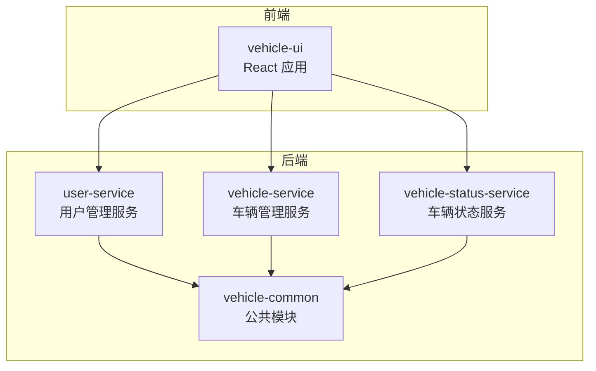
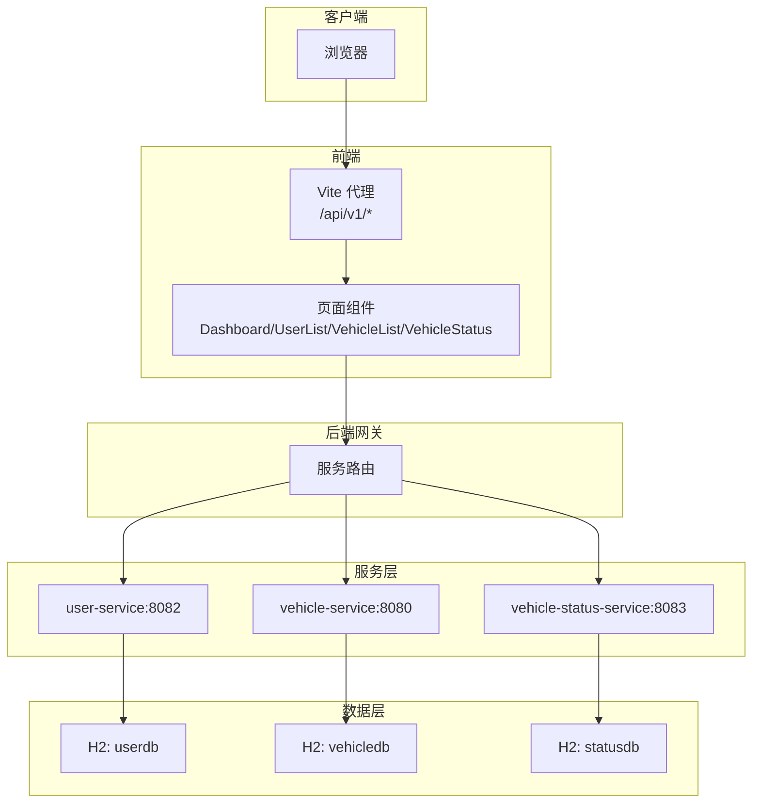
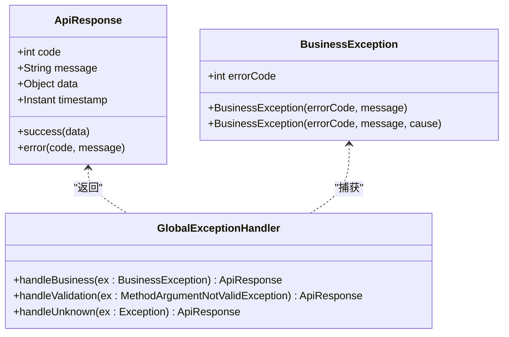
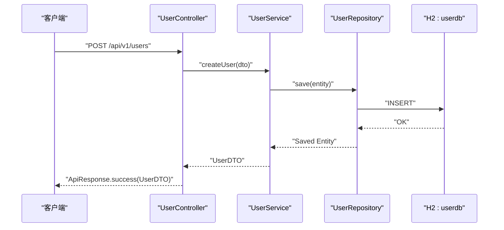
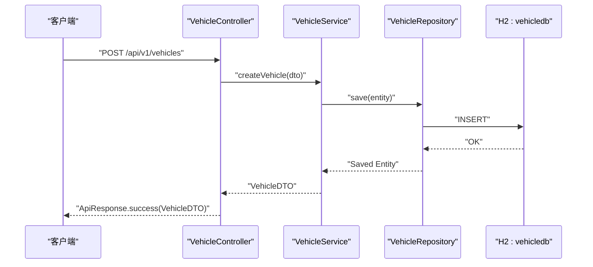
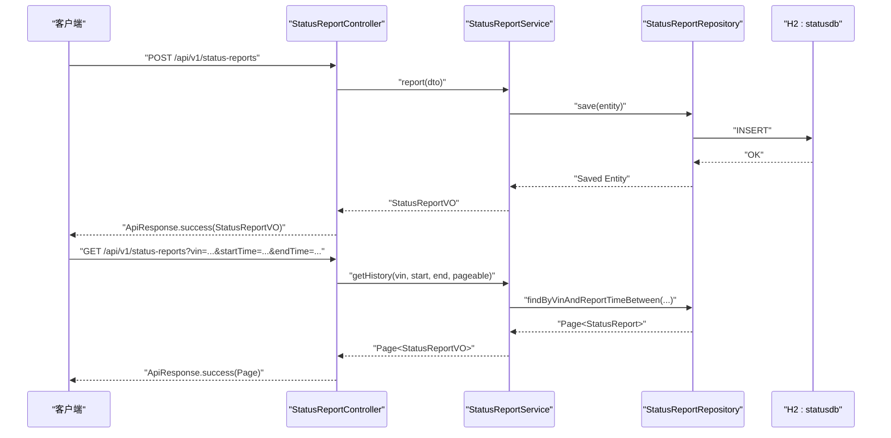
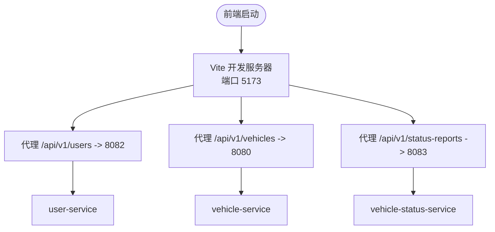
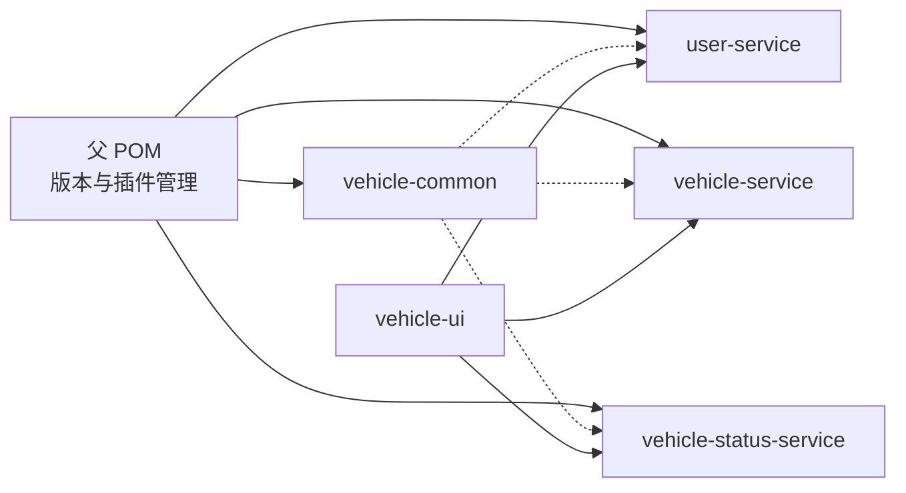

# 项目介绍

<cite>
**本文引用的文件**
- [README.md](file://README.md)
- [pom.xml](file://pom.xml)
- [vehicle-common/src/main/java/com/wenjie/cloud/common/dto/ApiResponse.java](file://vehicle-common/src/main/java/com/wenjie/cloud/common/dto/ApiResponse.java)
- [vehicle-common/src/main/java/com/wenjie/cloud/common/exception/BusinessException.java](file://vehicle-common/src/main/java/com/wenjie/cloud/common/exception/BusinessException.java)
- [user-service/src/main/java/com/wenjie/cloud/user/UserServiceApplication.java](file://user-service/src/main/java/com/wenjie/cloud/user/UserServiceApplication.java)
- [user-service/src/main/java/com/wenjie/cloud/user/controller/UserController.java](file://user-service/src/main/java/com/wenjie/cloud/user/controller/UserController.java)
- [user-service/src/main/resources/application.yml](file://user-service/src/main/resources/application.yml)
- [vehicle-service/src/main/java/com/wenjie/cloud/vehicle/VehicleServiceApplication.java](file://vehicle-service/src/main/java/com/wenjie/cloud/vehicle/VehicleServiceApplication.java)
- [vehicle-service/src/main/java/com/wenjie/cloud/vehicle/controller/VehicleController.java](file://vehicle-service/src/main/java/com/wenjie/cloud/vehicle/controller/VehicleController.java)
- [vehicle-service/src/main/resources/application.yml](file://vehicle-service/src/main/resources/application.yml)
- [vehicle-status-service/src/main/java/com/wenjie/cloud/vehiclestatus/VehicleStatusServiceApplication.java](file://vehicle-status-service/src/main/java/com/wenjie/cloud/vehiclestatus/VehicleStatusServiceApplication.java)
- [vehicle-status-service/src/main/java/com/wenjie/cloud/vehiclestatus/controller/StatusReportController.java](file://vehicle-status-service/src/main/java/com/wenjie/cloud/vehiclestatus/controller/StatusReportController.java)
- [vehicle-status-service/src/main/resources/application.yml](file://vehicle-status-service/src/main/resources/application.yml)
- [vehicle-ui/package.json](file://vehicle-ui/package.json)
- [vehicle-ui/vite.config.js](file://vehicle-ui/vite.config.js)
</cite>

## 目录
1. [引言](#引言)
2. [项目结构](#项目结构)
3. [核心组件](#核心组件)
4. [架构总览](#架构总览)
5. [详细组件分析](#详细组件分析)
6. [依赖关系分析](#依赖关系分析)
7. [性能考虑](#性能考虑)
8. [故障排查指南](#故障排查指南)
9. [结论](#结论)
10. [附录](#附录)

## 引言
车联网云平台是一个面向车联网业务的微服务演示项目，采用多模块 Spring Boot 后端与 React 前端的分层架构设计，聚焦于用户管理、车辆管理与车辆状态监控三大核心能力。项目通过统一的响应模型与异常处理机制，提供清晰、一致的 API 输出；前端基于 Ant Design 与 Vite，具备良好的开发体验与交互表现。

本项目旨在帮助读者快速理解车联网云平台的业务价值与技术价值：
- 业务价值：通过微服务拆分实现用户与车辆的独立治理，结合状态上报与查询能力，支撑车辆运营、监控与数据分析场景。
- 技术价值：展示前后端分离、统一响应与异常处理、模块化依赖管理与内存数据库初始化等工程实践。

## 项目结构
项目采用 Maven 多模块聚合结构，父 POM 统一管理版本与插件，子模块按领域划分：
- vehicle-common：公共模块，提供统一响应、业务异常与全局异常处理的基础能力。
- user-service：用户管理服务，提供用户增删改查与参数校验。
- vehicle-service：车辆管理服务，提供车辆增删改查与 VIN 校验。
- vehicle-status-service：车辆状态服务，提供状态上报、历史查询与最新状态查询。
- vehicle-ui：React 前端应用，使用 Ant Design 与 Vite，通过代理将 API 请求转发至后端服务。

图表来源
- [pom.xml:36-43](file://pom.xml#L36-L43)
- [vehicle-ui/vite.config.js:9-22](file://vehicle-ui/vite.config.js#L9-L22)

章节来源
- [README.md:19-27](file://README.md#L19-L27)
- [pom.xml:36-43](file://pom.xml#L36-L43)

## 核心组件
- 统一响应模型：提供统一的响应结构与成功/失败构造方法，便于前后端约定与调试。
- 业务异常模型：定义可预期的业务错误码与消息，配合全局异常处理器输出统一响应。
- 用户管理服务：提供用户 CRUD 接口与参数校验，内置 H2 内存库与初始化数据。
- 车辆管理服务：提供车辆 CRUD 接口与 VIN 校验，内置 H2 内存库与初始化数据。
- 车辆状态服务：提供状态上报、历史分页查询与最新状态查询接口，支持分页与排序。
- 前端应用：基于 Ant Design 的单页应用，通过 Vite 代理转发 API 请求，提升开发效率。

章节来源
- [vehicle-common/src/main/java/com/wenjie/cloud/common/dto/ApiResponse.java:12-51](file://vehicle-common/src/main/java/com/wenjie/cloud/common/dto/ApiResponse.java#L12-L51)
- [vehicle-common/src/main/java/com/wenjie/cloud/common/exception/BusinessException.java:11-26](file://vehicle-common/src/main/java/com/wenjie/cloud/common/exception/BusinessException.java#L11-L26)
- [user-service/src/main/java/com/wenjie/cloud/user/controller/UserController.java:21-60](file://user-service/src/main/java/com/wenjie/cloud/user/controller/UserController.java#L21-L60)
- [vehicle-service/src/main/java/com/wenjie/cloud/vehicle/controller/VehicleController.java:18-61](file://vehicle-service/src/main/java/com/wenjie/cloud/vehicle/controller/VehicleController.java#L18-L61)
- [vehicle-status-service/src/main/java/com/wenjie/cloud/vehiclestatus/controller/StatusReportController.java:23-71](file://vehicle-status-service/src/main/java/com/wenjie/cloud/vehiclestatus/controller/StatusReportController.java#L23-L71)
- [vehicle-ui/package.json:12-19](file://vehicle-ui/package.json#L12-L19)
- [vehicle-ui/vite.config.js:7-24](file://vehicle-ui/vite.config.js#L7-L24)

## 架构总览
系统采用微服务与前后端分离架构：
- 微服务：用户、车辆、状态三个服务独立部署，职责清晰，便于扩展与演进。
- 前后端分离：前端通过 Vite 代理将 /api/v1/* 请求转发至对应后端服务端口，避免跨域与环境差异问题。
- 统一响应与异常：公共模块提供统一响应与异常处理，保证接口一致性与可观测性。

图表来源
- [vehicle-ui/vite.config.js:7-24](file://vehicle-ui/vite.config.js#L7-L24)
- [user-service/src/main/resources/application.yml:1-40](file://user-service/src/main/resources/application.yml#L1-L40)
- [vehicle-service/src/main/resources/application.yml:1-40](file://vehicle-service/src/main/resources/application.yml#L1-L40)
- [vehicle-status-service/src/main/resources/application.yml:1-30](file://vehicle-status-service/src/main/resources/application.yml#L1-L30)

## 详细组件分析

### 统一响应与异常处理
- 统一响应模型包含状态码、消息、数据与时间戳字段，提供成功与失败两类静态构造方法，简化控制器返回逻辑。
- 业务异常模型定义业务错误码与消息，便于在服务层抛出可预期错误，交由全局异常处理器统一转换为统一响应。

图表来源
- [vehicle-common/src/main/java/com/wenjie/cloud/common/dto/ApiResponse.java:12-51](file://vehicle-common/src/main/java/com/wenjie/cloud/common/dto/ApiResponse.java#L12-L51)
- [vehicle-common/src/main/java/com/wenjie/cloud/common/exception/BusinessException.java:11-26](file://vehicle-common/src/main/java/com/wenjie/cloud/common/exception/BusinessException.java#L11-L26)

章节来源
- [vehicle-common/src/main/java/com/wenjie/cloud/common/dto/ApiResponse.java:12-51](file://vehicle-common/src/main/java/com/wenjie/cloud/common/dto/ApiResponse.java#L12-L51)
- [vehicle-common/src/main/java/com/wenjie/cloud/common/exception/BusinessException.java:11-26](file://vehicle-common/src/main/java/com/wenjie/cloud/common/exception/BusinessException.java#L11-L26)

### 用户管理服务
- 职责：提供用户 CRUD 接口，包含姓名与手机号的参数校验。
- 配置：H2 内存库，启动时自动初始化固定数量的用户数据，便于演示与测试。
- 端口：8082。

图表来源
- [user-service/src/main/java/com/wenjie/cloud/user/controller/UserController.java:21-60](file://user-service/src/main/java/com/wenjie/cloud/user/controller/UserController.java#L21-L60)
- [user-service/src/main/resources/application.yml:1-40](file://user-service/src/main/resources/application.yml#L1-L40)

章节来源
- [user-service/src/main/java/com/wenjie/cloud/user/controller/UserController.java:21-60](file://user-service/src/main/java/com/wenjie/cloud/user/controller/UserController.java#L21-L60)
- [user-service/src/main/resources/application.yml:1-40](file://user-service/src/main/resources/application.yml#L1-L40)

### 车辆管理服务
- 职责：提供车辆 CRUD 接口，包含 VIN 码长度校验。
- 配置：H2 内存库，启动时自动初始化固定数量的车辆数据，均匀分配给用户。
- 端口：8080。

图表来源
- [vehicle-service/src/main/java/com/wenjie/cloud/vehicle/controller/VehicleController.java:18-61](file://vehicle-service/src/main/java/com/wenjie/cloud/vehicle/controller/VehicleController.java#L18-L61)
- [vehicle-service/src/main/resources/application.yml:1-40](file://vehicle-service/src/main/resources/application.yml#L1-L40)

章节来源
- [vehicle-service/src/main/java/com/wenjie/cloud/vehicle/controller/VehicleController.java:18-61](file://vehicle-service/src/main/java/com/wenjie/cloud/vehicle/controller/VehicleController.java#L18-L61)
- [vehicle-service/src/main/resources/application.yml:1-40](file://vehicle-service/src/main/resources/application.yml#L1-L40)

### 车辆状态服务
- 职责：提供状态上报、历史分页查询与最新状态查询接口，支持按 VIN 与时间范围过滤、分页与降序排序。
- 配置：H2 内存库，启动时自动初始化状态表与数据。

图表来源
- [vehicle-status-service/src/main/java/com/wenjie/cloud/vehiclestatus/controller/StatusReportController.java:23-71](file://vehicle-status-service/src/main/java/com/wenjie/cloud/vehiclestatus/controller/StatusReportController.java#L23-L71)
- [vehicle-status-service/src/main/resources/application.yml:1-30](file://vehicle-status-service/src/main/resources/application.yml#L1-L30)

章节来源
- [vehicle-status-service/src/main/java/com/wenjie/cloud/vehiclestatus/controller/StatusReportController.java:23-71](file://vehicle-status-service/src/main/java/com/wenjie/cloud/vehiclestatus/controller/StatusReportController.java#L23-L71)
- [vehicle-status-service/src/main/resources/application.yml:1-30](file://vehicle-status-service/src/main/resources/application.yml#L1-L30)

### 前端应用与代理
- 技术栈：React + Ant Design + Vite，提供路由与页面组件，使用 axios 发起 API 请求。
- 代理配置：将 /api/v1/users、/api/v1/vehicles、/api/v1/status-reports 分别代理到 user-service、vehicle-service、vehicle-status-service 的端口，屏蔽跨域与环境差异。

图表来源
- [vehicle-ui/vite.config.js:7-24](file://vehicle-ui/vite.config.js#L7-L24)
- [vehicle-ui/package.json:12-19](file://vehicle-ui/package.json#L12-L19)

章节来源
- [vehicle-ui/vite.config.js:7-24](file://vehicle-ui/vite.config.js#L7-L24)
- [vehicle-ui/package.json:12-19](file://vehicle-ui/package.json#L12-L19)

## 依赖关系分析
- 父 POM 统一管理版本与插件，子模块按需引入公共依赖，避免版本冲突。
- 服务间无直接耦合，通过 API 与统一响应进行交互，降低内聚与耦合度。
- 前端通过代理与后端服务解耦，便于本地联调与部署迁移。

图表来源
- [pom.xml:46-67](file://pom.xml#L46-L67)
- [pom.xml:36-43](file://pom.xml#L36-L43)

章节来源
- [pom.xml:46-67](file://pom.xml#L46-L67)
- [pom.xml:36-43](file://pom.xml#L36-L43)

## 性能考虑
- 内存数据库：开发阶段使用 H2 内存库，启动即初始化，适合演示与测试，不建议用于生产。
- 分页查询：状态服务提供分页与排序，建议在生产中结合索引与缓存优化大数据量查询。
- 前端代理：Vite 代理仅用于开发环境，生产环境建议通过网关或反向代理统一转发。
- 日志级别：当前日志级别为 DEBUG，便于开发调试，生产环境建议调整为 INFO 或更高。

## 故障排查指南
- 启动顺序：确保后端服务与前端按顺序启动，前端代理端口与后端服务端口保持一致。
- H2 控制台：可通过服务端口的 /h2-console 访问数据库控制台，检查初始化数据与表结构。
- 统一响应：若接口返回非预期格式，检查控制器是否正确使用统一响应模型与异常处理。
- 参数校验：若出现参数校验错误，检查 DTO 字段注解与前端请求体格式是否匹配。

章节来源
- [README.md:134-151](file://README.md#L134-L151)
- [vehicle-common/src/main/java/com/wenjie/cloud/common/dto/ApiResponse.java:12-51](file://vehicle-common/src/main/java/com/wenjie/cloud/common/dto/ApiResponse.java#L12-L51)
- [vehicle-common/src/main/java/com/wenjie/cloud/common/exception/BusinessException.java:11-26](file://vehicle-common/src/main/java/com/wenjie/cloud/common/exception/BusinessException.java#L11-L26)

## 结论
车联网云平台通过微服务与前后端分离架构，清晰地拆分了用户、车辆与状态三大核心领域，结合统一响应与异常处理机制，提供了稳定一致的接口体验。项目结构清晰、依赖管理规范，适合在实际项目中作为微服务与前端工程化的参考范式。

## 附录
- 快速启动与端口
  - user-service：8082
  - vehicle-service：8080
  - vehicle-status-service：8083
  - vehicle-ui：5173（通过代理转发 API 请求）

章节来源
- [user-service/src/main/resources/application.yml:1-40](file://user-service/src/main/resources/application.yml#L1-L40)
- [vehicle-service/src/main/resources/application.yml:1-40](file://vehicle-service/src/main/resources/application.yml#L1-L40)
- [vehicle-status-service/src/main/resources/application.yml:1-30](file://vehicle-status-service/src/main/resources/application.yml#L1-L30)
- [vehicle-ui/vite.config.js:7-24](file://vehicle-ui/vite.config.js#L7-L24)