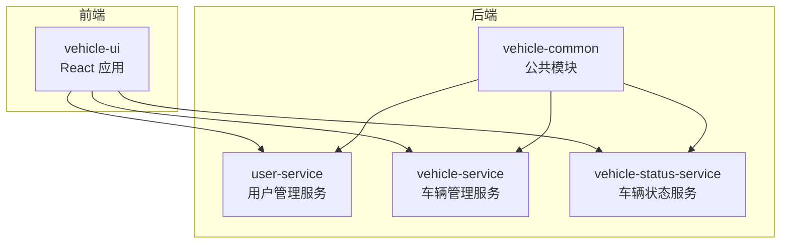
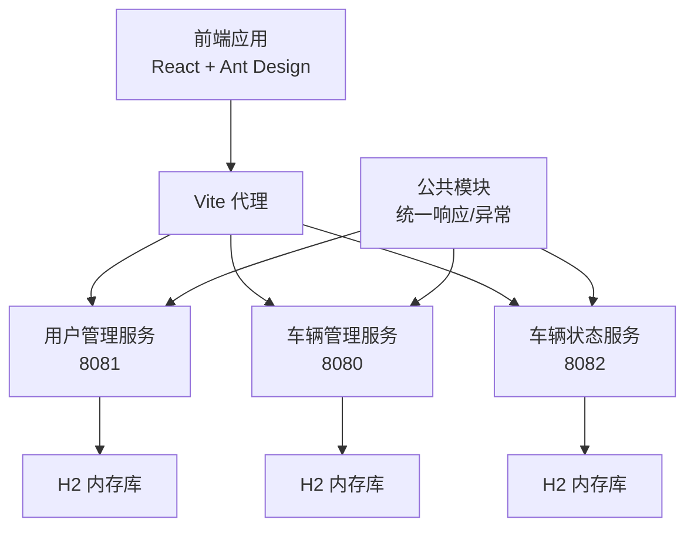
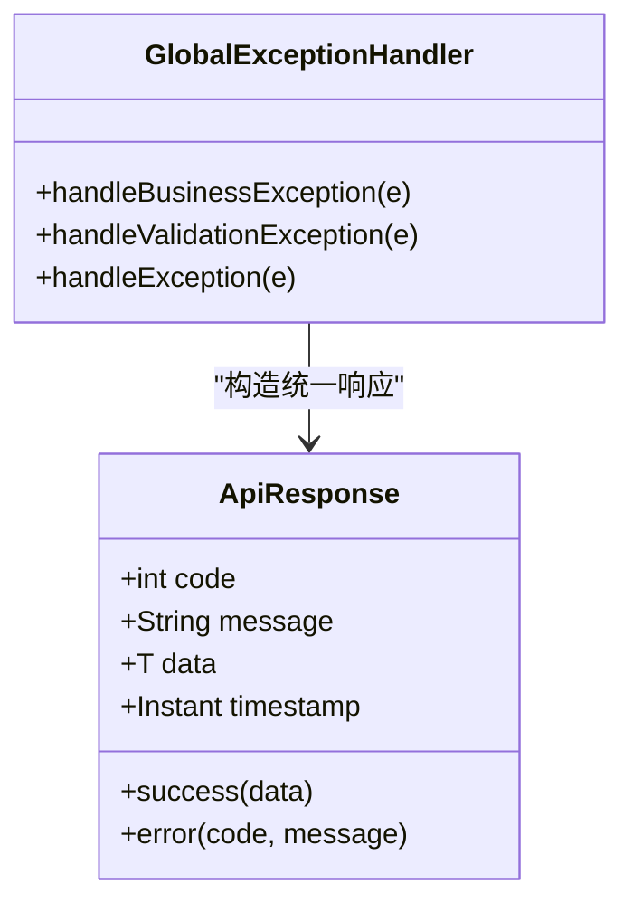
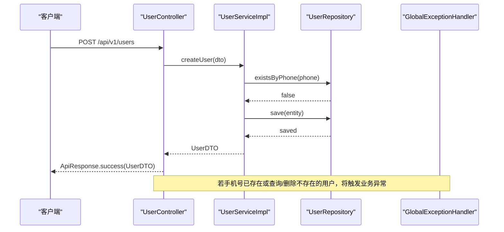
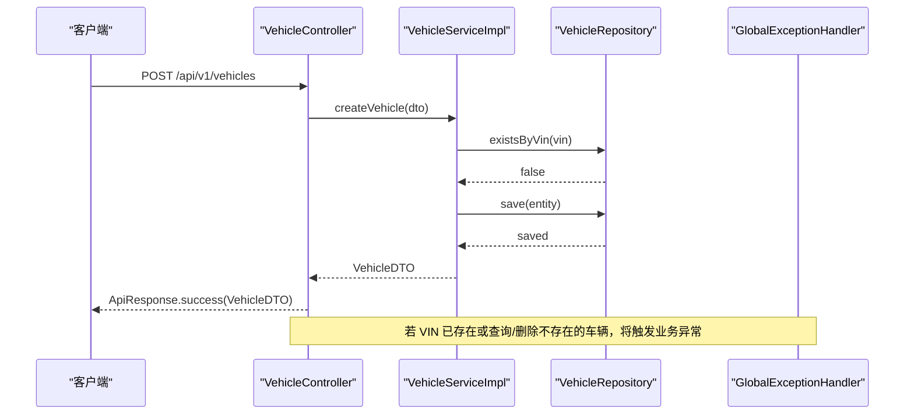
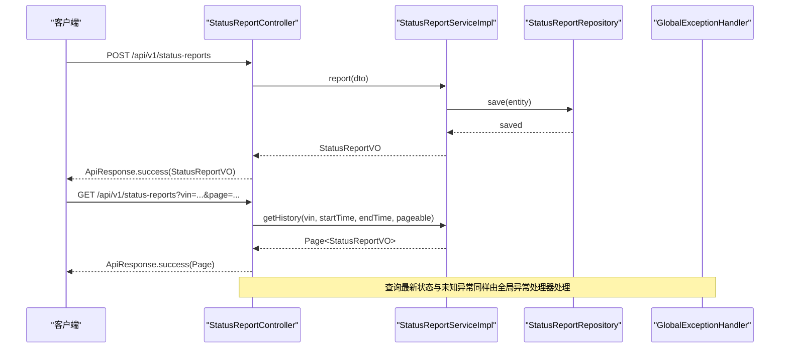
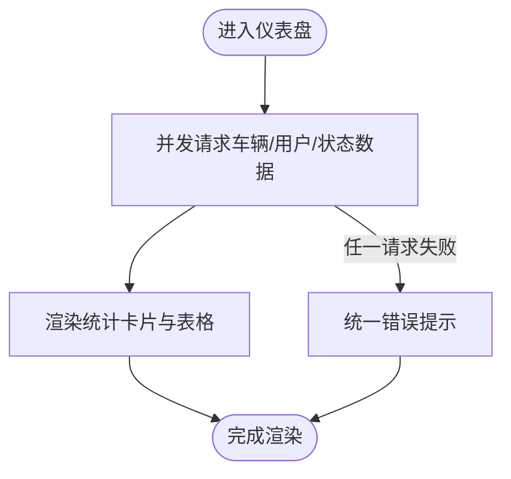
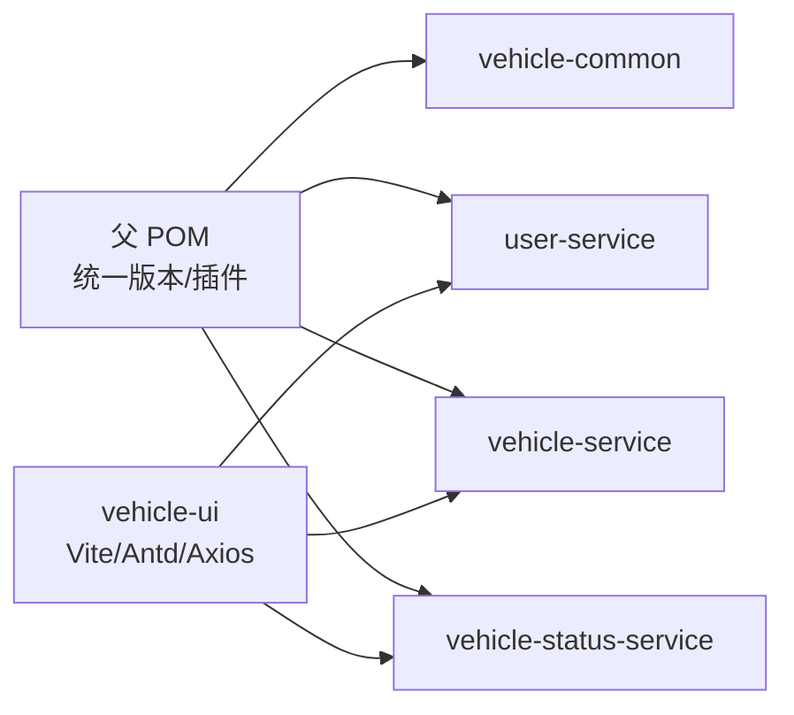

# 项目概述

<cite>
**本文引用的文件**
- [README.md](file://README.md)
- [pom.xml](file://pom.xml)
- [user-service/pom.xml](file://user-service/pom.xml)
- [vehicle-service/pom.xml](file://vehicle-service/pom.xml)
- [vehicle-status-service/pom.xml](file://vehicle-status-service/pom.xml)
- [vehicle-ui/package.json](file://vehicle-ui/package.json)
- [user-service/src/main/java/com/wenjie/cloud/user/UserServiceApplication.java](file://user-service/src/main/java/com/wenjie/cloud/user/UserServiceApplication.java)
- [vehicle-service/src/main/java/com/wenjie/cloud/vehicle/VehicleServiceApplication.java](file://vehicle-service/src/main/java/com/wenjie/cloud/vehicle/VehicleServiceApplication.java)
- [vehicle-status-service/src/main/java/com/wenjie/cloud/vehiclestatus/VehicleStatusServiceApplication.java](file://vehicle-status-service/src/main/java/com/wenjie/cloud/vehiclestatus/VehicleStatusServiceApplication.java)
- [vehicle-common/src/main/java/com/wenjie/cloud/common/dto/ApiResponse.java](file://vehicle-common/src/main/java/com/wenjie/cloud/common/dto/ApiResponse.java)
- [vehicle-common/src/main/java/com/wenjie/cloud/common/exception/GlobalExceptionHandler.java](file://vehicle-common/src/main/java/com/wenjie/cloud/common/exception/GlobalExceptionHandler.java)
- [user-service/src/main/java/com/wenjie/cloud/user/controller/UserController.java](file://user-service/src/main/java/com/wenjie/cloud/user/controller/UserController.java)
- [vehicle-service/src/main/java/com/wenjie/cloud/vehicle/controller/VehicleController.java](file://vehicle-service/src/main/java/com/wenjie/cloud/vehicle/controller/VehicleController.java)
- [vehicle-status-service/src/main/java/com/wenjie/cloud/vehiclestatus/controller/StatusReportController.java](file://vehicle-status-service/src/main/java/com/wenjie/cloud/vehiclestatus/controller/StatusReportController.java)
- [user-service/src/main/java/com/wenjie/cloud/user/service/impl/UserServiceImpl.java](file://user-service/src/main/java/com/wenjie/cloud/user/service/impl/UserServiceImpl.java)
- [vehicle-service/src/main/java/com/wenjie/cloud/vehicle/service/impl/VehicleServiceImpl.java](file://vehicle-service/src/main/java/com/wenjie/cloud/vehicle/service/impl/VehicleServiceImpl.java)
- [vehicle-ui/src/App.jsx](file://vehicle-ui/src/App.jsx)
- [vehicle-ui/src/pages/Dashboard.jsx](file://vehicle-ui/src/pages/Dashboard.jsx)
</cite>

## 目录
1. [引言](#引言)
2. [项目结构](#项目结构)
3. [核心组件](#核心组件)
4. [架构总览](#架构总览)
5. [详细组件分析](#详细组件分析)
6. [依赖分析](#依赖分析)
7. [性能考虑](#性能考虑)
8. [故障排查指南](#故障排查指南)
9. [结论](#结论)
10. [附录](#附录)

## 引言
本项目是一个面向车联网场景的云平台演示系统，采用前后端分离与微服务架构设计，目标是提供清晰的用户管理、车辆管理与车辆状态监控能力。后端以 Spring Boot 多模块为核心，前端使用 React + Ant Design，结合 H2 内存数据库与统一响应/异常处理机制，帮助开发者快速理解并扩展微服务架构实践。

## 项目结构
项目采用多模块 Maven 结构，父 POM 统一管理版本与插件，子模块按功能拆分为：
- vehicle-common：公共模块，提供统一响应、异常处理等基础能力
- user-service：用户管理服务（端口 8081）
- vehicle-service：车辆管理服务（端口 8080）
- vehicle-status-service：车辆状态上报与查询服务（端口 8082）
- vehicle-ui：React 前端应用（端口 5173）

图表来源
- [pom.xml:36-43](file://pom.xml#L36-L43)
- [user-service/pom.xml:18-23](file://user-service/pom.xml#L18-L23)
- [vehicle-service/pom.xml:18-23](file://vehicle-service/pom.xml#L18-L23)
- [vehicle-status-service/pom.xml:18-23](file://vehicle-status-service/pom.xml#L18-L23)

章节来源
- [README.md:19-27](file://README.md#L19-L27)
- [pom.xml:36-43](file://pom.xml#L36-L43)

## 核心组件
- 统一响应与异常处理
  - 统一响应封装：提供统一的响应结构，包含状态码、消息、数据与时间戳
  - 全局异常处理：拦截业务异常、参数校验异常与未知异常，统一返回标准响应
- 用户管理服务
  - 提供用户增删改查接口，包含手机号唯一性校验与参数校验
- 车辆管理服务
  - 提供车辆增删改查接口，包含 VIN 唯一性校验与参数校验
- 车辆状态服务
  - 支持状态上报、按 VIN 分页查询历史、查询单车最新状态与全量最新状态
- 前端应用
  - 基于 React + Ant Design 的单页应用，路由导航至仪表盘、车辆管理、用户管理与状态页面

章节来源
- [vehicle-common/src/main/java/com/wenjie/cloud/common/dto/ApiResponse.java:12-51](file://vehicle-common/src/main/java/com/wenjie/cloud/common/dto/ApiResponse.java#L12-L51)
- [vehicle-common/src/main/java/com/wenjie/cloud/common/exception/GlobalExceptionHandler.java:19-55](file://vehicle-common/src/main/java/com/wenjie/cloud/common/exception/GlobalExceptionHandler.java#L19-L55)
- [user-service/src/main/java/com/wenjie/cloud/user/controller/UserController.java:21-60](file://user-service/src/main/java/com/wenjie/cloud/user/controller/UserController.java#L21-L60)
- [vehicle-service/src/main/java/com/wenjie/cloud/vehicle/controller/VehicleController.java:21-61](file://vehicle-service/src/main/java/com/wenjie/cloud/vehicle/controller/VehicleController.java#L21-L61)
- [vehicle-status-service/src/main/java/com/wenjie/cloud/vehiclestatus/controller/StatusReportController.java:26-71](file://vehicle-status-service/src/main/java/com/wenjie/cloud/vehiclestatus/controller/StatusReportController.java#L26-L71)
- [vehicle-ui/src/App.jsx:24-78](file://vehicle-ui/src/App.jsx#L24-L78)

## 架构总览
系统采用微服务与前后端分离架构：
- 微服务层：用户、车辆、状态三个服务独立部署，职责清晰，便于扩展与演进
- 公共层：统一响应与异常处理下沉至公共模块，减少重复代码
- 前端层：React 应用通过代理方式调用后端服务，提升开发体验
- 数据层：每个服务使用 H2 内存数据库，启动即初始化测试数据，降低环境复杂度

图表来源
- [README.md:44-84](file://README.md#L44-L84)
- [user-service/pom.xml:43-48](file://user-service/pom.xml#L43-L48)
- [vehicle-service/pom.xml:43-48](file://vehicle-service/pom.xml#L43-L48)
- [vehicle-status-service/pom.xml:43-48](file://vehicle-status-service/pom.xml#L43-L48)

## 详细组件分析

### 统一响应与异常处理
- 统一响应结构：包含 code、message、data、timestamp 字段，成功响应 code 为 0
- 全局异常处理：拦截业务异常、参数校验异常与未知异常，统一返回标准响应

图表来源
- [vehicle-common/src/main/java/com/wenjie/cloud/common/dto/ApiResponse.java:12-51](file://vehicle-common/src/main/java/com/wenjie/cloud/common/dto/ApiResponse.java#L12-L51)
- [vehicle-common/src/main/java/com/wenjie/cloud/common/exception/GlobalExceptionHandler.java:19-55](file://vehicle-common/src/main/java/com/wenjie/cloud/common/exception/GlobalExceptionHandler.java#L19-L55)

章节来源
- [vehicle-common/src/main/java/com/wenjie/cloud/common/dto/ApiResponse.java:12-51](file://vehicle-common/src/main/java/com/wenjie/cloud/common/dto/ApiResponse.java#L12-L51)
- [vehicle-common/src/main/java/com/wenjie/cloud/common/exception/GlobalExceptionHandler.java:19-55](file://vehicle-common/src/main/java/com/wenjie/cloud/common/exception/GlobalExceptionHandler.java#L19-L55)

### 用户管理服务
- 控制器：提供创建、查询、删除用户接口，基于 DTO 进行参数校验
- 服务实现：检查手机号唯一性，保存用户并记录日志；查询与删除时进行存在性校验
- 异常处理：业务异常通过全局异常处理器统一返回

图表来源
- [user-service/src/main/java/com/wenjie/cloud/user/controller/UserController.java:21-60](file://user-service/src/main/java/com/wenjie/cloud/user/controller/UserController.java#L21-L60)
- [user-service/src/main/java/com/wenjie/cloud/user/service/impl/UserServiceImpl.java:20-80](file://user-service/src/main/java/com/wenjie/cloud/user/service/impl/UserServiceImpl.java#L20-L80)
- [vehicle-common/src/main/java/com/wenjie/cloud/common/exception/GlobalExceptionHandler.java:26-31](file://vehicle-common/src/main/java/com/wenjie/cloud/common/exception/GlobalExceptionHandler.java#L26-L31)

章节来源
- [user-service/src/main/java/com/wenjie/cloud/user/controller/UserController.java:21-60](file://user-service/src/main/java/com/wenjie/cloud/user/controller/UserController.java#L21-L60)
- [user-service/src/main/java/com/wenjie/cloud/user/service/impl/UserServiceImpl.java:20-80](file://user-service/src/main/java/com/wenjie/cloud/user/service/impl/UserServiceImpl.java#L20-L80)

### 车辆管理服务
- 控制器：提供创建、查询、删除车辆接口，基于 DTO 进行参数校验
- 服务实现：检查 VIN 唯一性，保存车辆并记录日志；查询与删除时进行存在性校验
- 异常处理：业务异常通过全局异常处理器统一返回

图表来源
- [vehicle-service/src/main/java/com/wenjie/cloud/vehicle/controller/VehicleController.java:21-61](file://vehicle-service/src/main/java/com/wenjie/cloud/vehicle/controller/VehicleController.java#L21-L61)
- [vehicle-service/src/main/java/com/wenjie/cloud/vehicle/service/impl/VehicleServiceImpl.java:17-82](file://vehicle-service/src/main/java/com/wenjie/cloud/vehicle/service/impl/VehicleServiceImpl.java#L17-L82)
- [vehicle-common/src/main/java/com/wenjie/cloud/common/exception/GlobalExceptionHandler.java:26-31](file://vehicle-common/src/main/java/com/wenjie/cloud/common/exception/GlobalExceptionHandler.java#L26-L31)

章节来源
- [vehicle-service/src/main/java/com/wenjie/cloud/vehicle/controller/VehicleController.java:21-61](file://vehicle-service/src/main/java/com/wenjie/cloud/vehicle/controller/VehicleController.java#L21-L61)
- [vehicle-service/src/main/java/com/wenjie/cloud/vehicle/service/impl/VehicleServiceImpl.java:17-82](file://vehicle-service/src/main/java/com/wenjie/cloud/vehicle/service/impl/VehicleServiceImpl.java#L17-L82)

### 车辆状态服务
- 控制器：支持状态上报、按 VIN 分页查询历史、查询单车最新状态与全量最新状态
- 服务实现：基于分页与排序策略，提供历史查询与最新状态聚合能力
- 异常处理：业务异常通过全局异常处理器统一返回

图表来源
- [vehicle-status-service/src/main/java/com/wenjie/cloud/vehiclestatus/controller/StatusReportController.java:26-71](file://vehicle-status-service/src/main/java/com/wenjie/cloud/vehiclestatus/controller/StatusReportController.java#L26-L71)

章节来源
- [vehicle-status-service/src/main/java/com/wenjie/cloud/vehiclestatus/controller/StatusReportController.java:26-71](file://vehicle-status-service/src/main/java/com/wenjie/cloud/vehiclestatus/controller/StatusReportController.java#L26-L71)

### 前端应用与仪表盘
- 导航与布局：基于 Ant Design Layout 与 Menu，提供侧边栏导航与内容区域
- 仪表盘：并发拉取车辆、用户与状态数据，计算统计指标并展示
- API 调用：通过 axios 发起请求，代理到后端服务

图表来源
- [vehicle-ui/src/pages/Dashboard.jsx:14-32](file://vehicle-ui/src/pages/Dashboard.jsx#L14-L32)
- [vehicle-ui/src/App.jsx:24-78](file://vehicle-ui/src/App.jsx#L24-L78)

章节来源
- [vehicle-ui/src/App.jsx:24-78](file://vehicle-ui/src/App.jsx#L24-L78)
- [vehicle-ui/src/pages/Dashboard.jsx:14-140](file://vehicle-ui/src/pages/Dashboard.jsx#L14-L140)

## 依赖分析
- 父 POM 统一管理版本与插件，子模块按需引入公共模块与 Spring 生态依赖
- 前端使用 Vite 作为构建工具，Ant Design 提供 UI 组件库，Axios 用于 HTTP 请求

图表来源
- [pom.xml:46-67](file://pom.xml#L46-L67)
- [user-service/pom.xml:18-48](file://user-service/pom.xml#L18-L48)
- [vehicle-service/pom.xml:18-48](file://vehicle-service/pom.xml#L18-L48)
- [vehicle-status-service/pom.xml:18-48](file://vehicle-status-service/pom.xml#L18-L48)
- [vehicle-ui/package.json:6-30](file://vehicle-ui/package.json#L6-L30)

章节来源
- [pom.xml:46-67](file://pom.xml#L46-L67)
- [vehicle-ui/package.json:6-30](file://vehicle-ui/package.json#L6-L30)

## 性能考虑
- 数据库选择：当前使用 H2 内存库，适合演示与本地开发；生产建议迁移到持久化数据库并启用连接池
- 并发与分页：状态查询支持分页与排序，避免一次性加载大量历史数据
- 前端渲染：仪表盘使用并发请求与轻量计算，确保首屏渲染效率
- 日志与异常：统一异常处理减少重复逻辑，提高可维护性

## 故障排查指南
- 启动顺序
  - 先构建后端：执行 Maven 安装命令
  - 分别启动用户服务（8081）与车辆服务（8080），再启动前端（5173）
- API 访问
  - 用户服务：POST/GET/DELETE /api/v1/users
  - 车辆服务：POST/GET/DELETE /api/v1/vehicles
  - 状态服务：POST /api/v1/status-reports 与分页查询接口
- H2 控制台
  - 车辆服务：http://localhost:8080/h2-console
  - 用户服务：http://localhost:8081/h2-console
- 统一响应
  - 成功响应 code 为 0；业务异常通过全局异常处理器返回标准错误码与消息

章节来源
- [README.md:56-84](file://README.md#L56-L84)
- [README.md:134-151](file://README.md#L134-L151)
- [vehicle-common/src/main/java/com/wenjie/cloud/common/exception/GlobalExceptionHandler.java:26-54](file://vehicle-common/src/main/java/com/wenjie/cloud/common/exception/GlobalExceptionHandler.java#L26-L54)

## 结论
本项目通过清晰的微服务拆分与前后端分离架构，提供了用户管理、车辆管理与状态监控的基础能力。借助统一响应与异常处理机制，系统具备良好的一致性与可维护性；结合 H2 内存数据库与 React 前端，能够快速验证业务流程与交互体验。建议在生产环境中替换为持久化数据库与网关层，并完善鉴权与监控体系。

## 附录
- 快速启动步骤
  - 环境要求：JDK 11+、Maven 3.8+、Node.js 18+
  - 构建后端：mvn clean install
  - 启动后端服务：分别在不同终端启动用户服务与车辆服务
  - 启动前端：cd vehicle-ui && npm install && npm run dev
- 技术栈概览
  - 后端：Spring Boot 2.7.18、Java 11、H2 内存库、Spring Data JPA、Lombok/MapStruct
  - 前端：React 19、Ant Design 6、Vite 8、Axios、React Router

章节来源
- [README.md:48-84](file://README.md#L48-L84)
- [README.md:5-17](file://README.md#L5-L17)