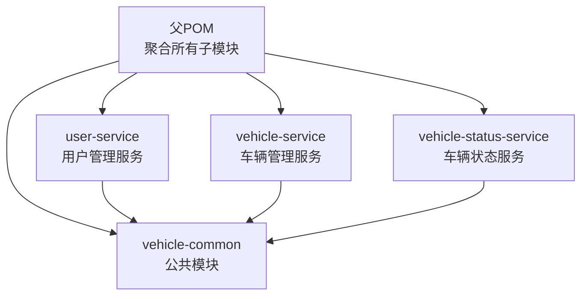
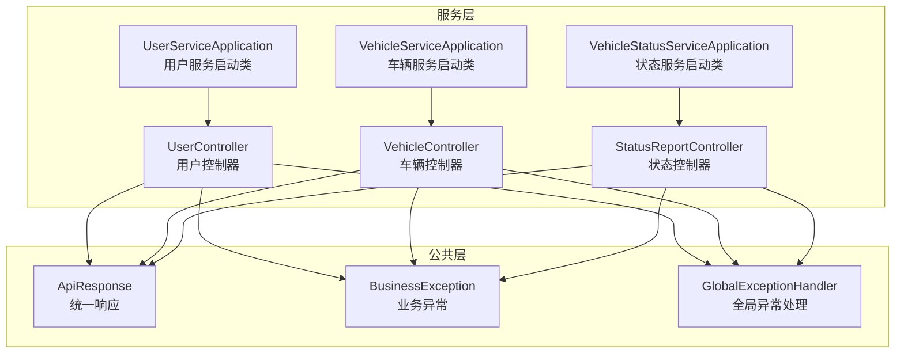
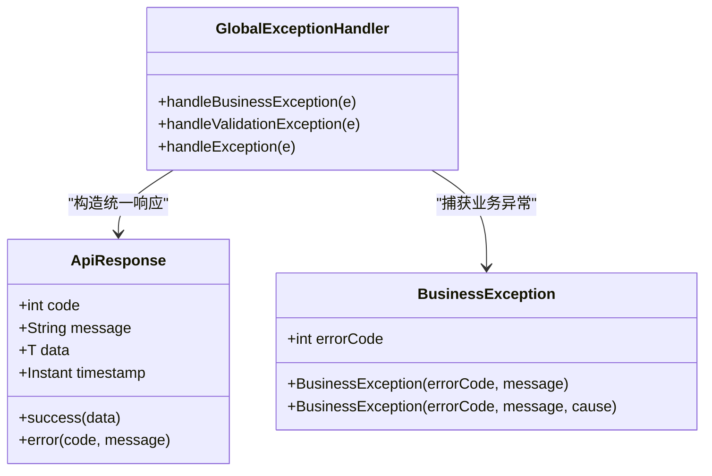
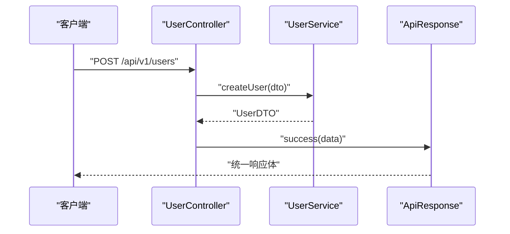
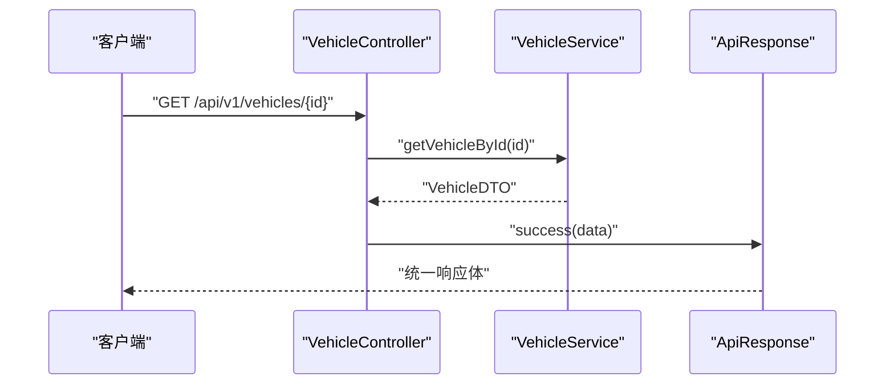
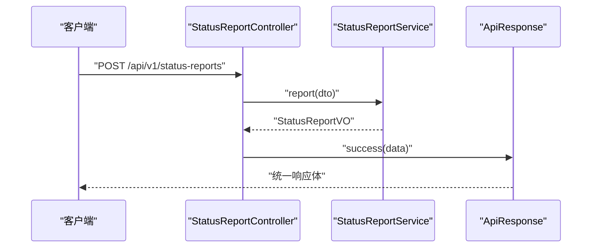
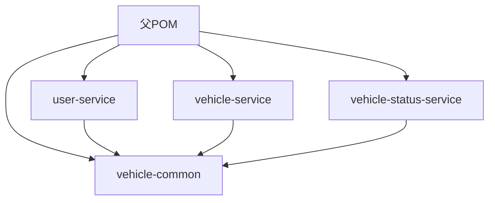

# 项目结构说明

<cite>
**本文档引用的文件**
- [pom.xml](file://pom.xml)
- [vehicle-common/pom.xml](file://vehicle-common/pom.xml)
- [user-service/pom.xml](file://user-service/pom.xml)
- [vehicle-service/pom.xml](file://vehicle-service/pom.xml)
- [vehicle-status-service/pom.xml](file://vehicle-status-service/pom.xml)
- [vehicle-common/src/main/java/com/wenjie/cloud/common/dto/ApiResponse.java](file://vehicle-common/src/main/java/com/wenjie/cloud/common/dto/ApiResponse.java)
- [vehicle-common/src/main/java/com/wenjie/cloud/common/exception/BusinessException.java](file://vehicle-common/src/main/java/com/wenjie/cloud/common/exception/BusinessException.java)
- [vehicle-common/src/main/java/com/wenjie/cloud/common/exception/GlobalExceptionHandler.java](file://vehicle-common/src/main/java/com/wenjie/cloud/common/exception/GlobalExceptionHandler.java)
- [user-service/src/main/java/com/wenjie/cloud/user/UserServiceApplication.java](file://user-service/src/main/java/com/wenjie/cloud/user/UserServiceApplication.java)
- [vehicle-service/src/main/java/com/wenjie/cloud/vehicle/VehicleServiceApplication.java](file://vehicle-service/src/main/java/com/wenjie/cloud/vehicle/VehicleServiceApplication.java)
- [vehicle-status-service/src/main/java/com/wenjie/cloud/vehiclestatus/VehicleStatusServiceApplication.java](file://vehicle-status-service/src/main/java/com/wenjie/cloud/vehiclestatus/VehicleStatusServiceApplication.java)
- [user-service/src/main/java/com/wenjie/cloud/user/controller/UserController.java](file://user-service/src/main/java/com/wenjie/cloud/user/controller/UserController.java)
- [vehicle-service/src/main/java/com/wenjie/cloud/vehicle/controller/VehicleController.java](file://vehicle-service/src/main/java/com/wenjie/cloud/vehicle/controller/VehicleController.java)
- [vehicle-status-service/src/main/java/com/wenjie/cloud/vehiclestatus/controller/StatusReportController.java](file://vehicle-status-service/src/main/java/com/wenjie/cloud/vehiclestatus/controller/StatusReportController.java)
- [user-service/src/main/resources/application.yml](file://user-service/src/main/resources/application.yml)
- [vehicle-service/src/main/resources/application.yml](file://vehicle-service/src/main/resources/application.yml)
- [vehicle-status-service/src/main/resources/application.yml](file://vehicle-status-service/src/main/resources/application.yml)
</cite>

## 目录
1. [简介](#简介)
2. [项目结构](#项目结构)
3. [核心组件](#核心组件)
4. [架构总览](#架构总览)
5. [详细组件分析](#详细组件分析)
6. [依赖分析](#依赖分析)
7. [性能考虑](#性能考虑)
8. [故障排除指南](#故障排除指南)
9. [结论](#结论)
10. [附录](#附录)

## 简介
本项目是一个基于 Spring Boot 的 Maven 多模块微服务演示工程，围绕车联网场景构建，包含统一的公共模块与三个独立的服务模块。公共模块提供统一响应封装、全局异常处理以及通用的业务异常定义；用户管理服务负责用户 CRUD；车辆管理服务负责车辆 CRUD；车辆状态服务负责状态上报与查询。项目采用模块化设计，便于扩展与维护。

## 项目结构
项目采用 Maven 聚合工程组织，顶层 POM 声明子模块并集中管理依赖与插件；各子模块通过继承父 POM 的依赖管理，避免版本冲突；公共模块 vehicle-common 向其他服务模块提供统一的响应与异常处理能力；服务模块各自包含标准的 Spring Boot 目录结构（controller、service、repository、entity、dto 等），并通过 application.yml 配置端口与数据源。

**图表来源**
- [pom.xml:36-43](file://pom.xml#L36-L43)
- [vehicle-common/pom.xml:14](file://vehicle-common/pom.xml#L14)
- [user-service/pom.xml:18-23](file://user-service/pom.xml#L18-L23)
- [vehicle-service/pom.xml:18-23](file://vehicle-service/pom.xml#L18-L23)
- [vehicle-status-service/pom.xml:18-23](file://vehicle-status-service/pom.xml#L18-L23)

**章节来源**
- [pom.xml:1-119](file://pom.xml#L1-L119)
- [vehicle-common/pom.xml:1-33](file://vehicle-common/pom.xml#L1-L33)
- [user-service/pom.xml:1-61](file://user-service/pom.xml#L1-L61)
- [vehicle-service/pom.xml:1-61](file://vehicle-service/pom.xml#L1-L61)
- [vehicle-status-service/pom.xml:1-61](file://vehicle-status-service/pom.xml#L1-L61)

## 核心组件
- 公共模块（vehicle-common）
  - 统一响应封装：提供统一的响应体结构与成功/失败工厂方法，确保各服务对外接口一致。
  - 全局异常处理：通过@RestControllerAdvice拦截业务异常与参数校验异常，统一转换为统一响应格式。
  - 业务异常定义：定义可预期的业务错误码与消息，便于上层统一处理。
- 用户管理服务（user-service）
  - 启动类：标准 Spring Boot 启动入口，扫描基础包。
  - 控制器：提供用户相关的 REST 接口，使用统一响应与参数校验。
  - 数据源：使用内存数据库 H2，便于本地开发与测试。
- 车辆管理服务（vehicle-service）
  - 启动类：标准 Spring Boot 启动入口，扫描基础包。
  - 控制器：提供车辆相关的 REST 接口，使用统一响应与参数校验。
  - 数据源：使用内存数据库 H2，便于本地开发与测试。
- 车辆状态服务（vehicle-status-service）
  - 启动类：标准 Spring Boot 启动入口，扫描基础包。
  - 控制器：提供状态上报与查询接口，支持分页与时间范围筛选。
  - 数据源：使用内存数据库 H2，便于本地开发与测试。

**章节来源**
- [vehicle-common/src/main/java/com/wenjie/cloud/common/dto/ApiResponse.java:1-52](file://vehicle-common/src/main/java/com/wenjie/cloud/common/dto/ApiResponse.java#L1-L52)
- [vehicle-common/src/main/java/com/wenjie/cloud/common/exception/BusinessException.java:1-27](file://vehicle-common/src/main/java/com/wenjie/cloud/common/exception/BusinessException.java#L1-L27)
- [vehicle-common/src/main/java/com/wenjie/cloud/common/exception/GlobalExceptionHandler.java:1-56](file://vehicle-common/src/main/java/com/wenjie/cloud/common/exception/GlobalExceptionHandler.java#L1-L56)
- [user-service/src/main/java/com/wenjie/cloud/user/UserServiceApplication.java:1-16](file://user-service/src/main/java/com/wenjie/cloud/user/UserServiceApplication.java#L1-L16)
- [vehicle-service/src/main/java/com/wenjie/cloud/vehicle/VehicleServiceApplication.java:1-16](file://vehicle-service/src/main/java/com/wenjie/cloud/vehicle/VehicleServiceApplication.java#L1-L16)
- [vehicle-status-service/src/main/java/com/wenjie/cloud/vehiclestatus/VehicleStatusServiceApplication.java:1-16](file://vehicle-status-service/src/main/java/com/wenjie/cloud/vehiclestatus/VehicleStatusServiceApplication.java#L1-L16)
- [user-service/src/main/java/com/wenjie/cloud/user/controller/UserController.java:1-60](file://user-service/src/main/java/com/wenjie/cloud/user/controller/UserController.java#L1-L60)
- [vehicle-service/src/main/java/com/wenjie/cloud/vehicle/controller/VehicleController.java:1-61](file://vehicle-service/src/main/java/com/wenjie/cloud/vehicle/controller/VehicleController.java#L1-L61)
- [vehicle-status-service/src/main/java/com/wenjie/cloud/vehiclestatus/controller/StatusReportController.java:1-71](file://vehicle-status-service/src/main/java/com/wenjie/cloud/vehiclestatus/controller/StatusReportController.java#L1-L71)

## 架构总览
系统采用“公共模块 + 多服务模块”的分层架构。公共模块提供横切能力（统一响应、异常处理、业务异常），服务模块专注于各自的领域逻辑。服务之间通过 HTTP REST API 进行交互，当前仓库中未包含网关模块，服务间调用可直接通过服务名或 IP+端口进行。

**图表来源**
- [vehicle-common/src/main/java/com/wenjie/cloud/common/dto/ApiResponse.java:12-51](file://vehicle-common/src/main/java/com/wenjie/cloud/common/dto/ApiResponse.java#L12-L51)
- [vehicle-common/src/main/java/com/wenjie/cloud/common/exception/BusinessException.java:11-26](file://vehicle-common/src/main/java/com/wenjie/cloud/common/exception/BusinessException.java#L11-L26)
- [vehicle-common/src/main/java/com/wenjie/cloud/common/exception/GlobalExceptionHandler.java:19-55](file://vehicle-common/src/main/java/com/wenjie/cloud/common/exception/GlobalExceptionHandler.java#L19-L55)
- [user-service/src/main/java/com/wenjie/cloud/user/UserServiceApplication.java:9](file://user-service/src/main/java/com/wenjie/cloud/user/UserServiceApplication.java#L9)
- [vehicle-service/src/main/java/com/wenjie/cloud/vehicle/VehicleServiceApplication.java:9](file://vehicle-service/src/main/java/com/wenjie/cloud/vehicle/VehicleServiceApplication.java#L9)
- [vehicle-status-service/src/main/java/com/wenjie/cloud/vehiclestatus/VehicleStatusServiceApplication.java:9](file://vehicle-status-service/src/main/java/com/wenjie/cloud/vehiclestatus/VehicleStatusServiceApplication.java#L9)
- [user-service/src/main/java/com/wenjie/cloud/user/controller/UserController.java:21-60](file://user-service/src/main/java/com/wenjie/cloud/user/controller/UserController.java#L21-L60)
- [vehicle-service/src/main/java/com/wenjie/cloud/vehicle/controller/VehicleController.java:21-61](file://vehicle-service/src/main/java/com/wenjie/cloud/vehicle/controller/VehicleController.java#L21-L61)
- [vehicle-status-service/src/main/java/com/wenjie/cloud/vehiclestatus/controller/StatusReportController.java:26-71](file://vehicle-status-service/src/main/java/com/wenjie/cloud/vehiclestatus/controller/StatusReportController.java#L26-L71)

## 详细组件分析

### 公共模块（vehicle-common）
- 统一响应封装
  - 结构包含状态码、消息、数据与时间戳，提供成功与失败工厂方法，简化控制器返回。
- 全局异常处理
  - 拦截业务异常与参数校验异常，统一转换为统一响应；对未知异常返回系统错误。
- 业务异常定义
  - 定义带错误码的运行时异常，便于上层统一处理与日志记录。

**图表来源**
- [vehicle-common/src/main/java/com/wenjie/cloud/common/dto/ApiResponse.java:12-51](file://vehicle-common/src/main/java/com/wenjie/cloud/common/dto/ApiResponse.java#L12-L51)
- [vehicle-common/src/main/java/com/wenjie/cloud/common/exception/BusinessException.java:11-26](file://vehicle-common/src/main/java/com/wenjie/cloud/common/exception/BusinessException.java#L11-L26)
- [vehicle-common/src/main/java/com/wenjie/cloud/common/exception/GlobalExceptionHandler.java:19-55](file://vehicle-common/src/main/java/com/wenjie/cloud/common/exception/GlobalExceptionHandler.java#L19-L55)

**章节来源**
- [vehicle-common/src/main/java/com/wenjie/cloud/common/dto/ApiResponse.java:1-52](file://vehicle-common/src/main/java/com/wenjie/cloud/common/dto/ApiResponse.java#L1-L52)
- [vehicle-common/src/main/java/com/wenjie/cloud/common/exception/BusinessException.java:1-27](file://vehicle-common/src/main/java/com/wenjie/cloud/common/exception/BusinessException.java#L1-L27)
- [vehicle-common/src/main/java/com/wenjie/cloud/common/exception/GlobalExceptionHandler.java:1-56](file://vehicle-common/src/main/java/com/wenjie/cloud/common/exception/GlobalExceptionHandler.java#L1-L56)

### 用户管理服务（user-service）
- 启动类
  - 使用 Spring Boot 注解声明应用入口，扫描基础包以发现组件。
- 控制器
  - 提供用户创建、查询、列表与删除接口，使用统一响应与参数校验。
- 数据源
  - 使用 H2 内存数据库，DDL 自动建表与删表，SQL 初始化模式为 always。

**图表来源**
- [user-service/src/main/java/com/wenjie/cloud/user/controller/UserController.java:21-60](file://user-service/src/main/java/com/wenjie/cloud/user/controller/UserController.java#L21-L60)
- [vehicle-common/src/main/java/com/wenjie/cloud/common/dto/ApiResponse.java:41-43](file://vehicle-common/src/main/java/com/wenjie/cloud/common/dto/ApiResponse.java#L41-L43)

**章节来源**
- [user-service/src/main/java/com/wenjie/cloud/user/UserServiceApplication.java:1-16](file://user-service/src/main/java/com/wenjie/cloud/user/UserServiceApplication.java#L1-L16)
- [user-service/src/main/java/com/wenjie/cloud/user/controller/UserController.java:1-60](file://user-service/src/main/java/com/wenjie/cloud/user/controller/UserController.java#L1-L60)
- [user-service/src/main/resources/application.yml:1-40](file://user-service/src/main/resources/application.yml#L1-L40)

### 车辆管理服务（vehicle-service）
- 启动类
  - 使用 Spring Boot 注解声明应用入口，扫描基础包以发现组件。
- 控制器
  - 提供车辆创建、查询、列表与删除接口，使用统一响应与参数校验。
- 数据源
  - 使用 H2 内存数据库，DDL 自动建表与删表，SQL 初始化模式为 always。

**图表来源**
- [vehicle-service/src/main/java/com/wenjie/cloud/vehicle/controller/VehicleController.java:21-61](file://vehicle-service/src/main/java/com/wenjie/cloud/vehicle/controller/VehicleController.java#L21-L61)
- [vehicle-common/src/main/java/com/wenjie/cloud/common/dto/ApiResponse.java:41-43](file://vehicle-common/src/main/java/com/wenjie/cloud/common/dto/ApiResponse.java#L41-L43)

**章节来源**
- [vehicle-service/src/main/java/com/wenjie/cloud/vehicle/VehicleServiceApplication.java:1-16](file://vehicle-service/src/main/java/com/wenjie/cloud/vehicle/VehicleServiceApplication.java#L1-L16)
- [vehicle-service/src/main/java/com/wenjie/cloud/vehicle/controller/VehicleController.java:1-61](file://vehicle-service/src/main/java/com/wenjie/cloud/vehicle/controller/VehicleController.java#L1-L61)
- [vehicle-service/src/main/resources/application.yml:1-40](file://vehicle-service/src/main/resources/application.yml#L1-L40)

### 车辆状态服务（vehicle-status-service）
- 启动类
  - 使用 Spring Boot 注解声明应用入口，扫描基础包以发现组件。
- 控制器
  - 提供状态上报、历史查询（分页与时间范围）、最新状态查询等接口。
- 数据源
  - 使用 H2 内存数据库，DDL 自动建表与删表，SQL 初始化模式为 always。

**图表来源**
- [vehicle-status-service/src/main/java/com/wenjie/cloud/vehiclestatus/controller/StatusReportController.java:26-71](file://vehicle-status-service/src/main/java/com/wenjie/cloud/vehiclestatus/controller/StatusReportController.java#L26-L71)
- [vehicle-common/src/main/java/com/wenjie/cloud/common/dto/ApiResponse.java:41-43](file://vehicle-common/src/main/java/com/wenjie/cloud/common/dto/ApiResponse.java#L41-L43)

**章节来源**
- [vehicle-status-service/src/main/java/com/wenjie/cloud/vehiclestatus/VehicleStatusServiceApplication.java:1-16](file://vehicle-status-service/src/main/java/com/wenjie/cloud/vehiclestatus/VehicleStatusServiceApplication.java#L1-L16)
- [vehicle-status-service/src/main/java/com/wenjie/cloud/vehiclestatus/controller/StatusReportController.java:1-71](file://vehicle-status-service/src/main/java/com/wenjie/cloud/vehiclestatus/controller/StatusReportController.java#L1-L71)
- [vehicle-status-service/src/main/resources/application.yml:1-30](file://vehicle-status-service/src/main/resources/application.yml#L1-L30)

## 依赖分析
- 依赖管理
  - 父 POM 统一管理内部模块版本与第三方依赖版本，子模块仅需声明坐标即可继承。
- 模块依赖
  - user-service、vehicle-service、vehicle-status-service 均依赖 vehicle-common，从而共享统一响应与异常处理。
- 插件管理
  - 父 POM 统一管理 spring-boot-maven-plugin 与编译插件，保证构建一致性。

**图表来源**
- [pom.xml:46-67](file://pom.xml#L46-L67)
- [user-service/pom.xml:18-23](file://user-service/pom.xml#L18-L23)
- [vehicle-service/pom.xml:18-23](file://vehicle-service/pom.xml#L18-L23)
- [vehicle-status-service/pom.xml:18-23](file://vehicle-status-service/pom.xml#L18-L23)

**章节来源**
- [pom.xml:1-119](file://pom.xml#L1-L119)
- [vehicle-common/pom.xml:1-33](file://vehicle-common/pom.xml#L1-L33)
- [user-service/pom.xml:1-61](file://user-service/pom.xml#L1-L61)
- [vehicle-service/pom.xml:1-61](file://vehicle-service/pom.xml#L1-L61)
- [vehicle-status-service/pom.xml:1-61](file://vehicle-status-service/pom.xml#L1-L61)

## 性能考虑
- 内存数据库选择
  - 开发阶段使用 H2 内存数据库，具备快速初始化与销毁的优势，适合本地联调与集成测试。
- 日志与 SQL 输出
  - 开启 SQL 显示与格式化输出，便于调试与性能分析；生产环境建议关闭或调整级别。
- 分页查询
  - 状态服务提供分页查询接口，建议在生产环境中设置合理的默认页大小与最大页大小，防止资源滥用。
- 异常处理开销
  - 全局异常处理器会增加少量异常分支处理成本，但显著提升错误处理一致性与可观测性。

## 故障排除指南
- 端口冲突
  - 各服务端口分别为 8080、8082、8083，若启动失败，请检查端口占用情况并修改 application.yml 中的 server.port。
- 数据库初始化
  - H2 控制台可通过 /h2-console 访问，确认表结构与初始数据是否正确加载。
- 统一响应与异常
  - 若出现非预期的 500 错误，检查全局异常处理器是否正确捕获业务异常；确认业务异常是否携带正确的错误码与消息。
- 参数校验
  - 参数校验失败会返回统一的错误响应，检查请求体与字段约束是否符合 DTO 定义。

**章节来源**
- [user-service/src/main/resources/application.yml:1-40](file://user-service/src/main/resources/application.yml#L1-L40)
- [vehicle-service/src/main/resources/application.yml:1-40](file://vehicle-service/src/main/resources/application.yml#L1-L40)
- [vehicle-status-service/src/main/resources/application.yml:1-30](file://vehicle-status-service/src/main/resources/application.yml#L1-L30)
- [vehicle-common/src/main/java/com/wenjie/cloud/common/exception/GlobalExceptionHandler.java:26-54](file://vehicle-common/src/main/java/com/wenjie/cloud/common/exception/GlobalExceptionHandler.java#L26-L54)

## 结论
本项目通过公共模块实现了横切能力的复用，服务模块聚焦于各自领域，形成高内聚低耦合的微服务架构。模块间通过 HTTP 接口协作，便于后续扩展与演进。建议在生产环境中替换为持久化数据库与统一网关，并完善监控与日志体系。

## 附录
- 启动顺序与端口
  - 车辆管理服务：端口 8080
  - 用户管理服务：端口 8082
  - 车辆状态服务：端口 8083
- 导航建议
  - 新增功能时优先在公共模块沉淀通用能力，再在服务模块中复用。
  - 控制器层统一返回统一响应，服务层抛出业务异常，交由全局异常处理器处理。
  - 本地开发可直接启动各服务模块的启动类，或通过 Maven 插件运行。